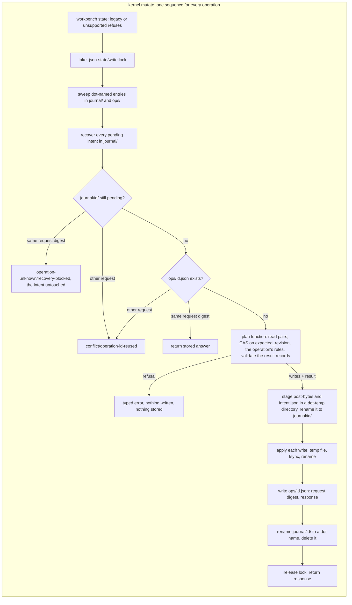
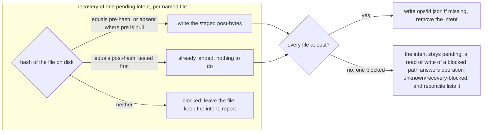
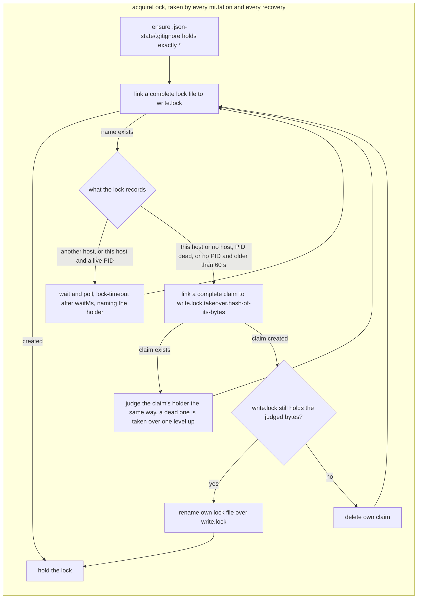
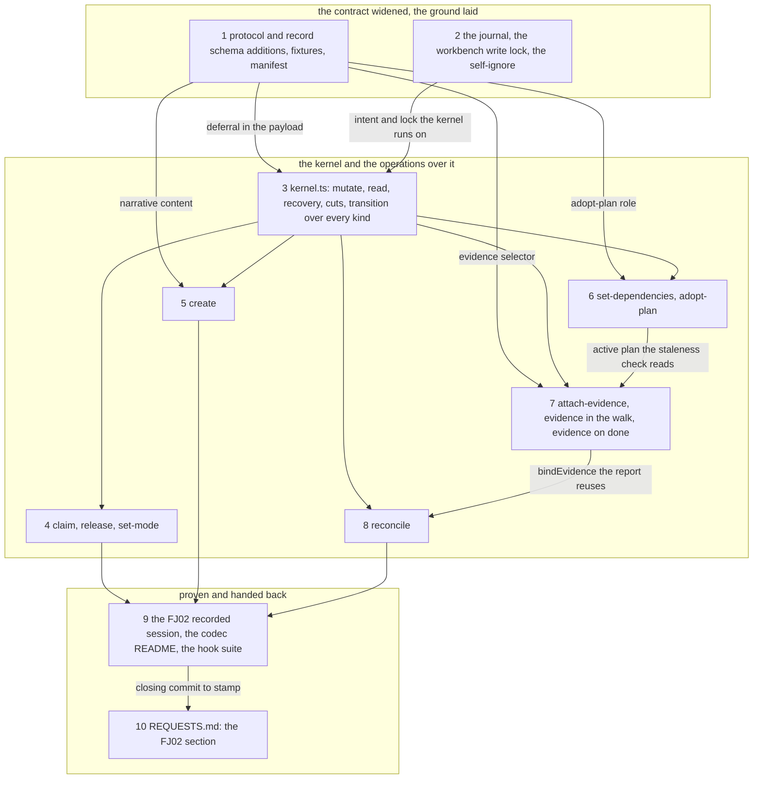
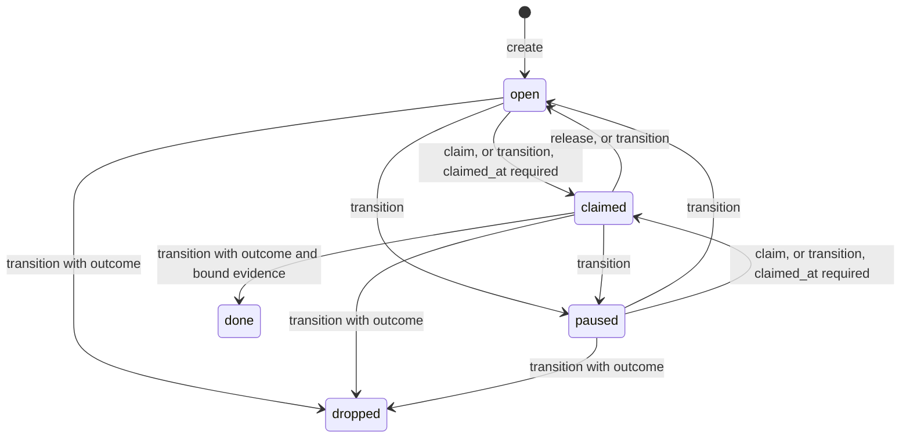

# Implementation Plan: FJ02, the operation kernel: one mutation path for every named operation, a durable intent journal with roll-forward recovery, and the section 9 checks a kernel answers, each pinned by a test

**Date:** 2026-09-28
**Revised:** 2026-09-29, applying the closed discussion `260929-0709_*_fj02-kernel-plan-and-three-open-choices.md` (its `## Recommendation`, claims C2 to C23); the architecture stands, the text below carries the corrections, and each is named by its claim where it lands.
**Status:** Complete — closed by the user on 2026-09-29; ten steps across e19e5abe, 20942d0c, ddb2f304, 6225a8cb, 23caa25e, 508633ec, cc3d82b0, d1a646d7, 72a7051b, 9764be4c; codec suite 16 files, 955 tests; bundle 511 869 bytes, sha256:9048e883e1a522597f782224cff7c1d444cc21ec5348c26dd9916fed68f3cc02; hook suite 1 008 of 1 009 (the monitor case). Accepted by the Prior side at Prior 38acd95 (`docs/design/fusion-fj02-prior-response.md`), which answered requests 16 to 22: 18 and 19 are approved kernel extensions for FJ02b, 22 is option (a), host-decided ownership, and 21 refutes this plan's step 10 claim that a pruned answer is safe under CAS (see the note under Open Questions).
**Spec:** Prior's `concept/fusion-json-workbench-spec.md`, surveyed at Prior `c512c4c` and re-surveyed at `590dca5` (section 4.3 gained one additive paragraph, the deferral shape FJ01b implemented), sections 3, 4.1 to 4.4, 6 and 9 (row FJ02: "CAS, Replay, geänderte Replay-Payload, Abbruch-/Recovery-Schnitte und manuelle Editkonflikte geprüft"); section 7 read only to keep the consumers out. Prior's three responses bind it: `docs/design/fusion-fj01b-prior-response.md` (commit `f18481c`: FJ01b accepted against `dc798133`, the deferral shape and both vocabularies confirmed, the live-owner lock test green against the pin, and "the earlier decisions stand: one codec process per request, and common authority/ownership/CAS rules for `transition`, `claim` and `release`"), `docs/design/fusion-fj01-prior-response.md` (items 8 and 9, `## Claim/release decision for FJ02`, `## Additional boundary evidence`) and `docs/design/fusion-fj00-prior-response.md` (3d, section 2's `running → claimed` note). `docs/design/prior-installed-module-bundles.md` `## Remaining integration` binds FJ02 in one sentence ("FJ02 remains responsible for its operation kernel/journal; the next record-service integration must use that shared codec, not introduce a competing writer for Fusion JSON"); its FH03/FH04 assets are outside this work package. No requirements-designer spec.
**Cross-references:** 260928-1338-json-control-data-and-markdown-artefacts.md, 260929-0709_*_fj02-kernel-plan-and-three-open-choices.md (closed discussion; this revision applies it), 260928-1341_*_plan-fj00-schemas-dto-mapping-and-reference-status-contract.md (closed), 260928-1550_*_plan-fj01-codec-port-bundle-wrapper-and-first-record-round-trip.md (closed), 260928-2110_*_plan-fj01b-fj00-follow-up-prior-rulings-applied-and-the-contract-frozen.md (closed), 260928-1735_*_does-transition-keep-walking-the-claim-and-release-edges-once-they-are-operations-of-their-own.md (answered, option 1: realised by step 4), 260928-2251_*_does-the-kernel-take-one-workbench-wide-write-lock-or-keep-a-lock-per-record-under-the-journal.md (open, recommendation option 1: step 2 needs the answer), 260928-2251_*_where-does-an-evidence-record-live-on-disk-so-that-attach-evidence-can-resolve-it.md (open, recommendation option 1: step 7 needs the answer), 260928-2222_*_the-reference-parser-admits-an-artefact-kind-the-closed-schema-enum-refuses.md (closed at `14ab3bb0`, nothing left for FJ02)
**Survey commit:** fusion `81ff10b6` on `fj-json-workbench` (the FJ01b closing commit; `14ab3bb0` is the last commit touching `codec/`, and `codec/` is unchanged at the revision, 2026-09-29), Prior `590dca5` (read-only; between `c512c4c` and it, `internal/fusionhost/` changed only in the adapter test's bundle pin, two lines of `codec_process_test.go`). `codec/dist/fusion-record.js`: 445 664 bytes, `sha256:f82aa558444a85e6ddf99ed8ba16346832a27e27207e00930d002c74a1727230`, the digest `REQUESTS.md` `## FJ01b` states and Prior re-pinned (FJ01b response item 12), so this plan starts from the revision both sides name. The three bounded surfaces stand where FJ01b left them (3 806 bytes, 25 559 bytes, 6 lines); nothing here touches them.
**Decidability:** The load-bearing question is *can a reader tell a complete operation from an interrupted one from what is on disk alone?* Yes, by construction, and the construction is the mechanism this plan lands: an operation's intent (its id, the digest of its request, every file it will write with that file's pre-hash and post-hash, the exact post-bytes staged beside it, and the response it will return) becomes durable under the write lock, by one directory rename, before its first file changes, and leaves `journal/` only after its last file and its stored answer have landed. For any file a pending intent names, three hashes decide its state, tested post first so that a write changing nothing reads as landed: at its post-bytes, at its pre-bytes, or at neither. A live writer's files are only ever at pre or post, because every write is a rename, so "neither" means a hand edit or a pull intervened; the kernel reports it and never overwrites it, and a reader can decide it without the lock. A lock-free read is consistent when the set of operation ids in `journal/` and `ops/`, listed in that order and ignoring dot-named entries, is the same before and after it, because an operation's id enters that set before its first write and never leaves it (the answer lands in `ops/` before the intent leaves `journal/`, and `ops/` is not pruned). Whether a lock's holder is alive is decidable only on the host that recorded it, by its PID; a lock recorded on another host is therefore never reaped, and the caller is told whose it is. Two questions are not decidable from the kernel's inputs, and the plan does not approximate them. Whether the caller of `release` or of a `transition` out of `claimed` holds the claim: the kernel receives no identity it may authorise on (`actor.person` is attribution, never authorisation), so the host decides it from `show` and the expected revision makes that decision binding (the write lands only against the record the host inspected). Whether that meets Prior's shared-enforcement condition is Prior's to rule, and step 10 asks it as request 22; the plan keeps the host-decides position until Prior answers, and FJ03 does not start before the answer arrives or names its absence. Whether a change that arrived by `git pull` was intended: settled after the merge as the spec says; a conflict marker is refused by the strict reader, a pending intent whose file now hashes to neither side is reported, and a foreign checkout's in-flight state never reaches this one because `.json-state/` is class L and ignores itself.

## Directive

Land, in `codec/`, the operation kernel spec section 6 describes and section 9's row FJ02 proves: one mutation path that every named operation runs through (workbench state, write lock, recovery, replay lookup, compare-and-swap on the stored-bytes revision, the operation's own rules, schema validation of the result, durable intent, temp-file-fsync-rename per file, stored answer), a journal under `.json-state/` that makes an interrupted multi-file operation recoverable from what is on disk alone, and the eight operations FJ01 deferred that a kernel answers: `create`, `claim`, `release`, `set-mode`, `set-dependencies`, `adopt-plan`, `attach-evidence`, `reconcile`, with `transition` extended from packages to the four record kinds. `migration` stays deferred to FJ04. Every section 9 check that a kernel answers is pinned by a named test, a second recorded session hands the Prior side the exact bytes of the new operations, and the six FJ01 pairs stay byte-identical. The kernel is the one writer of fusion JSON that Prior's `## Remaining integration` requires. No consumer outside the tests (FJ03), no migration (FJ04), no change under `agents/`, `skills/`, `rules/`, `hooks/`, `bin/`, `templates/`, `install.sh` or `.claude-plugin/`.

## Current State

What the survey verified at `81ff10b6` and Prior `590dca5`, with the file where a statement is checkable:

- **One write, one file, two unjoined writes.** `codec/src/store.ts` `writeControl` takes a per-record lock (`.json-state/<sha256 of path>.lock`), re-reads the stored bytes under it, refuses `conflict/revision-mismatch`, serialises deterministically, writes a temp file, fsyncs, renames. `codec/src/cli/ops.ts` `transition` then writes the stored answer to `.json-state/ops/<operation_id>.json` as a second, separate `replaceAtomically` (line 329). A crash between the two leaves the record moved and no answer: an identical retry is refused `revision-mismatch` instead of answered, which is the "lost answer" case of section 9, and what Prior's response names as FJ02's ("Record replacement and saved operation answer remain separate writes in FJ01; crash-safe operation reconciliation belongs to FJ02"). No journal, no intent, no multi-file write exists.
- **The lock's stale rule and its reap (C9, C10, C21).** `isStale` (`store.ts` lines 508 to 524) demands an mtime older than `LOCK_STALE_MS` (60 000 ms) before it looks at the holder PID (line 515), so a holder killed by SIGKILL blocks every writer for at least 60 s: Prior's cancellation kills the process group (`codec_process.go` line 108), the exit hook (`store.ts` lines 493 to 505) does not run then, and the default wait is 65 s (line 452). The reap (`unlinkSync`, then retry, lines 469 to 475) unlinks whatever the lock path names at that moment, which can be a lock another waiter has just taken. `acquireLock` creates the file with `O_EXCL` and writes the PID afterwards (lines 457 to 462), so a crash between the two leaves a lock that records no PID. Prior's `TestCodecDoesNotReapAnOldLockWhoseOwnerIsAlive` (`codec_process_test.go` lines 305 to 333) writes FJ01's content format (`pid:` of a live process, `acquired_at:`, no host line) with an hour-old mtime at the per-record path and expects the codec to wait until the adapter's deadline.
- **Replay is keyed by canonical request equality, and the stored answer carries the whole request (C12).** `storedAnswer` (`ops.ts` lines 267 to 281) compares a key-sorted rendering of the stored request with the incoming one; a difference is `conflict/operation-id-reused`; only landed writes are stored. The file is `{operation_id, request, response}`, pretty-printed (line 329), and is read back through the strict reader, whose cap (`MAX_RECORD_BYTES`, 1 MiB, `strict-json.ts` line 29, checked at line 61) is also the request cap (`main.ts` line 92 parses the request with it). A FJ01 transition request is small; FJ02's `create` with a Markdown body is not, so neither its stored answer nor an intent that carries its bytes beside the request can be guaranteed to read back. The equality rule stays; what it is computed from changes (step 2).
- **`transition` is packages only** (`ops.ts` line 293: any other kind answers `operation-unknown/not-implemented-in-fj01`), and `allowed()` in `codec/src/transitions.ts` already knows every kind's edges, the `requires` column on decision edges, the package claim rule and outcome classes, and `stateRules` for a record at rest. The package claim rule checks presence only (`transitions.ts` line 193), and `claimed_at: null` is schema-valid (`package.schema.json` lines 34 to 39), so today a `transition` to `claimed` lands with a null time (C8). `transitions.test.ts` enumerates `open → claimed` with `claimed_at: null` as allowed (lines 27 and 121), and spec line 211 admits a null time on an imported claim. `TransitionPayload` in `transitions.ts` carries `deferral`; the protocol schema's transition payload does not (`schemas/protocol.schema.json` lines 101 to 154 list `claim`, `outcome`, `disposition`, `answer_ref`, `implementation_ref`, `superseded_by`), and its `answer_ref` is a `record_ref` where `record.schema.json` admits any `reference`, its `implementation_ref` a `git_commit` where the record admits `git_commit | reference`.
- **The nine deferred request shapes are validated and answered `not-implemented-in-fj01`** (`protocol.ts` `IMPLEMENTED_OPERATIONS`, `ops.ts` line 90). The token is asserted by `ops.test.ts` lines 106 to 110 (one case per deferred operation, driven by `IMPLEMENTED_OPERATIONS`) and lines 302 to 304 (a non-package `transition`), stated in `codec/README.md` lines 57 to 60, in `schemas/protocol.schema.json`'s `description`, in the comments at `ops.ts` line 17 and `protocol.ts` lines 9 and 212, and in the nine `manifest.json` notes on the deferred operations' fixtures (lines 1261 to 1315, each ending "Answered operation-unknown/not-implemented-in-fj01."). No recorded pair carries it (C7). `CreateRequest.narrative` is `{path}` only: no body, so `create` as shaped cannot write the Markdown half of the pair. `ReleaseRequest` carries `actor` and `reason` and no checkout identity. `AdoptPlanRequest` binds `plan` and `revision` and has no role, so a spec (`active_documents[].role: spec`) has no operation that binds it. `ReconcileRequest` is a read with an optional scope.
- **Evidence has no home.** `readPair` admits packages and the four record kinds (`KINDS`); `controlFiles` walks `package.json` and `*.record.json` and skips dot entries (`ops.ts` line 159); `record_selector` admits the same two. `fusion.evidence/v1` records exist as fixtures only. The scratch workbench's `done` package binds evidence `51f3db37-…` and a plan `c9a4a2b8-…` that exist nowhere in it; FJ01's `validate` resolves neither, which is why `06-validate.response.json` reads `valid: true, checked: 3`.
- **The recorded session's bytes depend on four things** this plan must hold still: the scratch workbench's file set (`checked: 3`, the `list` count), the `transition` response shape (02 and 05: `result {operation_id, path, from, to, revision, previous_revision}` plus `revisions`), the package schema's `properties` order (R1 is the hash of the serialised record), and `validate`'s finding set over the scratch workbench (06). `validate`'s findings (`ops.ts` `findingsOf`, lines 216 to 238) are parse, schema, state rules, narrative presence and `workbench_id`; it scans no narrative for status copies and resolves no binding, and those two checks are what would move pair 06 on this fixture (C18). `round-trip-cli.test.ts` asserts the six pairs byte for byte and that the directory holds exactly those and a README.
- **Lints.** No hook lint reads `codec/` (FJ01b step 9 established it: the reference-resolution lint scans `skills/`, the root, `bin/`, `install.sh`, `hooks/`); the growth bounds measure `agents/`, `skills/` and the hook tests. `bin/fusion-record`'s header says FJ01 answers five operations and the rest `not-implemented-in-fj01`; the wrapper is pinned by the reference-resolution lint and stays as it is (constraint), so that sentence goes stale in FJ02 and is FJ03's to correct with the consumers.
- **Tracking class of `.json-state/`.** The FJ01 plan's `## Data Structures` says the `.gitignore` line lands with the first consumer (FJ03). Nothing in the tree ignores the directory today; `git status` in a project that tracks its workbench would list it. The FJ01 bundle creates `.json-state/` (`store.ts` line 450) and so does Prior's regression (`codec_process_test.go` line 312), neither with a `.gitignore` inside it (C3, C19).
- **Prior since the plan was first written (C15).** `fusion-fj01b-prior-response.md` pins the shared manifest (210 entries, 51 valid and 159 invalid), re-pins the bundle at the digest above, replays the six pairs and the handback byte-identically, and reports "wrong pins, scope/authority refusals, deferred operation responses, uncertain process outcomes without automatic retry, and the live-owner lock test remain green against the new pin" (item 12). It confirms the deferral shape as implemented (item 13), which spec 4.3 now states and which step 1's `$defs/deferral` and transition payload follow, and the two closed vocabularies (items 14 and 15). Its closing sentence (lines 89 to 91) restates the shared-enforcement condition of the FJ01 response for `transition`, `claim` and `release`, which that response spells out as "authorizer checks, checkout/person binding, claim ownership, allowed source/target, evidence, expected revision and durable operation-ID binding must apply to both entry points through the same kernel". Nothing in `590dca5` changes a request shape, a fixture or a lock path.
- **Determinism the recording relies on.** No response carries a clock value; `claimed_at` and every `operation_id` are caller-supplied; every revision is `sha256:` over deterministic bytes. The kernel keeps that: the intent's timestamp, the lock's host and nonce are local state and appear in no response.

## Approach

One kernel, eight thin operations over it, one journal under it. `codec/src/kernel.ts` owns the mutation sequence and the read protocol; each operation is a pure *plan function* that reads the records it needs (under the lock, through the kernel), checks its own rules, and returns the list of writes and the result. The kernel does everything else in one order, for every operation alike, which is what Prior's ruling asks for when it says the checks "must apply to both entry points through the same kernel": `claim` and `release` are `transition` with defaults and clearer refusals, never a second route, and every refusal that `claim` gives is given by `transition` for the same input (C8, C20). The kernel is also the only writer of fusion JSON: step 3 removes `writeControl`, the one other write path.

The intent is the commit point. Once `journal/<id>/` exists under its own name, the operation will land: recovery rolls it forward from the post-bytes staged in it, and the answer is reconstructed from the response its `intent.json` carries. A caller whose process was killed after the intent (Prior's "unknown outcome") therefore sees, on any later request, either the landed state or the stored answer, and an identical retry is answered rather than refused. After recovery, an intent still in `journal/` is blocked; a request reusing its id is answered from that intent (C13): the same request is told `recovery-blocked` with the diverged path, since returning the intent's stored response would report a state the files do not hold, and a different request is `operation-id-reused`. Neither overwrites it. The three-way file state decides recovery:

Post is tested before pre (C4), because a write whose post-bytes equal its pre-bytes (the kept no-op write of step 3) would otherwise be rewritten forever instead of read as landed. A file restored to its pre-bytes by hand after a partial landing reads as not yet applied and is rolled forward, which is the first of the two hand corrections the README names.

**Reads take no lock unless a writer may be mid-flight** (C5, C17, C22). A read lists `journal/` and then `ops/`, ignoring every dot-named entry (a temp file, an uncommitted intent directory, a removed one not yet deleted), reads its files, and lists both again in the same order; equal id sets mean no operation started or landed meanwhile and the files are one consistent state, and a difference is a retry. The order is load-bearing only in the second listing, and one helper uses it for both: the writer writes `ops/<id>.json` before its intent leaves `journal/`, so an operation that finishes between the two listings of the after-snapshot is still seen in `ops/`. When the first listing finds pending intents, the reader classifies each without the lock by hashing the files it names: an intent with a file at neither pre nor post is blocked, stable (no writer changes it and recovery leaves it), and its id is an ordinary member of both snapshots; an intent whose files are all at pre or post may belong to a live writer or a dead one, and only then does the reader take the lock, recover and read again. So one blocked intent never sends every later read through the lock. A blocked intent naming a path the reader needs is `operation-unknown/recovery-blocked` for `show`, a `problem` entry for `list`, a finding for `validate` and an entry in `reconcile`'s report.

**The lock is one file, replaced and never unlinked when stale** (C9, C10, C21). A writer creates `write.lock` by linking a complete file (PID, host, nonce, time) to the name, so every lock this codec writes records its PID. A holder is judged by what the lock records: another host's lock is never reaped; a lock of this host, or one recording no host (FJ01's format and Prior's hand-made one), is stale the moment its PID is dead, with no age condition, and live while the PID answers; only a lock recording no PID at all falls back to the 60 s age rule. A stale lock is taken over only by the one waiter that creates the exclusive claim named after the stale lock's content hash, and that waiter renames its own lock over the stale one after confirming the name still holds the stale bytes. Ownership therefore moves only by an exclusive create, which is what closes the reap race: no waiter can remove a lock it did not judge, because it never removes one at all.

Three choices the spec and the rulings leave open are taken here and named so the approval can overturn them:

1. **One workbench-wide write lock** (`260928-2251_*_does-the-kernel-take-one-workbench-wide-write-lock-or-keep-a-lock-per-record-under-the-journal.md`, recommendation option 1). Its cost was measured in the discussion (a killed writer stalls the whole workbench under FJ01's stale rule, and the reap can delete a fresh lock) and is paid by the lock protocol above. Prior's stale-lock regression moves its hand-made lock file from `<sha>.lock` to `write.lock` and keeps its content; step 10 tells it.
2. **`validate` keeps FJ01's finding set on the scratch workbench, for a stated reason (C6, C18):** it scans no narrative for status copies and resolves no package binding, the two checks that would move `06-validate` on this fixture. Those, with reference resolution, evidence staleness and dependency evaluation, are `reconcile`'s, which is what the spec's table gives that operation ("Abweichungen zeigen"). The findings `validate` does gain apply only to evidence files (`report-missing`, `report-changed`, `report-not-neighbour`, step 7) and to pending intents (`recovery-blocked`, step 3), and neither exists when pair 06 runs; the walk skips dot entries, so `.json-state/` never changes `checked: 3`.
3. **Evidence records are `<basename>.evidence.json` beside their report `<basename>.md`** (`260928-2251_*_where-does-an-evidence-record-live-on-disk-so-that-attach-evidence-can-resolve-it.md`, recommendation option 1); the walk and `record_selector` admit the suffix additively; the scratch workbench gains no such file. Two limits the pairing does not settle alone (C2): the kernel checks that the record's `report.path` names the neighbouring `<basename>.md`, and a correction over an unchanged report, which cannot take the first record's name because that record is immutable (spec 4.4), is `<basename>.<n>.evidence.json` with `n` counting from 2, naming the same report.

And one the spec decides for us: `.json-state/` is class L. `acquireLock` writes `.json-state/.gitignore` containing `*` whenever it is missing or holds other bytes, atomically, before it takes the lock (C3, C19), so a tracked workbench never lists the directory whatever the project's root `.gitignore` says, a `.json-state/` created by the FJ01 bundle or by Prior's regression gains it at the first FJ02 write, and a clone never carries a foreign intent or lock. A file already tracked stays visible (C3's measured limit), which no file of `.json-state/` is. FJ03's tracking rule may add the root line as the FJ01 plan foresaw; the self-ignore makes the class structural rather than promised.

Every protocol change is additive: a new optional field, a widened union, a widened selector pattern, an operation that answers where it refused. No valid fixture at `81ff10b6` is removed or changed in value. The bundle inlines the code as well as the schemas, so every code step rebuilds and commits it, as FJ01b did for the schema steps, and the committed-bundle gate is green at every commit.

Coherence check: ten nodes, sixteen edges, three layers in reading order, no cycle, no orphan, and every edge is a dependency the step's `Dependencies` line declares below, with none declared there that is missing here. The revision added no step and no dependency: every finding of the discussion fits a step that already owned the code it corrects.

## Implementation Steps

1. [DONE] **The protocol and record schemas widened, with the fixtures that pin each widening**
   - Done 2026-09-29 by `data-implementer`: `cd codec && CODEC_REQUIRE_GOLDENS=1 npm test` exit 0 (13 files, 772 tests), `npm run typecheck` exit 0, `npm run build` exit 0 (`dist/fusion-record.js: written`, 446 969 bytes, sha256:20a0872c9f3e4be418d01008acce363579f705522a71f68d0af40108f3ce20d9). Manifest 218 entries (valid 56, invalid 162; protocol 38: valid 19, invalid 19). Each of the five new valid fixtures is refused by the HEAD schemas and accepted by the widened ones; each new invalid fixture differs from its valid counterpart in the one field it pins. `create.narrative.path` references `common.schema.json` `$defs/narrative/properties/path` rather than copying it. No fixture pins the `implementation_ref` widening, which the step did not list. `git diff --stat -- codec/fixtures/valid` is empty (additions only, all untracked).
   - Executor: `data-implementer`
   - Files: `codec/schemas/protocol.schema.json`, `codec/schemas/record.schema.json`, `codec/fixtures/valid/protocol/*`, `codec/fixtures/invalid/protocol/*`, `codec/fixtures/manifest.json`
   - Changes, `protocol.schema.json`, every one additive: the `create` branch's `narrative` becomes its own object `{path (as the common narrative's path), content?: string}` with `additionalProperties: false`, `content` optional, so a `create` may carry the Markdown body and a request without it still validates; the `transition` payload gains `deferral` (`null` or the deferral object, by `$ref` to the def hoisted below), its `answer_ref` widens from `record_ref` to the common `reference`, its `implementation_ref` from `git_commit` to `git_commit | reference`, matching `record.schema.json`'s `decision_control`; the `adopt-plan` branch gains optional `role` (`"spec" | "plan"`, absent means `plan`); `record_selector.path`'s second pattern becomes `(^|/)(package|[^/]+\.record|[^/]+\.evidence)\.json$` (which a correction's `<basename>.<n>.evidence.json` also matches). The schema's `description` drops its FJ01 sentence ("FJ01 implements … answered operation-unknown/not-implemented-in-fj01 until their packages land") for one that is true at every commit of this plan: an operation the codec does not yet answer is refused `operation-unknown`, and `inspect` reports which operations answer; it adds that `create` writes the pair when `content` is given and requires the narrative to exist when it is not. It says nothing about the journal, which does not exist at this step's commit; the codec README carries that from step 9. Changes, `record.schema.json`: `decision_control.properties.deferral`'s object branch moves to `$defs/deferral` and is referenced from there, so the protocol can reference one definition (the shape spec 4.3 now states and Prior's FJ01b response item 13 confirmed); no property order changes, so every decision fixture serialises to the same bytes. Fixtures: `valid/protocol/create-with-content.json` (a package with a Markdown body), `valid/protocol/transition-decision-deferred.json` (payload `deferral` with an external target), `valid/protocol/transition-decision-answered-by-citation.json` (`answer_ref` a legacy citation string), `valid/protocol/adopt-plan-role-spec.json`, `valid/protocol/show-evidence.json` (a path ending `.evidence.json`); `invalid/protocol/create-content-not-string.json`, `invalid/protocol/adopt-plan-role-unknown.json`, `invalid/protocol/transition-deferral-without-ruler.json`. `manifest.json` lists them, and on the nine notes of the formerly deferred operations' fixtures (`create`, `claim`, `release`, `set-mode`, `set-dependencies`, `adopt-plan`, `attach-evidence`, `reconcile`, `migration`) it removes the closing sentence "Answered operation-unknown/not-implemented-in-fj01." and says nothing about how the operation is answered, since that changes at steps 3 to 8 and a note written now would be false at some commit (C14); `migration`'s note gains "migration lands in FJ04", which is true at every commit. Every existing valid fixture stays byte-identical (a `git diff --stat` over `fixtures/valid` shows additions only).
   - Acceptance: `cd codec && CODEC_REQUIRE_GOLDENS=1 npm test` green with the new manifest count printed; `store.test.ts`'s serialisation cases over every valid fixture still pass byte for byte; `round-trip-cli.test.ts` green without regeneration; `ops.test.ts` lines 106 to 110 still green (the token is unchanged at this step); the rebuilt bundle is part of the commit. No expected red.
   - Dependencies: none.

2. [DONE] **The journal, the workbench write lock, and the self-ignore**
   - Done 2026-09-29 by `code-implementer`: `cd codec && CODEC_REQUIRE_GOLDENS=1 npm test` exit 0 (14 files, 808 tests), `npm run typecheck` exit 0; bundle 450 530 bytes, sha256:3fc5223b2a19562392da92ae8c3cf1d6c78bc87d5ae507de3abc89c6919ce5d2. `journal.test.ts` 20 cases; `store.test.ts` the five lock cases moved to `lockPathFor(wb)` with their assertions unchanged, plus 16 new cases (lock, self-ignore with the `git init` case, the widened walk). `ops.ts` changed only by the two moves. Choices the plan left open: `releaseLock` and the exit hook unlink `write.lock` only while it still holds this process's bytes; a waiter writes a fresh temp file per attempt; the holder's sweep removes every dot-named `*.tmp` at the top of `.json-state/` older than `LOCK_STALE_MS`, not only lock temps; takeover recursion stops at depth 4 and starts again; `commitIntent` refuses any staged file over the cap, a narrative included, and an existing `journal/<id>/` as `conflict/intent-exists`; the `lock-timeout` detail now names `.json-state/write.lock` and, for a lock recording no host, says it is read as this host's. The race test, the live-owner port, the host rule and the post-first order were each shown red against a broken copy on a scratch tree.
   - Executor: `code-implementer`
   - Files: `codec/src/journal.ts` (new), `codec/src/store.ts`, `codec/src/cli/ops.ts` (only `canonical` moves out, and `controlFiles` moves to `store.ts`), `codec/src/__tests__/journal.test.ts` (new), `codec/src/__tests__/store.test.ts`
   - Changes, `journal.ts`, the intent and the stored answer (C4, C11, C12):
     - Types: `Intent = {operation_id, op, request_digest, writes: Write[], response, created_at}`, `Write = {path, before: sha256 | null, after: sha256}` (`before: null` means the file must be absent). `requestDigest(req)` is `sha256:` over the UTF-8 bytes of the canonical rendering; `canonical` moves here from `ops.ts` unchanged, so replay equality is the rule FJ01 applies, computed from a digest.
     - `commitIntent(wb, intent, contents)`: builds `journal/.<id>.<pid>.<rand>.tmp/` holding `intent.json` and one staged file per distinct post-bytes, named by the hex of its hash; fsyncs each file; renames the directory to `journal/<id>/`, which is the commit point; fsyncs `journal/` best-effort as `replaceAtomically` does. An existing `journal/<id>/` is a refusal, never a replacement. Before it builds anything it refuses a control record whose post-bytes exceed `MAX_RECORD_BYTES` (`schema-invalid/too-large`: a record the strict reader could not read back) and checks that `intent.json` serialises under the cap.
     - `removeIntent(wb, id)`: renames `journal/<id>/` to `journal/.<id>.<pid>.<rand>.done/`, then deletes that directory. The rename is the one act by which an id leaves `journal/`, so a crash while deleting leaves a dot-named directory and never a half-removed intent.
     - `sweep(wb)`, called by the lock holder only: deletes every dot-named entry in `journal/` and `ops/` (an uncommitted intent directory, a removed one not yet deleted, a temp file of `replaceAtomically`). Under the lock no other writer can be building one, so every such entry is dead. They are never parsed and never `journal-unreadable` (C11).
     - `readIntents(wb)`: every entry of `journal/` whose name does not begin with a dot; `intent.json` through the strict reader, each staged file read as bytes, checked against the cap and against the hash its name states. A committed directory with a piece missing or failing a check is `conflict/journal-unreadable` naming it.
     - `fileState(write) → "post" | "pre" | "diverged"`, tested in that order (C4): the file's hash equal to `after` is `post`, so a write whose post-bytes equal its pre-bytes reads as landed; then the hash equal to `before`, or the file absent where `before` is null, is `pre`; anything else, absent where `before` is non-null included, is `diverged`.
     - `recover(wb, intent) → {landed: true} | {blocked: Write[]}`: for every write at `pre` apply the staged post-bytes with `replaceAtomically` (creating the parent directory); when every write is at `post`, write `ops/<id>.json` from the intent's `request_digest` and `response` if it is missing, then `removeIntent`; a `diverged` file leaves everything as it stands and returns the blocked list. `applyWrites(writes)` is the same loop the kernel uses on the first attempt, so first attempt and recovery share one apply function.
     - The stored answer: `writeAnswer` writes `ops/<id>.json` as `{operation_id, op, request_digest, response}`; `readAnswer` also reads FJ01's `{operation_id, request, response}` by digesting its `request`, so an answer the FJ01 bundle stored replays unchanged. From this step no file under `.json-state/` carries a request body, so no file there can exceed the reader's cap: `intent.json` and an answer hold paths, hashes and a mutation's response, a staged record is under the cap by the refusal above, and a staged narrative is at most the request's `content`, which the request cap already bounds.
   - Changes, `store.ts`, the lock (C9, C10, C21): one file, `.json-state/write.lock`, whose content is `pid: <n>\nhost: <os.hostname()>\nnonce: <random>\nacquired_at: <iso>\n`. `acquireLock(wb, options)` first calls `ensureSelfIgnore` (below), then writes that content to a dot-temp file in `.json-state/`, fsyncs it and `linkSync`s it to `write.lock` (atomic; `EEXIST` when held), so a lock this codec writes always records its PID, and the window C21 names (a lock created before its PID is written) no longer arises from this codec. When the name is held, `judge(path)` reads what the lock records: a host other than `os.hostname()` is never stale (the waiter answers `conflict/lock-timeout` after `waitMs`, naming the holder and its host); this host, or no host line (FJ01's format and Prior's hand-made one), is stale at once when `process.kill(pid, 0)` fails `ESRCH`, with no age condition, and live when it succeeds or fails `EPERM`; a lock recording no PID is stale only when older than `LOCK_STALE_MS`. `takeOver(path, stale)` replaces a stale file and never unlinks it: it links a complete claim file of its own (same content form) to `<path>.takeover.<h>`, where `h` is the hex hash of the stale bytes; on `EEXIST` it judges that claim the same way and, when the claim's holder is dead, applies `takeOver` to the claim, then starts again; having created the claim, it re-reads `path`, and only when `path` still hashes to `h` renames its own complete lock file over it; otherwise it deletes its claim and starts again. The one process holding the claim for instance `h` is the only one that can replace `h`, and `h`'s holder is dead, so no waiter ever replaces or removes a lock it did not judge. While it holds the lock, the holder removes takeover claims naming an instance other than its own lock and lock temp files older than `LOCK_STALE_MS` (a waiter whose temp file was removed writes a new one). `releaseLock` and the exit hook unlink `write.lock` as today. A test-only `options.lockHooks.afterJudge` pauses between judging and claiming, for the race test below; `main.ts` passes no hooks, as it passes no faults. `lockPathFor(wb)` takes the workbench alone.
   - Changes, `store.ts`, the self-ignore (C19): `ensureSelfIgnore(wb)` creates `.json-state/` if needed; when `.json-state/.gitignore` is absent it writes `*\n` to a dot-temp file, fsyncs and `linkSync`s it (a concurrent creator's `EEXIST` is success); when present with other bytes (an empty file left by a crash of a non-atomic writer, or an edit) it replaces it with `replaceAtomically`; when present and correct it writes nothing. It runs on every lock, so a `.json-state/` that another writer created without it gains it at the first FJ02 write.
   - Changes, `store.ts`, the rest: `writeControl` stays this step and uses the new lock (step 3 removes it); the `controlFiles` walk moves here from `ops.ts` and admits `*.evidence.json` (step 7 teaches `readPair` the kind; this step only widens the walk so the journal's id lookups see every control file).
   - Tests, `journal.test.ts`: an intent commits as one directory and reads back; `fileState` over the three cases and both `before` forms, and a no-op write (post-bytes equal to pre-bytes) reads `post`; recovery of a one-write and a two-write intent from every prefix of landed writes (none, first only, both) reaches the post state and leaves the answer file; recovery of an intent whose answer already exists writes nothing and removes the intent; a diverged file blocks, leaves the file and the intent and reports the path; a dot-temp intent directory, a dot-named removed one and a `replaceAtomically` temp in `journal/` or `ops/` are swept and never `journal-unreadable` (C11); a committed intent with a staged file missing, or one whose bytes do not match its name, is `journal-unreadable` naming it; an intent staging a narrative of 1 MiB less a few bytes commits, reads back and recovers, and its answer file stays under the cap (C12); a control record over the cap is refused before anything is written; a stored answer in FJ01's form answers the identical request and refuses a different one.
   - Tests, `store.test.ts`: the five lock cases at lines 282, 295, 313, 326 and 349 move to `lockPathFor(wb)`, and keep their assertions (the case at 326, an old lock with a gone holder and one with no holder, is still reaped). New cases: a lock of this host whose PID is dead (a spawned child that has exited) and whose mtime is fresh is replaced at once and the write lands well inside `LOCK_STALE_MS` (C9); Prior's live-owner regression ported, with a comment naming `codec_process_test.go` `TestCodecDoesNotReapAnOldLockWhoseOwnerIsAlive` and saying it must stay green: FJ01's content (the test process's PID, no host line), an mtime an hour old, at `write.lock`, and the writer waits until `waitMs`, answers `conflict/lock-timeout`, and leaves the lock's bytes unchanged (C21); a lock naming another host with a PID that does not exist here is never replaced; a lock recording no PID is waited on while young and replaced once older than `LOCK_STALE_MS`; the takeover race (C10): two acquirers in one process judge the same stale lock and are paused by `afterJudge`, then released in both orders, and exactly one holds while the other waits, with a third acquirer that finds the name free in between never holding at the same time as either; a claim whose holder is dead is taken over one level up; a leftover claim naming a replaced instance neither blocks nor is honoured, and the next holder removes it. The self-ignore: absent is created, empty is replaced with `*\n`, correct is left alone (its mtime unchanged), and a `.json-state/` created without it gains it at the first lock; a `git init` case whose root `.gitignore` carries `!fusion-workbench/**`, `!.json-state/` and `!*.json` performs a write and asserts that `git status --porcelain -uall` lists nothing under `.json-state/` and `git add -A` adds nothing (C3).
   - Acceptance: `journal.test.ts` and `store.test.ts` green, the five moved lock cases the only changed existing cases; `ops.test.ts` and `round-trip-cli.test.ts` green (the lock path is internal, `transition` still writes FJ01's answer form, which `readAnswer` reads; the recorded session names none of it); the rebuilt bundle is part of the commit. No expected red.
   - Source: `260928-2251_*_does-the-kernel-take-one-workbench-wide-write-lock-or-keep-a-lock-per-record-under-the-journal.md` (the record carries `Answered:` naming option 1 before this step's commit; another answer re-cuts this step and step 3 before either runs).
   - Dependencies: none.

3. [DONE] **`kernel.ts`: the mutation sequence, the read protocol, the fault cuts, and `transition` over every kind**
   - Done 2026-09-29 by `code-implementer`: `cd codec && CODEC_REQUIRE_GOLDENS=1 npm test` exit 0 (15 files, 836 tests), `npm run typecheck` exit 0; bundle 470 518 bytes, sha256:81c5df5053fb033868a0fed578243740860810f47ac215447a6fd475061d00a5; the six pairs, the scratch workbench and the handback untouched. `kernel.test.ts` 31 cases; the C17 order, the C13 journal lookup, the C22 lock-free classification and the after-snapshot were each shown red against a broken copy on a scratch tree. Choices the plan left open: `read(wb, body, options)` hands the body the blocked intents rather than taking a path list, since `show` learns its narrative path only by reading; `journal.ts` gains `readIntent(wb, id)` for the replay lookup and the lock-free classification; a committed intent that is unreadable answers every read `conflict/journal-unreadable`, as it answers every write; a `record_ref` of another workbench in a decision payload is `unresolved-reference/foreign-workbench`, a pinned `revision` in it is not compared; the store.test lock and self-ignore cases that wrote through `writeControl` now write through `dispatch` (assertions unchanged); the killed holder is a bundle of the kernel's source built in the test with a pause at `locked`, since the shipped bundle has no fault path; README's two layout rows naming `writeControl` corrected.
   - Executor: `code-implementer`
   - Files: `codec/src/kernel.ts` (new), `codec/src/store.ts`, `codec/src/cli/ops.ts`, `codec/src/cli/protocol.ts`, `codec/src/__tests__/kernel.test.ts` (new), `codec/src/__tests__/ops.test.ts`, `codec/src/__tests__/store.test.ts`, `codec/README.md`
   - Changes, `kernel.ts`: `mutate(wb, req, plan, options)` in the order the first diagram draws: workbench state; lock; `sweep`; recover every pending intent; the replay lookup, which consults `journal/<id>/` before `ops/<id>.json` (C13): a pending intent under the request's id is blocked at this point (recovery landed every other), so the same request digest is `operation-unknown/recovery-blocked` naming the intent and its diverged path, a different one is `conflict/operation-id-reused`, and the intent is untouched either way; then `ops/<id>.json` by digest as `storedAnswer` does today; then the plan function; then intent, writes, answer, intent removal. A pending intent that stays blocked and names a path the plan function read or would write is `operation-unknown/recovery-blocked` naming the intent id and the diverged path, and any other blocked intent is left for `reconcile`. The plan function receives a context with `readPair` (under the lock), `cas(pair, expected)` (refuses `conflict/revision-mismatch` with FJ01's detail text), `resolveRecordId(id)` (walks every control file, reads its `id`; zero hits `unresolved-reference/record-not-found`, more than one `conflict/ambiguous-reference`), `resolveArtefact(ref)` (path inside the workbench, exists, `sha256` equal, else `unresolved-reference/artefact-missing` or `missing-evidence/artefact-changed`), and `validateResult(schemaId, value)`; a write whose post-bytes equal the stored bytes is kept in the intent (the three-way state, testing post first, reads it as landed) so a no-op operation still stores its answer. `read(wb, paths, body)`, the read protocol of the Approach (C5, C17, C22): list `journal/` then `ops/`, ignoring dot-named entries; classify each pending intent without the lock by hashing the files it names, a blocked one staying a snapshot member and one with every file at pre or post sending the reader to take the lock, recover, and start again; run `body`; list `journal/` then `ops/` again, one helper for both listings; retry on a differing set, and after `waitMs` answer `conflict/lock-timeout` as a writer would. `CUTS = ["after-intent", "after-write:<n>", "after-answer"]` as an exported constant, and `options.faults?.cutAt` throws at the named point in-process (never reachable from `main.ts`, which passes no faults).
   - Changes, `store.ts` and `ops.ts`: `writeControl` removed, so the kernel is the one write path (Prior's `## Remaining integration`); its CAS and lock cases (`store.test.ts` `describe("writeControl")`, lines 219 to 362, and the legacy-refusal write at line 77) move to `kernel.test.ts`. `transition` becomes a plan function over the kernel for all five kinds: package as today (claim carried or dropped by the same rule, outcome from the payload), issue (`disposition`), plan (state only; steps and criteria are not moved by `transition`, see Open Questions), discussion (state), decision (`answer_ref`, `implementation_ref`, `superseded_by`, `deferral` from the payload, each resolved when it is a `record_ref` or `artefact_ref` and carried unresolved when it is a legacy citation or a foreign reference); the response shape for a package is byte-identical to FJ01's, and the same shape serves the record kinds. The stored answer is now written in the digest form. `protocol.ts`: `TransitionPayload` gains `deferral` and the widened `answer_ref` and `implementation_ref`; the deferred-operation reason becomes the stable token `not-implemented` with a detail naming the package that lands it (`migration lands in FJ04`), since a token carrying a package name goes stale at every package; the comments at `ops.ts` line 17 and `protocol.ts` lines 9 and 212 name the new token.
   - Changes, `codec/README.md` (C14): the paragraph at lines 57 to 60 stops enumerating what FJ01 implements and says what is true at every later commit: `inspect` reports which operations answer, and an operation not yet answered is refused `operation-unknown/not-implemented` with a detail naming the package that lands it. Step 9 writes the full CLI section.
   - Tests this step turns red and changes itself (C14): `ops.test.ts` lines 106 to 110, the loop asserting `operation-unknown/not-implemented-in-fj01` for every operation outside `IMPLEMENTED_OPERATIONS`, asserts `not-implemented` instead (the loop shrinks by itself as steps 4 to 8 add operations); `ops.test.ts` lines 302 to 304, "a record kind other than package is operation-unknown/not-implemented-in-fj01", is replaced by one case per record kind (issue `open → closed` with a `fixed` disposition, plan `open → in_progress`, discussion `open → closed`, decision `open → deferred` with a deferral and `open → answered` with a citation string); the `writeControl` cases of `store.test.ts` move as above.
   - Tests, `kernel.test.ts`, each enumerated from the kernel's own constants rather than from a hand-written list: every cut in `CUTS` for a one-write transition, asserting after the cut that a `show` recovers and reports the landed state, that an identical retry returns the answer the uncut run would have returned (compared against a clean run on a second copy), that a divergent retry is `conflict/operation-id-reused`, and that a fresh-id retry with the pre-cut revision is `conflict/revision-mismatch` (no double execution); the lost-answer cut (`after-write`, before answer) in isolation; a crash inside the intent's commit (a dot-temp directory left in `journal/`) and inside its removal (a dot-named directory left), each followed by a write that sweeps it and lands; a hand-written pending intent plus a partial file state, then the committed bundle spawned for a `show`, asserting recovery through a real process; a diverged file (edited by hand after the intent) blocks, the record is untouched, `show` answers `operation-unknown/recovery-blocked`; a request reusing the id of that blocked intent, identical and different, is `recovery-blocked` and `operation-id-reused` respectively, and the intent's bytes are unchanged (C13); with that blocked intent on one record and `write.lock` held by the test process (a live PID), a `show` of another record answers within a short `waitMs` without touching the lock (C22); two bundle processes spawned at once with the same `expected_revision` and different ids: exactly one `ok`, the other `revision-mismatch`, never both landed; a spawned bundle killed by SIGKILL while holding the lock (paused by a fault point), then a second spawned bundle whose transition lands well inside `LOCK_STALE_MS` (C9 end to end); Prior's live-owner regression through the committed bundle: FJ01's lock content at `write.lock`, a live PID, an hour-old mtime, a spawned `transition` killed after 500 ms, and the lock's bytes and the record's digest unchanged (C21); the lock wait, timeout and stale cases moved from `store.test.ts`; a pull simulated by overwriting the record bytes: the old revision is refused and `show` returns the new one; the read protocol: a read that straddles a landed operation is retried and returns one consistent state (driven by a plan function that pauses at a fault point while the read runs), and the interleaving C17 names, a writer's `ops/` write and intent removal falling between the after-snapshot's two listings, is retried rather than accepted (driven by a read-side fault point between the listings); dot-temp names in either directory change no snapshot.
   - Acceptance: `CODEC_REQUIRE_GOLDENS=1 npm test` and `npm run typecheck` green, the changed cases above the only existing cases edited; `round-trip-cli.test.ts` and `prior-handback.test.ts` green without regeneration; the rebuilt bundle is part of the commit. Any other red is a stop.
   - Dependencies: 1, 2.

4. [DONE] **`claim`, `release` and `set-mode` as plan functions over the shared kernel**
   - Done 2026-09-29 by `code-implementer`: `cd codec && CODEC_REQUIRE_GOLDENS=1 npm test` exit 0 (15 files, 847 tests), `npm run typecheck` exit 0; bundle 475 183 bytes, sha256:b280c0eaa4f7d62f7ec1a015e8f2ca80b45bee36a823c29a0a722bfc29a9a943; the six pairs, the scratch workbench and the handback untouched (pairs 02, 04 and 05 carry a non-null `claimed_at`, the handback carries no claim). `kernel.ts` unchanged. `protocol.test.ts` line 72 added to the step's files by the coordinator (it pinned the five FJ01 operations). Choices, confirmed by the coordinator: `claim` and `release` read their target and source states from the table's `operation` column, and the `claimed_at` check applies to a move into any state whose claim rule is `required`, in `movePackage` after `allowed()`; `release` of a paused package is `conflict/not-claimed` although `transition` lands `paused → open`, since the table gives that edge to `transition`; `set-mode` refuses `ordinary` with a source (`schema-invalid/source-on-ordinary`), a non-package (`schema-invalid/not-a-package`) and a terminal package (`conflict/package-terminal`, the conventions' `## Terminal states are history`); its answer is `{operation_id, path, mode, revision, previous_revision}`; `LANDS_IN` drops the three. The `claimed_at` check removed, the check on the `claim` route only, `release` without its precheck and the terminal refusal removed were each shown red against a broken copy on a scratch tree.
   - Executor: `code-implementer`
   - Files: `codec/src/cli/ops.ts`, `codec/src/cli/protocol.ts` (`IMPLEMENTED_OPERATIONS`), `codec/src/__tests__/ops.test.ts`
   - Changes, the package transition plan function in `ops.ts` (C8, C20): a transition whose target is `claimed` refuses a claim carrying `claimed_at: null` with `schema-invalid/claimed-at-required` (a new claim's time is known to the caller and never guessed by the kernel). The check sits in the plan function, where `claim` runs through it, and not in `packageRules` in `transitions.ts`, whose test enumerates `open → claimed` with `claimed_at: null` (`transitions.test.ts` lines 27 and 121) and which the import route's state rules share; it is limited to transitions into `claimed` (the only edges are `open → claimed` and `paused → claimed`), since spec line 211 admits a null time on an imported claim and such a record may still move out of `claimed`. Pairs 02 and 05 carry a non-null `claimed_at` and the handback moves `claimed → paused`, so neither moves.
   - Changes, the operations: `claim` builds the transition `to: claimed` with `payload.claim` from the request and `reason` `claim` and runs the transition plan function, so the edge, the claim rule, the `claimed_at` check, the revision and the operation-id binding are the kernel's; it adds a clearer refusal, not a stricter one: a package already `claimed` is refused `conflict/already-claimed` naming the holder's `checkout_id`, where the table gives `transition` the generic `no edge claimed -> claimed` in the same class. `release` builds `to: open`, `payload.claim: null`, the request's `reason`, and refuses a package not in `claimed` with `conflict/not-claimed` naming the status (again a clearer message for a refusal `transition` gives in the same class). Ownership is not decided here, and the code comment says so and names request 22: the kernel has no identity input, the host reads the claim through `show` and sends the revision, and the CAS makes its decision binding; an answer from Prior requiring a kernel check re-cuts this step with a new request field (C23). `set-mode`: `autonomous` requires `source` to be a `user-word` object whose `ref` resolves (record or artefact) or a bare `record_ref` that resolves; a `legacy` source is `schema-invalid/legacy-source-on-set-mode` (import only); `ordinary` writes `source: null`; the next record is validated against the package schema, which already refuses `autonomous` with a null source.
   - Tests: for `claim` and `release`, every package status is enumerated from `transitions.json`'s state list and each combination with and without a standing claim asserts the refusal class the table gives (the "every status and claim combination" check of section 9, at the operation level); the shared-enforcement proof: a `claim` and a `transition to claimed` with the same claim on two copies of the scratch workbench produce byte-identical records and the same revision, and their refusals on a stale revision, on a claimed package, on a malformed claim and on `claimed_at: null` (from `open` and from `paused`) carry the same class, and for `claimed_at: null` the same reason `claimed-at-required` (C20); a package at rest in `claimed` with `claimed_at: null` (as an import may leave it) still moves to `paused` by `transition` and to `open` by `release`; `set-mode` autonomous with a resolvable user-word ref lands, with a dangling one is `unresolved-reference`, with `source: null` is `schema-invalid`, with a legacy source is refused; a `create`d package (step 5) or the scratch open package never becomes `autonomous` by any route but `set-mode` with provenance.
   - Acceptance: suites green; `transitions.test.ts` unchanged and green; recorded session unchanged; the rebuilt bundle is part of the commit. No expected red.
   - Source: `260928-1735_*_does-transition-keep-walking-the-claim-and-release-edges-once-they-are-operations-of-their-own.md` (option 1 as ruled; this step is its realisation, so the record takes `Implemented:` naming this step's commit).
   - Dependencies: 3.

5. [DONE] **`create`: a record pair in one journaled operation**
   - Done 2026-09-29 by `code-implementer`: `cd codec && CODEC_REQUIRE_GOLDENS=1 npm test` exit 0 (15 files, 872 tests), `npm run typecheck` exit 0; bundle 484 741 bytes, sha256:9b29993f65b2eef20db874a205954f702406a81e76c61beb8a74ade401c4ee6d; the six pairs, the scratch workbench and the handback untouched. `kernel.ts` and `journal.ts` unchanged. 22 cases in `ops.test.ts` `describe("create")`, 4 in `kernel.test.ts` (the two-write create over `cutsFor(2)`). Choices the plan left open: the narrative is the first write, so the walk never finds a control file whose narrative is still to come; the control file's absence is checked before the id, so a fresh-id retry of a landed create is `record-exists`, as the step's test asks; a record payload's keys outside its initial control are `payload-field-not-admitted` (an issue `candidate` included), a fixed key at another value or absent is `not-initial-state`, and the free keys (plan steps and criteria, discussion participants and outcome references) are the record schema's; a package `domain` absent or null is `schema-invalid/domain-required`, null being the import case; origin refusals `origin-ref-required`, `origin-ref-not-admitted`, and `unresolved-reference/not-a-package` for an origin that resolves to a record kind; `content` with a lone surrogate is `schema-invalid/narrative-not-utf8`; a directory standing at either path is `unknown-scope/not-a-file`; package `references` are carried unresolved; the result is `{operation_id, path, kind, revision, narrative: {path, sha256}}`. `resolveRecordRef` factored out of `resolveReference` for the origin check. Narrative-first order, mode fixed to ordinary, the record-exists check and the initial-state check were each shown red against a broken copy on a scratch tree.
   - Executor: `code-implementer`
   - Files: `codec/src/cli/ops.ts`, `codec/src/cli/protocol.ts`, `codec/src/__tests__/ops.test.ts`, `codec/src/__tests__/kernel.test.ts`
   - Changes: the plan function derives the control path from `narrative.path` (a package: `work-packages/<d>/<d>.md` with `scope {container: null, store: "work-packages"}` gives `work-packages/<d>/package.json`; a record: `<container>/<store>/<stem>.md` or `shared/<store>/<stem>.md` gives `<stem>.record.json` beside it) and refuses a mismatch between `scope`, `kind` and the path (`unknown-scope/store-kind-mismatch`: issues in `issues/`, plans in `plans/`, decisions in `decisions/`, discussions in `discussions/`; `unknown-scope/container-missing` when the container names no package directory); the narrative basename must match `common.schema.json`'s `legacy_markerless_citation` pattern read from the schema (`schema-invalid/narrative-name`: new records take marker-free names); `id` must resolve nowhere (`conflict/id-in-use`); `origin.kind` `package` or `campaign` must carry a ref resolving to a package (campaign records are not addressable in FJ02, so `campaign` resolves against packages only and says so), `legacy-unknown` is refused on create (`schema-invalid/origin-legacy-on-create`), `user-request` carries `ref: null`; the control file must be absent (`conflict/record-exists`); with `narrative.content` the narrative must be absent too (`conflict/narrative-exists`) and both files are writes in one intent, the narrative's bytes staged in the intent directory like any other post-bytes; without it the narrative must exist (`unresolved-reference/narrative-missing`) and the operation is one write. The record is built by the kernel, never from the payload alone: `schema`, `id`, `workbench_id` (the manifest's), `narrative`, `filed_by`, `references: []`, `provenance {source: created, legacy_fields: {}}`, `extensions: {}`, and for a package `status: open`, `claim: null`, `mode {ordinary, null}`, `origin`, `depends_on: []`, `active_documents: []`, `evidence: []`, `outcome: null`, with `domain` from the payload; a package payload admits `domain` (required) and `references` (optional) and nothing else (`schema-invalid/payload-field-not-admitted`); a record payload is the `control` object and must be the kind's initial state (issue `{state: open, disposition: null}`, plan `{state: open, steps, criteria, acceptance: null}`, discussion `{state: open, participants, outcome_refs}`, decision open with every reference and the deferral null; anything else `schema-invalid/not-initial-state`). The result names both paths, the control revision and the narrative hash; `revisions` carries the control file.
   - Tests: every kind created with and without content; the two-write case through every cut in `CUTS`, asserting no half pair survives a recovery (either both files or the retry recreates deterministically) and that a fresh-id retry after a landed create is `conflict/record-exists`; identical and divergent retry, including for a request whose `content` brings it within a few bytes of the 1 MiB request cap (the stored answer reads back, C12); the true-origin check (an agent filing under `origin.kind: package` with a resolving ref lands with `mode.value: ordinary` whatever the payload attempts, and `filed_by` as sent); an unresolvable origin is `unresolved-reference` with nothing written; `mode`, `status`, `claim` in a package payload are refused; a marker-bearing basename is refused; a `create` into a container that exists but lacks the store directory creates it.
   - Acceptance: suites green; the scratch workbench fixture byte-identical (every case works on the temp copy); recorded session unchanged; the rebuilt bundle is part of the commit. No expected red.
   - Dependencies: 1, 3.

6. [DONE] **`set-dependencies` and `adopt-plan`**
   - Done 2026-09-29 by `code-implementer`: `cd codec && CODEC_REQUIRE_GOLDENS=1 npm test` exit 0 (15 files, 895 tests), `npm run typecheck` exit 0; bundle 494 388 bytes, sha256:79046e7e8f9679a0ccafbb8d3f7e5518caa023fbbd97462c22b5810efb436fb4; the six pairs, the scratch workbench and the handback untouched. `kernel.ts` and `journal.ts` unchanged. 20 cases in `ops.test.ts` `describe("set-dependencies and adopt-plan")`, 5 in `kernel.test.ts` (the replacement over `cutsFor(3)`); `protocol.test.ts`'s answered list gains the two. Choices the plan left open: the cycle check refuses a cycle through the package being set, which every cycle the new list could close is; a cycle elsewhere is `reconcile`'s to report, and a package file the reader refuses contributes no edges; `set-mode`'s read, CAS, kind and terminal checks became `livePackage`, which both new operations share, so each refuses a terminal package `conflict/package-terminal`; a target that is no plan record is `unresolved-reference/not-a-plan`, a record already this package's document in the other role `conflict/role-conflict`; `plan-adopted-elsewhere` reads the record's `acceptance`; the replaced plan's `acceptance` is cleared only when that record exists, is live and names this package; a replaced plan already closed or deferred is history and not written (ruled by the coordinator, the conventions' `## Terminal states are history`), and neither is a replaced ref that no longer resolves; in both cases the ref is still moved into `references` (two writes then); re-adopting the plan in force rewrites its entry and moves nothing; the writes run new document, replaced document, package; the answer is `{operation_id, path, role, document {path, revision, narrative}, replaced, revision, previous_revision}` with every written file in `revisions`. The cycle check, replace-not-append, the revision check, the acceptance clearing and the terminal skip were each shown red against a broken copy on a scratch tree.
   - Executor: `code-implementer`
   - Files: `codec/src/cli/ops.ts`, `codec/src/cli/protocol.ts`, `codec/src/__tests__/ops.test.ts`
   - Changes: `set-dependencies` replaces the package's `depends_on` with the request's list after checking each target resolves in this workbench to a package (a record kind or an evidence file is `unresolved-reference/not-a-package`; a foreign `workbench_id` is `unresolved-reference/foreign-workbench`), no target is the package itself (`conflict/self-dependency`), no two entries share a `record_id` (`schema-invalid/duplicate-target`), and the graph over every package's `depends_on` plus the new list has no cycle (`conflict/cycle` naming the cycle's ids); the conditions are not evaluated here (that is dispatch time, and `reconcile` reports them). `adopt-plan` checks the target resolves to a `plan`-kind record whose state is not terminal (`conflict/plan-terminal`), that the request's `revision` equals the hash of that plan's narrative now (`conflict/plan-revision-mismatch` with both hashes), and that the plan is not adopted by another package (`conflict/plan-adopted-elsewhere`); with `role: plan` (the default) it replaces the package's plan entry, moving a replaced plan's `record_ref` into `references` and clearing the replaced plan record's `acceptance` (three writes in one intent: package, new plan, old plan); with `role: spec` it adds a spec entry (any number, distinct by `record_id`) and sets the spec record's `acceptance` (two writes).
   - Tests: targets that resolve, that do not, that are records, that are foreign; self and two-node and three-node cycles refused with the cycle named; a replacement adopt-plan lands all three files, replays identically, and every cut in `CUTS` recovers to the three-file post state; the revision check against a narrative edited after `show`; spec adoption alongside a plan; the package schema's `maxContains: 1` never reached because the plan function replaces rather than appends.
   - Acceptance: suites green; recorded session unchanged; the rebuilt bundle is part of the commit. No expected red.
   - Dependencies: 1, 3.

7. [DONE] **`attach-evidence`, evidence records in the walk, and evidence checked when a package moves to `done`**
   - Done 2026-09-29 by `code-implementer`: `cd codec && CODEC_REQUIRE_GOLDENS=1 npm test` exit 0 (15 files, 909 tests), `npm run typecheck` exit 0; bundle 501 147 bytes, sha256:3a912af401575be62fcd7f742d0ed064c61d5fed43469e4ebb58d95233a1f317; the six pairs, the scratch workbench and the handback untouched (`06-validate` still `checked: 3`). `kernel.ts` and `journal.ts` unchanged. 11 cases in `ops.test.ts` `describe("attach-evidence, evidence records in the walk, and evidence checked on done")`, 4 in `store.test.ts`; `protocol.test.ts`'s answered list gains the operation. Choices the plan left open: a trailing `.<n>` segment is the correction counter only for a decimal from 2 without a leading zero, so every `*.evidence.json` name has exactly one reading (`x.1.evidence.json` is the first record of basename `x.1`); the `reviews/` store itself is not checked, only the neighbour; `bindEvidence` adds `unresolved-reference/not-evidence` (the id names another kind) and `schema-invalid/evidence-invalid` (the record fails its schema, checked after the revision) to the plan's list, uses `unknown-scope/foreign-workbench-id` for a record of another workbench and `missing-evidence/brief-changed` for a package narrative that is absent, and reads the plan in force from the `role: plan` entry's `revision`; `attach-evidence` checks the duplicate before `bindEvidence`, and answers `{operation_id, path, evidence, evidence_record, revision, previous_revision}`; the `done` check runs after the result's schema validation; `transition` of an evidence file is `conflict/evidence-immutable`, since `readPair` now reads it; `show` adds `report` for an evidence record only; the three `isEvidenceFile` special cases in step 6's code became the ordinary kind check. No FJ02 operation writes an evidence record, so "the kernel's absence check" of the correction case is the seed helper's plan function run through `mutate` (`conflict/record-exists`, as `create` answers). The brief check, the `done` check, the naming check, the duplicate check, the policy check and a brief compared by package revision were each shown red against a broken copy on a scratch tree.
   - Executor: `code-implementer`
   - Files: `codec/src/store.ts`, `codec/src/cli/ops.ts`, `codec/src/cli/protocol.ts`, `codec/src/__tests__/ops.test.ts`, `codec/src/__tests__/store.test.ts`, `codec/src/__tests__/helpers/seed.ts` (new)
   - Changes, `store.ts`: `KINDS` gains `evidence`; `readPair` reads a `fusion.evidence/v1` file as kind `evidence` with `narrative: null` and a `report: {path, sha256, stored}` triple (the artefact reference from the record, the hash on disk or null); the naming rule (C2): an evidence file is `<basename>.evidence.json` or, for a correction over an unchanged report, `<basename>.<n>.evidence.json` with `n` an integer from 2, and in either case its record's `report.path` must be the workbench-relative path of `<basename>.md` in the same directory; `list` shows it with `status: null`; `validate` adds, for evidence files only, the findings `unresolved-reference/report-missing`, `missing-evidence/report-changed` and `unknown-scope/report-not-neighbour` (the scratch workbench has no evidence file, so `06-validate` is unchanged, C18). `ops.ts`: one `bindEvidence(ctx, pkg, ref)` used by `attach-evidence` and by the package transition to `done` for every `outcome.evidence` entry: the evidence resolves by id to an evidence file whose stored revision equals `ref.revision` (`missing-evidence/evidence-revision-mismatch`), whose name and `report.path` satisfy the naming rule (`unknown-scope/report-not-neighbour`, C2), whose `workbench_id` is ours, whose `execution_policy` equals the binding's `policy` (`schema-invalid/policy-mismatch`: an import never upgrades and neither does a binding), whose `brief_revision` equals the package narrative's hash now (`missing-evidence/brief-changed`), whose `plan_revision`, when non-null, equals the package's active plan revision (`missing-evidence/plan-changed`; `missing-evidence/no-active-plan` when the package has none), and whose report artefact is on disk at the named hash; `attach-evidence` appends the binding to `evidence` (`conflict/evidence-already-bound` on a duplicate by `record_id` and revision). `helpers/seed.ts`: writes a deterministic evidence record and its report into a temp workbench for a given package (computing `brief_revision` from the narrative there), and a correction beside it on request, used by this step's tests, by step 8's and by step 9's recording.
   - Tests: attach lands and replays; each refusal above with the one field changed; an evidence record whose `report.path` names a report in another directory, or another basename, is refused on attach and reported by `validate` (C2); a correction `<basename>.2.evidence.json` over the unchanged report binds, and a correction named with the first record's name is `conflict/record-exists` through the kernel's absence check; "a brief change makes bound evidence stale while a status change alone does not": attach, then `transition` the package to `paused` and back, `reconcile` (step 8, or this step asserts through `bindEvidence` directly) reports the binding fresh, then edit the narrative and it reports `brief-changed`; a `done` transition whose outcome binds evidence at the wrong revision is refused and the record untouched; `show` and `validate` on an evidence file.
   - Acceptance: suites green; recorded session unchanged (`checked: 3` holds because the fixture gains no file); the rebuilt bundle is part of the commit. No expected red.
   - Source: `260928-2251_*_where-does-an-evidence-record-live-on-disk-so-that-attach-evidence-can-resolve-it.md` (the record carries `Answered:` naming option 1 before this step's commit; another answer re-cuts this step and the selector pattern of step 1).
   - Dependencies: 1, 3, 6.

8. [DONE] **`reconcile`: the deviations shown, nothing repaired**
   - Done 2026-09-29 by `code-implementer`: `cd codec && CODEC_REQUIRE_GOLDENS=1 npm test` exit 0 (15 files, 922 tests), `npm run typecheck` exit 0; bundle 511 869 bytes, sha256:9048e883e1a522597f782224cff7c1d444cc21ec5348c26dd9916fed68f3cc02; the six pairs, the scratch workbench and the handback untouched, `06-validate` still `checked: 3`. 14 cases in `ops.test.ts` `describe("reconcile")`; `protocol.test.ts`'s answered list gains the operation and asserts `migration` the one deferred. `kernel.ts` changed by one factoring: the read half of the plan context (`readPair` over the blocked intents, `resolveRecordId`, `resolveArtefact`) is exported as `readContext`, which `planContext` spreads, so `reconcile` and `bindEvidence` resolve under the read protocol through the functions a mutation uses instead of a copy. Choices the plan left open: the report is `{workbench, state, scope, checked, intents, records, references, evidence, dependencies, narratives}`; a resolution failure is reported by class and reason, never its detail, whose `record-not-found` text names the root; a record the strict reader or its schema refuses is reported under `records` only; `records` adds `unknown-scope/evidence-outside-reviews` for an evidence file outside `<container>/reviews/` or `shared/reviews/`, and `validate` does not; `references` also covers `disposition.reason_ref`, `acceptance.ref`, `outcome_refs`, `implementation_ref`, `deferral.target` and an evidence record's `predecessor`, artefact references included, a legacy mode source excluded; an unmet edge from `dependencySatisfied` is `dependency-unmet` with the table's sentence as detail, an unresolvable target its resolution reason; cycles are found over the whole graph, one per package id in sorted order not yet on a reported cycle, and reported when a package of the scope is on one (cycles no single `set-dependencies` closed included); edges of terminal packages are evaluated too; the head of a narrative is the lines before the first `## ` heading, fenced blocks skipped; a scoped report lists an intent when a path it names is in scope. The terminal skip, the placement finding, the cycle report, the head cut, the fence skip, the foreign status, the evidence check and the per-file intent state were each shown red against a broken copy on a scratch tree.
   - Executor: `code-implementer`
   - Files: `codec/src/cli/ops.ts`, `codec/src/cli/protocol.ts`, `codec/src/__tests__/ops.test.ts`
   - Changes: a read through the kernel's read protocol (which takes the lock and recovers only when a pending intent is not blocked) that reports, per section: `intents` (each pending intent left blocked, with per-file `post | pre | diverged` and the operation it belongs to); `records` (every `validate` finding, so one call covers both); `references` (every `record_ref` in packages and records, `depends_on` targets, `active_documents`, `evidence`, `outcome.evidence`, `references`, `answer_ref`, `superseded_by`, `origin.ref`, `mode.source`: resolved, `unresolved`, `ambiguous`, `foreign`, or `unchecked` for a legacy citation string, which this kernel does not resolve); `evidence` (every binding through `bindEvidence`: `fresh`, or the refusal reason); `dependencies` (every `depends_on` edge through `dependencySatisfied` against the target's live JSON: `satisfied`, `unmet` with the reason, `cycle`); `narratives` (a `**Status:**`, `**Claim:**`, `**Mode:**`, `**Depends-on:**` or `**Active spec/plan:**` head line in the narrative of a non-terminal record is `conflict/status-copy-in-narrative` with the line; a terminal record's narrative is not read, since its markers are history; a narrative that is a conflict-marker file is `schema-invalid/conflict-markers`). The report carries no clock value and no absolute path but the echoed `workbench` root, as `validate` does. Scope narrows the walk as `list`'s does.
   - Tests: one case per section with the finding provoked on the temp copy; "historical markers do not change the JSON decision": a record file named with a `_c_` marker and `state: open` in its JSON is read as `open` by `show`, `list` and `reconcile`, and a terminal record's narrative carrying `**Status:** open` is not reported; the scratch narrative `codec/fixtures/workbench/work-packages/260928-1200-parser-fix/260928-1200-parser-fix.md` carries `**Status:** open`, so a `reconcile` after `02-transition` reports it, which the step 9 recording will show; the merge-conflict case (a record with markers is `schema-invalid/syntax` under `records`, a mutation on it refused, the other records reported normally); "local locks are not cross-checkout protection": two copies of the workbench, a lock held in one, a write lands in the other, and `reconcile` in the first reports nothing about it.
   - Acceptance: suites green; recorded session unchanged; the rebuilt bundle is part of the commit. No expected red.
   - Dependencies: 3, 7.

9. [DONE] **The FJ02 recorded session, the codec README, and the hook suite in a worktree**
   - Done 2026-09-29: fifteen recorded exchanges under `codec/fixtures/protocol-session-fj02/` (create, claim, release, claim, set-mode, create, adopt-plan, set-dependencies, attach-evidence, two transitions, identical and divergent replay of a create, show over a hand-seeded pending intent in the step 2 format, reconcile), byte-stable across three runs with different temp roots and a shell replay; the intent seed carries a fixed `created_at` and a request digest taken without the `workbench` field. Codec suite 16 files, 955 tests; bundle unchanged at 511 869 bytes, sha256:9048e883e1a522597f782224cff7c1d444cc21ec5348c26dd9916fed68f3cc02. Hook suite in a worktree at d1a646d7: 1 007 of 1 009, the monitor loopback case and the workbench citation lint on line 236 of this plan, whose bare fixture basename read as a dangling citation; the line now names the fixture's full path and the lint is green (14 of 14) in the working tree, so the suite stands at 1 008 of 1 009. Growth bounds unchanged: 3 806 bytes, 25 559 bytes, 6 lines.
   - Executor: `code-implementer`
   - Files: `codec/src/__tests__/round-trip-cli-fj02.test.ts` (new), `codec/fixtures/protocol-session-fj02/**` (new: the pairs, a `seed/` directory, `README.md`), `codec/src/__tests__/fixtures.test.ts` (the exemption list gains `protocol-session-fj02/`), `codec/README.md`
   - Changes: a second recorder in the shape of `round-trip-cli.test.ts` (same `<workbench>` substitution, same `UPDATE_PROTOCOL_SESSION_FJ02=1` regeneration rule, the wrapper spawned) over a fresh copy of the scratch workbench, in this order: `create` a package with content; `claim` it; `release` it; `claim` it again; `set-mode` autonomous with a user-word artefact ref to a seeded file; `create` a plan record with content into the package's container; `adopt-plan`; `set-dependencies` on the scratch open package naming the new one; `attach-evidence` after the seed step writes the evidence pair (the exact bytes under `seed/`, the README says when to copy them); `transition` the plan record to `in_progress`; `transition` the package to `done` with the outcome binding that evidence; a replay of the `create` (the stored answer, byte-identical); a divergent replay (`operation-id-reused`); a hand-written pending intent directory from `seed/` (`intent.json` and its staged file) followed by `show` (the recovered state); `reconcile`. Every id and timestamp a fixed literal. The `fixtures.test.ts` header comment names the new directory beside the four it already exempts. `codec/README.md`: the CLI section names the operations answered from FJ02 and `migration` as the one still deferred (`operation-unknown/not-implemented`); a new section `## The kernel and the journal` states the mutation sequence, the intent directory as the commit point, the request digest and the stored answer's two readable forms, the three-way recovery with post tested first, `recovery-blocked` (including on a replay of a blocked intent's id) and the two hand corrections a blocked intent admits (restore the file to its pre-bytes, or delete the intent directory from `.json-state/journal/` and accept the landed subset), the `.json-state/` layout (`write.lock`, transient `write.lock.takeover.*` claims, `journal/<id>/`, `ops/`, `.gitignore`), the lock's content and liveness rule (a lock of another host is never reaped and is removed by hand once its holder is known to be gone), the read protocol with its listing order and the lock-free handling of a blocked intent, and that `ops/` is not pruned in FJ02; the layout table gains rows for `src/kernel.ts`, `src/journal.ts`, `fixtures/protocol-session-fj02/`; the evidence naming rule with its correction form and the neighbour check, and the `reconcile` sections. Then the hook suite: `git worktree add <scratch> HEAD`, `cd hooks && npm install && npm test`, record exit code and counts in this step's note, remove the worktree, re-read the three growth-bound figures.
   - Acceptance: the new recorder green, the FJ01 recorder green without regeneration, `prior-handback.test.ts` green; the hook suite at 1 008 of 1 009 with the monitor loopback case the one red, or better; the three figures unchanged at 3 806 bytes, 25 559 bytes and 6 lines; any other red is a stop; the rebuilt bundle, if the README-only change moved no inlined file, is unchanged and the gate says so.
   - Dependencies: 4, 5, 8.

10. [DONE] **`REQUESTS.md`: the FJ02 section for the Prior side**
    - Done 2026-09-29 by `analyst`: `## FJ02` written against `72a7051b` and Prior `590dca5`, bundle 511 869 bytes, sha256:9048e883e1a522597f782224cff7c1d444cc21ec5348c26dd9916fed68f3cc02 (checked with `wc -c` and `shasum -a 256`); counts from a rerun of `CODEC_REQUIRE_GOLDENS=1 npm test` (16 files, 955 tests, 218 entries, 56 valid and 162 invalid, 13 goldens); requests 16 to 22, with 22 carrying C23's price. The section adds two points the step did not list, both checked against the bundle: `operation-unknown` now carries `recovery-blocked` as well as `not-implemented`, so a host tells them apart by reason; and the replay digest covers `workbench`, so a workbench copied to another path answers an old id `operation-id-reused`. Prior's lock regression is named at `codec_process_test.go` lines 310 and 311, moving to `.json-state/write.lock` in the FJ02 content form, with FJ01's form still read.
    - Executor: `analyst`
    - Files: `codec/fixtures/prior/REQUESTS.md`
    - Changes: a new section `## FJ02`, written against the commit of step 9 and the bundle's byte size and `sha256:` digest at that commit, in the shape of `## FJ01b`, citing Prior's FJ01b response (`docs/design/fusion-fj01b-prior-response.md`) as the acceptance it builds on and `docs/design/prior-installed-module-bundles.md` `## Remaining integration` for the one-writer requirement the kernel meets. What landed: the eight operations and their request shapes by fixture name, `transition` over every kind, the widened payload, `create` with and without `content`, `adopt-plan` `role`, the evidence selector, naming rule and correction form, the stable deferred reason `not-implemented` (Prior's item 10 test names `reconcile`, which now answers, so that test changes at re-pin whatever the token, C7), and the `claimed_at` refusal on every transition into `claimed`. The replay and recovery contract Prior's adapter relies on: the intent is the commit point; an unknown outcome is resolved by any later request; an identical retry is answered, a divergent one refused, a fresh-id retry against the old revision refused; `recovery-blocked` and what it means, including on a replay of a blocked intent's id; the read protocol, which a blocked intent no longer puts under the lock. The lock: the path is `write.lock`, so Prior's `TestCodecDoesNotReapAnOldLockWhoseOwnerIsAlive` moves its hand-made file there and changes nothing else (its FJ01 content, recording no host, is read as this host's, so its live PID keeps the codec waiting, which fusion's own port of the test asserts); a holder killed by the adapter's SIGKILL is replaced at once instead of after 60 s; a lock of another host is never replaced. The FJ02 recorded session: the directory, the seed step, the order, the substitution. Then the requests, numbered on from 15: (16) re-snapshot the fixture set and re-run the Go harness at this commit; (17) re-pin the bundle and replay the six FJ01 pairs, the handback and the FJ02 session; (18) the operation that moves a plan's steps and criteria, which section 6's table lacks and FJ03's consumers need (the fusion proposal: `transition` on a plan record admits `payload.steps` and `payload.criteria` alongside a state change or with `to` equal to the current state, each step move checked by `stepAllowed`); (19) the route by which a Claude-side reviewer writes a `fusion.evidence/v1` record (the fusion proposal: `create` admits `kind: evidence` with the body as payload, single write, journaled); (20) confirmation of `adopt-plan`'s `role` for specs and of the deferral payload on `transition`; (21) the retention of `.json-state/ops/` (unbounded in FJ02; a pruned answer turns a later replay into a first attempt that the CAS refuses, which is safe, and the fusion side asks whether Prior wants a bound); (22) claim ownership (C16, C23): for `release` and for every `transition` out of `claimed`, is Prior's shared-enforcement condition ("checkout/person binding, claim ownership … through the same kernel") met when the host decides ownership from `show` and the expected revision makes that decision binding, as FJ02 implements, or must the kernel compare the claim against an identity carried in the request? The request states the price of the second answer: the `transition` and `release` request shapes carry no checkout field (`protocol.schema.json`'s two branches), the only identity the kernel receives is `actor.person`, which `common.schema.json` defines as attribution and never authorisation and which is nullable, so a kernel check needs a new request field; a mandatory field changes the answer to Prior's recorded handback (`fixtures/prior-handback/transition.request.json`, `claimed → paused`, which carries none), and an optional one is the less-checked route Prior's ruling excludes. It says that FJ02 keeps the host-decides position until Prior answers and that FJ03 is not started before the answer, or names its absence. The section ends with the sentence that FJ03 is planned against this revision and the answers to 18, 19 and 22.
    - Acceptance: the section exists, names each request with the file it closes, states the fusion commit and the digest, and carries request 22 with its price; `git diff --stat` for the step shows only this file.
    - Dependencies: 9.

## Where this work stops

- `cd codec && CODEC_REQUIRE_GOLDENS=1 npm test` and `npm run typecheck` are green at the closing commit, and the committed-bundle gate was green at every commit of this plan.
- The six pairs under `codec/fixtures/protocol-session/` and the scratch workbench under `codec/fixtures/workbench/` are byte-identical to `81ff10b6`; `round-trip-cli.test.ts` and `prior-handback.test.ts` are green without regeneration.
- The operations `create`, `transition` (every kind), `claim`, `release`, `set-mode`, `set-dependencies`, `adopt-plan`, `attach-evidence` and `reconcile` answer with a result, `migration` answers `operation-unknown/not-implemented`, and `inspect` lists exactly that split.
- Every schema change is additive: no fixture under `codec/fixtures/valid/` at `81ff10b6` was deleted or changed in bytes, and every new request shape has a valid and an invalid fixture in the manifest.
- Each section 9 check in the table under `## Testing Strategy` is pinned by the test file and case the table names, and each is green at the closing commit.
- The port of Prior's live-owner lock regression (FJ01's lock content at `write.lock`, a live PID, an hour-old mtime) is green in `store.test.ts` and through the spawned bundle in `kernel.test.ts`: the codec waits and leaves the lock's bytes and the record unchanged.
- No file under `.json-state/` that this codec writes carries a request body, and the 1 MiB-request cases of steps 2 and 5 read their intent and their stored answer back.
- The FJ02 recorded session exists under `codec/fixtures/protocol-session-fj02/` with its seed files and README, and its recorder is green without regeneration.
- The two decision records `260928-2251_*` carry `Answered:` lines before the commits of steps 2 and 7 respectively and `Implemented:` lines naming those commits afterwards; `260928-1735_*` carries `Implemented:` naming step 4's commit.
- `.json-state/` holds `write.lock` (while held), `journal/`, `ops/` and a `.gitignore` of its own holding `*`; the file is written whenever it is missing or wrong, and a `git init` workbench lists nothing under `.json-state/` after a write.
- The hook suite in a worktree at the closing commit stands at 1 008 of 1 009 with the monitor loopback case the one red, or better; the three growth-bound figures stand at 3 806 bytes, 25 559 bytes and 6 lines.
- No file under `agents/`, `skills/`, `rules/`, `hooks/`, `bin/`, `templates/`, `install.sh` or `.claude-plugin/` changed in this plan's commits; `bin/fusion-record` is byte-identical to `81ff10b6`; `plugin.json` stays at 12.0.0.
- No consumer of the kernel outside `codec/src/__tests__/` was written, and no migration.
- `codec/fixtures/prior/REQUESTS.md` carries `## FJ02` stamped with the closing commit and the bundle digest at it, and its request 22 asks the ownership question with C23's price.
- Precondition for FJ03: this plan is closed; the answers to requests 18, 19 and 22 are FJ03's inputs, so FJ03 does not start before they arrive, or names in its own head which of them are absent. An answer to 22 that requires a kernel ownership check is a change to this plan's step 4 and to the request shapes, planned before FJ03 rather than inside it.

## Data Structures

- **`.json-state/` (class L, self-ignored):** `write.lock` (`pid`, `host`, `nonce`, `acquired_at`, one per line; a lock recording no host is read as this host's), `write.lock.takeover.<hash>` (a transient claim on a stale instance, same content form), `journal/<operation_id>/` (the intent), `ops/<operation_id>.json` (the stored answer), `.gitignore` (`*`). Dot-named entries in `journal/` and `ops/` are temporary and belong to no snapshot.
- **Intent** (`codec/src/journal.ts`): the directory `journal/<operation_id>/` holding `intent.json` `{operation_id, op, request_digest, writes: [{path, before: sha256 | null, after: sha256}], response, created_at}` and one staged file per distinct post-bytes, named by the hex of its hash and read as bytes, checked against that hash. The strict reader's 1 MiB limit applies to each file separately and not to their sum (C12, correcting the earlier text), so the pieces are separate files and each is bounded on its own: `intent.json` carries paths, hashes and a mutation's response and never a body; a staged control record is refused before the intent when it exceeds the cap; a staged narrative is at most the request's `content`, under the request cap.
- **Stored answer** (`ops/<operation_id>.json`): `{operation_id, op, request_digest, response}`; FJ01's `{operation_id, request, response}` is still read, by digesting `request`. `request_digest` is `sha256:` over the canonical rendering FJ01's replay compares.
- **Recovery state per file:** `post | pre | diverged`, tested in that order; the three-way partition of the Decidability line.
- **Read protocol:** the sorted id set of `journal/` then `ops/`, dot names excluded, before and after a read; a blocked intent's id is a member of both.
- **Evidence on disk:** `<basename>.evidence.json`, or `<basename>.<n>.evidence.json` (n from 2) for a correction over an unchanged report, beside `<basename>.md` in a `reviews/` store, with `report.path` naming that file; `KINDS` gains `evidence`; `readPair` yields `report {path, sha256, stored}` for it.
- **Protocol additions** (all optional or widening): `create.narrative.content`, `transition.payload.deferral`, `answer_ref: reference`, `implementation_ref: git_commit | reference`, `adopt-plan.role`, `record_selector` admits `.evidence.json`; `record.schema.json` `$defs/deferral`.
- **Package lifecycle as the operations drive it** (the table's edges, unchanged; the operation column now names a real operation for two of them):

## API Changes

Shipped: the protocol additions above; eight operations answer where they refused; `transition` on a record kind answers; the deferred reason token is `not-implemented` (Prior's item 10 test names `not-implemented-in-fj01` on `reconcile`, which is answered now, so that test changes either way); a transition into `claimed` with `claimed_at: null` is refused `schema-invalid/claimed-at-required` on both routes; a replay of a blocked intent's id is `operation-unknown/recovery-blocked` or `conflict/operation-id-reused`; a control record over the cap is `schema-invalid/too-large` before anything is written; evidence adds `unknown-scope/report-not-neighbour`; `list` may show kind `evidence`; `inspect` lists `evidence` among `kinds`. The response shape of `transition` for a package is unchanged. Local state, not protocol: the lock's path and content (`write.lock`, `host` and `nonce` lines added; FJ01's format still read), the journal directory, and the stored answer's digest form. Internal: `codec/src/kernel.ts` and `journal.ts` are new; `store.ts` loses `writeControl` and gains the single lock with its takeover, the self-ignore and the widened walk; `bin/fusion-record` is untouched.

## Testing Strategy

The codec's own suites carry every check; no live workbench, no Prior code, no consumer. Section 9's checks that fall to FJ02, each with the test that pins it:

| Section 9 check | Pinned by |
|---|---|
| CAS: a stale expected revision is refused, the record untouched | `kernel.test.ts` (CAS cases moved from `store.test.ts`), `ops.test.ts` transition, the FJ01 pair 04 |
| Replay: identical repeat returns the stored answer | `kernel.test.ts` identical retry after every cut; `journal.test.ts` FJ01-form answer; step 5's retry near the request cap; FJ01 pair 05; FJ02 session replay pair |
| Changed replay payload is a conflict | `kernel.test.ts` divergent retry, and the divergent reuse of a blocked intent's id; FJ02 session divergent pair |
| Interruption at every cut of a one-write and a multi-file operation, lost answer, no double execution or creation | `kernel.test.ts` over `CUTS` for `transition`, with the crash inside the intent's commit and inside its removal; `journal.test.ts` dot-temp sweep and every prefix of landed writes; step 5's `create` and step 6's `adopt-plan` over `CUTS`; the spawned-bundle recovery case; the FJ02 session's pending-intent pair |
| Manual edit conflicts: a hand edit under a pending intent blocks and is never overwritten; a hand edit to a record is refused by CAS; a narrative edit stales bindings | `kernel.test.ts` diverged case and the identical reuse of its id; `journal.test.ts` diverged case; `ops.test.ts` step 7 brief-changed; step 8 reconcile |
| Every package status and claim combination, allowed and forbidden edges | `transitions.test.ts` (FJ00, unchanged) and step 4's enumeration through `claim` and `release`, with `claimed_at: null` refused on both routes into `claimed` |
| Terminal predecessors, success-dependent edges, cycles, multiple claims | step 6 cycles; step 8 `dependencies` section over `dependencySatisfied`; step 4 `already-claimed` on both entry points |
| Package formation by agents with true origin; unknown undertaking stays a proposal; no invented `autonomous` | step 5 origin cases; step 4 `set-mode` provenance |
| No status copy in active Markdown; historical markers do not change the JSON decision | step 8 `narratives` section and the `_c_`-named open record case |
| A brief change makes bound evidence stale, a status change alone does not | step 7 |
| Concurrent local writers; git pull without a daemon; merge conflicts; local locks are not cross-checkout protection | `kernel.test.ts` two spawned processes, the SIGKILLed holder replaced at once, Prior's live-owner regression through the bundle, the pull simulation, the straddling read and C17's interleaving retried, a blocked intent leaving reads lock-free; `store.test.ts` dead-PID replacement, live-owner port, another host's lock, the takeover race; step 8 conflict markers and the two-copy lock case |
| After a clone no foreign in-flight operation is resumed | `store.test.ts` self-ignore under `git init` with re-including root rules, and the repair of a missing or wrong `.gitignore`; the class-L statement in the README |

The FJ01 recorder is the regression that the six pairs did not move; the FJ02 recorder is the evidence handed to Prior; the committed-bundle gate runs last in every step; the hook suite runs once in a worktree at step 9.

## Risks & Mitigations

| Risk | Mitigation |
|------|------------|
| A kernel change alters the bytes `transition` returns for the FJ01 pairs (a new response field, a reordered property, a new `validate` finding on the scratch workbench) | The response shape for packages is frozen by `round-trip-cli.test.ts` at every step; the findings `validate` gains apply to evidence files and pending intents only, and the scratch fixture has neither; any change to the six pairs is a stop and goes to `REQUESTS.md` before it lands, per the constraint |
| The lock path change breaks Prior's stale-lock regression at its next re-pin | Step 10 names the new path as the one change; the content Prior writes stays readable (no host line reads as this host), the behaviour it tests (wait on a live holder, never reap) is unchanged, and fusion's port of the test asserts it in `store.test.ts` and through the bundle |
| The liveness rule reads a live holder as dead: a holder in another PID namespace under the same hostname (inference, not measured) | The host is recorded and a lock of another host is never replaced; the same-hostname namespace case remains and is named in the README; neither host runs the codec that way today (one process per request on Prior, one helper call at a time on the Claude side) |
| An FJ01 bundle and an FJ02 bundle write one workbench at once: the per-record lock and `write.lock` exclude nothing between them | No host runs two bundles: Prior pins one digest per adapter, and the Claude side has no consumer before FJ03; step 10 states it |
| A blocked intent has no operation to resolve it and a user is left with a half-landed state | The README (step 9) names the two hand corrections; `reconcile` shows the exact per-file state; nothing is overwritten by the kernel, which is the spec's rule; reads of other records stay lock-free meanwhile |
| Fault injection through `DispatchOptions`, or the lock's test hook, leaks into the shipped bundle | `main.ts` passes neither `faults` nor `lockHooks`; both are types on internal options only; `ops.test.ts`'s spawn cases prove the CLI has no path to them |
| `resolveRecordId`'s walk is slow on a large workbench | Measured, not assumed: the FJ02 tests print the walk count; spec 4.4 allows a derived, deletable index and FJ03 may add one behind the same function |
| Step 3 changes `not-implemented-in-fj01` and Prior's item 10 test names that token | Prior's test names `reconcile`, which is answered from step 8 regardless; step 10 states the stable token and the reason |
| Prior answers request 22 by requiring a kernel ownership check | The price is stated in the request (C23): a new request field, and a changed answer for the recorded handback; the answer re-cuts step 4 and the request shapes before FJ03, as the stopping section says |
| The two open decisions are answered otherwise than recommended | Step 2 and step 7 name the record as their source and are re-cut before running, as FJ01 step 1 did |

## Open Questions

- [x] Lock granularity: `260928-2251_*_does-the-kernel-take-one-workbench-wide-write-lock-or-keep-a-lock-per-record-under-the-journal.md` (recommendation option 1, with the cost the discussion measured and the fix step 2 carries); needed before step 2.
- [x] Evidence on disk: `260928-2251_*_where-does-an-evidence-record-live-on-disk-so-that-attach-evidence-can-resolve-it.md` (recommendation option 1, with the correction naming and the neighbour check step 7 carries); needed before step 7.
- [x] Claim ownership for `release` and every `transition` out of `claimed` (answered by Prior at 38acd95, request 22: option (a), the host decides; no request field): host-decided from `show` under the expected revision, or compared by the kernel against an identity in the request (which needs a new request field). Prior's to rule; request 22. FJ02 keeps the host-decides position; FJ03 needs the answer.
- [x] Plan steps and criteria have no operation in section 6's table (answered by Prior at 38acd95, request 18: `transition` on a plan admits `payload.steps` and `payload.criteria` keyed by id; FJ02b implements it); `transition` on a plan record moves the state only. Carried to Prior as request 18; FJ03 needs the answer.
- [x] How a Claude-side reviewer writes an evidence record (no `create` kind for it); request 19 — answered by Prior at 38acd95: `create(kind: evidence)` is the sole write route; FJ02b implements it.
- [x] `ops/` retention is unbounded in FJ02; request 21 — answered by Prior at 38acd95: no pruning through FJ03. **Correction:** step 10's clause that a pruned answer "turns a later replay into a first attempt that the CAS refuses, which is safe" is false. Revisions are content hashes, so after `claim` → `release` the package carries the exact bytes and revision it had before the claim, and a replayed old `claim` whose answer was pruned lands again (ABA); Prior's `TestCodecFJ02RetainedAnswerPreventsABAReplay` shows it against the bundle. Any future pruning needs durable protection against old operation ids first. FJ02b corrects the same sentence in `REQUESTS.md`.
- [ ] `bin/fusion-record`'s header sentence on FJ01's five operations goes stale and stays, by the constraint that the wrapper is untouched; FJ03 corrects it with the consumers, under the reference-resolution lint's pin.
