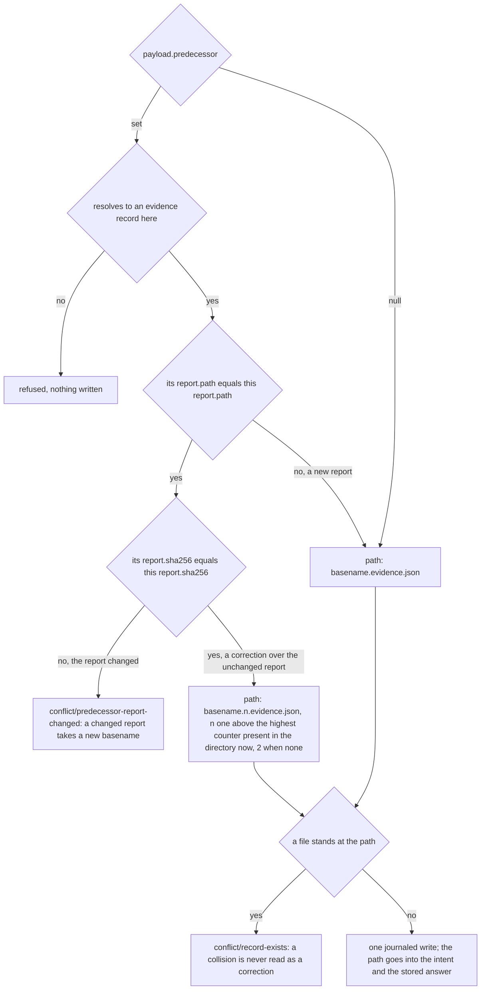
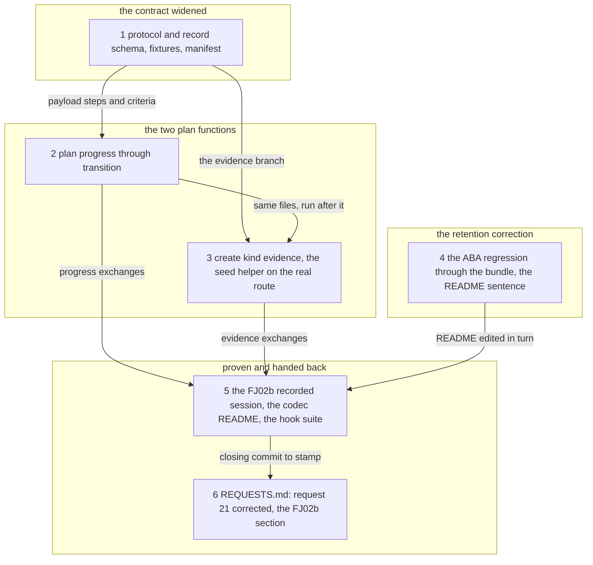

# Implementation Plan: FJ02b, the two kernel extensions the Prior side approved (plan progress through `transition`, evidence through `create`), the retention correction, and the revision frozen before FJ03

**Date:** 2026-09-29
**Revised:** 2026-09-29, after the Prior side's review of this plan at `8e1a714d`, which accepts it with the four choices of the Approach. Two corrections applied: the correction counter's guarantee is narrowed to what holds (a suffix freed by a hand deletion can be chosen again), and a correction under the same basename requires the predecessor's report hash (`conflict/predecessor-report-changed` otherwise).
**Status:** Approved by the user on 2026-09-29 after the Prior side's review at 8e1a714d, all six steps to run without a further question; in progress
**Spec:** none as a requirements-designer spec. The inputs are the Prior side's FJ02 response, read-only at Prior `38acd95`: `docs/design/fusion-fj02-prior-response.md`, sections 18, 19, 21 and `## Recovery and rollout consequences`; and `concept/fusion-json-workbench-spec.md` section 6 at the same commit, whose operation table now names both extensions ("bestätigte Erweiterung") and whose added bullets restate the rulings on 18, 19, 21 and 22. The user ruled on 2026-09-29 that this is a plan of its own before FJ03.
**Cross-references:** 260928-1338-json-control-data-and-markdown-artefacts.md, 260928-2251_*_plan-fj02-operation-kernel-revisions-and-local-transactions.md (closed; its `## Open Questions` carry Prior's answers and the request 21 correction), 260928-2110_*_plan-fj01b-fj00-follow-up-prior-rulings-applied-and-the-contract-frozen.md (closed; the shape this plan follows), 260929-0709_*_fj02-kernel-plan-and-three-open-choices.md (closed discussion; C2 is the evidence naming rule step 3 extends), 260928-2251_*_where-does-an-evidence-record-live-on-disk-so-that-attach-evidence-can-resolve-it.md (implemented; step 3 adds the write route its layout lacked)
**Survey commit:** fusion `9a3684d7` on `fj-json-workbench`. `codec/` is unchanged since `72a7051b` except for the `## FJ02` section of `codec/fixtures/prior/REQUESTS.md` (`git diff --stat 72a7051b HEAD -- codec`: that one file). `codec/dist/fusion-record.js`: 511 869 bytes, `sha256:9048e883e1a522597f782224cff7c1d444cc21ec5348c26dd9916fed68f3cc02` (`wc -c`, `shasum -a 256` at the survey), the digest Prior pinned in its response 17. Prior `38acd95`, read-only. The suite and hook figures below are FJ02's closing figures, not re-run for this survey.
**Decidability:** Two load-bearing questions, both decidable from inputs the kernel holds under its write lock. *What does a plan-progress update leave on disk?* A function of the stored plan record, the payload's entries keyed by existing step and criterion ids, and the step edges in `codec/contract/transitions.json`: each entry names exactly one stored id or the request is refused, each changed step is a table edge or the request is refused, and each omitted entry keeps its value and position. *Which file does `create(kind: evidence)` write, and can a retry write a second one?* The path is a function of the payload's `report.path`, its `predecessor` and the directory listing read under the lock; the kernel records it in the intent and the stored answer, so an identical retry is answered from the replay store and never allocates again, and a fresh operation id carrying the same evidence id is `conflict/id-in-use`. What the listing decides is the directory as it stands: the chosen path never collides with an existing file, and a suffix freed by a hand deletion can be chosen again; no durable counter is kept, and none is claimed. One question is not decidable from the kernel's inputs, and the plan does not approximate it: whether a `host: prior`, `execution_policy: prior-enforced` or `verdict: accept` in a payload is genuine. The kernel receives no caller identity it may authorise on, so it stores the labels as sent, derives nothing from them, and the two consumers (`attach-evidence`, a package's move to `done`) keep checking policy agreement and freshness on their own; whether a label is genuine is the host's to establish (Prior's response 19). Whether answers may be pruned is not argued here: a test shows the answer is no (ABA under content revisions, step 4).

## Directive

Implement in `codec/` the two kernel extensions Prior approved at `38acd95`: plan progress as `transition` on a plan record with `payload.steps` and `payload.criteria` (request 18), and `create(kind: evidence)` as the sole write route for a new evidence record (request 19). Correct the false retention claim of request 21 in `codec/fixtures/prior/REQUESTS.md` and `codec/README.md`, and pin the reason on this side with a regression test against the bundle. Record the new operations' exact bytes as a third recorded session. Hand the Prior side the result as `## FJ02b`, stamped with the closing commit and bundle digest, so that FJ03's consumer cutover plans against one revision both hosts pinned. No consumer outside the tests (FJ03), no migration (FJ04), no pruning.

## Current State

What the survey verified, with the file where each statement is checkable:

- **A plan's `transition` moves the state only.** `codec/src/cli/ops.ts` `moveRecord` sets no field for a plan (`fields` stays `{}`), so `steps` and `criteria` stay as stored, which `ops.test.ts` asserts ("plan: open to in_progress moves the state only; steps and criteria stay as stored"). `allowed()` in `codec/src/transitions.ts` refuses a same-state move as "no edge" (`conflict`). `stepAllowed(from, to)` exists and reads the plan table's `step_states` (`open`, `in_progress`, `done`) and `step_edges` (`open → in_progress`, `in_progress → done`, `open → done`); no operation calls it (only `transitions.test.ts` does). `record.schema.json` `$defs/plan_control` defines `steps` items `{id, state}` and `criteria` items `{id, met: boolean | null}` inline, each array `uniqueItems`, which refuses two identical entries but not two entries sharing an `id`. `create` admits a plan's `steps` and `criteria` as the caller sends them (`INITIAL_CONTROL`), so a plan with a repeated step id can be created today.
- **The `transition` payload** (`codec/schemas/protocol.schema.json`, the `transition` branch) has `additionalProperties: false` over `claim`, `outcome`, `disposition`, `answer_ref`, `implementation_ref`, `superseded_by`, `deferral`; its description says only the fields the target state has a rule about are read, and a field a kind does not read is ignored today.
- **No operation writes an evidence record.** The `create` branch's `kind` enum is `package`, `issue`, `plan`, `discussion`, `decision`, and it requires `filed_by`, `origin` and `narrative`, none of which a `fusion.evidence/v1` record has. `codec/src/__tests__/helpers/seed.ts` writes the report and the record in one journaled operation through `mutate` with a plan function of its own; `ops.test.ts` uses it (including, through its `over`, `reportPath`, `dir` and `fileName` options, records `create` must refuse: a verdict outside the schema, a report in another directory or of another basename, another workbench's id, a file outside `reviews/`, a correction under the first record's name), and `round-trip-cli-fj02.test.ts` compares `codec/fixtures/protocol-session-fj02/seed/09-attach-evidence/` byte for byte with what the helper writes.
- **What evidence creation can reuse.** `codec/src/store.ts`: `evidenceName(path)` (basename, correction counter, the report it pairs with; a trailing `.<n>` is the counter only for a decimal from 2 without a leading zero), `evidenceNaming(pair)`, `reportProblem(pair)` (`unresolved-reference/report-missing`, `missing-evidence/report-changed`), `EVIDENCE_SUFFIX`. `ops.ts`: `EVIDENCE_PLACE` (a `reviews/` store in a container or in `shared/`), `resolveRecordRef`, `pairPaths`'s container check (`unknown-scope/container-missing`), `markerlessName()` (read from `common.schema.json` `legacy_markerless_citation`, `^[0-9]{6}-[0-9]{4}-[^/\\\s_]+\.md$`, which admits dots, so a report basename can end in `.2` and would then read as a correction counter), and `bindEvidence` (policy agreement, brief and plan freshness, report hash).
- **Retention.** `ops/` is never pruned by the bundle. `codec/README.md` `## The kernel and the journal`, the stored-answer paragraph, says "`ops/` is not pruned in FJ02 (Prior's request 21 asks whether it should be bounded)"; `REQUESTS.md` request 21 says a pruned answer turns an identical retry into a first attempt "which the CAS refuses … so pruning is safe for replay". Prior's response 21 refutes the second sentence: `01-create`, `02-claim`, `03-release` of the FJ02 session return the package to the exact bytes and revision of `01` (`sha256:8a44940c…`), so a replayed `02-claim` whose answer was deleted matches its expected revision again and lands. Nothing on the fusion side tests this.
- **The recorded sessions.** `codec/fixtures/protocol-session/` (six FJ01 pairs) and `codec/fixtures/protocol-session-fj02/` (fifteen exchanges, `seed/`, README) are gated by their recorders; `round-trip-cli-fj02.test.ts` asserts the directory holds exactly the fifteen pairs, a README and `seed/`. `fixtures.test.ts` exempts five directories from manifest coverage by prefix, `protocol-session-fj02/` last; `protocol-session-fj02b/` would match none of them.
- **Figures at FJ02's close.** Codec suite 16 files, 955 tests; manifest 218 entries, 56 valid and 162 invalid, protocol 38 = 19/19 (counted at the survey with `node` over `codec/fixtures/manifest.json`); hook suite 1 008 of 1 009 in a worktree, the monitor loopback case the one red; growth bounds 3 806 bytes, 25 559 bytes, 6 lines.

## Approach

Both extensions are plan functions over the one kernel FJ02 landed, so replay, CAS, the journal, recovery and the read protocol apply to them unchanged and are not re-implemented. Each reuses what the codec already has: plan progress calls the unused `stepAllowed`, evidence creation composes `evidenceName`, `reportProblem`, `EVIDENCE_PLACE`, `resolveRecordRef` and the marker-free name rule. The schema changes are additive: two optional payload properties, and one new branch of the protocol's `oneOf`. No existing valid fixture changes, and the three recorded sets stay byte-identical.

**Plan progress, as one ordered check list** in the plan branch of `moveRecord` (reached through `transitionPlan` after the CAS, like every kind):

1. `steps` or `criteria` in the payload of a record that is not a plan is `schema-invalid/payload-field-not-admitted`. These two fields write data, unlike the rule-only fields the payload description covers, so dropping them silently would lose a write the caller asked for.
2. `to` differs from the stored state: `allowed("plan", from, to)` as today. `to` equals it: a terminal state is `conflict/transition-refused` (the table's `reopen` text), and a payload carrying neither field is the same refusal `allowed()` gives today ("no edge x -> x").
3. Each array is checked against the stored array: a stored array whose ids repeat, or a payload naming one id twice, is `schema-invalid/duplicate-step-id` (`duplicate-criterion-id`); an id the stored record lacks is `unresolved-reference/unknown-step-id` (`unknown-criterion-id`).
4. Each step whose `state` differs from the stored one is checked by `stepAllowed`; a refusal is `conflict/transition-refused` with the detail naming the step (`done → open` among them). An entry equal to the stored one is not checked and changes nothing.
5. Criteria take any `met` the schema admits (`true`, `false`, `null`); re-evaluation is not directional.
6. With `to` equal to the stored state, a payload that changes no value is `conflict/transition-refused`: the exception is for progress, never a general self-transition.
7. The result is the stored arrays with the named entries replaced in place, order and every other entry untouched, `acceptance` and the record's `references` untouched; the whole record is validated as today and the answer keeps FJ02's shape `{operation_id, path, from, to, revision, previous_revision}`.

`create` gains the same uniqueness rule for a new plan's `steps` and `criteria` (one helper, both routes), since an update keyed by id is only well-defined over unique ids and `create` is the one writer of a new plan.

**Evidence creation** is a second `create` branch, selected by `kind: "evidence"`, with its own shape: `{op, workbench?, operation_id, id, kind: "evidence", scope: {container, store: "reviews"}, payload}`, where `payload` is the complete record by reference to `fusion.evidence/v1`. The existing branch keeps `kind` without `evidence`, so the two branches are disjoint and every existing request validates exactly as before. The kernel writes `serialise(payload)` and nothing else, so it adds nothing to a record and upgrades nothing. The path is chosen as the flowchart draws; the checks run in this order, each refusing with nothing written: payload `id` equals envelope `id` (`schema-invalid/id-mismatch`); payload `workbench_id` is the manifest's (`unknown-scope/foreign-workbench-id`); the report's directory is the scope's `reviews/` store and the container a package directory (`unknown-scope/store-kind-mismatch`, `unknown-scope/container-missing`); the report basename is marker-free and `<basename>.evidence.json` reads back as a first record of that basename (`schema-invalid/report-name`); the report is on disk at the payload's hash (`reportProblem`); the id is in use nowhere (`conflict/id-in-use`); the predecessor, when set, resolves to an evidence record of this workbench at its pinned revision if one is given (`unresolved-reference/…`, `unresolved-reference/not-evidence`, `missing-evidence/evidence-revision-mismatch`); a predecessor naming the same `report.path` names the same `report.sha256` as the payload (`conflict/predecessor-report-changed`: the same path does not mean an unchanged report, and a changed report takes a new basename), the file on disk having that hash by the report check above; the chosen path holds no file (`conflict/record-exists`). The answer is `{operation_id, path, kind: "evidence", revision, report: {path, sha256}}`, `create`'s shape with the report in place of the narrative, as `show` already has it.

Four choices the rulings left to the fusion side are taken here. The Prior side accepted all four in its review of this plan at `8e1a714d`, and step 6 records them as settled in request 25; the approval may still overturn one.

1. **Evidence creation is its own `oneOf` branch**, not a widening of the record branch: the record branch's `filed_by`, `origin` and `narrative` have no counterpart in an evidence record, and making them conditional would change a branch Prior pinned.
2. **The correction counter is one above the highest present**, not the lowest free, so a gap a hand deletion leaves below the highest file is not refilled. The guarantee is only this: the suffix is chosen under the write lock from the directory as it stands, frozen in the intent and the stored answer so an identical retry returns the same path, and never collides with an existing file. It is not permanent non-reuse: when the highest file (say `.3`) is deleted by hand, the next correction takes `.3` again. No durable counter is introduced; Prior's review found none needed.
3. **A criterion may return to `null`**: the schema admits it, Prior's "may be reevaluated" does not restrict direction, and a criterion observation is not acceptance (response 18).
4. **Duplicate step or criterion ids are refused at `create` too**, as above; and `steps` or `criteria` on another kind is refused, not ignored.

The recorded bytes of the two operations go to Prior as a third session, `codec/fixtures/protocol-session-fj02b/`, and not as additions to the FJ02 session. Prior accepted FJ02 by replaying recorded bytes ("All fifteen FJ02 exchanges are byte-identical", response 17), and the manifest pins request shapes only, not answers, refusal reasons or the path the kernel chooses. The fifteen FJ02 exchanges stay byte-identical, which appending to their directory would break (its recorder asserts the set), and Prior's FJ02 pin stays valid. The session starts from a fresh copy of the scratch workbench, as the FJ02 session does. The recorder shares its machinery with the FJ02 recorder through one extracted helper rather than a third copy.

The bundle moves in steps 1 to 3 and is committed with each; steps 4 and 5 add tests, fixtures and README text and move no inlined file, so the closing digest is step 3's. Steps 1 and 2 are committed together: at step 1's commit alone the payload schema admits `steps`, and a state-changing plan transition would land without applying them.

Coherence check: six nodes, seven edges, four layers in reading order, no cycle, no orphan (step 4 has no incoming edge and one outgoing), and every edge is a dependency a step's `Dependencies` line declares below, with none declared there that is missing here.

## Implementation Steps

1. [DONE] **The protocol and record schemas widened, with the fixtures that pin each widening**
   - Executor: `data-implementer`
   - Files: `codec/schemas/protocol.schema.json`, `codec/schemas/record.schema.json`, new fixtures under `codec/fixtures/valid/protocol/` and `codec/fixtures/invalid/protocol/`, `codec/fixtures/manifest.json`
   - Changes, `record.schema.json`: `plan_control.properties.steps.items` moves to `$defs/plan_step` and `criteria.items` to `$defs/plan_criterion`, each referenced from where it stood, as FJ02 step 1 hoisted `$defs/deferral`; no property order changes, so every plan fixture and every plan record serialises to the same bytes.
   - Changes, `protocol.schema.json`, every one additive: the `transition` payload gains `steps` (array of `$ref` `fusion.record/v1#/$defs/plan_step`) and `criteria` (array of `$ref` `…#/$defs/plan_criterion`), both optional, no `minItems`, each property's description saying it is read on a plan record only, keyed by existing `id`, never adds, removes or reorders an entry, and that `to` may equal a live plan's current state when it changes a value. A new `oneOf` branch for `create` of evidence: `op` const `create`, `kind` const `evidence`, required `op`, `operation_id`, `id`, `kind`, `scope`, `payload`, optional `workbench`, `additionalProperties: false`; `scope` `{container: null | workbench_path, store: const "reviews"}`; `payload` `$ref` `urn:fusion:schema:fusion.evidence/v1`. The existing `create` branch is not edited. The schema `description` gains two sentences: a `transition` on a plan may carry `steps` and `criteria` as updates keyed by id; `create` of `kind: evidence` writes one immutable evidence record beside a report already on disk at its declared hash, the path chosen by the codec and returned in the answer.
   - Fixtures, valid: `valid/protocol/transition-plan-progress.json` (`to: in_progress`, two steps and one criterion), `valid/protocol/create-evidence.json` (`predecessor: null`), `valid/protocol/create-evidence-correction.json` (a `record_ref` predecessor). Invalid: `invalid/protocol/transition-plan-step-state-unknown.json` (a step `state: "blocked"`), `invalid/protocol/transition-plan-criterion-met-string.json` (`met: "yes"`), `invalid/protocol/create-evidence-without-scope.json`, `invalid/protocol/create-evidence-payload-not-evidence.json` (the payload lacks `report`), `invalid/protocol/create-evidence-with-narrative.json` (an evidence create carrying `narrative`, which neither branch admits). Each invalid fixture differs from its valid counterpart in the one field it pins. `manifest.json` lists the eight, so it counts 226 entries, 59 valid and 167 invalid, protocol 46 = 22/24.
   - Acceptance: `cd codec && CODEC_REQUIRE_GOLDENS=1 npm test` green with `fixtures: 226 manifest entries` printed; `store.test.ts`'s serialisation cases over every valid fixture pass byte for byte; `round-trip-cli.test.ts`, `round-trip-cli-fj02.test.ts` and `prior-handback.test.ts` green without regeneration; `git diff --stat -- codec/fixtures/valid codec/fixtures/protocol-session codec/fixtures/protocol-session-fj02 codec/fixtures/workbench codec/fixtures/prior-handback` shows no changed file; `npm run build` run and the rebuilt bundle part of the commit, which is step 2's (committed together, see Approach). No expected red.
   - Dependencies: none.

   - Done 2026-09-29: `plan_step` and `plan_criterion` hoisted into `$defs` with every existing fixture's bytes unchanged; the transition payload admits `steps` and `criteria`; evidence creation is its own `oneOf` branch of `create`; eight fixtures, manifest 226 entries (59 valid, 167 invalid); bundle 514 900 bytes, sha256:b1240612a53235f607bdd82674e4466632d2e180a4719156f24b88c2bf1078cb. One red the plan did not foresee: `protocol.test.ts` line 52 asserts one `oneOf` branch per operation, and `create` now has two; step 2 changes that assertion, and the two steps are committed together.
2. [DONE] **Plan progress through `transition`, and unique step and criterion ids at `create`**
   - Executor: `code-implementer`
   - Files: `codec/src/cli/ops.ts`, `codec/src/cli/protocol.ts`, `codec/src/__tests__/ops.test.ts`
   - Changes, `protocol.ts`: `TransitionPayload` gains `steps?: Array<{id: string; state: "open" | "in_progress" | "done"}>` and `criteria?: Array<{id: string; met: boolean | null}>`.
   - Changes, `ops.ts`: the seven checks of the Approach's plan-progress list, in that order, in the plan branch of `moveRecord` and in `transitionPlan` (check 1, before the kind's move function); one helper that reports a repeated `id` in an array, used on the stored arrays, on the payload arrays, and by `create` on a new plan's `steps` and `criteria` (`schema-invalid/duplicate-step-id`, `duplicate-criterion-id`, after the `not-initial-state` check). `stepAllowed` is imported from `transitions.ts`; no rule is restated. The file header's `transition` line names plan progress.
   - Tests, `ops.test.ts`, a new `describe("transition: plan progress")` over a plan created on the temp copy: a state change carrying steps and criteria lands both; a progress-only update with `to` equal to `open` and to `in_progress` lands; omitted entries keep value and order, compared field by field with the stored record; an included unchanged entry is admitted; identical replay returns the stored answer and a divergent one is `conflict/operation-id-reused`; a stale `expected_revision` is `conflict/revision-mismatch`, nothing written; `done → open` and `in_progress → open` are `conflict/transition-refused` naming the step; a payload id named twice and an id the plan lacks are refused with the reasons above; a stored plan whose steps repeat an id (written by hand on the temp copy) is refused; a closed and a deferred plan refuse a progress-only update; a progress-only update that changes nothing is refused; `steps` on an issue, a decision and a package is `payload-field-not-admitted`; a criterion moves `null → true → false → null`; a plan adopted by a package keeps its `acceptance`, the package's `active_documents` entry and its revision binding, and `reconcile` reports an evidence binding against that plan still `fresh` after progress (the binding reads the narrative hash, which progress does not touch); the progress-only and the state-changing route refuse a stale revision and a terminal record in the same class. `create` of a plan with a repeated step id and with a repeated criterion id is refused, nothing written. The existing case "plan: open to in_progress moves the state only; steps and criteria stay as stored" stays unchanged and green.
   - Acceptance: `CODEC_REQUIRE_GOLDENS=1 npm test` and `npm run typecheck` green; no existing case edited; the three recorded sets green without regeneration (no recorded exchange sends `steps` or `criteria`, and `06-create` of the FJ02 session names `s1`, `s2`, `c1` once each); the rebuilt bundle is part of the commit. No expected red.
   - Source: Prior `docs/design/fusion-fj02-prior-response.md` `## 18. Plan steps and criteria: use transition`.
   - Dependencies: 1.

   - Done 2026-09-29: `planProgress` in `codec/src/cli/ops.ts` runs checks 2 to 7, `transitionPlan` check 1; `uniqueIds` is the one helper for the stored arrays, the payload arrays and `create`. `codec/src/__tests__/ops.test.ts` gains `describe("transition: plan progress")`, 16 cases, no existing case edited; `codec/src/__tests__/protocol.test.ts` asserts `create`'s two adjacent branches, disjoint on `kind` (step 1's red cleared). `CODEC_REQUIRE_GOLDENS=1 npm test` exit 0 (16 files, 980 tests, 226 manifest entries), `npm run typecheck` exit 0; the three recorded sets and the handback unchanged. Bundle 519 932 bytes, sha256:ed46655200617eea5e2fa491b3c8d47a4485b5dc291b465cff451044516488bd. Two things the plan did not name: a stored array's repeated id is checked only when the payload updates that array, so a move without progress lands as before; and `dispatch` refuses `create(kind: evidence)` as `operation-unknown/not-implemented` until step 3, because `createPlan` threw on it (it reads `narrative.path`), not the scope refusal the Risks table assumed. Step 3 replaces that guard with the route.

3. [DONE] **`create(kind: evidence)`, and the seed helper on the real route**
   - Executor: `code-implementer`
   - Files: `codec/src/cli/ops.ts`, `codec/src/cli/protocol.ts`, `codec/src/store.ts` (only if a helper the step needs is not yet exported), `codec/src/__tests__/ops.test.ts`, `codec/src/__tests__/helpers/seed.ts`
   - Changes, `protocol.ts`: `CreateEvidenceRequest` (`op: "create"`, `kind: "evidence"`, `operation_id`, `id`, `scope`, `payload`) joins the `Request` union beside `CreateRequest`; the comment names request 19.
   - Changes, `ops.ts`: `dispatch` routes `create` to `createEvidencePlan` when `kind` is `evidence` and to `createPlan` otherwise; `createEvidencePlan` runs the Approach's checks in their order and chooses the path as the flowchart draws, the counter read from the directory listing under the lock through `evidenceName`. A correction under the same basename is admitted only when the predecessor's `report.sha256` equals the payload's, the report on disk already being at that hash by the earlier report check; otherwise it is refused `conflict/predecessor-report-changed` with both hashes in the detail, since the same report path does not mean an unchanged report and a changed report takes a new basename. The counter comment states the guarantee as the Approach's choice 2 narrows it (chosen from the directory as it stands, frozen in the intent and the answer, never colliding with an existing file; a suffix freed by a hand deletion can be chosen again) and claims nothing more. One write, `serialise(payload)`; the answer as the Approach states, with `revisions` naming the one file. Nothing reads `host`, `execution_policy` or `verdict`, and a comment says why (Prior's response 19: a label a caller writes confers nothing; `bindEvidence` checks policy agreement and freshness at attach and at `done`). The file header's `create` line names the evidence form.
   - Changes, `helpers/seed.ts`: `seedEvidence` writes the report as a plain file (a reviewer writes Markdown; the kernel is the one writer of fusion JSON, not of reports) and creates the record through `dispatch` with `op: "create"`, `kind: "evidence"`, returning the answer's path; `seedCorrection` sends a correction the same way and lets the kernel choose the path, so `CorrectionOptions.n` and `fileName` go. A new `placeEvidence` writes the pair as plain files, with no check at all, and its comment says it stands for a record that arrived by hand edit or by a pull. It is used only by the cases whose record `create` refuses (a verdict outside the schema, a report elsewhere or of another basename, another workbench's id, a file outside `reviews/`), and those cases change their setup call only, never an assertion. The header drops "No operation of FJ02 writes an evidence record".
   - Tests, `ops.test.ts`, a new `describe("create: evidence")`: a first record lands at `<basename>.evidence.json`, its bytes equal `serialise(payload)`, and `show` and `validate` read it; identical replay returns the same answer; divergent replay is `operation-id-reused`; a fresh operation id with the same evidence id is `id-in-use`; a correction over the unchanged report lands at `.2`, a second at `.3`, and an identical replay of the first correction, sent after the second landed, still answers `.2`; with `.3` deleted by hand on the temp copy, the next correction takes `.3` again (the narrowed guarantee, pinned as it holds, never collides with a file that stands); the negative case for a changed report: the predecessor names hash A, and either the new evidence names hash B with the report on disk rewritten to B (`conflict/predecessor-report-changed`) or it names A while the file on disk is B (`missing-evidence/report-changed`), both with nothing written and the predecessor and report bytes unchanged; a correction whose predecessor names another report takes that report's first-record name; `predecessor: null` at a taken name is `record-exists`, never a correction; each refusal of the Approach's list with the one field changed (envelope and payload id disagreeing, another workbench's id, a report outside the scope's `reviews/` store, a container that is no package, a report basename ending in `.2`, a report absent, a report at another hash, a predecessor unresolved, not evidence, or pinned at another revision), each with nothing written; after a correction the predecessor record and the report are byte-identical to before; a payload with `host: prior`, `execution_policy: prior-enforced` and `verdict: accept` lands as sent and gains nothing from it: a binding claiming `claude-guided` to it is `schema-invalid/policy-mismatch`, and one claiming `prior-enforced` after the brief changed is `missing-evidence/brief-changed`; a record created with `claude-guided` stays `claude-guided` in its bytes. The existing correction case that named a file by `fileName` becomes the `predecessor: null` collision case above; that is the one existing assertion this step edits.
   - Acceptance: `CODEC_REQUIRE_GOLDENS=1 npm test` and `npm run typecheck` green; `round-trip-cli-fj02.test.ts` green without regeneration, which proves `codec/fixtures/protocol-session-fj02/seed/09-attach-evidence/` is byte-identical to what the helper now writes through `create`; the FJ01 recorder and `prior-handback.test.ts` green; the rebuilt bundle is part of the commit and its digest is the closing one. Any red outside `ops.test.ts`'s evidence cases is a stop.
   - Source: Prior `docs/design/fusion-fj02-prior-response.md` `## 19. Evidence creation: use create`; decision `260928-2251_*_where-does-an-evidence-record-live-on-disk-so-that-attach-evidence-can-resolve-it.md` (the layout this route writes into).
   - Dependencies: 1, 2 (same files, run after it).

   - Done 2026-09-29: `createEvidencePlan` and `nextCorrection` in `codec/src/cli/ops.ts`, `dispatch` routing on `kind` and step 2's `not-implemented` guard removed; `CreateEvidenceRequest` and `EvidencePayload` in `codec/src/cli/protocol.ts`; `codec/src/store.ts` unchanged. `codec/src/__tests__/helpers/seed.ts` writes the report as a plain file and creates the record through `dispatch`; `placeEvidence` serves the seven setups `create` refuses, which changed their setup call only; the one edited assertion is the former `fileName` case, now `predecessor: null` meeting the first record's name. `codec/src/__tests__/ops.test.ts` gains `describe("create: evidence")`, 10 cases. `CODEC_REQUIRE_GOLDENS=1 npm test` exit 0 (16 files, 990 tests, 226 manifest entries), `npm run typecheck` exit 0; `round-trip-cli-fj02.test.ts` green without regeneration, so `codec/fixtures/protocol-session-fj02/seed/09-attach-evidence/` is byte-identical through the real route; no file under `codec/fixtures/` changed. Bundle 524 930 bytes, sha256:5f116c6436175a6b8e1cb08aa2625d2e2f68ef193657b00eb1891ea8d3b965bd. No protocol test asserted the guard.

4. [DONE] **Why no answer is pruned: the ABA regression through the bundle, and the README sentence**
   - Paused 2026-09-29 15:56 by the user before this step was dispatched, for a session restart; nothing of step 4 is in the tree. Resume here: dispatch step 4 to `code-implementer` as written, then steps 5 and 6; the user approved all six steps to run without a further question. HEAD at the pause: `ab3f87e2` (bundle 524 930 bytes, sha256:5f116c6436175a6b8e1cb08aa2625d2e2f68ef193657b00eb1891ea8d3b965bd; 16 test files, 990 tests green).
   - Executor: `code-implementer`
   - Files: `codec/src/__tests__/kernel.test.ts`, `codec/README.md`
   - Changes, `kernel.test.ts`: a new `describe("stored answers are never pruned: content revisions return")`, its comment naming Prior's `TestCodecFJ02RetainedAnswerPreventsABAReplay`, spawning the committed bundle over two fresh copies of `codec/fixtures/workbench/` with the requests `01-create`, `02-claim` and `03-release` of `codec/fixtures/protocol-session-fj02/` (the `<workbench>` placeholder substituted). On both copies, after `03`, the package's revision equals `01`'s. First copy, answer retained: replaying `02` answers exactly the recorded `02-claim.response.json` bytes, and `show` reports the package `open` at `01`'s revision. Second copy, only `.json-state/ops/<02's operation id>.json` deleted: the replayed `02` answers `ok: true`, and `show` reports the package `claimed` at `02`'s recorded revision, so the old claim landed a second time. On the first copy a fresh-id `release` against `02`'s revision is `conflict/revision-mismatch`, which shows the CAS still refuses a stale revision and the defect is the return of old bytes. The deletion touches a temp copy only.
   - Changes, `README.md`, `## The kernel and the journal`, the stored-answer paragraph: the sentence on retention becomes the statement that `ops/` is never pruned; that a revision is the hash of the stored bytes, so a record can return to bytes it held before (a `claim` then a `release`) and a replayed old operation whose answer was deleted would pass the CAS and land again; that the test above and Prior's pin it; and that any future pruning needs durable protection against old operation ids first (Prior names retained request-digest tombstones or a retired id namespace) and a revised read protocol, which relies on `ops/` only growing.
   - Acceptance: the new cases green, and each shown red against a broken copy on a scratch tree (the retained case with the answer file deleted, the deleted case with it restored); `CODEC_REQUIRE_GOLDENS=1 npm test` green; `codec/dist/` unchanged. No expected red.
   - Source: Prior `docs/design/fusion-fj02-prior-response.md` `## 21. Retention: no pruning through FJ03`.
   - Dependencies: none.

   - Done 2026-09-29: `codec/src/__tests__/kernel.test.ts` gains `describe("stored answers are never pruned: content revisions return")`, 4 cases through the committed bundle; `codec/README.md` `## The kernel and the journal` states that `ops/` is never pruned and why. `CODEC_REQUIRE_GOLDENS=1 npm test` exit 0 (16 files, 994 tests), `npm run typecheck` exit 0, re-run by the orchestrator after the return. Bundle unchanged at 524 930 bytes, sha256:5f116c6436175a6b8e1cb08aa2625d2e2f68ef193657b00eb1891ea8d3b965bd. Each of the two replay cases was shown red on a scratch tree with the answer file deleted or restored. Four things the plan did not name: nothing is imported from `round-trip-cli-fj02.test.ts`, which exports nothing, so the `<workbench>` substitution stands twice as one line until step 5 moves it into `helpers/session.ts`; the retained case turns red at `show` and not at the byte comparison, because a second landing of `02` answers the same bytes as the stored answer; the CAS refusal is a case of its own on a fresh copy, since the file removes its temp copies after each case; and Prior's twin test was named from this plan, not read.

5. [DONE] **The FJ02b recorded session, the codec README, and the hook suite in a worktree**
   - Executor: `code-implementer`
   - Files: `codec/src/__tests__/helpers/session.ts` (new), `codec/src/__tests__/round-trip-cli-fj02.test.ts` (imports the helper; no assertion changes), `codec/src/__tests__/round-trip-cli-fj02b.test.ts` (new), `codec/fixtures/protocol-session-fj02b/**` (new: the pairs, `seed/`, `README.md`), `codec/src/__tests__/fixtures.test.ts` (the exemption list and its comment gain `protocol-session-fj02b/`), `codec/README.md`
   - Changes, the helper: the machinery the FJ02 recorder and the new one share (spawning `bin/fusion-record`, the `<workbench>` substitution, copying a `seed/<nn>-<op>/` set just before its exchange, the file listing and byte comparison, the regeneration switch) moves into `helpers/session.ts`; the FJ01 recorder is left alone.
   - Changes, the session: over a fresh copy of the scratch workbench, every id and time a fixed literal, regenerated only under `UPDATE_PROTOCOL_SESSION_FJ02B=1`, in this order. `01-create` a package P with its body. `02-create` a plan L in P's container with its body, steps `s1`, `s2`, `s3` and criteria `c1`, `c2`. `03-transition` L `open → in_progress` with `s1` to `in_progress`. `04-transition` L `in_progress → in_progress` with `s1` to `done`, `s2` to `in_progress`, `c1` to `true`. `05-transition` repeats `04` and must answer `04`'s bytes. `06-show` L: `s3` open, `c2` null, the stored order kept. `07-transition` progress-only at `03`'s revision: `conflict/revision-mismatch`. `08-transition` `s1` back to `open`: `conflict/transition-refused`. `09-transition` naming `s2` twice: `schema-invalid/duplicate-step-id`. `10-transition` naming `s9`: `unresolved-reference/unknown-step-id`. `11-create` evidence E1 for P over a report seeded under `seed/11-create/`: the first-record path. `12-create` E2 correcting E1 over the same report: counter 2. `13-create` E3 correcting E1: counter 3. `14-create` repeats `12` and must answer `12`'s bytes, counter 2. `15-show` E1: the revision `11` answered. `16-create` E4 with `predecessor: null` over the same report: `conflict/record-exists`. `17-create` E5 whose payload names a hash the report does not have: `missing-evidence/report-changed`. `18-transition` L `in_progress → closed`. `19-transition` progress-only on the closed L: `conflict/transition-refused`. `20-create` E6 correcting E1 after `seed/20-create/` replaced the report with other bytes, the payload naming the new hash: `conflict/predecessor-report-changed`, last because the seed changes the report every earlier evidence exchange reads. The recorder asserts the directory holds exactly the twenty pairs, a README and `seed/`, and that `seed/11-create/` and `seed/20-create/` hold exactly the report bytes the run produces; its README is the replay procedure, in the shape of the FJ02 session's.
   - Changes, `codec/README.md`: `## The CLI` names the two extensions; `## Evidence records on disk` replaces "No FJ02 operation writes an evidence record; Prior's request 19 asks how a reviewer will" with `create(kind: evidence)`, its checks, the same-hash condition on a correction under the same basename, the counter rule with its narrowed guarantee, and the answer's `path`; `## The kernel and the journal` gains the sentence from Prior's `## Recovery and rollout consequences` that a read may finish a committed intent and so is not free of physical writes, which a host authorises apart from a read-only role; `## What ships` counts three recorded sessions; the layout table gains `fixtures/protocol-session-fj02b/` and `src/__tests__/helpers/session.ts`, the `fixtures/manifest.json` row names six exempted directories, and the `helpers/seed.ts` row says the helper creates evidence through `create(kind: evidence)` and places a pair by hand only for refusal cases. `codec/fixtures/protocol-session-fj02/README.md` is not edited: "no FJ02 operation writes an evidence record" stays true of the bundle that session was recorded with.
   - Changes, the hook suite: `git worktree add <scratch> HEAD`, `cd hooks && npm install && npm test`, exit code and counts into this step's note, the worktree removed; the three growth-bound figures re-read. Fixture and record paths in this plan's step notes are written in full (`codec/fixtures/…`), since a bare stamped basename read as a dangling citation in FJ02.
   - Acceptance: the new recorder green and byte-stable across two runs with different temp roots; `round-trip-cli-fj02.test.ts` green without regeneration after the extraction, and `round-trip-cli.test.ts` and `prior-handback.test.ts` green; `fixtures.test.ts` green with the exemption; `codec/dist/` unchanged; the hook suite at 1 008 of 1 009 with the monitor loopback case the one red, or better; the three figures unchanged at 3 806 bytes, 25 559 bytes and 6 lines. Any other red is a stop.
   - Dependencies: 2, 3, 4.

   - Done 2026-09-29: `codec/src/__tests__/helpers/session.ts` carries the machinery the FJ02 recorder and the new one share; `codec/src/__tests__/round-trip-cli-fj02.test.ts` imports it, and the one `expect` line that left that file is the `ok` check inside `result()`, moved verbatim into the helper, so no case's assertion changed. `codec/src/__tests__/kernel.test.ts` takes its `<workbench>` substitution from the helper (one import, the duplicated line of step 4 gone), which this plan's file list did not name. `codec/src/__tests__/round-trip-cli-fj02b.test.ts` is the new recorder, 49 cases, over `codec/fixtures/protocol-session-fj02b/` (the twenty pairs, `README.md`, `seed/11-create/` and `seed/20-create/`). `codec/src/__tests__/fixtures.test.ts` exempts the directory. `codec/README.md` carries the edits listed above, and `## The CLI` names `create`'s second branch where it said one branch per operation. `CODEC_REQUIRE_GOLDENS=1 npm test` exit 0 (17 files, 1 043 tests, 226 manifest entries) and `npm run typecheck` exit 0, re-run by the orchestrator after the return. Bundle unchanged at 524 930 bytes, sha256:5f116c6436175a6b8e1cb08aa2625d2e2f68ef193657b00eb1891ea8d3b965bd, which is the closing digest. No file under `codec/fixtures/protocol-session/`, `codec/fixtures/protocol-session-fj02/`, `codec/fixtures/workbench/`, `codec/fixtures/prior-handback/` or `codec/fixtures/valid/` changed. Byte stability: two recorder runs under different `TMPDIR` roots, one containing spaces and a comma, 49 of 49 each, and the checksums of the 40 pair files and the 2 seed reports identical before and after. Hook suite, as the executor reported it, in a worktree at `c4246ef4`: exit 0, 60 files, 1 009 of 1 009, the monitor loopback case green this time; a second run with this step's files copied into the worktree gave the same. Growth bounds as reported: 3 806 bytes, 25 559 bytes, 6 lines. Things the plan did not name: E1's revision is computed from the payload and not read from disk, so a stale seed fails cases by name instead of aborting the run; `17-create` names the hash of the `seed/20-create/` bytes; after `20-create` the three landed evidence records name a hash the report no longer has, which the session README states; `plan_revision` is `null` in every evidence payload, because the plan is never adopted in the session.

6. [DONE] **`REQUESTS.md`: request 21 corrected, and the FJ02b section for the Prior side**
   - Done 2026-09-29 by `analyst`: request 21 in `## FJ02` no longer claims that pruning is safe and names the fusion test of step 4; `## FJ02b (the two approved kernel extensions)` stands at the end with requests 23, 24 and 25, written against `6e01977f` and Prior `38acd95`, bundle 524 930 bytes, sha256:5f116c6436175a6b8e1cb08aa2625d2e2f68ef193657b00eb1891ea8d3b965bd (`wc -c` and `shasum -a 256`, live tree and committed blob). Counts from a rerun of `CODEC_REQUIRE_GOLDENS=1 npm test` in a scratch clone at `6e01977f` (17 files, 1 043 tests, 226 entries, 59 valid and 167 invalid, protocol 46 as 22 and 24, 13 goldens), and the orchestrator's own rerun on the live tree with the edited file gave the same suite figures and the same bundle. `git diff --stat -- codec bin` shows this one file. The section adds what the step did not list: a paragraph saying the text is committed after `6e01977f` and changes no other file under `codec/` or `bin/`; the one intermediate digest at `fe4ff899`; an item on what did not change (`inspect` answers the same bytes through both bundles, so a host knows the extensions by digest) with the seven reasons new at this revision; the two properties from the Done notes of steps 2 and 3; and the open question on foreign payload fields, stated as not asked. Prior's responses 16 to 22 and `## Recovery and rollout consequences` were read in the Prior checkout at `38acd95`. Request 25 rests on this plan's own account of Prior's review at `8e1a714d`, since no document in the Prior checkout names that commit.
   - Executor: `analyst`
   - Files: `codec/fixtures/prior/REQUESTS.md`
   - Changes, request 21 in `## FJ02`: the sentence "A pruned answer turns a later identical retry into a first attempt, which the CAS refuses (…), so pruning is safe for replay" is replaced by the correct statement (content revisions return after `claim` → `release`, so a replayed old operation whose answer was pruned passes the CAS and lands again; `ops/` is never pruned, and any future pruning needs durable protection against old operation ids first), followed by one bracketed sentence saying it was corrected at FJ02b after Prior's response 21 and naming the fusion test of step 4. The false wording is not kept beside it.
   - Changes, a new section `## FJ02b (the two approved kernel extensions)` at the end, in the shape of `## FJ01b` and `## FJ02`: written against the closing commit (step 5's) and the bundle's byte size and `sha256:` at it, and against Prior `38acd95`; what landed, per request, with the fixture names of step 1, the check order and refusal reasons of the Approach, the evidence path rule and answer shape, the seed helper now on the real route with `seed/09-attach-evidence/` byte-identical, the ABA twin of Prior's test, and the retention correction; the new session by directory, order, seed and substitution; one paragraph acknowledging `## Recovery and rollout consequences` (a read may write, the FJ01 and FJ02 lock paths are incompatible, one pin per workbench), which this plan changes nothing in and FJ03's consumers must honour. Then the requests, numbered on from 22: (23) re-snapshot the shared fixture set at the closing commit and re-run the Go harness, expecting 226 of 226, 59 valid and 167 invalid; (24) re-pin the bundle and replay the six FJ01 pairs, the handback, the fifteen FJ02 exchanges and the twenty FJ02b exchanges; (25) the four choices of the Approach, recorded as settled with the Prior side in its review of this plan at `8e1a714d` rather than asked, together with the two corrections that review made: the counter guarantee as narrowed (no durable counter; a suffix freed by a hand deletion can be chosen again) and `conflict/predecessor-report-changed` for a correction under the same basename over a changed report. Request 25 asks nothing; it states what both sides agreed and where it is pinned. The section ends with the sentence that FJ03 is planned against this revision.
   - Acceptance: every count and digest in the section re-verified at the closing commit (`CODEC_REQUIRE_GOLDENS=1 npm test`, `wc -c`, `shasum -a 256`, `node` over the manifest); the request 21 sentence no longer claims pruning is safe; `git diff --stat` for the step shows only this file.
   - Dependencies: 5.

## Where this work stops

- `cd codec && CODEC_REQUIRE_GOLDENS=1 npm test` and `npm run typecheck` are green at the closing commit, and the committed-bundle gate was green at every commit of this plan.
- A `transition` on a live plan record applies `payload.steps` and `payload.criteria` as updates keyed by id, with or without a state change, and refuses every case the Approach's seven checks name; each refusal has a test in `ops.test.ts`.
- `create(kind: evidence)` writes exactly one file, `serialise(payload)`, at the path the flowchart chooses, which never collides with a file that stands; an identical retry answers that path after another correction has landed; a correction under the same basename over a report whose hash differs from the predecessor's is refused `conflict/predecessor-report-changed` with nothing written. No clause here promises that a suffix is never chosen twice: one freed by a hand deletion can be.
- `codec/src/__tests__/helpers/seed.ts` creates evidence through `create(kind: evidence)`, and no test writes an evidence record through a plan function of its own.
- The ABA regression is green in `kernel.test.ts` through the bundle, and both `codec/README.md` and `REQUESTS.md` request 21 say `ops/` is never pruned and why.
- The six pairs under `codec/fixtures/protocol-session/`, the fifteen exchanges and the `seed/` of `codec/fixtures/protocol-session-fj02/`, the scratch workbench under `codec/fixtures/workbench/` and the handback under `codec/fixtures/prior-handback/` are byte-identical to `9a3684d7`, and their three gates are green without regeneration.
- Every schema change is additive: no file under `codec/fixtures/valid/` at `9a3684d7` changed, and the manifest carries the eight fixtures of step 1.
- `codec/fixtures/protocol-session-fj02b/` holds the twenty pairs, `seed/` and a README, and its recorder is green without regeneration.
- The hook suite in a worktree at the closing commit stands at 1 008 of 1 009 with the monitor loopback case the one red, or better; the three growth-bound figures stand at 3 806 bytes, 25 559 bytes and 6 lines.
- No file under `agents/`, `skills/`, `rules/`, `hooks/`, `bin/`, `templates/`, `install.sh` or `.claude-plugin/` changed in this plan's commits; `plugin.json` stays at 12.0.0.
- No consumer of the kernel outside `codec/src/__tests__/`, no migration and no pruning was written.
- `REQUESTS.md` `## FJ02b` is stamped with the closing commit and the bundle digest at it, and carries requests 23 to 25, request 25 stating the four choices and the two review corrections as settled with the Prior side at `8e1a714d`.
- Precondition for FJ03: this plan is closed, and FJ03 is planned against its closing revision.

## Data Structures

- `record.schema.json` `$defs/plan_step` `{id, state: open | in_progress | done}` and `$defs/plan_criterion` `{id, met: boolean | null}`, hoisted and referenced (step 1).
- `protocol.schema.json`: `transition.payload.steps` and `.criteria`, arrays of those two defs; a second `create` branch `{op, workbench?, operation_id, id, kind: "evidence", scope {container, store: "reviews"}, payload: fusion.evidence/v1}` (step 1).
- The evidence create answer: `{operation_id, path, kind: "evidence", revision, report: {path, sha256}}`; the plan transition answer is FJ02's (steps 2 and 3).
- No new file under `.json-state/` and no durable counter: the chosen evidence path travels in the intent's `response` and the stored answer, which FJ02's journal already carries, and the next counter is read from the directory as it stands, so a suffix freed by a hand deletion can be chosen again.

## API Changes

Shipped: the two protocol additions above; `transition` on a plan writes steps and criteria and admits `to` equal to a live plan's state when a value changes; `create` of a plan refuses a repeated step or criterion id; `steps` or `criteria` on another kind is refused. New refusal reasons: `payload-field-not-admitted` (on `transition`), `duplicate-step-id`, `duplicate-criterion-id`, `unknown-step-id`, `unknown-criterion-id`, `id-mismatch`, `report-name`, `predecessor-report-changed`; the rest reuse FJ02's reasons. Nothing else changes in the bundle's behaviour, `bin/fusion-record` is untouched, and `inspect` is unchanged.

## Testing Strategy

The codec's own suites carry every check; no live workbench, no Prior code. Prior's list for each request, with the case that pins it:

| Prior asks for | Pinned by |
|---|---|
| Plan progress: stale CAS | step 2 case; session `07` |
| Plan progress: replay | step 2 identical and divergent cases; session `05` |
| Duplicate and unknown ids | step 2 cases, payload and stored; `create` duplicates; session `09`, `10` |
| Forbidden step edges (`done → open`) | step 2 cases; session `08` |
| Terminal refusal | step 2 closed and deferred cases; session `19` |
| Unchanged omitted entries | step 2 field-by-field comparison; session `06` |
| Same scope and authority checks on both routes; acceptance and bindings preserved | step 2 route-equivalence case and the adopted-plan case with `reconcile` |
| Evidence: creation and replay | step 3 cases; session `11`, `14` |
| Evidence: correction, suffix frozen in intent and answer, never colliding with a file | step 3 counter cases, the replay after a later correction, and the hand-deleted `.3` chosen again; session `12` to `14` |
| Evidence: same basename but a changed report is refused | step 3 negative case (predecessor hash A, new evidence hash B with the report rewritten, or hash A with the file on disk at B), nothing written; session `20` |
| Evidence: wrong report, hash, scope, id | step 3 refusal cases; session `17` |
| Evidence: immutability, no implicit report rewrite | step 3 byte comparison after a correction; session `15`, `16` |
| Labels confer no authority; `claude-guided` stays labelled | step 3 policy and brief cases |
| Retention: why no answer is pruned | step 4 ABA cases through the bundle |

The FJ01 and FJ02 recorders are the regression that nothing recorded moved; the FJ02b recorder is the evidence handed to Prior; the committed-bundle gate runs last in every step; the hook suite runs once in a worktree at step 5.

## Risks & Mitigations

| Risk | Mitigation |
|------|------------|
| The seed helper on the real route writes different evidence bytes, and `seed/09-attach-evidence/` of the FJ02 session moves | The kernel writes `serialise(payload)`, the helper's own serialisation of the same record; step 3's acceptance is the FJ02 recorder green without regeneration, and a red there is a stop that goes to `REQUESTS.md` before any byte moves |
| Hoisting the step and criterion defs changes a plan record's serialised bytes | Property order is unchanged and `serialise` follows `$ref` as it did for `$defs/deferral`; step 1's acceptance runs the serialisation cases over every valid fixture and the FJ02 session, which creates a plan |
| A second `create` branch makes an existing request match both branches, or neither | The branches are disjoint on `kind` (an enum without `evidence` against the const `evidence`); every existing fixture and the recorded requests validate as before, which step 1's acceptance runs |
| Refusing duplicate ids at `create` refuses a request that landed under FJ02 | No recorded exchange or existing test repeats an id; the Prior side accepted the refusal at `8e1a714d`, and `## FJ02b` request 25 records it |
| Refusing `steps` or `criteria` on another kind is read as inconsistent with the payload's "ignored if not read" rule | The two fields write data and the rule-only fields do not; the Approach says so, and the wider question is an Open Question, not widened here |
| A commit between steps 1 and 2 lands a state-changing plan transition without applying its steps | Steps 1 and 2 are committed together; step 3's evidence branch at the intermediate commit is refused by `createPlan`'s scope check, writing nothing |
| The session helper extraction changes what the FJ02 recorder asserts | Its assertions and fixtures are untouched; its acceptance is green without regeneration |
| A reader takes "one above the highest" as a promise that a suffix is never reused | The plan, the code comment and the README state the narrowed guarantee, and a step 3 case pins that a hand-deleted highest suffix is chosen again |

## Open Questions

- [x] The four choices of the Approach (evidence as its own `create` branch, the counter one above the highest, a criterion back to `null`, duplicate ids refused at `create` and the two fields refused on other kinds): accepted by the Prior side at `8e1a714d`, with the two corrections applied in this revision; request 25 records them as settled.
- [ ] `transition` ignores payload fields a kind has no rule about (an `outcome` on a plan, a `disposition` on a package), as the payload description states. This plan refuses only the two data-writing fields on other kinds. Whether every foreign field should be refused is a protocol change with a behaviour change for existing callers, not planned here; FJ03 may raise it when its consumers are written.
- [ ] `bin/fusion-record`'s header sentence on FJ01's five operations stays stale, as the FJ02 plan recorded; FJ03 corrects it with the consumers.
- [ ] The work package's `**Active spec/plan:**` still names the closed FJ02 plan. It changes when this plan is adopted, in the same command, by whoever adopts it.
