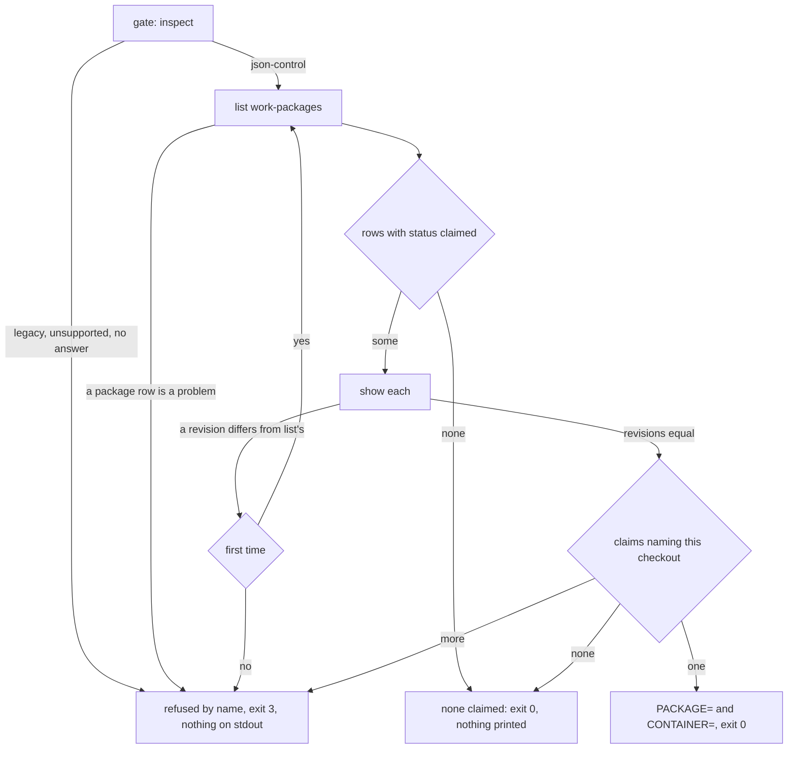
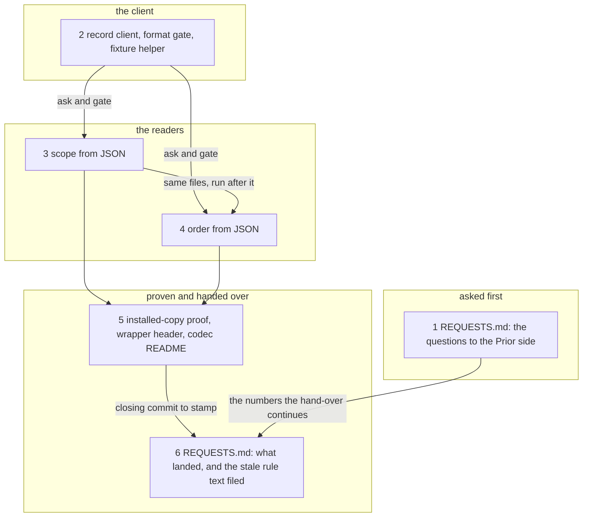

# Implementation Plan: FJ03a, the first part of the consumer cutover: the Claude-side record client, the format gate, and scope and order read from JSON

**Date:** 2026-09-29
**Revised:** 2026-09-29, after the Prior side's review of this plan at `d4ce909b` (Prior `docs/design/fusion-fj03a-prior-plan-response.md` at Prior `b2a931b`), which accepts the cut and the six steps with the recommended answers A, B and C and needs no new cut. Its binding clarifications are written into steps 2, 3 and 4 as `Amendment` bullets; no step was added, removed or reordered.
**Status:** Approved on 2026-09-29: the user gave the Prior side's acceptance at Prior `b2a931b` as the answer to the plan review, with the recommended answers to the consumer-placement, growth and recovery records; in progress. Installing a build of this branch stays barred until the agreed migration.
**Spec:** none as a requirements-designer spec. Prior's `concept/fusion-json-workbench-spec.md` at Prior `e3bc25b`, read from the committed object: section 7 (rows 1 to 3 are this plan's, the other rows are cut below), sections 4.1 and 6, section 9 row FJ03 ("Echte Scope-/Order-/Reconcile-/Abschlusswege nutzen JSON; alte Steuerparser nur im Import/Archiv"). Prior's `docs/design/fusion-fj02-prior-response.md` (responses 21 and 22, `## Recovery and rollout consequences`) and `docs/design/fusion-fj02b-prior-response.md`, same commit.
**Cross-references:** 260928-1338-json-control-data-and-markdown-artefacts.md, 260929-1417_*_plan-fj02b-plan-progress-and-evidence-creation-through-the-kernel.md (closed; its open questions are taken up below), 260928-2251_*_plan-fj02-operation-kernel-revisions-and-local-transactions.md (closed), 260929-1810_*_in-which-order-do-the-parts-of-fj03-and-fj04-land-while-fusions-own-workbench-is-still-in-the-v12-form.md, 260929-1810_*_where-do-the-claude-side-consumers-of-the-codec-live-and-how-do-they-reach-it.md, 260929-1810_*_does-the-2026-09-27-ruling-on-the-growth-bound-reach-the-hook-tests-and-shipped-text-fj03-changes.md, 260929-1810_*_which-write-creates-the-manifest-of-a-new-json-controlled-workbench.md, 260929-1810_*_what-does-the-claude-side-declare-about-a-read-that-finishes-a-committed-intent.md, 260929-1810_*_list-answers-a-legacy-workbench-with-an-empty-list-and-names-no-state.md, 260929-1810_*_the-shipped-prompts-disagree-on-who-moves-which-marker-and-one-names-a-marker-no-vocabulary-has.md, 260928-1341_*_does-the-json-codec-live-in-its-own-package-or-under-hooks.md, 260928-1550_*_which-process-boundary-and-shipped-form-does-the-codec-take.md, 260927-2319_*_does-the-growth-bound-on-shipped-text-yield-to-the-dual-host-prompt-set.md
**Planned against:** fusion `7b8dde51` (the revision Prior pinned; runtime baseline `6e01977f`), bundle `codec/dist/fusion-record.js` 524 930 bytes, `sha256:5f116c6436175a6b8e1cb08aa2625d2e2f68ef193657b00eb1891ea8d3b965bd`; Prior `e3bc25b`. Re-measured at the survey commit `b4c8f7ca` on 2026-09-29: `wc -c` and `shasum -a 256` on the live file and on the blob at `7b8dde51` agree; `cd codec && CODEC_REQUIRE_GOLDENS=1 npm test` exits 0 with 17 files and 1 043 tests; the manifest holds 226 entries, 59 valid and 167 invalid; `git diff --stat 6e01977f 7b8dde51 -- codec bin` names `codec/fixtures/prior/REQUESTS.md` alone; `git diff --stat 7b8dde51 HEAD -- codec bin agents skills rules hooks templates install.sh .claude-plugin` is empty.
**Decidability:** The load-bearing question is which work package this checkout holds and which order the live packages stand in, read from JSON. It is decidable from these answers of the codec and one value of the host: `inspect` (the workbench's state), `list` over `work-packages` (path, kind, id, status and revision of every control file, or a `problem`), `show` (a claimed package's `claim.checkout_id`), `reconcile` (every dependency edge as the codec's own rule evaluates it), and the checkout identifier `bin/fusion-identity` prints. The state partitions the input completely: `json-control` is answered; `legacy`, `unsupported` and no answer at all are each refused by name, and none of them is ever read as "nothing claimed". Within `json-control` the claimed set is determined exactly when every package row reads and each `show` returns the revision `list` named; the count of matches (none, one, more) then gives the answers the helper already has. The questions that follow are not decidable from these inputs, and the plan approximates none of them. Whether the holder of a claim is authorised is the host's (Prior's response 22); scope resolution reads a claim as the assignment it is. Whether a read will write cannot be known before it is sent, because a read finishes a committed intent it finds; the plan declares that and bounds who may ask (the recovery record). Whether the store changed after the answer is unknowable to any reader without a lock held across processes; the answer is a point-in-time read, as the `grep` it replaces was.

## Directive

Make fusion's own scope and order resolvers read JSON control data through the codec, as the first of the parts FJ03 is cut into (FJ03a to FJ03d). After this plan `bin/fusion-claimed-package` and `bin/fusion-work-order` answer from `package.json` records through one Claude-side client of the bundle, `bin/fusion-paths` and `bin/fusion-rules` keep their interfaces over that answer, no code on the live path reads a `**Status:**`, `**Claim:**` or `**Depends-on:**` head line, and a workbench that is not JSON-controlled is refused by name. The bundle's bytes do not move, so the pin both hosts hold stays valid. No agent prompt, skill body or rule file changes here.

## The cut of FJ03

Section 7 is a table of consumers, its rows numbered here in the table's order, and a closing classification. Surveyed at `b4c8f7ca` that is about 38 000 bytes of state grammar in `rules/fusion-workbench-conventions.md`, about 30 000 in `agents/orchestrator.md`, the skill bodies of `/fusion:wp`, `/fusion:archive`, `/fusion:setup`, `/fusion:discuss` and `/fusion:check`, and the code below. One plan of all of it would exceed the plan ceiling `bin/fusion-plan-size` reports (40 000 bytes) several times over, and its parts do not share one set of open questions. The cut follows what a part changes and what it waits for:

| Part | Carries | Shipped paths it changes | Waits for |
|---|---|---|---|
| FJ03a, this plan | rows 1 to 3: scope, the two resolvers over it, order; the record client and the format gate every later part uses | `bin/`, `hooks/`, `README-hooks.md` | the consumer-placement, growth and recovery records |
| FJ03b | rows 7, 8 and 10 in code, and the check and sweep half of row 9: staging drift over `workbench.json`, the pairs and `.json-state/`; the citation index beside the sidecars and UUID references; events that name a record; the monitor | `hooks/`, `bin/monitor`, `README-hooks.md` | the order record |
| FJ03c | row 5 without `/fusion:migrate` (its body is FJ04's), the archive half of row 9, the write half of row 6: a write client that checks ownership as Prior's response 22 asks, the skills' executable blocks, a reviewer's evidence through `create`; whether `transition` refuses foreign payload fields | `skills/`, `hooks/`, `bin/` | the manifest record and Prior's answers |
| FJ03d | rows 4, 6 and 11 in text (the version number is FJ05's): agents, rules with the layout tree and the tracking classes, READMEs, docs, help; the live-record predicates and the lints that read this repository's own workbench; the repository-wide classification | `agents/`, `rules/`, `skills/help/`, `docs/`, the READMEs, `CLAUDE.md`, `hooks/` | the order record; the growth bound at measured figures |

Each later part gets a plan of its own when its turn comes, as FJ01b and FJ02b did.

## Current State

Verified at `b4c8f7ca`, with the file where each statement is checkable:

- **No consumer of the codec exists outside its tests.** `grep -rln 'codec/dist\|bin/fusion-record' agents skills rules hooks/*.ts hooks/lib/*.ts bin` names `bin/fusion-record` itself and nothing else; the wrapper is called by `codec/src/__tests__/` only.
- **The code that reads control state from Markdown**: `bin/fusion-claimed-package` (two `grep -qE` over the whole record, for `**Status:** claimed` and `**Claim:** <checkout>`), `hooks/lib/work-graph.ts` `computeWorkGraph` (`headBlock`, `headField` for `Status` and `Depends-on`), reached through `hooks/order.ts` and `bin/fusion-work-order`. `bin/fusion-paths` reads no head itself and takes `CONTAINER=` from `bin/fusion-claimed-package`; `bin/fusion-rules` `resolve_topics` takes `PACKAGE=` and reads a `Topic:` or `Tags:` line of the narrative, which is authored content and none of the control fields `reconcile` checks a narrative for.
- **The code that reads state from a file name** is FJ03b's and FJ03d's: `hooks/lib/plan-size.ts` (`LIVE_MARKERS`), `hooks/lib/citation-corpus.ts` (`OPEN_ISSUE_RE`, `LIVE_DECISION_RE`, `LIVE_PLAN_RE`), `hooks/lib/citation-scan.ts` (`markerAtHead`, `basenameMatcher`). No code reads `[IN PROGRESS]`, `[DONE]` or an annotation line as state.
- **The event hooks call no codec and read no state field**: `hooks/guard.ts`, `hooks/tracker.ts`, `hooks/session-start.ts`, `hooks/subagent-stop.ts`. `bin/monitor` reads `orchestrator-events.jsonl`, `.guard-state/events.jsonl`, `.checkout-id` and `shared/checkouts/` and no record.
- **What the codec answers a reader.** `inspect` names `state`. `list` rows carry `path`, `kind`, `id`, `status`, `revision`, `narrative`, or `path` and `problem`; they carry neither claim nor `depends_on` (`codec/src/cli/ops.ts` `list`). `reconcile` reports each dependency edge as `satisfied` or `unmet` with class and reason, and each cycle. On a workbench without a manifest `list` answers an empty list and no state (the `list` issue record).
- **Measured cost.** One spawn of the bundle takes 171 ms here (ten `inspect` calls in 1.71 s, Node 25.7.0). A read on a workbench with no journal creates no `.json-state/`.
- **This repository's own workbench is legacy**: no `workbench.json`, 46 entries under `fusion-workbench/work-packages/`. The install at `$FUSION_PLUGIN_ROOT` is 12.0.1, without `codec/` and without `bin/fusion-record`; its `agents/` and `rules/` are byte-identical to the work tree's.
- **The tests of the two resolvers build temp fixtures**: `fusion-claimed-package.test.ts` (194 lines), `work-graph.test.ts` (189), `fusion-work-order.test.ts` (57), and the claim fixtures inside `fusion-paths.test.ts` and `context-manifest.test.ts`. None reads this repository's own workbench.
- **Bounds.** Room left, from `surface-growth-bound.test.ts` and `fixtures/surface-growth.golden`: `agents/` 3 806 bytes, `skills/` 25 559 bytes, hook tests 6 lines. The 2026-09-27 ruling on the growth bound is answered, not open; whether it reaches these surfaces is the growth record's question.
- **Lints this plan meets.** `derivable-enumerations-lint.test.ts` holds the `hooks/lib` table and the `bin/` roster of `README-hooks.md` equal to the tree; `reference-resolution-lint.test.ts` pins the counts of cited paths on one line; `committed-dist.test.ts` holds `hooks/dist/` equal to a fresh compile and `git ls-files bin/` equal to `bin/`.
- **Stale text the earlier plans left for FJ03**: the header of `bin/fusion-record` and its roster row in `README-hooks.md` still describe FJ01's five operations.

## Approach

One client, one gate, two readers swapped. `hooks/lib/record-client.ts` is the Claude side's counterpart of Prior's `CodecProcess`: it spawns the bundle that stands beside it, sends one request, reads one response, and never retries. Every consumer asks the gate first and proceeds only on `json-control`. The scope criterion and the order computation keep their outputs and swap their reader; the graph algorithm in `hooks/lib/work-graph.ts` is kept and only its input changes. Dependency edges are not evaluated on the hook side: `reconcile` reports them from `dependencySatisfied`, the one implementation.

The hard refusal of a legacy workbench follows section 9 and has one consequence this plan states instead of hiding: from step 3 on, the helpers of this branch refuse this repository's own workbench and any workbench `/fusion:setup` creates, because nothing writes a manifest yet. Sessions here are unaffected while the install stays at a v12 release, since they run the install's helpers. The manifest is FJ03c's, after the manifest record is ruled.

**Standing rules for steps 2 to 5**, stated once, and the files they touch belong to each step's file list without being repeated there (`hooks/dist/`, `hooks/lib/__tests__/fixtures/surface-growth.golden`, the head-room constant in `hooks/lib/__tests__/surface-growth-bound.test.ts`, the pin line of `hooks/lib/__tests__/reference-resolution-lint.test.ts`): `hooks/dist/` is rebuilt and part of the commit; a new `hooks/lib` module or a changed helper gets its row in `README-hooks.md` in the same step; where the step's text moves a count of `reference-resolution-lint.test.ts`, the pin is re-approved on its own line, attributed per file as its earlier entries are; the step measures its net growth in hook-test lines, replaces what it retires before it asks for room, and takes the remainder as the growth record rules, logged in `README-hooks.md` `### Growth bounds on the shipped text` with `fixtures/surface-growth.golden` regenerated; the hook suite runs in a scratch worktree of HEAD with the step's files copied in, because it rewrites compiled files; `shasum -a 256 codec/dist/fusion-record.js` is unchanged.

Coherence check: the layers stand in reading order, no cycle, no orphan; every edge is a dependency a step declares below and none declared there is missing.

## Implementation Steps

1. **`REQUESTS.md`: the questions FJ03 has for the Prior side**
   - Executor: `analyst`
   - Files: `codec/fixtures/prior/REQUESTS.md`
   - Changes: a section `## FJ03 (questions before the consumers)` at the end, written against `b4c8f7ca` and Prior `e3bc25b`, stating the cut above and then the requests, numbered on from 25. (26) The order of FJ03's parts and FJ04, as the order record is ruled. (27) Which write creates `workbench.json` for a new workbench, with the fusion proposal of the manifest record. (28) `list` on a legacy workbench, with the measurement of the `list` issue record, and the rule fusion applies meanwhile: a host gates on `inspect`. (29) What row 2 of section 7 asks of `bin/fusion-paths` and `bin/fusion-rules` with "aktuelle aktive Dokumente nutzen": no consumer prompt names a key for an active document, so FJ03a adds none. (30) The Claude side's recovery declaration, for confirmation that it is a declared policy in the sense of Prior's FJ02 response. A request whose record was ruled so that nothing is asked keeps its number and says so. One paragraph states what is not asked: whether `transition` refuses every foreign payload field stays open until FJ03c, since no reader sends a payload.
   - Acceptance: the section names each request with the record or file it closes; every figure in it re-verified by command; `git diff --stat` for the step shows this one file.
   - Source: the order, manifest and recovery records, each carrying its `Answered:` line before this step runs.
   - Dependencies: none.

2. [IN PROGRESS] **The record client, the format gate, and the fixture helper**
   - Executor: `code-implementer`
   - Files: `hooks/lib/record-client.ts` (new), `hooks/lib/__tests__/record-client.test.ts` (new), `hooks/lib/__tests__/helpers/json-workbench.ts` (new), `README-hooks.md`
   - Changes, `record-client.ts`: `ask(workbench, request, options)` spawns `process.execPath` on the bundle, resolved relative to the compiled module so that an install and a work tree each run their own, writes one request with the absolute `workbench` to stdin and parses stdout; one process per request, no retry, a timeout above the codec's own 65 s lock wait so that the codec's typed `lock-timeout` arrives first. It returns one of three: `result` (with `revisions`), `refused` (class, reason, detail), `unanswered` (`bundle-missing`, `exit`, `timeout`, `unparseable`). `gate(workbench)` sends `inspect` and returns the workbench id for `json-control` and otherwise the state by name with the codec's diagnosis. `options` carries the bundle path and an `ask` to inject, for tests. The module's header states the recovery declaration as ruled and that no event hook may import it.
   - Changes, the helper: a temp project whose workbench starts from the manifest and `.fusion-setup` of `codec/fixtures/workbench/`; packages are written by the kernel through `ask` (`create`, `claim`, `transition`, `set-dependencies`), never by a function of the test's own; `place()` writes a file by hand only for a state the kernel refuses to produce (a package record with conflict markers, a dependency cycle), and its comment says so.
   - Changes, `README-hooks.md`: the `hooks/lib` row; one paragraph under `## Concept` with the recovery declaration.
   - Tests: the gate on a JSON-controlled, a legacy and an unsupported workbench (a manifest requiring an unknown feature) and with the bundle path absent; `show` of a missing record arrives as `refused`; a child that exits without output is `unanswered`; a read on a workbench without a journal leaves no `.json-state/`; walking the imports of the event hooks named under `## Current State` reaches no `record-client`.
   - Acceptance: the new cases green, the gate's refusals each shown red against a broken copy on a scratch tree; the hook suite green in every file, or red in the monitor loopback case alone (issue `260928-1520_*_the-monitor-wildcard-bind-case-times-out-on-a-host-its-own-probe-declares-usable.md`); `cd codec && CODEC_REQUIRE_GOLDENS=1 npm test` green. Any other red is a stop.
   - Source: the consumer-placement, growth and recovery records, each answered before this step's commit; another answer than the recommended one re-cuts steps 2 to 5 before any of them runs.
   - Dependencies: none.
   - Amendment 2026-09-29 (Prior's review, `## C. Explicit recovery policy; automatic hooks do not invoke the codec`), binding: the hook exclusion covers indirect subprocess calls as well as TypeScript imports. The test checks the configured automatic hook entry points and the helper routes they execute; an import-only test cannot establish that a hook never reaches the bundle through `bin/fusion-claimed-package` or another wrapper. A route found from an automatic hook to a helper that steps 3 or 4 put on the codec is a stop, reported before anything is changed to make the test pass.
   - Amendment 2026-09-29 (Prior's review, `## A. One protocol client, one process per request` and `## C.`): a typed refusal and an unanswered call are never turned into an empty store or into no claim. The documentation describes the absence of new mutation requests and does not promise physically write-free reads. The growth of the hook tests is handled as `## B.` rules: retired tests are replaced, still-relevant behavioural coverage is preserved, the measured remainder is raised with before and after figures in `README-hooks.md`, the baseline kept; the estimate of 150 to 250 lines is no cap and no reason to omit a necessary test.

3. **Scope from JSON: `bin/fusion-claimed-package`, and the item check of `bin/fusion-paths`**
   - Executor: `code-implementer`
   - Files: `hooks/lib/scope.ts` (new), `hooks/scope.ts` (new entry), `bin/fusion-claimed-package`, `bin/fusion-paths`, `bin/fusion-rules` (header text only), `hooks/lib/__tests__/fusion-claimed-package.test.ts`, `hooks/lib/__tests__/fusion-paths.test.ts`, `hooks/lib/__tests__/context-manifest.test.ts`, `README-hooks.md`
   - Changes, `scope.ts`: `claimedBy(workbench, checkout, ask)` runs the sequence the first diagram draws and returns `none`, `one` (the narrative path and the container), `ambiguous` (every container named) or `unknown` with its cause (`legacy`, `unsupported`, `unanswered`, `unreadable-package`, `store-changing`, or the refusal the codec gave, `recovery-blocked` among them). `isPackage(workbench, dir, ask)` gates, then sends `show` for that directory's `package.json`. `hooks/scope.ts` prints for `claimed` the two lines `PACKAGE=` and `CONTAINER=` or nothing, and for `item` nothing; exit 0, 1 (`item`: no such package) or 3, every reason on stderr.
   - Changes, `bin/fusion-claimed-package`: the workbench and identity branches stay as they are, exit codes included; the scan is replaced by the node entry; `bin/fusion-stores` is no longer called and the v11 container root is no longer scanned, since a JSON-controlled workbench has the store-name migration behind it (section 8.3, step 2). Output and exit table are unchanged; exit 3 gains its causes by name. The header states the criterion as `status` `claimed` and `claim.checkout_id` equal to this checkout's.
   - Changes, `bin/fusion-paths`: the `<item-dir>` branch asks `item` and no longer tests for a directory: exit 1 when it names no package, exit 3 when the workbench is refused. The branch without an argument is unchanged. No key is added or removed.
   - Tests, rewritten over the helper and keeping the cases of the exit table: nothing claimed; one claim; another checkout's claim; two claims refused with both named and nothing on stdout; a claimed package whose record does not read; a legacy and an unsupported workbench, each exit 3 with the state on stderr and nothing on stdout; a tree that is no git work tree stays exit 0; the identity branches; `store-changing` through an injected `ask`; `bin/fusion-paths` with an item that is a directory and no package.
   - Acceptance: the suite as in step 2; `grep -nE 'Status:|Claim:' bin/fusion-claimed-package` matches no executable line; the two-claims case, the legacy case and the unreadable-package case each shown red against a broken copy. Any red outside the three test files named is a stop.
   - Dependencies: 2.
   - Amendment 2026-09-29 (Prior's review, `## A.` and `## C.`), binding: the one bounded re-read after a `list` and `show` revision mismatch is a new observation and no retry after an uncertain process outcome; tests and documentation keep the two cases distinct. A blocked recovery on a relevant record stops scope resolution with a named failure and no usable success output, wherever the protocol reports it, a typed refusal and a finding inside a successful answer alike. The helper deletes no intent and repairs no divergent bytes.

4. **Order from JSON: `bin/fusion-work-order`**
   - Executor: `code-implementer`
   - Files: `hooks/lib/work-graph.ts`, `hooks/order.ts`, `bin/fusion-work-order` (header), `hooks/lib/__tests__/work-graph.test.ts`, `hooks/lib/__tests__/fusion-work-order.test.ts`, `README-hooks.md`
   - Changes: `computeWorkGraph` splits into a reader and the pure `orderOf(input)`, which keeps Tarjan, Kahn, depth, blocks and the paused override unchanged; `headBlock` and `headField` are deleted. The reader gates, sends `list` and `reconcile` over `work-packages`, and builds the input by the table under `## Data Structures`. `no-depends-on-field=` keeps its name and counts the live packages whose `depends_on` is empty, and the mandated `note=` says an empty list is no claim of independence; `unreadable-head=` counts package rows that are a `problem`. A dependency on a terminal package under `condition: terminal` is satisfied and prints no row, where the Markdown reader printed `unresolved=` because it could not tell a terminal target from a missing one. Exit 4 is new: the workbench is refused by the gate, the state on stderr and nothing on stdout; exit 3 also covers a missing bundle. The header of `bin/fusion-work-order` states all of it.
   - Tests, rewritten over the helper: order, depth, blocks and readiness; a placed cycle named with its members consecutive and equal to the cycle `reconcile` reports; a terminal target under `terminal` leaves no edge and no row; a dropped target under `succeeded` prints `unmet=` and blocks; a target that resolves to nothing prints `unresolved=`; a package row that does not read is named; a legacy workbench is exit 4; a second run over the unchanged store prints the same bytes.
   - Acceptance: the suite as in step 2; `grep -n 'headField\|headBlock' hooks/lib/work-graph.ts hooks/order.ts` names nothing; the terminal case and the `succeeded` case each shown red against a broken copy. Any red outside the two test files named is a stop.
   - Dependencies: 2, 3 (same files, run after it).
   - Amendment 2026-09-29 (Prior's review, `## C.`), binding: `reconcile` can answer `ok: true` and carry blocked intents and record findings. The order reader does not discard those findings while consuming `dependencies`: a blocked relevant record stops the dependent order resolution with a named failure and no usable success output. A regression pins this result-level case beside the typed refusals. The helper deletes no intent and repairs no divergent bytes.
   - Amendment 2026-09-29 (Prior's review, `## Order output and activation`): the optimistic `ready` report for an unresolved dependency may stay for this reporting-only helper, with the mandatory caveat and the unresolved edges named. The caveat is updated to say that the codec now tells a satisfied terminal target from an unresolved one, that the report authorises no dispatch, and that an unresolved prerequisite is no proof that the dependency condition holds.

5. **The installed-copy proof, the wrapper's header, and the codec README**
   - Executor: `code-implementer`
   - Files: `codec/src/__tests__/install.test.ts`, `bin/fusion-record` (header comment only), `README-hooks.md` (the roster row of `bin/fusion-record`), `codec/README.md`
   - Changes: two cases in `install.test.ts`, in the shape of its existing one: from a `git archive` installed by `install.sh` into a scratch home, `bin/fusion-claimed-package` and `bin/fusion-work-order` answer over a JSON-controlled scratch workbench inside a `git init` project, with `node` the only runtime, which proves the shipped helpers and the bundle resolution of an install and not a test's own copy. The header of `bin/fusion-record` and its roster row name the operations the bundle answers at this revision and point at `inspect` for the list. `codec/README.md` `## What this package is, and is not` says that the helpers under `bin/` run the bundle through the record client and that no event hook does.
   - Acceptance: `cd codec && CODEC_REQUIRE_GOLDENS=1 npm test` and `npm run typecheck` green with the two cases not skipped; the hook suite as in step 2; the room left on `agents/`, `skills/` and the hook tests re-read and written into the step's note with every raise taken; `git diff --stat 7b8dde51 HEAD -- codec/src codec/schemas codec/contract codec/dist` names `codec/src/__tests__/install.test.ts` alone.
   - Dependencies: 3, 4.

6. **`REQUESTS.md`: what landed, and the stale rule text filed**
   - Executor: `analyst`
   - Files: `codec/fixtures/prior/REQUESTS.md`, one new record in the issue store
   - Changes, `REQUESTS.md`: a section `## FJ03a (the first consumers)` in the shape of `## FJ02b`, stamped with step 5's commit and the unchanged bundle digest: the client and the gate, the two resolvers with their exit codes, the measured cost of one scope resolution, and how the Claude side honours `## Recovery and rollout consequences` (the declaration; one bundle per install and so one pin per workbench; no FJ01 writer exists on the Claude side). It states that FJ03a sends no mutation, so claim ownership under Prior's option (a) is first exercised by FJ03c's write client. Answers from the Prior side to requests 26 to 30 that have arrived are cited; none is assumed.
   - Changes, the issue: `rules/fusion-workbench-conventions.md` `### Contract` with `#### Exit codes` and `rules/agent-setup.md` `## What fusion-paths emits` state the claim criterion in head fields and two causes of exit 3, which the helpers of this branch no longer match; the record names both passages and an acceptance for FJ03d.
   - Acceptance: every count and digest re-verified at the closing commit; `git diff --stat` for the step shows the two files.
   - Dependencies: 1, 5.

## Where this work stops

- The hook suite, run in a scratch worktree at the closing commit, is green in every file, or red in the monitor loopback case alone. Its count at FJ02b's close was 1 009, as that plan's executor reported it; this plan adds cases, so the clause names the state and not the count.
- `cd codec && CODEC_REQUIRE_GOLDENS=1 npm test` and `npm run typecheck` are green at the closing commit, and `codec/dist/fusion-record.js` is 524 930 bytes at `sha256:5f116c6436175a6b8e1cb08aa2625d2e2f68ef193657b00eb1891ea8d3b965bd`.
- `bin/fusion-claimed-package` and `bin/fusion-work-order` answer a JSON-controlled workbench from an installed copy, and refuse a legacy and an unsupported one by name with nothing on stdout.
- No executable line under `bin/`, `hooks/*.ts` or `hooks/lib/*.ts` reads a `**Status:**`, `**Claim:**` or `**Depends-on:**` line.
- No event hook reaches `hooks/lib/record-client.ts` through its imports.
- No file under `agents/`, `skills/`, `rules/`, `templates/`, `docs/` or `.claude-plugin/` changed, nor `install.sh`, `CLAUDE.md`, `README.md`, `README-agents.md`, `bin/monitor` or `.gitignore`; `plugin.json` stays at 12.0.0.
- No file under `codec/src/` outside `__tests__/`, `codec/schemas/`, `codec/contract/` or `codec/dist/` changed.
- Every head-room raise this plan took is logged in `README-hooks.md` with the figure before and after, and no baseline moved.
- One call of `bin/fusion-claimed-package` over the step 3 fixture with one claimed package took under one second on the executor's machine. Where it did not, step 6 asks the Prior side for an additive `list` detail and names the figure.
- The two issue records cited in the head and the one step 6 files stand open for the parts that close them; this plan closes none of them.
- Precondition for planning FJ03b: the order record is answered. Precondition for planning FJ03c: the manifest record is answered and the Prior side has replied to request 27.
- Precondition for installing a build of this branch in this repository: its own workbench has been migrated, which is FJ04's.

## Data Structures

- `Answer` of the client: `result`, `refused`, `unanswered`, as step 2 states. No file is written by the client.
- The order reader's input, as one case split over a `reconcile` dependency entry and the `list` row of its target:

| Entry | Target's row | Input to `orderOf` |
|---|---|---|
| `satisfied` | any | no edge, no row |
| `unmet`, reason `dependency-unmet` | a live package | a resolved edge |
| `unmet`, reason `dependency-unmet` | a terminal package | the dependent is blocked; an `unmet=` row |
| `unmet`, any other reason | none, or no package | an `unresolved=` row, the dependent's readiness untouched |

## API Changes

`bin/fusion-claimed-package`: same output, same exit codes, exit 3 with more causes; the v11 container root is no longer read. `bin/fusion-paths`: `<item-dir>` must name a package record. `bin/fusion-work-order`: exit 4; the `unmet=` row; no row for a satisfied terminal prerequisite; the two counts keep their names with the meanings of step 4. New internal modules `hooks/lib/record-client.ts` and `hooks/lib/scope.ts`, new entry `hooks/scope.ts`. The protocol and the bundle are unchanged.

## Testing Strategy

Hook tests drive the real helpers over workbenches the kernel wrote, so a fixture cannot hold a state the codec would refuse. The codec suite stays the proof of the bundle; `install.test.ts` is the proof that what ships is what was tested. Section 9's checks that fall to this part: "mehrere Claims" (step 3, two claims), "fehlende Gegenstücke" and "Schema-Mismatch" as a reader meets them (step 3, the unreadable package), "unbekannte Pflichtfeatures" (step 2, unsupported), "terminale Vorgänger, erfolgsabhängige Kanten, Zyklen" (step 4), "tatsächliche … Helper prüfen" (step 5).

## Risks & Mitigations

| Risk | Mitigation |
|------|------------|
| A build of this branch is installed while this repository's workbench is legacy, and every agent halts at Setup | Stated as a stopping precondition and in step 6's hand-over; the refusal names the state |
| The hook-test room does not suffice and a step stops mid-way | Each step replaces before it grows and measures the remainder; the growth record is answered before step 2 |
| Scope resolution adds about half a second to an agent's Setup, and as much again where a project has a context manifest and `bin/fusion-rules` resolves a topic | Measured in step 3 and written down; the stopping clause turns a figure above one second into a request |
| The rule text describes head fields while the helpers read JSON | Filed in step 6 for FJ03d; no session reads the branch's helpers before the migration |
| `/fusion:setup` on this branch ends at path resolution | Stated in the Approach; FJ03c writes the manifest once the manifest record is ruled |
| A helper resolves the bundle wrongly in an install | Step 5 runs both helpers from an installed copy |

## Open Questions

- [ ] The open decision records cited in the head. The consumer-placement, growth and recovery records must be answered before step 2, the order record before FJ03b is planned, the manifest record before FJ03c is planned. (2026-09-29: the consumer-placement, growth and recovery records are answered. The order record and the manifest record stand open; Prior's review calls the two-phase order the right direction and prefers a kernel-owned initialisation operation, and rules on neither. Step 1 names both as its source with an `Answered:` line, so step 1 waits for them while steps 2 to 5 do not.)
- [ ] Whether `transition` refuses every payload field a kind has no rule about: carried from the FJ02b plan, not raised by this part, because no reader sends a payload. FJ03c takes it up with the write client.
- [ ] The code review of `c4246ef4`, `6e01977f` and `7b8dde51` is still owed, as the FJ02b plan records. FJ03a builds on those commits; the review runs on the user's word.
- [ ] `plugin.json` stays at 12.0.0 on this branch, as it did when FJ01 changed `bin/` and `install.sh`; the number is set at the release (section 8.1). `CLAUDE.md` `## Layout` asks for a bump on every change, and the user may rule that it applies here.
- [x] The work package's `**Active spec/plan:**` names the closed FJ02b plan. It changes when this plan is adopted, in the same command, by whoever adopts it. (Done 2026-09-29 at the filing: the field names this plan, as filed and not yet approved, and the FJ02b plan stands in `**Cross-references:**`.)
