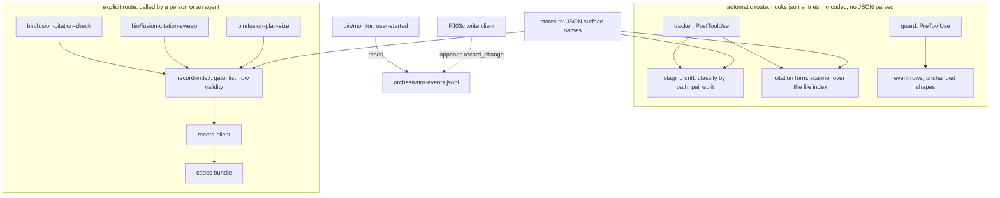
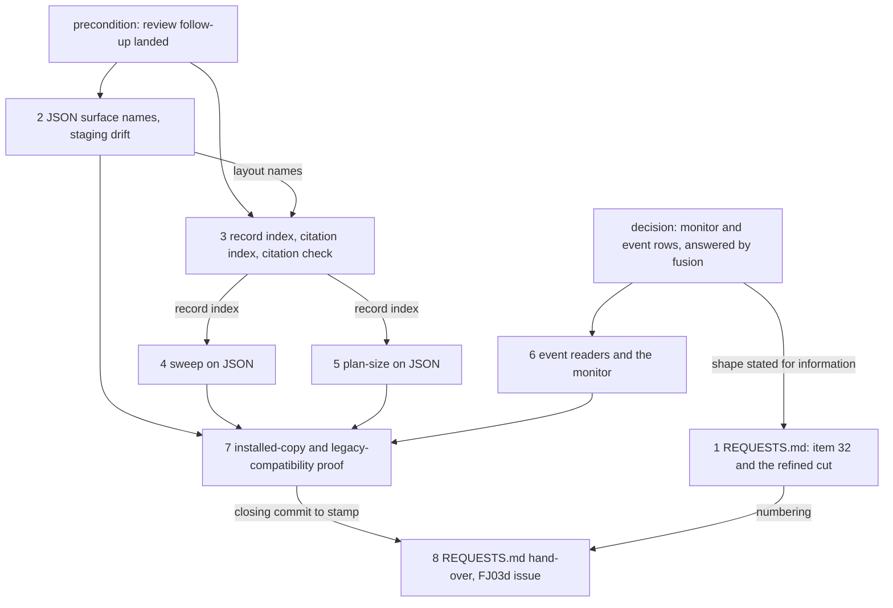

# Implementation Plan: FJ03b, the second part of the consumer cutover: observers, checkers, citations and the monitor on JSON

**Date:** 2026-09-30
**Status:** Draft
**Spec:** none as a requirements-designer spec. Prior's `concept/fusion-json-workbench-spec.md` at Prior `ad21e58`, read from the committed object: section 7, rows 7 ("Hooks/root/status-/citation-/staging-Verbraucher"), 8 ("Monitor und Events"), 10 ("Stores/Path-Lints/Tracking") and the check and sweep half of row 9 ("Zitierprüfung, Sweep, Archivierung"); section 3 (layout tree and tracking classes); section 4.4 (references); section 6 (the single reader); section 9, row FJ03b ("Auf JSON-Fixtures geprüfte Verbraucher; aktive Legacy-Sitzungen behalten passende Regeln und Leser") and the paragraph on the order and on automatic hooks. `codec/README.md` `## The CLI`, the host's inspect gate (Prior response 28 at `ad21e58`).
**Cross-references:** 260928-1338-json-control-data-and-markdown-artefacts.md, 260929-1810_*_plan-fj03a-the-record-client-the-format-gate-and-scope-and-order-on-json.md (closed; its standing rules and proof method are reused here), 260929-1810_*_in-which-order-do-the-parts-of-fj03-and-fj04-land-while-fusions-own-workbench-is-still-in-the-v12-form.md, 260929-1810_*_does-the-2026-09-27-ruling-on-the-growth-bound-reach-the-hook-tests-and-shipped-text-fj03-changes.md, 260929-1810_*_what-does-the-claude-side-declare-about-a-read-that-finishes-a-committed-intent.md, 260929-2025_*_which-response-size-does-the-claude-side-client-accept-from-the-codec-and-which-environment-does-the-child-get.md, 260930-1451_*_where-does-the-monitor-take-a-records-status-from-and-how-does-an-event-name-a-record-and-its-host.md, 260930-1446_*_scope-and-work-graph-each-carry-their-own-copy-of-the-reader-helpers.md, 260930-1446_*_scope-resolves-a-package-the-codecs-own-validation-refuses-while-the-order-reader-names-it-unreadable.md, 260930-1446_*_the-hook-route-exclusion-test-pins-which-modules-spawn-but-not-what-they-spawn.md, 260930-1219_*_the-rule-text-states-the-claim-criterion-in-head-fields-and-two-causes-of-exit-3-which-the-helpers-no-longer-match.md
**Planned against:** fusion `c6c25d3e` (the review commit; the code is FJ03a's close at `4bbc9d19`), bundle `codec/dist/fusion-record.js` 524 930 bytes, `sha256:5f116c6436175a6b8e1cb08aa2625d2e2f68ef193657b00eb1891ea8d3b965bd`; Prior `ad21e58`. Hook-test room at `4bbc9d19`: 6 lines, which the review follow-up may spend before this plan runs.
**Decidability:** The load-bearing question is which consumers of this part need a record's content (its status, id or hash binding), and whether each can get it without an automatic hook reaching the codec. It is decidable, because the split is by route, and the route of every entry is fixed by `hooks/hooks.json`. That split is disjoint and complete. **On the automatic route** (the six compiled entries `hooks/hooks.json` runs: tracker, guard, session-start, session-id, subagent-stop, identity-notice, and the shell lines beside them) the questions are about paths: is this path staged, which pair does it belong to, is it a control file or local journal state, does this citation name a file. They are decidable from the path grammar, `git status` and a directory listing, and no record's content is read. The format is known from the path's shape, not from `inspect`. A rule that fires only on a control-file path is vacuous on a legacy workbench, so no format decision is needed and no JSON is parsed. **On the explicit route** (`bin/fusion-citation-check`, `bin/fusion-citation-sweep`, `bin/fusion-plan-size`, which a person or an agent calls) the questions need content. They are decided by the codec's answers: the gate, `list`, and the row-validity criterion the review follow-up puts in one place. The gate partitions every call. `json-control` reads JSON. `legacy` runs the existing reader, named on stdout, because section 9 keeps legacy sessions on matching readers until the maintenance window. `unsupported`, a refusal or no answer is refused by name. **The monitor's question is not decidable as posed**: "the current status of a record" needs the codec, and the monitor has no plugin root at poll time and no human request behind each poll. The recommended option of the decision record filed with this plan changes the mechanism. The monitor answers "the last observed change of this record, by which host, at which revision", read from event rows that explicit mutation routes write after the codec has answered, from that answer, the gate and the writer's prior `show`. A hand edit or an unlogged write is invisible to that answer, and the panel says "observed", not "current". Not decidable here, and not approximated: whether a write-tool edit of a control file diverges from a committed intent. That is `reconcile`'s question, and the observers only record that a write tool touched the path (`guard_allow` already does).

## Directive

Carry rows 7, 8 and 10 of section 7 into code, with the check and sweep half of row 9, as the second of FJ03's four parts. After this plan: staging drift knows `workbench.json`, the pairs and `.json-state/`; the citation index folds a pair into one artefact and maps old marker basenames, new marker-free names and UUID references to the same record; the citation check, the sweep and the plan-size check take status and bindings from JSON on a JSON-controlled workbench and keep their legacy reader on a legacy one; the monitor and the event readers render rows that name a record and its host, and every historical row as before. No automatic hook reaches the codec, and none parses a control file. The bundle does not move. No file under `agents/`, `skills/`, `rules/`, `templates/`, `docs/` or `.claude-plugin/` changes.

## Current State

Verified at `c6c25d3e`, with the file where each statement is checkable:

- **Staging drift** (`hooks/lib/staging-drift.ts` `classify`) reads no marker and no head line. It classifies from `git status` and constant lists: `LIVE_STATE` and `LIVE_PREFIXES` (classes L, R2, R3), a container record `<root>/<d>/<d>.md`, any path with a store segment. `workbench.json`, `.json-state/*` and `work-packages/<d>/package.json` all fall to `unclassified`, so an unstaged manifest or package control file is never a fault. `.record.json` sidecars in a store are `record` through the store segment. `hooks/lib/__tests__/staging-drift.test.ts` pins `LIVE_STATE` and `LIVE_PREFIXES` to the L, R2 and R3 rows of `rules/workbench-tracking.md`, which names no JSON surface. The tracker runs it when HEAD moves.
- **The codec's layout names** are `WORKBENCH_MANIFEST`, `STATE_DIR`, `EVIDENCE_SUFFIX` and `isControlFile` in `codec/src/store.ts`. The codec writes `.json-state/.gitignore` as `*`, so a journal is ignored unless force-added.
- **The citation grammar** (`hooks/lib/citation-scan.ts`) resolves a citation against a fresh, unpersisted `readdirSync` index of the whole workbench, dot directories and `archive/` included. It reads no `**Status:**` line. A citation not ending `.md` matches as a prefix, so a stamp-and-slug token written without its extension would match both halves of a pair. Several hits are `ambiguous`, which counts as resolved and lands in `undecidable`, where section 4.4 asks for a conflict. The tracker runs this grammar on every write-tool `.md` write under the workbench (`hooks/lib/citation-form.ts`).
- **Filename markers read as state** on the explicit route: `isLiveRecord` in `hooks/lib/citation-corpus.ts` (the `verdict=` narrowing of `hooks/citation-check.ts`) and `LIVE_MARKERS` in `hooks/lib/plan-size.ts`. The sweep (`hooks/citation-sweep.ts`) rewrites Markdown only, reads no status, and runs behind three guards. `/fusion:migrate` calls it. Nothing calls `bin/fusion-citation-check` or `bin/fusion-plan-size`, although two headers say `/fusion:cleanup` Step 8 runs the check; that skill has no such step.
- **The lints that read this repository's own workbench** (`workbench-citation-lint`, `plan-stopping-section-lint`, `reference-resolution-lint`, `fenced-code-exemption`) call library functions and the marker predicates directly. They are FJ03d's, with the rule text, under the order item 26 records.
- **Events and the monitor** read no record. The only hook-written field that names a record is `task_start.work_item`, a container basename copied from the dispatch prompt. `bin/monitor` is a bash-wrapped Python server that the user starts from its copy under the workbench. It polls every 2 s, reads the two event logs, `.checkout-id` and the alias lines of `shared/checkouts/`, and shows the running dispatch's work item. Gate strings live in model prose and in the monitor's `gate_hit` mapping only.
- **Unaffected by this part, and why:** `hooks/lib/review-coverage.ts` reads `**Reviewed-range:**` of review reports, which stay Markdown reports (section 2.2); `hooks/lib/edge-answers.ts` reads curator-run reports; `hooks/lib/workbench-root.ts` walks to `.fusion-setup`, which a JSON workbench keeps (section 3, R3); `hooks/session-start.ts` counts sources outside the workbench.
- **The review of FJ02b and FJ03a** (`c6c25d3e`) filed seven issues. The orchestrator fixes the high and medium ones and three lows in a follow-up before this plan runs. That follow-up covers `hooks/lib/scope.ts`, `hooks/lib/work-graph.ts`, `hooks/scope.ts`, `hooks/order.ts`, `bin/fusion-claimed-package`, and likely a shared reader-helper module. This plan plans none of those fixes. It builds on the shared helpers and on the one row-validity criterion, if the follow-up lands them. The one certain fact is that `list` does not schema-check.

## Approach

**One path grammar on the automatic route, one record index on the explicit route.** The automatic observers learn the JSON surfaces as names: the manifest, the local journal, the three control-file shapes, and a control file's narrative partner. The names are held once in `hooks/lib/stores.ts` and pinned equal to the codec's constants. Nothing on that route opens a control file. The explicit checkers share one new module, `hooks/lib/record-index.ts`. It gates, sends `list` without a scope as FJ03a's readers do, takes the row-validity findings from the shared criterion, and builds three maps in memory: narrative path to record, record id to record, control path to record. Liveness comes from `codec/contract/transitions.json` (the `terminal` set per kind), the one source the kernel also reads. Nothing is persisted, so the index is deletable and rebuilt on every call, and a pull is seen on the next call (section 4.4). Legacy stays one named branch per explicit entry, chosen by the gate, and is the unchanged legacy reader; FJ03d removes it or narrows it to archive read mode in the maintenance window.

`RI` gating to `json-control`, `legacy` or refused is the three-way split every explicit entry makes; `legacy` hands over to the entry's existing reader and prints `format=legacy`. The dotted edge is FJ03c's, drawn so that the monitor's source is visible; FJ03b writes no `record_change` row.

**Standing rules for steps 2 to 7**, carried over from FJ03a and not repeated per step; the files they touch belong to each step's list: `hooks/dist/` is rebuilt and committed; a new or changed `hooks/lib` module or `bin/` helper gets its `README-hooks.md` row in the same step (`derivable-enumerations-lint.test.ts`); a moved count of `reference-resolution-lint.test.ts` is re-approved on its own line, attributed per file; the step replaces retired test lines before it asks for room, raises `TEST_LINE_HEAD_ROOM` by the measured remainder under the growth record (answered, option 2 then 1), logs the raise in `README-hooks.md` `### Growth bounds on the shipped text` with the figures before and after, and regenerates `fixtures/surface-growth.golden`, no baseline moving; the step is proven on a scratch clone with a scratch commit (`committed-dist.test.ts` judges HEAD), with the git-ignored `hooks/package-lock.json` copied in and no untracked `node_modules` swept into the commit; `shasum -a 256 codec/dist/fusion-record.js` is unchanged; `hook-route-exclusion.test.ts` stays green without an edit to its list of spawning modules or its import assertion. Where the review follow-up has left the hook-test room at 0, every step of this plan takes a raise; that is the ruled path and no stop.

Coherence check: every edge is a dependency a step declares below, and none declared there is missing; no cycle; `P` and `D` are preconditions outside the step list, each named in the step that waits on it.

## Implementation Steps

1. [DONE] **`REQUESTS.md`: the question FJ03b has for the Prior side**
   - Done 2026-09-30: `## FJ03b (questions before the observers)` appended to `codec/fixtures/prior/REQUESTS.md`, 69 lines, stamped fusion `b1dcd3c6` (the review follow-up landed after `c6c25d3e` and moved nothing under `codec/`) and Prior `ad21e58`, no Prior commit after it. Item 32 states the `record_change` row shape and asks three questions: (a) will Prior append with `host: "prior"`; (b) which fields it needs and what it writes for `person`, `checkout`, `session_id`; (c) confirm the `ts` form `YYYY-MM-DDTHH:MM:SS` (19 characters, no fraction, no `Z`, unlike the guard log's `toISOString()`), and whether it writes a row for `attach-evidence`. Departures: `attach-evidence` named as the eighth mutation the ruling defines no `change` for (FJ03c defines it); the legacy exit codes named (4 for the check and plan-size, 6 for the sweep). Bundle 524 930 bytes, digest unchanged.
   - Executor: `analyst`
   - Files: `codec/fixtures/prior/REQUESTS.md`
   - Changes: a section `## FJ03b (questions before the observers)`, written against `c6c25d3e` and Prior `ad21e58`, numbered on from 31. It states what FJ03b carries of rows 7 to 10 and which consumers it leaves as they are (`## Current State`, the unaffected list), and why the explicit checkers keep a named legacy branch where FJ03a's resolvers refuse: section 9's FJ03b row. (32) Fusion's `record_change` row shape, for information, as the decision record `260930-1451_*_where-does-the-monitor-take-a-records-status-from-and-how-does-an-event-name-a-record-and-its-host.md` is answered: one row per record written, `record_id` taken from the writer's prior `show`, `change` defined per operation. The questions are whether Prior will append to the same log with `host: "prior"` and which fields it needs. The item also states that a Prior writer must use the same fixed-width UTC `ts`, since the monitor orders rows by the raw string. FJ03c's writer waits for the reply; FJ03b's readers do not. One paragraph says FJ03b does not depend on item 31. It adds three consumers of an unscoped `list`, all through `hooks/lib/record-index.ts`, so an answer that brings paging changes that one module.
   - Acceptance: the item names the record it closes; every figure re-verified by command; `git diff --stat` for the step shows this one file.
   - Dependencies: the decision record answered (it is fusion's to answer; the item informs and asks, it does not wait).

2. [DONE] **The JSON surface names, and staging drift over them**
   - Done 2026-09-30: `hooks/lib/stores.ts` names `WORKBENCH_MANIFEST`, `JSON_STATE_DIR`, `PACKAGE_CONTROL`, `RECORD_CONTROL_SUFFIX`, `EVIDENCE_SUFFIX`, `isControlFile` and `narrativeOf`; `hooks/lib/staging-drift.ts` gains `JSON_LIVE_STATE` and the control-file branch in `classify`, and `markSplitPairs` sets the fault code `pair-split` on a row. **The class stays `record`** and the row prints `PAIR-SPLIT` in place of `UNSTAGED`: `agents/orchestrator.md` `## Staging check` names four classes and says what to do per class, and a fifth class would contradict a file this plan leaves alone, while "stage it" is the right act for the row. Tests over plain files, not kernel-written stores, because the classifier reads paths only; the legacy half is the unchanged existing cases. Hook-test room 0 -> raise +56 (3 453 -> 3 509) after 9 retired lines, logged in `README-hooks.md`; `reference-resolution-lint` paths 1778 -> 1781, all three the README's. Suite red in the monitor loopback case alone; codec suite green with goldens required; bundle unchanged.
   - Executor: `code-implementer`
   - Files: `hooks/lib/stores.ts`, `hooks/lib/staging-drift.ts`, `hooks/staging-drift.ts` (output text only where a new code prints), `bin/fusion-staging-drift` (header), `hooks/lib/__tests__/staging-drift.test.ts`, `hooks/lib/__tests__/fusion-stores.test.ts`, `README-hooks.md`
   - Changes, `stores.ts`: `WORKBENCH_MANIFEST`, `JSON_STATE_DIR`, `isControlFile(name)` (`package.json`, `*.record.json`, `*.evidence.json`) and `narrativeOf(controlPath)` (`<stem>.record.json` to `<stem>.md`, `package.json` to `<dir>.md` in its directory, `<stem>[.<n>].evidence.json` to the report `<stem>.md`). One home, beside the store names.
   - Changes, `staging-drift.ts`: `workbench.json` classifies `in-flight` (R3) and `.json-state/` `in-flight` (L). Both go in a list of their own, `JSON_LIVE_STATE`, which is not `LIVE_STATE`, so that the test pinning `LIVE_STATE` to `rules/workbench-tracking.md` stays true while that rule names no JSON surface. The header says that FJ03d merges the two lists when the rule gains the rows. A control file classifies as `record` wherever its narrative would (a container's `package.json` included). A new fault code, `pair-split`, marks a row where both halves of one pair appear in `git status` and exactly one of them is staged; it names both paths and takes the place of the plain record code on the unstaged half. Nothing is read from a file's content, and no subprocess is added.
   - Tests: the three new names classified as stated; a container `package.json` left unstaged is a fault; a staged narrative with an unstaged sidecar is one `pair-split` row naming both; a transition that changed only the control file, staged, is clean; a legacy tree gives the same rows as before; the new names in `stores.ts` equal the codec's, read from the text of `codec/src/store.ts` (a text read, not an import: the codec is a separate package whose sources the hook build does not resolve).
   - Acceptance: the suite green in every file, or red in the monitor loopback case alone (issue `260928-1520_*_the-monitor-wildcard-bind-case-times-out-on-a-host-its-own-probe-declares-usable.md`); `cd codec && CODEC_REQUIRE_GOLDENS=1 npm test` green; the `pair-split` case and the `package.json` case each shown red against a broken copy. Any red outside `staging-drift.test.ts` and `fusion-stores.test.ts` other than the growth-bound, golden and pin files the standing rules name is a stop.
   - Source: row 7 ("JSON-Änderungen und Paarzugehörigkeit beobachten"), row 10 ("JSON- und lokale Journalflächen explizit klassifizieren"), section 3.
   - Dependencies: none inside the plan; the review follow-up has landed.

3. [DONE] **The record index, the citation index beside the sidecars, and the citation check on JSON**
   - Done 2026-09-30: `hooks/lib/record-index.ts` gates, sends `list` and `reconcile` without a scope, and answers `json-control` (`byNarrative`, `byId`, `byControl`, `unreadable`, `unresolvedRefs` from `reconcile`'s `references` with reason `record-not-found`), `legacy`, or `unknown` with its cause; `live` from `codec/contract/transitions.json`, resolved beside the compiled module. `citation-scan.ts` indexes no control file and nothing under `.json-state/`. `citation-check.ts` prints `format=` first; on JSON it scopes the verdict by `live`, reads an ambiguous judged citation as a `conflict` violation, adds `conflict=` and `uuid-unresolved=` with one row per unresolved reference; exit 4 (not read) and 3 (missing bundle, internal error) are new. Extra file, approved by the orchestrator: `hooks/lib/__tests__/declared-citation-paths.test.ts`, two lines (it spawned the staging build, which reaches no codec), net 0. Decisions the step did not name: the same-artefact case covers two records, since the codec admits no single record citable by marker name, marker-free name and `depends_on` UUID at once (the placed imported issue for the marker and wildcard forms, a package for the marker-free name and the UUID); `recovery-blocked` inside `ok: true` is shown on the library with an injected `ask`, exit 4 on the entry through `unsupported`; `unreadRow` is package-shaped, so another kind's status is held to its own contract states and evidence to none; `workbenchId` left out, as nothing reads it; `uuid-unresolved=` does not move `verdict=`; an open discussion counts as live on JSON where legacy scopes it out. Red against broken copies: byNarrative keyed wrongly, conflict disabled, marker-decided liveness, control files indexed. Legacy diff over this repository's workbench: `format=legacy` plus one more declared file (the new module). Hook-test room 0 -> raise +81 (3 509 -> 3 590), nothing retired, logged in `README-hooks.md`; `reference-resolution-lint` paths 1781 -> 1789 (README +7, `bin/fusion-citation-check` +1). Suite red in the monitor loopback case alone; codec suite green with goldens required; bundle unchanged. Proven on scratch commits `c6d6b349` and `5302ab12`.
   - Executor: `code-implementer`
   - Files: `hooks/lib/record-index.ts` (new), `hooks/lib/citation-scan.ts`, `hooks/citation-check.ts`, `bin/fusion-citation-check` (header), `hooks/lib/__tests__/fusion-citation-check.test.ts`, `hooks/lib/__tests__/record-index.test.ts` (new, or cases in an existing file where that costs fewer lines), `README-hooks.md`
   - Changes, `record-index.ts`: `readRecordIndex(workbench, ask)`. It gates, sends `list` without a scope, and takes each row's validity from the shared criterion of the review follow-up, a row with a finding being `unreadable` and named. It returns `byNarrative`, `byId` and `byControl`, each entry carrying `id`, `kind`, `status`, `live` and the control path, together with the `unresolved-reference` findings on record references. `live` is `status` outside the kind's `terminal` set in `codec/contract/transitions.json`, which is resolved relative to the compiled module, as the bundle is. The answers mirror `scope.ts`: `json-control` with the index, `legacy`, or `unknown` with its cause (`unsupported`, `refused` with `recovery-blocked` among the refusals, `unanswered`). It imports the record client and the shared helpers. No automatic entry imports it.
   - Changes, `citation-scan.ts`: the basename index leaves out every control file and everything under `.json-state/`, using the names from step 2, so a pair is one citable artefact and a prefix citation of a new marker-free record has one hit. The change needs no format decision, and it reaches the tracker's citation-form measurement unchanged in shape.
   - Changes, `citation-check.ts`: a `format=` line first. On `json-control`, `verdict=` narrows by `live` from the index where it narrows by `isLiveRecord` on legacy, and a narrative without a record counts as not live (a report, an archived legacy file). An `ambiguous` hit is a `conflict` violation (section 4.4). The UUID half comes from the index's `unresolved-reference` findings, one `uuid-unresolved=` count and a row each. On `legacy` everything else is byte-identical to today. The exit codes gain 4: the workbench was not read (unsupported, refused, unanswered, `recovery-blocked`), with the cause on stderr and nothing on stdout. Exit 3 also covers a missing bundle. The stale `/fusion:cleanup` Step 8 sentence leaves both headers.
   - Tests, over kernel-written stores (`hooks/lib/__tests__/helpers/json-workbench.ts`): an old concrete-marker citation, its wildcarded form, the new marker-free name and a `depends_on` UUID all resolve to the same record id (section 9, "neue und alte Zitate lösen zum gleichen Artefakt auf"); a prefix citation of a pair has one hit; two files matching one citation are a `conflict`; a terminal record is not live whatever its basename's marker says; a placed `depends_on` UUID that resolves to nothing is counted; legacy prints `format=legacy` and otherwise the same bytes as before; unsupported is exit 4 with empty stdout; `recovery-blocked` inside an `ok: true` answer is exit 4.
   - Acceptance: the suite as in step 2; the same-artefact case, the conflict case and the terminal-marker case each shown red against a broken copy; `hook-route-exclusion.test.ts` green unchanged. Any red outside the named test files, other than the files the standing rules name, is a stop.
   - Source: row 9 ("UUID-Verweise und alte Basenames auflösen"), section 4.4, section 9 (mandatory checks).
   - Dependencies: 2.

4. [DONE] **The sweep on JSON**
   - Done 2026-09-30: `hooks/citation-sweep.ts` gates through `readRecordIndex` before the corpus is read and prints `format=` first. On `json-control` a `<path>` naming a file only the codec writes is exit 1; that is a control file, and also the manifest and anything under `.json-state/`, which the step did not name, since section 1.5 covers all codec JSON. A declared (`citations.extraPaths`) codec file is left out with a stderr line. The census prints `bound=<file>  <role>:<control>[, ...]` before the summary for each file in the write set bound by a package's `active_documents` (plan or spec, resolved through `byId`) or an evidence record's `report`, from one `show` per package and evidence row. The repair pass prints these lines too. A refused or unanswered `inspect`, `list`, `reconcile` or `show` is exit 6 with nothing on stdout, or exit 3 for a missing codec bundle, as the check does. Two gaps are stated in the header. A binding whose target is not in the index names no file. An evidence record's `brief_revision`/`plan_revision` bind by hash alone and name no path, so no `bound=` line comes from them. The test entry now runs the shared `hooks/dist/`, as `fusion-citation-check.test.ts` does, because only that build reaches the bundle. Red against broken copies: codec-file predicate disabled (control-file case gets exit 0), plan bound keyed by control path (the `bound=` case loses the plan line). Legacy diff over this repository's workbench, `bf3aea49` against the scratch commit, `--dry-run` and `--repair --dry-run`: `format=legacy` only, stderr identical. 40 packages, one adopted plan each: dry run 8.4-8.7 s on an M2 Max (three runs), of which 40 `show` calls are 7.3 s (about 180 ms per spawn) and `inspect`/`list`/`reconcile` about 190 ms each. Per the risk row, that figure is for step 8 to weigh as a request for a binding field in `list`. Hook-test room 0 -> raise +46 (3 590 -> 3 636), nothing retired, logged in `README-hooks.md`. `reference-resolution-lint` paths 1789 -> 1793, all four from the README. Suite red in the monitor loopback case alone; codec suite green with goldens required; bundle unchanged. Proven on scratch commit `987c9d69`.
   - Executor: `code-implementer`
   - Files: `hooks/citation-sweep.ts`, `bin/fusion-citation-sweep` (header), `hooks/lib/__tests__/citation-sweep.test.ts`, `README-hooks.md`
   - Changes: the sweep gates through `record-index.ts` and prints a `format=` line. On `json-control`, a control file is never in the corpus: a `<path>` argument naming one is refused, exit 1, since only the codec writes JSON (section 1.5). The census adds one `bound=` line per narrative in the write set whose bytes a record binds by hash: a package's `active_documents` entry (`show` of each package row) or an evidence record's report (`show` of each evidence row). Guard (b) then shows the user, before `--yes`, which rewrites would make a plan adoption or a review's evidence stale (section 9, "Briefänderung macht gebundene Nachweise stale"). The sweep refuses nothing on that ground: a rewrite is revertible under guard (a), and the staleness is the codec's to report. A new exit 6 means the workbench was not read. On `legacy` behaviour and output are unchanged apart from the `format=` line.
   - Tests: a control-file `<path>` is refused; a bound plan narrative and a bound report each print `bound=` in the dry run; an unbound narrative prints none; legacy output unchanged but for `format=`; unsupported is exit 6.
   - Acceptance: the suite as in step 2; the control-file refusal and the `bound=` case each shown red against a broken copy. Any red outside `citation-sweep.test.ts`, other than the files the standing rules name, is a stop. Measure one dry run over a fixture of 40 packages, one adopted plan each, and write the figure into the step's note.
   - Source: row 9 (check and sweep), section 1.5, section 4.4.
   - Dependencies: 3.

5. [DONE] **The plan-size check on JSON**
   - Done 2026-09-30: `hooks/plan-size.ts` gates through `readRecordIndex` before anything is read and prints `format=` first. On `json-control` `lib/plan-size.ts` `measureJsonPlanSizes` measures every plan record whose `live` is true at its narrative; on `legacy` `measurePlanSizes` keeps `LIVE_MARKERS`, both through one shared weighing, so `isSpec` and the skip of an unreadable file stay one copy. Exit 4 (workbench not read, nothing on stdout) and 3 (missing bundle, internal error) are new, as in the check. Two things the step did not name: a plan control file in a plans store that `reconcile` or `list` judged unreadable is counted on a json-only `unreadable=` line and named in a row, since whether it is live is what did not read and dropping it would be a silent `verdict=empty`; and `isSpec` also strips the marker-free `YYMMDD-HHMM-` stamp, so the `spec-` topic signature works on a JSON narrative's name (a legacy name reaches it only with a marker, so legacy is unchanged). Route check: nothing on `hooks/hooks.json` reaches `plan-size` (no import from the six compiled entries, no growth-bound test spawns it); `hook-route-exclusion.test.ts` green, unedited. Red against broken copies: liveness ignored (the closed `_o_` plan measured, `plans=2`), liveness by marker (the `_o_` plan measured in place of the live `_c_` one), a `_c_` marker vetoing a live record (`plans=0`). Legacy diff over this repository's workbench, `7c8a7dd1` against the scratch commit: `format=legacy` only, stderr identical, exit 0 both. Hook-test room 0 -> raise +41 (3 636 -> 3 677), nothing retired, logged in `README-hooks.md`. `reference-resolution-lint` paths 1793 -> 1796, all three the README's. Suite red in the monitor loopback case alone; codec suite green with goldens required; bundle unchanged. Proven on scratch commit `44c55989`.
   - Executor: `code-implementer`
   - Files: `hooks/lib/plan-size.ts`, `hooks/plan-size.ts`, `bin/fusion-plan-size` (header), `hooks/lib/__tests__/plan-size.test.ts`, `README-hooks.md`
   - Changes: gate through `record-index.ts`; `format=` line. On `json-control` the corpus is the plan records whose `live` is true, measured at their narrative; the spec exclusion (`isSpec`, which reads the narrative's own name and first line and no control field) is kept. On `legacy`, `LIVE_MARKERS` stays as it is. Exit 4 is new: the workbench was not read.
   - Tests: a live plan whose basename carries a terminal marker is measured; a closed plan whose basename carries `_o_` is not; legacy unchanged but for `format=`; unsupported is exit 4.
   - Acceptance: the suite as in step 2; the two marker-contradiction cases each shown red against a broken copy.
   - Source: row 7 (status consumers), section 7's closing classification ("`_o_`-Scans").
   - Dependencies: 3.

6. [DONE] **The event readers and the monitor**
   - Done 2026-09-30: `bin/monitor` reads `record_change` rows in `_record_changes`, a pass of its own over every row of the log, outside the own-checkout filter, sorted by the raw `ts` string (stable, so file order on ties); `_scoped_events` now leaves out every `record_change` row, this checkout's own included, so the mode, the session and the dispatch readings see what they saw before the kind existed. `_last_observed` gives the dashboard's `Last observed:` line under `Work item:` for a running dispatch that named an item: the newest row whose `path` is `work-packages/<item>/package.json` and whose `change` carries `to` or `created`, shown as status, the revision's first 12 hex after `sha256:`, host and UTC `hh:mm`; else `no observed change`. `/api/dashboard` serves the rows as `record_changes`, their own window of `MAX_EVENTS`, so another checkout's burst cannot evict this session's rows. The page merges both lists by `ts` and renders a `record_change` row as host, kind, path and move (`from -> to`, `created <status>`, or the change's own fields). Two things the step did not name: the event log heading says it shows both windows, and the step fixed a stale count in `README-hooks.md` `### Growth bounds on the shipped text` ("raised eight times" became eleven). `hooks/lib/events-query.ts` is unchanged: presence reads `session_start` and `task_start` only, dispatch durations `session_start`, `task_start` and `task_done`, and a `record_change` row is a JSON object and is not counted as malformed. A presence case in `fusion-events.test.ts` shows it. Red against broken copies: the checkout filter applied to `record_change` rows (the other-checkout case gets `claimed` where `blocked` is due), the oldest status row taken for the newest (the last-observed case and the other-checkout case), `record_change` rows left in the session rows (the `adopt-plan` case). Hook-test room 0 -> raise +65 (3 677 -> 3 742) after 5 retired lines (the dead `countTurns` import and three unused row builders in `fusion-events.test.ts`), logged in `README-hooks.md`. `reference-resolution-lint` paths 1796 -> 1799, all three the README's. Suite 1 046 of 1 047, red only in the monitor loopback case; codec suite green with goldens required, 1 045; bundle 524 930 bytes, digest unchanged; `hook-route-exclusion.test.ts` green, unedited; `hooks/dist/` unchanged, since no TypeScript source changed. Proven on scratch commit `533994e6`.
   - Executor: `code-implementer`
   - Files: `bin/monitor`, `hooks/lib/events-query.ts` (only where a `record_change` row would disturb a reading), `hooks/lib/__tests__/monitor-warnings-panel.test.ts`, `hooks/lib/__tests__/fusion-events.test.ts`, `README-hooks.md`
   - Changes, as the decision record's option 1 states them, and re-cut before this step runs if it is answered otherwise:
     - **The join.** The panel's work item is a container basename copied from the dispatch prompt (`task_start.work_item`). It matches a row exactly when the row's `path` equals `work-packages/<work_item>/package.json`. Nothing else is matched: no prefix, no id, no archived path.
     - **Which row.** The newest such row that carries `change.to` or `change.created`, shown as "last observed: `<status>` at `<revision, 12 hex>` by `<host>`, `<hh:mm>`". Rows of the same item that move no status (mode, dependencies, adoption) are shown on the event log page and never as status. Where no row matches, the panel says "no observed change".
     - **Reading outside the checkout filter.** `_read_events` keeps only rows of this checkout, or rows naming none. `record_change` rows are therefore read in a pass of their own, before that filter, so that a change by another checkout or by the Prior host reaches the panel. The filter keeps governing every other row and the session attribution it exists for.
     - **Order.** Rows are ordered by the raw `ts` string, as the monitor orders everything else, which is correct only while every writer writes the fixed-width UTC stamp (the decision record and item 32 say so). A revision hash gives no order and is never used for one. Where two rows share a `ts`, file order decides, since the sort is stable. The event log page renders a `record_change` row with host, kind, path and the move `from` to `to`. The monitor reads no record, runs no codec and gains no argument. Historical rows render as they do today: a `task_start` with `bytes_*` fields, `guard_block`, `gate_hit`, the retired kinds. `events-query.ts` leaves presence to `task_start.work_item`, and a `record_change` row changes no presence answer. The row's writer is FJ03c's, in its write client, at the shape item 32 confirms.
   - Tests: fixture rows only. The last-observed line for the running item, with an older and a newer row for it and one for another item; a newer row from another checkout, and one with `host: "prior"`, each winning; a `set-mode` row after a transition not replacing the status shown; the three rows of one `adopt-plan` sharing an `operation_id`; the "no observed change" line; one row of each historical kind above renders; presence unchanged by a `record_change` row.
   - Acceptance: the suite as in step 2; the other-checkout case and the last-observed case each shown red against a broken copy. Any red outside the two named test files, other than the files the standing rules name, is a stop.
   - Source: row 8; the decision record above, carrying its `Answered:` line before this step runs.
   - Dependencies: the decision record answered. Prior's reply to item 32 is not awaited, because nothing writes a `record_change` row before FJ03c and FJ03c is gated on item 32. A reply that changes the shape reaches this step's readers through FJ03c.

7. **The installed copy, and the legacy readers kept**
   - Executor: `code-implementer`
   - Files: `codec/src/__tests__/install.test.ts`
   - Changes: in the shape of FJ03a's two install cases, a third over a JSON-controlled `git init` project written by the installed `bin/fusion-record`. It runs `bin/fusion-citation-check`, `bin/fusion-plan-size`, a dry run of `bin/fusion-citation-sweep` and `bin/fusion-staging-drift` from the `git archive` installed by `install.sh`, with `node` the only runtime beside what `bin/fusion-identity` needs. It asserts `format=json-control`, one same-artefact resolution, and one `pair-split` row. The legacy half is a measurement written into the step's note, not a test, and it is taken over this repository's own legacy workbench in a scratch clone. The four helpers run at `c6c25d3e` and at the step's scratch commit, and their outputs are diffed. The only permitted difference is the added `format=legacy` line and nothing else. This is the section 9 evidence that "aktive Legacy-Sitzungen behalten passende … Leser". The file sits under `codec/`, outside the paths the FJ03 cut names for this part, because section 9 asks that the shipped helpers be tested and `install.test.ts` is where an installed copy is proven; `git diff --stat` over `codec/src codec/schemas codec/contract codec/dist` names that test file alone.
   - Acceptance: `cd codec && CODEC_REQUIRE_GOLDENS=1 npm test` and `npm run typecheck` green with the new case not skipped; the hook suite as in step 2; the legacy diff as stated, recorded with the commands; the room left on `agents/`, `skills/` and the hook tests re-read and written into the note with every raise taken by this plan.
   - Dependencies: 2, 4, 5, 6.

8. **`REQUESTS.md`: what landed, and the rule text filed for FJ03d**
   - Executor: `analyst`
   - Files: `codec/fixtures/prior/REQUESTS.md`, one new record in the issue store
   - Changes, `REQUESTS.md`: `## FJ03b (the observers)`, in the shape of `## FJ03a (the first consumers)`, stamped with step 7's commit and the unchanged digest. It covers the path grammar on the automatic route, the record index, each checker with its exit codes, the monitor's source, the legacy diff and how the recovery declaration still holds (no new spawning module on an automatic route). It cites whatever answer to items 31 and 32 has arrived, and assumes none.
   - Changes, the issue: `rules/fusion-workbench-conventions.md` `## fusion-workbench Layout` and `rules/workbench-tracking.md` name neither `workbench.json`, `.json-state/` nor the pairs, which staging drift classifies from step 2 on. Section 3 asks that layout definition, tracking rule and ignore hints change together, and the `/fusion:check` gitignore step and this repository's `.gitignore` are the ignore hints. `skills/help/SKILL.md` says the monitor reads the records. The record names each passage, the `JSON_LIVE_STATE` merge, and an acceptance for FJ03d.
   - Acceptance: every count and digest re-verified at the closing commit; `git diff --stat` for the step shows the two files.
   - Dependencies: 1, 7.

## Where this work stops

- The hook suite, run in a scratch clone at the closing commit, is green in every file, or red in the monitor loopback case alone.
- `cd codec && CODEC_REQUIRE_GOLDENS=1 npm test` and `npm run typecheck` are green at the closing commit, and `codec/dist/fusion-record.js` is 524 930 bytes at `sha256:5f116c6436175a6b8e1cb08aa2625d2e2f68ef193657b00eb1891ea8d3b965bd`.
- `hook-route-exclusion.test.ts` is green with its list of spawning modules and its import assertion unchanged by this plan, and no module an automatic entry reaches imports `hooks/lib/record-index.ts` or `hooks/lib/record-client.ts`.
- No executable line in a module an automatic entry reaches opens `workbench.json`, a `package.json`, a `*.record.json` or a `*.evidence.json`.
- On a JSON-controlled fixture, the installed `bin/fusion-citation-check`, `bin/fusion-plan-size`, `bin/fusion-citation-sweep` and `bin/fusion-staging-drift` answer from the JSON; unsupported is refused by name with nothing on stdout.
- Over this repository's legacy workbench the four helpers print what they printed at `c6c25d3e` plus one `format=legacy` line, and nothing else differs.
- No file under `agents/`, `skills/`, `rules/`, `templates/`, `docs/` or `.claude-plugin/` changed, nor `install.sh`, `CLAUDE.md`, `README.md`, `README-agents.md` or `.gitignore`; `plugin.json` stays at 12.0.0.
- No file under `codec/src/` outside `__tests__/`, `codec/schemas/`, `codec/contract/` or `codec/dist/` changed.
- Every head-room raise this plan took is logged in `README-hooks.md` with the figure before and after, and no baseline moved.
- Step 6 ran only after the decision record carried its `Answered:` line, and it implements the option that line names.
- Precondition for running steps 2 to 5: the review follow-up the orchestrator runs on the seven issues of `c6c25d3e` has landed.
- Precondition for planning FJ03c: this plan is closed, the `initialize` plan (item 27) is closed and qualified by the Prior side, and item 32 is answered.
- Precondition for installing a build of this branch here: this repository's workbench has been migrated, which is FJ04's, in the window item 26 records.

## Data Structures

- `RecordIndex` (`hooks/lib/record-index.ts`): `{ workbenchId, byNarrative, byId, byControl, unreadable[], unresolvedRefs[] }`. An entry is `{ id, kind, status, live, control, narrative }`. In memory only, built per call.
- The layout names (`hooks/lib/stores.ts`): `WORKBENCH_MANIFEST`, `JSON_STATE_DIR`, `isControlFile`, `narrativeOf`.
- `record_change` (read here, written by FJ03c): the shape of the decision record's option 1: one row per record written, `change` per operation, fixed-width UTC `ts`. Prior's fields from item 32 reach it through FJ03c.

## API Changes

- `bin/fusion-staging-drift`: classes for the three JSON surfaces; fault code `pair-split`. Exit codes unchanged.
- `bin/fusion-citation-check`: first line `format=`; `conflict` violations and `uuid-unresolved=` on JSON; exit 4 new.
- `bin/fusion-citation-sweep`: `format=`; `bound=` census lines; a control-file `<path>` refused (exit 1); exit 6 new.
- `bin/fusion-plan-size`: `format=`; exit 4 new.
- `bin/monitor`: the last-observed line and the `record_change` rendering; no new argument.
- New internal module `hooks/lib/record-index.ts`. Protocol and bundle unchanged.

## Testing Strategy

Every JSON case runs over a workbench the kernel wrote, through the fixture helper FJ03a landed; a state the kernel refuses to produce is placed by hand and says so. Legacy cases keep their existing fixtures, which is what "legacy readers kept" means in the suite; the diff over this repository's own workbench (step 7) is the evidence at scale. Section 9's checks that fall to this part: "neue und alte Zitate lösen zum gleichen Artefakt auf" and "historische Marker ändern die JSON-Entscheidung nicht" (steps 3 and 5), "fehlende Gegenstücke" as staging meets them (step 2, `pair-split`), "Monitor, Hooks und tatsächliche … Helper" (steps 6 and 7), "Briefänderung macht gebundene Nachweise stale" as the sweep can cause it (step 4, named before `--yes`).

## Risks & Mitigations

| Risk | Mitigation |
|------|------------|
| The review follow-up leaves 0 lines of hook-test room and every step needs a raise | The ruled path: replace first, raise the measured remainder, log it; each step's note carries its figures |
| The follow-up lands no shared reader-helper module | `record-index.ts` then takes the helpers from `record-client.ts` exports or states the gap; it re-spells none of them |
| A legacy session's output changes beyond `format=` | Step 7 diffs the four helpers over this repository's workbench; any other difference is a stop |
| The index over a large workbench exceeds a response bound | Item 31, not blocking; the index is the one place paging would land |
| The sweep's `bound=` pass costs one `show` per package and evidence row | Measured in step 4 on 40 packages; a figure a user would not wait for becomes a request for a binding field in `list` |
| The monitor's "last observed" is read as current | The label says observed and gives the time; the current state stays `bin/fusion-work-order`'s |
| Staging drift classifies surfaces the rule text does not name | Filed in step 8 for FJ03d with the merge of `JSON_LIVE_STATE` into `LIVE_STATE` |

## Open Questions

- [ ] `260930-1451_*_where-does-the-monitor-take-a-records-status-from-and-how-does-an-event-name-a-record-and-its-host.md`: binds steps 1 and 6 and FJ03c's write client; fusion answers it, and step 1 states the shape to the Prior side as item 32, for information.
- [ ] Item 31 (the response bound) stays open; FJ03b does not wait for it.
- [ ] Whether `transition` refuses foreign payload fields stays FJ03c's, as the FJ03a plan left it.
- [ ] `plugin.json` stays at 12.0.0 on this branch, as through FJ03a; the number is set at the release.
- [ ] The work package's `**Active spec/plan:**` names the closed FJ03a plan; it changes to this plan in the command that approves it.
