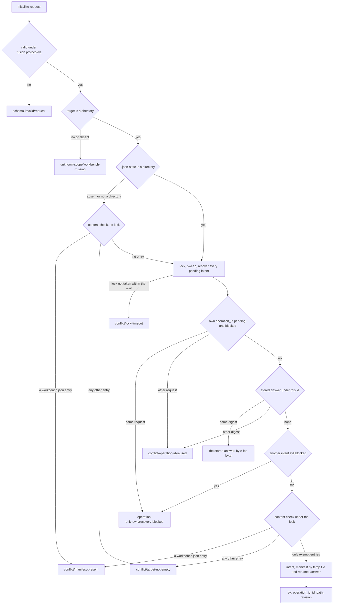
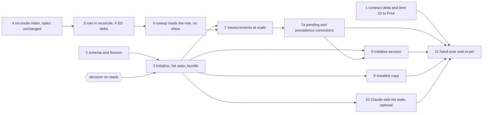

# Implementation Plan: one qualified codec revision: `initialize`, `list.result.state`, the linear `reconcile`, and the plan/spec role in its report

**Date:** 2026-09-30 (amended the same day for Prior `a15dfc8`, and again after steps 1 to 7 for Prior `ae1ad78` and `7909838`)
**Amendment (Prior `ae1ad78`, `7909838`):** `Prior: docs/design/fusion-qualified-revision-contract-response.md` accepts the combined revision and the principle of item 33. Three corrections to `inspect.pending` and to manifest-error precedence are due before the digest is frozen; step 7a carries them, and step 8 records their cases. `## 31` is answered: the codec channel takes 16 MiB, with the final LF included. `## 32` is accepted with details for FJ03c. The lock-temp-file exemption of step 3 is accepted at `7909838`.
**Status:** Complete (2026-09-30, every step `[DONE]`; approved by the user on 2026-09-30 with option 3 of the pending decision).
**Spec:** none as a requirements-designer spec. Prior's `concept/fusion-json-workbench-spec.md` at Prior `a15dfc8`: section 4.1 ("Formatprüfung für Verbraucher", "Neuanlage", and the "Ergänzung vom 30. September" on the `reconcile` fix and the role), the `initialize` row of section 6 with its replay, recovery and lock paragraphs, and the FJ03c row of section 9. The rulings: `Prior: docs/design/fusion-fj03a-followup-decisions.md` `## 27.` (`ddd4973`); `Prior: docs/design/fusion-fj03a-prior-response.md` `## 28 Format gate now and state in list with initialize` (`ad21e58`); `Prior: docs/design/fusion-initialize-reconcile-plan-amendment.md` (`a15dfc8`), option 1: the `reconcile` fix and the role ride this revision.
**Cross-references:** 260928-1338-json-control-data-and-markdown-artefacts.md, 260929-1810_*_which-write-creates-the-manifest-of-a-new-json-controlled-workbench.md, 260929-1810_*_list-answers-a-legacy-workbench-with-an-empty-list-and-names-no-state.md (closure (a) lands here), 260930-1654_*_does-a-read-finish-a-committed-initialize-whose-manifest-has-not-landed-or-report-the-target-as-legacy.md (open, gates step 3), 260930-1654_*_a-directory-named-workbench-json-makes-the-bundle-throw-and-exit-1-instead-of-answering.md (step 3), 260930-1712_*_the-codecs-reconcile-grows-with-the-square-of-the-record-count-and-outlasts-the-clients-timeout-from-about-1200-records.md (closed by steps 4 and 7), 260930-1646_*_the-sweeps-binding-pass-spawns-one-show-per-package-and-evidence-row-for-data-the-index-already-holds.md (closed by step 6), 260930-1800_*_fold-reconcile-fix-into-initialize-revision.md (discussion; C4, C10 and C2's conditions are used), 260929-1417_*_plan-fj02b-plan-progress-and-evidence-creation-through-the-kernel.md, 260930-1451_*_plan-fj03b-observers-checkers-citations-and-the-monitor-on-json.md, 260929-1810_*_does-the-2026-09-27-ruling-on-the-growth-bound-reach-the-hook-tests-and-shipped-text-fj03-changes.md, 260929-1810_*_what-does-the-claude-side-declare-about-a-read-that-finishes-a-committed-intent.md
**Planned against:** fusion `b3909330`, bundle 524 930 bytes, `sha256:5f116c6436175a6b8e1cb08aa2625d2e2f68ef193657b00eb1891ea8d3b965bd`; Prior `a15dfc8`. Hook-test head-room 3 763 at `b3909330`, room 0.
**Decidability:** Two load-bearing questions. (a) What `initialize` does on a target that is not an empty directory. That is decidable from the target's directory entries and the kernel's existing sequence (lock, sweep, recovery, replay lookup); the flowchart under `## Approach` is a disjoint and complete split. A missing or non-directory target is `unknown-scope/workbench-missing`. A `workbench.json` entry of any kind is `conflict/manifest-present`, and every other entry `conflict/target-not-empty`, with no guess about scaffolding. The one exemption is enumerated: `.json-state/` holding only what the lock protocol and sweep own, and empty `journal/` and `ops/`. Same-host competitors are serialised by the one lock; a committed intent is finished by recovery under it, and a diverged file is `recovery-blocked`, never overwritten. Left open by the texts, and filed: whether a *read* finishes a committed initialisation whose manifest has not landed. Section 6 only permits it ("dürfen"). The record recommends option 3: no read finishes *this* intent, and `inspect.pending` names the window. That wording does not reach ordinary committed intents, which FJ02 reads still recover (`a15dfc8`). (b) Whether an unscoped `reconcile` can answer in time for the consumers of a large store. Its cause is decidable: `resolveRecordId` walks and parses every control file per reference, which issue `260930-1712` measured at 310 s for 2 500 records. The fix is one ID index per read attempt. That the fix *suffices* is a measurement, not a derivation, so step 7 measures it on the actual bundle and on the four consumers. Whether the answer fits Prior's 1 MiB bound is item 31's, and is measured but not decided here.

## Directive

One codec revision, qualified by one Prior re-pin, carries four changes. First, `initialize` (request 27): over an existing empty directory it writes `workbench.json` through the kernel, and it refuses every other target by name. Second, `list.result.state` (request 28). Third, an unscoped `reconcile` linear in records plus references, with its answer bytes unchanged. Fourth, the role of each active-document binding in `reconcile`'s references, consumed by the citation sweep in place of one `show` per row. `/fusion:setup` does not call `initialize` yet (FJ03d), and nothing is migrated (FJ04). No file under `agents/`, `skills/`, `rules/`, `templates/`, `docs/` or `.claude-plugin/` changes, nor `install.sh`; `plugin.json` stays at 12.0.0.

## Current State

- `OPERATIONS` (`codec/src/cli/protocol.ts`) holds fourteen operations without `initialize`, and `protocol.test.ts` pins fourteen. `mutate` refuses every state but `json-control` before the lock, and `acquireLock` creates `.json-state/`. `read` runs a non-JSON workbench once without recovery, and `inspect` runs outside `read`.
- `list` answers `{workbench, scope, records}` with no state; `reconcile` answers `{workbench, state, scope, …}`. No recorded exchange sends `inspect` or `list`. A directory named `workbench.json` crashes the bundle (the issue).
- `readContext` (`codec/src/kernel.ts`) is shared by mutations and reads. Its `resolveRecordId` walks `controlFiles(wb, wb.root)`, which is sorted (`store.ts`), strict-parses each file, skips a refused one, applies no `blockedOn` filter, and lists ambiguous hits in walk order. `reconcile` builds its context once per body run and resolves through it per reference site, evidence binding and edge. `create` checks a free id through the same function (`ops.ts`, both create plans).
- `reconcile`'s reference entry is `{path, at, status, target?, class?, reason?}`. `protocol-session-fj02/15-reconcile.response.json` holds two `/active_documents/0/ref` entries, one `resolved` and one `unresolved`, and Prior pins that file.
- `bin/fusion-citation-sweep` sends one `show` per package and evidence row (`boundFiles` in `hooks/citation-sweep.ts`) to find each binding's role and report.
- The Claude side gates on `inspect`. Its three list readers (`scope.ts`, `work-graph.ts`, `record-index.ts`) send `list` through `resultOf`/`listOf` in `hooks/lib/codec-read.ts`, and two of them also send `reconcile` unscoped. The client's timeout is 70 s, the codec's 65 s wait plus `POST_WAIT_MARGIN_MS` (5 s).
- Items 31 and 32 are open. `initialize` depends on neither. Item 31 stays relevant to `reconcile`'s and `list`'s answer size, and a fast answer can still exceed 1 MiB (`a15dfc8`).

## Approach

**`initialize`: the kernel's one sequence, with the state gate made a parameter.** `mutate` takes the states an operation admits: `json-control` by default, every state for `initialize`. Replay, intent, recovery and lock stay identical. The plan function reads the directory under the lock and never `wb.state`, which recovery may have made stale. `PlanContext` exposes the blocked intents read-only, and the plan refuses `recovery-blocked` on any of them before its content check. **One content check, `initialContent(dir)`, at two sites**: under the lock, and once before it when `.json-state` is absent or no directory. In that case no answer, intent or lock can exist, so the answer is the lock path's, and a refused legacy target stays byte-identical, with no `.json-state/` inside a store FJ04 must migrate. The exempt names come from `store.ts`'s constants and are never re-spelled.

**Shapes.** The request is `{op: "initialize", workbench (required on this branch), operation_id, id: uuid}`; a manifest field sent by the caller is `schema-invalid/request`. The manifest is `serialise({schema: "fusion.workbench/v1", id, required_features: ["json-control-v1"], migration: null, extensions: {}})`, validated before the intent. The answer is `{operation_id, id, path: "workbench.json", revision}` with `revisions`, and it carries no absolute path. New reasons: `conflict/manifest-present` and `conflict/target-not-empty`, whose detail names the first entries found, sorted. The issue's fix adds the diagnosis `schema-invalid/manifest-not-a-file`. `list` becomes `{workbench, state, scope, records}` with `json-control` or `legacy`; unsupported stays a refusal.

**The `reconcile` index: inside `reconcile`, never in the shared `readContext`.** Mutations resolve through `readContext`, and a cached index could go stale inside one mutation (discussion C10). `reconcile`'s body builds a wrapped context whose `resolveRecordId` answers from one walk: `controlFiles(wb, wb.root)` in its sorted order, strict-parsed, refused files skipped, no `blockedOn` filter. The ambiguous detail lists hits in that order, so every answer byte stays as today (discussion C2's conditions). The index is local to one body run. `read` re-runs the body after a consistency retry or a recovery, so the index is rebuilt with the view. Nothing is persisted, and nothing reaches a mutation.

**The role.** On every reference entry whose `at` is `/active_documents/<i>/ref`, `role` is placed after `at`, whatever the entry's `status` (`resolved`, `unresolved`, `ambiguous`, `foreign`). It is copied from the stored `active_documents[i].role` when that is `plan` or `spec`, and left out otherwise; the record's schema finding already reports that case. Every other entry carries no `role`. The role describes the binding at its source, so nothing about an unresolved target is invented. Path, pointer, status and revision semantics are unchanged.

**Compatibility evidence, kept separate** (`a15dfc8`). Step 4 changes no answer byte: every recorded session and the handback replay byte for byte. Step 5 changes exactly the two role fields in `protocol-session-fj02/15-reconcile.response.json`. That file stays as recorded, the historical expectation. Beside it, a versioned delta file states the two added `role` fields by entry, and the FJ02 gate asserts that the new answer equals the recorded bytes with exactly that delta applied. Nothing is regenerated silently.

**Standing rules for steps 3 to 10**, carried over from FJ03a and FJ03b. Each step is proven on a scratch clone with a scratch commit (`committed-bundle.test.ts` and `committed-dist.test.ts` judge HEAD), with the git-ignored `hooks/package-lock.json` copied in. Every new test is shown red against a broken copy. The recorded sessions and the handback replay byte for byte without regeneration, except the one delta of step 5. A moved `reference-resolution-lint.test.ts` count is re-approved per file. Steps 6 and 10 touch the hook tests, where the room is 0: they replace first and raise `TEST_LINE_HEAD_ROOM` by the measured remainder alone. Each raise is logged in `README-hooks.md` `### Growth bounds on the shipped text` with the figures before and after and the golden regenerated, and no baseline moves. The hook suite may be red in the monitor loopback case alone (`260928-1520_*_the-monitor-wildcard-bind-case-times-out-on-a-host-its-own-probe-declares-usable.md`). `hook-route-exclusion.test.ts` stays green without an edit.

## Implementation Steps

1. [DONE] **The contract delta and item 33, to the Prior side**
   - Done (2026-09-30, analyst; drafted in the scratchpad, placed and committed by the orchestrator): `## One qualified revision (the contract delta before the kernel change)` appended to `codec/fixtures/prior/REQUESTS.md` after line 594 as a pure append (`diff` shows `594a595,689`), 95 lines, with sub-sections for `initialize` (request, manifest, answer, the flowchart as eight numbered steps, reason names, exemption, no-trace), `list.result.state`, `inspect` (fifteen operations, `pending`), the `reconcile` index, the role, the FJ02 delta file, the measurement protocol, and item 33 in the approved option-3 text, stated as fusion's decision open to Prior's objection. Stamped against fusion `3c0903f4` (`git diff --stat b3909330 3c0903f4 -- codec bin hooks` empty) and Prior `a15dfc8` (`git log --all a15dfc8..` empty), bundle 524 930 bytes, `sha256:5f116c64…b965bd` on disk and in the blobs at `3c0903f4` and `b3909330`; both Prior UPSTREAM pins still at `7b8dde51` (104 and 266 files). Departures: the exempt names are cited from `store.ts` and `journal.ts` (`JOURNAL_DIR`, `OPS_DIR` live in the latter); item 33's preferred form says "before the hand-over that freezes this revision's digest" in place of "before the freeze of step 11"; the expected FJ02 delta is named concretely (`"role":"plan"` on both `/active_documents/0/ref` entries), taken from the stored bindings.
   - Executor: `analyst`
   - Files: `codec/fixtures/prior/REQUESTS.md`
   - Changes: append `## One qualified revision (the contract delta before the kernel change)`, stamped with the fusion commit, Prior `a15dfc8` and the bundle digest above. As `a15dfc8` asks, it submits only the changed sections: the `initialize` shapes, the flowchart as a numbered order, the reason names, the exemption and the no-trace property; `list.result.state`; `inspect`'s fifteen operations and `pending`; the index's placement and preserved orderings; the role's exact placement and applicability; the FJ02 delta file; and the measurement protocol of step 7. It records `a15dfc8` as the basis for folding the `reconcile` fix and the role into this revision. It states one fusion decision as item 33, once the user has ruled (text for the recommended option 3):
     > **33. No read finishes a committed `initialize` whose manifest has not landed; `inspect` names that window.** The target then holds only `.json-state/` and is `legacy` under section 4.1. Not finishing is inside section 6's permission ("dürfen", "kann"). The statement is about this intent alone: ordinary committed intents are still recovered by FJ02 reads, as `a15dfc8` requires. Any `initialize` request finishes it under the lock. The same request answers the committed result; another one lands the committed intent first and is then refused `conflict/manifest-present`. `inspect` gains one additive field, `pending`. It is non-null exactly when the state is `legacy` and the only entry is a `.json-state/` holding a committed `initialize`, and it names that intent's operation id and whether it is blocked. **A duty on Prior's host:** its provisioning route acts on what `inspect` reports for that window (it sends `initialize`, never FJ04) and does not re-derive the codec's exemption list. Preferred form: an objection before the freeze of step 11, or none.
     The section says `initialize` depends on neither item 31 nor item 32. The analyst drafts it in its scratchpad; the orchestrator places and commits it (the FJ03b step 8 departure).
   - Dependencies: none
   - Acceptance: the commit changes `REQUESTS.md` alone; every figure re-taken.

2. [DONE] **The protocol schema and the fixtures of the new branch**
   - Done (2026-09-30, data-implementer; uncommitted, committed together with step 3): `initialize` in the `op` enum after `validate` and a `oneOf` branch after `validate`'s, `additionalProperties: false`, requiring `op`, `workbench`, `operation_id` and `id` (common `uuid`), one sentence in `description`. Fixtures `valid/protocol/initialize.json` and `invalid/protocol/initialize-without-workbench.json`, `initialize-without-operation-id.json`, `initialize-id-not-uuid.json`, `initialize-manifest-field.json`, each invalid one differing from the valid one in one field. The manifest gains the five entries (231 entries, protocol 51: valid 23, invalid 28). Departure: the existing `op-unknown.json` note said "the fourteen of spec section 6" and now says "fifteen". `fixtures.test.ts` green (234 tests). `CODEC_REQUIRE_GOLDENS=1 npm test`: one red file, `protocol.test.ts`, two cases (the fourteen-operation pin and the mutation list lacking `initialize`), both step 3's; `committed-bundle.test.ts` is green while the change is uncommitted, since it judges HEAD. `npm test` rebuilds `codec/dist/fusion-record.js` before vitest; that one file was restored to HEAD afterwards (524 930 bytes, `sha256:5f116c64…b965bd`), so step 3 rebuilds it.
   - Executor: `data-implementer`
   - Files: `codec/schemas/protocol.schema.json`; `codec/fixtures/valid/protocol/initialize.json`; `codec/fixtures/invalid/protocol/initialize-without-workbench.json`, `…-without-operation-id.json`, `…-id-not-uuid.json`, `…-manifest-field.json`; `codec/fixtures/manifest.json`
   - Changes: the `op` enum gains `initialize` after `validate`, with a `oneOf` branch as in the Approach (`additionalProperties: false`) and one sentence in `description`. The manifest gains five entries. `workbench.schema.json` already admits the written manifest.
   - Dependencies: none; committed together with step 3 (the schema is inlined into the bundle).
   - Acceptance: `fixtures.test.ts` green over the five. The expected reds are `protocol.test.ts` (fourteen operations) and `committed-bundle.test.ts`, which step 3 clears; any other red is a stop.

3. [DONE] **`initialize`, `list.result.state`, `inspect.pending`, the manifest-entry fix, and the rebuilt bundle**
   - Done (2026-09-30, code-implementer; uncommitted, to be committed together with step 2): `initialize` after `validate` in `OPERATIONS` and `IMPLEMENTED_OPERATIONS` (fifteen, fourteen answered); `mutate` takes the admitted states (`JSON_CONTROL_ONLY` by default, `EVERY_STATE` for `initialize`), `PlanContext.blocked`; `initialContent` and the plan function in `ops.ts`, the pre-lock check when `.json-state` is not a directory; `inspect.pending`, `list.result.state`; `openWorkbench` answers a non-file manifest `unsupported` with `schema-invalid/manifest-not-a-file` (issue closed). `read` unchanged but for its header sentence. **Bundle 530 839 bytes, `sha256:b229e5e8e32360b059fde0e3f0893eda42ae5700aab0d91d67191031c625f3f7`.** `CODEC_REQUIRE_GOLDENS=1 npm test` 1 080 tests green and `npm run typecheck` green in the live tree and at a scratch commit over `98ae181e` carrying step 2's files and this step's, where `committed-bundle.test.ts` was green, the rebuilt bundle equal to the committed blob and nothing regenerated (the clone's tree clean after the run); the FJ01, FJ02 and FJ02b sessions and the handback replayed unchanged. Hook suite 1 046 green, 1 red, the monitor loopback case alone, live and at the scratch commit; the reference-resolution count did not move. Red against the four broken copies, over the new cases of `ops.test.ts` and `kernel.test.ts`: content check disabled 12 red; exemption widened to all of `.json-state/` 5 red; pre-lock check removed 2 red (the no-trace and the manifest-present-before-the-lock cases); blocked check removed 2 red (the diverged manifest and the blocked pending intent). Departures: (a) the exemption also covers the temp files the lock protocol writes for the lock, a claim and the self-ignore (`lockProtocolOwns` in `store.ts`, with `SELF_IGNORE_FILE`), since a waiter's temp file stands in `.json-state/` while another process holds the lock and would otherwise refuse the winner of a race `target-not-empty`; the self-ignore is exempt only holding exactly `SELF_IGNORE`. (b) A pre-lock refusal stands only while `.json-state` is still not a directory after the check; otherwise the lock path answers, so a concurrent initialize's work in flight is never read as `target-not-empty`. (c) `pending.blocked` is `false` for every intent this codec writes (the manifest write's pre-state is absent, and `legacy` means no manifest entry), so the `true` case is pinned with a hand-written intent. (d) Presence of `workbench.json` is read with `lstat`, so a dangling link is `manifest-not-a-file` rather than `legacy`. (e) `codec/README.md` `## Layout`, outside the two named sections, said "fourteen operations" and now says fifteen.
   - Executor: `code-implementer`
   - Files: `codec/src/cli/protocol.ts`, `codec/src/kernel.ts`, `codec/src/cli/ops.ts`, `codec/src/store.ts`, their tests (`ops`, `kernel`, `store`, `protocol`), `codec/dist/fusion-record.js`, `codec/README.md` (`## The CLI`, `## The kernel and the journal`), `bin/fusion-record` (header), `README-hooks.md` (its roster row)
   - Changes: all as the Approach states. `initialize` joins `OPERATIONS` after `validate` and `IMPLEMENTED_OPERATIONS`, and the protocol test pins fifteen. `mutate` takes the admitted states, and `PlanContext` exposes the blocked intents. Under the recommended option 3, `read` is unchanged apart from one header sentence limited to this intent; `inspect` gains `pending`, computed by `initialContent`'s own exemption. `list` gains `state`. `openWorkbench` answers a non-file manifest `unsupported`. The copies of the operation list in the wrapper header and the roster row name `initialize`. The README states the operation, its refusals, `pending`, and that `state` does not waive the gate. Tests, one per case of Prior's ruling:
     - a non-empty legacy target is `target-not-empty` and stays byte-identical, with no `.json-state/`;
     - a manifest that is valid, unsupported or a directory is `manifest-present`;
     - a file or a missing target is `workbench-missing`;
     - competing initializers: in process, the first paused at `locked`, exactly one lands and the manifest id is the winner's; the same invariant with two spawned processes;
     - replay after a later `create` answers the stored bytes;
     - a changed request is `operation-id-reused`;
     - interruption before the commit point (stale lock of a dead PID, a dot-named half-built intent) and after it (every cut of `cutsFor(1)`);
     - divergent recovery is `recovery-blocked` for the same request and another one, with the file never overwritten;
     - a stored answer of another operation in `ops/` is `target-not-empty`;
     - `pending` null, pending and blocked;
     - `list` on an empty and a v12 directory (`legacy`), on JSON with `records: []`, and unsupported still refused.
   - Dependencies: step 2; the decision answered by the user
   - Acceptance: `cd codec && CODEC_REQUIRE_GOLDENS=1 npm test` and `npm run typecheck` green, and the committed-bundle gate green at the commit. The FJ01, FJ02 and FJ02b gates and the handback are green without regeneration. Red shown against these broken copies: content check disabled, exemption widened to all of `.json-state/`, pre-lock check removed, blocked check removed. The hook suite as the standing rules say. The note records the bundle's size and digest.

4. [DONE] **One ID index per `reconcile` read attempt, answer bytes unchanged**
   - Done (2026-09-30, code-implementer; uncommitted): `indexedContext(ctx)` in `ops.ts` wraps the read context `reconcile` builds per body run; its `resolveRecordId` answers from one `controlFiles(wb, wb.root)` walk taken on the first call (sorted order, strict-refused files skipped, no `blockedOn` filter, the kernel's two refusal texts word for word). `readContext`, the kernel's resolver and every mutation are unchanged. **Bundle 531 894 bytes, `sha256:fabb7812cdb069db4bb4a1c829c7054656eef67afcae37debed40eb1e6c769d3`.** Work count (N = 8 and 2N = 16 hand-written packages over the scratch workbench, each with four references and one edge): before, at `639d6185`, whole-store walks 56 and 104, strict parses 636 and 2 011; after, walks 3 and 3, parses 53 and 92. The test asserts parses at 2N at most twice those at N plus 3, and equal walks; red at `639d6185` (2 011 > 1 275). Two further cases: the retry path (a `create` landing at the first attempt's `read:after:between-listings` pause, two attempts, the reference resolved), red against a copy keeping the index across attempts; and the index against the kernel's resolver on found, missing, blocked and three-way ambiguous ids with a refused copy present, red against a copy with a blocked filter and one with the hits out of walk order. `CODEC_REQUIRE_GOLDENS=1 npm test` 1 083 green and `npm run typecheck` green live and at a scratch commit over `639d6185` carrying exactly these four files, where `committed-bundle.test.ts` was green, the rebuilt bundle equal to the committed blob and the clone clean after the run: FJ01, FJ02 (`15-reconcile` included), FJ02b and the handback replayed byte for byte, nothing regenerated. Hook suite 1 046 green, 1 red, the monitor loopback case alone, live and at the scratch commit. Departures: (a) the counting uses pass-through `vi.mock` spies on `controlFiles` and `strictParse` at the head of `ops.test.ts`, the first module mock in the codec suite; (b) the comment above `readContext` in `kernel.ts` still says `reconcile` resolves "through the same functions a mutation resolves them through"; the id resolver is now a different function with the same answers, and `kernel.ts` is outside this step's files, so the sentence is left for a later step to reword.
   - Executor: `code-implementer`
   - Files: `codec/src/cli/ops.ts` (`reconcile` and the helpers it passes its context to), `codec/src/__tests__/ops.test.ts` or `kernel.test.ts`, `codec/dist/fusion-record.js`, `codec/README.md` (`## What \`reconcile\` reports`)
   - Changes: the index and wrapped context as the Approach states. `readContext`, `resolveRecordId` and every mutation stay as they are. A deterministic work-count test uses a fixture of N packages each carrying several references, at N and 2N. It counts whole-store walks and control-file parses in one `reconcile` and asserts that parses grow with records plus references (at 2N at most twice the N figure plus a constant); the code at `b3909330` fails it. A second test pins the index rebuild on the retry path: a record lands during the first attempt, via the `read:after:between-listings` pause, and the answer resolves it. Kept by construction and pinned by the existing suite: duplicate-id `ambiguous-reference` with hits in walk order, a strict-refused file unresolvable, missing and foreign targets, blocked recovery findings.
   - Dependencies: none (may land before step 3)
   - Acceptance: codec suite and typecheck green. Every recorded session, `15-reconcile` included, and the handback replay byte for byte without regeneration: this is the performance-only evidence `a15dfc8` asks for, taken before step 5 moves a byte. The work-count test is red against the pre-fix code. Timing is not asserted here.

5. [DONE] **The binding role in `reconcile`'s references, and the reviewed FJ02 delta**
   - Done (2026-09-30, code-implementer; uncommitted): `ReferenceEntry` gains `role?` between `at` and `status`; `referenceSites` hands each `/active_documents/<i>/ref` site its binding, and `referenceEntry` copies the binding's stored `role` (only `plan` or `spec`) after `at` whatever the status, with no extra query. `codec/fixtures/protocol-session-fj02/15-reconcile.role-delta.json` names two adds in `/result/references`, `"role":"plan"` after `at` on the `/active_documents/0/ref` entries of the recorded session's strict-reader package (unresolved) and fj02-session package (resolved), as `REQUESTS.md` states it. The FJ02 gate replays 15 against the recorded bytes with exactly that delta (the recorded bytes must round-trip through JSON, each entry picked out once, each field new), checks that the delta names every binding of the recorded answer and nothing else, and shows an answer with one field less or one more unequal; every other exchange is byte for byte. `15-reconcile.response.json` untouched (`git status` names it not), and under `UPDATE_PROTOCOL_SESSION_FJ02=1` it is not rewritten (37 green, the session directory unchanged). **Bundle 532 278 bytes, `sha256:e8d6dd7e32d395b9b6c8d3b7bec41a5585f0dde469035f44ff31d741efd45656`.** `CODEC_REQUIRE_GOLDENS=1 npm test` 1 088 green and `npm run typecheck` green live and at a scratch commit over `de3a135c` carrying exactly the seven files, where `committed-bundle.test.ts` was green, the rebuilt bundle equal to the committed blob and the clone clean after the run; FJ01, FJ02b and the handback byte for byte. Hook suite 1 046 green, 1 red, the monitor loopback case alone, live and at the scratch commit. Red against four broken copies (ops and FJ02 files): role only on resolved entries 5 red; a role on `/evidence/` sites too 5 red; no role (the code at `de3a135c`) 5 red; role after `status` 4 red. Departures: (a) `referenceSites` (`ops.ts`, outside the two named symbols) carries the binding to `referenceEntry`, so the role comes from the binding itself; (b) the recorder's update path never rewrites 15's pair, so its request is compared directly rather than through `session.fresh`; (c) `codec/README.md` `## Layout`'s FJ02 row names the delta file.
   - Executor: `code-implementer`
   - Files: `codec/src/cli/ops.ts` (`referenceEntry` and `ReferenceEntry`), `codec/src/__tests__/ops.test.ts`, `codec/src/__tests__/round-trip-cli-fj02.test.ts`, `codec/fixtures/protocol-session-fj02/15-reconcile.role-delta.json` (new), `codec/fixtures/protocol-session-fj02/README.md`, `codec/dist/fusion-record.js`, `codec/README.md`
   - Changes: `role` as the Approach states. Cases cover a package with one plan binding and one spec binding, both of plan-kind records; an unresolved and an ambiguous binding, each carrying `role` and no `target`; and a non-binding reference with no `role`. The historical `15-reconcile.response.json` is not edited. The delta file names the fields the new answer adds, by entry path and pointer. The FJ02 gate replays exchange 15 against the recorded bytes plus exactly that delta, and every other exchange byte for byte. The README states the delta and why.
   - Dependencies: step 4
   - Acceptance: codec suite green; `git diff` shows `15-reconcile.response.json` untouched; the gate red against an answer carrying one field more or one less; FJ01, FJ02b and handback byte-identical.

6. [DONE] **The sweep reads the role from `reconcile`, and no `show` per row**
   - Done (2026-09-30, code-implementer; uncommitted): `RecordIndex.bindings` keeps, per control file, every `/active_documents/<i>/ref` entry of `reconcile`'s `references` as `{role, status, target}`, `target` only on a resolved one. `boundFiles` in `hooks/citation-sweep.ts` sends nothing: a readable package binds the narrative `byControl` holds for each resolved binding's target, under the role `reconcile` reported, and an evidence record binds `narrativeOf(control)`, its neighbour by the rule the kernel enforces (`report-not-neighbour`). An unresolved or ambiguous binding carries no target and names no file. The `show` refusal path to exit 6 is gone with the `show`; the header says so. Count test: a preload logs every request the spawned entry sends the bundle, over two packages (a plan and a spec adopted on one; on the other a plan whose record was then deleted, so its binding is unresolved) and one evidence record: `inspect`, `list`, `reconcile` exactly, and the `bound=` lines name the plan (`plan:`), the spec (`spec:`) and the report, not beta's plan. Red at `2146eefa` (the old `boundFiles`): three `show` after `reconcile`. Red against broken copies: role fixed to `plan`, evidence binding dropped. The unresolved row is a pin of unchanged behaviour, not red against the old code. **Timing**, the 40-package dry run of FJ03b step 4 rebuilt through the bundle (M2 Max, Node 25.7.0, three runs, then three interleaved): before 11.6, 11.7, 13.6 and 15.0, 14.9, 15.0 s; after 1.38, 1.18, 1.18 and 1.34, 1.27, 1.18 s. Stdout identical before and after, 40 `bound=` lines. Hook-test room 0 -> raise +20 (3 763 -> 3 783) after 9 lines retired, logged in `README-hooks.md`, which also corrects its head-room column (it still read 3 742 after the twelfth raise) and the two raise counts. `reference-resolution-lint` paths 1802 -> 1803, the README's. `hook-route-exclusion.test.ts` green, unedited. Hook suite 1 046 of 1 047, red only in the monitor loopback case, live and at a scratch commit over `2146eefa`; codec suite 1 088 green with goldens required; `codec/` untouched. Departures: (a) `hooks/lib/__tests__/reference-resolution-lint.test.ts`, the count's pin; (b) step 5's note above named two fixture packages by their full stems, which `workbench-citation-lint.test.ts` reads as dangling and which turned the hook suite red at `2146eefa`; it now names them in words; (c) issue `260930-1646_*_the-sweeps-binding-pass-spawns-one-show-per-package-and-evidence-row-for-data-the-index-already-holds.md` closed.
   - Executor: `code-implementer`
   - Files: `hooks/lib/record-index.ts`, `hooks/citation-sweep.ts`, `hooks/lib/__tests__/citation-sweep.test.ts`, `hooks/dist/`, `README-hooks.md`, the growth-bound files
   - Changes: the record index keeps, per package, the `active_documents` entries of `reconcile`'s `references` (`role`, `target`, `status`). `boundFiles` takes a package binding from that, and an evidence record's report from the neighbour naming rule (`narrativeOf`). Neither sends a `show`. An unresolved binding names no file, as today. Tests cover a plan-role and a spec-role binding with unchanged `bound=` lines and unchanged binding meaning, and the request count: exactly `inspect`, `list` and `reconcile` for any number of packages.
   - Dependencies: step 5
   - Acceptance: the hook suite as the standing rules say; the count test red against the old `boundFiles`; the raise logged; issue `260930-1646` closed with a `Resolved:` line.

7. [DONE] **Measurements at scale: `reconcile`, the four consumers, and answer sizes**
   - Done (2026-09-30, code-implementer; uncommitted): `codec/scripts/bench-fixture.mjs` builds the store through the bundle beside it, one spawn per request with an empty environment: `initialize` (workbench id `be0c0000-0000-4000-8000-000000000000`), then per package n a package `create`, a plan `create` with the package as origin, and `adopt-plan`, every id, operation id, stamp (2026-01-01 00:00 plus n minutes) and narrative text a function of n. The subsets `records-<N>/` are `workbench.json` plus the first N/2 package directories in name order, whole, with no `.json-state/`, as the issue measured. Two builds of five packages were byte-identical (`diff -r`); the full build was run once, so full-scale identity is inferred from that, not shown. Full build: 3 751 spawns, 1 649 s, max RSS 115 228 672 bytes. Subset tree digests (`find . -type f | LC_ALL=C sort | xargs shasum -a 256 | shasum -a 256`, first 16 hex): 200 `178bf339123d6362` (401 files), 500 `6fe472f463478c3e`, 1 000 `5ee957b24ba90959`, 2 500 `aa16a9c4e2bd289d` (5 001 files). Every measurement ran from a scratch clone at `f3923b23` (bundle 532 278 bytes, `sha256:e8d6dd7e…45656`, equal to the live tree's) over scratch directories; the live workbench was not touched. Machine: Apple M2 Max, 12 cores, 64 GiB, macOS 26.6.2, Node 25.7.0. **The machine was not idle**: another project's Go test and build jobs and an `eslint` run shared it. Load average about 5.5 during the codec runs, 20 to 48 during the fixture build, rising to 28 at the end of the consumer runs. Each op ran 5 times, `/usr/bin/time -l env -i node codec/dist/fusion-record.js`, the first `reconcile` run at each size the slowest of its series. Every answer `ok: true`, `state: json-control`, and every reference `resolved`; the absolute workbench path (136 bytes) appears once per answer.

     | Records | References | `reconcile` median / max | max RSS | bytes | `list` median / max | max RSS | bytes |
     |---|---|---|---|---|---|---|---|
     | 200 | 200 | 0.26 / 0.28 s | 92.5 MiB | 42 912 | 0.20 / 0.21 s | 89.0 MiB | 82 721 |
     | 500 | 500 | 0.35 / 0.39 s | 105.2 MiB | 106 812 | 0.24 / 0.24 s | 96.7 MiB | 206 471 |
     | 1 000 | 1 000 | 0.48 / 0.61 s | 105.8 MiB | 213 314 | 0.28 / 0.29 s | 103.1 MiB | 412 722 |
     | 2 500 | 2 500 | 0.89 / 1.14 s | 111.2 MiB | 532 814 | 0.44 / 0.47 s | 105.2 MiB | 1 031 472 |

     References are what `reconcile` reports: one `/active_documents/0/ref` per package and one `/control/acceptance/ref` per plan (the plan's origin), none at `/evidence/` or on an edge. Against the issue's pre-fix figures (2.1, 11.8, 47.1 and 310 s): **2 500 records at 0.89 s median, 1.14 s maximum, inside the 5 s target.** Consumers at 2 500 records, in a `git init` project with nothing committed, local `user.name` and `user.email`, a `.fusion-setup` marker beside the copied `records-2500/`, the clone's `bin/`, `env -i PATH=<node dir>:/usr/bin:/bin`, 3 runs each:

     | Consumer | Exit | Median / max | max RSS | stdout |
     |---|---|---|---|---|
     | `bin/fusion-claimed-package` | 0, 0, 0 | 2.47 / 2.94 s | 106.8 MiB | 0 bytes (nothing claimed) |
     | `bin/fusion-work-order` | 0, 0, 0 | 3.35 / 3.54 s | 108.0 MiB | 70 422 bytes, `items=1250`, `verdict=acyclic` |
     | `bin/fusion-citation-check` | 0, 0, 0 | 3.89 / 4.46 s | 108.1 MiB | `files=2500`, `tokens=0`, `verdict=clean` |
     | `bin/fusion-citation-sweep --dry-run` | 0, 0, 0 | 3.09 / 3.71 s | 108.5 MiB | `files=0 rewrites=0 … mode=dry-run` |

     Each well inside the client's 70 s. Max RSS is `time -l`'s figure for the helper's process tree. **Answer size, for item 31:** `reconcile` at 2 500 records is 532 814 bytes, 50.8 % of 1 MiB. `list` is 1 031 472 bytes, 98.4 % of 1 MiB and 17 104 bytes under it, at about 412 bytes a record with this fixture's 22-character slugs. inference: a store of real packages, whose slugs run longer and each of which is repeated in the record's paths, crosses 1 MiB in `list` below 2 500 records; that is the finding step 11 hands to item 31. Departure: no `codec/README.md` `## Layout` row names the new script (the table names `scripts/build.mjs`); neither suite asks for one, and the README was outside this step's files. Codec suite 1 088 green with goldens required; hook suite 1 046 of 1 047, red only in the monitor loopback case, both in the live tree with the script present.
   - Executor: `code-implementer`
   - Files: `codec/scripts/bench-fixture.mjs` (new; builds the store through the bundle with fixed ids, as issue `260930-1712` built it: packages each with one adopted plan, subsets at 200, 500, 1 000 and 2 500 records)
   - Changes: none to shipped behaviour; the generator is committed so that Prior can rebuild the fixtures. The step note records, per size: records and reference count, machine and Node version, at least three repetitions, median and maximum elapsed, peak memory (max RSS), and the output bytes of unscoped `reconcile` and `list`. The runs, through the committed bundle with an empty environment, are `reconcile` and, at 2 500, the complete consumers in a `git init` project: `bin/fusion-claimed-package`, `bin/fusion-work-order`, `bin/fusion-citation-check` and `bin/fusion-citation-sweep --dry-run`.
   - Dependencies: steps 3 and 6
   - Acceptance: an unscoped `reconcile` at 2 500 records answers within 5 s (`POST_WAIT_MARGIN_MS`) on the reference machine (M2 Max). Each consumer exits 0 within the client's 70 s, with its time recorded. Output bytes are stated against 1 MiB; an answer above it is a finding for item 31 in step 11 and no stop. Issue `260930-1712` is closed with a `Resolved:` line citing steps 4 and 7.

7a. [DONE] **The three corrections to `inspect.pending` and manifest-error precedence (Prior `ae1ad78` `## 33`)**
   - Done (2026-09-30, code-implementer; uncommitted): `blockedIntent(wb, p)` exported from `kernel.ts`, the recovery classification the lock-free `classify` now calls too. `pendingInitialize` in `ops.ts` reads every committed entry of `.json-state/journal/` (an entry gone since the listing skipped), whatever the state and the root hold, and answers `Result<null | {operation_id, id, blocked}>`: `id` from the staged manifest after strict parse and the workbench schema, `blocked` from `blockedIntent`. `inspect` refuses `operation-unknown/pending-initialize-unreadable` for an entry that does not read, an `initialize` whose writes are not exactly `workbench.json`, a staged manifest that does not validate or whose id differs from the intent's recorded answer (or the answer names none), and `operation-unknown/pending-initialize-ambiguous` for more than one committed `initialize`; each detail names the intent directories. The four envelopes over a non-file manifest: `inspect` ok (`unsupported`, `schema-invalid/manifest-not-a-file`, `pending` when one stands); `list`, `show`, `validate`, `reconcile` the typed refusal `schema-invalid/manifest-not-a-file`; every other mutation the gate's `unsupported-format/manifest-not-a-file`; `initialize` replay (stored answer or `operation-id-reused`) and `recovery-blocked` before the fresh path's `conflict/manifest-present`. No code change was needed for the precedence; it is now pinned. The comment above `readContext` names `reconcile`'s body-local index; `read`'s header and `codec/README.md` (`## The CLI`, the `pending` and non-file paragraphs; `## The kernel and the journal`, "One intent no read finishes") state the corrected shape and the four envelopes. `store.ts` and `store.test.ts` needed no change. **Bundle 534 131 bytes, `sha256:bde8f3c952bd111695dbac510d3c0802566080e07c2ba3b6396d9c2c807844d1`.** Tests: seven new cases in `ops.test.ts` (extra root content; divergent, other-workbench and non-file manifest, each blocked; a blocked intent's three refusals with the tree byte-identical; the unreadable data in six forms, one over a JSON workbench; two committed `initialize` and an `initialize` beside a `create`; reconstruction, then the same over a copy taken in the window, `operation-id-reused`; replay after `workbench.json` deleted, then `inspect` `legacy`; the precedence envelopes), one in `kernel.test.ts` (`blockedIntent` at pre, diverged, and after landing), and the two existing `pending` cases updated to the three-field shape (the hand-written blocked intent now records an answer with the id). `CODEC_REQUIRE_GOLDENS=1 npm test` 1 096 green (exit 0) and `npm run typecheck` green (exit 0) at a scratch commit over `31cdd1d3` carrying exactly the five source files and the bundle, the README with this step's two hunks only, and none of step 8's draft; `committed-bundle.test.ts` green there, the clone clean after the run; FJ01 (18), FJ02 with step 5's delta (37), FJ02b (49) and the handback (6) green, nothing regenerated. Hook suite 1 046 of 1 047 (exit 1), red only in the monitor loopback case, at the scratch commit and live. Red against broken copies (ops and kernel files): single-entry legacy condition restored 5 red; an unreadable intent mapped to null 1 red; `id` dropped 6 red; `manifest-present` ahead of replay 6 red. Live, with step 8's draft present: 1 137 of 1 138 green; the one red is the draft's `15-inspect` exchange, whose recorded `pending` lacks `id`, as step 8's rework expects. Departures: (a) a committed entry that does not read is refused whatever its state, a JSON workbench included, since its `op` cannot be known; on such a workbench `inspect` now refuses where it answered before, and the other reads still refuse `conflict/journal-unreadable` as they did. (b) `pending` names a committed `initialize` on any state until the intent leaves the journal, so also after `after-write:0` and `after-answer` cuts, where the state is `json-control`. (c) Over the copied directory, recovery lands the intent's manifest in the copy before the replay lookup answers `operation-id-reused`; that is the kernel's unchanged order, and the test asserts the refusal only. (d) inference, not tested: a dangling link at `workbench.json` reads as absent to `fileState`, so such a pending intent is `blocked: false`, and an `initialize` recovery replaces the link with the manifest.
   - Executor: `code-implementer`
   - Files: `codec/src/kernel.ts`, `codec/src/cli/ops.ts`, `codec/src/store.ts`, their tests (`kernel`, `ops`, `store`), `codec/dist/fusion-record.js`, `codec/README.md` (`## The CLI`, the `pending` and non-file-manifest paragraphs; `## The kernel and the journal`)
   - Changes:
     - **Detection independent of the fresh-target exemption.** `pendingInitialize` reads every committed intent in `.json-state/journal/` whose `op` is `initialize`, whatever else the root holds and whatever `workbench.json` is (absent, divergent bytes, not a file). It reports that intent until it is completed. `state` stays the manifest's. `blocked` comes from the kernel's recovery classification, exported from `kernel.ts` for this purpose, and no longer from a direct `fileState` call.
     - **Unreadable or contradictory journal data is never `pending: null`.** That covers an intent that does not read, an `initialize` intent whose writes are not exactly the manifest, and staged manifest bytes that do not validate or whose `id` differs from the intent's recorded answer. `inspect` refuses such data `operation-unknown/pending-initialize-unreadable`, and more than one committed `initialize` `operation-unknown/pending-initialize-ambiguous`, the detail naming the intent directories. Both reasons are pinned in step 11.
     - **`pending: null | {operation_id, id, blocked}`.** `id` is the workbench UUID read from the validated staged manifest.
     - **Precedence, as distinct envelopes.** A fresh `initialize` (no replay, no blocked intent) over any `workbench.json` entry answers `conflict/manifest-present`. `inspect` answers `ok` with `state: unsupported`, `diagnosis` `schema-invalid/manifest-not-a-file`, and `pending` when one exists. Ordinary reads keep their typed refusal with that diagnosis (`readable`), and other mutations keep `mutate`'s gate refusal. On `initialize`, replay (the stored answer, or `operation-id-reused`) and blocked recovery (`recovery-blocked`) keep their precedence. The README states these four envelopes in place of "every other read and mutation refuses with it".
     - **The stale comment above `readContext`** in `kernel.ts` (steps 4 and 5 notes) says that `reconcile` resolves through the same functions as a mutation. It is reworded: `reconcile` resolves through its body-local index under the same criterion.

     The tests cover:
     - the clean committed window;
     - extra root content beside the intent, with `pending` still named and `state` `legacy`;
     - a divergent manifest and a non-file manifest, each with `pending` named, `blocked: true` and the state its bytes give;
     - a blocked intent whose typed `recovery-blocked` answer leaves every file byte-identical;
     - an unreadable intent, and two committed `initialize` intents, each refused;
     - reconstruction: `{op, workbench: <target>, operation_id, id}` built from the target and `inspect.pending` alone answers the committed result, while the same built over a copied directory (another path, so another digest) is reported `operation-id-reused` and not worked around;
     - a successful replay followed by `inspect`: after `workbench.json` is deleted, the replay still answers success and `inspect` answers `legacy`.

     The step does not touch the paused step-8 draft (`helpers/session.ts`, `round-trip-cli-initialize.test.ts`, `fixtures/protocol-session-initialize/`, `fixtures.test.ts`) and commits only its own `codec/README.md` hunks. The draft's hunks stay unstaged, and the scratch-clone proof runs without them.
   - Dependencies: step 7
   - Acceptance: codec suite and typecheck green, with the committed-bundle gate green at the commit. FJ01, FJ02 (with step 5's delta), FJ02b and the handback green without regeneration. Each correction is shown red against a broken copy: the single-entry condition restored, an unreadable intent mapped to null, `id` dropped, `manifest-present` ahead of replay. The hook suite as the standing rules say. The bundle's size and digest are in the note.

8. [DONE] **The `initialize` recorded session**
   - Done (2026-09-30, code-implementer; uncommitted): `codec/fixtures/protocol-session-initialize/` holds twenty-six pairs, `base/`, five seeds and a README; `round-trip-cli-initialize.test.ts` is its gate (68 cases), regenerated only under `UPDATE_PROTOCOL_SESSION_INITIALIZE=1`; `helpers/session.ts` takes `base` (default the scratch workbench). R's targets: `legacy/` (a `.fusion-setup` and one v12 package's Markdown) and `file` from `base/`, `new/` made empty, and seeded `pending/`, `crowded/` (intent plus `notes.txt`), `diverged/` (intent under a valid manifest naming another workbench), `nonfile/` (intent under a `workbench.json` directory), `unreadable/` (an `intent.json` cut short). Exchanges: 01 `inspect new` legacy, `pending: null`; 02 `list new` and 03 `list legacy` `state: legacy`, `records: []`; 04 `initialize legacy` `target-not-empty`, `legacy/` byte-identical with no `.json-state/`; 05 `initialize file` `workbench-missing`; 06 lands; 07 repeats 06, 08 `inspect` json-control; 09 06's id with another UUID `operation-id-reused`; 10 another id `manifest-present`; 11 `list` json-control `[]`; 12 `create` a package; 13 repeats 06 after 12, 14 `inspect` json-control; 15 `list` one record; 16 `inspect pending` legacy with `pending {operation_id, id, blocked: false}`; 17 `initialize pending`, the request rebuilt from the target and 16's `pending` alone (asserted equal to the one the intent was cut from), the committed result byte-identical to the intent's recorded response; 18 `inspect` json-control, `pending: null`; 19 to 21 the same over `crowded/` (pending named beside the extra entry, landed, `notes.txt` kept); 22 `inspect diverged` json-control with `pending` blocked; 23 its rebuilt request `recovery-blocked`; 24 `inspect nonfile` `unsupported`, `schema-invalid/manifest-not-a-file`, `pending` blocked; 25 its rebuilt request `recovery-blocked` (ahead of `manifest-present`); 26 `inspect unreadable` `operation-unknown/pending-initialize-unreadable`. 23 and 25 leave every file of the target byte-identical but the lock's self-ignore, which taking the lock writes and which a seed cannot carry (a `*` ignore file would hide it from git); the recorder asserts that exception by name and content. The four readable intents are cut in process (`cutAt: "after-intent"`, clock fixed at 2026-09-30T18:00:00.000Z) from the very request of the `initialize` exchange after them; their `request_digest` is the placeholder `<request-digest:<nn>-initialize>`, and every `initialize` request is recorded in sorted key order, so the digest a replayer substitutes is `sha256:` over the request line without its newline (a case pins the equality); the session README states the rule. **Shell replay** (`bash`, `sed`, `shasum -a 256`, `cmp`, through `bin/fusion-record`) over R = `<scratchpad>/replay dir, one/R` in the live tree: 26 of 26 byte for byte, each exit 0, script exit 0; with a wrong digest substituted, 17, 20, 23 and 25 differ (`operation-id-reused`), script exit 1. Bundle unmoved: 534 131 bytes, `sha256:bde8f3c9…44d1`. At a scratch commit over `fb9e1b10` carrying exactly this step's files and `codec/README.md` with step 7a's two hunks and this step's: `CODEC_REQUIRE_GOLDENS=1 npm test` 1 164 green, exit 0; `npm run typecheck` exit 0; `committed-bundle.test.ts` green; FJ01 (18), FJ02 with step 5's delta (37), FJ02b (49), handback (6) and `fixtures.test.ts` (234) green, nothing regenerated, the clone clean after the run. Red against broken copies: digest not substituted (16 answers `pending-initialize-unreadable`, file red), the helper ignoring `base` (file red), the rebuilt request taking another id (13 red), the blocked comparison over every file (2 red), the `fixtures.test.ts` exemption removed (1 red). Live: codec suite 1 164 green (exit 0), typecheck exit 0. Hook suite 1 046 of 1 047 (exit 1), red only in the monitor loopback case, at the scratch commit (with this note) and live. Departures: (a) the exchange list grew from eighteen to twenty-six, as the amendment asks, with `crowded/`, `nonfile/` and `unreadable/` as new targets and an `inspect` after each landed seeded intent too; (b) the second substitution is the replay contract's addition named in the amendment, and step 11 hands it on; (c) the byte-identity of a blocked `initialize` excepts the lock's self-ignore, as above; (d) observed, not changed (codec code is outside this step): the detail of `pending-initialize-unreadable` for an unparseable `intent.json` names the intent directory twice (the kernel's own detail already begins with it).
   - Executor: `code-implementer`
   - Files: `codec/src/__tests__/helpers/session.ts` (a `base` option, defaulting to the scratch workbench), `codec/src/__tests__/round-trip-cli-initialize.test.ts`, `codec/fixtures/protocol-session-initialize/` (pairs, `base/`, `seed/`, `README.md`), `codec/src/__tests__/fixtures.test.ts`, `codec/README.md` (`## Layout`, `## What ships`)
   - Changes: `<workbench>` stands for a root R of targets: `legacy/` (a `.fusion-setup` and one v12 package), `file` (a regular file), `new/` (made empty by the recorder and the README), and `pending/` and `diverged/` from seeds. The exchanges, with fixed literals:
     - 01 `inspect new`: `legacy`;
     - 02 `list new` and 03 `list legacy`: `state: legacy`, `records: []`;
     - 04 `initialize legacy`: `target-not-empty`;
     - 05 `initialize file`: `workbench-missing`;
     - 06 `initialize new`: lands;
     - 07 repeats 06 and answers its bytes;
     - 08 06's id with another UUID: `operation-id-reused`;
     - 09 another id: `manifest-present`;
     - 10 `inspect new`: `json-control`;
     - 11 `list new`: `json-control`, `records: []`;
     - 12 `create new`: a package;
     - 13 repeats 06 and answers its bytes;
     - 14 `list new`: one record;
     - 15 `inspect pending`, over a committed intent from an in-process cut: `legacy` with `pending`, as ruled;
     - 16 `initialize pending`, the intent's request: the committed result;
     - 17 `inspect pending`: `json-control`;
     - 18 `initialize diverged`: `recovery-blocked`.

     The recorder also asserts that `legacy/` is unchanged and holds no `.json-state/` after 04, and that `diverged/workbench.json` keeps its bytes. Regeneration only under `UPDATE_PROTOCOL_SESSION_INITIALIZE=1`.

     **After step 7a (Prior `ae1ad78`).** The step reworks the uncommitted draft in the live tree (18 pairs, `base/`, two seeds, README, the helper's `base` option, the `fixtures.test.ts` and README edits) and does not start over. Changes to the exchange list, renumbered as the draft needs:
     - exchange 15 carries `pending` with `id`;
     - an `inspect` of the diverged target shows `pending` with `blocked: true`;
     - the request of exchange 16 must equal the one rebuilt from the target and 15's `pending` alone, which the recorder asserts;
     - an `inspect` follows each successful replay, 07 and 13;
     - new seeded cases: extra root content beside a committed intent (`pending` named), a non-file manifest with an intent (`unsupported`, `pending` blocked), and an unreadable intent (the typed refusal);
     - the recorder asserts that a blocked answer leaves every file byte-identical.

     **An addition to the replay contract.** A seeded intent stores its request digest, and `initialize` names `workbench` absolutely, so the digest depends on the replay root. The seeds therefore carry `<request-digest:NN-initialize>` placeholders. The replayer substitutes `sha256:` over the canonical request, which is the request line without its newline, since `initialize` requests are written with sorted keys. The README states this, and step 11 hands it to Prior as a rule its replay must adopt.
   - Dependencies: steps 3 and 7a
   - Acceptance: the gate green without regeneration; FJ02 (with step 5's delta) and FJ02b green after the helper change; a shell replay over an R path with a space and a comma, with the digest substitution, answers every exchange byte for byte, as recorded in the note.

9. [DONE] **The installed copy initialises a workbench the FJ03a resolvers read**
   - Done (2026-09-30, code-implementer; uncommitted): one case in `install.test.ts`, the fourth helper case, named in the header. `project()` gains `empty` (no marker, no manifest). The installed `bin/fusion-record` sends `initialize` with the workbench named, over an empty `fusion-workbench/` in a `git init` project; the answer is `{operation_id, id, path: "workbench.json", revision}` with the revision the digest of the written bytes, and the manifest parses to the ruled five fields. Then the test copies the installed fixture's `.fusion-setup` (Setup's order), `inspect` through the walk-up answers `json-control`, the request's id, `pending: null`; `bin/fusion-claimed-package` exits 0 with nothing printed (identity PATH); `bin/fusion-work-order` exits 0 with `items=0`, `edges=0`, `verdict=empty` (install PATH alone). A v12 workbench (the marker and one package's Markdown) is refused `conflict/target-not-empty`, the detail naming `.fusion-setup, work-packages`, exit 0; its tree (every entry, file bytes by digest) equal before and after, and no `.json-state/`. At a scratch commit over `9688d51a` carrying `install.test.ts` alone (`git diff --stat` over `codec/src codec/schemas codec/contract codec/dist` names it alone, 63 insertions, 5 deletions): `CODEC_REQUIRE_GOLDENS=1 npm test` 1 165 green, exit 0, the case run and not skipped; `npm run typecheck` exit 0; the clone clean after the run, bundle unmoved (534 131 bytes, `sha256:bde8f3c9…44d1`). Hook suite 1 046 of 1 047, exit 1, red only in the monitor loopback case. Red against two broken copies, each a scratch commit over that one (install file alone run): the bundle of `ab3f87e2`, before `initialize`, answers `operation-unknown/unknown-op` (this case red; the FJ03b observers case too, since that bundle predates the role); `initialContent` answering no entries, bundle rebuilt, lands a manifest over the v12 directory (this case red, the rest green). Live: the install file 9 of 9 green, exit 0.
   - Executor: `code-implementer`
   - Files: `codec/src/__tests__/install.test.ts`
   - Changes: a fourth case. The installed `bin/fusion-record` initialises an empty `fusion-workbench/` in a `git init` project, and the test then writes `.fusion-setup` (Setup's order). `bin/fusion-claimed-package` exits 0 with nothing printed, and `bin/fusion-work-order` prints `verdict=empty`. A v12 directory is refused and stays byte-identical.
   - Dependencies: step 3
   - Acceptance: the case runs, not skipped; the `git diff --stat` over `codec/src codec/schemas codec/contract codec/dist` names `install.test.ts` alone.

10. [DONE] **The Claude-side readers check `list.result.state` (optional, recommended)**
    - Done (2026-09-30, code-implementer; uncommitted): `listedRecords(workbench, ask)` in `hooks/lib/codec-read.ts` sends the unscoped `list` and reads its `state`: `json-control` hands on the `records` list, `legacy` is `{cause: "legacy"}`, anything else, absent included, `unanswered/unparseable` on `list` with the value named. `scope.ts` (`claimedBy` through `listClaimed`), `work-graph.ts` and `record-index.ts` call it in place of their own `list`/`records` pair, each after its gate, which is unchanged and first. `record-index.ts` maps `legacy` from the gate and from `list` alike to `{format: "legacy"}` (one local mapping; the old `as NotRead` cast is gone). Each module's header names the check; `README-hooks.md`'s `lib/codec-read.ts` row names `listedRecords`. Tests: the stubbed `list` answers of `fusion-claimed-package.test.ts` and `work-graph.test.ts` go through one `listing(records, state = "json-control")` builder each; `fusion-citation-check.test.ts` shares one `answering(listed)` builder between the blocked-recovery case and the new one. One new case per reader: a `legacy` list after a `json-control` gate is `unknown`/`failed` `legacy` (`claimedBy`, `readWorkGraph`) and `{format: "legacy"}` (`readRecordIndex`), and a list with no `state` (or `unsupported`, for the order reader) is `unanswered/unparseable` on `list`. Red against a copy of `listedRecords` without the two state lines: those three cases red, 42 others green. Hook-test room 0 -> raise +18 (3 783 -> 3 801): 19 lines added, 1 retired (the blocked-recovery case's inline answer table), logged in `README-hooks.md` as the fourteenth raise with the golden regenerated; the constant's comment now names the thirteenth raise too, which it had missed. `reference-resolution-lint` paths 1803 -> 1805, both the README's (measured by swapping each edited file back to HEAD). `hook-route-exclusion.test.ts` green, unedited. At a scratch commit over `15cff61d` carrying exactly these files (`npm ci` with the copied lock): hook suite 1 049 of 1 050, exit 1, red only in the monitor loopback case, `committed-dist.test.ts` green; `cd codec && CODEC_REQUIRE_GOLDENS=1 npm test` 1 165 green, exit 0; the clone clean after both runs. `codec/` untouched. Departures: (a) `legacy` from `list` in `record-index.ts` is the `legacy` format, as the gate's is, rather than an `unknown` read; (b) `hooks/lib/__tests__/reference-resolution-lint.test.ts`, the count's pin, and `surface-growth-bound.test.ts` with its golden are the growth-bound files.
    - Executor: `code-implementer`
    - Files: `hooks/lib/codec-read.ts`, `hooks/lib/scope.ts`, `hooks/lib/work-graph.ts`, `hooks/lib/record-index.ts`, their tests, `hooks/dist/`, `README-hooks.md`, the growth-bound files
    - Changes: one function reads `state` off a `list` result. `json-control` admits the read; `legacy` is `{cause: "legacy"}`, since the manifest was lost after the gate; anything else, absent included, is `unanswered/unparseable`. The gate stays first. Stubbed `list` results gain `state` in their shared builders, and one case per reader covers a `legacy` list after a `json-control` gate.
    - Dependencies: step 3
    - Acceptance: as step 6, with the cases red against a copy that ignores `state`.

11. [DONE] **The hand-over: what landed, the frozen digest, the re-pin**
   - Done (2026-09-30, analyst; drafted in the scratchpad, to be placed and committed by the orchestrator): `## One qualified revision (the hand-over)` appended to `codec/fixtures/prior/REQUESTS.md` after line 689 as a pure append (`diff` shows `689a690,800`), 111 lines. It is stamped against fusion `bc3b04a8`, the last commit that moved `codec/`, `bin/` or `hooks/` and the branch head. The bundle took its bytes at `fb9e1b10`: 534 131 bytes, `sha256:bde8f3c9…44d1`, the same on disk, in the blob and after the suite's rebuild in the clone. The three intermediate digests are listed. Prior is read at `7909838`, and `git log --all 7909838..` is empty. The section has these parts: `### What landed` in nine items, including the reason-name table and the corrected `pending` with the four envelopes, correcting the step-1 text without editing it; `### The evidence, kept apart` (step 4, step 5, step 7's table and a re-take); `### The initialize recorded session`, with the digest-placeholder rule and the self-ignore a blocked `initialize` leaves; `### Recovery and rollout consequences`, with the four Setup preconditions; `### Items 31 to 33, as they stand`; and two requests, **34** (re-snapshot at `bc3b04a8`: 231 entries, 60 valid, 171 invalid, protocol 51 = 23/28) and **35** (re-pin with the replay of the FJ01 pairs, the handback, FJ02 through its delta, FJ02b and `initialize`, and Prior's conformance run; FJ03c depends on it). Figures re-taken in a scratch clone of `bc3b04a8` (M2 Max, Node 25.7.0). `CODEC_REQUIRE_GOLDENS=1 npm test`: 18 files, 1 165 green, exit 0, 231 manifest entries, 13 goldens, 163 of 163 prior keys; the session gates were FJ01 18, handback 6, FJ02 37, FJ02b 49, initialize 68. `npm run typecheck` exit 0. Hook suite 1 049 of 1 050, exit 1, red only in the monitor loopback case. The clone was clean after both runs. The pinned-path hashes against Prior's two `UPSTREAM.json` at `7909838` (both at `7b8dde51`): in the FJ01 pin, 4 of 104 differ (`bin/fusion-record`, comments only; the bundle; `REQUESTS.md`; the FJ02 README); in the codec pin, 3 of 266 differ (the protocol schema, the manifest, `REQUESTS.md`); none are missing. At 2 500 records the `records-2500` tree from step 7 was reused, its digest re-hashed to `aa16a9c4e2bd289d`, and not rebuilt. Unscoped `reconcile` took 0.90 s median and 1.31 s maximum, at 532 805 bytes. `list` took 0.42 / 0.46 s at 1 031 463 bytes. Both byte counts equal step 7's less the 9 bytes of the shorter path. The four consumers exited 0 in 1.17 to 1.81 s with step 7's stdout. A shell replay of the `initialize` session over an R with a space and a comma answered 26 of 26, and the two blocked targets hold the self-ignore. With the new file placed in the clone, the hook lint tests (11 files, 191 tests) and the codec's prior and fixture tests were green; the clone was restored after. Departures: (a) the analyst may not write outside the workbench, so the file and this note are in the scratchpad, and marking and closing are the orchestrator's; (b) the timing re-take covers 2 500 records only, and 200 to 1 000 are cited from step 7; (c) the section adds, beyond the step text, the intermediate digests, the race evidence Prior asked for at `7909838`, and the consequence of step 7a's departure (a) for the Claude-side gate; (d) `inspect.result.operations.implemented` is stated as fourteen names of fifteen operations, as the recorded answers carry them.
    - Executor: `analyst`
    - Files: `codec/fixtures/prior/REQUESTS.md`, this plan
    - Changes: `## One qualified revision (the hand-over)` in the shape of `## FJ02b`, written against the last commit that moved `codec/`, `bin/` or `hooks/`, with the bundle's size and digest there. `### What landed` covers the four changes, the reason names as pinned and what did not change. The evidence is kept apart: step 4's byte identity, step 5's delta, step 7's figures with output bytes. The section adds the `initialize` session, the recovery and rollout consequences (FJ04's survey meets the `pending` window; ordinary intents are still recovered by reads), and items 31 to 33 as they stand. Four statements from Prior's `ae1ad78` and `7909838` go in as well:
      - the corrected `pending` envelope `null | {operation_id, id, blocked}`, the two new refusals and the four precedence envelopes of step 7a, correcting the step-1 text ("on every operation", the two-field `pending`) without editing it;
      - item 31 answered by `ae1ad78` (a 16 MiB codec channel, the final LF included; records and requests keep 1 MiB), with step 7's measured sizes kept: `list` at 2 500 records is 1 031 472 bytes, now inside 16 MiB, and `reconcile` 532 814. Paging is due only if a representative migrated store exceeds 16 MiB;
      - item 32 accepted, with its details left to FJ03c (optional identity fields, `run_id`, the `attach-evidence` and `create(kind: evidence)` change shapes, the idempotence key, no row for `initialize`);
      - the lock-temp-file exemption accepted at `7909838`, with the race evidence.

      The section also names step 8's digest-placeholder rule as a replay-contract addition Prior must adopt. Two requests take the next numbers: a re-snapshot of the shared fixture set with the new manifest counts, and a re-pin with the replay of the FJ01 pairs, the handback, the FJ02 (delta-reviewed), FJ02b and `initialize` sessions and Prior's conformance run, on which FJ03c depends. The plan is marked and closed.
    - Dependencies: steps 1, 7, 7a, 8, 9, and 10 when it runs
    - Acceptance: every figure re-taken in a scratch clone; the commit names `REQUESTS.md` and the plan alone.

## Where this work stops

- `cd codec && CODEC_REQUIRE_GOLDENS=1 npm test` and `npm run typecheck` are green at the closing commit, and `committed-bundle.test.ts` was green at every commit that moved code.
- `initialize` writes exactly the ruled manifest over an empty directory, and every flowchart leaf has a test shown red against a broken copy.
- A refused `initialize` over a directory without `.json-state/` leaves it byte-identical.
- `list` answers `state`, and `inspect` answers `pending` as `null | {operation_id, id, blocked}`. The field is detected independently of the fresh-target exemption. Unreadable or ambiguous journal data is refused, never `null`. The four precedence envelopes of step 7a each have a test (Prior `ae1ad78` `## 33`).
- A non-file `workbench.json` is answered, never thrown, and that issue is closed.
- After step 4 every recorded session and the handback replayed byte for byte.
- The work-count test holds `reconcile`'s parses linear in records plus references.
- Unscoped `reconcile` at 2 500 records answered within 5 s on the reference machine, and the step 7 figures (four sizes, four consumers, output bytes) are in the hand-over.
- `role` stands on exactly the active-document reference entries, whatever their status.
- `15-reconcile.response.json` is unedited, and its reviewed delta file is the only difference any gate admits.
- The sweep sends `inspect`, `list` and `reconcile` and no `show`. Issues `260930-1712` and `260930-1646` are closed.
- `protocol-session-initialize/` and its recorder are green without regeneration.
- No file under `codec/fixtures/valid/` at `b3909330` changed.
- The decision on reads is answered and followed.
- Step 10 landed with its raise logged, or was dropped at approval (condition did not arise: one clause).
- No file under `agents/`, `skills/`, `rules/`, `templates/`, `docs/` or `.claude-plugin/` changed, nor `install.sh`; `plugin.json` stays at 12.0.0.
- `REQUESTS.md` carries the sections of steps 1 and 11, the second stamped with the frozen digest.
- Precondition for FJ03c, not claimed here: Prior has re-pinned that digest and reported conformance green, and item 32 is answered. Before real migration, item 31 is answered as well; this revision does not remove the 1 MiB question.
- Precondition for FJ03c and FJ03d, text changes outside this plan, handed on in step 11:
  - `/fusion:setup` calls `initialize` before it creates the store directories, `.guard-state/`, the marker and `stilwerk/` (`skills/setup/SKILL.md`, in that order; section 4.1).
  - Its probe handles the `pending` window and a manifest without a marker.
  - It prints the refusal detail naming the entries to remove; `.DS_Store` and `.gitkeep` are refused by design.
  - It re-runs `inspect` after every successful `initialize`, since a same-id replay answers success even after `workbench.json` was deleted.

## Data Structures

- `InitializeRequest` `{op, workbench, operation_id, id}`; the answer `{operation_id, id, path, revision}` with `revisions`.
- `list`: `{workbench, state, scope, records}`. `inspect`: plus `pending` (`null`, or `{operation_id, id, blocked}`; step 7a).
- Reference entry: `{path, at, role?, status, target?, class?, reason?}`, with `role` on active-document entries only.
- `mutate` gains the admitted states; `PlanContext` the read-only blocked intents; `reconcile` a body-local ID index.

## API Changes

A fifteenth operation; `list.state`; `inspect.pending` under the recommended option; `role` on active-document reference entries; two new reasons and one diagnosis. Every request valid at `b3909330` validates and is answered as before, except over a directory-shaped manifest (a crash before) and in `reconcile`'s references (the role, reviewed as a delta). The digest moves at each code commit, and the hand-over names the last.

## Testing Strategy

Deterministic tests in `codec/` per ruled case, per flowchart leaf and per work count (steps 3 to 5). Recorded sessions carry the cross-host contract, with the performance fix proven byte-neutral before the role moves a byte (steps 4, 5 and 8). The installed copy and the sweep's request count come next (steps 6 and 9). Machine-sensitive timing and sizes stay out of the suite, in step 7's note and the hand-over.

## Risks & Mitigations

| Risk | Mitigation |
|---|---|
| The decision on reads is ruled against the recommendation | Step 3 waits. Option 1 drops `pending` and changes exchange 15; option 2 changes `read` and exchanges 15 and 17. The flowchart does not move |
| The index changes a byte (order, a skipped file, a blocked filter) | The three preserved conditions are named; step 4's acceptance is a full byte replay before step 5 |
| `reconcile` at 2 500 still exceeds 5 s after the fix | Step 7 reports the figure. The remaining cost is then located (for example the per-reference `resolveArtefact` hash) and fixed before step 11, never by raising the timeout (`a15dfc8`) |
| An answer at scale exceeds 1 MiB | Reported for item 31; no stop here, and no claim of migration readiness |
| Prior objects to the contract delta | Nothing is frozen before step 11; a later correction is additive and a new digest |
| The session helper's `base` breaks FJ02 or FJ02b | The default is unchanged; both gates green is acceptance of step 8 |
| The spawned race is flaky | It asserts only the invariant; the ordering is proven in process |
| The hook-test room is 0 (steps 6 and 10) | Replace, raise the measured remainder, log |

## Open Questions

- [ ] The decision on reads, `260930-1654_*_does-a-read-finish-a-committed-initialize-whose-manifest-has-not-landed-or-report-the-target-as-legacy.md`. The recommendation is option 3. The user rules; step 1 then states the ruling as item 33; step 3 waits.
- [ ] Is step 10 in scope? Recommended: yes, one site closes the gate-to-`list` window for about a dozen test lines and a logged raise.
- [ ] If Prior answers item 31 with paging before step 11, is it folded in? Recommended: no. Neither ruling this plan realises asks for it, and it would reopen the `list` exchanges; step 7's size figures feed that answer.
