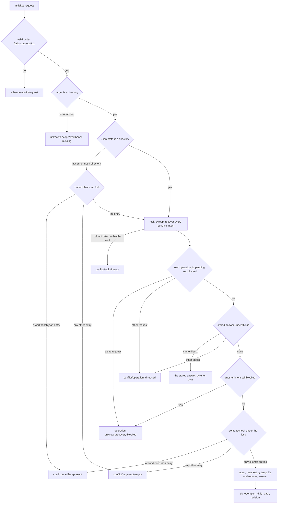
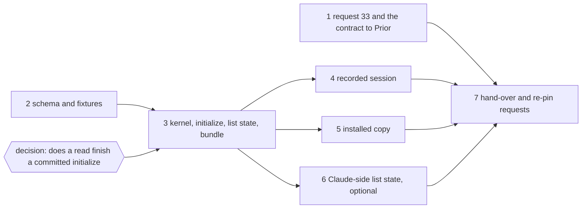

# Implementation Plan: `initialize`, the codec operation that creates a new JSON-controlled workbench, with `list.result.state` in the same bundle revision

**Date:** 2026-09-30
**Status:** Draft
**Spec:** none as a requirements-designer spec. Prior's `concept/fusion-json-workbench-spec.md` at Prior `ad21e58`, read from the committed object: section 4.1 (the "Formatprüfung für Verbraucher" and "Neuanlage" paragraphs), the `initialize` row of section 6 and the paragraphs on replay, recovery and the lock, and the FJ03c row of section 9 ("FJ03b, qualifiziertes `initialize`"). The rulings: `Prior: docs/design/fusion-fj03a-followup-decisions.md` `## 27. New manifest: a codec-owned initialize operation` at Prior `ddd4973`, and `Prior: docs/design/fusion-fj03a-prior-response.md` `## 28 Format gate now and state in list with initialize` at Prior `ad21e58`. `codec/README.md` `## The CLI`, the host's inspect gate.
**Cross-references:** 260928-1338-json-control-data-and-markdown-artefacts.md, 260929-1810_*_which-write-creates-the-manifest-of-a-new-json-controlled-workbench.md (answered, option 1), 260929-1810_*_list-answers-a-legacy-workbench-with-an-empty-list-and-names-no-state.md (closed, closure (b); this plan lands closure (a)), 260930-1654_*_does-a-read-finish-a-committed-initialize-whose-manifest-has-not-landed-or-report-the-target-as-legacy.md (open, gates step 3), 260930-1654_*_a-directory-named-workbench-json-makes-the-bundle-throw-and-exit-1-instead-of-answering.md (fixed in step 3), 260929-1417_*_plan-fj02b-plan-progress-and-evidence-creation-through-the-kernel.md (closed; the shape of a kernel extension and its hand-over), 260930-1451_*_plan-fj03b-observers-checkers-citations-and-the-monitor-on-json.md (closed; its standing rules are reused), 260929-1810_*_does-the-2026-09-27-ruling-on-the-growth-bound-reach-the-hook-tests-and-shipped-text-fj03-changes.md, 260929-1810_*_what-does-the-claude-side-declare-about-a-read-that-finishes-a-committed-intent.md
**Planned against:** fusion `57c5ac7c` (FJ03b closed), bundle `codec/dist/fusion-record.js` 524 930 bytes, `sha256:5f116c6436175a6b8e1cb08aa2625d2e2f68ef193657b00eb1891ea8d3b965bd`; Prior `ad21e58`, the head of the read-only checkout. Hook-test room at `57c5ac7c`: 0 lines (head-room 3 742, `hooks/lib/__tests__/surface-growth-bound.test.ts`).
**Decidability:** The load-bearing question is what `initialize` does on a target that is not an empty directory, and whether each answer is decidable from what the codec can read. It is, for every case the rulings name, by one ordered check over the target's directory entries and the kernel's existing sequence (lock, sweep, recovery of every pending intent, replay lookup). The flowchart under `## Approach` is the case split; each input falls in exactly one leaf. A missing target or one that is no directory is refused before any operation runs, as every operation refuses it today. A manifest entry of any kind (valid, unsupported, unparseable, foreign, a directory) is `conflict/manifest-present`. Every other entry is `conflict/target-not-empty`: legacy Markdown, `.fusion-setup`, stray control files of a half-finished import, an archive, a `.DS_Store`. The codec never guesses whether a populated directory is only Setup scaffolding, as Prior's ruling asks. The one exemption is enumerated by name: `.json-state/` holding only what the lock protocol and the sweep own (`.gitignore`, the lock, its takeover claims and temp files) and empty `journal/` and `ops/`. A stored answer of any other operation is not exempt. Concurrent initializers on one host are serialised by the one write lock, and the loser sees the winner's manifest. On two hosts the answer is the existing `conflict/lock-timeout`. A partial state (an intent committed, the manifest not yet written) is finished by the recovery the kernel already runs under the lock; a diverged file blocks it, and the answer is `operation-unknown/recovery-blocked`, never an overwrite. **One choice is left open by the repository and Prior's texts**: whether a *read* finishes such a committed initialisation or reports the target `legacy`, which section 4.1 defines as the state of a directory without a manifest. Section 6 only permits reads to reconstruct ("dürfen"), so not finishing needs no Prior ruling. It is filed as `260930-1654_*_does-a-read-finish-a-committed-initialize-whose-manifest-has-not-landed-or-report-the-target-as-legacy.md`. The recommendation is option 3: no read finishes it, and `inspect` names the window in one codec-owned additive field. Step 1 states the choice to Prior as a fusion decision, and step 3 waits for the user's ruling. Not approximated: whether a given UUID is "new". A copied directory carries its manifest, and that case is refused by the manifest rule.

## Directive

Add `initialize` to the shared codec contract as Prior ruled on request 27, and add `state` to `list`'s result in the same bundle revision as Prior ruled on request 28. Then hand the revision to Prior for re-pin and conformance, which qualifies it for FJ03c. After this plan, `{"op":"initialize","workbench":<abs>,"operation_id":…,"id":<uuid>}` over an existing empty directory writes `workbench.json` through the kernel and answers the identity, the manifest path and its revision. Every non-empty, non-directory or already-initialised target is refused by name. `list` names the workbench state. `/fusion:setup` does not call it yet (FJ03d), and no legacy store is migrated (FJ04). No file under `agents/`, `skills/`, `rules/`, `templates/`, `docs/` or `.claude-plugin/` changes, nor `install.sh`, and `plugin.json` stays at 12.0.0.

## Current State

- **No operation writes a manifest.** `OPERATIONS` in `codec/src/cli/protocol.ts` holds the fourteen of section 6 without `initialize`; the bundle answers `{"op":"initialize"}` `operation-unknown/unknown-op` (measured today). `protocol.test.ts` pins fourteen, and the schema's `op` enum equal to `OPERATIONS`.
- **The kernel refuses every state but `json-control` first.** `mutate` in `codec/src/kernel.ts` answers `unsupported-format/legacy-workbench` before it takes the lock, so a mutation on a legacy directory leaves no `.json-state/` behind. `acquireLock` runs `ensureSelfIgnore`, which creates `.json-state/` and its `.gitignore`.
- **`read` runs a non-JSON workbench once, without recovery**, and `inspect` is not under `read` at all.
- **`list` names no state.** Its result is `{workbench, scope, records}` (`ops.ts`). `validate` and `reconcile` carry `state`, `reconcile` as `{workbench, state, scope, …}`. An unsupported manifest refuses `list` by its diagnosis (`readable`). No recorded exchange of the three sessions sends `inspect` or `list`, so no pinned byte depends on either shape. Measured today over an empty directory: `list` answers `{"workbench":…,"scope":null,"records":[]}`.
- **A directory named `workbench.json` crashes the bundle** (exit 1, stack on stderr), filed as the issue cross-referenced above.
- **The Claude side gates on `inspect`** (`gate` in `hooks/lib/record-client.ts`), and its three list readers (`hooks/lib/scope.ts`, `hooks/lib/work-graph.ts`, `hooks/lib/record-index.ts`) each send `list` after the gate through `resultOf`/`listOf` in `hooks/lib/codec-read.ts`. Between the gate and `list` the manifest could change, and a `list` over a workbench that became legacy meanwhile reads as empty. Prior's response 28 keeps the gate, since a successful inspection is no lock.
- **The recorded-session helper** (`codec/src/__tests__/helpers/session.ts`) copies the scratch workbench `codec/fixtures/workbench/` as its base, substitutes `<workbench>` in requests and responses, and copies `seed/<nn>-<op>/` sets just before their exchange.
- **Items 31 and 32 are open** (`codec/fixtures/prior/REQUESTS.md` `### Items 31 and 32, as they stand`). `initialize` depends on neither. Its answer is a few hundred bytes, so the response bound of 31 does not reach it. `state` adds one short field to `list` and is compatible with each of the three ways item 31 names. Item 32's `record_change` row names a record of the six kinds, and a manifest is none of them. Whether FJ03c's write client logs an `initialize` is FJ03c's question.

## Approach

**One sequence, the kernel's, with the state gate made a parameter.** `mutate` keeps its order: state gate, lock, sweep, recovery, replay lookup, plan, intent, writes, answer. Its state gate becomes the set of states an operation admits, `json-control` by default and every state for `initialize`. That keeps replay, the CAS-free intent, recovery and the lock identical for the fifteenth operation, with no second route to the files. The plan function reads the directory under the lock and never `wb.state`, which was taken before the lock and may be stale once recovery has landed a pending manifest.

**One content check, called at two sites.** `initialContent(dir)` answers `manifest-present`, `target-not-empty` (the detail naming the first entries found, sorted) or empty-but-exempt. The kernel route calls it under the lock. The route also calls it once before the lock when `.json-state` is absent or is no directory. In that case no stored answer, intent or lock can exist, so the answer before the lock is the one the lock path would give, and a refused legacy target stays byte-identical, with no `.json-state/` created inside a store that FJ04 must migrate. A competitor that creates `.json-state/` after the check sends this request into the lock path on its next attempt. The check itself is never skipped.

**The request and the answer.** `{op: "initialize", workbench, operation_id, id}`. `workbench` is required on this branch, unlike every other, because the target is the subject of the operation, and a walk-up default from `bin/fusion-record` could name a parent's workbench. `id` is a `uuid` of `fusion.common/v1`. The caller sends no manifest field: `required_features`, `migration` and `extensions` are fixed by the ruling, and a request carrying one is `schema-invalid/request`. The manifest is `serialise({schema: "fusion.workbench/v1", id, required_features: ["json-control-v1"], migration: null, extensions: {}})`, validated as a result before the intent. The answer is `{operation_id, id, path: "workbench.json", revision}` with `revisions: {"workbench.json": revision}`. It carries no absolute path, so a replay answers the same bytes wherever the directory stands.

**Reason names**, following the kernel's conventions and pinned in the hand-over. New: `conflict/manifest-present` and `conflict/target-not-empty`. Reused: `unknown-scope/workbench-missing`, `conflict/operation-id-reused`, `conflict/lock-timeout`, `operation-unknown/recovery-blocked`, `schema-invalid/request`. The issue's fix adds `schema-invalid/manifest-not-a-file` as an `unsupported` diagnosis of `openWorkbench`.

**`list.result.state`**: `{workbench, state, scope, records}`, `reconcile`'s order, with `json-control` or `legacy`. Unsupported keeps its typed refusal, and `scope-missing` stays a refusal. The legacy walk is unchanged, so the change is additive.

**Where a blocked intent stops `initialize`.** The kernel checks planned writes against blocked intents only after the plan returns, but `initialize`'s plan refuses on content first. `PlanContext` therefore exposes the blocked intents read-only, and the plan refuses `recovery-blocked` on any of them before its content check. A blocked intent is by definition content the operation must not step over.

**Standing rules for steps 3 to 6**, carried over from FJ03a and FJ03b and not repeated per step. Each step is proven on a scratch clone with a scratch commit before the real commit (`committed-bundle.test.ts` and `committed-dist.test.ts` judge HEAD), with the git-ignored `hooks/package-lock.json` copied in and no untracked `node_modules` in the commit. Every new test is shown red against a broken copy. The three recorded sessions and the handback stay byte-identical, and their gates stay green without regeneration. A moved count of `reference-resolution-lint.test.ts` is re-approved on its own line, attributed per file. Only step 6 touches a bounded surface. There the hook-test room is 0, so the step replaces retired lines first and raises `TEST_LINE_HEAD_ROOM` by the measured remainder alone (the growth record, option 2 then 1). It logs the raise in `README-hooks.md` `### Growth bounds on the shipped text` with the figures before and after, regenerates `fixtures/surface-growth.golden`, and moves no baseline. The hook suite may be red in the monitor wildcard-bind loopback case alone (`260928-1520_*_the-monitor-wildcard-bind-case-times-out-on-a-host-its-own-probe-declares-usable.md`). `hook-route-exclusion.test.ts` stays green without an edit to its list of spawning modules.

## Implementation Steps

1. **Request 33 and the contract as fusion will build it, to the Prior side**
   - Executor: `analyst`
   - Files: `codec/fixtures/prior/REQUESTS.md`
   - Changes: append `## initialize (questions before the kernel change)`, stamped with the fusion commit it is written against, Prior `ad21e58` (or the Prior head then, with `git log --all ad21e58..` stated) and the bundle digest above. It states for review, before the freeze, the request and answer shapes, the flowchart as a numbered order, the reason names, the enumerated exemption, the no-trace property of a refused target without `.json-state/`, the `list.result.state` values and position, and that `inspect`'s `operations.implemented` gains `initialize` at the table's position (fifteen operations). It says that `initialize` depends on neither item 31 nor item 32, with the reasons under `## Current State`. It states one fusion decision, as item 33, once the user has ruled on the record (the text below assumes the recommended option 3):
     > **33. A read does not finish a committed `initialize`; `inspect` names the window.** Between the commit point of an `initialize` and the write of `workbench.json` the target holds only `.json-state/`. `openWorkbench` reports it `legacy` (no manifest, section 4.1). Fusion has decided that no read finishes such an intent, which is inside section 6's permission ("dürfen", "kann"): the read protocol already runs a non-JSON workbench once without recovery, and `inspect` stays write-free. Any `initialize` request finishes it through the kernel's recovery under the lock: the same request answers the committed result, and another lands it and is then refused `conflict/manifest-present`. `inspect` gains one additive field, `pending`, non-null exactly when the state is `legacy` and the only entry is a `.json-state/` holding a committed `initialize`, naming its operation id and whether it is blocked. **A duty on Prior's host:** its provisioning route acts on what `inspect` reports for that window (it sends `initialize`, never FJ04) and does not re-derive the codec's exemption list. Preferred form: an objection before the freeze of step 7, or none. Closes fusion decision `260930-1654_*_does-a-read-finish-a-committed-initialize-whose-manifest-has-not-landed-or-report-the-target-as-legacy.md` on the fusion side.
     The analyst drafts the section in its scratchpad and the orchestrator places and commits it, the departure FJ03b step 8 recorded.
   - Dependencies: none
   - Acceptance: `git diff --stat` of the commit names `codec/fixtures/prior/REQUESTS.md` alone; every figure in the section was re-taken for it.

2. **The protocol schema and the fixtures that pin the new branch**
   - Executor: `data-implementer`
   - Files: `codec/schemas/protocol.schema.json`, `codec/fixtures/valid/protocol/initialize.json`, `codec/fixtures/invalid/protocol/initialize-without-workbench.json`, `…/initialize-without-operation-id.json`, `…/initialize-id-not-uuid.json`, `…/initialize-manifest-field.json` (a `required_features` sent by the caller), `codec/fixtures/manifest.json`
   - Changes: the `op` enum gains `initialize` after `validate`. A `oneOf` branch `{op: const "initialize", workbench (required), operation_id, id: uuid}` is added with `additionalProperties: false`, and the schema's `description` gains one sentence on the operation. No other schema moves; `workbench.schema.json` already admits the manifest `initialize` writes (`valid/workbench/new.json`). The manifest gains the five entries.
   - Dependencies: none. Committed together with step 3, as FJ02b steps 1 and 2 were: the schema is inlined into the bundle.
   - Acceptance: `fixtures.test.ts` green over the five entries. The expected reds are `protocol.test.ts` (the fourteen-operations case) and `committed-bundle.test.ts`, which step 3 clears; any other red is a stop.

3. **`initialize` through the kernel, `list.result.state`, the manifest-entry fix, and the rebuilt bundle**
   - Executor: `code-implementer`
   - Files: `codec/src/cli/protocol.ts`, `codec/src/kernel.ts`, `codec/src/cli/ops.ts`, `codec/src/store.ts`, `codec/src/__tests__/ops.test.ts`, `codec/src/__tests__/kernel.test.ts`, `codec/src/__tests__/store.test.ts`, `codec/src/__tests__/protocol.test.ts`, `codec/dist/fusion-record.js`, `codec/README.md` (`## The CLI`, `## The kernel and the journal`), `bin/fusion-record` (header), `README-hooks.md` (the `bin/fusion-record` roster row)
   - Changes: in `protocol.ts`, `initialize` is inserted into `OPERATIONS` after `validate` and into `IMPLEMENTED_OPERATIONS`, with an `InitializeRequest` in the union; `protocol.test.ts` then pins fifteen. In `kernel.ts`, `mutate` takes the states an operation admits (default `json-control`), and `PlanContext` exposes the blocked intents read-only. The `read` header and its non-JSON branch are worded, or changed, as the decision is ruled. Under option 3 (recommended) `read` does not change: its header gains the sentence that a committed `initialize` on a manifest-less target is finished by an `initialize` request alone. `inspect` gains `pending`, computed by the same exemption `initialContent` uses (one function, no second list), null outside the window, with one case per value (null, pending, blocked). In `ops.ts`, the `initialize` route runs the pre-lock content check when `.json-state` is no directory, then `mutate` with every state admitted. Its plan function runs the blocked check, `initialContent` under the lock, then the manifest built, validated and serialised, as the Approach states. `list` gains `state`. In `store.ts`, `openWorkbench` answers a `workbench.json` entry that is not a regular file `unsupported` with `schema-invalid/manifest-not-a-file` (the issue). The exempt names come from `store.ts`'s own constants (`STATE_DIR`, `LOCK_FILE`, `TAKEOVER_INFIX`, the temp-file form) and are never re-spelled. Tests (`describe("initialize")` in `ops.test.ts`, cut and race cases in `kernel.test.ts`), one per case Prior's ruling lists:
     - a non-empty legacy target (a `.fusion-setup` and one v12 package) is refused `target-not-empty` and stays byte-identical, with no `.json-state/` created;
     - an existing manifest, valid, unsupported and a directory, is refused `manifest-present`;
     - a regular file as target, and a missing one, are refused `workbench-missing`;
     - competing initializers: two in-process requests with different ids and UUIDs, the first paused at `locked`, end with exactly one landed, the other `manifest-present` and the manifest's id the winner's; the same shown with two spawned bundle processes, asserting only that invariant;
     - replay after later writes: an identical request after a `create` answers the stored bytes;
     - a changed request (same `operation_id`, other UUID) is `operation-id-reused`;
     - interruption before the commit point: a stale lock of a dead PID and a dot-named half-built intent, staged as `kernel.test.ts` stages them for FJ02, after which the retry lands and the half-built intent is swept; interruption after it: every cut of `cutsFor(1)`, after which the same request answers the committed result and a new request lands it and is refused `manifest-present`;
     - divergent recovery: a committed intent plus a hand-written `workbench.json` at other bytes is `recovery-blocked` for the same request and for another one, and the file is never overwritten;
     - the exemption holds for exactly the named entries: a stored answer of another operation in `ops/` is `target-not-empty`.

     `list` gets three cases, `legacy` on an empty directory and on a v12 one, `json-control` with `records: []`, unsupported still refused. `inspect` names `initialize` implemented. The bundle is rebuilt and committed. The copies of the operation list in the `bin/fusion-record` header and its `README-hooks.md` roster row name `initialize`. `codec/README.md` `## The CLI` states the operation, its refusals and that `list.result.state` now exists and does not waive the gate; `## The kernel and the journal` states the admitted-states parameter and the `read` sentence.
   - Dependencies: step 2; the decision cited above answered by the user (the user may take Prior's reply to request 33 as the answer)
   - Acceptance: `cd codec && CODEC_REQUIRE_GOLDENS=1 npm test` and `npm run typecheck` green, with `committed-bundle.test.ts` green at the commit. `round-trip-cli.test.ts`, `round-trip-cli-fj02.test.ts`, `round-trip-cli-fj02b.test.ts` and `prior-handback.test.ts` are green without regeneration. Each case above is shown red against a broken copy: the content check disabled, the exemption widened to all of `.json-state/`, the pre-lock check removed (the legacy target gains `.json-state/`), the blocked check removed. The hook suite in a scratch clone is as the standing rules state, with `record-client.test.ts` green. The note records the new bundle's size and digest.

4. **The recorded session for the Prior side**
   - Executor: `code-implementer`
   - Files: `codec/src/__tests__/helpers/session.ts`, `codec/src/__tests__/round-trip-cli-initialize.test.ts` (new), `codec/fixtures/protocol-session-initialize/` (new: pairs, `base/`, `seed/`, `README.md`), `codec/src/__tests__/fixtures.test.ts` (the exemption), `codec/README.md` (`## Layout`, `## What ships`)
   - Changes: the helper gains a `base` option, the directory a session copies, which defaults to the scratch workbench so the FJ02 and FJ02b recorders are untouched. In this session `<workbench>` stands for a root R holding targets: `base/legacy/` (a `.fusion-setup` and one v12 package), `base/file` (a regular file), `new/` (created empty by the recorder and by the README's procedure, since git keeps no empty directory), and `pending/` and `diverged/`, which come only from seeds. The exchanges, every id and time a fixed literal:
     - `01-inspect new` answers `legacy`;
     - `02-list new` answers `state: legacy` with `records: []`;
     - `03-list legacy` answers the same, the case request 28 measured;
     - `04-initialize legacy` answers `target-not-empty`;
     - `05-initialize file` answers `workbench-missing`;
     - `06-initialize new` lands;
     - `07` repeats 06 and answers 06's bytes;
     - `08` sends 06's id with another UUID and answers `operation-id-reused`;
     - `09` sends another id and answers `manifest-present`;
     - `10-inspect new` answers `json-control`;
     - `11-list new` answers `state: json-control` with `records: []`, the JSON-controlled empty store;
     - `12-create new` writes a package;
     - `13` repeats 06 after 12 and answers 06's bytes;
     - `14-list new` answers one record;
     - `15-inspect pending`, over `seed/15-inspect/` (a committed intent produced by an in-process cut at `after-intent` and copied byte for byte), answers `legacy` with `pending` naming the intent (under the recommended option 3; otherwise as the decision rules);
     - `16-initialize pending`, the intent's own request, answers the committed result;
     - `17-inspect pending` answers `json-control`;
     - `18-initialize diverged`, over `seed/18-initialize/` (the intent plus `workbench.json` at other bytes), answers `recovery-blocked`.

     The recorder asserts each response byte for byte. It asserts that R's listing under `legacy/` is unchanged after 04 and holds no `.json-state/`, and that `diverged/workbench.json` keeps its seeded bytes after 18. Regeneration happens only under `UPDATE_PROTOCOL_SESSION_INITIALIZE=1`. The README carries the replay procedure (copy `base/` to R, `mkdir R/new`, seeds before their exchange, substitute R, compare stdout, a fresh R per run).
   - Dependencies: step 3
   - Acceptance: the new gate is green without regeneration. The FJ02 and FJ02b gates are green without regeneration after the helper change. A shell replay through the bundle, over an R whose path contains a space and a comma, answers every exchange byte for byte with exit 0, recorded in the note. The codec suite and typecheck are green.

5. **The installed copy initialises a workbench that the FJ03a resolvers then read**
   - Executor: `code-implementer`
   - Files: `codec/src/__tests__/install.test.ts`
   - Changes: a fourth installed-copy case in the shape of the three before it. Inside a `git init` project whose `fusion-workbench/` is an empty directory, the installed `bin/fusion-record` sends `initialize`; the test then writes `.fusion-setup`, which is Setup's order. The installed `bin/fusion-claimed-package` then exits 0 with nothing printed, and `bin/fusion-work-order` prints `verdict=empty` with exit 0. A second directory holding a v12 package is refused `target-not-empty` and stays byte-identical.
   - Dependencies: step 3
   - Acceptance: the codec suite green with the case run, not skipped; `git diff --stat` over `codec/src codec/schemas codec/contract codec/dist` names `install.test.ts` alone.

6. **The Claude-side readers check `list.result.state` (optional, recommended)**
   - Executor: `code-implementer`
   - Files: `hooks/lib/codec-read.ts`, `hooks/lib/scope.ts`, `hooks/lib/work-graph.ts`, `hooks/lib/record-index.ts`, their tests (`fusion-claimed-package.test.ts`, `work-graph.test.ts`, `fusion-citation-check.test.ts`, and the `codec-read` cases wherever they live), `hooks/dist/`, `README-hooks.md` (the `lib/codec-read.ts` row, the growth-bound log), `hooks/lib/__tests__/surface-growth-bound.test.ts`, `hooks/lib/__tests__/fixtures/surface-growth.golden`
   - Changes: one function in `codec-read.ts` reads `state` off a `list` result. `json-control` admits the read. `legacy` is `{cause: "legacy"}`: the workbench lost its manifest between the gate and `list`. Anything else, absent included, is `unanswered/unparseable`. The three list sites call it after `resultOf`, and nothing else changes. The gate stays first, per response 28. The stubbed `list` results in the three test files gain `state: "json-control"` in their shared builders, and one case per reader shows a `legacy` list after a `json-control` gate read as legacy, never as empty.
   - Dependencies: step 3
   - Acceptance: the hook suite as the standing rules state; `hook-route-exclusion.test.ts` green, unedited; the new cases shown red against a copy that ignores `state`; hook-test raise measured and logged; codec suite green; bundle unchanged by this step.

7. **The hand-over: what landed, the frozen digest, and the re-pin requests**
   - Executor: `analyst`
   - Files: `codec/fixtures/prior/REQUESTS.md`, this plan
   - Changes: append `## initialize (the qualified bundle)` in the shape of `## FJ02b`. It is written against the commit of the last step that moved a file under `codec/`, `bin/` or `hooks/`, with the bundle's size and digest there. `### What landed` covers the operation, the order, the reason names as pinned, `list.result.state`, the manifest-entry fix, and what did not change. `### The initialize recorded session` gives the exchanges and the replay procedure. `### Recovery and rollout consequences` covers a committed initialisation on a manifest-less target as ruled, the one pin per workbench, and the fact that FJ04's survey meets such a target. `### Items 31 to 33, as they stand` follows. Two requests take the next free numbers: a re-snapshot of the shared fixture set with the new manifest counts (protocol and the rest, as request 23 stated them), and a re-pin of the new digest with the replay of the FJ01 pairs, the handback, the FJ02, FJ02b and `initialize` sessions and Prior's conformance run. The second says FJ03c depends on it and that FJ03a's and FJ03b's pins need no separate move. The figures are re-taken in a scratch clone of that commit. The plan's steps are marked and the plan closed.
   - Dependencies: steps 1, 4, 5, and 6 when it runs
   - Acceptance: the section's every figure re-taken; `git diff --stat` of the commit names `REQUESTS.md` and the plan alone.

## Where this work stops

- `cd codec && CODEC_REQUIRE_GOLDENS=1 npm test` and `npm run typecheck` are green at the closing commit, and `committed-bundle.test.ts` was green at every commit that moved code.
- `initialize` over an existing empty directory writes exactly `serialise` of the ruled manifest at `workbench.json` and answers `{operation_id, id, path, revision}` with `revisions`.
- Every leaf of the flowchart has a test in `ops.test.ts` or `kernel.test.ts`, each shown red against a broken copy.
- A refused `initialize` over a directory without `.json-state/` leaves it byte-identical.
- `list` answers `state` on `json-control` and `legacy`, and still refuses unsupported.
- A `workbench.json` entry that is no regular file is answered, never thrown, and the issue is closed with a `Resolved:` line.
- `codec/fixtures/protocol-session-initialize/` holds the exchanges of step 4, a README and `seed/`, and its recorder is green without regeneration.
- The six FJ01 pairs, the FJ02 and FJ02b sessions and the handback are byte-identical to `57c5ac7c` and their gates green without regeneration.
- Every schema change is additive: no file under `codec/fixtures/valid/` at `57c5ac7c` changed.
- The decision on reads is answered, and the code and session follow the answer.
- Step 6 either landed with its raise logged, or was dropped at approval (condition did not arise: one clause).
- No file under `agents/`, `skills/`, `rules/`, `templates/`, `docs/` or `.claude-plugin/` changed, nor `install.sh`; `plugin.json` stays at 12.0.0.
- `REQUESTS.md` carries both sections of steps 1 and 7, the second stamped with the frozen digest.
- Precondition for FJ03c, which this plan does not claim: Prior has re-pinned the digest of step 7 and reported its conformance run green, and item 32 is answered.
- Precondition for FJ03c and FJ03d, text changes outside this plan, handed on in step 7: `/fusion:setup` calls `initialize` before it creates the store directories and `.guard-state/`, the marker and `stilwerk/` (its `mkdir` block, marker write and profile copy, in that order in `skills/setup/SKILL.md`; section 4.1). Its probe handles the `pending` window and a manifest without a marker after a crash. It prints the refusal detail that names the entries to remove (`.DS_Store` and `.gitkeep` are refused by design, with no exemption). It re-runs `inspect` after every successful `initialize`, since a same-id replay answers success even when `workbench.json` was deleted meanwhile.

## Data Structures

- `InitializeRequest`: `{op: "initialize"; workbench: string; operation_id: string; id: string}`.
- The answer: `{operation_id, id, path: "workbench.json", revision}`, `revisions: {"workbench.json": revision}`.
- `list` result: `{workbench, state: "json-control" | "legacy", scope, records}`.
- `mutate(wb, req, plan, options)` gains the admitted states (named by the implementer), and `PlanContext` the read-only blocked intents.

## API Changes

The protocol gains a fifteenth operation, and `inspect`'s `operations.implemented` names it. `list` gains `state`, and `inspect` gains `pending` (under the recommended option). Two new reasons, `manifest-present` and `target-not-empty`, and one diagnosis, `manifest-not-a-file`. Every request that validated at `57c5ac7c` validates and is answered as before, except over a directory-shaped manifest, which crashed before. The bundle digest moves once (the intermediate commit of steps 2 and 3 is a real revision, and the hand-over names the last).

## Testing Strategy

Unit and kernel cases in `codec/` (step 3), one per ruled case and per flowchart leaf, with fault cuts and a paused lock for the deterministic interleavings and two spawned processes for the race's invariant. The recorded session is the cross-host contract (step 4). The installed copy is the end-to-end proof that a fresh workbench passes the FJ03a gate (step 5). The Claude-side state check is a hook test per reader (step 6). Every regression guard is shown red against a broken copy. The FJ01, FJ02 and FJ02b recordings and the handback stay green without regeneration, which is the evidence that the change is additive.

## Risks & Mitigations

| Risk | Mitigation |
|---|---|
| The decision on reads is ruled against the recommendation | Step 3 waits for it. Option 1 drops `inspect.pending` and changes exchange 15's bytes; option 2 changes `read` and exchanges 15 and 17. None of them moves the flowchart |
| Prior asks for other reason names or shapes in reply to step 1 | Nothing is frozen before step 7; a correction after it is additive and a new digest under the freeze rule |
| The helper's `base` option breaks the FJ02 or FJ02b recorder | The default is the scratch workbench; both gates green without regeneration is acceptance of step 4 |
| The spawned-process race is flaky | It asserts only the invariant (exactly one lands); the ordering is proven in-process with `pause` |
| A future `.json-state/` entry kind is not exempt | The exemption reads `store.ts`'s constants; a new entry kind is refused until named there, which is the safe side |
| FJ04 meets a manifest-less target holding a committed initialisation | Named in step 7's rollout section for FJ04's survey |
| The hook-test room is 0 for step 6 | The ruled path: replace, raise the measured remainder, log; or drop step 6 at approval |

## Open Questions

- [ ] Does a read finish a committed `initialize` whose manifest has not landed? Filed as `260930-1654_*_does-a-read-finish-a-committed-initialize-whose-manifest-has-not-landed-or-report-the-target-as-legacy.md`, recommendation option 3 (no read finishes it; `inspect.pending` names the window). The user rules; step 1 then states the ruling to Prior as item 33, a fusion decision Prior may object to before the freeze; step 3 waits for the ruling.
- [ ] Is step 6 in scope? Recommended: yes, since it closes the window between the gate and `list` at one site for about a dozen test lines, which need a logged raise. Dropping it leaves the gate as the only defence, which response 28 accepts.
- [ ] If Prior answers item 31 with paging for `list` before step 7, is it folded into this revision? Recommended: no. It is not part of either ruling this plan realises, and it would reopen the recorded session.
