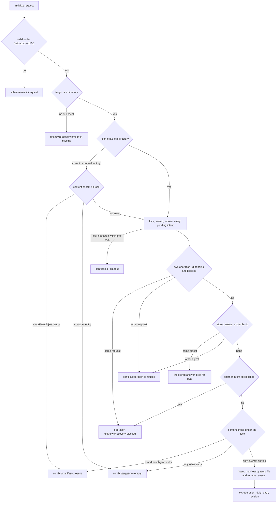
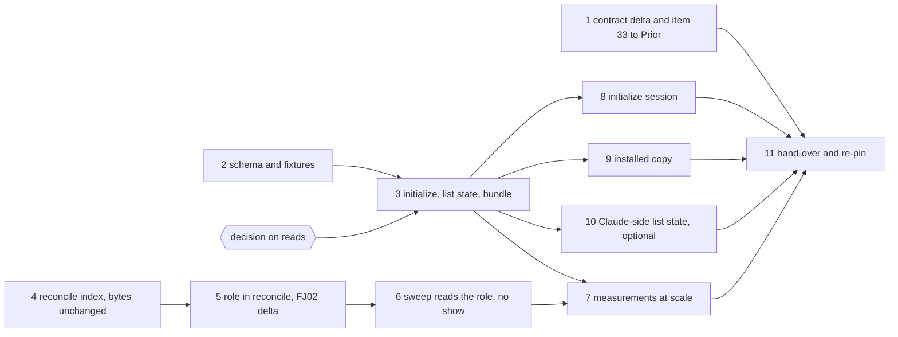

# Implementation Plan: one qualified codec revision: `initialize`, `list.result.state`, the linear `reconcile`, and the plan/spec role in its report

**Date:** 2026-09-30 (amended the same day for Prior `a15dfc8`)
**Status:** Approved 2026-09-30 by the user (with option 3 of the pending decision); in progress.
**Spec:** none as a requirements-designer spec. Prior's `concept/fusion-json-workbench-spec.md` at Prior `a15dfc8`: section 4.1 ("Formatprüfung für Verbraucher", "Neuanlage", and the "Ergänzung vom 30. September" on the `reconcile` fix and the role), the `initialize` row of section 6 with its replay, recovery and lock paragraphs, and the FJ03c row of section 9. The rulings: `Prior: docs/design/fusion-fj03a-followup-decisions.md` `## 27.` (`ddd4973`); `Prior: docs/design/fusion-fj03a-prior-response.md` `## 28 Format gate now and state in list with initialize` (`ad21e58`); `Prior: docs/design/fusion-initialize-reconcile-plan-amendment.md` (`a15dfc8`), option 1: the `reconcile` fix and the role ride this revision.
**Cross-references:** 260928-1338-json-control-data-and-markdown-artefacts.md, 260929-1810_*_which-write-creates-the-manifest-of-a-new-json-controlled-workbench.md, 260929-1810_*_list-answers-a-legacy-workbench-with-an-empty-list-and-names-no-state.md (closure (a) lands here), 260930-1654_*_does-a-read-finish-a-committed-initialize-whose-manifest-has-not-landed-or-report-the-target-as-legacy.md (open, gates step 3), 260930-1654_*_a-directory-named-workbench-json-makes-the-bundle-throw-and-exit-1-instead-of-answering.md (step 3), 260930-1712_*_the-codecs-reconcile-grows-with-the-square-of-the-record-count-and-outlasts-the-clients-timeout-from-about-1200-records.md (closed by steps 4 and 7), 260930-1646_*_the-sweeps-binding-pass-spawns-one-show-per-package-and-evidence-row-for-data-the-index-already-holds.md (closed by step 6), 260930-1800_*_fold-reconcile-fix-into-initialize-revision.md (discussion; C4, C10 and C2's conditions are used), 260929-1417_*_plan-fj02b-plan-progress-and-evidence-creation-through-the-kernel.md, 260930-1451_*_plan-fj03b-observers-checkers-citations-and-the-monitor-on-json.md, 260929-1810_*_does-the-2026-09-27-ruling-on-the-growth-bound-reach-the-hook-tests-and-shipped-text-fj03-changes.md, 260929-1810_*_what-does-the-claude-side-declare-about-a-read-that-finishes-a-committed-intent.md
**Planned against:** fusion `b3909330`, bundle 524 930 bytes, `sha256:5f116c6436175a6b8e1cb08aa2625d2e2f68ef193657b00eb1891ea8d3b965bd`; Prior `a15dfc8`. Hook-test head-room 3 763 at `b3909330`, room 0.
**Decidability:** Two load-bearing questions. (a) What `initialize` does on a target that is not an empty directory. That is decidable from the target's directory entries and the kernel's existing sequence (lock, sweep, recovery, replay lookup); the flowchart under `## Approach` is a disjoint and complete split. A missing or non-directory target is `unknown-scope/workbench-missing`. A `workbench.json` entry of any kind is `conflict/manifest-present`, and every other entry `conflict/target-not-empty`, with no guess about scaffolding. The one exemption is enumerated: `.json-state/` holding only what the lock protocol and sweep own, and empty `journal/` and `ops/`. Same-host competitors are serialised by the one lock; a committed intent is finished by recovery under it, and a diverged file is `recovery-blocked`, never overwritten. Left open by the texts, and filed: whether a *read* finishes a committed initialisation whose manifest has not landed. Section 6 only permits it ("dürfen"). The record recommends option 3: no read finishes *this* intent, and `inspect.pending` names the window. That wording does not reach ordinary committed intents, which FJ02 reads still recover (`a15dfc8`). (b) Whether an unscoped `reconcile` can answer in time for the consumers of a large store. Its cause is decidable: `resolveRecordId` walks and parses every control file per reference, which issue `260930-1712` measured at 310 s for 2 500 records. The fix is one ID index per read attempt. That the fix *suffices* is a measurement, not a derivation, so step 7 measures it on the actual bundle and on the four consumers. Whether the answer fits Prior's 1 MiB bound is item 31's, and is measured but not decided here.

## Directive

One codec revision, qualified by one Prior re-pin, carries four changes. First, `initialize` (request 27): over an existing empty directory it writes `workbench.json` through the kernel, and it refuses every other target by name. Second, `list.result.state` (request 28). Third, an unscoped `reconcile` linear in records plus references, with its answer bytes unchanged. Fourth, the role of each active-document binding in `reconcile`'s references, consumed by the citation sweep in place of one `show` per row. `/fusion:setup` does not call `initialize` yet (FJ03d), and nothing is migrated (FJ04). No file under `agents/`, `skills/`, `rules/`, `templates/`, `docs/` or `.claude-plugin/` changes, nor `install.sh`; `plugin.json` stays at 12.0.0.

## Current State

- `OPERATIONS` (`codec/src/cli/protocol.ts`) holds fourteen operations without `initialize`, and `protocol.test.ts` pins fourteen. `mutate` refuses every state but `json-control` before the lock, and `acquireLock` creates `.json-state/`. `read` runs a non-JSON workbench once without recovery, and `inspect` runs outside `read`.
- `list` answers `{workbench, scope, records}` with no state; `reconcile` answers `{workbench, state, scope, …}`. No recorded exchange sends `inspect` or `list`. A directory named `workbench.json` crashes the bundle (the issue).
- `readContext` (`codec/src/kernel.ts`) is shared by mutations and reads. Its `resolveRecordId` walks `controlFiles(wb, wb.root)`, which is sorted (`store.ts`), strict-parses each file, skips a refused one, applies no `blockedOn` filter, and lists ambiguous hits in walk order. `reconcile` builds its context once per body run and resolves through it per reference site, evidence binding and edge. `create` checks a free id through the same function (`ops.ts`, both create plans).
- `reconcile`'s reference entry is `{path, at, status, target?, class?, reason?}`. `protocol-session-fj02/15-reconcile.response.json` holds two `/active_documents/0/ref` entries, one `resolved` and one `unresolved`, and Prior pins that file.
- `bin/fusion-citation-sweep` sends one `show` per package and evidence row (`boundFiles` in `hooks/citation-sweep.ts`) to find each binding's role and report.
- The Claude side gates on `inspect`. Its three list readers (`scope.ts`, `work-graph.ts`, `record-index.ts`) send `list` through `resultOf`/`listOf` in `hooks/lib/codec-read.ts`, and two of them also send `reconcile` unscoped. The client's timeout is 70 s, the codec's 65 s wait plus `POST_WAIT_MARGIN_MS` (5 s).
- Items 31 and 32 are open. `initialize` depends on neither. Item 31 stays relevant to `reconcile`'s and `list`'s answer size, and a fast answer can still exceed 1 MiB (`a15dfc8`).

## Approach

**`initialize`: the kernel's one sequence, with the state gate made a parameter.** `mutate` takes the states an operation admits: `json-control` by default, every state for `initialize`. Replay, intent, recovery and lock stay identical. The plan function reads the directory under the lock and never `wb.state`, which recovery may have made stale. `PlanContext` exposes the blocked intents read-only, and the plan refuses `recovery-blocked` on any of them before its content check. **One content check, `initialContent(dir)`, at two sites**: under the lock, and once before it when `.json-state` is absent or no directory. In that case no answer, intent or lock can exist, so the answer is the lock path's, and a refused legacy target stays byte-identical, with no `.json-state/` inside a store FJ04 must migrate. The exempt names come from `store.ts`'s constants and are never re-spelled.

**Shapes.** The request is `{op: "initialize", workbench (required on this branch), operation_id, id: uuid}`; a manifest field sent by the caller is `schema-invalid/request`. The manifest is `serialise({schema: "fusion.workbench/v1", id, required_features: ["json-control-v1"], migration: null, extensions: {}})`, validated before the intent. The answer is `{operation_id, id, path: "workbench.json", revision}` with `revisions`, and it carries no absolute path. New reasons: `conflict/manifest-present` and `conflict/target-not-empty`, whose detail names the first entries found, sorted. The issue's fix adds the diagnosis `schema-invalid/manifest-not-a-file`. `list` becomes `{workbench, state, scope, records}` with `json-control` or `legacy`; unsupported stays a refusal.

**The `reconcile` index: inside `reconcile`, never in the shared `readContext`.** Mutations resolve through `readContext`, and a cached index could go stale inside one mutation (discussion C10). `reconcile`'s body builds a wrapped context whose `resolveRecordId` answers from one walk: `controlFiles(wb, wb.root)` in its sorted order, strict-parsed, refused files skipped, no `blockedOn` filter. The ambiguous detail lists hits in that order, so every answer byte stays as today (discussion C2's conditions). The index is local to one body run. `read` re-runs the body after a consistency retry or a recovery, so the index is rebuilt with the view. Nothing is persisted, and nothing reaches a mutation.

**The role.** On every reference entry whose `at` is `/active_documents/<i>/ref`, `role` is placed after `at`, whatever the entry's `status` (`resolved`, `unresolved`, `ambiguous`, `foreign`). It is copied from the stored `active_documents[i].role` when that is `plan` or `spec`, and left out otherwise; the record's schema finding already reports that case. Every other entry carries no `role`. The role describes the binding at its source, so nothing about an unresolved target is invented. Path, pointer, status and revision semantics are unchanged.

**Compatibility evidence, kept separate** (`a15dfc8`). Step 4 changes no answer byte: every recorded session and the handback replay byte for byte. Step 5 changes exactly the two role fields in `protocol-session-fj02/15-reconcile.response.json`. That file stays as recorded, the historical expectation. Beside it, a versioned delta file states the two added `role` fields by entry, and the FJ02 gate asserts that the new answer equals the recorded bytes with exactly that delta applied. Nothing is regenerated silently.

**Standing rules for steps 3 to 10**, carried over from FJ03a and FJ03b. Each step is proven on a scratch clone with a scratch commit (`committed-bundle.test.ts` and `committed-dist.test.ts` judge HEAD), with the git-ignored `hooks/package-lock.json` copied in. Every new test is shown red against a broken copy. The recorded sessions and the handback replay byte for byte without regeneration, except the one delta of step 5. A moved `reference-resolution-lint.test.ts` count is re-approved per file. Steps 6 and 10 touch the hook tests, where the room is 0: they replace first and raise `TEST_LINE_HEAD_ROOM` by the measured remainder alone. Each raise is logged in `README-hooks.md` `### Growth bounds on the shipped text` with the figures before and after and the golden regenerated, and no baseline moves. The hook suite may be red in the monitor loopback case alone (`260928-1520_*_the-monitor-wildcard-bind-case-times-out-on-a-host-its-own-probe-declares-usable.md`). `hook-route-exclusion.test.ts` stays green without an edit.

## Implementation Steps

1. [IN PROGRESS] **The contract delta and item 33, to the Prior side**
   - Executor: `analyst`
   - Files: `codec/fixtures/prior/REQUESTS.md`
   - Changes: append `## One qualified revision (the contract delta before the kernel change)`, stamped with the fusion commit, Prior `a15dfc8` and the bundle digest above. As `a15dfc8` asks, it submits only the changed sections: the `initialize` shapes, the flowchart as a numbered order, the reason names, the exemption and the no-trace property; `list.result.state`; `inspect`'s fifteen operations and `pending`; the index's placement and preserved orderings; the role's exact placement and applicability; the FJ02 delta file; and the measurement protocol of step 7. It records `a15dfc8` as the basis for folding the `reconcile` fix and the role into this revision. It states one fusion decision as item 33, once the user has ruled (text for the recommended option 3):
     > **33. No read finishes a committed `initialize` whose manifest has not landed; `inspect` names that window.** The target then holds only `.json-state/` and is `legacy` under section 4.1. Not finishing is inside section 6's permission ("dürfen", "kann"). The statement is about this intent alone: ordinary committed intents are still recovered by FJ02 reads, as `a15dfc8` requires. Any `initialize` request finishes it under the lock. The same request answers the committed result; another one lands the committed intent first and is then refused `conflict/manifest-present`. `inspect` gains one additive field, `pending`. It is non-null exactly when the state is `legacy` and the only entry is a `.json-state/` holding a committed `initialize`, and it names that intent's operation id and whether it is blocked. **A duty on Prior's host:** its provisioning route acts on what `inspect` reports for that window (it sends `initialize`, never FJ04) and does not re-derive the codec's exemption list. Preferred form: an objection before the freeze of step 11, or none.
     The section says `initialize` depends on neither item 31 nor item 32. The analyst drafts it in its scratchpad; the orchestrator places and commits it (the FJ03b step 8 departure).
   - Dependencies: none
   - Acceptance: the commit changes `REQUESTS.md` alone; every figure re-taken.

2. **The protocol schema and the fixtures of the new branch**
   - Executor: `data-implementer`
   - Files: `codec/schemas/protocol.schema.json`; `codec/fixtures/valid/protocol/initialize.json`; `codec/fixtures/invalid/protocol/initialize-without-workbench.json`, `…-without-operation-id.json`, `…-id-not-uuid.json`, `…-manifest-field.json`; `codec/fixtures/manifest.json`
   - Changes: the `op` enum gains `initialize` after `validate`, with a `oneOf` branch as in the Approach (`additionalProperties: false`) and one sentence in `description`. The manifest gains five entries. `workbench.schema.json` already admits the written manifest.
   - Dependencies: none; committed together with step 3 (the schema is inlined into the bundle).
   - Acceptance: `fixtures.test.ts` green over the five. The expected reds are `protocol.test.ts` (fourteen operations) and `committed-bundle.test.ts`, which step 3 clears; any other red is a stop.

3. **`initialize`, `list.result.state`, `inspect.pending`, the manifest-entry fix, and the rebuilt bundle**
   - Executor: `code-implementer`
   - Files: `codec/src/cli/protocol.ts`, `codec/src/kernel.ts`, `codec/src/cli/ops.ts`, `codec/src/store.ts`, their tests (`ops`, `kernel`, `store`, `protocol`), `codec/dist/fusion-record.js`, `codec/README.md` (`## The CLI`, `## The kernel and the journal`), `bin/fusion-record` (header), `README-hooks.md` (its roster row)
   - Changes: all as the Approach states. `initialize` joins `OPERATIONS` after `validate` and `IMPLEMENTED_OPERATIONS`, and the protocol test pins fifteen. `mutate` takes the admitted states, and `PlanContext` exposes the blocked intents. Under the recommended option 3, `read` is unchanged apart from one header sentence limited to this intent; `inspect` gains `pending`, computed by `initialContent`'s own exemption. `list` gains `state`. `openWorkbench` answers a non-file manifest `unsupported`. The copies of the operation list in the wrapper header and the roster row name `initialize`. The README states the operation, its refusals, `pending`, and that `state` does not waive the gate. Tests, one per case of Prior's ruling:
     - a non-empty legacy target is `target-not-empty` and stays byte-identical, with no `.json-state/`;
     - a manifest that is valid, unsupported or a directory is `manifest-present`;
     - a file or a missing target is `workbench-missing`;
     - competing initializers: in process, the first paused at `locked`, exactly one lands and the manifest id is the winner's; the same invariant with two spawned processes;
     - replay after a later `create` answers the stored bytes;
     - a changed request is `operation-id-reused`;
     - interruption before the commit point (stale lock of a dead PID, a dot-named half-built intent) and after it (every cut of `cutsFor(1)`);
     - divergent recovery is `recovery-blocked` for the same request and another one, with the file never overwritten;
     - a stored answer of another operation in `ops/` is `target-not-empty`;
     - `pending` null, pending and blocked;
     - `list` on an empty and a v12 directory (`legacy`), on JSON with `records: []`, and unsupported still refused.
   - Dependencies: step 2; the decision answered by the user
   - Acceptance: `cd codec && CODEC_REQUIRE_GOLDENS=1 npm test` and `npm run typecheck` green, and the committed-bundle gate green at the commit. The FJ01, FJ02 and FJ02b gates and the handback are green without regeneration. Red shown against these broken copies: content check disabled, exemption widened to all of `.json-state/`, pre-lock check removed, blocked check removed. The hook suite as the standing rules say. The note records the bundle's size and digest.

4. **One ID index per `reconcile` read attempt, answer bytes unchanged**
   - Executor: `code-implementer`
   - Files: `codec/src/cli/ops.ts` (`reconcile` and the helpers it passes its context to), `codec/src/__tests__/ops.test.ts` or `kernel.test.ts`, `codec/dist/fusion-record.js`, `codec/README.md` (`## What \`reconcile\` reports`)
   - Changes: the index and wrapped context as the Approach states. `readContext`, `resolveRecordId` and every mutation stay as they are. A deterministic work-count test uses a fixture of N packages each carrying several references, at N and 2N. It counts whole-store walks and control-file parses in one `reconcile` and asserts that parses grow with records plus references (at 2N at most twice the N figure plus a constant); the code at `b3909330` fails it. A second test pins the index rebuild on the retry path: a record lands during the first attempt, via the `read:after:between-listings` pause, and the answer resolves it. Kept by construction and pinned by the existing suite: duplicate-id `ambiguous-reference` with hits in walk order, a strict-refused file unresolvable, missing and foreign targets, blocked recovery findings.
   - Dependencies: none (may land before step 3)
   - Acceptance: codec suite and typecheck green. Every recorded session, `15-reconcile` included, and the handback replay byte for byte without regeneration: this is the performance-only evidence `a15dfc8` asks for, taken before step 5 moves a byte. The work-count test is red against the pre-fix code. Timing is not asserted here.

5. **The binding role in `reconcile`'s references, and the reviewed FJ02 delta**
   - Executor: `code-implementer`
   - Files: `codec/src/cli/ops.ts` (`referenceEntry` and `ReferenceEntry`), `codec/src/__tests__/ops.test.ts`, `codec/src/__tests__/round-trip-cli-fj02.test.ts`, `codec/fixtures/protocol-session-fj02/15-reconcile.role-delta.json` (new), `codec/fixtures/protocol-session-fj02/README.md`, `codec/dist/fusion-record.js`, `codec/README.md`
   - Changes: `role` as the Approach states. Cases cover a package with one plan binding and one spec binding, both of plan-kind records; an unresolved and an ambiguous binding, each carrying `role` and no `target`; and a non-binding reference with no `role`. The historical `15-reconcile.response.json` is not edited. The delta file names the fields the new answer adds, by entry path and pointer. The FJ02 gate replays exchange 15 against the recorded bytes plus exactly that delta, and every other exchange byte for byte. The README states the delta and why.
   - Dependencies: step 4
   - Acceptance: codec suite green; `git diff` shows `15-reconcile.response.json` untouched; the gate red against an answer carrying one field more or one less; FJ01, FJ02b and handback byte-identical.

6. **The sweep reads the role from `reconcile`, and no `show` per row**
   - Executor: `code-implementer`
   - Files: `hooks/lib/record-index.ts`, `hooks/citation-sweep.ts`, `hooks/lib/__tests__/citation-sweep.test.ts`, `hooks/dist/`, `README-hooks.md`, the growth-bound files
   - Changes: the record index keeps, per package, the `active_documents` entries of `reconcile`'s `references` (`role`, `target`, `status`). `boundFiles` takes a package binding from that, and an evidence record's report from the neighbour naming rule (`narrativeOf`). Neither sends a `show`. An unresolved binding names no file, as today. Tests cover a plan-role and a spec-role binding with unchanged `bound=` lines and unchanged binding meaning, and the request count: exactly `inspect`, `list` and `reconcile` for any number of packages.
   - Dependencies: step 5
   - Acceptance: the hook suite as the standing rules say; the count test red against the old `boundFiles`; the raise logged; issue `260930-1646` closed with a `Resolved:` line.

7. **Measurements at scale: `reconcile`, the four consumers, and answer sizes**
   - Executor: `code-implementer`
   - Files: `codec/scripts/bench-fixture.mjs` (new; builds the store through the bundle with fixed ids, as issue `260930-1712` built it: packages each with one adopted plan, subsets at 200, 500, 1 000 and 2 500 records)
   - Changes: none to shipped behaviour; the generator is committed so that Prior can rebuild the fixtures. The step note records, per size: records and reference count, machine and Node version, at least three repetitions, median and maximum elapsed, peak memory (max RSS), and the output bytes of unscoped `reconcile` and `list`. The runs, through the committed bundle with an empty environment, are `reconcile` and, at 2 500, the complete consumers in a `git init` project: `bin/fusion-claimed-package`, `bin/fusion-work-order`, `bin/fusion-citation-check` and `bin/fusion-citation-sweep --dry-run`.
   - Dependencies: steps 3 and 6
   - Acceptance: an unscoped `reconcile` at 2 500 records answers within 5 s (`POST_WAIT_MARGIN_MS`) on the reference machine (M2 Max). Each consumer exits 0 within the client's 70 s, with its time recorded. Output bytes are stated against 1 MiB; an answer above it is a finding for item 31 in step 11 and no stop. Issue `260930-1712` is closed with a `Resolved:` line citing steps 4 and 7.

8. **The `initialize` recorded session**
   - Executor: `code-implementer`
   - Files: `codec/src/__tests__/helpers/session.ts` (a `base` option, defaulting to the scratch workbench), `codec/src/__tests__/round-trip-cli-initialize.test.ts`, `codec/fixtures/protocol-session-initialize/` (pairs, `base/`, `seed/`, `README.md`), `codec/src/__tests__/fixtures.test.ts`, `codec/README.md` (`## Layout`, `## What ships`)
   - Changes: `<workbench>` stands for a root R of targets: `legacy/` (a `.fusion-setup` and one v12 package), `file` (a regular file), `new/` (made empty by the recorder and the README), and `pending/` and `diverged/` from seeds. The exchanges, with fixed literals:
     - 01 `inspect new`: `legacy`;
     - 02 `list new` and 03 `list legacy`: `state: legacy`, `records: []`;
     - 04 `initialize legacy`: `target-not-empty`;
     - 05 `initialize file`: `workbench-missing`;
     - 06 `initialize new`: lands;
     - 07 repeats 06 and answers its bytes;
     - 08 06's id with another UUID: `operation-id-reused`;
     - 09 another id: `manifest-present`;
     - 10 `inspect new`: `json-control`;
     - 11 `list new`: `json-control`, `records: []`;
     - 12 `create new`: a package;
     - 13 repeats 06 and answers its bytes;
     - 14 `list new`: one record;
     - 15 `inspect pending`, over a committed intent from an in-process cut: `legacy` with `pending`, as ruled;
     - 16 `initialize pending`, the intent's request: the committed result;
     - 17 `inspect pending`: `json-control`;
     - 18 `initialize diverged`: `recovery-blocked`.

     The recorder also asserts that `legacy/` is unchanged and holds no `.json-state/` after 04, and that `diverged/workbench.json` keeps its bytes. Regeneration only under `UPDATE_PROTOCOL_SESSION_INITIALIZE=1`.
   - Dependencies: step 3
   - Acceptance: the gate green without regeneration; FJ02 (with step 5's delta) and FJ02b green after the helper change; a shell replay over an R path with a space and a comma answers every exchange byte for byte, as recorded in the note.

9. **The installed copy initialises a workbench the FJ03a resolvers read**
   - Executor: `code-implementer`
   - Files: `codec/src/__tests__/install.test.ts`
   - Changes: a fourth case. The installed `bin/fusion-record` initialises an empty `fusion-workbench/` in a `git init` project, and the test then writes `.fusion-setup` (Setup's order). `bin/fusion-claimed-package` exits 0 with nothing printed, and `bin/fusion-work-order` prints `verdict=empty`. A v12 directory is refused and stays byte-identical.
   - Dependencies: step 3
   - Acceptance: the case runs, not skipped; the `git diff --stat` over `codec/src codec/schemas codec/contract codec/dist` names `install.test.ts` alone.

10. **The Claude-side readers check `list.result.state` (optional, recommended)**
    - Executor: `code-implementer`
    - Files: `hooks/lib/codec-read.ts`, `hooks/lib/scope.ts`, `hooks/lib/work-graph.ts`, `hooks/lib/record-index.ts`, their tests, `hooks/dist/`, `README-hooks.md`, the growth-bound files
    - Changes: one function reads `state` off a `list` result. `json-control` admits the read; `legacy` is `{cause: "legacy"}`, since the manifest was lost after the gate; anything else, absent included, is `unanswered/unparseable`. The gate stays first. Stubbed `list` results gain `state` in their shared builders, and one case per reader covers a `legacy` list after a `json-control` gate.
    - Dependencies: step 3
    - Acceptance: as step 6, with the cases red against a copy that ignores `state`.

11. **The hand-over: what landed, the frozen digest, the re-pin**
    - Executor: `analyst`
    - Files: `codec/fixtures/prior/REQUESTS.md`, this plan
    - Changes: `## One qualified revision (the hand-over)` in the shape of `## FJ02b`, written against the last commit that moved `codec/`, `bin/` or `hooks/`, with the bundle's size and digest there. `### What landed` covers the four changes, the reason names as pinned and what did not change. The evidence is kept apart: step 4's byte identity, step 5's delta, step 7's figures with output bytes. The section adds the `initialize` session, the recovery and rollout consequences (FJ04's survey meets the `pending` window; ordinary intents are still recovered by reads), and items 31 to 33 as they stand. Two requests take the next numbers: a re-snapshot of the shared fixture set with the new manifest counts, and a re-pin with the replay of the FJ01 pairs, the handback, the FJ02 (delta-reviewed), FJ02b and `initialize` sessions and Prior's conformance run, on which FJ03c depends. The plan is marked and closed.
    - Dependencies: steps 1, 7, 8, 9, and 10 when it runs
    - Acceptance: every figure re-taken in a scratch clone; the commit names `REQUESTS.md` and the plan alone.

## Where this work stops

- `cd codec && CODEC_REQUIRE_GOLDENS=1 npm test` and `npm run typecheck` are green at the closing commit, and `committed-bundle.test.ts` was green at every commit that moved code.
- `initialize` writes exactly the ruled manifest over an empty directory, and every flowchart leaf has a test shown red against a broken copy.
- A refused `initialize` over a directory without `.json-state/` leaves it byte-identical.
- `list` answers `state`, and `inspect` answers `pending` (or as the decision was ruled).
- A non-file `workbench.json` is answered, never thrown, and that issue is closed.
- After step 4 every recorded session and the handback replayed byte for byte.
- The work-count test holds `reconcile`'s parses linear in records plus references.
- Unscoped `reconcile` at 2 500 records answered within 5 s on the reference machine, and the step 7 figures (four sizes, four consumers, output bytes) are in the hand-over.
- `role` stands on exactly the active-document reference entries, whatever their status.
- `15-reconcile.response.json` is unedited, and its reviewed delta file is the only difference any gate admits.
- The sweep sends `inspect`, `list` and `reconcile` and no `show`. Issues `260930-1712` and `260930-1646` are closed.
- `protocol-session-initialize/` and its recorder are green without regeneration.
- No file under `codec/fixtures/valid/` at `b3909330` changed.
- The decision on reads is answered and followed.
- Step 10 landed with its raise logged, or was dropped at approval (condition did not arise: one clause).
- No file under `agents/`, `skills/`, `rules/`, `templates/`, `docs/` or `.claude-plugin/` changed, nor `install.sh`; `plugin.json` stays at 12.0.0.
- `REQUESTS.md` carries the sections of steps 1 and 11, the second stamped with the frozen digest.
- Precondition for FJ03c, not claimed here: Prior has re-pinned that digest and reported conformance green, and item 32 is answered. Before real migration, item 31 is answered as well; this revision does not remove the 1 MiB question.
- Precondition for FJ03c and FJ03d, text changes outside this plan, handed on in step 11:
  - `/fusion:setup` calls `initialize` before it creates the store directories, `.guard-state/`, the marker and `stilwerk/` (`skills/setup/SKILL.md`, in that order; section 4.1).
  - Its probe handles the `pending` window and a manifest without a marker.
  - It prints the refusal detail naming the entries to remove; `.DS_Store` and `.gitkeep` are refused by design.
  - It re-runs `inspect` after every successful `initialize`, since a same-id replay answers success even after `workbench.json` was deleted.

## Data Structures

- `InitializeRequest` `{op, workbench, operation_id, id}`; the answer `{operation_id, id, path, revision}` with `revisions`.
- `list`: `{workbench, state, scope, records}`. `inspect`: plus `pending` (`null`, or the intent's `operation_id` and `blocked`).
- Reference entry: `{path, at, role?, status, target?, class?, reason?}`, with `role` on active-document entries only.
- `mutate` gains the admitted states; `PlanContext` the read-only blocked intents; `reconcile` a body-local ID index.

## API Changes

A fifteenth operation; `list.state`; `inspect.pending` under the recommended option; `role` on active-document reference entries; two new reasons and one diagnosis. Every request valid at `b3909330` validates and is answered as before, except over a directory-shaped manifest (a crash before) and in `reconcile`'s references (the role, reviewed as a delta). The digest moves at each code commit, and the hand-over names the last.

## Testing Strategy

Deterministic tests in `codec/` per ruled case, per flowchart leaf and per work count (steps 3 to 5). Recorded sessions carry the cross-host contract, with the performance fix proven byte-neutral before the role moves a byte (steps 4, 5 and 8). The installed copy and the sweep's request count come next (steps 6 and 9). Machine-sensitive timing and sizes stay out of the suite, in step 7's note and the hand-over.

## Risks & Mitigations

| Risk | Mitigation |
|---|---|
| The decision on reads is ruled against the recommendation | Step 3 waits. Option 1 drops `pending` and changes exchange 15; option 2 changes `read` and exchanges 15 and 17. The flowchart does not move |
| The index changes a byte (order, a skipped file, a blocked filter) | The three preserved conditions are named; step 4's acceptance is a full byte replay before step 5 |
| `reconcile` at 2 500 still exceeds 5 s after the fix | Step 7 reports the figure. The remaining cost is then located (for example the per-reference `resolveArtefact` hash) and fixed before step 11, never by raising the timeout (`a15dfc8`) |
| An answer at scale exceeds 1 MiB | Reported for item 31; no stop here, and no claim of migration readiness |
| Prior objects to the contract delta | Nothing is frozen before step 11; a later correction is additive and a new digest |
| The session helper's `base` breaks FJ02 or FJ02b | The default is unchanged; both gates green is acceptance of step 8 |
| The spawned race is flaky | It asserts only the invariant; the ordering is proven in process |
| The hook-test room is 0 (steps 6 and 10) | Replace, raise the measured remainder, log |

## Open Questions

- [ ] The decision on reads, `260930-1654_*_does-a-read-finish-a-committed-initialize-whose-manifest-has-not-landed-or-report-the-target-as-legacy.md`. The recommendation is option 3. The user rules; step 1 then states the ruling as item 33; step 3 waits.
- [ ] Is step 10 in scope? Recommended: yes, one site closes the gate-to-`list` window for about a dozen test lines and a logged raise.
- [ ] If Prior answers item 31 with paging before step 11, is it folded in? Recommended: no. Neither ruling this plan realises asks for it, and it would reopen the `list` exchanges; step 7's size figures feed that answer.
