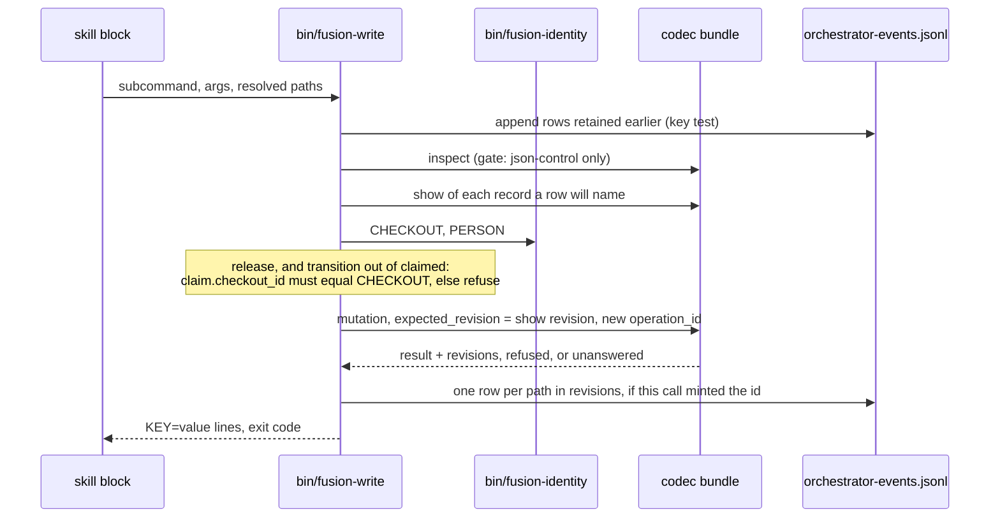
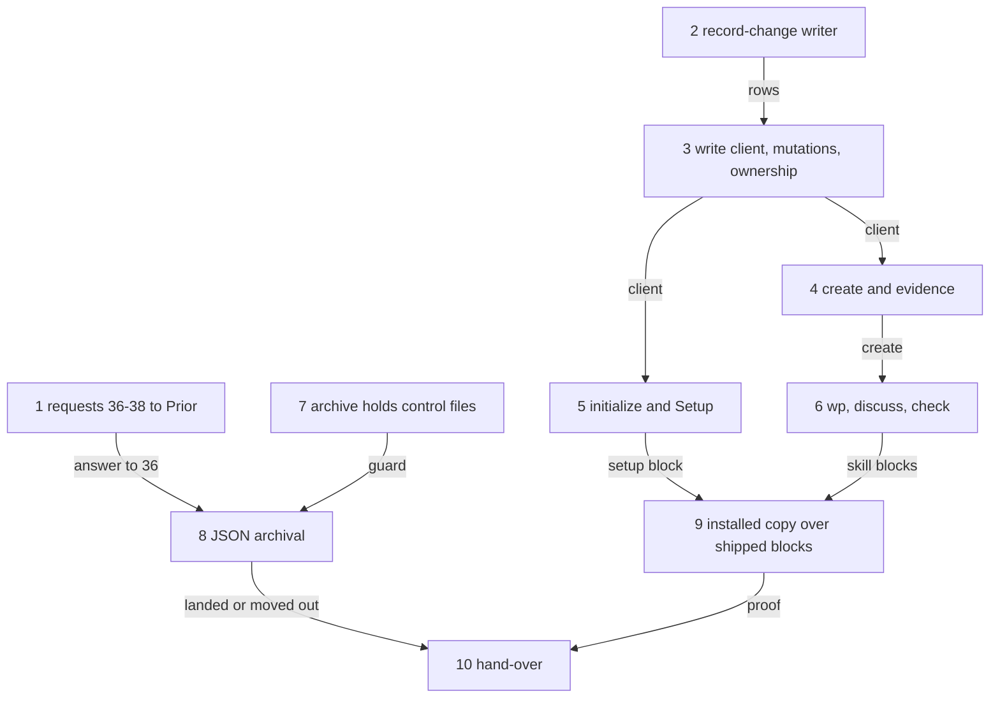

# Implementation Plan: FJ03c, the write client, Setup and the skills on JSON

**Date:** 2026-09-30
**Status:** Draft
**Spec:** none as a requirements-designer spec. Prior's `concept/fusion-json-workbench-spec.md` at Prior `930eb26` (the passages cited here read as at `7909838`; `930eb26` changed only the status line, the `initialize` qualification and section 9's conformance paragraph): section 6 (the operation table, response 22 (a), the recovery paragraph), section 7 rows 5, 6 and 9 and the event paragraph, section 9's FJ03c row ("Host-Ownership geprüft; alle unterstützten Steueränderungen durch Codec-Operationen; Neuanlage ohne zweiten Manifest-Schreiber") and its closing sentence that tests exercise the shipped skill blocks. The rulings: `Prior: docs/design/fusion-qualified-revision-contract-response.md` `## 32` (`ae1ad78`); the FJ03 cut and items 25, 27, 32 and 35 of `codec/fixtures/prior/REQUESTS.md`.
**Cross-references:** 260928-1338-json-control-data-and-markdown-artefacts.md, 260930-1654_*_plan-initialize-the-codec-creates-a-new-workbench-and-list-names-its-state.md, 260930-1451_*_plan-fj03b-observers-checkers-citations-and-the-monitor-on-json.md, 260929-1810_*_plan-fj03a-the-record-client-the-format-gate-and-scope-and-order-on-json.md, 260930-1451_*_where-does-the-monitor-take-a-records-status-from-and-how-does-an-event-name-a-record-and-its-host.md, 260930-1654_*_does-a-read-finish-a-committed-initialize-whose-manifest-has-not-landed-or-report-the-target-as-legacy.md, 260929-1810_*_does-the-2026-09-27-ruling-on-the-growth-bound-reach-the-hook-tests-and-shipped-text-fj03-changes.md, 260930-2305_*_does-transition-refuse-a-payload-field-the-records-kind-has-no-rule-about.md, 260930-2305_*_how-is-a-json-controlled-pair-archived-when-its-control-record-names-its-narrative-by-workbench-path.md, 260930-2305_*_how-does-the-write-client-log-a-change-it-cannot-append-or-did-not-observe.md, 260930-2305_*_how-is-a-claim-held-by-a-checkout-that-no-longer-exists-released-under-response-22.md
**Planned against:** fusion `8dfaf018` (`git diff --stat bc3b04a8 8dfaf018 -- codec bin hooks skills` names `REQUESTS.md` alone); bundle 534 131 bytes, `sha256:bde8f3c952bd111695dbac510d3c0802566080e07c2ba3b6396d9c2c807844d1`; Prior `930eb26` (2026-09-30 23:05), no later commit on any ref; it closes requests 34 and 35 against that digest (`Prior: docs/design/fusion-initialize-prior-response.md`). Growth room at dispatch: `skills/` 25 559 bytes, `agents/` 3 806 bytes, hook tests 0 lines; each step re-reads them from `surface-growth-bound.test.ts`.
**Decidability:** Can a skill's executable block decide ownership and write safely through the client with no second source of truth, from the inputs a skill has? **Ownership: yes.** The block calls one helper, which reads the claim from `show` and this checkout from `bin/fusion-identity`, the criterion `bin/fusion-claimed-package` already uses, and sends `show`'s revision as `expected_revision`. **The revision race: yes, decided by the codec, not the client.** A record that moved between `show` and the mutation is `conflict/revision-mismatch`, and the client never retries. What the Claude side cannot decide is whether a caller is authentic beyond its checkout identity. It has no authentication and no host generation (item 30), and the plan states this rather than approximating it. **The log: no, as posed.** Whether an answer is a replay is not decidable from the answer, because stored answers come back byte for byte. The mechanism changes to "did this call observe this answer", which the writer knows: it minted the operation id, it holds the log key, and it retains rows it could not append. A re-send with nothing retained stays unlogged, the branch Prior permits (`260930-2305_*_how-does-the-write-client-log-a-change-it-cannot-append-or-did-not-observe.md`). **Archival of a pair: not decidable from the host's inputs.** Measured: a pair moved by `mv` keeps `narrative.path` at its old path, and `validate` turns `valid: false`. Only the codec may rewrite a control file, so the mechanism changes to a contract answer (request 36), and until then the archive block moves no control file. There is no second source: the payload field table is pinned to the codec's schemas, states come from `codec/contract/transitions.json`, and the `pending` window comes from `inspect`.

## Directive

FJ03c is the third of the four FJ03 parts (`REQUESTS.md` `## FJ03 (questions before the consumers)`, the cut table). It carries three rows. Row 5 without `/fusion:migrate`: `wp`, `setup`, `reconcile`, `archive`, `cadence` and `check` create pairs through the codec and hold no competing JSON authority. The archive half of row 9: pairs move together. The write half of row 6: a reviewer's evidence goes through `create`. It builds the Claude side's first codec writer: one client for every supported mutation. The client checks ownership as response 22 (a) asks, writes the `record_change` rows of item 32 as Prior accepted them, and serves as the skills' only route to a control change. It settles item 25 for the Claude side.

**Where the Setup preconditions land: here, in FJ03c.** The initialize plan handed them to "FJ03c and FJ03d". This plan splits them by the cut. Everything executable goes to FJ03c: `initialize` before any other write, the `pending` window, a manifest without a marker, the refused entries named, and a re-inspect after success. Section 9 names "Neuanlage ohne zweiten Manifest-Schreiber" in FJ03c's row, and FJ03a's resolvers already refuse a workbench without a manifest. So Setup on this branch produces no usable workbench until it calls `initialize`. FJ03d keeps the prose about Setup in `skills/help/`, the rules and the READMEs.

## Current State

- **Readers only.** `hooks/lib/record-client.ts` provides `ask` (one process, no retry, a 70 s timeout, a 16 MiB bound) and `gate`. The gate hands back `json-control` with an id, `legacy`, `unsupported`, `refused` or `unanswered`, and it drops `inspect.pending`. `hooks/lib/codec-read.ts` and `hooks/lib/record-index.ts` read. No Claude-side code sends a mutation (`REQUESTS.md` hand-over, item 9).
- **The row has readers and no writer.** `bin/monitor` reads `record_change` rows (FJ03b step 6). `utcStamp` and `resolveIdentity` in `hooks/lib/orchestrator-events.ts` write the log's `ts` form and the identity pair, and `FUSION_SESSION_ID` is exported by `hooks/session-id.ts`.
- **The skills write Markdown control data.** `skills/wp/SKILL.md` writes `**Status:** open` into a new record. `skills/discuss/SKILL.md` renames `_o_` to `_c_`. `skills/archive/SKILL.md` selects by marker and `**Status:**` and moves with `mv`. `skills/setup/SKILL.md` runs `mkdir -p` over every store before any codec call. Every skill that runs `bin/fusion-paths` already halts on a legacy workbench (FJ03a, exit 3), so none of them needs a legacy branch.
- **Measured through the bundle at `8dfaf018`, in a scratch workbench:**
  - `create` of a package refuses `mode` (`payload-field-not-admitted`), so `autonomous` at filing is `create`, then `set-mode`.
  - `transition` of an issue with `outcome` and `claim` lands and drops both fields (item 25).
  - A pair moved into `archive/` makes `reconcile` and `validate` report `narrative-missing`.
- **Unchanged here.** The agents' own record operations (orchestrator claim, curator edges, state-auditor transitions, the reviewer prompt) are text, so they belong to FJ03d. This plan gives them the helper those texts will call.

## Approach

**One helper, `bin/fusion-write`, over `hooks/write.ts`.** It follows the FJ03a pattern: a bash wrapper, a compiled entry and a library module, reached by explicit calls only. It has one subcommand per codec mutation, plus `evidence` (the `kind: evidence` branch of `create`) and `log-repair`. A skill block passes arguments and resolved paths and builds no JSON. `hooks/lib/record-write.ts` runs the sequence below. `hooks/lib/record-change.ts` composes, deduplicates, appends and retains rows. `record-write` depends on `record-change`, `record-client` and `codec-read`, and nothing depends back.

**Ownership (response 22 (a)).** The check covers `release` and every `transition` out of `claimed`, and nothing else. The standing claim's `checkout_id` must equal the `CHECKOUT=` of `bin/fusion-identity`, the same helper scope resolution uses. An identity that cannot be read refuses the request, and so does a foreign claim, with no flag that overrides the check. A takeover waits for request 38.

**Payloads (item 25, the Claude side).** One table maps each kind to the payload fields the codec reads for it:

- package: `claim`, `outcome`
- issue: `disposition`
- plan: `steps`, `criteria`
- decision: `answer_ref`, `implementation_ref`, `superseded_by`, `deferral`
- discussion: none

A test reads `codec/schemas/record.schema.json` and `package.schema.json` and holds the table equal to them. The table is not a second source of truth. A flag the target kind does not carry is a usage error before any request.

**Rows (item 32 at `ae1ad78`).** Each path in the answer's `revisions` gets one row. `record_id` and `kind` come from the `show` before the mutation or from the request (for `create`, and for the `adopt-plan` document and the plan it replaces), never from the package's id. `change` follows the ruled table, with `{attached_evidence}` and `{created_kind: "evidence"}`, and `initialize` gets no row. `person` and `checkout` are left out when unread, and `session_id` when `FUSION_SESSION_ID` is unset. Before an append, the writer:

- skips a key `(workbench_id, operation_id, path, revision)` already in the log;
- terminates a torn last line with a lone LF;
- writes whole LF-terminated lines.

A failed append retains the rows in `.guard-state/record-change-pending.jsonl` with their original `ts`, reports `event=pending`, and never resends the mutation. A re-send (`--operation-id`) appends only retained rows. With none retained it reports `event=unlogged`.

**Setup.** `fusion-write initialize --workbench <dir>` is the one route that sends `initialize`, as a disjoint split on `inspect`:

| `inspect` answers | The helper does |
|---|---|
| `json-control` (a manifest without the marker included) | reuse; `pending` is finished by the next mutation's own recovery |
| `legacy`, `pending` names an intent, not blocked | send the request rebuilt from `pending`, once |
| `legacy`, `pending` blocked, or `pending-initialize-unreadable`/`-ambiguous` | stop; the intent is corrected by hand |
| `legacy`, `pending: null` | mint a UUID and an operation id, send `initialize` |
| `unsupported` | stop, naming the diagnosis |
| refused otherwise, or unanswered | stop; rerunning Setup lets `pending` name the intent |

`target-not-empty` and `manifest-present` stop with the entries named. A v12 store among them routes to FJ04's migration. After every successful answer the helper sends `inspect` again and requires `json-control` with the sent id. Setup then creates the stores, `.guard-state/`, the marker and `stilwerk/`, in that order. No other writer sends `initialize`. A mutation that meets `legacy` with `pending` is refused and names Setup: no migration, no retry.

**Archive.** Until request 36 is answered, the block moves no control file. It holds every pair and every container that carries one, names each, and still archives what is not a record: forum entries, aged reports without evidence, history, and the guard log.

**Tests over shipped text.** Each converted block reads its inputs from shell variables named at its head. The installed-copy test extracts the block from the shipped `SKILL.md` and runs it verbatim (section 7's closing sentence).

## Implementation Steps

Every step touching `skills/` reports the skills byte room after the step, re-read from `surface-growth-bound.test.ts`.

1. **Requests 36 to 38, and two statements, to the Prior side**
   - Executor: `analyst`
   - Files: `codec/fixtures/prior/REQUESTS.md`
   - Changes: the analyst drafts `## FJ03c (questions before the write paths)` in its scratchpad, and the orchestrator appends it and commits it (the initialize step 1 departure). The section is stamped with the fusion head, Prior `930eb26` and the digest above, and it states each record's option as the user ruled it at approval. **36**, archival of a JSON pair: the measurement, the three options, fusion's proposal (option 2 of the archival record), and the question whether the codec half is a revision of its own. It carries the caveat of option 2: a live evidence record, or a by-id reference from a terminal record, into an archived package would then answer `record-not-found`, so the exclusion covers evidence records and their bindings as well as references and dependencies. **37**, foreign payload fields: the Claude client never sends one. Asked: should the codec refuse them in the next revision that moves the digest? **38**, a takeover under response 22: option 2 of the takeover record, asked. Two statements for information, open to objection: how the writer logs, as the logging record states it; and the Claude side's caller binding, which is the checkout identity and no host generation, checked for exactly the operations response 22 names.
   - Dependencies: none.
   - Acceptance: the commit changes `REQUESTS.md` alone; every figure is re-taken.

2. **The `record_change` writer**
   - Executor: `code-implementer`
   - Files: `hooks/lib/record-change.ts`, `hooks/lib/__tests__/record-change.test.ts`, the raise in `surface-growth-bound.test.ts`, logged in `README-hooks.md` `### Growth bounds on the shipped text`
   - Changes: row composition per operation from `(request, pre-mutation shows, gate id, answer, identity)`, the ruled `change` table, the key test, the torn-tail guard, retention and `log-repair`, reusing `utcStamp` and `resolveIdentity`.
   - Tests, each shown red against a broken copy:
     - delayed logging: retained rows are appended later with their original `ts`, and the monitor's stable sort places them;
     - duplicate delivery: the same rows twice give one row each;
     - a failed append (read-only log): the rows are retained, the result reports success with `event=pending`, and nothing is resent;
     - `initialize` gives no row;
     - `adopt-plan` gives two or three rows with distinct ids;
     - a missing identity half is absent, never null.
   - Note to record: `.guard-state/record-change-pending.jsonl` stays unnamed in `rules/workbench-tracking.md`, which classifies each `.guard-state/` file separately, until FJ03d; FJ03c edits no `rules/`. The window is stated in the step note and in step 10.
   - Dependencies: none.
   - Acceptance: `cd hooks && npm test` green but for the known monitor wildcard-bind case (`260928-1520_*_the-monitor-wildcard-bind-case-times-out-on-a-host-its-own-probe-declares-usable.md`); any other red stops the step. `hook-route-exclusion.test.ts` green without an edit.

3. **The write client, the mutations on existing records, ownership**
   - Executor: `code-implementer`
   - Files: `hooks/lib/record-write.ts`, `hooks/write.ts`, `bin/fusion-write`, `hooks/lib/__tests__/record-write.test.ts`, the roster row in `README-hooks.md` `### The bin/ helper roster`, the logged raise
   - Changes: the sequence of `## Approach` for `claim`, `release`, `transition` (state, plan progress, decision references, deferral, outcome, disposition), `set-mode` (`autonomous` only with a user source), `set-dependencies`, `adopt-plan` and `attach-evidence`. The payload table goes with its schema test. The operation id is minted per call, and `--operation-id` is the explicit re-send. Output is `KEY=value` (`result=`, `operation_id=`, `path=`, `revision=`, `event=`). The exit codes are distinct and named in the wrapper's header for these outcomes: landed, usage, no workbench, install incomplete, workbench not read, ownership refused, mutation refused (class and reason on stderr), and outcome unknown (the operation id printed for a re-send).
   - Tests:
     - the owner releases; another checkout, an unreadable identity and a non-claimed source are each handled as their own case;
     - a write landed between `show` and the mutation gives `revision-mismatch`, one request and no row;
     - an unanswered mutation leaves its outcome unknown, with no retry;
     - a re-send answers the stored bytes, and no fresh row is written;
     - a foreign flag is a usage error;
     - `legacy` with `pending` is refused and names Setup.
   - Dependencies: 2.
   - Acceptance: as step 2's; the new entry is reached from no `hooks/hooks.json` command.

4. **Creation: records with their narrative, and a reviewer's evidence**
   - Executor: `code-implementer`
   - Files: `hooks/lib/record-write.ts`, `record-write.test.ts`
   - Changes: `create --kind package|issue|plan|discussion|decision`, with `--narrative-file`. The narrative is a marker-free name the caller derives, and the id is a minted UUID. The initial state follows `codec/contract/transitions.json`, and the filer is `bin/fusion-identity`'s person. `evidence --report <path>` computes the report's hash and takes `workbench_id` from the gate. It takes `brief_revision` and `plan_revision` from `show` of the package: the narrative hash, and the plan binding's revision. It sends `host: claude-code` and the verdict given. This is the executable route row 6 asks for, and the reviewer prompt that calls it is FJ03d's.
   - Tests: a created pair per kind; evidence over a report, and `report-changed` after an edit; `{created_kind: "evidence"}` on its row.
   - Dependencies: 3.
   - Acceptance: as step 2's.

5. **`initialize`, and Setup's Step 0 on it**
   - Executor: `code-implementer`
   - Files: `hooks/lib/record-client.ts` (`gate` carries `pending` additively), `hooks/lib/record-write.ts`, `skills/setup/SKILL.md`, tests
   - Changes: the Setup table of `## Approach`. Step 0 becomes: the existing v11 store-name probe; `mkdir -p` of the workbench directory alone; `fusion-write initialize`, whose outcome decides whether Setup continues; then the stores, `.guard-state/`, the marker and `stilwerk/`, in that order. The rest of Setup is unchanged. The skills byte delta and the room left after the step are reported; the table must fit in what the block replaces or the raise is logged.
   - Tests: one case per row of the table, each red against a broken copy. Refused entries are named, and `.DS_Store` is refused by design. The re-inspect catches a replay after `workbench.json` was deleted.
   - Dependencies: 3.
   - Acceptance: as step 2's; the skills bound is green, or its raise is logged.

6. **`/fusion:wp`, `/fusion:discuss` and `/fusion:check` on the client; the other skills classified**
   - Executor: `code-implementer`
   - Files: `skills/wp/SKILL.md`, `skills/discuss/SKILL.md`, `skills/check/SKILL.md`
   - Changes:
     - wp: `create --kind package`. The narrative carries the title and the directive, with no `**Status:**` or `**Filed by:**` head, since JSON holds both. `**Mode:** autonomous` in the user's own words becomes `set-mode`.
     - discuss: `--begin` creates a marker-free discussion pair, rounds edit the Markdown alone, and `--close` sends `transition --to closed`.
     - check `gitignore`: `workbench.json` joins the R3 list and `.json-state` the class L list, as staging drift already classifies them.
     - classified unchanged, one line each in the step note: reconcile (it writes nothing; the state-auditor is FJ03d's), cadence (it reads `*.md` only, so a pair counts once), curate, cleanup, memo, post, news and commit (no control data). `help` is FJ03d's and `migrate` FJ04's.
   - Dependencies: 4.
   - Acceptance: the path-literal lint and the skills bound are green, or the raise is logged; the byte delta and the room left after the step are reported.

7. **The archive block holds control files**
   - Executor: `code-implementer`
   - Files: `skills/archive/SKILL.md`
   - Changes: on `json-control` (read through `bin/fusion-citation-check`'s `format=` line or the gate), the block holds every candidate pair and every container holding a control file. Each is named with the reason "archival of JSON pairs awaits request 36", and nothing else in the flow changes.
   - Dependencies: none.
   - Acceptance: a fixture run moves no control file; the skills bound is green, and the room left after the step is reported (`archive` stands at about 24 435 bytes before it).

8. **JSON archival, per Prior's answer to request 36**
   - Executor: `code-implementer`
   - Files: `skills/archive/SKILL.md` and, if the answer keeps the codec untouched, the helper and its test
   - Changes: selection from `list` with the kind's `terminal` set, plus exclusion by `reconcile`'s references, dependencies and evidence bindings from live records, and any exclusion Prior's answer adds. Pairs and containers move whole, and a move that fails half-way is undone. If the answer needs a codec change, that change is a plan of its own, and this step waits for its qualification or is moved out (`## Where this work stops`).
   - Dependencies: 1 (the answer), 7.
   - Acceptance: after an archive run, `validate` over the fixture is `valid: true`; the skills room left after the step is reported.

9. **The installed copy runs the shipped blocks**
   - Executor: `code-implementer`
   - Files: `codec/src/__tests__/install.test.ts`
   - Changes: a fifth case in a `git init` project. It runs Setup's extracted block (which initialises), then that block a second time (which reuses), then wp's block (a package). Then `claim` by this checkout; `release` refused for a second checkout identity; `release` by the owner; `evidence` over a report; discuss begin and close. The log holds exactly the expected rows by key, and a repeat of the re-send adds none. `bin/fusion-claimed-package` reads the claim. The recovery test is unedited and green.
   - Dependencies: 5, 6.
   - Acceptance: `cd codec && CODEC_REQUIRE_GOLDENS=1 npm test` and `npm run typecheck` green; the bundle digest unchanged.

10. **The hand-over**
    - Executor: `analyst`
    - Files: `codec/fixtures/prior/REQUESTS.md`
    - Changes: `## FJ03c (the write paths)`: the commits; what landed; items 36 to 38 as they stand; the recovery and rollout consequences, with FJ03c's client as the first Claude-side writer and no FJ01 writer. It states that the bundle and every pinned path are unchanged, so no re-pin is asked, gives the growth raises as logged, and names the retained-rows file as unclassified in the tracking rule until FJ03d.
    - Dependencies: 9, and 8 landed or moved out.
    - Acceptance: the commit changes `REQUESTS.md` alone.

## Where this work stops

- Precondition for steps 2 to 10, met: Prior closed requests 34 and 35 green against `sha256:bde8f3c9…44d1` at Prior `930eb26` (`Prior: docs/design/fusion-initialize-prior-response.md`).
- Every supported mutation reaches the codec from the Claude side through `bin/fusion-write` alone, and no skill writes a control field in Markdown.
- `release` and every `transition` out of `claimed` are refused for any checkout but the holder, with a test per case.
- The writer tests for delayed logging, duplicate delivery, a failed append and a re-send each fail against a broken copy.
- Setup sends `initialize` before any other write and handles each row of the Setup table, with a test per row.
- The installed-copy case runs the blocks extracted from the shipped `SKILL.md` files.
- `hook-route-exclusion.test.ts` is green without an edit.
- The bundle digest and every Prior-pinned path are unchanged.
- The codec and hook suites are green, the monitor wildcard-bind case aside.
- Every growth raise is logged with before-and-after figures.
- Step 8 landed, or the user moved it to a plan of its own after Prior's answer to request 36 required a codec change.
- Requests 36 to 38 are in `REQUESTS.md`. Answers to 37 and 38 are not a precondition of closing.
- `REQUESTS.md` carries step 10's section.
- No file under `agents/`, `rules/`, `templates/`, `docs/`, `skills/help/`, `skills/migrate/` or `.claude-plugin/` changed; `plugin.json` stays at 12.0.0.

## Data Structures

- The `record_change` row: item 32 of `REQUESTS.md` with `## 32` at `ae1ad78`; not restated.
- A retained row in `.guard-state/record-change-pending.jsonl`: the row exactly as it would have been appended, one per line.
- The payload field table (`## Approach`), pinned to the schemas.

## API Changes

- New: `bin/fusion-write <subcommand>`, whose header is the contract.
- `gate()` gains an optional `pending` field. Its existing callers ignore it.

## Testing Strategy

The unit tests of steps 2 to 5 go through the real bundle over scratch workbenches. The installed-copy test of step 9 runs the shipped blocks. Each new branch is shown red against a broken copy once, and the result is recorded in the step note. The hook-test surface stands at room 0, so every added line is a raise under `260929-1810_*_does-the-2026-09-27-ruling-on-the-growth-bound-reach-the-hook-tests-and-shipped-text-fj03-changes.md`: retired tests are replaced first, and the rest is measured and logged.

## Risks & Mitigations

| Risk | Mitigation |
|---|---|
| A crash between the answer and the append loses rows | Accepted: Prior's permitted branch; `event=unlogged` on a re-send |
| Two checkouts log the same operation | The key test; the union merge keeps one line each |
| A stale claim blocks a package for good | The client refuses in any case; request 38 asks for the route |
| The archive half waits on Prior | Step 7 keeps the store valid meanwhile; step 8 is gated |
| The skill blocks grow past the bound | The legacy text each block replaces is removed in the same step |

## Open Questions

- [ ] The four decision records filed with this plan: `260930-2305_*_does-transition-refuse-a-payload-field-the-records-kind-has-no-rule-about.md`, `260930-2305_*_how-is-a-json-controlled-pair-archived-when-its-control-record-names-its-narrative-by-workbench-path.md`, `260930-2305_*_how-does-the-write-client-log-a-change-it-cannot-append-or-did-not-observe.md`, `260930-2305_*_how-is-a-claim-held-by-a-checkout-that-no-longer-exists-released-under-response-22.md`. Step 1 states the ruled options.
- [ ] For the user at approval, not decided here: (a) add `bin/fusion-write` to `STUBBED` in `hooks/lib/__tests__/hook-route-exclusion.test.ts` (one test line against room 0, logged as a raise) so that an automatic route that only appends a log row through it is caught too, or keep the test unchanged; (b) may `/fusion:setup` and `/fusion:wp`, which the model can invoke (no skill sets `disable-model-invocation`), now send codec mutations, or do those two skills get `disable-model-invocation: true`?
