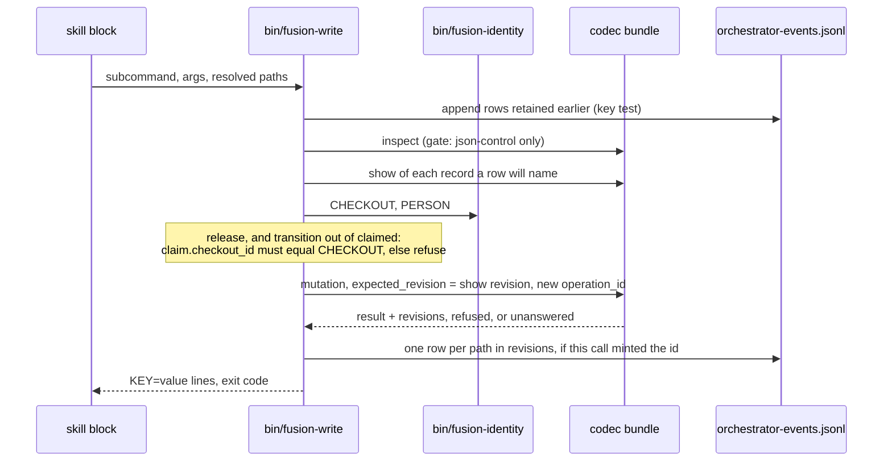
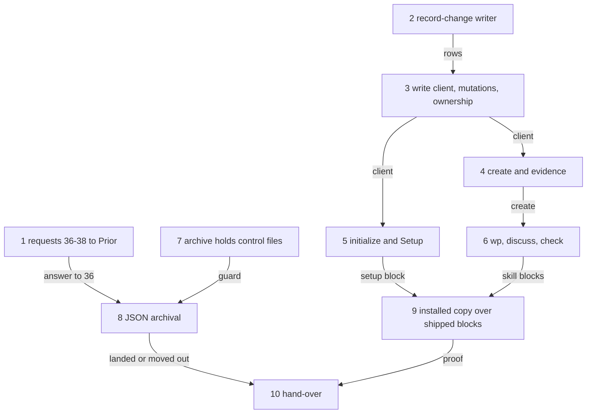

# Implementation Plan: FJ03c, the write client, Setup and the skills on JSON

**Date:** 2026-09-30
**Status:** Approved 2026-09-30 by the user, with the four recommendations; open questions (a) and (b) answered: (a) stub `bin/fusion-write` in `hook-route-exclusion.test.ts` (one test line, logged as a raise); (b) `disable-model-invocation: true` on `/fusion:setup` and `/fusion:wp`. In progress.
**Spec:** none as a requirements-designer spec. Prior's `concept/fusion-json-workbench-spec.md` at Prior `930eb26` (the passages cited here read as at `7909838`; `930eb26` changed only the status line, the `initialize` qualification and section 9's conformance paragraph): section 6 (the operation table, response 22 (a), the recovery paragraph), section 7 rows 5, 6 and 9 and the event paragraph, section 9's FJ03c row ("Host-Ownership geprüft; alle unterstützten Steueränderungen durch Codec-Operationen; Neuanlage ohne zweiten Manifest-Schreiber") and its closing sentence that tests exercise the shipped skill blocks. The rulings: `Prior: docs/design/fusion-qualified-revision-contract-response.md` `## 32` (`ae1ad78`); the FJ03 cut and items 25, 27, 32 and 35 of `codec/fixtures/prior/REQUESTS.md`.
**Cross-references:** 260928-1338-json-control-data-and-markdown-artefacts.md, 260930-1654_*_plan-initialize-the-codec-creates-a-new-workbench-and-list-names-its-state.md, 260930-1451_*_plan-fj03b-observers-checkers-citations-and-the-monitor-on-json.md, 260929-1810_*_plan-fj03a-the-record-client-the-format-gate-and-scope-and-order-on-json.md, 260930-1451_*_where-does-the-monitor-take-a-records-status-from-and-how-does-an-event-name-a-record-and-its-host.md, 260930-1654_*_does-a-read-finish-a-committed-initialize-whose-manifest-has-not-landed-or-report-the-target-as-legacy.md, 260929-1810_*_does-the-2026-09-27-ruling-on-the-growth-bound-reach-the-hook-tests-and-shipped-text-fj03-changes.md, 260930-2305_*_does-transition-refuse-a-payload-field-the-records-kind-has-no-rule-about.md, 260930-2305_*_how-is-a-json-controlled-pair-archived-when-its-control-record-names-its-narrative-by-workbench-path.md, 260930-2305_*_how-does-the-write-client-log-a-change-it-cannot-append-or-did-not-observe.md, 260930-2305_*_how-is-a-claim-held-by-a-checkout-that-no-longer-exists-released-under-response-22.md
**Planned against:** fusion `8dfaf018` (`git diff --stat bc3b04a8 8dfaf018 -- codec bin hooks skills` names `REQUESTS.md` alone); bundle 534 131 bytes, `sha256:bde8f3c952bd111695dbac510d3c0802566080e07c2ba3b6396d9c2c807844d1`; Prior `930eb26` (2026-09-30 23:05), no later commit on any ref; it closes requests 34 and 35 against that digest (`Prior: docs/design/fusion-initialize-prior-response.md`). Growth room at dispatch: `skills/` 25 559 bytes, `agents/` 3 806 bytes, hook tests 0 lines; each step re-reads them from `surface-growth-bound.test.ts`.
**Decidability:** Can a skill's executable block decide ownership and write safely through the client with no second source of truth, from the inputs a skill has? **Ownership: yes.** The block calls one helper, which reads the claim from `show` and this checkout from `bin/fusion-identity`, the criterion `bin/fusion-claimed-package` already uses, and sends `show`'s revision as `expected_revision`. **The revision race: yes, decided by the codec, not the client.** A record that moved between `show` and the mutation is `conflict/revision-mismatch`, and the client never retries. What the Claude side cannot decide is whether a caller is authentic beyond its checkout identity. It has no authentication and no host generation (item 30), and the plan states this rather than approximating it. **The log: no, as posed.** Whether an answer is a replay is not decidable from the answer, because stored answers come back byte for byte. The mechanism changes to "did this call observe this answer", which the writer knows: it minted the operation id, it holds the log key, and it retains rows it could not append. A re-send with nothing retained stays unlogged, the branch Prior permits (`260930-2305_*_how-does-the-write-client-log-a-change-it-cannot-append-or-did-not-observe.md`). **Archival of a pair: not decidable from the host's inputs.** Measured: a pair moved by `mv` keeps `narrative.path` at its old path, and `validate` turns `valid: false`. Only the codec may rewrite a control file, so the mechanism changes to a contract answer (request 36), and until then the archive block moves no control file. There is no second source: the payload field table is pinned to the codec's schemas, states come from `codec/contract/transitions.json`, and the `pending` window comes from `inspect`.

## Directive

FJ03c is the third of the four FJ03 parts (`REQUESTS.md` `## FJ03 (questions before the consumers)`, the cut table). It carries three rows. Row 5 without `/fusion:migrate`: `wp`, `setup`, `reconcile`, `archive`, `cadence` and `check` create pairs through the codec and hold no competing JSON authority. The archive half of row 9: pairs move together. The write half of row 6: a reviewer's evidence goes through `create`. It builds the Claude side's first codec writer: one client for every supported mutation. The client checks ownership as response 22 (a) asks, writes the `record_change` rows of item 32 as Prior accepted them, and serves as the skills' only route to a control change. It settles item 25 for the Claude side.

**Where the Setup preconditions land: here, in FJ03c.** The initialize plan handed them to "FJ03c and FJ03d". This plan splits them by the cut. Everything executable goes to FJ03c: `initialize` before any other write, the `pending` window, a manifest without a marker, the refused entries named, and a re-inspect after success. Section 9 names "Neuanlage ohne zweiten Manifest-Schreiber" in FJ03c's row, and FJ03a's resolvers already refuse a workbench without a manifest. So Setup on this branch produces no usable workbench until it calls `initialize`. FJ03d keeps the prose about Setup in `skills/help/`, the rules and the READMEs.

## Current State

- **Readers only.** `hooks/lib/record-client.ts` provides `ask` (one process, no retry, a 70 s timeout, a 16 MiB bound) and `gate`. The gate hands back `json-control` with an id, `legacy`, `unsupported`, `refused` or `unanswered`, and it drops `inspect.pending`. `hooks/lib/codec-read.ts` and `hooks/lib/record-index.ts` read. No Claude-side code sends a mutation (`REQUESTS.md` hand-over, item 9).
- **The row has readers and no writer.** `bin/monitor` reads `record_change` rows (FJ03b step 6). `utcStamp` and `resolveIdentity` in `hooks/lib/orchestrator-events.ts` write the log's `ts` form and the identity pair, and `FUSION_SESSION_ID` is exported by `hooks/session-id.ts`.
- **The skills write Markdown control data.** `skills/wp/SKILL.md` writes `**Status:** open` into a new record. `skills/discuss/SKILL.md` renames `_o_` to `_c_`. `skills/archive/SKILL.md` selects by marker and `**Status:**` and moves with `mv`. `skills/setup/SKILL.md` runs `mkdir -p` over every store before any codec call. Every skill that runs `bin/fusion-paths` already halts on a legacy workbench (FJ03a, exit 3), so none of them needs a legacy branch.
- **Measured through the bundle at `8dfaf018`, in a scratch workbench:**
  - `create` of a package refuses `mode` (`payload-field-not-admitted`), so `autonomous` at filing is `create`, then `set-mode`.
  - `transition` of an issue with `outcome` and `claim` lands and drops both fields (item 25).
  - A pair moved into `archive/` makes `reconcile` and `validate` report `narrative-missing`.
- **Unchanged here.** The agents' own record operations (orchestrator claim, curator edges, state-auditor transitions, the reviewer prompt) are text, so they belong to FJ03d. This plan gives them the helper those texts will call.

## Approach

**One helper, `bin/fusion-write`, over `hooks/write.ts`.** It follows the FJ03a pattern: a bash wrapper, a compiled entry and a library module, reached by explicit calls only. It has one subcommand per codec mutation, plus `evidence` (the `kind: evidence` branch of `create`) and `log-repair`. A skill block passes arguments and resolved paths and builds no JSON. `hooks/lib/record-write.ts` runs the sequence below. `hooks/lib/record-change.ts` composes, deduplicates, appends and retains rows. `record-write` depends on `record-change`, `record-client` and `codec-read`, and nothing depends back.

**Ownership (response 22 (a)).** The check covers `release` and every `transition` out of `claimed`, and nothing else. The standing claim's `checkout_id` must equal the `CHECKOUT=` of `bin/fusion-identity`, the same helper scope resolution uses. An identity that cannot be read refuses the request, and so does a foreign claim, with no flag that overrides the check. A takeover waits for request 38.

**Payloads (item 25, the Claude side).** One table maps each kind to the payload fields the codec reads for it:

- package: `claim`, `outcome`
- issue: `disposition`
- plan: `steps`, `criteria`
- decision: `answer_ref`, `implementation_ref`, `superseded_by`, `deferral`
- discussion: none

A test reads `codec/schemas/record.schema.json` and `package.schema.json` and holds the table equal to them. The table is not a second source of truth. A flag the target kind does not carry is a usage error before any request.

**Rows (item 32 at `ae1ad78`).** Each path in the answer's `revisions` gets one row. `record_id` and `kind` come from the `show` before the mutation or from the request (for `create`, and for the `adopt-plan` document and the plan it replaces), never from the package's id. `change` follows the ruled table, with `{attached_evidence}` and `{created_kind: "evidence"}`, and `initialize` gets no row. `person` and `checkout` are left out when unread, and `session_id` when `FUSION_SESSION_ID` is unset. Before an append, the writer:

- skips a key `(workbench_id, operation_id, path, revision)` already in the log;
- terminates a torn last line with a lone LF;
- writes whole LF-terminated lines.

A failed append retains the rows in `.guard-state/record-change-pending.jsonl` with their original `ts`, reports `event=pending`, and never resends the mutation. A re-send (`--operation-id`) appends only retained rows. With none retained it reports `event=unlogged`.

**Setup.** `fusion-write initialize --workbench <dir>` is the one route that sends `initialize`, as a disjoint split on `inspect`:

| `inspect` answers | The helper does |
|---|---|
| `json-control` (a manifest without the marker included) | reuse; `pending` is finished by the next mutation's own recovery |
| `legacy`, `pending` names an intent, not blocked | send the request rebuilt from `pending`, once |
| `legacy`, `pending` blocked, or `pending-initialize-unreadable`/`-ambiguous` | stop; the intent is corrected by hand |
| `legacy`, `pending: null` | mint a UUID and an operation id, send `initialize` |
| `unsupported` | stop, naming the diagnosis |
| refused otherwise, or unanswered | stop; rerunning Setup lets `pending` name the intent |

`target-not-empty` and `manifest-present` stop with the entries named. A v12 store among them routes to FJ04's migration. After every successful answer the helper sends `inspect` again and requires `json-control` with the sent id. Setup then creates the stores, `.guard-state/`, the marker and `stilwerk/`, in that order. No other writer sends `initialize`. A mutation that meets `legacy` with `pending` is refused and names Setup: no migration, no retry.

**Archive.** Until request 36 is answered, the block moves no control file. It holds every pair and every container that carries one, names each, and still archives what is not a record: forum entries, aged reports without evidence, history, and the guard log.

**Tests over shipped text.** Each converted block reads its inputs from shell variables named at its head. The installed-copy test extracts the block from the shipped `SKILL.md` and runs it verbatim (section 7's closing sentence).

## Implementation Steps

Every step touching `skills/` reports the skills byte room after the step, re-read from `surface-growth-bound.test.ts`.

1. [DONE] **Requests 36 to 38, and two statements, to the Prior side**
   - Done 2026-09-30 (analyst draft; the orchestrator appends and commits). `codec/fixtures/prior/REQUESTS.md` gains `## FJ03c (questions before the write paths)` at line 802, a pure append: 800 lines and 216 271 bytes before, 913 lines and 235 472 bytes after (19 201 bytes added); `cmp` of the first 216 271 bytes against the file at `cdc15532` is equal. Stamped against fusion `cdc15532` (2026-09-30 23:23), Prior `930eb26` (2026-09-30 23:05; `git log --all --oneline 930eb26..` empty) and the bundle 534 131 bytes, `sha256:bde8f3c9…44d1`, on disk and in the blob at `cdc15532`; `git diff --stat 8dfaf018 cdc15532 -- codec bin hooks skills` empty. Request 36 (archival, option 2 proposed, with the `record-not-found` caveat for evidence bindings and by-id references, and whether the codec half is a revision of its own), 37 (codec refusal of foreign `transition` payload fields in the next digest-moving revision), 38 (codec-owned takeover bound to a named previous holder and the user's provenance). Two unnumbered statements for objection: the writer's logging procedure (the logging decision's option 1) and the checkout-only caller binding. Measurements re-taken through the bundle over a scratch workbench (path with a space and a comma): pair and container moved into `archive/` give `validate` `valid: false` with `unresolved-reference/narrative-missing`; an issue `open → closed` with `disposition`, `outcome` and `claim: null` lands and keeps neither `outcome` nor `claim`; `create` of a package with `mode` is `payload-field-not-admitted`. Departures: the two statements carry no item number, so 36 to 38 stay the only new numbers; 36 adds question (c), 38 adds (b) and (c) and cites Prior response 22's sentence on an "administrative recovery/transfer" under host authority; the second statement names the copied-checkout limit. The re-taken `transition` needed a `disposition` (an issue's `closed` requires one) and an `outcome` object; the plan's short form of that measurement is unchanged in substance.
   - Executor: `analyst`
   - Files: `codec/fixtures/prior/REQUESTS.md`
   - Changes: the analyst drafts `## FJ03c (questions before the write paths)` in its scratchpad, and the orchestrator appends it and commits it (the initialize step 1 departure). The section is stamped with the fusion head, Prior `930eb26` and the digest above, and it states each record's option as the user ruled it at approval. **36**, archival of a JSON pair: the measurement, the three options, fusion's proposal (option 2 of the archival record), and the question whether the codec half is a revision of its own. It carries the caveat of option 2: a live evidence record, or a by-id reference from a terminal record, into an archived package would then answer `record-not-found`, so the exclusion covers evidence records and their bindings as well as references and dependencies. **37**, foreign payload fields: the Claude client never sends one. Asked: should the codec refuse them in the next revision that moves the digest? **38**, a takeover under response 22: option 2 of the takeover record, asked. Two statements for information, open to objection: how the writer logs, as the logging record states it; and the Claude side's caller binding, which is the checkout identity and no host generation, checked for exactly the operations response 22 names.
   - Dependencies: none.
   - Acceptance: the commit changes `REQUESTS.md` alone; every figure is re-taken.

2. [DONE] **The `record_change` writer**
   - Executor: `code-implementer`
   - Files: `hooks/lib/record-change.ts`, `hooks/lib/__tests__/record-change.test.ts`, the raise in `surface-growth-bound.test.ts`, logged in `README-hooks.md` `### Growth bounds on the shipped text`
   - Changes: row composition per operation from `(request, pre-mutation shows, gate id, answer, identity)`, the ruled `change` table, the key test, the torn-tail guard, retention and `log-repair`, reusing `utcStamp` and `resolveIdentity`.
   - Tests, each shown red against a broken copy:
     - delayed logging: retained rows are appended later with their original `ts`, and the monitor's stable sort places them;
     - duplicate delivery: the same rows twice give one row each;
     - a failed append (read-only log): the rows are retained, the result reports success with `event=pending`, and nothing is resent;
     - `initialize` gives no row;
     - `adopt-plan` gives two or three rows with distinct ids;
     - a missing identity half is absent, never null.
   - Note to record: `.guard-state/record-change-pending.jsonl` stays unnamed in `rules/workbench-tracking.md`, which classifies each `.guard-state/` file separately, until FJ03d; FJ03c edits no `rules/`. The window is stated in the step note and in step 10.
   - Dependencies: none.
   - Acceptance: `cd hooks && npm test` green but for the known monitor wildcard-bind case (`260928-1520_*_the-monitor-wildcard-bind-case-times-out-on-a-host-its-own-probe-declares-usable.md`); any other red stops the step. `hook-route-exclusion.test.ts` green without an edit.
   - Done (2026-09-30, code-implementer; uncommitted): `hooks/lib/record-change.ts` and its compiled `hooks/dist/lib/record-change.{js,d.ts}`. `composeRows(observation, observer)` gives one row per path in the answer's `revisions`, fields in the order `ts, event, host, op, operation_id, workbench_id, record_id, path, kind, revision, change, person, checkout, session_id`, `host: "claude"`, no `run_id`. `record_id` and `kind` come from the caller's pre-mutation `show` of that path; for `create` from the request; for the `adopt-plan` document from `request.plan`; for the plan it replaces from the `role: plan` entry of the package's `active_documents` in that same `show`. A path with no identity throws, naming it. `change`: `{from, to}` from the answer for `transition`, `claim` and `release`; `{created: <status>}` for `create`, `payload.state` for a record kind and the kernel's fixed `open` for a package (`PACKAGE_CREATED_STATUS`, held equal to a real package's stored status by a test); `{created_kind: "evidence"}` for `create(kind: evidence)`; `{mode: <value>}` from the answer; `{depends_on: <count>}`; `{attached_evidence: request.evidence}`; `adopt-plan` `{adopted: role}`, `{adopted_as: role}`, `{replaced_by: <document id>}`. `initialize` gives no row. `observer(workbench)` supplies `utcStamp`, `resolveIdentity` in the workbench's project and `FUSION_SESSION_ID`; each unread half is left out. `logObserved` appends by the key `(workbench_id, operation_id, path, revision)`, each key once, with a lone LF first after a torn last line, in one append; a failed append retains the rows verbatim in `.guard-state/record-change-pending.jsonl` and answers `pending` (`unlogged` if retaining fails too). `repairRetained` appends retained rows by key and drops what it read, keeping a suffix written meanwhile. `logResend` composes nothing: it repairs, then answers `logged` when the log holds every key of the replayed answer, `pending` when the rest is retained, else `unlogged`. **One refinement of `## Approach` for step 3 to take:** a re-send whose rows are already in the log reports `logged`, not `unlogged`, since the key test can tell; with nothing logged and nothing retained it is `unlogged` as written. The module sends no request and imports no client. `hooks/lib/__tests__/record-change.test.ts` (137 lines, real bundle): adopt-plan two then three rows with distinct ids and one operation id, create and initialize; identity halves absent; duplicate delivery after a torn line; failed append (read-only log); delayed logging ordered by `bin/monitor`'s own `_record_changes`, run through `python3`; re-send. Red against a broken copy, each shown in the scratch clone and restored green, every case red under at least one break: key test removed, and torn-tail guard removed, each red on duplicate delivery; no retention, red on failed append and delayed logging; repair restamping `ts`, red on delayed logging and re-send; `initialize` composing rows, and the replaced plan taking the package id, each red on the composition case; an absent person written as a key, red on the identity case; a re-send answering `logged` without a row, red on the re-send case. Hook-test room: 0 before (23 029 of 23 029 at `cdc15532`), nothing retired, `TEST_LINE_HEAD_ROOM` 3 801 -> 3 938 (+137), 0 after (23 166 of 23 166), logged in `README-hooks.md` as the fifteenth raise; golden regenerated; `reference-resolution-lint.test.ts` pin re-approved 1805 -> 1810 paths, all five the README's; the README lib table gains the module's row. Proven on a scratch clone at `cdc15532` with two scratch commits: `cd hooks && npm test` exit 1, 1055 of 1056 passed, the one red the monitor wildcard-bind case; `hook-route-exclusion.test.ts` green, unedited; `cd codec && CODEC_REQUIRE_GOLDENS=1 npm test` exit 0, `npm run typecheck` exit 0. **Window, stated:** `.guard-state/record-change-pending.jsonl` stays unnamed in `rules/workbench-tracking.md`, which classifies each `.guard-state/` file separately, until FJ03d; FJ03c edits no `rules/`, and step 10 names it.

3. [DONE] **The write client, the mutations on existing records, ownership**
   - Done (2026-10-01, code-implementer; uncommitted): `bin/fusion-write` over `hooks/write.ts` and `hooks/lib/record-write.ts`, compiled to `hooks/dist/write.{js,d.ts}` and `hooks/dist/lib/record-write.{js,d.ts}`. Subcommands `claim`, `release`, `transition`, `set-mode`, `set-dependencies`, `adopt-plan`, `attach-evidence`, plus `log-repair` (the Approach names it; no step did). Every call takes `--record <control path>` and `--actor <token>`. A caller passes paths, and the client reads ids, revisions and narrative hashes through `show`: `adopt-plan --plan <path>` sends the plan's current narrative hash, `attach-evidence --evidence <path>` binds the record at its revision under its own `execution_policy`, `set-dependencies --on <terminal|succeeded>:<path>` (repeatable) or `--clear`. Only `transition`'s payload flags and `set-mode --source` take JSON. Sequence: `repairRetained`; `gate`, whose one `inspect` answer is kept so a `legacy` workbench with a pending `initialize` is refused naming `/fusion:setup` (`gate` drops `pending`; step 5 adds it); `show` of every record named, its revision sent as `expected_revision`; ownership for `release` and every `transition` out of `claimed` against `CHECKOUT=` (foreign claim and unreadable identity refuse, no override; `release` of an unclaimed package goes to the codec, which answers `conflict/not-claimed`); `claim` refuses without a readable identity; one mutation under `randomUUID()`; rows through `logObserved`, or `logResend` for a re-send. **A kind-foreign payload flag is a usage error after `show` names the kind and before the mutation**, not before any request: the kind is the codec's answer, and the path alone does not give it. A re-send takes `--operation-id` with `--expected-revision` (and `--claimed-at` for `claim`), as the unknown outcome prints them, since the codec replays only an identical request. Exit codes: 0 landed, 1 stop (no workbench, or `bin/fusion-identity` exit 1), 2 usage, 3 install incomplete or internal fault, 4 workbench or record not read, 5 ownership, 6 mutation refused, 7 outcome unknown. Every subcommand was also run once through the real bundle in the scratch clone, `attach-evidence` over an evidence record `create` wrote. `hooks/lib/__tests__/record-write.test.ts` (133 lines, real bundle): ownership (owner, foreign checkout, unreadable identity, non-claimed source, a transition out of `open` with no identity); revision-mismatch with one mutation and no row; unanswered then re-send (unknown, one mutation, no row; the re-send answers the stored revision twice, `event=unlogged`, no row); usage errors send no mutation; `PAYLOAD_FIELDS` equal to the schemas; legacy with a pending `initialize` (the `16-inspect` seed of the codec's initialize session, its digest placeholder filled) sends `inspect` alone; `bin/fusion-write` exits 0, 6, 5, 2, 0 by its table. Red against a broken copy, each shown in the scratch clone and restored green: ownership check removed (ownership and CLI cases red); unreadable-identity branch removed (ownership); a retry after `unanswered` (unanswered case); a re-show and resend after a refusal (mismatch case); a re-send composing rows (unanswered case); the kind check removed (usage case); `outcome` added to the issue row of the table (schema case); the pending branch disabled (legacy case); exit codes 5 and 6 swapped (CLI case). `hook-route-exclusion.test.ts`: `fusion-write` added to `STUBBED` on the existing line, 0 lines added, green. Hook-test room: 0 before (23 166 of 23 166 at `1b3ce9ef`), nothing retired, `TEST_LINE_HEAD_ROOM` 3 938 -> 4 071 (+133), 0 after (23 299 of 23 299), logged in `README-hooks.md` as the sixteenth raise; golden regenerated; `reference-resolution-lint.test.ts` pin re-approved 1810 -> 1834 (README +17, the wrapper's header +7). `README-hooks.md` gains the roster row, the `write.ts` entry row and the `lib/record-write.ts` row. **Outside the step's file list, not written in the live tree: `.gitignore` needs `!bin/fusion-write`**, or git ignores the helper and `committed-dist.test.ts` fails; the scratch commit carries the line. Proven on a scratch clone at `1b3ce9ef` with scratch commits `c5149c01` and `28ac17e5`: `cd hooks && npm test` exit 1, 1062 of 1063 passed, the one red the monitor wildcard-bind case; `cd codec && CODEC_REQUIRE_GOLDENS=1 npm test` exit 0 (1165), `npm run typecheck` exit 0; bundle digest unchanged.
   - Executor: `code-implementer`
   - Files: `hooks/lib/record-write.ts`, `hooks/write.ts`, `bin/fusion-write`, `hooks/lib/__tests__/record-write.test.ts`, the roster row in `README-hooks.md` `### The bin/ helper roster`, the logged raise
   - Changes: the sequence of `## Approach` for `claim`, `release`, `transition` (state, plan progress, decision references, deferral, outcome, disposition), `set-mode` (`autonomous` only with a user source), `set-dependencies`, `adopt-plan` and `attach-evidence`. The payload table goes with its schema test. The operation id is minted per call, and `--operation-id` is the explicit re-send. Output is `KEY=value` (`result=`, `operation_id=`, `path=`, `revision=`, `event=`). The exit codes are distinct and named in the wrapper's header for these outcomes: landed, usage, no workbench, install incomplete, workbench not read, ownership refused, mutation refused (class and reason on stderr), and outcome unknown (the operation id printed for a re-send).
   - Tests:
     - the owner releases; another checkout, an unreadable identity and a non-claimed source are each handled as their own case;
     - a write landed between `show` and the mutation gives `revision-mismatch`, one request and no row;
     - an unanswered mutation leaves its outcome unknown, with no retry;
     - a re-send answers the stored bytes, and no fresh row is written;
     - a foreign flag is a usage error;
     - `legacy` with `pending` is refused and names Setup.
   - Dependencies: 2.
   - Acceptance: as step 2's; the new entry is reached from no `hooks/hooks.json` command.

4. [DONE] **Creation: records with their narrative, and a reviewer's evidence**
   - Done (2026-10-01, code-implementer; uncommitted): `bin/fusion-write` gains `create` and `evidence` in `hooks/lib/record-write.ts`, compiled to `hooks/dist/lib/record-write.{js,d.ts}`. `create --kind package|issue|plan|discussion|decision --narrative-file <workbench path> --origin user-request|<package control path> [--domain <token>] --actor <token>`; `evidence --record <package control path> --report <workbench path> --verdict <v> --actor <token>`. Both are the codec's `create`, with the same gate, retained-row repair, no retry, and rows through `composeRows`: `{created: "open"}` for the five kinds, `{created_kind: "evidence"}` for evidence. **File list widened by the coordinator's approval:** `hooks/write.ts` (+ `hooks/dist/write.js`) and the `bin/fusion-write` header. The `unknown` outcome now carries `resend`, the flags a re-send repeats (`--expected-revision`, `--claimed-at`; for `create` `--id`, for evidence `--id` and `--accepted-at`), and the entry prints them as `expected_revision=`, `claimed_at=`, `id=`, `accepted_at=`; `create` has no expected revision. An evidence re-send re-reads brief, plan, report and tree, and if one moved the codec answers `conflict/operation-id-reused`. **Four choices the step text left open, accepted at approval:** (1) `--narrative-file` names the Markdown file the caller writes first; the request carries no `content`, and the codec writes the control file alone. (2) `transitions.json` has no `initial` key, so `INITIAL_CONTROL` is a table in the client, held by a test to the one state of each record kind no edge enters, to the `required` keys of its `<kind>_control` schema, and to the `create` kind enum; the kernel fixes a package's `open`. (3) `--origin` is required, with no default; `--domain` is required for a package and a usage error for a record kind. (4) The evidence fields the step does not name follow `codec/fixtures/valid/protocol/create-evidence.json`: `subject.git_tree` is the project's `HEAD^{tree}` at call time and `git_range` null; `role` is `{profile: --actor, version: .claude-plugin/plugin.json}`; `execution_policy` is `claude-guided`; `checks` and `uncertainties` are empty; `predecessor` is null, so a second record over one report is `record-exists`; `accepted_at` is now; `report.kind` is `review`; the package comes from `--record`, the scope from the report's path. **For step 6, stated:** a failed `create` leaves the caller's Markdown file behind, and evidence binds `HEAD^{tree}`, so uncommitted work is bound to HEAD. `hooks/lib/__tests__/record-write.test.ts` (133 -> 182 lines): the `INITIAL_CONTROL` pin; a pair of each kind created through the client, each `open`, filed by this person, one `{created}` row each; evidence against an adopted plan, whose binding is refused `missing-evidence/report-changed` after a report edit and lands over the restored bytes, row `{created_kind: "evidence"}`; `create` usage errors (package without `--domain`, record kind with one, unknown kind); `create` and `evidence` through `bin/fusion-write`, exit 0. Red against a broken copy, each shown in the scratch clone and restored green: plan without `acceptance` (pin, per-kind and evidence cases); package payload without domain (per kind); `plan_revision` always null (evidence); brief from the control revision (evidence); wrong report hash (evidence, CLI); evidence row composed as `{created}` (evidence); domain check removed (usage); re-send without `claimed_at` (unanswered case); package scope from its path (per kind); origin named by revision (per kind, evidence, CLI); filer's person dropped (per kind); plugin version read from the wrong directory (CLI). Hook-test room: 0 before (23 299 of 23 299 at `e8b7f18d`), nothing retired outright (61 lines added, 12 removed, mostly in place), `TEST_LINE_HEAD_ROOM` 4 071 -> 4 120 (+49), 0 after (23 348 of 23 348), logged in `README-hooks.md` as the seventeenth raise; golden regenerated; `reference-resolution-lint.test.ts` pin re-approved 1834 -> 1837 paths, all three the README's. `README-hooks.md` amends the `lib/record-write.ts` row and the `bin/fusion-write` roster row. No `skills/` or `agents/` file changed, and no new file under `bin/`. Proven on a scratch clone at `e8b7f18d` with scratch commits `878decc8` and `6df51716`: `cd hooks && npm test` exit 1, 1065 of 1066 passed, the one red the monitor wildcard-bind case; `hook-route-exclusion.test.ts` green, unedited; `cd codec && CODEC_REQUIRE_GOLDENS=1 npm test` exit 0 (1165), `npm run typecheck` exit 0; bundle 534 131 bytes, `sha256:bde8f3c9…44d1`, unchanged. Applied to the live tree with `git apply`; `cmp` shows all eleven touched files byte-identical to `6df51716`; live `cd hooks && npm test` exit 1, 1065 of 1066, the same one red.
   - Executor: `code-implementer`
   - Files: `hooks/lib/record-write.ts`, `record-write.test.ts`
   - Changes: `create --kind package|issue|plan|discussion|decision`, with `--narrative-file`. The narrative is a marker-free name the caller derives, and the id is a minted UUID. The initial state follows `codec/contract/transitions.json`, and the filer is `bin/fusion-identity`'s person. `evidence --report <path>` computes the report's hash and takes `workbench_id` from the gate. It takes `brief_revision` and `plan_revision` from `show` of the package: the narrative hash, and the plan binding's revision. It sends `host: claude-code` and the verdict given. This is the executable route row 6 asks for, and the reviewer prompt that calls it is FJ03d's.
   - Tests: a created pair per kind; evidence over a report, and `report-changed` after an edit; `{created_kind: "evidence"}` on its row.
   - Dependencies: 3.
   - Acceptance: as step 2's.

5. [DONE] **`initialize`, and Setup's Step 0 on it**
   - Done (2026-10-01, code-implementer; uncommitted): `initialize(target, ask)` in `hooks/lib/record-write.ts`, reached as `bin/fusion-write initialize --workbench <dir>`; `gate` in `hooks/lib/record-client.ts` carries `pending` (`null` or `{operation_id, id, blocked}`) on `legacy` and `unsupported`, additively, and a `pending` it cannot read is `unanswered/unparseable`; `admitted` now reads `g.pending` instead of capturing the raw answer. **The table as implemented, one row per `inspect` answer:** `json-control`, marker or not → `reused`, nothing sent; `legacy`, pending not blocked → the request rebuilt from `pending`, sent once; `legacy`, pending blocked → stop, by hand; **`legacy`, no pending, `.fusion-setup` present → `legacy`, nothing sent, Setup runs as before until FJ04**; `legacy`, no pending, no marker → a new UUID and operation id, `initialize` sent once; `unsupported` → stop, naming the diagnosis; `inspect` refused (`pending-initialize-unreadable`/`-ambiguous` among them, named "corrected by hand") or unanswered → stop. After an `initialize` that landed, `inspect` again, and anything but `json-control` under the id sent stops. A refused `initialize` stops with the codec's detail, which names the entries; an unanswered one is `result=unknown`, nothing retried, and Setup run again reads the intent from `pending`. **The marker row, added with the coordinator's approval, and why:** the literal legacy row ("`legacy`, `pending: null` → send `initialize`") would have stopped Setup for every existing workbench before FJ04, this repository's included: measured through the bundle, `initialize` on a legacy target answers `conflict/target-not-empty` naming `.fusion-setup, shared, work-packages`. The split stays disjoint and complete: a pending intent never stands beside the marker (the marker is an entry, and `initialize` lands only in an empty directory), so the marker divides only the `pending: null` row; a manifest without a marker after a crash is `json-control`, so reuse; a target holding only `.DS_Store` has no marker, so it goes to `initialize`, is refused and its entries are named. **File list widened with the coordinator's approval:** `bin/fusion-write` (an `initialize` branch before the workbench lookup, taking `--workbench`, reading no marker and no identity; header, usage and exit table amended) and `hooks/write.ts` (prints `result=initialized|reused|legacy`, `workbench_id=`, `operation_id=`, or the stop's kind; exit 0 ready, 2 usage, 3 install, 4 unread, 6 refused, 7 unknown). `skills/setup/SKILL.md`: `disable-model-invocation: true` (the user's answer (b)); Step 0 keeps the v11 probe, then `mkdir -p ./fusion-workbench` alone and `fusion-write initialize`, whose outcome decides whether Setup continues, then the stores and `.guard-state/`, the marker, `stilwerk/` (Step 0d), in that order; any other exit stops Setup, the entries named, a fusion store among them routed to `/fusion:migrate`, exit 7 answered by running Setup again, never by a resend. Skills: 202 469 -> 203 700 bytes (+1 231; `setup` 14 675 -> 15 906), room 25 559 -> 24 328. The table does not fit in the one line the block replaces; the bound stays green inside its room, so no `SKILL_HEAD_ROOM` raise was needed or logged. `path-literal-lint.test.ts` green. Tests, `hooks/lib/__tests__/record-write.test.ts` (182 -> 251 lines), real bundle: `json-control` reused with and without the marker; legacy with its marker `legacy`, only `inspect` sent, the directory unchanged; empty target initialized and re-inspected under its id, `.DS_Store` and a `work-packages` store each refused `target-not-empty` by name, nothing written; the codec's `16-inspect` seed with its digest computed resent once under its operation id and id, and, stubbed blocked, stopped with only `inspect` sent (the gate's real `pending` asserted); unsupported, a refused and an unanswered `inspect`, and an unanswered `initialize` (one sent, then Setup again reuses) stopped; a replay answered after `workbench.json` was deleted caught by the re-inspect; `bin/fusion-write initialize` without a marker exits 0, 0, 2, 4, 6. `record-client.test.ts` states `pending: null` in the legacy case's line. Red against a broken copy, each in the scratch clone and restored green: reuse sends `initialize` (reuse, stop cases); marker row removed (legacy case); re-inspect removed (empty, pending, replay); pending ids ignored (pending, replay); blocked ignored (pending); unsupported proceeds (stop); retry after unanswered (stop); entries not named (empty); gate drops `pending` (the step-3 legacy case, pending, replay); wrapper needs a marker (CLI); a stop exits 0 in the entry (CLI); refused `inspect` proceeds, unanswered `inspect` proceeds (stop); a `work-packages` entry exempted like the marker (empty). A first version of the blocked case passed under "blocked ignored" because the seed's placeholder digest makes `inspect` refuse the intent as unreadable; the digest is now filled before it. **Legacy continuity, shown on this repository's own workbench:** Step 0's blocks extracted from the base and the new `SKILL.md` and run over two copies of `fusion-workbench/` with `FUSION_PLUGIN_ROOT` at the clone: the new run prints `result=legacy`, `exit=0`, writes no `workbench.json` or `.json-state/`, and the two trees are identical file for file (3 419 entries, sha256), the marker equal but for `setup_at`. On a fresh project the same block prints `result=initialized` and then `result=reused` under the same id; over a lone `.DS_Store` it prints `result=refused`, the entry named, `exit=6`. Hook-test room: 0 before (23 348 of 23 348 at `f9ad044f`), nothing retired, `TEST_LINE_HEAD_ROOM` 4 120 -> 4 189 (+69), 0 after (23 417 of 23 417), logged in `README-hooks.md` as the eighteenth raise; golden regenerated; `reference-resolution-lint.test.ts` pin re-approved 1837 -> 1843 (README +4, the wrapper's header +1, Setup +1, each measured by swapping the file to its base). `README-hooks.md` amends the `write.ts`, `lib/record-client.ts`, `lib/record-write.ts` and roster rows. `hook-route-exclusion.test.ts` green, unedited. Proven on a scratch clone at `f9ad044f` with scratch commits `813af61b` and `b0d8e1bb`: `cd hooks && npm test` exit 1, 1072 of 1073, the one red the monitor wildcard-bind case; `npx tsc --noEmit` exit 0; `cd codec && CODEC_REQUIRE_GOLDENS=1 npm test` exit 0 (1165), `npm run typecheck` exit 0; bundle 534 131 bytes, `sha256:bde8f3c9…`, unchanged. Live tree byte-identical to `b0d8e1bb` in all seventeen files; live `cd hooks && npm test` exit 1, 1072 of 1073, the same one red. **Window, stated:** `codec/README.md` still says "`/fusion:setup` does not call it yet (FJ03d)"; `codec/` is untouched here, and the sentence is FJ03d's prose to correct.
   - Executor: `code-implementer`
   - Files: `hooks/lib/record-client.ts` (`gate` carries `pending` additively), `hooks/lib/record-write.ts`, `skills/setup/SKILL.md`, tests
   - Changes: the Setup table of `## Approach`. Step 0 becomes: the existing v11 store-name probe; `mkdir -p` of the workbench directory alone; `fusion-write initialize`, whose outcome decides whether Setup continues; then the stores, `.guard-state/`, the marker and `stilwerk/`, in that order. The rest of Setup is unchanged. The skills byte delta and the room left after the step are reported; the table must fit in what the block replaces or the raise is logged.
   - Tests: one case per row of the table, each red against a broken copy. Refused entries are named, and `.DS_Store` is refused by design. The re-inspect catches a replay after `workbench.json` was deleted.
   - Dependencies: 3.
   - Acceptance: as step 2's; the skills bound is green, or its raise is logged.

6. [DONE] **`/fusion:wp`, `/fusion:discuss` and `/fusion:check` on the client; the other skills classified**
   - Done (2026-10-01, code-implementer; uncommitted): **The gate.** `wp` Step 0 and `discuss` Step 1 open with `echo '{"op":"inspect"}' | bin/fusion-record | grep -o '"state":"[a-z-]*"' | head -n 1`, before `bin/fusion-paths`; `"state":"json-control"` takes the JSON paragraphs, any other line or none is the body exactly as written. **Legacy, measured, not assumed:** at `ccc8bf5b` both skills already stop on a legacy workbench, because `bin/fusion-paths` exits 3 there (FJ03a, `bin/fusion-claimed-package` refuses legacy by name), which `## Current State` states; so "as today" on legacy is that stop. The base and new first blocks, run over a copy of this repository's own `fusion-workbench/` in a `git init` project with `FUSION_PLUGIN_ROOT` at the clone: `wp` and `discuss` each exit 3 with byte-identical stderr, the new block printing one line more, `"state":"legacy"`; the copy is `diff -r`-identical to the source afterwards, no `workbench.json` or `.json-state/`; with no workbench both exit 1, identical. **wp on JSON:** `disable-model-invocation: true` (the user's answer (b)); the record carries the title and `## Directive` alone; `create --kind package --narrative-file "$N" --origin user-request --domain <code|data> --actor user`, the domain the user's own or `domain=` of `bin/fusion-session-domain`, since the client requires `--domain` for a package (a departure from the Markdown flow, where `**Domain:**` is optional); `autonomous` in the user's words is `set-mode --value autonomous --source` a `user-word` `artefact_ref` of kind `other` to the record, its sha256 taken by `shasum`, the user's sentence kept verbatim in the directive (the artefact kinds carry no work-package kind). A failed `create` names the record left behind and the `fusion-write:` line and deletes nothing; exit 7 gives `operation_id=` and `id=` and resends nothing; a failed `set-mode` leaves the package ordinary, said. **discuss on JSON:** `--begin` writes `$OUT_DISCUSSION/<STAMP>-<topic>.md`, no marker and no `**Filed by:**` (the control file holds `filed_by`), then `create --kind discussion`, origin the container's `package.json` when `dirname "$OUT_DISCUSSION"` holds one, else `user-request` (no store literal, the path-literal lint green); rounds edit the Markdown alone; `--close` writes the two fields, renames nothing and sends `transition --to closed`. **check `gitignore`:** `workbench.json` joins the R3 loop, `.json-state` the class L loop, with one sentence naming `JSON_LIVE_STATE` in `hooks/lib/staging-drift.ts` as their classifier until `rules/workbench-tracking.md` names them (FJ03d). **Evidence, each block extracted from the shipped `SKILL.md` and run verbatim with its placeholders filled, in a project Setup's `initialize` made:** wp: gate `json-control`, `create` exit 0 and `set-mode` exit 0, `show` answers `open`, `code`, mode `autonomous` with the `user-word` source, `filed_by {user, T <t@example.com>}`, two `record_change` rows (`{created: open}`, `{mode: autonomous}`); a refused `create` (bad domain; a second `create` of the same pair) exits 6 and leaves the Markdown file, no control file; `validate` `valid: true`. discuss: in `shared/` (no claim) and in a claimed package's container, `create` exit 0 then `transition` exit 0, `show` `closed`, `filed_by {claude, …}`; the origin line resolves to the package in the container and to `user-request` in `shared/`; a refused `create` exits 6 and leaves the Markdown file; `validate` `valid: true` over four records. check: on a JSON project whose `.gitignore` excludes `workbench.json` and which force-tracks `.json-state/`, the base block prints nothing and the new one appends the negation (`check-ignore` then 1) and reports `.json-state` tracked; on a tracked legacy workbench both print nothing and the tree is clean. **Classified unchanged, one line:** reconcile (writes nothing; the state-auditor is FJ03d's), cadence (reads `*.md` only, so a pair counts once), curate, cleanup, memo, post (its one `mv` publishes a forum entry), news and commit (no control data); `help` is FJ03d's, `migrate` FJ04's, `setup` step 5's, `archive` steps 7 and 8's. Skills: 203 700 -> 207 387 bytes (+3 687: `wp` 4 994 -> 6 960, `discuss` 14 332 -> 15 852, `check` 31 748 -> 31 949), room 24 328 -> 20 641; no `SKILL_HEAD_ROOM` raise; golden regenerated. `path-literal-lint.test.ts` green. `reference-resolution-lint.test.ts` pin re-approved 1843 -> 1851 (the base `wp` gives 1847, `discuss` 1848, `check` 1850, each swapped alone). No hook test line added (the pin edit is in place on its one line), hook-test room unchanged at 0. `hook-route-exclusion.test.ts` green, unedited; no automatic hook reaches the codec. Proven on a scratch clone at `ccc8bf5b` with scratch commits `c26a4e8f` and `d0ac8494` (the second rewords wp's exit-7 sentence; its three blocks compared equal to the first's): `cd hooks && npm test` exit 1, 1072 of 1073, the one red the monitor wildcard-bind case; `codec/` untouched and read by no changed file, its suite not run. Live tree byte-identical to `d0ac8494` in all five files; live `cd hooks && npm test` exit 1, 1072 of 1073, the same one red.
   - Executor: `code-implementer`
   - Files: `skills/wp/SKILL.md`, `skills/discuss/SKILL.md`, `skills/check/SKILL.md`
   - Changes:
     - wp: `create --kind package`. The narrative carries the title and the directive, with no `**Status:**` or `**Filed by:**` head, since JSON holds both. `**Mode:** autonomous` in the user's own words becomes `set-mode`.
     - discuss: `--begin` creates a marker-free discussion pair, rounds edit the Markdown alone, and `--close` sends `transition --to closed`.
     - check `gitignore`: `workbench.json` joins the R3 list and `.json-state` the class L list, as staging drift already classifies them.
     - classified unchanged, one line each in the step note: reconcile (it writes nothing; the state-auditor is FJ03d's), cadence (it reads `*.md` only, so a pair counts once), curate, cleanup, memo, post, news and commit (no control data). `help` is FJ03d's and `migrate` FJ04's.
   - Dependencies: 4.
   - Acceptance: the path-literal lint and the skills bound are green, or the raise is logged; the byte delta and the room left after the step are reported.

7. [DONE] **The archive block holds control files**
   - Done (2026-10-01, code-implementer; uncommitted): **The gate.** Step 1's block opens with `echo '{"op":"inspect"}' | bin/fusion-record | grep -o '"state":"[a-z-]*"' | head -n 1`, before `bin/fusion-paths`, as step 6's; one sentence under it: `"state":"json-control"` adds the hold, any other line or none is the body exactly as written. **The hold**, `## On a JSON-controlled workbench`, one block run after Step 4 and before Step 5 over `$KEEP`: every container of `$SCAN_PACKAGES` holding a control file (`package.json`, `*.record.json`, `*.evidence.json`, at any depth) is named `held (archival of JSON pairs awaits request 36): <path>`, whatever its state; then each surviving candidate is dropped from `$KEEP` and named with the same reason when it is a container holding a control file, is itself a control file, or is a Markdown file with a control file beside it (`<stem>.record.json`, `<stem>.evidence.json`, `<stem>.<n>.evidence.json`, or `package.json` in its directory). One sentence: such a container is never a `**Status:**` fault at Step 3, and the held lines are reported at Step 5 and in the manifest as a safety filter. Nothing else changed: the other four bash blocks compare byte-identical to the base's. The walks read no control field, so no status is read outside the codec. **JSON evidence**, on a scratch project Setup's `initialize` made (`result=initialized`, then the stores and the marker as Step 0 orders them), records through `bin/fusion-write create`: an open package, a package moved to `dropped`, an issue moved to `closed`, plus an aged forum entry, an aged review and a non-empty `events.jsonl`; `validate` `valid: true`. The shipped blocks extracted verbatim and run in order (Step 1, both Step 3 walks, Step 4 over a candidate list holding the forum entry, the review, the issue's Markdown, its `.record.json` and both containers, the hold, the Step 7 `mv` of `$KEEP`, the roll), under zsh and bash alike, exit 0: Step 3 prints nothing; the hold names both containers (from the store pass and again as candidates), the issue's Markdown and its control file; only the forum entry and the review move, and the log rolls; every control file stays in place and `validate` is `valid: true` after. With a `<review>.2.evidence.json` beside the review, the review is held too and only the forum entry moves. Red against the base `SKILL.md` over the same fixture: all six candidates move, both `package.json` and the `.record.json` into `archive/`, and `validate` turns `valid: false`. **Legacy, measured:** Step 1's block from the base and the new file, run by zsh over a copy of this repository's `fusion-workbench/` in a `git init` project with `FUSION_PLUGIN_ROOT` at the clone: stdout differs by the one line `"state":"legacy"` (20 159 -> 20 176 bytes), stderr byte-identical (`bin/fusion-paths` stops with exit 3 on a legacy workbench since FJ03a, both runs), the copy `diff -r`-identical to its source after, no `workbench.json` or `.json-state/`. Skills: 207 387 -> 209 111 bytes (+1 724; `archive` 24 435 -> 26 159), room 20 641 -> 18 917; no `SKILL_HEAD_ROOM` raise; golden regenerated. `path-literal-lint.test.ts` green. `reference-resolution-lint.test.ts` pin re-approved 1851 -> 1852 in place on its line: the base `archive` gives 1851, and so does the new one with the gate line's `bin/fusion-record` blanked. Hook-test room unchanged at 0. Proven on a scratch clone at `19b202e6` with scratch commit `466bef73`: `cd hooks && npm test` exit 1, 1072 of 1073, the one red the monitor wildcard-bind case; `codec/` untouched, its suite not run. Live tree byte-identical to `466bef73` in the three files; live `cd hooks && npm test` exit 1, 1072 of 1073, the same one red. **Left as it stands, for step 8:** a root-anchored JSON entry (`workbench.json`, `.json-state/`) is not in safety filter 1's reserved list; no tier reaches it, but a natural-language description could name it, and adding it was outside "nothing else in the flow changes".
   - Executor: `code-implementer`
   - Files: `skills/archive/SKILL.md`
   - Changes: on `json-control` (read through `bin/fusion-citation-check`'s `format=` line or the gate), the block holds every candidate pair and every container holding a control file. Each is named with the reason "archival of JSON pairs awaits request 36", and nothing else in the flow changes.
   - Dependencies: none.
   - Acceptance: a fixture run moves no control file; the skills bound is green, and the room left after the step is reported (`archive` stands at about 24 435 bytes before it).

8. **JSON archival, per Prior's answer to request 36**
   - Executor: `code-implementer`
   - Files: `skills/archive/SKILL.md` and, if the answer keeps the codec untouched, the helper and its test
   - Changes: selection from `list` with the kind's `terminal` set, plus exclusion by `reconcile`'s references, dependencies and evidence bindings from live records, and any exclusion Prior's answer adds. Pairs and containers move whole, and a move that fails half-way is undone. If the answer needs a codec change, that change is a plan of its own, and this step waits for its qualification or is moved out (`## Where this work stops`).
   - Dependencies: 1 (the answer), 7.
   - Acceptance: after an archive run, `validate` over the fixture is `valid: true`; the skills room left after the step is reported.

9. **The installed copy runs the shipped blocks**
   - Executor: `code-implementer`
   - Files: `codec/src/__tests__/install.test.ts`
   - Changes: a fifth case in a `git init` project. It runs Setup's extracted block (which initialises), then that block a second time (which reuses), then wp's block (a package). Then `claim` by this checkout; `release` refused for a second checkout identity; `release` by the owner; `evidence` over a report; discuss begin and close. The log holds exactly the expected rows by key, and a repeat of the re-send adds none. `bin/fusion-claimed-package` reads the claim. The recovery test is unedited and green.
   - Dependencies: 5, 6.
   - Acceptance: `cd codec && CODEC_REQUIRE_GOLDENS=1 npm test` and `npm run typecheck` green; the bundle digest unchanged.

10. **The hand-over**
    - Executor: `analyst`
    - Files: `codec/fixtures/prior/REQUESTS.md`
    - Changes: `## FJ03c (the write paths)`: the commits; what landed; items 36 to 38 as they stand; the recovery and rollout consequences, with FJ03c's client as the first Claude-side writer and no FJ01 writer. It states that the bundle and every pinned path are unchanged, so no re-pin is asked, gives the growth raises as logged, and names the retained-rows file as unclassified in the tracking rule until FJ03d.
    - Dependencies: 9, and 8 landed or moved out.
    - Acceptance: the commit changes `REQUESTS.md` alone.

## Where this work stops

- Precondition for steps 2 to 10, met: Prior closed requests 34 and 35 green against `sha256:bde8f3c9…44d1` at Prior `930eb26` (`Prior: docs/design/fusion-initialize-prior-response.md`).
- Every supported mutation reaches the codec from the Claude side through `bin/fusion-write` alone, and no skill writes a control field in Markdown.
- `release` and every `transition` out of `claimed` are refused for any checkout but the holder, with a test per case.
- The writer tests for delayed logging, duplicate delivery, a failed append and a re-send each fail against a broken copy.
- Setup sends `initialize` before any other write and handles each row of the Setup table, with a test per row.
- The installed-copy case runs the blocks extracted from the shipped `SKILL.md` files.
- `hook-route-exclusion.test.ts` is green without an edit.
- The bundle digest and every Prior-pinned path are unchanged.
- The codec and hook suites are green, the monitor wildcard-bind case aside.
- Every growth raise is logged with before-and-after figures.
- Step 8 landed, or the user moved it to a plan of its own after Prior's answer to request 36 required a codec change.
- Requests 36 to 38 are in `REQUESTS.md`. Answers to 37 and 38 are not a precondition of closing.
- `REQUESTS.md` carries step 10's section.
- No file under `agents/`, `rules/`, `templates/`, `docs/`, `skills/help/`, `skills/migrate/` or `.claude-plugin/` changed; `plugin.json` stays at 12.0.0.

## Data Structures

- The `record_change` row: item 32 of `REQUESTS.md` with `## 32` at `ae1ad78`; not restated.
- A retained row in `.guard-state/record-change-pending.jsonl`: the row exactly as it would have been appended, one per line.
- The payload field table (`## Approach`), pinned to the schemas.

## API Changes

- New: `bin/fusion-write <subcommand>`, whose header is the contract.
- `gate()` gains an optional `pending` field. Its existing callers ignore it.

## Testing Strategy

The unit tests of steps 2 to 5 go through the real bundle over scratch workbenches. The installed-copy test of step 9 runs the shipped blocks. Each new branch is shown red against a broken copy once, and the result is recorded in the step note. The hook-test surface stands at room 0, so every added line is a raise under `260929-1810_*_does-the-2026-09-27-ruling-on-the-growth-bound-reach-the-hook-tests-and-shipped-text-fj03-changes.md`: retired tests are replaced first, and the rest is measured and logged.

## Risks & Mitigations

| Risk | Mitigation |
|---|---|
| A crash between the answer and the append loses rows | Accepted: Prior's permitted branch; `event=unlogged` on a re-send |
| Two checkouts log the same operation | The key test; the union merge keeps one line each |
| A stale claim blocks a package for good | The client refuses in any case; request 38 asks for the route |
| The archive half waits on Prior | Step 7 keeps the store valid meanwhile; step 8 is gated |
| The skill blocks grow past the bound | The legacy text each block replaces is removed in the same step |

## Open Questions

- [ ] The four decision records filed with this plan: `260930-2305_*_does-transition-refuse-a-payload-field-the-records-kind-has-no-rule-about.md`, `260930-2305_*_how-is-a-json-controlled-pair-archived-when-its-control-record-names-its-narrative-by-workbench-path.md`, `260930-2305_*_how-does-the-write-client-log-a-change-it-cannot-append-or-did-not-observe.md`, `260930-2305_*_how-is-a-claim-held-by-a-checkout-that-no-longer-exists-released-under-response-22.md`. Step 1 states the ruled options.
- [ ] For the user at approval, not decided here: (a) add `bin/fusion-write` to `STUBBED` in `hooks/lib/__tests__/hook-route-exclusion.test.ts` (one test line against room 0, logged as a raise) so that an automatic route that only appends a log row through it is caught too, or keep the test unchanged; (b) may `/fusion:setup` and `/fusion:wp`, which the model can invoke (no skill sets `disable-model-invocation`), now send codec mutations, or do those two skills get `disable-model-invocation: true`?
