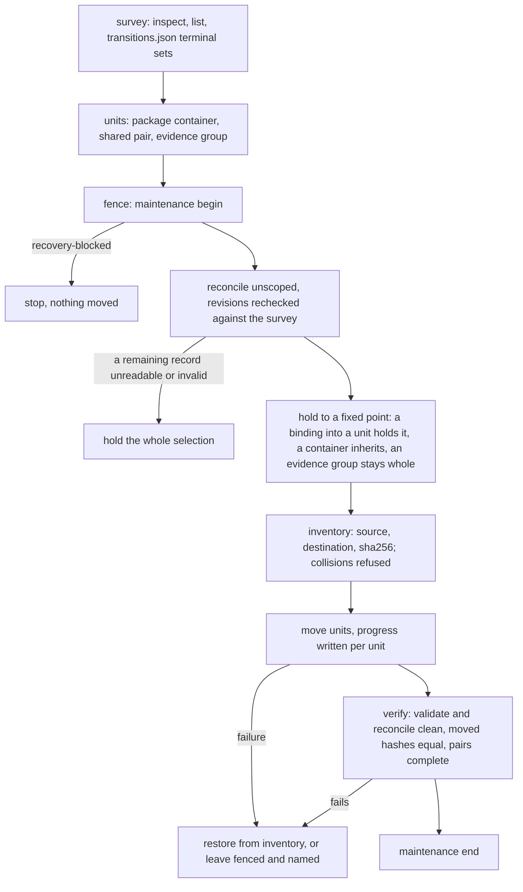
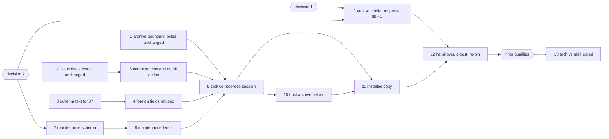

# Implementation Plan: the archive revision. `archive/` leaves JSON control, foreign transition fields are refused, and JSON archival follows its qualification

**Date:** 2026-10-01
**Status:** Draft
**Spec:** none as a requirements-designer spec. Prior's `concept/fusion-json-workbench-spec.md` at Prior `b912302`: the paragraph "Anfrage 36 präzisiert die nächste Codec-Revision" in section 3 and the paragraph on requests 37 and 38 in section 6. The ruling is `Prior: docs/design/fusion-fj03c-prior-response.md` (`b912302`): `## 36` (option 2, its own revision before archival), `## 37` (refusal, same revision), `## 38` (later revision of its own).
**Cross-references:** 260928-1338-json-control-data-and-markdown-artefacts.md, 260930-1654_*_plan-initialize-the-codec-creates-a-new-workbench-and-list-names-its-state.md (method), 260930-2305_*_plan-fj03c-the-write-client-setup-and-the-skills-on-json.md (step 8 moved out), 261001-0638_*_json-pairs-cannot-be-archived-until-request-36-is-answered-and-the-archive-safety-filter-reserves-no-json-surface.md, 261001-0841_*_inspect-throws-and-exits-1-when-json-state-or-its-journal-is-not-a-directory.md, 261001-0841_*_isregularfile-reads-every-stat-error-on-workbench-json-as-manifest-not-a-file.md, 261001-0841_*_three-texts-in-the-range-state-what-the-code-or-test-no-longer-does.md, 260930-2305_*_how-is-a-json-controlled-pair-archived-when-its-control-record-names-its-narrative-by-workbench-path.md, 260930-2305_*_does-transition-refuse-a-payload-field-the-records-kind-has-no-rule-about.md, 261001-1030_*_how-does-the-archive-host-learn-every-binding-the-remaining-records-make.md, 261001-1030_*_how-does-the-host-hold-maintenance-exclusivity-over-codec-writers-while-it-moves-pairs.md
**Planned against:** fusion `01304fc8` (`git diff --stat 63faa26f 01304fc8 -- codec` names `REQUESTS.md` alone); bundle 534 131 bytes, `sha256:bde8f3c952bd111695dbac510d3c0802566080e07c2ba3b6396d9c2c807844d1`, Prior's standing pin; Prior `b912302` (2026-10-01 06:38), `git log --all --oneline b912302..` empty. Growth room at planning, as dispatched: hook tests 0 lines (`TEST_LINE_HEAD_ROOM` 4 191), skills 18 783 bytes. Each step re-reads both from `surface-growth-bound.test.ts`.
**Decidability:** Can the codec decide archival safety, that is, whether no record left under JSON control (live or terminal) binds an archived target, report paths and backup references included, from inputs it has? **At the pinned revision: no.** Prior `b912302` and the code at `01304fc8` agree on why. `referenceSites` (`codec/src/cli/ops.ts`) gives an evidence record only `/predecessor`, so a healthy report contributes no row, and `provenance.backup` has no site at all. **After this revision: yes for control-record bindings, decided by the host from one codec answer.** The binding positions are a finite set fixed by the closed schemas. Step 6 makes `reconcile`'s `references` enumerate all of them and pins the enumeration to a set derived from the schemas, so completeness is itself a test. The host then computes the hold set to a fixed point over that one answer (step 10). It does not decide by asking the codec a new question, because Prior rules the move a host action. The residue is split, not approximated. A remaining control file that does not read or validate has bindings nobody can know, so the whole selection is held, as Prior rules. A reference that is unresolved, ambiguous or foreign carries no target. The host reads the value at the entry's own pointer from `show` of the source record, which follows a pointer the codec reported and re-derives nothing, and holds every candidate with that id or path. A legacy citation string, a git commit or a named external target binds no local file. **Prose citations are no hold source.** A storeless basename resolves over the whole index, `archive/` included (`260828-0904_*_is-an-archived-record-a-citation-target.md`, implemented `f1099c5f`), and Prior keeps those citations supported. **Time of check against time of move is not decidable from any answer**, since another writer can land between them. The mechanism changes to a persistent fence every writer passes (step 8), and the host rechecks revisions after it takes the fence. Two choices in this paragraph are not settled by the repo or Prior's texts, so they are filed and open: the route to completeness (`261001-1030_*_how-does-the-archive-host-learn-every-binding-the-remaining-records-make.md`, recommended: the additive `reconcile` delta) and the fence (`261001-1030_*_how-does-the-host-hold-maintenance-exclusivity-over-codec-writers-while-it-moves-pairs.md`, recommended: a codec `maintenance` operation).

## Directive

One codec revision, qualified by one Prior re-pin, carries five changes. (1) Request 36: the workbench-root `archive/` is outside the current record store for every operation, with an enumeration complete enough to decide what must stay. (2) Request 37: `transition` refuses a payload field foreign to the target's kind. (3) A maintenance fence for the host's move. (4) The codec halves of three open issues: `inspect` over a non-directory `.json-state` or journal, `isRegularFile`'s blanket catch, and the stale test name and doubled detail. (5) The host's archive helper, built against the revision but reached by no skill. After Prior qualifies the digest, a last, gated step lifts FJ03c step 7's hold in `/fusion:archive` and reserves `workbench.json` and `.json-state/` in safety filter 1.

**Request 38 is not in this revision.** Prior rules the administrative takeover a later revision of its own: explicit host authorisation, the named previous holder, the inspected revision, user provenance, and a persistent `provenance.claim_transfers` history. Until that revision is qualified there is no Claude-side takeover route. `release` and `transition` keep the foreign-owner refusal and gain no override flag. FJ03d's prose says so; this plan writes no file under `agents/`, `rules/` or `docs/`.

## Current State

- **The walk.** `controlFiles` (`codec/src/store.ts`) walks every non-dot entry below the root and does not follow symlinks. It feeds `list`, unscoped `validate`, `reconcile`, `reconcile`'s body-local index, the kernel's `resolveRecordId` (`kernel.ts`) and `resolvePackage` (`ops.ts`). A pair moved into `archive/` stays listed and reports `narrative-missing`. `resolveInside` is lexical: an in-workbench symlink into `archive/` reaches an archived file. No path check names `archive`.
- **The enumeration.** `reconcile` answers `intents`, `records`, `references`, `evidence`, `dependencies` and `narratives`. `referenceSites` covers origins, mode sources, active documents, dependencies, references, package evidence and outcome evidence, and the per-kind control references. It has no `/report` row for evidence and no `/provenance/backup` row for any kind.
- **Transition payloads.** `protocol.schema.json`'s `transition` payload says "Only the fields the target state has a rule about are read". FJ02b refuses `steps` and `criteria` on a non-plan record and drops every other foreign field. The Claude client never sends one (`PAYLOAD_FIELDS` in `hooks/lib/record-write.ts`, pinned to the schemas, FJ03c step 3).
- **The three issues, re-read at `01304fc8`.** `pendingIds` and `sweep` (`codec/src/journal.ts`) catch only `ENOENT`. `isRegularFile` (`store.ts`) catches everything. The test "precedence on initialize: replay and blocked recovery…" (`ops.test.ts`) builds no blocked intent. `pendingInitialize`'s `unreadable(name, r.error.detail)` names the directory twice in `protocol-session-initialize/26-inspect.response.json`. Point 1 of the three-texts issue is fixed on the hook side. The issue's fourth text, the statement in `REQUESTS.md` `### Stated for objection: the Claude side binds a caller by its checkout identity alone`, is narrower than the client since `01304fc8` and is restated in step 12.
- **The archive skill** (`4e91c96d`) holds every pair and container on `json-control`. Safety filter 1 names neither `workbench.json` nor `.json-state/`.

## Approach

**One predicate for the boundary.** `store.ts` gains `archived(wb, rel)`: true when the lexically normalised path's first segment is `archive`, or when the real path of its deepest existing ancestor lies under the real root's `archive/`. `controlFiles` skips the root `archive/` directory. Every entry that takes a record path or a scope goes through the predicate once, in one function beside `resolveInside`, so no operation carries its own copy:

| Input | Answer when `archived` |
|---|---|
| a record path (`show`, `validate`, any mutation's `record`, `adopt-plan`'s plan, `attach-evidence`'s evidence) | `unresolved-reference/record-not-found`, in the operation's existing envelope |
| a `list` or `reconcile` scope | `unknown-scope/archived-path` (the archive-specific reason Prior asks for) |
| a `create` scope, narrative path or evidence report path | `unknown-scope/archived-path`, before the intent |
| an id | not found: both resolvers walk through `controlFiles`, so they agree, and an id present only in `archive/` is `record-not-found`, never `ambiguous` |
| a hash-bound artefact (`resolveArtefact`: a backup, a migration receipt) | unchanged: historical reads stay supported |

Traversal and outside-workbench refusals stay as they are and are checked first. A replay of a completed pre-archive operation answers its stored bytes and writes nothing, which the kernel already guarantees and step 9 records.

**Completeness by schema (decision 1, option 1 recommended).** `referenceSites` gains `/report` for evidence and `/provenance/backup` for every kind that carries one, each resolved by the existing artefact branch of `referenceEntry`. A codec test derives every schema position that reaches `record_ref`, `artefact_ref`, `reference`, `evidence_ref` or `narrative`, with `extensions` and `legacy_fields` opaque, and holds the site set equal to it, the record's own narrative excepted. No other array changes.

**The fence (decision 2, option 1 recommended).** `maintenance {action: begin | end}` goes through `mutate`'s replay and lock. `begin` recovers what it can and refuses `operation-unknown/recovery-blocked` while any intent is pending; otherwise it writes `.json-state/maintenance.json` (`{operation_id, since}`). While the file stands, every other mutation is refused `conflict/maintenance-active` under the lock and before its intent. `end` removes it only for the operation id that set it. `inspect` names it additively as `maintenance: null | {operation_id, since}`. Reads are unaffected. The fence writes no record, so the client composes no `record_change` row.

**Request 37.** `transition` refuses any present key outside the target kind's row of Prior's table, `null` included, with `schema-invalid/payload-field-not-admitted`, before any read of the record's rules. The table is derived from the same schema positions the Claude client's test reads, so the two hosts' tables are one set. **What changes on our side: no behaviour.** `PAYLOAD_FIELDS` stays as an early usage check (exit 2, nothing sent), which now matches what the codec enforces. A hand-built request that bypasses the client is refused (exit 6, `schema-invalid`) where it was dropped before. One comment sentence in `record-write.ts` that says "reads" now says "admits" (step 10).

**The host's archive helper** (`bin/fusion-archive` over `hooks/archive.ts` and `hooks/lib/record-archive.ts`, the FJ03a pattern, reached by explicit calls only) follows Prior's sequence. It is built and proven before the hand-over so that Prior sees the host behaviour it asked to have covered. No skill calls it before step 13.

**Compatibility evidence, kept apart** (the initialize plan's method). Steps 2, 4, 5 and 8 change no recorded byte, and every session (FJ01, FJ02 with its role delta, FJ02b, initialize) and the handback replay byte for byte. Step 6 moves bytes only through reviewed, versioned delta files beside the unedited recordings: a `reconcile` exchange that covers an evidence record, and `26-inspect`'s detail. Step 9 is a new recorded session.

**Standing rules for steps 2 to 11.** Each step is proven on a scratch clone with a scratch commit, with the git-ignored `hooks/package-lock.json` copied in, because `committed-bundle.test.ts` and `committed-dist.test.ts` judge HEAD. Every new test is shown red against a broken copy. A moved `reference-resolution-lint.test.ts` count is re-approved per file. Hook tests: replace first, then raise `TEST_LINE_HEAD_ROOM` by the measured remainder and log it in `README-hooks.md` `### Growth bounds on the shipped text` with the golden regenerated; no baseline moves. The hook suite may be red in the monitor wildcard-bind case alone. `hook-route-exclusion.test.ts` stays green; `bin/fusion-archive` joins `STUBBED` in place on its line. No file under `agents/`, `rules/`, `docs/`, `templates/` or `.claude-plugin/` changes, nor `install.sh`; `plugin.json` stays at 12.0.0.

## Implementation Steps

1. **The contract delta and requests 39 to 41, to the Prior side**
   - Executor: `analyst`
   - Files: `codec/fixtures/prior/REQUESTS.md`
   - Changes: the analyst drafts `## The archive revision (the contract delta)` in its scratchpad, and the orchestrator appends it and commits it. It is stamped with the fusion head, Prior `b912302` and the bundle digest above. It submits the changed sections only: the boundary table of `## Approach`, the reason `unknown-scope/archived-path`, and the symlink rule; request 37's refusal with Prior's table and the protocol description's new wording; the three issue fixes, with `26-inspect`'s detail announced as a reviewed delta; the recorded archive session's case list (step 9); and the statement that request 38 is not in this revision. It proposes, as the user rules the two decisions:
     - **39.** The maintenance fence: the operation's shape, `conflict/maintenance-active`, the `begin` refusal on pending intents, `inspect.maintenance`, and the duty on Prior's host to read `inspect.maintenance` before reopening work (decision 2).
     - **40.** The additive `reconcile` delta (`/report`, `/provenance/backup`) and its schema-derived completeness test, as the "explicitly recorded additive reconcile delta" `## 36` allows (decision 1).
     - **41.** `isRegularFile`: `ENOENT` stays not-a-file (the dangling link), and every other stat failure on `workbench.json` answers `unsupported` with the new diagnosis `schema-invalid/manifest-unreadable`, its errno in the detail, never a throw.

     Preferred form for each: an objection before the hand-over that freezes the digest, or none.
   - Dependencies: both decisions answered.
   - Acceptance: the commit changes `REQUESTS.md` alone, as a pure append; every figure is re-taken.

2. **The codec halves of the three issues, answer bytes unchanged**
   - Executor: `code-implementer`
   - Files: `codec/src/journal.ts`, `codec/src/cli/ops.ts`, `codec/src/store.ts`, their tests (`journal`, `ops`, `store`), `codec/dist/fusion-record.js`, `codec/README.md` (`## The CLI`)
   - Changes: `pendingInitialize` maps a journal that cannot be listed for any reason but `ENOENT` to `operation-unknown/pending-initialize-unreadable`, the path in the detail. `initialize` answers `conflict/target-not-empty`, naming the entry, before `sweep` when `.json-state/journal` or `.json-state/ops` exists and is not a directory. `isRegularFile` as request 41 states it. The precedence test is renamed to what it asserts, because the blocked case is pinned by "a blocked intent: every initialize is a typed refusal" and exchanges 23 and 25. The doubled detail is step 6's.
   - Tests: `inspect` over `.json-state` a file and over `journal` a file, each exit 0 with a typed answer; `initialize` over `journal` a file names `.json-state/journal`; a `workbench.json` behind a self-referencing link or a `chmod 000` parent is not `manifest-not-a-file`, and a dangling link still is. Each case is red against the bundle at `01304fc8`.
   - Dependencies: none.
   - Acceptance: `cd codec && CODEC_REQUIRE_GOLDENS=1 npm test` and `npm run typecheck` green at the scratch commit, `committed-bundle.test.ts` included. Every session and the handback replay byte for byte without regeneration. The `inspect` issue and the `isRegularFile` issue (both in `**Cross-references:**`) are closed with `Resolved:` lines; the three-texts issue gets an `Also seen:` line for point 2. The note records the bundle's size and digest.

3. **The protocol schema text for request 37**
   - Executor: `data-implementer`
   - Files: `codec/schemas/protocol.schema.json`
   - Changes: the `transition` payload's description replaces "Only the fields the target state has a rule about are read" with the refusal rule: a field outside the target kind's row is `payload-field-not-admitted`, a present `null` included; within the row, the target state's rules decide. The shape and the fixtures do not change, because the rule is per kind and the schema cannot express it.
   - Dependencies: none. Committed together with step 4, since the schema is inlined into the bundle.
   - Acceptance: `fixtures.test.ts` green. The expected red is `committed-bundle.test.ts`, which step 4 clears; any other red is a stop.

4. **`transition` refuses foreign payload fields**
   - Executor: `code-implementer`
   - Files: `codec/src/cli/ops.ts` (the `transition` plan), `codec/src/__tests__/ops.test.ts`, `codec/dist/fusion-record.js`, `codec/README.md`
   - Changes: the refusal of `## Approach`, checked after the record's kind is read and before any rule or write. One table, `TRANSITION_PAYLOAD_FIELDS`, derived from the schema positions and pinned by a test to Prior's table. FJ02b's `steps`/`criteria` refusal becomes the plan row of that table, not a second check.
   - Tests: per kind, one foreign field refused with the record's bytes unchanged and no intent written; a foreign `null` refused; each admitted field still lands; FJ02b's existing refusals and every replay unchanged. Red against a copy that drops instead.
   - Dependencies: step 3.
   - Acceptance: as step 2's, sessions byte for byte (Prior's audit found no recorded foreign field). The payload-field decision of FJ03c (in `**Cross-references:**`) gets its `Implemented:` line at step 12, once the digest is frozen.

5. **`archive/` leaves the current record store, answer bytes unchanged**
   - Executor: `code-implementer`
   - Files: `codec/src/store.ts` (`archived`, `controlFiles`, the path gate), `codec/src/cli/ops.ts` (every entry of the boundary table), `codec/src/kernel.ts` only if `resolveRecordId` needs no change beyond the walk, their tests, `codec/dist/fusion-record.js`, `codec/README.md` (`## The CLI`, `## What \`reconcile\` reports`)
   - Changes: the boundary as `## Approach` tabulates it, through the one predicate.
   - Tests: a terminal issue pair and a whole package moved by hand into `archive/<stamp>/`. Unscoped `list`, `validate` and `reconcile` no longer name them, and `validate` is `valid: true`. A by-id reference from a remaining terminal record is `record-not-found`. `show` and `validate` of the archived path are `record-not-found`. `list` and `reconcile` scoped to `archive/` or below are `archived-path`. `create` into it is `archived-path`. `transition` on an archived path is `record-not-found`. A symlink `shared/old -> ../archive/x` is refused like the path it aliases. A duplicate id in `archive/` leaves the current id unambiguous. `resolveArtefact` of a backup under `archive/` still resolves. A nested directory named `archive` below `shared/` stays in the store. Red against copies with the walk unfiltered, with the symlink check removed, and with one resolver unfiltered.
   - Dependencies: none.
   - Acceptance: as step 2's, every session byte for byte (no recorded workbench holds an `archive/`, confirmed by the step's own `grep`).

6. **Complete binding enumeration and the doubled detail, as reviewed deltas**
   - Executor: `code-implementer`
   - Files: `codec/src/cli/ops.ts` (`referenceSites`, `pendingInitialize`'s detail), `codec/src/__tests__/ops.test.ts`, the session gates whose exchanges move, one `<nn>-<op>.<topic>-delta.json` per moved exchange beside its unedited recording, `codec/fixtures/protocol-session-initialize/26-inspect.detail-delta.json`, the session READMEs, `codec/dist/fusion-record.js`, `codec/README.md`
   - Changes: the two new sites (decision 1). `unreadable(name, …)` passes the reason without `readIntent`'s directory prefix. Each delta names its replaced or added fields by pointer, and its gate asserts the new answer equals the recording with exactly that delta applied, the same mechanism as `15-reconcile.role-delta.json`. The step lists which exchanges moved, measured, and states it if none did.
   - Tests: the schema-derived site test, red against `referenceSites` at `01304fc8` (two sites missing) and against a copy missing either new site; an evidence record with a healthy report and a record with a backup each give one resolved row; a changed report gives `unresolved`. Each delta gate is red against an answer with one field more or one less.
   - Dependencies: step 2.
   - Acceptance: codec suite and typecheck green; `git diff` shows every recorded response unedited; the three-texts issue closed with a `Resolved:` line once step 2's rename and this detail have both landed.

7. **The protocol schema and fixtures for the fence** (if decision 2 is ruled option 1; else dropped)
   - Executor: `data-implementer`
   - Files: `codec/schemas/protocol.schema.json`, `codec/fixtures/valid/protocol/maintenance-begin.json`, `maintenance-end.json`, `codec/fixtures/invalid/protocol/maintenance-without-action.json`, `maintenance-action-unknown.json`, `maintenance-without-operation-id.json`, `codec/fixtures/manifest.json`
   - Changes: `maintenance` in the `op` enum with a `oneOf` branch (`additionalProperties: false`; `op`, `workbench`, `operation_id`, `action`), one sentence in `description`. Each invalid fixture differs from a valid one in one field.
   - Dependencies: decision 2 answered. Committed together with step 8.
   - Acceptance: `fixtures.test.ts` green. The expected reds are `protocol.test.ts` (the operation count) and `committed-bundle.test.ts`, which step 8 clears.

8. **The maintenance fence**
   - Executor: `code-implementer`
   - Files: `codec/src/cli/protocol.ts`, `codec/src/kernel.ts` (the fence check in `mutate`), `codec/src/cli/ops.ts`, `codec/src/store.ts` (the fence file constant beside the lock protocol's, and the initialize exemption list, which does not grow), their tests, `codec/dist/fusion-record.js`, `codec/README.md`, `bin/fusion-record` (header), `README-hooks.md` (its roster row)
   - Changes: `## Approach`'s fence. Sixteen operations, `protocol.test.ts` pinning them.
   - Tests: begin over a pending blocked intent is refused and writes no fence; begin, then every mutation kind refused `maintenance-active` with no intent written, reads answering; replay of begin returns the stored answer; `end` by another operation id refused; `end`, then mutations land; `inspect.maintenance` null and set; a fence left by a killed process still refuses after a restart. Red against a copy that checks the fence after the intent, and one that lets `end` take any id.
   - Dependencies: step 7.
   - Acceptance: as step 2's; every earlier session byte for byte, except the deltas of step 6.

9. **The recorded archive session**
   - Executor: `code-implementer`
   - Files: `codec/fixtures/protocol-session-archive/` (pairs, `base/`, seeds, README), `codec/src/__tests__/round-trip-cli-archive.test.ts`, `codec/src/__tests__/fixtures.test.ts` (exemption), `codec/README.md` (`## Layout`, `## What ships`)
   - Changes: Prior's case list, as codec exchanges over states the recorder builds by host moves between exchanges. The cases are a terminal issue pair, a whole package, an evidence and report group, an incoming reference from a terminal record, a transitive chain (A references B references C, `reconcile` showing every edge that drives the hold), scoped and direct-path exclusion, a symlink alias, an archive-only duplicate id, a failed move (control moved and narrative not: the fence still standing in `inspect`, `validate` naming the half pair), `begin` over a pending intent refused, then settled and the fence taken, historical replay of a pre-archive `create` answering its stored bytes without recreating the files, request 37's refusals, and `inspect` over `journal` a file. Fixed literals, regeneration only under `UPDATE_PROTOCOL_SESSION_ARCHIVE=1`, the initialize session's digest-placeholder rule wherever a seed carries a request digest.
   - Dependencies: steps 4, 5, 6 and 8.
   - Acceptance: the gate green without regeneration, every other session unchanged, and a shell replay through `bin/fusion-record` over a root path with a space and a comma answering every exchange byte for byte, recorded in the note.

10. **The host archive helper, reached by no skill**
    - Executor: `code-implementer`
    - Files: `bin/fusion-archive`, `hooks/archive.ts`, `hooks/lib/record-archive.ts`, `hooks/lib/__tests__/record-archive.test.ts`, `hooks/lib/record-write.ts` (the one comment sentence on payload fields), `hooks/dist/`, `.gitignore` (`!bin/fusion-archive`), `hooks/lib/__tests__/hook-route-exclusion.test.ts` (`STUBBED`, in place), `README-hooks.md` (roster and lib rows), the growth-bound files
    - Changes: the flowchart in `## Approach`. `survey --candidates <file>` prints, per unit, `candidate=` or `held=` with the binding that holds it (source path, pointer, target). `move --survey <file>` runs the fence, recheck, fixed point, inventory, moves and verification. `resume --inventory <file>` finishes or restores a run a crash left fenced. Units: a package container, eligible only when every record in it is terminal by `codec/contract/transitions.json` and nothing below it is held; a shared pair; an evidence group, meaning a report with every evidence record naming it, moved whole or not at all. The resolution of `reconcile` entries is the split in **Decidability**. Selection reads state from `list`, never from Markdown. The inventory lives at `archive/<stamp>-<slug>/.inventory.json`, outside the store by step 5. Exit codes are distinct and named in the wrapper's header: moved, nothing eligible, usage, install incomplete, workbench not read, fence refused, verification failed with the store left fenced.
    - Tests (real bundle): each of Prior's cases at the host level; a fixed point that needs two rounds; a container inheriting a descendant's hold; an unreadable remaining record holding everything; an ambiguous id holding its candidates; a collision refusing that unit; a crash after the first unit, then `resume` finishing; a crash with a hash changed, then `resume` restoring and ending the fence; a write between survey and fence caught by the recheck. Red against copies without the fixed point, without the container inheritance, and with verification skipped.
    - Dependencies: step 9.
    - Acceptance: the hook suite as the standing rules say; codec suite green; the raise logged; the bundle digest unchanged by this step.

11. **The installed copy archives a JSON workbench**
    - Executor: `code-implementer`
    - Files: `codec/src/__tests__/install.test.ts`
    - Changes: a sixth case on the existing install. Setup's shipped Step 0 initialises, and `bin/fusion-write` files a terminal issue, a terminal package with a review and its evidence, and a live package referencing the terminal issue. `bin/fusion-archive survey` then holds the referenced issue and offers the package. `move` archives it. `validate` and `reconcile` are clean, `inspect.maintenance` is null, a transition with a foreign field through raw `bin/fusion-record` is refused, and `bin/fusion-claimed-package`, `bin/fusion-work-order`, `bin/fusion-citation-check` and `bin/fusion-citation-sweep --dry-run` exit 0 with stdout that names no archived path.
    - Dependencies: steps 9 and 10.
    - Acceptance: `cd codec && CODEC_REQUIRE_GOLDENS=1 npm test` and `npm run typecheck` green, the case run and not skipped.

12. **The hand-over: what landed, the frozen digest, the re-pin**
    - Executor: `analyst`
    - Files: `codec/fixtures/prior/REQUESTS.md`, this plan
    - Changes: `## The archive revision (the hand-over)`, drafted in the scratchpad and appended by the orchestrator. It is written against the last commit that moved `codec/`, `bin/` or `hooks/`, with the bundle's size and digest there. Its parts are what landed, each delta file with its exchange, Prior's case list mapped to exchanges of step 9 and cases of steps 10 and 11, requests 39 to 41 as answered, request 38 stated as not in this revision, the restated checkout-binding statement (every request that writes a claim, `claim` and a `transition` into `claimed` or carrying a claim, is bound to this checkout, besides the holder check), and two requests under the next free numbers: a re-snapshot of the shared fixtures with the new manifest counts, and a re-pin with the replay of FJ01, the handback, FJ02 and the initialize session through their deltas, FJ02b and the archive session, plus Prior's conformance run. **The re-pin qualifies the digest, and step 13 depends on it.**
    - Dependencies: steps 1 and 11.
    - Acceptance: every figure re-taken in a scratch clone; the commit names `REQUESTS.md` and this plan alone.

13. **GATED: `/fusion:archive` archives JSON pairs** (starts only after Prior reports the re-pin of step 12's digest green)
    - Executor: `code-implementer`
    - Files: `skills/archive/SKILL.md`, `codec/src/__tests__/install.test.ts`
    - Changes: on `json-control`, `## On a JSON-controlled workbench` replaces the hold block. Step 3's Markdown status walk is not run there. `bin/fusion-archive survey` gives the candidates and holds, Step 5 reports every held unit with its binding, and Step 7 runs `bin/fusion-archive move` in place of `mv` for record units. Non-record targets (forum entries, aged reports without evidence, history, the guard log) keep the current path. Exit codes map to reports, and a fenced store left behind names `resume`. Safety filter 1 gains `$WORKBENCH/workbench.json` and `$WORKBENCH/.json-state/`, on both formats. The FJ03c step 9 install case gains the shipped archive blocks, extracted and run verbatim.
    - Dependencies: step 12 and Prior's qualification.
    - Acceptance: issue `261001-0638`'s four criteria. One run over its fixture moves the terminal pair and the terminal container, holds the referenced record and the package an evidence record binds, each named with the binding, and leaves `validate` `valid: true`. An interrupted move leaves both files at their source or resumes. A natural-language run naming either reserved surface refuses it. The skills bound is green or its raise logged, and the room left is reported. The issue is closed with a `Resolved:` line.

## Where this work stops

- `cd codec && CODEC_REQUIRE_GOLDENS=1 npm test` and `npm run typecheck` are green at the closing commit, and `committed-bundle.test.ts` was green at every commit that moved code.
- Every row of the boundary table has a test shown red against a broken copy.
- Every recorded response file at `01304fc8` is unedited, and the delta files of step 6 are the only differences any gate admits.
- The schema-derived site test holds `referenceSites` complete, or decision 1 was ruled otherwise and the plan amended.
- A transition carrying a foreign field is refused, a present `null` included, with the record unchanged.
- The fence is implemented, or decision 2 was ruled otherwise and steps 7 and 8 were replaced by the ruled mechanism.
- Issues `261001-0841` (the `inspect` crash, `isRegularFile`, the three texts) are closed.
- `protocol-session-archive/` replays green without regeneration, and from a shell.
- `bin/fusion-archive` passes every case of step 10 and is reached by no skill before step 13.
- `REQUESTS.md` carries the sections of steps 1 and 12, the second stamped with the frozen digest.
- Precondition for step 13, not claimed by steps 1 to 12: Prior has re-pinned that digest and reported conformance green. Until then FJ03c step 7's hold stays in force (Prior `b912302`: "Die bisherige Archivierungssperre für JSON-Paare gilt bis zur Qualifikation der neuen Revision").
- Step 13 landed and issue `261001-0638` is closed, or the user moved step 13 out with the issue left open.
- Request 38 is untouched by this plan, and no Claude-side takeover route exists.
- No file under `agents/`, `rules/`, `docs/`, `templates/` or `.claude-plugin/` changed, nor `install.sh`; `plugin.json` stays at 12.0.0.

## Data Structures

- `inspect`: plus `maintenance: null | {operation_id, since}`.
- `MaintenanceRequest` `{op, workbench, operation_id, action}`; its answer `{operation_id, action, since}` and no `revisions`.
- Reference entries: unchanged shape. New `at` values are `/report` and `/provenance/backup`.
- `.json-state/maintenance.json` `{operation_id, since}`; `archive/<stamp>-<slug>/.inventory.json` with `units[]` of `{kind, source, destination, files: [{path, sha256}], state: planned | moved | restored}`.

## API Changes

Sixteen operations (`maintenance`, under decision 2). New reasons: `unknown-scope/archived-path`, `conflict/maintenance-active`, `schema-invalid/manifest-unreadable`. `payload-field-not-admitted` now applies to every foreign kind. `record-not-found` covers archived paths and ids. Every request valid at `01304fc8` is answered as before, except over an archived path, with a foreign transition field, during a fence, and in the two delta-reviewed answers. The digest moves at each code commit, and the hand-over names the last.

## Testing Strategy

Deterministic codec tests per boundary row, per payload kind, per fence state and per issue case (steps 2 to 8). Byte identity is proven before any byte moves, and every move goes through a delta file (steps 2, 4, 5, then 6). The recorded session carries Prior's case list across hosts (step 9). The host helper is tested over the real bundle (step 10), and the installed copy runs the whole path (step 11, and the skill blocks in step 13).

## Risks & Mitigations

| Risk | Mitigation |
|---|---|
| A decision is ruled against its recommendation | Step 1 waits. Decision 1, option 2, drops step 6's sites and puts a per-record `show` map into step 10. Decision 2, option 3, drops steps 7 and 8, and Prior's "insufficient" is reported in step 12 |
| Prior objects to requests 39 to 41 | Nothing is frozen before step 12; a correction is additive and a new digest |
| The symlink check misreads a legitimate in-workbench link | The real-path test only refuses targets under the real `archive/`; the case is pinned both ways |
| A fence is left by a crash | `inspect.maintenance` names it, `resume` finishes or restores, and `end` takes only the setter's id |
| The hold set grows to everything on a large store | Correct by Prior's rule; `survey` names each binding, so the user sees why |
| The hook-test room is 0 (step 10) | Replace first, raise the remainder, log it |
| Prior's qualification takes long | Steps 1 to 12 close without it; step 13 waits and the hold stays |

## Open Questions

- [ ] Decision 1, `261001-1030_*_how-does-the-archive-host-learn-every-binding-the-remaining-records-make.md`; recommended option 1. Steps 1 and 6 wait.
- [ ] Decision 2, `261001-1030_*_how-does-the-host-hold-maintenance-exclusivity-over-codec-writers-while-it-moves-pairs.md`; recommended option 1. Steps 1, 7 and 8 wait.
- [ ] Request 41's diagnosis name `manifest-unreadable`, against rethrowing as `entryExists` does. Recommended: typed. A throw is the defect class of the `inspect` issue this step closes. This is plan-local, so it is stated here and in step 1 and filed as no record.
