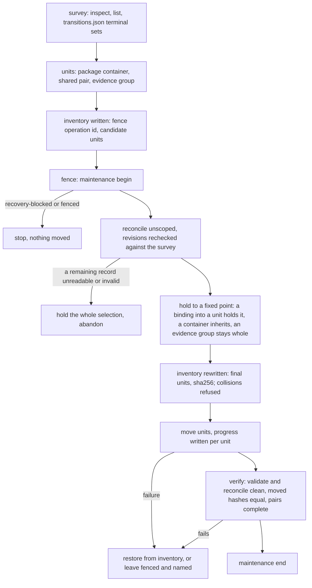
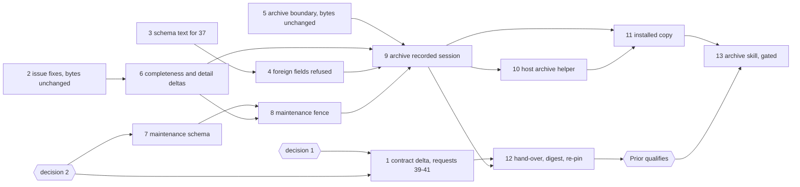

# Implementation Plan: the archive revision. `archive/` leaves JSON control, foreign transition fields are refused, and JSON archival follows its qualification

**Date:** 2026-10-01
**Status:** Approved 2026-10-01 by the user with both recommendations (decisions 1 and 2, option 1); the data steps 3 and 7 approved in advance. In progress.
**Spec:** none as a requirements-designer spec. Prior's `concept/fusion-json-workbench-spec.md` at Prior `b912302`: the paragraph "Anfrage 36 präzisiert die nächste Codec-Revision" in section 3 and the paragraph on requests 37 and 38 in section 6. The ruling is `Prior: docs/design/fusion-fj03c-prior-response.md` (`b912302`): `## 36` (option 2, its own revision before archival), `## 37` (refusal, same revision), `## 38` (later revision of its own).
**Cross-references:** 260928-1338-json-control-data-and-markdown-artefacts.md, 260930-1654_*_plan-initialize-the-codec-creates-a-new-workbench-and-list-names-its-state.md (method), 260930-2305_*_plan-fj03c-the-write-client-setup-and-the-skills-on-json.md (step 8 moved out), 261001-0638_*_json-pairs-cannot-be-archived-until-request-36-is-answered-and-the-archive-safety-filter-reserves-no-json-surface.md, 261001-0841_*_inspect-throws-and-exits-1-when-json-state-or-its-journal-is-not-a-directory.md, 261001-0841_*_isregularfile-reads-every-stat-error-on-workbench-json-as-manifest-not-a-file.md, 261001-0841_*_three-texts-in-the-range-state-what-the-code-or-test-no-longer-does.md, 260930-2305_*_how-is-a-json-controlled-pair-archived-when-its-control-record-names-its-narrative-by-workbench-path.md, 260930-2305_*_does-transition-refuse-a-payload-field-the-records-kind-has-no-rule-about.md, 261001-1030_*_how-does-the-archive-host-learn-every-binding-the-remaining-records-make.md, 261001-1030_*_how-does-the-host-hold-maintenance-exclusivity-over-codec-writers-while-it-moves-pairs.md
**Planned against:** fusion `01304fc8` (`git diff --stat 63faa26f 01304fc8 -- codec` names `REQUESTS.md` alone); bundle 534 131 bytes, `sha256:bde8f3c952bd111695dbac510d3c0802566080e07c2ba3b6396d9c2c807844d1`, Prior's standing pin; Prior `b912302` (2026-10-01 06:38), `git log --all --oneline b912302..` empty. Growth room at planning, as dispatched: hook tests 0 lines (`TEST_LINE_HEAD_ROOM` 4 191), skills 18 783 bytes. Each step re-reads both from `surface-growth-bound.test.ts`.
**Decidability:** Can the codec decide archival safety, that is, whether no record left under JSON control (live or terminal) binds an archived target, report paths and backup references included, from inputs it has? **At the pinned revision: no.** `referenceSites` has no row for a healthy evidence report and none for `provenance.backup` (Prior `b912302`, confirmed at `01304fc8`). **After this revision: yes for control-record bindings, decided by the host from one codec answer.** The binding positions are a finite set fixed by the closed schemas. Step 6 makes `reconcile`'s `references` enumerate all of them and pins the enumeration to a set derived from the schemas, so completeness is itself a test. The host then computes the hold set to a fixed point over that one answer (step 10). The residue is split, not approximated. A remaining control file that does not read or validate has bindings nobody can know, so the whole selection is held, as Prior rules. A reference that is unresolved, ambiguous or foreign carries no target. The host reads the value at the entry's own pointer from `show` of the source record, which follows a pointer the codec reported and re-derives nothing, and holds every candidate with that id or path. A legacy citation string, a git commit or a named external target binds no local file. **Prose citations: a stated departure, not an implied one.** Prior lists prose citations among the bindings that must not break (`## 36`). This plan holds nothing for prose. A storeless basename still resolves after the move, because the lookup covers `archive/` (`260828-0904_*_is-an-archived-record-a-citation-target.md`, implemented `f1099c5f`). A full-path citation in prose is not protected and breaks. Request 40 says so. **Time of check against time of move is not decidable from any answer**, since another writer can land between them. The mechanism changes to a persistent fence every writer passes (step 8), and the host rechecks revisions after it takes the fence. **The fence is local to one checkout**, because `.json-state/` never travels (`JSON_LIVE_STATE` in `hooks/lib/staging-drift.ts`). Another checkout that has not pulled the move can still add a reference to an archived record. A `reconcile` after the pull is the only place that catches it, and no mechanism closes the gap. Request 39 says so.

## Directive

One codec revision, qualified by one Prior re-pin, carries five changes. (1) Request 36: the workbench-root `archive/` is outside the current record store for every operation, with an enumeration complete enough to decide what must stay. (2) Request 37: `transition` refuses a payload field foreign to the target's kind. (3) A maintenance fence for the host's move. (4) The codec halves of three open issues: `inspect` over a non-directory `.json-state` or journal, `isRegularFile`'s blanket catch, and the stale test name and doubled detail. (5) The host's archive helper, built against the revision but reached by no skill. After Prior qualifies the digest, a last, gated step lifts FJ03c step 7's hold in `/fusion:archive` and reserves `workbench.json` and `.json-state/` in safety filter 1.

**Request 38 is not in this revision.** Prior rules the administrative takeover a later revision of its own, with host authorisation and a persistent transfer history (`## 38`). Until that revision is qualified there is no Claude-side takeover route. `release` and `transition` keep the foreign-owner refusal and gain no override flag. FJ03d's prose says so; this plan writes no file under `agents/`, `rules/` or `docs/`.

## Current State

- **The walk.** `controlFiles` (`codec/src/store.ts`) walks every non-dot entry, follows no symlink, and feeds `list`, `validate`, `reconcile` and its index, `resolveRecordId` (`kernel.ts`) and `resolvePackage` (`ops.ts`). A pair moved into `archive/` stays listed and reports `narrative-missing`. `resolveInside` is lexical, so a symlink into `archive/` reaches an archived file.
- **The enumeration.** `referenceSites` has no `/report` row for evidence and no `/provenance/backup` row for any kind.
- **Transition payloads.** The codec refuses `steps` and `criteria` on a non-plan record and drops every other foreign field. The Claude client never sends one (`PAYLOAD_FIELDS`, FJ03c step 3).
- **The three issues, re-read at `01304fc8`,** stand as filed. Point 1 of the three-texts issue is fixed on the hook side. Its fourth text, `REQUESTS.md`'s checkout-binding statement, is narrower than the client since `01304fc8` and is restated in step 12.
- **The archive skill** (`4e91c96d`) holds every pair and container on `json-control`. Safety filter 1 names neither `workbench.json` nor `.json-state/`.

## Approach

**One predicate for the boundary.** `store.ts` gains `archived(wb, rel)`: true when the lexically normalised path's first segment is `archive`, or when the real path of its deepest existing ancestor lies under the real root's `archive/`. `controlFiles` skips the root `archive/` directory. Every entry that takes a record path or a scope goes through the predicate once, in one function beside `resolveInside`, so no operation carries its own copy:

| Input | Answer when `archived` |
|---|---|
| a record path (`show`, `validate`, any mutation's `record`, `adopt-plan`'s plan, `attach-evidence`'s evidence) | `unresolved-reference/record-not-found`, in the operation's existing envelope |
| a `list` or `reconcile` scope | `unknown-scope/archived-path` (the archive-specific reason Prior asks for) |
| a `create` scope, narrative path or evidence report path | `unknown-scope/archived-path`, before the intent |
| an id | not found: both resolvers walk through `controlFiles`, so they agree, and an id present only in `archive/` is `record-not-found`, never `ambiguous` |
| a hash-bound artefact (`resolveArtefact`: a backup, a migration receipt) | unchanged: historical reads stay supported |

Traversal and outside-workbench refusals stay as they are and are checked first. A replay of a completed pre-archive operation answers its stored bytes and writes nothing, which the kernel already guarantees and step 9 records.

**Completeness by schema (decision 1, option 1 recommended).** `referenceSites` gains `/report` for evidence and `/provenance/backup` for every kind that carries one, each resolved by the existing artefact branch of `referenceEntry`. A codec test derives every schema position that reaches `record_ref`, `artefact_ref`, `reference`, `evidence_ref` or `narrative`, with `extensions` and `legacy_fields` opaque, and holds the site set equal to it, the record's own narrative excepted. No other array changes.

**The fence (decision 2, option 1 recommended).** `maintenance {action: begin | end}` runs through `mutate`. The order under the lock is fixed: sweep and recovery first, then the replay lookup, then the fence check, then the plan. A replay of an operation that completed before the fence therefore still answers its stored bytes, which Prior's historical replay requires, and writes nothing. Any request that is not a replay meets the fence. `begin` refuses `operation-unknown/recovery-blocked` while any intent is pending. Otherwise it writes `.json-state/maintenance.json` (`{operation_id, since}`). While that file stands, every other fresh mutation is refused `conflict/maintenance-active` before its intent. That includes a second `begin` under another operation id. `end` carries its own `operation_id`, because stored answers are keyed by it and a reused id is `operation-id-reused`. Its `fence` field names the `begin`, and the fence is removed only when `fence` matches. `maintenance` follows `reconcile` in `OPERATIONS`. `inspect` names the fence additively after `pending`, as `maintenance: null | {operation_id, since}`. Reads are unaffected. The fence writes no record, so the client composes no `record_change` row.

**Recovering a fence.** The helper writes its inventory before the fence goes up, naming the operation id it will use for `begin`. A crash anywhere after that leaves an inventory that `inspect.maintenance` can be matched against. `resume` finishes or restores the moves and then ends the fence. `abandon` ends a fence whose inventory records nothing moved. If the inventory is lost, the documented last resort is deleting `.json-state/maintenance.json` by hand after a `validate` and a `reconcile`. The helper header and `codec/README.md` name that step. `bin/fusion-write` maps `conflict/maintenance-active` to a message that names `bin/fusion-archive resume` and `abandon` (step 10).

**Request 37.** `transition` refuses any present key outside the target kind's row of Prior's table, `null` included, with `schema-invalid/payload-field-not-admitted`, before any read of the record's rules. The table is derived from the same schema positions the Claude client's test reads, so the two hosts' tables are one set. **What changes on our side: no behaviour.** `PAYLOAD_FIELDS` stays as an early usage check (exit 2, nothing sent), which now matches what the codec enforces. A hand-built request that bypasses the client is refused (exit 6, `schema-invalid`) where it was dropped before. One comment sentence in `record-write.ts` that says "reads" now says "admits" (step 10).

**The host's archive helper** (`bin/fusion-archive` over `hooks/archive.ts` and `hooks/lib/record-archive.ts`, the FJ03a pattern, reached by explicit calls only) follows Prior's sequence. It changes no digest, so it runs beside Prior's re-pin (steps 10 and 11). No skill calls it before step 13.

**Compatibility evidence, kept apart** (the initialize plan's method). Steps 2, 4, 5 and 8 change no recorded byte: every session and the handback replay byte for byte. Step 6 moves bytes only through reviewed delta files beside the unedited recordings.

**Standing rules for steps 2 to 11.** Each step is proven on a scratch clone with a scratch commit, with the git-ignored `hooks/package-lock.json` copied in, because `committed-bundle.test.ts` and `committed-dist.test.ts` judge HEAD. Every new test is shown red against a broken copy. A moved `reference-resolution-lint.test.ts` count is re-approved per file. Hook tests: replace first, then raise `TEST_LINE_HEAD_ROOM` by the measured remainder and log it in `README-hooks.md` `### Growth bounds on the shipped text` with the golden regenerated; no baseline moves. The hook suite may be red in the monitor wildcard-bind case alone. `hook-route-exclusion.test.ts` stays green; `bin/fusion-archive` joins `STUBBED` in place on its line. No file under `agents/`, `rules/`, `docs/`, `templates/` or `.claude-plugin/` changes, nor `install.sh`; `plugin.json` stays at 12.0.0.

## Implementation Steps

1. [DONE] **The contract delta and requests 39 to 41, to the Prior side**
Done (2026-10-01, analyst, step 1): `## The archive revision (the contract delta)` drafted as a pure append to `codec/fixtures/prior/REQUESTS.md`. The section starts at line 988 after one blank line; the file goes from 986 to 1145 lines. Its first 986 lines hash equal to the blob at `6cbfbc82` (`sha256:7e3d08cf…361d`). It is stamped against fusion `6cbfbc82` (2026-10-01 11:30) and Prior `b912302` (2026-10-01 06:38; `git log --all --oneline b912302..` is empty). The bundle in the blob at `6cbfbc82` is 534 131 bytes, `sha256:bde8f3c9…44d1`. `git diff --stat 01304fc8 6cbfbc82 -- codec bin hooks skills` is empty. Both Prior pins at `b912302` pin `bc3b04a8` (173 and 271 files); hashed against the blob at `6cbfbc82`, none is missing and only `REQUESTS.md` differs. The three new reasons and `"maintenance"` occur 0 times under codec `src`, `contract`, `schemas` and `fixtures`. No recorded workbench holds an `archive/` (0). The section carries requests 39 (the fence, a contract change, with the checkout-local limit), 40 (the notice on `/report` and `/provenance/backup`, with the departure on full-path prose citations) and 41 (`manifest-unreadable`), and states that request 38 is not in this revision.

Departures from the plan, for the orchestrator before the append:
- The fence moves recorded bytes the plan does not list. The nine successful `inspect` answers of the initialize session gain `result.maintenance`, and `operations.implemented` gains `maintenance`. Steps 6 and 8 assume that only step 6's deltas move bytes, so both need nine more delta files. The section announces them.
- The plan's `MaintenanceRequest` cannot end a fence. Under the plan's shape, `end` would have to reuse the `begin`'s `operation_id`, and the replay lookup would answer `conflict/operation-id-reused`. The draft gives `end` its own `operation_id` plus a `fence` field, with a `oneOf` per action. Step 7's schema and fixtures need that field and an invalid fixture without it.
- Two fence edge answers are unsettled: `end` when no fence stands, and a fence file that does not read. The draft puts both to Prior as (c) and (d), with fusion's leaning.
- Proposed placements the plan leaves open: `maintenance` in `OPERATIONS` after `reconcile` and before `migration`, and `inspect.maintenance` after `pending`.
- Request 41: the issue's suggested case, "a `chmod 000` directory holding `workbench.json`", fails `lstat` with `EACCES`, so it reaches `entryExists`'s rethrow and never `isRegularFile`. Measured on Node 25.7.0, a self-link gives `ELOOP` and a link into a `chmod 000` directory gives `EACCES`, while `lstat` succeeds on both. Step 2's test should use those two. The section states that `entryExists`'s rethrow stays unchanged.
- The move of the FJ02 reconcile exchange (one `/report` entry) is inferred from the code and the seed, not measured. Step 6 measures it.
- The restated checkout-binding statement is left to step 12, as the plan has it.
- One whole-tree `git status -sb` was run in the live tree before the no-whole-tree constraint was applied. It is read-only and wrote nothing.
   - Executor: `analyst`
   - Files: `codec/fixtures/prior/REQUESTS.md`
   - Changes: the analyst drafts `## The archive revision (the contract delta)` in its scratchpad, and the orchestrator appends it and commits it. It is stamped with the fusion head, Prior `b912302` and the bundle digest above. It submits the changed sections only: the boundary table of `## Approach`, the reason `unknown-scope/archived-path`, and the symlink rule; request 37's refusal with Prior's table and the protocol description's new wording; the three issue fixes, with `26-inspect`'s detail announced as a reviewed delta; the recorded archive session's case list (step 9); and the statement that request 38 is not in this revision. It proposes, as the user rules the two decisions:
     - **39, a contract change put for answer (decision 2).** The maintenance fence: the operation's shape, the order (replay before fence), `conflict/maintenance-active` (a second `begin` included), the `begin` refusal on pending intents, `inspect.maintenance`, and the duty on Prior's host to read `inspect.maintenance` before reopening work. It states the limit plainly. The fence is local to one checkout, because `.json-state/` never travels. Another checkout that has not pulled the move can add a reference to an archived record. A `reconcile` after the pull is the only catch, and no mechanism closes the gap.
     - **40, a notice and no permission request (decision 1).** `## 36` already allows "an explicitly recorded additive reconcile delta". The notice names the additive delta (`/report`, `/provenance/backup`), its schema-derived completeness test, and that recorded answers move through the delta files of step 6. It also states the departure on prose: no hold is computed for prose citations. Basename citations still resolve after the move, and full-path citations in prose are not protected.
     - **41.** `isRegularFile`: `ENOENT` stays not-a-file (the dangling link), and every other stat failure on `workbench.json` answers `unsupported` with the new diagnosis `schema-invalid/manifest-unreadable`, its errno in the detail, never a throw.

     Preferred form for 39 and 41: an objection before the hand-over that freezes the digest, or none.
   - Dependencies: both decisions answered.
   - Acceptance: the commit changes `REQUESTS.md` alone, as a pure append; every figure is re-taken.

2. [DONE] **The codec halves of the three issues, answer bytes unchanged**
   - Done (2026-10-01, code-implementer; uncommitted in the live tree, proven at a scratch commit over `6cbfbc82`): `pendingInitialize` (`codec/src/cli/ops.ts`) lists the journal through a local `listed()`, at the first listing and at the gone-since-the-listing re-check, and maps any failure but `ENOENT` to `operation-unknown/pending-initialize-unreadable`, detail `.json-state/journal: the journal cannot be listed (<code>); …`. The per-intent detail is byte-identical (the doubled prefix stays for step 6). `initialize` runs the content check before the lock also when `.json-state/journal` or `.json-state/ops` stands and `stat` does not give a directory (`unlistable`), so it answers `conflict/target-not-empty` naming `.json-state/journal` or `.json-state/ops` before `sweep`. `isRegularFile` (`codec/src/store.ts`) returns not-a-file only on `ENOENT`, and every other `stat` failure is `unsupported` with `schema-invalid/manifest-unreadable`, detail `workbench.json in <root> cannot be examined (<code>)`. `entryExists` is unchanged. The precedence test is renamed to "precedence on initialize: replay before manifest-present, …", with a comment pointing at the blocked case. `codec/src/journal.ts` and `journal.test.ts` are unchanged, because no fix needed them. **Bundle 535 268 bytes, `sha256:381666bce9c00d72b41acbcca632ee5b924ce9affb99722bde77c64617e95ced`** (from 534 131 bytes, `bde8f3c9…`). New cases: `ops.test.ts` has an `initialize` over `journal` and over `ops` a file (target-not-empty, the tree byte-identical), an `inspect` over `.json-state` a file and over `journal` a file (typed, and the bundle exits 0 with the same answer), and an `inspect` of a `workbench.json` link loop through the bundle. `store.test.ts` has a link loop (`ELOOP`) and a link into a `chmod 000` directory (`EACCES`), each `manifest-unreadable`; the dangling link stays `manifest-not-a-file` (existing case). Red at the base source and bundle `6cbfbc82` (same bundle bytes as `01304fc8`): 4 of 4 new tests red. The inspect cases threw `ENOTDIR`, the initialize case threw `ENOTDIR` from `sweep`, and the link loop read `manifest-not-a-file`. The `EACCES` link answered `manifest-not-a-file` through the base bundle in a separate probe. At the scratch commit: `CODEC_REQUIRE_GOLDENS=1 npm test` exit 0 (18 files, 1 170 tests, none skipped, `committed-bundle.test.ts` included), and the FJ01, FJ02, FJ02b and initialize sessions and the handback replayed without regeneration (the clone's tree clean after the run, `git diff 6cbfbc82 HEAD -- codec/fixtures` empty). `npm run typecheck` exit 0. Hook suite exit 1: 1 072 green, 1 red, the monitor wildcard-bind loopback case alone. Departures: (a) the pre-lock condition for `journal`/`ops` follows the link (`stat`), as `sweep`'s `readdir` does, so a link to a directory still takes the lock path and its replay lookup; (b) where `workbench.json` also stands, the pre-lock check answers `manifest-present`, as the existing `.json-state`-is-a-file branch does, because it is the one content check; (c) `inspect` over a legacy target whose `.json-state` is a file now answers `pending-initialize-unreadable` where `b1dcd3c6` answered `ok: true, state: legacy`, as the plan's "any reason but `ENOENT`" and Prior §33 require; `list`, `validate` and `reconcile` there still answer `ok` (probed).
   - Executor: `code-implementer`
   - Files: `codec/src/journal.ts`, `codec/src/cli/ops.ts`, `codec/src/store.ts`, their tests (`journal`, `ops`, `store`), `codec/dist/fusion-record.js`, `codec/README.md` (`## The CLI`)
   - Changes: `pendingInitialize` maps a journal that cannot be listed for any reason but `ENOENT` to `operation-unknown/pending-initialize-unreadable`, the path in the detail. `initialize` answers `conflict/target-not-empty`, naming the entry, before `sweep` when `.json-state/journal` or `.json-state/ops` exists and is not a directory. `isRegularFile` as request 41 states it. The precedence test is renamed to what it asserts, because the blocked case is pinned by "a blocked intent: every initialize is a typed refusal" and exchanges 23 and 25. The doubled detail is step 6's.
   - Tests: `inspect` over `.json-state` a file and over `journal` a file, each exit 0 with a typed answer; `initialize` over `journal` a file names `.json-state/journal`; a `workbench.json` behind a self-referencing link or a `chmod 000` parent is not `manifest-not-a-file`, and a dangling link still is. Each case is red against the bundle at `01304fc8`.
   - Dependencies: none.
   - Acceptance: `cd codec && CODEC_REQUIRE_GOLDENS=1 npm test` and `npm run typecheck` green at the scratch commit, `committed-bundle.test.ts` included. Every session and the handback replay byte for byte without regeneration. The `inspect` issue and the `isRegularFile` issue (both in `**Cross-references:**`) are closed with `Resolved:` lines; the three-texts issue gets an `Also seen:` line for point 2. The note records the bundle's size and digest.

3. [DONE] **The protocol schema text for request 37**
   - Done (2026-10-01, data-implementer; uncommitted in the live tree, committed together with step 4): the `transition` payload's description in `codec/schemas/protocol.schema.json` now reads "What the target state may need to see, in the record's own field shapes. A field outside the target kind's row is refused schema-invalid/payload-field-not-admitted, a present null included; within the row, the target state's rules decide." The shape and the fixtures are unchanged. `npx vitest run src/__tests__/fixtures.test.ts` exit 0 (234 tests). `CODEC_REQUIRE_GOLDENS=1 npm test` exit 0 (18 files, 1 170 tests): `npm test` rebuilds the bundle before vitest, so `committed-bundle.test.ts` ran against the rebuilt copy, which inlines the new text, and was green. `codec/dist/fusion-record.js` was then restored to HEAD (path-scoped checkout). Against the restored bundle, `committed-bundle.test.ts` alone is red (exit 1, 1 of 4: "the working tree's dist/ is stale"), the expected red step 4 clears.
   - Executor: `data-implementer`
   - Files: `codec/schemas/protocol.schema.json`
   - Changes: the `transition` payload's description replaces "Only the fields the target state has a rule about are read" with the refusal rule: a field outside the target kind's row is `payload-field-not-admitted`, a present `null` included; within the row, the target state's rules decide. The shape and the fixtures do not change, because the rule is per kind and the schema cannot express it.
   - Dependencies: none. Committed together with step 4, since the schema is inlined into the bundle.
   - Acceptance: `fixtures.test.ts` green. The expected red is `committed-bundle.test.ts`, which step 4 clears; any other red is a stop.

4. [DONE] **`transition` refuses foreign payload fields**
   - Done (2026-10-01, code-implementer; uncommitted in the live tree with step 3's schema file, proven at scratch commit `fc021bdc` over `547bc41c`): `TRANSITION_PAYLOAD_FIELDS` (`codec/src/cli/ops.ts`, exported) holds Prior's table, one row per kind of `contract/transitions.json`. `payloadAdmitted(req)` is the `transition` entry's precheck: it runs after the CAS and the evidence-immutable refusal and before the edge, the state rules, the intent and any write, and refuses any present key outside the kind's row, `null` included, `schema-invalid/payload-field-not-admitted`, detail `<path> is a record of kind <kind>, whose transition payload admits <row>; it carries <field> (admitted on <kinds>)`. FJ02b's separate `steps`/`criteria` check in `transitionPlan` is removed; it is now the plan row. Departure: the check sits on the `transition` entry alone, not in `transitionPlan`, because `claim` and `release` compose their own payload; with it in `transitionPlan`, `claim` on an issue would have changed from `schema-invalid/transition-refused` (pinned by "claim on a record kind is refused in transition's class") to a payload refusal naming a field the caller never sent. The binding to the Claude side is transitive, through one derivation: the new codec test derives the table from the protocol schema's `transition` payload properties against each kind's control properties, exactly as `hooks/lib/__tests__/record-write.test.ts` does for `PAYLOAD_FIELDS`, and pins it to that derivation, to Prior's literal table, to the kinds of the transitions table, and to the union of the payload properties. No hook file changed. New cases in `ops.test.ts` `describe("transition")`: the table test; per kind a foreign field with the kind's own fields, a foreign `null`, and a foreign field alone, each refused with the bytes unchanged, an empty journal and no stored answer, then the move with its own fields landing; the refusal ahead of an unlisted edge and ahead of a state-rule refusal, and behind a stale revision; every admitted field (nine, across the five kinds) landing. Red: against a copy whose precheck drops, 3 tests red (the per-kind case, the precedence case, FJ02b's "steps or criteria on an issue, a decision or a package"); against copies dropping one kind's row only, the per-kind case red for each of the five kinds separately; against the source at `547bc41c`, 3 red (the table test, per kind, precedence). At the scratch commit: `CODEC_REQUIRE_GOLDENS=1 npm test` exit 0 (18 files, 1 174 tests, `committed-bundle.test.ts` and the FJ01, handback, FJ02, FJ02b and initialize gates included, the clone's tree clean after the run, `git diff 547bc41c HEAD -- codec/fixtures` empty); `npm run typecheck` exit 0; hook suite exit 1, 1 072 green and 1 red, the monitor wildcard-bind loopback case alone. **Bundle 535 976 bytes, `sha256:12daa5886ec336e4b671402c7ef906ebc8d0758f73641da879435db6976f3e26`** (from 535 268 bytes, `381666bc…`).
   - Executor: `code-implementer`
   - Files: `codec/src/cli/ops.ts` (the `transition` plan), `codec/src/__tests__/ops.test.ts`, `codec/dist/fusion-record.js`, `codec/README.md`
   - Changes: the refusal of `## Approach`, checked after the record's kind is read and before any rule or write. One table, `TRANSITION_PAYLOAD_FIELDS`, derived from the schema positions and pinned by a test to Prior's table. FJ02b's `steps`/`criteria` refusal becomes the plan row of that table, not a second check.
   - Tests: per kind, one foreign field refused with the record's bytes unchanged and no intent written; a foreign `null` refused; each admitted field still lands; FJ02b's existing refusals and every replay unchanged. Red against a copy that drops instead.
   - Dependencies: step 3.
   - Acceptance: as step 2's, sessions byte for byte (Prior's audit found no recorded foreign field). The payload-field decision of FJ03c (in `**Cross-references:**`) gets its `Implemented:` line at step 12, once the digest is frozen.

5. [DONE] **`archive/` leaves the current record store, answer bytes unchanged**
   - Done (2026-10-01, code-implementer; uncommitted in the live tree, proven at scratch commit `a55fc0e0` over `f4ffdeff`): `codec/src/store.ts` gains `archived(wb, path)`, true when the lexically normalised first segment is `archive` or when the real path of the deepest ancestor that has one lies in the real path of the root's `archive/` (that of `<root>/archive` when it stands, so an `archive` that is itself a link counts where it points; `<real root>/archive` when it does not). One gate beside `resolveInside`, `resolveCurrent(wb, path, "record" | "scope")`, runs `resolveInside` first and then answers `unresolved-reference/record-not-found` for a record path or `unknown-scope/archived-path` for a scope, the detail naming the path. Where it applies: `readPair` (every record path: `show`, `validate`, every mutation's `record`, the container holder), `scopeDir` (`list` and `reconcile` scopes, before the is-a-directory check, so an absent path below `archive/` is `archived-path` too), and `archivedTarget` in `ops.ts`, the first check of both `create` plans (container and narrative; container and report path), so after the replay lookup. `controlFiles` skips every directory the predicate holds for, the root's `archive/` and one reached through a scope that aliases the root; both id resolvers walk through it, so `kernel.ts` is unchanged. `resolveArtefact` is not gated. `adopt-plan`'s plan and `attach-evidence`'s evidence are record ids in the code, not paths, so they fall under the id row; the answer the table gives them, `record-not-found`, is the same. New cases: 9 in `ops.test.ts` (`describe("archive/: outside the current record store")`: a terminal issue pair and the terminal package moved by hand into `archive/260930-1200-sweep/`; unscoped `list`, `validate` (`valid: true`, 4 checked) and `reconcile` name nothing there; the remaining terminal issue's by-id reference is `unresolved`/`record-not-found` and its artefact reference to a backup under `archive/` `resolved`; both resolvers give `record-not-found` for an archive-only id and the current path for an id duplicated into the archive; `show` and `validate` of four archived spellings, `./` included; `list` and `reconcile` over five archive scopes; `transition` and `set-mode` on archived records with nothing written; `create` of a record and of an evidence record into an archived container; a `shared/old -> ../archive/...` link refused on `show`, `validate`, `transition`, `list`, `reconcile`, and `create` through a `shared/plans` link; a replay of a create whose pair was archived since answering its stored bytes with nothing recreated; `shared/archive/` listed and shown), and 5 in `store.test.ts` (the walk; the lexical rule; directory, file and missing-tail links, with an outward, a dangling and a looping link not archived; `archive` itself a link; `resolveCurrent`'s two refusals after `resolveInside`'s). Red, each against a copy in the clone: walk unfiltered 5 red; symlink half of the predicate removed 4 red; the reconcile index walking unfiltered 3 red; the kernel resolver walking unfiltered 1 red; `create` unchecked 2 red; scopes through `resolveInside` 2 red; `readPair` through `resolveInside` 4 red; `resolveArtefact` gated 1 red (the artefact row); the kernel's replay lookup removed 1 red (the replay row; no break of the boundary code reaches it, because a create's own paths are free again after the move). At the scratch commit: `CODEC_REQUIRE_GOLDENS=1 npm test` exit 0 (18 files, 1 188 tests, none skipped, `committed-bundle.test.ts` and the FJ01, handback, FJ02, FJ02b and initialize gates included; the clone's tree clean after the run, `git diff --stat f4ffdeff HEAD -- codec/fixtures` empty; `git ls-tree -r --name-only f4ffdeff codec/fixtures | grep -c /archive/` prints 0); `npm run typecheck` exit 0; hook suite exit 1, 1 072 green and 1 red, the monitor wildcard-bind loopback case alone. **Bundle 537 854 bytes, `sha256:4d13d1d3fbe166c836b5218e3d31a8cb0c26b147978615ef43ed61d2f24a97d4`** (from 535 976 bytes, `12daa588…`).
   - Executor: `code-implementer`
   - Files: `codec/src/store.ts` (`archived`, `controlFiles`, the path gate), `codec/src/cli/ops.ts` (every entry of the boundary table), `codec/src/kernel.ts` only if `resolveRecordId` needs no change beyond the walk, their tests, `codec/dist/fusion-record.js`, `codec/README.md` (`## The CLI`, `## What \`reconcile\` reports`)
   - Changes: the boundary as `## Approach` tabulates it, through the one predicate.
   - Tests: a terminal issue pair and a whole package moved by hand into `archive/<stamp>/`. Unscoped `list`, `validate` and `reconcile` no longer name them, and `validate` is `valid: true`. A by-id reference from a remaining terminal record is `record-not-found`. `show` and `validate` of the archived path are `record-not-found`. `list` and `reconcile` scoped to `archive/` or below are `archived-path`. `create` into it is `archived-path`. `transition` on an archived path is `record-not-found`. A symlink `shared/old -> ../archive/x` is refused like the path it aliases. A duplicate id in `archive/` leaves the current id unambiguous. `resolveArtefact` of a backup under `archive/` still resolves. A nested directory named `archive` below `shared/` stays in the store. Red against copies with the walk unfiltered, with the symlink check removed, and with one resolver unfiltered.
   - Dependencies: none.
   - Acceptance: as step 2's, every session byte for byte (no recorded workbench holds an `archive/`, confirmed by the step's own `grep`).

6. [DONE] **Complete binding enumeration and the doubled detail, as reviewed deltas**
   - Done (2026-10-01, code-implementer; uncommitted in the live tree, proven at scratch commit `d9038435` over `195af428`): `referenceSites` (`codec/src/cli/ops.ts`, now exported) gains `/report` on an evidence record, ahead of `/predecessor`, and `/provenance/backup` on every package (after the outcome's evidence) and every record (after `/references`), the schema's field order, each resolved by `referenceEntry`'s existing artefact branch. `pendingInitialize`'s refusal takes its detail with the place already named, so `readIntent`'s detail passes through unprefixed and the intent's directory is named once; every other detail is byte-identical. **Moved exchanges, measured** (the full suite against the source change alone, before any gate edit: 4 red, of which 3 recorded-session cases): `protocol-session-fj02/15-reconcile` (one entry added, index 10, `{path: …/reviews/260929-1200-review.evidence.json, at: /report, status: resolved, target: …/reviews/260929-1200-review.md}`, as step 1 inferred) and `protocol-session-initialize/26-inspect` (`/error/detail`); FJ01, the handback and FJ02b replayed unchanged. **Delta files:** `codec/fixtures/protocol-session-fj02/15-reconcile.report-delta.json` (follows `15-reconcile.role-delta.json`) and `codec/fixtures/protocol-session-initialize/26-inspect.detail-delta.json`. Both are of a new form, `fusion.session-delta/2`: `changes` of `replace` and `add` by JSON pointer, an added object member naming the member it follows, and `follows`, the delta files applied before it. The role delta keeps its first form unedited. One implementation in `codec/src/__tests__/helpers/session.ts` (`applyDelta`, `deltaChain`), which the FJ02 gate now uses in place of its local copy. The initialize gate carries a `DELTAS` map, exchange to chain, so step 8's nine deltas are added there. Each gate compares the fresh answer with the recording plus its chain, and is shown red in-test against one field less and one more (for 15 also one entry less, one more, and the role delta alone; for 26 also the recording itself). Tests in `ops.test.ts`: the reference sites derived per kind from the schemas (every position reaching `record_ref`, `artefact_ref`, `reference` or a narrative, an `evidence_ref` through its `ref`, `extensions` and `legacy_fields` opaque, the own narrative excepted) and held equal to `referenceSites` over saturated controls; an evidence record with a healthy report, a package and an issue each with a backup (the package's under `archive/`) each one resolved row, then a changed report `missing-evidence/artefact-changed` and a removed backup `unresolved-reference/artefact-missing`; the existing references case gains the issue fixture's backup row. Red, each against a copy in the clone: both sites dropped (the code at `01304fc8`) 6 red; `/report` alone dropped 5 red; the backup alone dropped 3 red; the doubled detail restored 3 red (the 26 behaviour case and its gate). At the scratch commit: `CODEC_REQUIRE_GOLDENS=1 npm test` exit 0 (18 files, 1 195 tests, `committed-bundle.test.ts` included; the clone's tree clean after the run); `npm run typecheck` exit 0; `git diff --name-status 195af428 HEAD -- codec/fixtures` names the two delta files (added) and the two session READMEs alone, no recorded response; hook suite exit 1, 1 072 green and 1 red, the monitor wildcard-bind loopback case alone. The hook side needs no change: `hooks/lib/record-index.ts` keeps bindings for `/active_documents/<i>/ref` only and unresolved references for `record-not-found` only, and the new rows are artefact rows. **Bundle 537 979 bytes, `sha256:0202058016cc9e9a8f6df2e55ec153afc3fa040d554ccef86a7b36f9f877c601`** (from 537 854 bytes, `4d13d1d3…`). Departure: `helpers/session.ts` is not named in the step's file list; it is where the session gates share their machinery, and the delta mechanism went there so the two gates and step 8 hold one copy.
   - Executor: `code-implementer`
   - Files: `codec/src/cli/ops.ts` (`referenceSites`, `pendingInitialize`'s detail), `codec/src/__tests__/ops.test.ts`, the session gates whose exchanges move, one `<nn>-<op>.<topic>-delta.json` per moved exchange beside its unedited recording, `codec/fixtures/protocol-session-initialize/26-inspect.detail-delta.json`, the session READMEs, `codec/dist/fusion-record.js`, `codec/README.md`
   - Changes: the two new sites (decision 1). `unreadable(name, …)` passes the reason without `readIntent`'s directory prefix. Each delta names its replaced or added fields by pointer, and its gate asserts the new answer equals the recording with exactly that delta applied, the same mechanism as `15-reconcile.role-delta.json`. The step lists which exchanges moved, measured, and states it if none did.
   - Tests: the schema-derived site test, red against `referenceSites` at `01304fc8` (two sites missing) and against a copy missing either new site; an evidence record with a healthy report and a record with a backup each give one resolved row; a changed report gives `unresolved`. Each delta gate is red against an answer with one field more or one less.
   - Dependencies: step 2.
   - Acceptance: codec suite and typecheck green; `git diff` shows every recorded response unedited; the three-texts issue closed with a `Resolved:` line once step 2's rename and this detail have both landed.

7. [DONE] **The protocol schema and fixtures for the fence** (if decision 2 is ruled option 1; else dropped)
   - Done (2026-10-01, data-implementer; uncommitted in the live tree, committed together with step 8): `codec/schemas/protocol.schema.json` has `maintenance` in the `op` enum between `reconcile` and `migration`, and two branches in that position, both `additionalProperties: false`. `begin` requires `op`, `operation_id` and `action` (const `begin`). `end` requires those plus `fence` (an `operation_id`), with `action` const `end`. `workbench` is admitted but not required on either branch, as on every mutation except `initialize`, because main.ts fills it from `FUSION_WORKBENCH`. The `description` gains one sentence. Fixtures: `valid/protocol/maintenance-begin.json` and `maintenance-end.json`, where `end`'s `fence` is `begin`'s `operation_id`. `invalid/protocol/maintenance-without-action.json`, `maintenance-action-unknown.json` (`abort`) and `maintenance-without-operation-id.json` each differ from `begin` in one field, and `maintenance-end-without-fence.json` differs from `end` in one field. `codec/fixtures/manifest.json` has six entries (the valid pair after `initialize.json`, the four invalid at the end), and the `op-unknown` note now reads "sixteen" in place of "fifteen". `fixtures.test.ts` exit 0 (240 tests). `CODEC_REQUIRE_GOLDENS=1 npm test` exit 1, with only `protocol.test.ts` red. It has two red cases: the operation count, and the mutation list in "every mutation branch requires an operation_id", which lacks `maintenance`. Step 8 adds `maintenance` to that list. `committed-bundle.test.ts` passed under `npm test` only because the run rebuilt `codec/dist/fusion-record.js`. The rebuilt bundle was restored with `git checkout -- codec/dist/fusion-record.js`. Run alone over the committed bundle, the gate is red ("the working tree's dist/ is stale"), as expected, and step 8's rebuild clears it.
   - Executor: `data-implementer`
   - Files: `codec/schemas/protocol.schema.json`, `codec/fixtures/valid/protocol/maintenance-begin.json`, `maintenance-end.json`, `codec/fixtures/invalid/protocol/maintenance-without-action.json`, `maintenance-action-unknown.json`, `maintenance-without-operation-id.json`, `codec/fixtures/manifest.json`
   - Changes: `maintenance` in the `op` enum after `reconcile`, with one `oneOf` branch per action (`additionalProperties: false`). `begin` takes `op`, `workbench`, `operation_id` and `action`. `end` takes the same plus `fence`, the `begin`'s operation id. `description` gets one sentence. Fixture `invalid/protocol/maintenance-end-without-fence.json` is added. Each invalid fixture differs from a valid one in one field.
   - Dependencies: decision 2 answered. Committed together with step 8.
   - Acceptance: `fixtures.test.ts` green. The expected reds are `protocol.test.ts` (the operation count) and `committed-bundle.test.ts`, which step 8 clears.

8. [DONE] **The maintenance fence**
   - Done (2026-10-01, code-implementer; uncommitted in the live tree with step 7's schema and fixtures, proven at scratch commit `adbd531a` over `40d5c937`): Prior's log after `b912302` is empty (`git log --all --oneline b912302..`), so (c) and (d) follow the draft's leaning. `maintenance` is the fifteenth entry of `OPERATIONS` (after `reconcile`, before `migration`) and the last of `IMPLEMENTED_OPERATIONS`; `MaintenanceRequest` is a union of the two branches. `codec/src/store.ts` gains `MAINTENANCE_FILE` beside `LOCK_FILE`, `readFence` (absent is null; a file that cannot be read, does not parse strictly or is not exactly `{operation_id, since}` with two strings is `operation-unknown/maintenance-unreadable`), `writeFence` (temp file, fsync, rename) and `removeFence`; `lockProtocolOwns`, the initialize exemption, does not grow. `codec/src/kernel.ts`: `mutate` reads the fence after the replay lookup and before the plan, and `fenceRefusal` refuses every fresh mutation `conflict/maintenance-active` (the detail names the fence's id and `since`, or the unreadable file), except `initialize` and the `end` whose `fence` names the standing fence; `PlanContext` gains `fence`; `Planned` gains `fence` (set or null), which `mutate` applies with no intent and before it stores the answer. `codec/src/cli/ops.ts`: `maintenancePlan` (`begin` refuses `recovery-blocked` on a blocked intent; `end` with no fence standing is `conflict/maintenance-not-active`, the reason for (c)); `inspect.maintenance` after `pending`, an unreadable fence refused `maintenance-unreadable` after the journal check, never null (d). Answer `{operation_id, action, since}`, `since` the fence's, no `revisions`. Behaviour: a replay answers its stored bytes in every fence state; `begin` sets the fence, or is `maintenance-active` under a fence of any id, or `recovery-blocked` over a blocked intent; `end` naming the fence removes it, naming another is `maintenance-active`, with none standing `maintenance-not-active`, under a stored `begin`'s id `operation-id-reused`; every other fresh mutation is `maintenance-active` before its intent; `initialize` answers `manifest-present` as before (under the lock: `.json-state` is a directory on a fenced store, so the pre-lock check does not run, contrary to request 39's "before the lock", for step 12 to restate); reads answer as before. Fence first, answer second, for both actions. Tests: `protocol.test.ts` pins sixteen operations, `maintenance` after `reconcile` with two branches as `create` has, the begin/end branch shapes, `maintenance` in the mutation list, and the valid fixtures per branch (`maintenance-begin.json`, `maintenance-end.json`, since there is no `maintenance.json`). `ops.test.ts` `describe("maintenance: the fence (request 39)")`, 10 cases: begin's answer, file and `inspect` field order; eleven mutation requests from the valid fixtures plus a live transition refused with no intent, no answer and every file byte-identical, and `inspect`, `list`, `show`, `validate`, `reconcile` answering; `initialize` `manifest-present`; replay of a pre-fence transition and of the `begin`, `operation-id-reused` under each id; a second `begin`; the `end` matrix and mutations landing after; `begin` over a blocked intent, then after the hand restore; a fence set through the bundle surviving a dead holder's lock; five unreadable fence files; bundle against dispatch. Red, each against a copy in the clone: fence after the intent 4 red; fence before the replay lookup 2 red; `end` taking any id 2 red; an unparseable fence read as null 1 red; a bundle without `inspect.maintenance` 18 red in the initialize gate (both delta cases of each of the nine). **Delta files** (`fusion.session-delta/2`, `follows: []`, two `add` changes each: `/result/maintenance` null after `pending`, `/result/operations/implemented/14` `"maintenance"`): `codec/fixtures/protocol-session-initialize/01-inspect.maintenance-delta.json`, `08-`, `14-`, `16-`, `18-`, `19-`, `21-`, `22-` and `24-inspect.maintenance-delta.json`, all in `DELTAS` of `round-trip-cli-initialize.test.ts` with a case holding them to every successful recorded `inspect` and to exactly those two changes. At the scratch commit: `CODEC_REQUIRE_GOLDENS=1 npm test` exit 0 (18 files, 1 233 tests, none skipped, `committed-bundle.test.ts` and every session gate included; the clone's tree clean after the run); `npm run typecheck` exit 0; `git diff --name-status 40d5c937 HEAD -- codec/fixtures` names the six fixtures and the manifest of step 7, the nine delta files and the session README, no recorded response; hook suite exit 1, 1 072 green and 1 red, the monitor wildcard-bind loopback case alone. `bin/fusion-write` is unchanged (step 10). **Bundle 542 831 bytes, `sha256:ea902c01c4a9b41a94a101d48ef80b4d6456f954353ae96489c3dee0d1548021`** (from 537 979 bytes, `02020580…`). Departures: no `store.test.ts` or `kernel.test.ts` case, since the ops cases reach `readFence` and `fenceRefusal` through every path; `protocol.test.ts`'s valid-fixture case names its files per branch for `maintenance`.
   - Executor: `code-implementer`
   - Files: `codec/src/cli/protocol.ts`, `codec/src/kernel.ts` (the fence check in `mutate`), `codec/src/cli/ops.ts`, `codec/src/store.ts` (the fence file constant beside the lock protocol's, and the initialize exemption list, which does not grow), their tests, `codec/dist/fusion-record.js`, `codec/README.md`, `bin/fusion-record` (header), `README-hooks.md` (its roster row)
   - Changes: `## Approach`'s fence. `protocol.test.ts` pins sixteen operations, with `maintenance` after `reconcile`. Recorded bytes move: the nine successful `inspect` answers of the initialize session (01, 08, 14, 16, 18, 19, 21, 22, 24) gain `result.maintenance` after `pending`, and `maintenance` joins `operations.implemented`. Each moves through a versioned delta file, as in step 6. Two asks stay open with Prior; the step follows the answer, or the draft's leaning if none comes before the hand-over. **(c)** `end` with no fence standing is refused typed, never answered as success. **(d)** An unreadable fence file still fences, and `inspect` reports it typed, never as `null`.
   - Tests: `begin` over a pending blocked intent is refused and writes no fence. After `begin`, every mutation kind is refused `maintenance-active` with no intent written, and reads still answer. A second `begin` under another id is refused, and a replay of the first returns its stored answer. A replay of a mutation completed before the fence answers its stored bytes. `end` under the `begin`'s own id is `operation-id-reused`; `end` naming another fence is refused; after `end`, mutations land. Each of the nine delta gates is red against an answer one field off. `inspect.maintenance` is pinned null and set. A fence left by a killed process still refuses after a restart. Red against a copy that checks the fence after the intent, one that checks it before the replay lookup, and one that lets `end` take any id.
   - Dependencies: steps 6 and 7 (6's gate edits to the initialize session come first).
   - Acceptance: as step 2's; every earlier session byte for byte, except the delta files of steps 6 and 8.

9. [DONE] **The recorded archive session**
   - Done (2026-10-01, code-implementer; uncommitted in the live tree, proven at scratch commit `d8e7a22d` over `97e4128f`): `codec/fixtures/protocol-session-archive/` holds 51 pairs over its own `base/` (one JSON-controlled workbench, 15 control files: a live issue A naming a closed chain B → C, C `legacy-terminal` with its backup under `archive/migrations/`, a closed T named by a closed I, a closed unit F, one open record per other kind, and two done packages D and D2, each with its evidence group), two seeds and a README with the host's actions table, the substitution rules and the replay procedure. Gate `round-trip-cli-archive.test.ts` (94 cases), regenerated only under `UPDATE_PROTOCOL_SESSION_ARCHIVE=1`. Exchanges: 01-03 the store before any move (`reconcile` names the chain, I → T, the backup, both evidence bindings and `/report`); 04-05 `create` H and close it; 06-10 request 37 once per kind, nothing written; 11 `begin` over a seeded blocked intent `recovery-blocked`, 12 the same `begin` after the restore lands the intent and sets the fence, 13 `inspect` names it, 14 the intent's own request answers its stored bytes under the fence, 15 a fresh one `maintenance-active`; the host then sweeps T, H and D whole into `archive/`, puts an older copy of B into a second sweep and links `shared/old` into the first; 16-18 the archived records gone, I → T `record-not-found`, A → B unambiguous, the backup resolved; 19, 20, 24, 29 `archived-path`; 21, 23, 28 `record-not-found`; 22 a `record-not-found` finding; 25 the replay of 04 answers 04's bytes and recreates neither file; 26-27 `end`, fence null; 30-50 three failed moves, each under its own fence (begin, the host's partial move, `inspect`, `validate`, `reconcile`, a fresh request refused, restore, `end`, `validate` valid); 51 `inspect` over a journal that is a file, `pending-initialize-unreadable`. `fixtures.test.ts` exempts the directory; `codec/README.md` `## What ships` and `## Layout` name the fifth session and the fifth gate. **Departures.** (a) A third substitution, `<since:<nn>-maintenance>`: a fence's `since` is the clock when `begin` lands and the wrapper passes no clock, so it is recorded as a placeholder naming its `begin` wherever it stands (the `begin` and `end` answers, fenced `inspect`, `maintenance-active` details); the gate holds each value to be a timestamp of the run, the four distinct. (b) Failed moves 1 (a control file moved without its narrative) and 3 (a container moved, its evidence group left behind) are invisible to `validate` and `reconcile`, measured: an orphaned narrative is no control file, and an evidence record names no package (`## 36`), so one left behind is valid with its report resolved. Only failed move 2 (narrative without its control file) reports `narrative-missing`. The case-list wording in `REQUESTS.md` ("`validate` and `reconcile` name the break") is therefore wrong for two of the three, and step 12 restates it; pair completeness and the moved hashes stay the host's checks, as `## 36` lists them. **Replay:** a bash script following the session README alone, through `bin/fusion-record`, over a root whose path holds a space and a comma: 51 of 51 byte-identical, every exit 0, script exit 0; with a wrong digest substituted only 14 differs. **Red:** one recorded response edited 1 of 94 red; the bundle at `f4ffdeff` 64 red; the bundle at `195af428` 39 red; restored 94 green. At the scratch commit: `CODEC_REQUIRE_GOLDENS=1 npm test` exit 0 (19 files, 1 327 tests, the clone's tree clean after the run, no other file under `codec/fixtures` changed); `npm run typecheck` exit 0. Hook suite in the live tree with the session present, after `41a2eecc` (the source count leaves fixture directories out; the first measurement turned `domain-cascade` red, 562 data against 241 code): exit 1, 1 073 green, 1 red, the monitor wildcard-bind loopback case alone. **Bundle unchanged:** 542 831 bytes, `sha256:ea902c01c4a9b41a94a101d48ef80b4d6456f954353ae96489c3dee0d1548021`.
   - Executor: `code-implementer`
   - Files: `codec/fixtures/protocol-session-archive/` (pairs, `base/`, seeds, README), `codec/src/__tests__/round-trip-cli-archive.test.ts`, `codec/src/__tests__/fixtures.test.ts` (exemption), `codec/README.md` (`## Layout`, `## What ships`)
   - Changes: Prior's case list, as codec exchanges over states the recorder builds by host moves between exchanges. The cases are a terminal issue pair, a whole package, an evidence and report group, an incoming reference from a terminal record, a transitive chain (A references B references C, `reconcile` showing every edge that drives the hold), scoped and direct-path exclusion, a symlink alias, an archive-only duplicate id. The failed moves are covered by the session alone, as Prior asks. There are three halves: control moved without its narrative, narrative moved without its control, and a container whose evidence group was left behind. In each, `inspect` shows the fence standing, `validate` and `reconcile` name the break, and a fresh mutation is refused. Each is then restored by the recorder, and `end` reopens a store that `validate` passes. `begin` over a pending intent refused, then settled and the fence taken, historical replay of a pre-archive `create` answering its stored bytes without recreating the files, request 37's refusals, and `inspect` over `journal` a file. Fixed literals, regeneration only under `UPDATE_PROTOCOL_SESSION_ARCHIVE=1`, the initialize session's digest-placeholder rule wherever a seed carries a request digest.
   - Dependencies: steps 4, 5, 6 and 8.
   - Acceptance: the gate green without regeneration, every other session unchanged, and a shell replay through `bin/fusion-record` over a root path with a space and a comma answering every exchange byte for byte, recorded in the note.

10. [DONE] **The host archive helper, reached by no skill**
    - Done (2026-10-01, code-implementer; uncommitted in the live tree, proven at scratch commit `ae0caab5` over `f64d435c`): `hooks/lib/record-archive.ts` reads the store through `readRecordIndex` (`hooks/lib/record-index.ts`, unchanged) with a recording `ask`, so its `list` and `reconcile` answers are kept and nothing is asked twice; liveness is the index's, from `codec/contract/transitions.json`. `survey` resolves candidate lines into units (package container, `shared/` pair named by control or narrative, evidence group named by report or record, the report read off `/report`) and refuses by name a line under `archive/`, inside a container, through a symbolic link, absent, or naming no record. Holds run to a fixed point over `reconcile`'s `references`: resolved by `target`; unresolved, ambiguous and foreign by the id or path at the entry's own pointer in `show` of its source; unchecked none. A container contains every path below it; a live record holds its unit, a non-regular file its container, and an unreadable control file anywhere every unit. `move` writes `archive/<into>/.inventory.json` (`fusion.archive-inventory/1`: `workbench_id`, `fence`, `into`, `phase` survey/final/closed, `outcome`, `baseline`, `units[]` as in `## Data Structures`) naming the fence's operation id, takes `maintenance begin`, rechecks the survey's candidates under the fence (a unit held now is not moved; `store=` says whether any revision moved), fixes the kept units with every file's sha256 (a standing destination is `collision`), moves unit by unit (a container as one rename), verifies (each moved file absent at its source and at its destination with its hash; the store reads with no unreadable record; no reference neither resolved nor unchecked outside the baseline taken under the fence), and ends the fence; a failed move or verification restores and ends the fence. `resume` finishes when every file stands at its source or destination with its hash, and restores otherwise; `abandon` ends a fence whose inventory records nothing moved and refuses once a unit moved. `hooks/archive.ts` is the entry, `bin/fusion-archive` the wrapper, its header the interface and exit table: 0 answered, 1 no workbench, 2 usage, 3 install incomplete, 4 workbench not read, 5 fence refused, 6 nothing eligible, 7 store left fenced, 8 restored. `hooks/write.ts` adds, on `conflict/maintenance-active`, a stderr line naming `resume` and `abandon`; `hooks/lib/record-write.ts` says "admits" in two comment lines (the `## Payload fields` sentence and the constant's doc). `.gitignore` `!bin/fusion-archive`; `STUBBED` gains `fusion-archive` on its line; `README-hooks.md` gains the `archive.ts`, `lib/record-archive.ts` and roster rows and amends the `write.ts` and `lib/record-write.ts` rows. Tests: `hooks/lib/__tests__/record-archive.test.ts`, 10 cases over a copy of the archive session's `base/` against the real bundle (the plan's list; the two-round fixed point is the chain A → B → C). Red, each against a copy in the clone, 1 of 10 red each: holds computed in one pass (the chain case); a container containing only its `package.json` (the inheritance case); verification skipped (the narrative-left-behind case); the `maintenance-active` line removed from `write.ts` (the CLI case); restored 10 of 10 green. Hook-test room: `TEST_LINE_HEAD_ROOM` 4 191 -> 4 353, +162 (167 lines added, 5 removed across four test files, nothing retired: the file takes `must` from `helpers/json-workbench.ts` and copies `base/` rather than creating records), logged as the twentieth raise; the surface stands at 23 581 against 23 581, 0 lines of margin; skills 18 783 bytes and agents 3 806 bytes of room, unchanged. The reference pin re-approved 1 855 -> 1 874 paths (`README-hooks.md` +14, `bin/fusion-archive`'s header +5). At the scratch commit: hook suite exit 1, 1 083 green and 1 red, the monitor wildcard-bind loopback case alone (`hook-route-exclusion.test.ts`, `committed-dist.test.ts` and the bin roster green); `CODEC_REQUIRE_GOLDENS=1 npm test` exit 0 (19 files, 1 327 tests); `npm run typecheck` exit 0; the clone's tree clean after the runs; `git diff --stat f64d435c HEAD -- codec` empty. **Bundle unchanged:** 542 831 bytes, `sha256:ea902c01c4a9b41a94a101d48ef80b4d6456f954353ae96489c3dee0d1548021`. Departures: (a) two exit codes beyond the seven the step names, 1 (no workbench, `bin/fusion-write`'s convention) and 8 (a failure restored with the fence ended, kept apart from 7, where the store stays fenced); (b) `move` takes the folder as `--into <YYMMDD-HHMM>-<slug>` and reads no clock, so `/fusion:archive`'s one `date` reading names it; (c) a store that moved between survey and fence does not abort the move: the recheck holds afresh and moves only survey candidates still eligible; (d) crash states are built by composing the exported phases (`planMove`, `beginFence`, `finalize`, `moveUnit`), which is the on-disk state a crash leaves, not by killing a process; (e) the evidence-group hold is shown with a package's `references`, not `attach-evidence`; (f) `bin/fusion-write`'s header is not in the file list and is unchanged; its exit 6 row covers the new line; (g) the `README-hooks.md` sentence counting the hook-test raises ("seventeen ... once on 2026-10-01", stale before this step) now reads twenty, four on 2026-10-01.
    - Executor: `code-implementer`
    - Files: `bin/fusion-archive`, `hooks/archive.ts`, `hooks/lib/record-archive.ts`, `hooks/lib/__tests__/record-archive.test.ts`, `hooks/lib/record-write.ts` and `hooks/write.ts` (the comment sentence on payload fields; the `maintenance-active` message), `hooks/dist/`, `.gitignore` (`!bin/fusion-archive`), `hooks/lib/__tests__/hook-route-exclusion.test.ts` (`STUBBED`, in place), `README-hooks.md` (roster and lib rows), the growth-bound files
    - Changes: the flowchart in `## Approach`. `survey --candidates <file>` prints, per unit, `candidate=` or `held=` with the binding that holds it (source path, pointer, target). `move --survey <file>` writes the inventory with the fence's operation id, then runs the fence, recheck, fixed point, final inventory, moves and verification. `resume --inventory <file>` finishes or restores a run a crash left fenced. `abandon --inventory <file>` ends a fence whose inventory records nothing moved. With no inventory, the header names deleting `.json-state/maintenance.json` by hand as the last resort. `bin/fusion-write` prints, on `conflict/maintenance-active`, that a fence stands and names `resume` and `abandon`. Units: a package container, eligible only when every record in it is terminal by `codec/contract/transitions.json` and nothing below it is held; a shared pair; an evidence group, meaning a report with every evidence record naming it, moved whole or not at all. The resolution of `reconcile` entries is the split in **Decidability**. State comes from `list`, never Markdown. The inventory sits at `archive/<stamp>-<slug>/.inventory.json`. Exit codes are distinct and named in the wrapper's header: moved, nothing eligible, usage, install incomplete, workbench not read, fence refused, verification failed with the store left fenced.
    - Tests (real bundle): each of Prior's cases at the host level; a fixed point that needs two rounds; a container inheriting a descendant's hold; an unreadable remaining record holding everything; an ambiguous id holding its candidates; a collision refusing that unit; a crash after the first unit, then `resume` finishing; a crash with a hash changed, then `resume` restoring and ending the fence; a crash between inventory and `begin`, and one after `begin` with nothing moved, each closed by `abandon`; `abandon` refused once a unit moved; the `fusion-write` message; a write between survey and fence caught by the recheck. Red against copies without the fixed point, without the container inheritance, and with verification skipped.
    - Dependencies: step 9.
    - Acceptance: the hook suite as the standing rules say; codec suite green; the raise logged; the bundle digest unchanged by this step.

11. **The installed copy archives a JSON workbench**
    - Executor: `code-implementer`
    - Files: `codec/src/__tests__/install.test.ts`
    - Changes: a sixth case on the existing install. Setup's shipped Step 0 initialises, and `bin/fusion-write` files a terminal issue, a terminal package with a review and its evidence, and a live package referencing the terminal issue. `bin/fusion-archive survey` then holds the referenced issue and offers the package. `move` archives it. `validate` and `reconcile` are clean, `inspect.maintenance` is null, a transition with a foreign field through raw `bin/fusion-record` is refused, and `bin/fusion-claimed-package`, `bin/fusion-work-order`, `bin/fusion-citation-check` and `bin/fusion-citation-sweep --dry-run` exit 0 with stdout that names no archived path.
    - Dependencies: steps 9 and 10.
    - Acceptance: `cd codec && CODEC_REQUIRE_GOLDENS=1 npm test` and `npm run typecheck` green, the case run and not skipped.

12. [IN PROGRESS] **The hand-over: what landed, the frozen digest, the re-pin**
    - Executor: `analyst`
    - Files: `codec/fixtures/prior/REQUESTS.md`, this plan
    - Changes: `## The archive revision (the hand-over)`, drafted in the scratchpad and appended by the orchestrator. It is written against the last commit that moved `codec/`, `bin/` or `hooks/`, with the bundle's size and digest there. It follows step 9 directly. Steps 10 and 11 move no digest and run beside Prior's re-pin. Its parts are what landed, each delta file with its exchange, Prior's case list mapped to exchanges of step 9, requests 39 to 41 as answered, request 38 stated as not in this revision, the restated checkout-binding statement (every request that writes a claim, `claim` and a `transition` into `claimed` or carrying a claim, is bound to this checkout, besides the holder check), and two requests under the next free numbers: a re-snapshot of the shared fixtures with the new manifest counts, and a re-pin with the replay of FJ01, the handback, FJ02 and the initialize session through their deltas, FJ02b and the archive session, plus Prior's conformance run. **The re-pin qualifies the digest, and step 13 depends on it.**
    - Dependencies: steps 1 and 9.
    - Acceptance: every figure re-taken in a scratch clone; the commit names `REQUESTS.md` and this plan alone.

13. **GATED: `/fusion:archive` archives JSON pairs** (starts only after Prior reports the re-pin of step 12's digest green)
    - Executor: `code-implementer`
    - Files: `skills/archive/SKILL.md`, `skills/check/SKILL.md`, `codec/src/__tests__/install.test.ts`
    - Changes: on `json-control`, `## On a JSON-controlled workbench` replaces the hold block. Step 3's Markdown status walk is not run there. `bin/fusion-archive survey` gives the candidates and holds, Step 5 reports every held unit with its binding, and Step 7 runs `bin/fusion-archive move` in place of `mv` for record units. Non-record targets (forum entries, aged reports without evidence, history, the guard log) keep the current path. Exit codes map to reports, and a fenced store left behind names `resume` and `abandon`. `/fusion:check` gains one line that reports an active fence from `inspect.maintenance`. Safety filter 1 gains `$WORKBENCH/workbench.json` and `$WORKBENCH/.json-state/`, on both formats. The FJ03c step 9 install case gains the shipped archive blocks, extracted and run verbatim.
    - Dependencies: steps 11 and 12, and Prior's qualification.
    - Acceptance: issue `261001-0638`'s four criteria. One run over its fixture moves the terminal pair and the terminal container, holds the referenced record and the package an evidence record binds, each named with the binding, and leaves `validate` `valid: true`. An interrupted move leaves both files at their source or resumes. A natural-language run naming either reserved surface refuses it. The skills bound is green or its raise logged, and the room left is reported. The issue is closed with a `Resolved:` line.

## Where this work stops

- `cd codec && CODEC_REQUIRE_GOLDENS=1 npm test` and `npm run typecheck` are green at the closing commit, and `committed-bundle.test.ts` was green at every commit that moved code.
- Every row of the boundary table has a test shown red against a broken copy.
- Every recorded response file at `01304fc8` is unedited, and the delta files of steps 6 and 8 are the only differences any gate admits.
- The schema-derived site test holds `referenceSites` complete, or decision 1 was ruled otherwise and the plan amended.
- A transition carrying a foreign field is refused, a present `null` included, with the record unchanged.
- The fence is implemented, or decision 2 was ruled otherwise and steps 7 and 8 were replaced by the ruled mechanism.
- Issues `261001-0841` (the `inspect` crash, `isRegularFile`, the three texts) are closed.
- `protocol-session-archive/` replays green without regeneration, and from a shell.
- `bin/fusion-archive` passes every case of step 10 and is reached by no skill before step 13.
- `REQUESTS.md` carries the sections of steps 1 and 12, the second stamped with the frozen digest. Request 39 states the checkout-local gap, and request 40 the prose departure.
- Precondition for step 13, not claimed by steps 1 to 12: Prior has re-pinned that digest and reported conformance green. Until then FJ03c step 7's hold stays in force (section 3 at `b912302`).
- Step 13 landed and issue `261001-0638` is closed, or the user moved step 13 out with the issue left open.
- Request 38 is untouched by this plan, and no Claude-side takeover route exists.
- No file under `agents/`, `rules/`, `docs/`, `templates/` or `.claude-plugin/` changed, nor `install.sh`; `plugin.json` stays at 12.0.0.

## Data Structures

- `inspect`: plus `maintenance: null | {operation_id, since}`.
- `MaintenanceRequest` `{op, workbench, operation_id, action, fence?}`, `fence` on `end` only; its answer `{operation_id, action, since}` and no `revisions`.
- Reference entries: unchanged shape. New `at` values are `/report` and `/provenance/backup`.
- `.json-state/maintenance.json` `{operation_id, since}`; `archive/<stamp>-<slug>/.inventory.json` with `units[]` of `{kind, source, destination, files: [{path, sha256}], state: planned | moved | restored}`.

## API Changes

Sixteen operations (`maintenance`, under decision 2). New reasons: `unknown-scope/archived-path`, `conflict/maintenance-active`, `schema-invalid/manifest-unreadable`. `payload-field-not-admitted` now applies to every foreign kind. `record-not-found` covers archived paths and ids. Every other request valid at `01304fc8` is answered as before, the delta-reviewed answers aside.

## Testing Strategy

Codec tests per boundary row, payload kind, fence state and issue case (steps 2 to 8); byte identity before any byte moves, and every move through a delta file; the recorded session across hosts (step 9); the helper over the real bundle and the installed copy (steps 10, 11, 13).

## Risks & Mitigations

| Risk | Mitigation |
|---|---|
| A decision is ruled against its recommendation | Step 1 waits. Decision 1, option 2, drops step 6's sites and puts a per-record `show` map into step 10. Decision 2, option 3, drops steps 7 and 8, and Prior's "insufficient" is reported in step 12 |
| Prior objects to requests 39 to 41 | Nothing is frozen before step 12 |
| A fence is left by a crash | The inventory names its id; `resume` or `abandon` closes it; `/fusion:check` and `bin/fusion-write` name it; deleting the fence file by hand is the last resort |
| Another checkout references an archived record before it pulls the move | Not closed by any mechanism; a `reconcile` after the pull reports it, as request 39 states |
| Hook-test room 0 (step 10) | Replace first, raise the remainder, log it |
| Prior's qualification takes long | Steps 1 to 12 close without it; the hold stays |

## Open Questions

- [ ] Decision 1, `261001-1030_*_how-does-the-archive-host-learn-every-binding-the-remaining-records-make.md`; recommended option 1. Steps 1 and 6 wait.
- [ ] Decision 2, `261001-1030_*_how-does-the-host-hold-maintenance-exclusivity-over-codec-writers-while-it-moves-pairs.md`; recommended option 1. Steps 1, 7 and 8 wait.
- [ ] Request 41: typed `manifest-unreadable` (recommended) against rethrowing as `entryExists` does; a throw is the `inspect` issue's defect class. Plan-local, no record.
