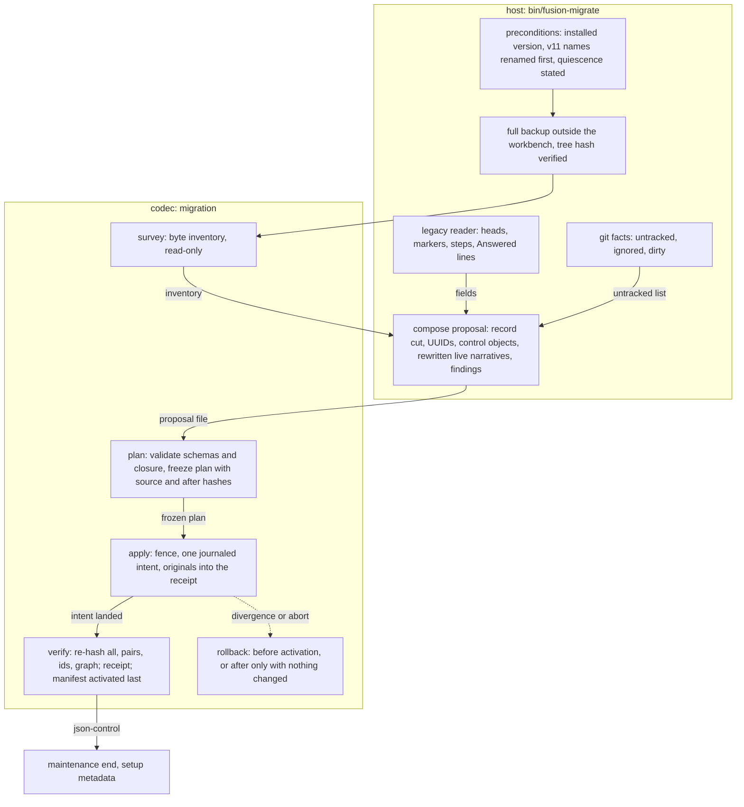
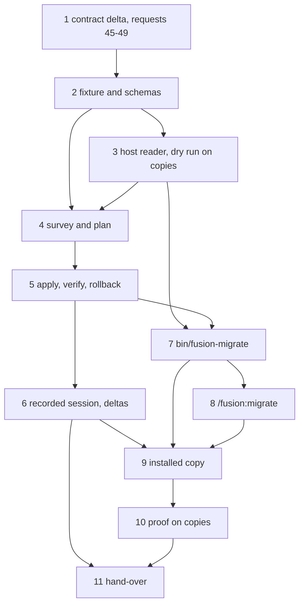

# Implementation Plan: FJ04. A legacy v12 workbench migrates to JSON control, implemented and proven on copies

**Date:** 2026-10-01
**Status:** Draft
**Spec:** none as a requirements-designer spec. Prior's `concept/fusion-json-workbench-spec.md` at Prior `590465d`: §2.1 and §2.2 (what converts), §3 (layout, archive boundary, identities), §4.1 to §4.3 (manifest, packages, records), §6 (the `migration` row), §8 (the maintenance run), §9 (FJ04's row and the mandatory checks). Order: request 26 (`Prior: docs/design/fusion-fj03a-followup-decisions.md` `## 26.`). Next step named by Prior: `Prior: docs/design/fusion-archive-correction-prior-response.md` `## Next work`.
**Cross-references:** 260928-1338-json-control-data-and-markdown-artefacts.md, 261001-1030_*_plan-the-archive-revision-archive-leaves-json-control-and-json-archival-follows-its-qualification.md (method; its step 13 finishes before this plan's step 4 moves the bundle), 260930-1654_*_plan-initialize-the-codec-creates-a-new-workbench-and-list-names-its-state.md (method), 260929-1810_*_in-which-order-do-the-parts-of-fj03-and-fj04-land-while-fusions-own-workbench-is-still-in-the-v12-form.md, 260929-1810_*_does-the-2026-09-27-ruling-on-the-growth-bound-reach-the-hook-tests-and-shipped-text-fj03-changes.md, 261001-1804_*_which-markdown-artefacts-become-records-when-a-legacy-workbench-migrates.md, 261001-1804_*_where-does-the-legacy-markdown-reader-live-and-what-does-the-codecs-migration-operation-take.md, 261001-1804_*_what-stable-step-anchor-does-an-imported-plan-carry-and-which-criteria.md, 261001-1804_*_how-are-legacy-values-with-no-v1-counterpart-mapped-at-import.md
**Planned against:** fusion `15e4d52e`; bundle 543 227 bytes, `sha256:6b26faf2b0f9389fcbb4df1a3dd23881d2ff76cb2cab4c918f2bf969a597b0bf` (request 44, qualified by Prior at `590465d`). Growth room as dispatched: hook tests 0 lines, skills about 18 KB; each step re-reads both from `hooks/lib/__tests__/surface-growth-bound.test.ts`.
**Decidability:** Three questions. **(1) Which Markdown artefacts become records?** Once a rule is fixed, it is decidable from the files: marker, store, container head and the structural head fields are all on disk. *Which* rule is not decidable from the texts: §2.1's "höchstens extrahierte Metadaten" permits a `legacy-terminal` pair and permits none. That choice is decision 261001-1804 (record cut), recommended option 2: every package, every live record, and a terminal record only when a `record_ref`-only field of a record names it. Measured: 104 of 1 219 records here (`15e4d52e`), 638 of 1 570 in axibra-1, 148 of 1 153 in krk. The codec's `plan` phase checks the closure, so the rule's completeness is a refusal, not a hope. **(2) Is the run atomic and resumable?** Yes for every codec writer, by a mechanism already qualified. `apply` is one kernel intent with the pre-hash and post-bytes of every write. Recovery rolls it forward at any cut, and a diverged file blocks it rather than being overwritten. Activation is a separate last write, the manifest's atomic rename. **Not decidable:** whether an old v12 client edits Markdown during the run. No file the codec writes can stop a program that never reads it (§8.1). The mechanism therefore detects instead of predicting. Source hashes are frozen in the plan, and the intent's pre-hashes and `verify`'s full re-hash compare them against disk. A difference stops the run before activation, and quiescence stays a stated precondition. **(3) Is the proof on copies sound?** Yes, by comparison. Each real workbench is copied to scratch, and the source tree hash is taken before and after. Every figure is taken on the copy.

## Directive

Implement the composite migration of section 8 for a fusion v12 workbench (and a v11-named one, through the existing store rename first) and prove it on copies of real workbenches: fusion's own and at least one consuming project's, read-only, copied to scratch. The proof covers inventory and exact-byte backup, explicit field and id mapping, interrupted-apply recovery, a repeat run that is a no-op, referential integrity and rollback (Prior, `## Next work`). The real migration of this repository is not part of this plan. It belongs to FJ03d's maintenance window with the installation (request 26). No file under `agents/`, `rules/` or `docs/` changes.

## Current State

- **Codec.** `migration` is the one deferred operation. `inspect.operations.deferred` is `["migration"]`. The protocol branch takes `{op, workbench, phase: survey|plan|apply|verify, plan}`, with no `operation_id`. Prior's FJ02 adapter sends `migration` with `phase: survey` and expects `operation-unknown/not-implemented`. `initialize` refuses any non-empty target, legacy Markdown included, and leaves it byte-identical (request 27). `maintenance begin` admits only `json-control`. The kernel's journal (`codec/src/journal.ts`) already commits multi-file intents with pre-hashes and post-bytes, recovers them, and blocks on divergence. `provenance` admits `imported` and `legacy-terminal`, each requiring `backup`. `resolveArtefact` reads hash-bound files under `archive/`.
- **Host.** The FJ03a to FJ03c helpers read only JSON. No Markdown head reader survives in `hooks/lib/` (`scope.ts` and `work-graph.ts` say so in their headers). `/fusion:migrate` renames the v11 stores only and refuses pre-v4 shapes. `bin/fusion-archive` holds archive units under the fence.
- **Measured data** (2026-10-01; commands in step 3's note):

| Workbench | Layout | Records (live) | Packages |
|---|---|---|---|
| fusion `15e4d52e` | v12 | 1 219 (104) | 18 item records, 24 Circle `circle.md`, 4 empty trees |
| axibra-1 `e6678b530` | v12, `circles/` still holds 2 | 1 570 (638) | 110 + 2 |
| krk `f87d8c6` | v11 names (`circles/`, `planning/`) | 1 153 (148) | 27 Circle containers |

  Also: `history/` 994 files here (stays plain, §2.2), `archive/` 607 Markdown files. Terminal values with no v1 state exist: plan `_s_` (axibra-1: 5) and Circle `_b_`/`_d_`.

## Approach

**One integral mechanism: the host reads, the codec writes** (decision 261001-1804, reader placement, recommended option 1). The host owns the v12 grammar, which is fusion's own format and nobody else's. It owns the git facts too. It composes a mapping proposal. The codec owns every write, by the kernel's journal, so atomicity and resumption come from a mechanism Prior already qualified. Nothing is predicted. Everything is compared by hash.

**The phases, as the contract delta proposes them (request 45):**

| Phase | State admitted | Writes | Answer |
|---|---|---|---|
| `survey` | legacy, json-control | nothing | every file under the root with size, sha256, kind (regular, link, other), `.json-state/` entries, intents, `archive/` as history (§8.2, fj03c `## 36`) |
| `plan` | legacy | `archive/migrations/<id>/plan.json` by one intent | migration id, plan path and revision, counts, refusals typed |
| `apply` | legacy, under its own fence | one intent: originals of every converted or rewritten narrative to `archive/migrations/<id>/originals/`, every control file, every rewritten live narrative, the fence | revisions; an identical replay answers the stored bytes |
| `verify` | legacy with the fence of this plan | receipt `archive/migrations/<id>/receipt.json`, then `workbench.json` with `migration: {id, source_layout, receipt}` | checks run, counts, the manifest revision |
| `rollback` | legacy with the fence; json-control only when every file still hashes as the receipt's after-state | restores the originals by one intent, removes control files, receipt, plan, fence | what was restored |

- **Requests carry `operation_id`.** The proposal and the frozen plan travel by workbench-relative or absolute file path, never on stdin. A plan of 1 000 records exceeds the 1 MiB request bound, and answers stay under 16 MiB (request 31).
- **The frozen plan fixes everything a resume needs:** the workbench UUID, every record UUID, the `apply` operation id (which is also the fence's id), the source sha256 of every file read, and the expected after-hash of every file written. `plan` serialises each target with the codec's own serialiser.
- **`plan` refuses** a schema-invalid target, a duplicate UUID, a source hash that differs from disk, an unresolved structural reference (the closure), a proposal with open blocking findings, and any manifest that is present.
- **Exclusivity.** On a legacy store, `apply` writes `.json-state/maintenance.json` with its own operation id in the same sequence. From then on the existing fence refuses every fresh codec mutation. After activation the host ends it with the existing `maintenance end`, once setup metadata is complete (§8.3.5). A crash between activation and `end` leaves a JSON-controlled store fenced. `inspect.maintenance` names the fence, and `bin/fusion-migrate resume` finishes the run.
- **Second run.** `verify` or `apply` with the same operation id answers its stored bytes. `plan` on a json-control store whose manifest names a receipt answers that receipt as a verified no-op. It assigns no new UUID and rewrites no mode (§8.3.7).
- **What the codec cannot judge:** a mapping's meaning. That is covered by host tests over a fixture with every legacy shape, and by the proof on copies, which reads each migrated record back through the shipped readers.

**The record cut** (decision 261001-1804, record cut, recommended option 2):

| Artefact | Becomes | Markdown |
|---|---|---|
| item record or Circle head of every container (§2.1) | `package.json`, `imported` when live, `legacy-terminal` when terminal | live: control head fields removed, held verbatim in `legacy_fields`; terminal: byte-identical |
| issue, plan, discussion with `_o_`/`_p_`; decision with `_o_`/`_a_` | `<name>.record.json`, `imported` | control lines removed (plan `**Status:**`, step marks); `Answered:`/`Resolved:` prose stays |
| terminal record named by a `record_ref`-only field of a record above | `<name>.record.json`, `legacy-terminal` | byte-identical |
| every other terminal record, `history/`, reviews, analyses, memos, `archive/` | nothing | unchanged; legacy citations keep resolving |

Filenames keep their markers (§3). A terminal package's document bindings stay in `legacy_fields` and pull nothing in. Legacy values with no v1 counterpart follow decision 261001-1804 (legacy values). Step anchors follow decision 261001-1804 (step anchors).

## Implementation Steps

1. **The contract delta and requests 45 to 49, to the Prior side**
   - Executor: `analyst`
   - Files: `codec/fixtures/prior/REQUESTS.md` (pure append, drafted in the scratchpad and appended by the orchestrator), this plan
   - Changes: `## FJ04 (the contract delta)`, stamped against the head commit and Prior `590465d` (with `git log --all --oneline 590465d..` checked), and the bundle digest above. It contains the phase table, the request and answer shapes, the order under the lock for each phase (sweep and recovery, replay, fence, plan), the new reasons, and the moved `inspect` bytes (`operations.implemented` gains `migration`, `deferred` becomes `[]`), with the recorded answers this moves named. It also states the change Prior's FJ02 deferred-operation check meets. Requests: **45** the operation (the reader-placement decision, option 1); **46** the record cut (record-cut decision, option 2, with the three measured workbenches); **47** Circle heads and empty container trees; **48** step anchors and criteria; **49** `answer_ref` for an `Answered:` line without a resolvable target, and document roles from free clauses. 47 and 49 come from the legacy-values decision. Each request names the decision it closes and its preferred form of reply. It ends by saying that step 3's measurement appends an addendum before step 4 freezes the plan schema.
   - Dependencies: none (the four decisions open, put as fusion's proposals).
   - Acceptance: the file's prior lines hash equal to the head blob; each new reason occurs 0 times under codec `src`, `contract`, `schemas` and `fixtures` at the stamp commit.

2. **The legacy fixture workbench and the migration schemas**
   - Executor: `data-implementer`
   - Files: `codec/fixtures/legacy-v12/` (new), `codec/schemas/protocol.schema.json` (the `migration` branches), `codec/schemas/migration-plan.schema.json` and `migration-receipt.schema.json` (new, under the names step 1 proposes), `codec/fixtures/valid/`, `codec/fixtures/invalid/`, `codec/fixtures/manifest.json`
   - Changes: a v12 workbench in Markdown holding one of each legacy shape:
     - a live and a terminal package of each status;
     - Circle heads `_c_`, `_b_`, `_s_` and `_d_`, and an empty container tree;
     - a live record of every kind and state, and a terminal one of every kind;
     - a plan with steps `1`, `2`, `12a` across all three marks, and one with a duplicate step number;
     - `_a_` decisions with a resolvable and an unresolvable `Answered:` citation;
     - a `_d_` decision without a ruler, and a plan `_s_`;
     - `**Depends-on:**` to a terminal package, and `**Active spec/plan:**` with role clauses, one naming a terminal plan;
     - a live record in a terminal container, a link, and an untracked file.

     A v11-named twin is derived by the tests, not committed. Protocol branches with `operation_id`, `additionalProperties: false`, one `oneOf` branch per phase. The two schemas with valid and invalid fixtures (missing hash, duplicate UUID, a write outside the root, an absolute path).
   - Dependencies: step 1.
   - Acceptance: `fixtures.test.ts` green with the manifest count stated; the committed bundle rebuilt in the same commit, because the schemas are inlined (`committed-bundle.test.ts` green); every recorded session still byte-identical except the deltas step 6 names.

3. **The host's legacy reader and mapping composer, read-only, measured on copies**
   - Executor: `code-implementer`
   - Files: `hooks/lib/legacy-import.ts` (new), `hooks/lib/__tests__/legacy-import.test.ts` (new), `hooks/dist/`, `README-hooks.md` (lib row), the growth-bound files
   - Changes: a pure module that takes a workbench root and the codec's `survey` inventory and writes nothing. It reads package heads (v12 fields and Circle heads), filename markers per vocabulary, plan steps per the step-anchor decision, decision lines (`Answered:`, `Implemented:`, `Deferred:`, `Superseded by:`), and citations through `hooks/lib/citation-scan.ts`, unchanged. It composes the proposal: the record cut and its closure, fresh UUIDs (injected generator), control objects with `legacy_fields`, `backup` refs pointing to `archive/migrations/<id>/originals/<path>`, rewritten live narratives, and findings typed `blocking` or `reported`. Before `survey` exists, a test-only inventory stands in for it. Then a dry run over scratch copies of the three workbenches, with the source tree hash taken before and after, reports per workbench the counts per cut row, findings by type, and time.
   - Tests: one per legacy shape in the fixture; a blocking finding per §8.2 case (several active plans, invalid claim, unknown state, unresolvable live dependency); the closure pulling in exactly the terminal plan a live package binds; a terminal package pulling nothing; red against a copy without the closure.
   - Dependencies: step 2.
   - Acceptance: hook suite green but the known monitor loopback case; the replaced-then-raised lines logged (the growth-bound ruling in `**Cross-references:**`, option 2, then 1); the dry-run figures in the step note, and every finding class beyond requests 47 to 49 appended as the addendum step 1 announced.

4. **Codec: `migration survey` and `plan`**
   - Executor: `code-implementer`
   - Files: `codec/src/cli/ops.ts`, `codec/src/cli/protocol.ts`, `codec/src/kernel.ts` (state gate per phase), `codec/src/migration.ts` (new), `codec/src/__tests__/migration.test.ts` (new), `codec/dist/fusion-record.js`, `codec/README.md`
   - Changes: `survey` as the read-only inventory. It creates no `.json-state/`, as `initialize`'s refusal does not. `plan` validates the proposal against the plan schema, every target against its kind's schema, closure, uniqueness and source hashes. It then writes the frozen plan by one intent and answers counts. `inspect` lists `migration` as implemented.
   - Tests: survey of the fixture byte-identical before and after; each refusal of `## Approach`; replay and changed-request conflict; a source edited between survey and plan refused.
   - Dependencies: steps 2 and 3. Starts only after the archive plan's step 13 has committed, so that one bundle line moves at a time.
   - Acceptance: codec suite and typecheck green; every other operation's answers byte-identical; the moved `inspect` answers listed for step 6.

5. **Codec: `apply`, `verify`, `rollback`**
   - Executor: `code-implementer`
   - Files: as step 4, plus `codec/src/__tests__/kernel.test.ts`
   - Changes:
     - `apply` re-checks every source hash under the lock, writes the fence, and commits one intent with every write of the frozen plan, originals first. It then applies the intent and stores the answer.
     - `verify` re-hashes every file the plan names and reads every pair, id, `depends_on` graph (cycles and missing targets) and reference. It runs `validate` and `reconcile` over the result as a json-control view before activation. It then writes the receipt and activates the manifest last.
     - `rollback` follows the table in `## Approach`. After activation it refuses when any file differs from the receipt's after-state.
   - Tests: an in-process cut after each journal write, then resume finishing; a Markdown source edited after `plan` is refused before the intent; a file edited after the commit point is `recovery-blocked` and unchanged; a crash after activation, before `end`; replay of each phase; a second `plan` after activation is a no-op naming the receipt; rollback before activation byte-identical to the survey; rollback after a later `create` refused; the manifest never visible before the receipt verifies.
   - Dependencies: step 4.
   - Acceptance: as step 4; red against a copy that activates before the receipt is written and against one that overwrites a diverged file.

6. **The recorded migration session and the inspect deltas**
   - Executor: `code-implementer`
   - Files: `codec/fixtures/protocol-session-migration/` (pairs, `base/` = the legacy fixture, seeds, README), `codec/src/__tests__/round-trip-cli-migration.test.ts`, delta files beside every recorded `inspect` answer step 4 moved (initialize and archive sessions), their READMEs
   - Changes: the exchanges, in order:
     - survey; plan refused over a blocking finding; plan;
     - apply cut in process, then `inspect` naming the fence;
     - the same apply finishing, then verify;
     - a second apply, verify and plan, each a replay or a no-op;
     - `maintenance end`; `list` and `show` of one open and one terminal-but-bound record.

     A second base covers rollback before activation and the refused rollback after a write. Fixed literals; regeneration only under `UPDATE_PROTOCOL_SESSION_MIGRATION=1`.
   - Dependencies: step 5.
   - Acceptance: the gate green without regeneration; every older session replays through its deltas and nothing else; a shell replay through `bin/fusion-record` over a root path with a space.

7. **The host migration helper**
   - Executor: `code-implementer`
   - Files: `bin/fusion-migrate` (new), `hooks/migrate.ts` (new), `hooks/lib/legacy-import.ts`, `hooks/lib/__tests__/migrate.test.ts` (new), `.gitignore` (`!bin/fusion-migrate`), `hooks/lib/__tests__/hook-route-exclusion.test.ts` (stub list, in place), `README-hooks.md` (roster), the growth-bound files
   - Changes: the subcommands are `survey` (prints the counts per cut row and findings, writes nothing), `run`, `resume`, `rollback` and `status`. `run` checks its preconditions in this order:
     - a legacy store name present is refused, with the route to `/fusion:migrate`'s rename (§8.3.2);
     - the installed codec must answer `migration` as implemented;
     - a standing fence or a pending intent is refused;
     - a live `.session-marker` or a running monitor is reported, never assumed quiescent;
     - untracked and ignored record files are listed (§8.1).

     `run` then writes a full backup of the workbench outside it and verifies it by tree hash. It composes the proposal into `.json-state/` scratch and drives `plan`, `apply` and `verify`. It ends the fence after setup metadata and states what each exit means. Distinct exit codes, named in the wrapper. No fusion JSON is written by the host.
   - Tests (real bundle): the fixture migrates and every shipped reader (`bin/fusion-claimed-package`, `bin/fusion-work-order`, `bin/fusion-citation-check`, `bin/fusion-citation-sweep --dry-run`) exits 0 on the result; a kill at each phase boundary followed by `resume`; a backup that does not verify stops before `plan`; a v11-named twin refused with the route; rollback before activation leaves the tree hash equal to the backup's.
   - Dependencies: steps 3 and 5.
   - Acceptance: hook and codec suites green as standing; the raise logged; the bundle digest unchanged by this step.

8. **`/fusion:migrate` drives the JSON migration after the store rename**
   - Executor: `code-implementer`
   - Files: `skills/migrate/SKILL.md`, the growth-bound files
   - Changes: after the existing rename pass and its commit advice, a JSON phase. It runs only when `[ -x "$FUSION_PLUGIN_ROOT/bin/fusion-migrate" ]` holds, and otherwise says which install carries it. It shows `survey`'s counts and findings and asks in the skill's existing question shape. On a yes it runs `run`, reports the receipt path, and states the commit split (originals, pairs, rewrites, manifest) and that other checkouts pull rather than migrate. The FJ03d and FJ04 sentence in the description is updated. The pre-v4 refusal is unchanged.
   - Dependencies: step 7.
   - Acceptance: the skills bound green or the measured remainder raised and logged, with the room left reported; `path-literal-lint` green.

9. **The installed copy migrates a legacy workbench**
   - Executor: `code-implementer`
   - Files: `codec/src/__tests__/install.test.ts`
   - Changes: a seventh case on the existing install. A v11-named copy of the fixture goes through the skill's shipped rename block and then `bin/fusion-migrate run`. Through the installed helpers, one open and one terminal record are read back (§8.3.7). `bin/fusion-write` claims the open package. A second `run` is a no-op naming the receipt. An interrupted run resumes.
   - Dependencies: steps 6, 7 and 8.
   - Acceptance: `cd codec && CODEC_REQUIRE_GOLDENS=1 npm test` and `npm run typecheck` green with the case run, not skipped.

10. **The proof on copies of real workbenches**
    - Executor: `analyst`
    - Files: the package's `analyses/` (one report), this plan's step note
    - Changes: three copies in scratch. **fusion** is taken from a commit of this branch, not the live tree, so that the committed bytes are what is migrated. **axibra-1** is v12 with `circles/` left over, so it goes through the rename first. **krk** has v11 names. Each source tree hash is taken before and after, and must be equal. Each copy is migrated by the installed helper from step 9's install. Per copy the report gives:
      - the plugin and bundle digests, Node and the machine;
      - record counts per cut row;
      - findings by class, and how each was resolved in the frozen plan;
      - timing of each phase (three runs, median and max);
      - the answer bytes of `survey`, unscoped `list` and `reconcile`, against 16 MiB;
      - `reconcile` time against the 5 s allowance;
      - the inventory and receipt hashes;
      - the second run's no-op;
      - a kill inside `apply` resumed;
      - rollback before activation restoring the tree hash;
      - rollback refused after one `create`;
      - one open and one terminal record read back through each shipped reader.

      A git-tracked copy and a plain copy (no `.git`) are both run for one workbench.
    - Dependencies: step 9.
    - Acceptance: every figure above present with its command, or a named finding; no write outside scratch (source hashes equal).

11. **The hand-over: what landed, the frozen digest, the re-pin**
    - Executor: `analyst`
    - Files: `codec/fixtures/prior/REQUESTS.md`, this plan
    - Changes: `## FJ04 (the hand-over)`, written against the last commit that moved `codec/`, `bin/` or `hooks/`. It contains:
      - the commits in order, each intermediate digest, and the frozen digest;
      - the test figures from a scratch clone;
      - each pinned path that differs from Prior's pin at `e1bafd2f`;
      - the delta files and the session's exchange list;
      - step 10's figures in summary, citing the report;
      - requests 45 to 49 as answered;
      - under the next free numbers, a re-snapshot of the shared fixtures and a re-pin with the replay of every session through its deltas, the migration session included, plus Prior's conformance run.
    - Dependencies: steps 6 and 10.
    - Acceptance: the section's prior lines hash equal to the head blob; the frozen digest equals the blob and a rebuilt scratch clone.

## Where this work stops

- The four decisions of 2026-10-01 are answered, or the plan is amended to the ruled options before step 2.
- `codec` suite and typecheck are green at the closing commit; `committed-bundle.test.ts` was green at every commit that moved the bundle.
- Every recorded response file at `15e4d52e` is unedited, and step 6's delta files are the only differences any gate admits.
- `protocol-session-migration/` replays green without regeneration, and from a shell.
- Every refusal and crash cut of steps 4 and 5 has a test shown red against a broken copy.
- `bin/fusion-migrate` passes every case of step 7, and the installed copy passes step 9's case.
- Step 10's report exists, with the figures for all three copies, and every source tree hash equal before and after.
- `REQUESTS.md` carries the sections of steps 1 and 11, the second stamped with the frozen digest.
- Precondition for the real migration, not claimed here: Prior has re-pinned that digest and reported conformance green, and FJ03d's window is agreed. No real workbench, this repository's included, has a `workbench.json` written by this plan.
- No file under `agents/`, `rules/`, `docs/`, `templates/` or `.claude-plugin/` changed, nor `install.sh`; `plugin.json` stays at 12.0.0.

## Data Structures

- **Migration plan** (`archive/migrations/<id>/plan.json`): migration id, workbench UUID, `apply` operation id, source layout, bundle digest. One row per written file `{path, kind, source_sha256 | null, after_sha256}`, one row per read-only source, and the UUID map `{legacy_path → id}`. Also the findings with their resolution, and the counts. The exact shape is put to Prior in step 1.
- **Receipt** (`archive/migrations/<id>/receipt.json`): the plan's revision, the inventory hash, the checks run with their results, the versions, and the activation's manifest revision. It holds no secrets and no local journal (§8.3.6).
- **Originals:** `archive/migrations/<id>/originals/<workbench path>`, the exact bytes of every narrative converted or rewritten; each `provenance.backup` points there.

## API Changes

`migration` with five phases, each with `operation_id`. `inspect.operations.deferred` becomes `[]`. New reasons are named in step 1. `bin/fusion-migrate` is new. `/fusion:migrate` gains its JSON phase.

## Testing Strategy

Shapes are tested on the fixture (steps 3 to 7), the protocol on the recorded session (step 6), and the shipped path on the installed copy (step 9). Scale and real-data correctness come from the proof on copies (step 10). Each guard is shown red against a broken copy. Hook suite runs follow the standing rules: the monitor's wildcard-bind loopback case is the one known red.

## Risks & Mitigations

| Risk | Mitigation |
|---|---|
| An old v12 client edits Markdown during the run | Source hashes frozen; intent pre-hashes and `verify` re-hash; divergence blocks before activation; quiescence stated by the skill (§8.1) |
| The mapping is wrong in meaning, while its form is valid | Host tests per legacy shape; each copy read back through every shipped reader; originals kept for every rewritten byte |
| One intent of thousands of writes is slow or large | Step 10 measures each phase on the largest copy (axibra-1, 265 MB workbench); if a phase exceeds the client's 70 s, the plan is amended with chunked intents under one fence, never with a raised timeout |
| Prior rules a decision otherwise | Steps 2 onward start only after step 1's answers or the user's ruling; the plan is amended first |
| The archive plan's step 13 and this plan both move the bundle | Step 4 waits for step 13's commit |
| Hook-test room is 0 | Retired tests replaced first, the measured remainder raised and logged |

## Open Questions

- [ ] Does the growth-bound ruling cited above (option 2, then 1) reach FJ04's hook tests as it reached the archive revision's? The plan assumes yes; a no stops step 3 at its first raise.
- [ ] axibra-1 is a project repository of another team. Is a scratch copy of it acceptable as the consuming-project proof, or should a different project be named? krk is the second candidate either way.
- [ ] The four decisions filed with this plan: `261001-1804_*_which-markdown-artefacts-become-records-when-a-legacy-workbench-migrates.md`, `261001-1804_*_where-does-the-legacy-markdown-reader-live-and-what-does-the-codecs-migration-operation-take.md`, `261001-1804_*_what-stable-step-anchor-does-an-imported-plan-carry-and-which-criteria.md`, `261001-1804_*_how-are-legacy-values-with-no-v1-counterpart-mapped-at-import.md`.
