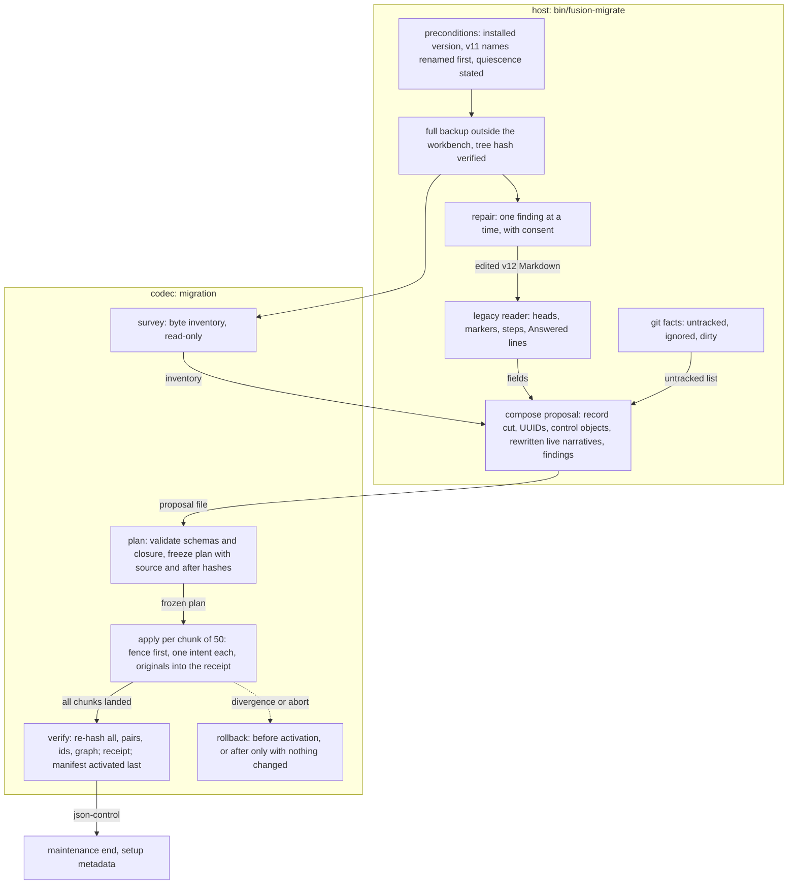
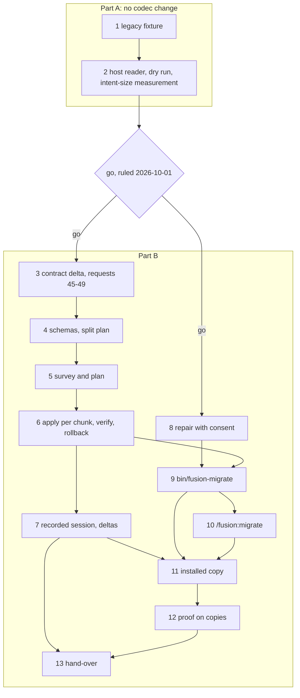

# Implementation Plan: FJ04. A legacy v12 workbench migrates to JSON control, implemented and proven on copies

**Date:** 2026-10-01
**Status:** Approved 2026-10-01 by the user, with the four decisions answered as recommended (record cut option 2, the other three option 1) and six changes: part A as a go/no-go before any codec change, the intent-size question settled in part A, the terminal-import gap in request 46, the growth-bound line below, aggregate figures only for other teams' workbenches, and this status. In progress.
**Spec:** none as a requirements-designer spec. Prior's `concept/fusion-json-workbench-spec.md` at Prior `590465d`: §2.1 and §2.2 (what converts), §3 (layout, archive boundary, identities), §4.1 to §4.3 (manifest, packages, records), §6 (the `migration` row), §8 (the maintenance run), §9 (FJ04's row and the mandatory checks). Order: request 26 (`Prior: docs/design/fusion-fj03a-followup-decisions.md` `## 26.`). Next step named by Prior: `Prior: docs/design/fusion-archive-correction-prior-response.md` `## Next work`.
**Cross-references:** 260928-1338-json-control-data-and-markdown-artefacts.md, 261001-1030_*_plan-the-archive-revision-archive-leaves-json-control-and-json-archival-follows-its-qualification.md (method; its step 13 finishes before this plan's step 4 moves the bundle), 260930-1654_*_plan-initialize-the-codec-creates-a-new-workbench-and-list-names-its-state.md (method), 260929-1810_*_in-which-order-do-the-parts-of-fj03-and-fj04-land-while-fusions-own-workbench-is-still-in-the-v12-form.md, 260929-1810_*_does-the-2026-09-27-ruling-on-the-growth-bound-reach-the-hook-tests-and-shipped-text-fj03-changes.md, 261001-1804_*_which-markdown-artefacts-become-records-when-a-legacy-workbench-migrates.md, 261001-1804_*_where-does-the-legacy-markdown-reader-live-and-what-does-the-codecs-migration-operation-take.md, 261001-1804_*_what-stable-step-anchor-does-an-imported-plan-carry-and-which-criteria.md, 261001-1804_*_how-are-legacy-values-with-no-v1-counterpart-mapped-at-import.md
**Planned against:** fusion `15e4d52e`; bundle 543 227 bytes, `sha256:6b26faf2b0f9389fcbb4df1a3dd23881d2ff76cb2cab4c918f2bf969a597b0bf` (request 44, qualified by Prior at `590465d`). Growth room as dispatched: hook tests 0 lines, skills about 18 KB; each step re-reads both from `hooks/lib/__tests__/surface-growth-bound.test.ts`.
**Growth bound:** the user's ruling of 2026-10-01, given with this plan's approval, extends `260929-1810_*_does-the-2026-09-27-ruling-on-the-growth-bound-reach-the-hook-tests-and-shipped-text-fj03-changes.md` to FJ04. Retired tests are replaced first. `TEST_LINE_HEAD_ROOM` (and the skills head-room) is then raised by exactly the measured remainder, and each raise is logged in `README-hooks.md` `### Growth bounds on the shipped text` with its figure before and after. No baseline moves.
**Confidentiality:** axibra-1, and krk while it counts as another team's project, may be copied to scratch and measured. Every report (analyses, `REQUESTS.md`, step notes, commit messages) carries aggregate figures only for them: no file name, no content excerpt. fusion's own workbench may be named. Copies named by the user on 2026-10-01: `/Users/kai/Projects/productive/F03_digital-leadership/axibra-4` or `/Users/kai/Projects/productive/F08-KRK/krk` (read-only, copied to scratch); axibra-4 replaces axibra-1 where the steps name it; aggregate figures only for both.
**Decidability:** Three questions. **(1) Which Markdown artefacts become records?** Once a rule is fixed, it is decidable from the files: marker, store, container head and the structural head fields are all on disk. *Which* rule is not decidable from the texts: §2.1's "höchstens extrahierte Metadaten" permits a `legacy-terminal` pair and permits none. That choice is decision 261001-1804 (record cut), recommended option 2: every package, every live record, and a terminal record only when a `record_ref`-only field of a record names it. Measured: 104 of 1 219 records here (`15e4d52e`), 638 of 1 570 in axibra-1, 148 of 1 153 in krk. The codec's `plan` phase checks the closure, so the rule's completeness is a refusal, not a hope. **(2) Is the run atomic and resumable?** Yes for every codec writer, by a mechanism already qualified. `apply` uses kernel intents carrying the pre-hash and post-bytes of every write. Part A measured one intent over the largest copy at about 28 s, so `apply` runs as chunked intents of 50 writes under one fence, one request each. Recovery rolls each chunk forward at any cut, `resume` sends the next missing chunk, and a diverged file blocks it rather than being overwritten. Activation is a separate last write, the manifest's atomic rename. **Not decidable:** whether an old v12 client edits Markdown during the run. No file the codec writes can stop a program that never reads it (§8.1). The mechanism therefore detects instead of predicting. Source hashes are frozen in the plan, and the intent's pre-hashes and `verify`'s full re-hash compare them against disk. A difference stops the run before activation, and quiescence stays a stated precondition. **(3) Is the proof on copies sound?** Yes, by comparison. Each real workbench is copied to scratch, and the source tree hash is taken before and after. Every figure is taken on the copy.

## Directive

Implement the composite migration of section 8 for a fusion v12 workbench (and a v11-named one, through the existing store rename first) and prove it on copies of real workbenches: fusion's own and at least one consuming project's, read-only, copied to scratch. The proof covers inventory and exact-byte backup, explicit field and id mapping, interrupted-apply recovery, a repeat run that is a no-op, referential integrity and rollback (Prior, `## Next work`). The real migration of this repository is not part of this plan. It belongs to FJ03d's maintenance window with the installation (request 26). No file under `agents/`, `rules/` or `docs/` changes.

## Current State

- **Codec.** `migration` is the one deferred operation. `inspect.operations.deferred` is `["migration"]`. The protocol branch takes `{op, workbench, phase: survey|plan|apply|verify, plan}`, with no `operation_id`. Prior's FJ02 adapter sends `migration` with `phase: survey` and expects `operation-unknown/not-implemented`. `initialize` refuses any non-empty target, legacy Markdown included, and leaves it byte-identical (request 27). `maintenance begin` admits only `json-control`. The kernel's journal (`codec/src/journal.ts`) already commits multi-file intents with pre-hashes and post-bytes, recovers them, and blocks on divergence. `provenance` admits `imported` and `legacy-terminal`, each requiring `backup`. `resolveArtefact` reads hash-bound files under `archive/`.
- **Host.** The FJ03a to FJ03c helpers read only JSON. No Markdown head reader survives in `hooks/lib/` (`scope.ts` and `work-graph.ts` say so in their headers). `/fusion:migrate` renames the v11 stores only and refuses pre-v4 shapes. `bin/fusion-archive` holds archive units under the fence.
- **Measured data** (2026-10-01; commands in step 2's note):

| Workbench | Layout | Records (live) | Packages |
|---|---|---|---|
| fusion `15e4d52e` | v12 | 1 219 (104) | 18 item records, 24 Circle `circle.md`, 4 empty trees |
| axibra-1 `e6678b530` | v12, `circles/` still holds 2 | 1 570 (638) | 110 + 2 |
| krk `f87d8c6` | v11 names (`circles/`, `planning/`) | 1 153 (148) | 27 Circle containers |

  Also: `history/` 994 files here (stays plain, §2.2), `archive/` 607 Markdown files. Terminal values with no v1 state exist: plan `_s_` (axibra-1: 5) and Circle `_b_`/`_d_`.

## Approach

**One integral mechanism: the host reads, the codec writes** (decision 261001-1804, reader placement, recommended option 1). The host owns the v12 grammar, which is fusion's own format and nobody else's. It owns the git facts too. It composes a mapping proposal. The codec owns every write, by the kernel's journal, so atomicity and resumption come from a mechanism Prior already qualified. Nothing is predicted. Everything is compared by hash.

**The phases, as the contract delta proposes them (request 45; chunked per step 2's measurement):**

| Phase | State admitted | Writes | Answer |
|---|---|---|---|
| `survey` | legacy, json-control | nothing | every file with size, sha256 and kind, `.json-state/` entries, intents, `archive/` as history |
| `plan` | legacy | `archive/migrations/<id>/plan.json` (index) and `chunks/<n>.json`, each under 1 MiB | migration id, chunk ids, counts, refusals typed |
| `apply {chunk}` | legacy; chunk 1 writes the fence, every later chunk runs under it | one intent of at most 50 writes: originals to `archive/migrations/<id>/originals/`, control files, rewritten live narratives | revisions; a replay answers the stored bytes |
| `verify` | legacy, fenced, every chunk landed | the receipt, then `workbench.json` with `migration: {id, source_layout, receipt}` | checks, counts, the manifest revision |
| `rollback {chunk}` | fenced, chunks in reverse; json-control only when every file hashes as the receipt's after-state | one intent per chunk restoring originals; the last removes plan files and the fence | what was restored |

- **Requests carry `operation_id`; each chunk has its own, fixed in the index.** The proposal and the plan travel by path, never on stdin: a request stays under 1 MiB, an answer under 16 MiB (request 31). Step 2 measured one intent over the largest copy at about 28 s and a 50-write chunk at 1.45 s max. Each request therefore fits the client's 5 s post-wait allowance, and the timeout is never raised.
- **The frozen plan fixes everything a resume needs:** the workbench and record UUIDs, every chunk's operation id, every source sha256 and after-hash, and the repair log. `resume` sends the next chunk whose answer is not stored.
- **`plan` refuses** a schema-invalid target, a duplicate UUID, a source hash differing from disk, an unresolved structural reference (the closure), an open blocking finding, and a present manifest.
- **Exclusivity.** Chunk 1's fence refuses every fresh codec mutation until the host's `maintenance end`, which comes after setup metadata (§8.3.5). A crash in between leaves a fenced store that `inspect.maintenance` names; `bin/fusion-migrate resume` finishes it.
- **Repair before freezing** (step 8): a blocking finding is resolved only by a v12 Markdown edit the user consented to, finding by finding, after the external backup and before `plan`. Nothing is guessed, and a class without a repair stays blocking.
- **Second run.** Every request with a stored answer replays it. `plan` on a store whose manifest names a receipt answers that receipt as a no-op (§8.3.7).
- **What the codec cannot judge:** a mapping's meaning. Host tests per legacy shape and the proof on copies, read back through the shipped readers, cover it.

**The record cut** (decision 261001-1804, record cut, recommended option 2):

| Artefact | Becomes | Markdown |
|---|---|---|
| item record or Circle head of every container (§2.1) | `package.json`, `imported` when live, `legacy-terminal` when terminal | live: control head fields removed, held verbatim in `legacy_fields`; terminal: byte-identical |
| issue, plan, discussion with `_o_`/`_p_`; decision with `_o_`/`_a_` | `<name>.record.json`, `imported` | control lines removed (plan `**Status:**`, step marks); `Answered:`/`Resolved:` prose stays |
| terminal record named by a `record_ref`-only field of a record above | `<name>.record.json`, `legacy-terminal` | byte-identical |
| every other terminal record, `history/`, reviews, analyses, memos, `archive/` | nothing | unchanged; legacy citations keep resolving |

Filenames keep their markers (§3). A terminal package's document bindings stay in `legacy_fields` and pull nothing in. Legacy values with no v1 counterpart follow decision 261001-1804 (legacy values). Step anchors follow decision 261001-1804 (step anchors).

## Implementation Steps

**Two parts.** Part A (steps 1 and 2) changes no codec file and moves no digest. It measures, on the fixture and on the copies, what part B must carry. Its findings decide whether part B starts: the orchestrator puts step 2's note to the user as a go/no-go. Part B (steps 3 to 13) starts only on a go. Its first act sends requests 45 to 49 once, carrying the finding classes part A measured.

### Part A: go/no-go, no codec change

1. [DONE] **The legacy fixture workbench**
   - Executor: `data-implementer`
   - Files: `codec/fixtures/legacy-v12/` (new; Markdown and directories only, not inlined into the bundle)
   - Changes: a v12 workbench in Markdown holding one of each legacy shape:
     - a live and a terminal package of each status;
     - Circle heads `_c_`, `_b_`, `_s_` and `_d_`, and an empty container tree;
     - a live record of every kind and state, and a terminal one of every kind;
     - a plan with steps `1`, `2`, `12a` across all three marks, and one with a duplicate step number;
     - `_a_` decisions with a resolvable and an unresolvable `Answered:` citation;
     - a `_d_` decision without a ruler, and a plan `_s_`;
     - `**Depends-on:**` to a terminal package, and `**Active spec/plan:**` with role clauses, one naming a terminal plan;
     - a live record in a terminal container, a link, and an untracked file.

     A v11-named twin is derived by the tests, not committed.
   - Dependencies: none.
   - Acceptance: codec suite green and the bundle digest unchanged (`committed-bundle.test.ts`); `fixtures.test.ts` unaffected, or its exemption added in place.
   - Done (2026-10-01, data-implementer; uncommitted in the live tree): `codec/fixtures/legacy-v12/` holds `workbench/` (the v12 root: `work-packages/`, `shared/`, `archive/`), `untracked/` and a `README.md` that lists every shape and its path. Every file is synthesised for a fictional parser project, and nothing is copied from a real workbench. The tree holds Markdown, directories and one committed symbolic link, and no JSON. It carries five item-record packages, one per status (three live, two terminal), and four Circle heads (`_c_`, `_b_`, `_s_` with a head still saying active, `_d_`). There are live records of every kind in every admitted state (a discussion takes `_o_` only) and terminal records of every kind, every terminal marker included. The `_p_` plan numbers its steps `1` `[DONE]`, `2` `[IN PROGRESS]`, `12a` `[OPEN]` and an unmarked `12b`; an `_o_` plan carries step `2` twice. There are two `_a_` decisions, one citing a live plan, the other a document outside the workbench in prose. The tree also holds a `_d_` decision whose `Deferred:` names no ruler and a plan `_s_`. In the heads: `**Depends-on:**` to the `done` package and to a live one, and `**Active spec/plan:**` with role clauses, where the `paused` package names a `_c_` plan, the closure's one terminal record. Further: an `_o_` issue under the `done` package; a review, analyses, a memo, histories and one archive unit as plain artefacts. Git holds neither the empty container tree nor the untracked file, so the tests recreate both in their copy: `mkdir` of a container with two empty subdirectories, and a copy of `untracked/`'s one live issue after the copy's first commit. The README names both, along with the v11-named twin's renames. `codec/src/__tests__/fixtures.test.ts` gains the exemption `legacy-v12/` in `isIndexed` and its comment, and nothing else. Nothing under `codec/src/` imports the fixture, so the bundle stays at `sha256:6b26faf2…b0bf`. `CODEC_REQUIRE_GOLDENS=1 npm test` exits 0 (19 files, 1 332 tests, `committed-bundle.test.ts` and `fixtures.test.ts` among them). The three hook lints (`domain-cascade`, `workbench-citation-lint`, `reference-resolution-lint`) exit 0.

2. [DONE] **The host's legacy reader and mapping composer, and the measurements that decide part B**
   - Executor: `code-implementer`
   - Files: `hooks/lib/legacy-import.ts` (new), `hooks/lib/__tests__/legacy-import.test.ts` (new), `hooks/dist/`, `README-hooks.md` (lib row), the growth-bound files; the benchmark harness stays in the scratchpad and is not committed
   - Changes: a pure module that takes a workbench root and a byte inventory and writes nothing. Until `survey` exists, the host builds the inventory itself, as a test-and-measurement stand-in that step 8 replaces. The module reads:
     - package heads (v12 fields and Circle heads, as the legacy-values decision rules);
     - filename markers, per vocabulary;
     - plan steps, as the step-anchor decision rules;
     - decision lines (`Answered:`, `Implemented:`, `Deferred:`, `Superseded by:`);
     - citations, through `hooks/lib/citation-scan.ts`, unchanged.

     It composes the proposal: the record cut and its closure, fresh UUIDs (injected generator), control objects with `legacy_fields`, `backup` refs to `archive/migrations/<id>/originals/<path>`, rewritten live narratives, and findings typed `blocking` or `reported`.

     **Dry run** over scratch copies of fusion, axibra-1 and krk, with the source tree hash taken before and after. It reports per copy the counts per cut row, the findings by class, and the composer's time.

     **The intent-size question.** The existing journal is driven from a scratch harness over the composed write set of the axibra-1 copy (`commitIntent`, `applyWrites`, `recover` in `codec/src/journal.ts`, unchanged), and the same for a `verify`-sized re-hash. Three runs, median and max. Rule: **one intent** when the max stays within the client's 5 s post-wait allowance (`POST_WAIT_MARGIN_MS`, so it holds after a full 65 s lock wait). Otherwise **chunked intents under one fence**, each chunk sized from the measurement to stay within 5 s, with resumption per chunk and activation still last. The timeout is never raised. The note states the figures and the choice.
   - Tests: one per legacy shape in the fixture; a blocking finding for each §8.2 case (several active plans, invalid claim, unknown state, unresolvable live dependency); the closure pulling in exactly the terminal plan a live package binds; a terminal package pulling nothing; red against a copy without the closure.
   - Dependencies: step 1.
   - Acceptance: the hook suite is green except the known monitor loopback case. The test lines follow the head's growth-bound line. The step note carries the dry-run figures, the finding classes and the intent choice, all aggregate as the head's confidentiality line requires.
   - Done (2026-10-01, code-implementer; uncommitted in the live tree). The go/no-go is not decided here; it is the user's ruling on this note.
     - **What landed.** `hooks/lib/legacy-import.ts` (pure; reads, writes nothing): `buildInventory` (the survey stand-in: files with size, sha256 and kind, plus directories) and `composeProposal` (record cut, closure, injected UUIDs in narrative-path order, control objects with `legacy_fields` and `backup` into `archive/migrations/<id>/originals/`, rewritten live narratives, findings from a `FINDINGS` table typed `blocking` or `reported`). Citations in `**Active spec/plan:**`, `**Depends-on:**` and `Answered:` resolve through `hooks/lib/citation-scan.ts`, unchanged. `hooks/lib/__tests__/legacy-import.test.ts`, 113 lines, six cases over a copy of the fixture: the cut's counts and a second composition byte-identical, item records and Circle heads, bindings and the closure (exactly the `_c_` plan the paused package binds; done and dropped packages pull nothing), step anchors `1` `2` `12a` `12b` and both `Answered:` forms, the four section 8.2 cases blocking, the v11-named twin refused. Red against a composer without the closure: 2 of 6 cases fail (the cut's counts and the closure case). `README-hooks.md` gains the lib row and the twenty-second raise; `TEST_LINE_HEAD_ROOM` 4 370 -> 4 483 (+113, nothing retired, room before 0 at `5a9f0f39`, after 0); the reference pin 1 884 -> 1 887, all three tokens `README-hooks.md`'s.
     - **Three readings the decisions left open, fixed here and carried to step 3.** A plan step is a column-0 numbered line (optionally behind `##`-`####`) that carries a mark, or stands in an `## Implementation steps` section; an unmarked step is `open`. A live package's control head fields are `Status`, `Claim`, `Mode`, `Active spec/plan` and `Depends-on`; `Domain`, `Filed by` and `Cross-references` stay in the narrative and are mapped too. A terminal package carries `depends_on`, `active_documents` and `references` empty, every head field raw in `legacy_fields`.
     - **Dry run** (copies in the scratchpad; source tree hashes before and after equal: axibra-4 at `6154ff7db` `7a9f8e9d…8358`, krk at `f87d8c6` `8b62904f…9fb5`; fusion copied from the live tree, `3f98055e…265c` at the copy). krk was read twice, as it stands (v11 names: 27 `legacy-store-name`, nothing else trusted) and after the store rename applied to its copy, which the row shows. Times are three runs, median / max, on an M2 Max, Node 25.7.0.

       | Copy | Files / dirs | Packages live / terminal | Records live / closure | Terminal left plain | Empty trees | Narratives rewritten | Blocking (files) | Reported | Inventory ms | Compose ms |
       |---|---|---|---|---|---|---|---|---|---|---|
       | fusion | 3 111 / 327 | 4 / 38 | 106 / 0 | 1 118 | 4 | 40 | 30 (22) | 196 | 130 / 138 | 66 / 83 |
       | krk | 2 228 / 198 | 1 / 24 | 148 / 0 | 1 005 | 0 | 18 | 60 (59) | 181 | 82 / 99 | 43 / 47 |
       | axibra-4 | 7 942 / 952 | 72 / 38 | 638 / 1 | 931 | 0 | 182 | 278 (199) | 514 | 284 / 356 | 207 / 227 |

     - **Finding classes** (count fusion / krk / axibra-4). Blocking: `filed-by-missing`, a record kind that owes the line has none or no actor token, 0 / 56 / 131; `filed-by-not-owed`, a live plan or spec with no `**Filed by:**`, which the conventions do not ask of a plan while the schema's actor is required and never invented, 21 / 0 / 46; `filed-by-unreadable` 0 / 0 / 6; `answered-without-answer-line`, an `_a_` decision answering in a section or a head instead, 1 / 2 / 19; `mark-outside-numbered-step` (a mark on an unnumbered heading, a bullet, an indented or bolded number, a table cell) 5 in 1 plan / 0 / 65 in 10 plans; `unknown-step-mark` (outside `OPEN`, `IN PROGRESS`, `DONE`) 0 / 0 / 3 in 2 plans; `duplicate-step-number` 3 in 1 plan / 0 / 5 in 1 plan; `unresolvable-active-document` 0 / 0 / 2; `active-document-role-unclear` 0 / 0 / 1; `circle-deferred` 0 / 2 / 0; `legacy-store-name` 0 / 27 before the rename / 0. Reported: `live-record-in-terminal-container` 56 / 50 / 161; `reference-not-a-citation` 53 / 55 / 163; `answer-ref-self` 21 / 9 / 66; `decision-line-disagrees-with-marker` 33 / 40 / 43; `status-head-in-live-record` 14 / 17 / 64; `circle-head-disagrees-with-marker` 15 / 10 / 12; `terminal-value-without-v1-state` 0 / 0 / 5; `empty-container-tree` 4 / 0 / 0. Every other class of the table, `closure-incomplete` and the remaining section 8.2 cases (several active plans, invalid claim, unknown state, unresolvable live dependency) included, is 0 in all three. Form: every composed control was validated against the codec's schemas in the scratch harness (`codec/src/validate.ts`, unchanged): 21 / 56 / 183 invalid, every one on a narrative that carries a blocking finding (its `filed_by` null), none otherwise.
     - **The intent-size question** (scratch harness, not committed, driving `commitIntent`, `applyWrites`, `writeAnswer`, `removeIntent`, `readIntents` and `recover` of `codec/src/journal.ts` unchanged over a fresh copy per run). axibra-4's write set: 749 records, 1 680 writes (749 originals, 749 control files by the codec's `serialise`, 182 rewritten narratives), 11.6 MB of post-bytes, the largest write 465 KB, one intent's `intent.json` 505 KB. One intent, first attempt: 27.7 s median, 27.8 s max (source re-hash 28 ms, commit 9.2 s max, apply 19.2 s max, answer and removal 0.17 s); recovery of that intent after a cut at the commit point 19.7 s median, 23.8 s max. Process start plus `inspect` through the client 0.26 s median, 0.37 s max. `verify`-sized re-hash of every planned file 90 ms median, 109 ms max. fusion and krk alone already exceed the allowance as one intent (336 writes: 5.8 s median, 6.0 s max; 364 writes: 5.6 s median, 7.1 s max). **Choice: chunked intents under one fence, 50 writes per chunk, one chunk per request**: worst chunk 1.42 s median, 1.45 s max over three runs (2.25 s max in an earlier three-run series), so with process start under 2.7 s against the 5 s `POST_WAIT_MARGIN_MS`. 100 per chunk measured 4.5 s median, 5.0 s max, and 150 a 5.5 s max in another series: fsync stalls make a chunk's time noisy, which is why the size leaves half the allowance. axibra-4 takes 34 chunks. The timeout is not raised.
     - **Two consequences for step 3's contract delta, measured rather than assumed.** (1) The whole apply cannot be one request even when chunked: about 28 s of work does not fit the client's 70 s after a 65 s lock wait, so each chunk is its own request with its own operation id, resumable per chunk, and the plan names the chunks. A chunk's recovery is inferred, not measured, at about 0.7 s (50 writes at the measured 14 ms per write of the full recovery). (2) axibra-4's frozen-plan metadata alone (rows, UUID map, findings) is about 969 KB, at the strict reader's 1 MiB cap, and the control bytes are 1.14 MB beside it: the frozen plan has to be split across files (per chunk is the natural cut), not carried in one strict JSON file.
     - Verification, on a scratch clone of `5a9f0f39` with the changes as scratch commit `64e11acf` (`hooks/package-lock.json` copied in, `npm ci` exit 0): `npx tsc --noEmit -p tsconfig.json` exit 0; `npm test` exit 1, 65 files, 1 091 tests, the one failure the known monitor wildcard-bind loopback case; the tree clean after the run. Red first: the test file at `5a9f0f39` without the module, exit 1 (the module does not load); with it, exit 0, 6 of 6.

**Go/no-go.** The user rules on step 2's note. A no-go stops this plan, and the plan is amended before anything else.

### Part B: the codec revision, the repair, the host helper and the proof (go ruled 2026-10-01 on step 2's note, `b9d43fb1`)

3. **The contract delta and requests 45 to 49, to the Prior side**
   - Executor: `analyst`
   - Files: `codec/fixtures/prior/REQUESTS.md` (pure append, drafted in the scratchpad and appended by the orchestrator), this plan
   - Changes: `## FJ04 (the contract delta)`, stamped against the head commit, Prior `590465d` (`git log --all --oneline 590465d..` checked) and the bundle digest above. It holds:
     - the phase table of `## Approach` with the chunk contract;
     - the order under the lock for each phase;
     - the new reasons;
     - the moved `inspect` bytes (`implemented` gains `migration`, `deferred` becomes `[]`) and the recorded answers they move;
     - the change Prior's FJ02 deferred-operation check meets;
     - step 2's measurements in aggregate: one intent over the largest copy took 27.7 s median and 27.8 s max for 1 680 writes; a chunk of 50 took 1.45 s max against the 5 s post-wait allowance; the frozen-plan metadata measured about 969 KB against the 1 MiB strict-reader cap, hence the split plan;
     - step 2's three readings (what a plan step is, which head fields are control, a terminal package's empty bindings).

     The requests, each naming the decision it closes:
     - **45**: the operation, chunked.
     - **46**: the record cut. It names the gap that after activation no operation imports a single terminal record (`plan` refuses once a manifest stands; `create` writes `created`), and asks for an import route or confirmation that none exists.
     - **47**: Circle heads and empty trees.
     - **48**: step anchors.
     - **49**: `answer_ref` and document roles.

     It also carries, once, the measured finding classes (counts per copy, aggregate) and step 8's repair policy: consent per finding, nothing guessed, unrepairable classes stay blocking.
   - Dependencies: step 2 and the go.
   - Acceptance: the prior lines hash equal to the head blob; each new reason occurs 0 times under codec `src`, `contract`, `schemas` and `fixtures`; only aggregate figures for the other two projects.

4. **The migration schemas**
   - Executor: `data-implementer`
   - Files: `codec/schemas/protocol.schema.json` (the `migration` branches), `codec/schemas/migration-plan.schema.json` (index and chunk file) and `migration-receipt.schema.json` (new), `codec/fixtures/valid/`, `codec/fixtures/invalid/`, `codec/fixtures/manifest.json`, `codec/dist/fusion-record.js` (rebuilt; the schemas are inlined)
   - Changes: one protocol branch per phase, each with `operation_id` and `additionalProperties: false`; `apply` and `rollback` take a `chunk` index. The plan schema has two shapes. The index names the migration and workbench UUIDs, the chunk files with their sha256, each chunk's operation id, the repair log (step 8) and the counts. A chunk file holds at most 50 writes, with source and after hashes and target controls. Invalid fixtures: a missing hash, a duplicate UUID, a write outside the root, an absolute path, a chunk over 50 writes, an index naming a chunk file whose hash differs.
   - Dependencies: step 3, and the archive plan's step 13 committed.
   - Acceptance: `fixtures.test.ts` green with the manifest count stated; `committed-bundle.test.ts` green; every recorded session byte-identical except the deltas step 7 names.

5. **Codec: `migration survey` and `plan`**
   - Executor: `code-implementer`
   - Files: `codec/src/cli/ops.ts`, `codec/src/cli/protocol.ts`, `codec/src/kernel.ts` (state gate per phase), `codec/src/migration.ts` (new), `codec/src/__tests__/migration.test.ts` (new), `codec/dist/fusion-record.js`, `codec/README.md`
   - Changes: `survey` is the read-only inventory and creates no `.json-state/`. `plan` reads the proposal by path and validates every target, the closure, uniqueness and every source hash. It cuts the writes into chunks of 50 in narrative-path order, with a pair's control, original and rewrite in one chunk. It writes the index and every chunk file under `archive/migrations/<id>/`, each under 1 MiB, in its own intents, and answers the counts and the chunk ids. `inspect` lists `migration` as implemented.
   - Tests: survey byte-identical before and after; each refusal of `## Approach`; replay and changed-request conflict; a source edited between survey and plan refused; a workbench just over one chunk; no plan file over 1 MiB on a generated store of the largest copy's size.
   - Dependencies: step 4.
   - Acceptance: codec suite and typecheck green; every other operation's answers byte-identical; the moved `inspect` answers listed for step 7.

6. **Codec: `apply` per chunk, `verify`, `rollback`**
   - Executor: `code-implementer`
   - Files: as step 5, plus `codec/src/__tests__/kernel.test.ts`
   - Changes:
     - `apply {chunk: n}` runs under the chunk's operation id from the index. The first chunk writes the fence (its id is chunk 1's operation id) in its own sequence, after re-checking every source hash of the plan. Every chunk re-checks its own sources under the lock and commits one intent with that chunk's writes, originals first. A chunk whose predecessor's answer is not stored is refused `migration-incomplete`.
     - `verify` runs only when every chunk's answer is stored. It re-hashes every planned file, reads every pair, id, `depends_on` graph and reference, and runs `validate` and `reconcile` as a json-control view. It writes the receipt, then activates the manifest last.
     - `rollback {chunk: n}` restores chunks in reverse order, each by its own intent. The last one removes the plan files and the fence. After activation it is refused when any file differs from the receipt's after-state.
   - Tests: a cut inside a chunk, then the same request finishing it; a cut between chunks, then the next chunk; a chunk sent out of order refused; a source edited after `plan` refused at its chunk; a file edited after a chunk's commit point blocks recovery and stays unchanged; a crash after activation and before `end`; replay of every request; a second `plan` after activation is a no-op naming the receipt; a full rollback byte-identical to the survey; rollback after a later `create` refused; the manifest never visible before the receipt verifies; each chunk of the generated large store within 5 s on the reference machine.
   - Dependencies: step 5.
   - Acceptance: as step 5; red against a copy that activates with a chunk missing and one that overwrites a diverged file.

7. **The recorded migration session and the inspect deltas**
   - Executor: `code-implementer`
   - Files: `codec/fixtures/protocol-session-migration/` (pairs, `base/` = the legacy fixture, seeds, README; the recorder resolves the fixture's blocking findings by host edits between exchanges), `codec/src/__tests__/round-trip-cli-migration.test.ts`, delta files beside every recorded `inspect` answer step 5 moved, their READMEs
   - Changes: a fixture large enough for three chunks. The exchanges, in order:
     - survey; plan refused over a blocking finding; plan, naming three chunks;
     - chunk 1 (the fence), then `inspect`;
     - chunk 2 cut in process and finished by its own request;
     - chunk 3 sent before chunk 2, refused;
     - chunk 3; verify;
     - replays of a chunk, of verify and of plan, each a stored answer or a no-op;
     - `maintenance end`; `list` and `show` of one open and one terminal-but-bound record.

     A second base runs a rollback over two landed chunks, and a refused rollback after a write. Regeneration only under `UPDATE_PROTOCOL_SESSION_MIGRATION=1`.
   - Dependencies: step 6.
   - Acceptance: the gate green without regeneration; every older session replays through its deltas and nothing else; a shell replay through `bin/fusion-record` over a root path with a space.

8. **The repair of blocking findings, with consent per finding**
   - Executor: `code-implementer`
   - Files: `hooks/lib/legacy-repair.ts` (new), `hooks/lib/__tests__/legacy-repair.test.ts` (new), `hooks/dist/`, `README-hooks.md` (lib row), the growth-bound files
   - Changes: a module that turns each blocking finding of `hooks/lib/legacy-import.ts` into a proposed v12 Markdown edit, or into a question when the edit needs a value only the user has. It edits only before `plan` freezes anything, one finding per call, and writes nothing on its own initiative. The proposals by class:

     | Class | Proposed edit |
     |---|---|
     | `filed-by-missing`, `filed-by-not-owed`, `filed-by-unreadable` | `**Filed by:** <actor>, <person>` with both halves asked; the helper may offer the `PERSON=` of `bin/fusion-identity` as a choice, never as a default |
     | `answered-without-answer-line` | an `Answered:` line citing the section that holds the answer, ruler asked |
     | `mark-outside-numbered-step` | the mark moved to the step's numbered line, or removed; the user picks |
     | `unknown-step-mark` | one of the three marks, picked |
     | `duplicate-step-number` | the later duplicate suffixed (`12` → `12b`), with every in-file citation of it listed |
     | `unresolvable-active-document` | the document named by the user, or the binding moved to `**Cross-references:**` |
     | `active-document-role-unclear` | the role, picked |
     | `circle-deferred` | a `**Status:**` line on the Circle head, `paused` or `dropped`, picked |

     Every other blocking class has no repair and stays blocking. `legacy-store-name` routes to the rename. Each applied repair is preceded by a hash check of the file, is logged with its pre and post sha256 in the proposal's repair log (carried into the frozen index and the receipt), and re-runs the reader on that file.
   - Tests: one case per class on the fixture, each red when the edit is applied without consent or a value is defaulted; a refused proposal leaving the file byte-identical; a file changed after the finding refused; the full repair loop over the fixture reaching zero blocking findings with every answer supplied by the test.
   - Dependencies: step 2 and the go.
   - Acceptance: hook suite green as standing; raises per the head's growth-bound line; repairs proven on the fixture and on scratch copies only, never on a source project.

9. **The host migration helper**
   - Executor: `code-implementer`
   - Files: `bin/fusion-migrate` (new), `hooks/migrate.ts` (new), `hooks/lib/legacy-import.ts` (stand-in replaced by `survey`), `hooks/lib/__tests__/migrate.test.ts` (new), `.gitignore` (`!bin/fusion-migrate`), `hooks/lib/__tests__/hook-route-exclusion.test.ts` (stub list, in place), `README-hooks.md` (roster), the growth-bound files
   - Changes: subcommands `survey` (counts and findings; writes nothing), `repair --list`, `repair --apply <finding> [--value …]`, `run`, `resume`, `rollback` and `status`. `run` checks its preconditions in this order: no legacy store name (routed to the rename), `migration` implemented by the installed codec, no fence or pending intent, a live `.session-marker` or monitor reported, untracked and ignored record files listed. The full external backup, verified by tree hash, is taken **before the first repair**. `run` then refuses while any blocking finding remains and composes the proposal into `.json-state/` scratch. It drives `plan`, then one `apply` request per chunk, then `verify`, then setup metadata, then `maintenance end`. `resume` reads the index and the stored answers and sends the next missing chunk under its recorded id. The host writes no fusion JSON.
   - Tests (real bundle): the fixture repaired and migrated, with every shipped reader (`bin/fusion-claimed-package`, `bin/fusion-work-order`, `bin/fusion-citation-check`, `bin/fusion-citation-sweep --dry-run`) exiting 0; a kill after each chunk and inside one, then `resume`; a backup that does not verify stops before any repair; a v11-named twin refused with the route; a full rollback giving the backup's tree hash.
   - Dependencies: steps 6 and 8.
   - Acceptance: hook and codec suites green as standing; raises per the head line; the digest unchanged.

10. **`/fusion:migrate` drives repair and migration after the store rename**
    - Executor: `code-implementer`
    - Files: `skills/migrate/SKILL.md`, the growth-bound files
    - Changes: a JSON phase after the rename pass, run only when `[ -x "$FUSION_PLUGIN_ROOT/bin/fusion-migrate" ]` holds. It shows `survey`'s counts. It then puts **one blocking finding at a time** to the user, with the proposed edit or the question, and applies it only on a yes for that finding. A missing actor or person is asked, never filled. Unrepairable findings are named, and the phase stops while any remains. With none left it asks once, in the skill's question shape, whether to migrate. On a yes it runs `run`, reports the receipt, and states the commit split (repairs, originals and pairs, rewrites, manifest) and that other checkouts pull. The pre-v4 refusal is unchanged.
    - Dependencies: step 9.
    - Acceptance: the skills bound green or raised and logged, with the room reported; `path-literal-lint` green.

11. **The installed copy repairs and migrates a legacy workbench**
    - Executor: `code-implementer`
    - Files: `codec/src/__tests__/install.test.ts`
    - Changes: a seventh case. A v11-named fixture copy goes through the shipped rename block, then `repair --apply` for each finding with test-supplied answers, then `run` over three chunks. One open and one terminal record are read back through the installed helpers (§8.3.7), `bin/fusion-write` claims the open package, a second `run` is a no-op, and a run killed after chunk 2 resumes.
    - Dependencies: steps 7, 9 and 10.
    - Acceptance: codec suite (`CODEC_REQUIRE_GOLDENS=1`) and typecheck green, with the case run and not skipped.

12. **The proof on copies of real workbenches**
    - Executor: `analyst`
    - Files: the package's `analyses/` (one report), this plan's step note
    - Changes: the three copies of step 2 (fusion from a commit of this branch; the two others as the head's confidentiality line names them), with source tree hashes equal before and after. On each copy, step 9's helper from step 11's install repairs with answers the analyst supplies and records, without guessing a value on the user's behalf. Any finding that needs a value nobody recorded is left blocking and counted. The helper then migrates. Per copy, the report gives:
      - the digests, Node and the machine;
      - counts per cut row;
      - findings by class before and after repair, and the repairs by class;
      - the chunk count and the time per chunk (median, max) and per phase;
      - the answer bytes of `survey`, unscoped `list` and `reconcile`, against 16 MiB;
      - `reconcile` time against 5 s;
      - the index and receipt hashes;
      - the second run's no-op;
      - a kill inside a chunk, resumed;
      - a full rollback restoring the tree hash;
      - a refused rollback after one `create`;
      - one open and one terminal record read back through each shipped reader.

      One copy is also run without `.git`. The other projects appear in aggregate only.
    - Dependencies: step 11.
    - Acceptance: every figure present with its command, or a named finding; source hashes equal; no file name or excerpt of the two other projects.

13. **The hand-over: what landed, the frozen digest, the re-pin**
    - Executor: `analyst`
    - Files: `codec/fixtures/prior/REQUESTS.md`, this plan
    - Changes: `## FJ04 (the hand-over)`, written against the last commit that moved `codec/`, `bin/` or `hooks/`. It holds:
      - the commits, each intermediate digest, and the frozen digest;
      - the figures from a scratch clone;
      - each pinned path that differs from Prior's pin at `e1bafd2f`;
      - the delta files and the session's exchange list;
      - step 12's figures in aggregate;
      - requests 45 to 49 as answered;
      - under the next free numbers, a re-snapshot and a re-pin with every session replayed through its deltas, the migration session included, plus Prior's conformance run.
    - Dependencies: steps 7 and 12.
    - Acceptance: the prior lines hash equal to the head blob; the frozen digest equals the blob and a rebuilt scratch clone; aggregate only for the other projects.

## Where this work stops

- Part A: step 2's note states the dry-run figures, the finding classes and the intent choice; the user ruled go on it on 2026-10-01 (`b9d43fb1`).
- Requests 45 to 49 were sent once, after part A. They carry the measured finding classes, the repair policy, the intent-size figures and the split plan, and request 46 names the terminal-import gap.
- The codec suite and typecheck are green at the closing commit; `committed-bundle.test.ts` was green at every commit that moved the bundle.
- Every recorded response file at `15e4d52e` is unedited, and step 7's delta files are the only differences any gate admits.
- `protocol-session-migration/` replays green without regeneration, and from a shell.
- Every refusal and crash cut of steps 5 and 6 (inside a chunk and between chunks) has a test shown red against a broken copy.
- No apply request of the largest copy exceeds the 5 s post-wait allowance, and no plan file exceeds 1 MiB.
- Every repair class of step 8 applies only with consent and a supplied value; unrepairable classes stay blocking; no repair ran on a source project.
- `bin/fusion-migrate` passes every case of step 9, and the installed copy passes step 11's case.
- Step 12's report exists for all three copies, and every source tree hash is equal before and after.
- No report, note, commit message or `REQUESTS.md` text names a file of the two other projects or quotes their content.
- `REQUESTS.md` carries the sections of steps 3 and 13, the second stamped with the frozen digest.
- Precondition for the real migration, not claimed here: Prior has re-pinned that digest and reported conformance green, and FJ03d's window is agreed. No real workbench, this repository's included, has a `workbench.json` written by this plan.
- No file under `agents/`, `rules/`, `docs/`, `templates/` or `.claude-plugin/` changed, nor `install.sh`; `plugin.json` stays at 12.0.0.

## Data Structures

- **Migration plan, split:** `archive/migrations/<id>/plan.json` is the index. It holds the migration and workbench UUIDs, the source layout, the bundle digest, each chunk file with its sha256 and operation id, the UUID map, the repair log (finding, pre and post sha256, the consenting answer), the findings and the counts. `chunks/<n>.json` holds at most 50 write rows `{path, kind, source_sha256 | null, after_sha256}` with their target controls. Every file stays under 1 MiB; step 2 measured the unsplit metadata at about 969 KB on the largest copy. The exact shape goes to Prior in step 3.
- **Receipt** (`archive/migrations/<id>/receipt.json`): the index's revision, the inventory hash, the checks run with their results, the versions, and the manifest revision. No secrets, no local journal (§8.3.6).
- **Originals:** `archive/migrations/<id>/originals/<workbench path>`, the exact bytes of every converted or rewritten narrative (after repair; the pre-repair bytes are in the external backup, with their hashes in the repair log).

## API Changes

`migration` with five phases, each with `operation_id`; `apply` and `rollback` take a `chunk`. `inspect.operations.deferred` becomes `[]`. New reasons are named in step 3. `bin/fusion-migrate` is new. `/fusion:migrate` gains its repair and JSON phases.

## Testing Strategy

Shapes are tested on the fixture (steps 2, 5, 6, 8 and 9), the protocol on the recorded session (step 7), and the shipped path on the installed copy (step 11). Scale and real-data correctness come from the proof on copies (step 12). Each guard is shown red against a broken copy. Hook suite runs follow the standing rules: the monitor's wildcard-bind loopback case is the one known red.

## Risks & Mitigations

| Risk | Mitigation |
|---|---|
| An old v12 client edits Markdown during the run | Source hashes frozen; each chunk re-checks its sources under the lock; `verify` re-hashes everything; divergence blocks before activation; quiescence stated by the skill (§8.1) |
| The mapping is wrong in meaning, while its form is valid | Host tests per legacy shape; each copy read back through every shipped reader; originals kept for every rewritten byte |
| A chunk's time is noisy (fsync stalls) | 50 writes leave half the allowance (step 2); step 6 tests the generated large store per chunk |
| A repair guesses a value | Questions, not defaults; tests red on a defaulted value; consent per finding |
| Prior rules a request otherwise | Code steps 4 onward start after step 3's answers or the user's ruling; the plan is amended first |
| The archive plan's step 13 and this plan both move the bundle | Step 4 waits for step 13's commit |
| Hook-test room is 0 | The head's growth-bound line |
| Another team's data leaks into fusion's records | Aggregate figures only; steps 3, 12 and 13 check it in their acceptance |

## Open Questions

- [ ] Is krk another team's project? The plan treats it as one (aggregate only) until the user says otherwise.
