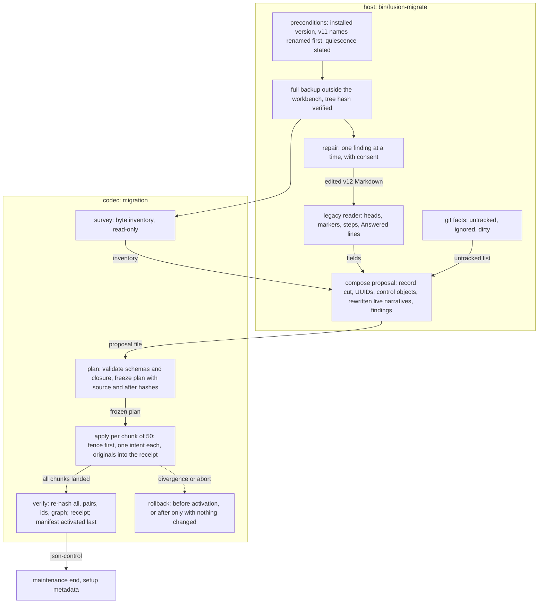
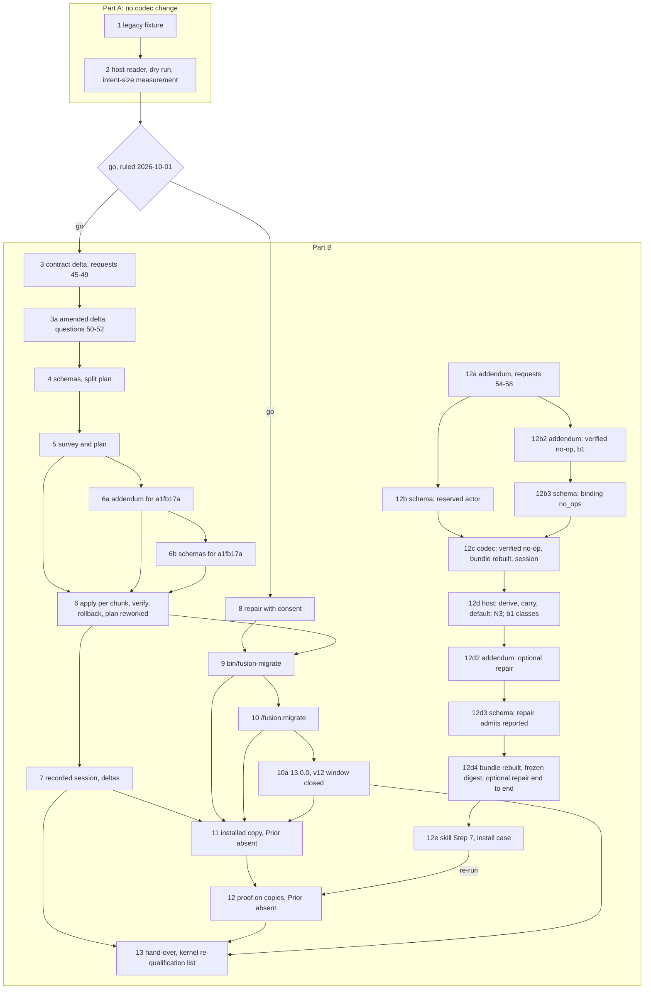

# Implementation Plan: FJ04. A legacy v12 workbench migrates to JSON control, implemented and proven on copies

**Date:** 2026-10-01
**Status:** Approved 2026-10-01 by the user, with the four decisions answered as recommended and six changes. Amended four times, each amendment approved. 2026-10-02 for Prior `a1fb17a` and the rulings on discussion 261002-1236: approved by the user on 2026-10-02. 2026-10-03, derive and carry as unknown: on the user's answer to decision 261003-1746 (option 1, the reserved actor `legacy-unknown`, built without waiting for Prior). 2026-10-03 for the user's rulings a1 and b1. 2026-10-04 for decision 261003-2045, answered option 1 by the user. The plan approval of each of the last three is logged as answered by **Mode:** autonomous on the work package. Every step is `[DONE]`, step 12's re-run (`86425584`) and step 13's hand-over (`9232314a`) included. The two defects that the re-run and step 12e surfaced are fixed (`8e4ef9a0`, `7713c679`); neither changes `codec/src` or the bundle, so step 12d4's frozen digest `575aec47…` stands. Before closure: Prior's answers to requests 54 to 58, and its re-pin and conformance run (requests 59, 60). `## Where this work stops` names these as preconditions for the real migration, not claims of this plan.
**Spec:** none as a requirements-designer spec. Prior's `concept/fusion-json-workbench-spec.md` at Prior `590465d`: §2.1 and §2.2 (what converts), §3 (layout, archive boundary, identities), §4.1 to §4.3 (manifest, packages, records), §6 (the `migration` row), §8 (the maintenance run), §9 (FJ04's row and the mandatory checks). Order: request 26 (`Prior: docs/design/fusion-fj03a-followup-decisions.md` `## 26.`). Next step named by Prior: `Prior: docs/design/fusion-archive-correction-prior-response.md` `## Next work`.
**Cross-references:** 260928-1338-json-control-data-and-markdown-artefacts.md, 261001-1030_*_plan-the-archive-revision-archive-leaves-json-control-and-json-archival-follows-its-qualification.md (method; its step 13 finishes before this plan's step 4 moves the bundle), 260930-1654_*_plan-initialize-the-codec-creates-a-new-workbench-and-list-names-its-state.md (method), 260929-1810_*_in-which-order-do-the-parts-of-fj03-and-fj04-land-while-fusions-own-workbench-is-still-in-the-v12-form.md, 260929-1810_*_does-the-2026-09-27-ruling-on-the-growth-bound-reach-the-hook-tests-and-shipped-text-fj03-changes.md, 261001-1804_*_which-markdown-artefacts-become-records-when-a-legacy-workbench-migrates.md, 261001-1804_*_where-does-the-legacy-markdown-reader-live-and-what-does-the-codecs-migration-operation-take.md, 261001-1804_*_what-stable-step-anchor-does-an-imported-plan-carry-and-which-criteria.md, 261001-1804_*_how-are-legacy-values-with-no-v1-counterpart-mapped-at-import.md, 261002-1236_*_does-priors-a1fb17a-contract-govern-c8-c16.md, 261003-1004-fj04-step12-proof-on-copies-of-real-workbenches.md, 261003-1746_*_how-does-an-imported-record-carry-a-filer-its-legacy-workbench-never-recorded.md, 261002-2128_*_should-a-second-run-no-op-plan-stay-a-later-operation-that-blocks-rollback.md, 261003-1906_*_the-legacy-composer-reports-two-finding-classes-the-confirmed-contract-makes-blocking.md
**Planned against:** fusion `15e4d52e`; bundle 543 227 bytes, `sha256:6b26faf2b0f9389fcbb4df1a3dd23881d2ff76cb2cab4c918f2bf969a597b0bf` (request 44, qualified by Prior at `590465d`). Growth room as dispatched: hook tests 0 lines, skills about 18 KB; each step re-reads both from `hooks/lib/__tests__/surface-growth-bound.test.ts`.
**Growth bound:** the user's ruling of 2026-10-01, given with this plan's approval, extends `260929-1810_*_does-the-2026-09-27-ruling-on-the-growth-bound-reach-the-hook-tests-and-shipped-text-fj03-changes.md` to FJ04. Retired tests are replaced first. `TEST_LINE_HEAD_ROOM` (and the skills head-room) is then raised by exactly the measured remainder, and each raise is logged in `README-hooks.md` `### Growth bounds on the shipped text` with its figure before and after. No baseline moves.
**Confidentiality:** axibra-1, and krk while it counts as another team's project, may be copied to scratch and measured. Every report (analyses, `REQUESTS.md`, step notes, commit messages) carries aggregate figures only for them: no file name, no content excerpt. fusion's own workbench may be named. Copies named by the user on 2026-10-01: `/Users/kai/Projects/productive/F03_digital-leadership/axibra-4` or `/Users/kai/Projects/productive/F08-KRK/krk` (read-only, copied to scratch); axibra-4 replaces axibra-1 where the steps name it; aggregate figures only for both.
**Amendment (Prior ab9cb59):** Prior accepts the core and requires precisions before the schema step. They are recorded in `## Amendment for Prior` `ab9cb59`, which governs steps 3a to 13 where a step's text differs; contradictions C1 to C7 were ruled by the orchestrator, not the user (the event log carries no user response on them), and questions 50 to 52 go out in step 3a. Contradictions C1 to C7 ruled 2026-10-02 by the orchestrator: Prior's contract governs each (C1 one freeze intent where the measurement allows, else request 50; C2 metadata moves out of the index; C3 the departure is corrected; C4 inspect gains the pending variant; C5 the identity offer for a missing actor is dropped; C6 rollback restores the post-repair state and the backup gets its own host restore path; C7 the duplicate-step repair rewrites the ambiguous citations it lists).
**Amendment (Prior a1fb17a):** Prior accepts 50 (conditionally, and not needed here), 51 and 52, and requires four corrections before the affected schema and code steps. These are recorded in `## Amendment for Prior` `a1fb17a`, which governs steps 6 to 13 where a step's text differs. Contradictions C8 to C16 ruled 2026-10-02 by the user: Prior's contract governs each, and C9 is settled by option 1. The contract text changes, so step 6a appends a short addendum to `REQUESTS.md` and step 6b reworks the schemas. Both come before step 6 resumes.
**Decidability:** Three questions. **(1) Which Markdown artefacts become records?** Once a rule is fixed, it is decidable from the files: marker, store, container head and the structural head fields are all on disk. *Which* rule is not decidable from the texts: §2.1's "höchstens extrahierte Metadaten" permits a `legacy-terminal` pair and permits none. That choice is decision 261001-1804 (record cut), recommended option 2: every package, every live record, and a terminal record only when a `record_ref`-only field of a record names it. Measured: 104 of 1 219 records here (`15e4d52e`), 638 of 1 570 in axibra-1, 148 of 1 153 in krk. The codec's `plan` phase checks the closure, so the rule's completeness is a refusal, not a hope. **(2) Is the run atomic and resumable?** Yes for every codec writer, by a mechanism already qualified. `apply` uses kernel intents carrying the pre-hash and post-bytes of every write. Part A measured one intent over the largest copy at about 28 s, so `apply` runs as chunked intents of 50 writes under one fence, one request each. Recovery rolls each chunk forward at any cut, `resume` sends the next missing chunk, and a diverged file blocks it rather than being overwritten. Activation is a separate last write, the manifest's atomic rename. **Not decidable:** whether an old v12 client edits Markdown during the run. No file the codec writes can stop a program that never reads it (§8.1). The mechanism therefore detects instead of predicting. Source hashes are frozen in the plan, and the intent's pre-hashes and `verify`'s full re-hash compare them against disk. A difference stops the run before activation, and quiescence stays a stated precondition. After activation nothing detects a Markdown write from a checkout still on a v12 install: only Prior §8.1's procedure prevents it, every writing installation updated first (discussion 261002-1236, C23, C25, C27). **(3) Is the proof on copies sound?** Yes, by comparison. Each real workbench is copied to scratch, and the source tree hash is taken before and after. Every figure is taken on the copy. **(4) Amended 2026-10-03: which value of a blocking finding can be derived, and which must be asked?** Per class, decidable from the inputs the host has. The person who filed a record is decidable from git: the author of the commit that first added the file, followed through renames. It is undecidable for an untracked file, in a directory with no repository, and in a shallow history. The actor is undecidable from every input the host has. The intended step of a stray or duplicated mark is undecidable from the plan's text. An approximation would be a guess, so the mechanism changes from asking to carrying: an undecidable value is carried as unknown, or as a stated default that no live state depends on, and its rule is written into the control file. Only what §8.2 forbids to default (a state, a claim, a live dependency, which of several plans is active) stays a question. **(5) Amended 2026-10-03 for ruling a1: is a stored answer a verified second-run no-op of this migration?** Decidable from the stored answer and the frozen plan, with no sequence or time needed. The answer's result has the no-op shape with `no_op: true`. Its request digest reconstructs as a `plan` request under its own id with the index's exact proposal. Its receipt and manifest revision equal the ones the first rollback after activation verifies. The no-op shape comes only from the codec's no-write second-run branch (`codec/src/migration.ts:758`, the only place that writes `no_op`; step 12c checks this again by `grep`). The audit still re-reads every stored answer, so a no-op hides no ordinary work.

## Directive

Implement the composite migration of section 8 for a fusion v12 workbench (and a v11-named one, through the existing store rename first) and prove it on copies of real workbenches: fusion's own and at least one consuming project's, read-only, copied to scratch. The proof covers inventory and exact-byte backup, explicit field and id mapping, interrupted-apply recovery, a repeat run that is a no-op, referential integrity and rollback (Prior, `## Next work`). The real migration of this repository is not part of this plan. It belongs to FJ03d's maintenance window with the installation (request 26). No file under `agents/`, `rules/` or `docs/` changes, except by step 10a, which carries the closing of the v12 window (option 1, ruled 2026-10-02 by the user; `## Open Questions`). fusion stays operable directly in Claude Code, with no Prior installation, service or credential at runtime, migration included (the user's criterion of 2026-10-02).

## Current State

- **Codec.** `migration` is the one deferred operation. `inspect.operations.deferred` is `["migration"]`. The protocol branch takes `{op, workbench, phase: survey|plan|apply|verify, plan}`, with no `operation_id`. Prior's FJ02 adapter sends `migration` with `phase: survey` and expects `operation-unknown/not-implemented`. `initialize` refuses any non-empty target, legacy Markdown included, and leaves it byte-identical (request 27). `maintenance begin` admits only `json-control`. The kernel's journal (`codec/src/journal.ts`) already commits multi-file intents with pre-hashes and post-bytes, recovers them, and blocks on divergence. `provenance` admits `imported` and `legacy-terminal`, each requiring `backup`. `resolveArtefact` reads hash-bound files under `archive/`.
- **Host.** The FJ03a to FJ03c helpers read only JSON. No Markdown head reader survives in `hooks/lib/` (`scope.ts` and `work-graph.ts` say so in their headers). `/fusion:migrate` renames the v11 stores only and refuses pre-v4 shapes. `bin/fusion-archive` holds archive units under the fence.
- **Measured data** (2026-10-01; commands in step 2's note):

| Workbench | Layout | Records (live) | Packages |
|---|---|---|---|
| fusion `15e4d52e` | v12 | 1 219 (104) | 18 item records, 24 Circle `circle.md`, 4 empty trees |
| axibra-1 `e6678b530` | v12, `circles/` still holds 2 | 1 570 (638) | 110 + 2 |
| krk `f87d8c6` | v11 names (`circles/`, `planning/`) | 1 153 (148) | 27 Circle containers |

  Also: `history/` 994 files here (stays plain, §2.2), `archive/` 607 Markdown files. Terminal values with no v1 state exist: plan `_s_` (axibra-1: 5) and Circle `_b_`/`_d_`.

## Approach

**One integral mechanism: the host reads, the codec writes** (decision 261001-1804, reader placement, recommended option 1). The host owns the v12 grammar, which is fusion's own format and nobody else's. It owns the git facts too. It composes a mapping proposal. The codec owns every write, by the kernel's journal, so atomicity and resumption come from a mechanism Prior already qualified. Nothing is predicted. Everything is compared by hash.

**The phases, as the contract delta proposes them (request 45; chunked per step 2's measurement):**

| Phase | State admitted | Writes | Answer |
|---|---|---|---|
| `survey` | legacy, json-control | nothing | every file with size, sha256 and kind, `.json-state/` entries, intents, `archive/` as history |
| `plan` | legacy | `archive/migrations/<id>/plan.json` (index) and `chunks/<n>.json`, each under 1 MiB | migration id, chunk ids, counts, refusals typed |
| `apply {chunk}` | legacy; chunk 1 writes the fence, every later chunk runs under it | one intent of at most 50 writes: originals to `archive/migrations/<id>/originals/`, control files, rewritten live narratives | revisions; a replay answers the stored bytes |
| `verify` | legacy, fenced, every chunk landed | the receipt, then `workbench.json` with `migration: {id, source_layout, receipt}` | checks, counts, the manifest revision |
| `rollback {chunk}` | fenced, chunks in reverse; json-control only when every file hashes as the receipt's after-state | one intent per chunk restoring originals; the last removes plan files and the fence | what was restored |

- **Requests carry `operation_id`; each chunk has its own, fixed in the index.** The proposal and the plan travel by path, never on stdin: a request stays under 1 MiB, an answer under 16 MiB (request 31). Step 2 measured one intent over the largest copy at about 28 s and a 50-write chunk at 1.45 s max. Each request therefore fits the client's 5 s post-wait allowance, and the timeout is never raised.
- **The frozen plan fixes everything a resume needs:** the workbench and record UUIDs, every chunk's operation id, every source sha256 and after-hash, and the repair log. `resume` sends the next chunk whose answer is not stored.
- **`plan` refuses** a schema-invalid target, a duplicate UUID, a source hash differing from disk, an unresolved structural reference (the closure), an open blocking finding, and a present manifest.
- **Exclusivity.** Chunk 1's fence refuses every fresh codec mutation until the host's `maintenance end`, which comes after setup metadata (§8.3.5). A crash in between leaves a fenced store that `inspect.maintenance` names; `bin/fusion-migrate resume` finishes it.
- **Repair before freezing** (step 8): a blocking finding is resolved only by a v12 Markdown edit the user consented to, finding by finding, after the external backup and before `plan`. Nothing is guessed, and a class without a repair stays blocking.
- **Second run.** Every request with a stored answer replays it. `plan` on a store whose manifest names a receipt answers that receipt as a no-op (§8.3.7). Amended 2026-10-03 (ruling a1, Prior `d0fce6c`): a verified no-op of the same migration does not by itself block a later rollback (step 12c).
- **What the codec cannot judge:** a mapping's meaning. Host tests per legacy shape and the proof on copies, read back through the shipped readers, cover it.

**The record cut** (decision 261001-1804, record cut, recommended option 2):

| Artefact | Becomes | Markdown |
|---|---|---|
| item record or Circle head of every container (§2.1) | `package.json`, `imported` when live, `legacy-terminal` when terminal | live: control head fields removed, held verbatim in `legacy_fields`; terminal: byte-identical |
| issue, plan, discussion with `_o_`/`_p_`; decision with `_o_`/`_a_` | `<name>.record.json`, `imported` | control lines removed (plan `**Status:**`, step marks); `Answered:`/`Resolved:` prose stays |
| terminal record named by a `record_ref`-only field of a record above | `<name>.record.json`, `legacy-terminal` | byte-identical |
| every other terminal record, `history/`, reviews, analyses, memos, `archive/` | nothing | unchanged; legacy citations keep resolving |

Filenames keep their markers (§3). A terminal package's document bindings stay in `legacy_fields` and pull nothing in. Legacy values with no v1 counterpart follow decision 261001-1804 (legacy values). Step anchors follow decision 261001-1804 (step anchors).

## Amendment for Prior `ab9cb59`

Source: `Prior: docs/design/fusion-fj04-contract-prior-response.md` at `ab9cb59` (2026-10-02). It accepts the split (host reads, codec writes), chunks of at most 50 writes, the split plan, the record cut (46 a), the Circle map (47), anchors (48) and the answer references (49 a, b). It amends the phase and recovery contract before the schema step. Prior's pins stay at `e1bafd2f` until step 13. Where this section and a step's text disagree, this section governs. The step notes already written stay as they were written.

**New step 3a (`analyst`), before step 4's rework.** It appends `## FJ04 (the contract delta, amended for ab9cb59)` to `REQUESTS.md`. That section freezes the request and response shapes, the `pending` union, error precedence, the journal's removal format, plan freeze and cleanup, and questions 50 to 52 below. It is drafted in the scratchpad and appended by the orchestrator. Dependencies: step 3. Steps 4 to 6 build against it.

**Step 3a [DONE].**
   - Done (2026-10-02, analyst; drafted in the scratchpad, to be appended by the orchestrator, uncommitted). `## FJ04 (the contract delta, amended for ab9cb59)` is drafted as a pure append to `codec/fixtures/prior/REQUESTS.md`. In `scratchpad/REQUESTS-fj04-step3a.md` it starts at line 1600, with line 1599 blank, and runs to line 1900. The first 1 598 lines hash `sha256:335e612b…4020`, equal to the blob at `4ef69265`. It is stamped against fusion `4ef69265` (`git diff --stat 65700dd5 4ef69265 -- codec bin hooks` is empty, and `65700dd5` is the commit Prior reviewed), Prior `ab9cb59` (`git log --all --oneline ab9cb59..` empty), and the bundle `sha256:6b26faf2…b0bf`, 543 227 bytes, re-hashed from the blob. It does not rest on the uncommitted step 4 and 5 files.
     - **What it holds.**
       - A table mapping each ruling to fusion's answer, and the status of step 3's nine departures: (7) and (8) withdrawn.
       - The files of one migration: an index holding only identity, `proposal {path, sha256}`, `exclusions`, the operation schedule and `{part, n, path, sha256}`; numbered parts for the records and counts, the inventory, the findings and the repairs; and the receipt binding the parts by hash, with `after_inventory_sha256` and `manifest_revision`, the manifest naming it by path only.
       - The id schedule: plan, apply, verify and rollback ids frozen in the proposal, surplus ids `unassigned`.
       - Exclusions: a rule plus a frozen list.
       - The request and answer shapes of all five phases, `survey`'s entry forms included.
       - The `pending` union.
       - Who finishes a migration intent: only its own request.
       - The order under the lock: a common prefix, then the per-phase precedence table.
       - The second-run no-op with its receipt checks; progress by scheduled ids plus byte rechecks.
       - The one-intent plan freeze with its bound.
       - The inventory rechecks.
       - The journal's removal entry.
       - Rollback: the restore order, the post-activation baseline, chunk 0's evidence, `maintenance end` on legacy, the expected empty directories, and `bin/fusion-migrate restore-backup`.
       - 46 to 49 as ruled.
       - The amended repairs (C5, C7, the terminal-record ruling).
       - The reason list.
       - The recorded cases.
       - What step 6 measures.
       - Questions 50 (conditional), 51 and 52.
     - **Checked by command for this text.** `git grep -l` at `4ef69265` over `codec/src`, `codec/contract`, `codec/schemas`, `codec/fixtures` and `hooks/lib` finds none of the eight new reason names, nor `active-document-role-conflict` or `plan-staged`. `referenceSites` is at `codec/src/cli/ops.ts:1948`, pinned by the `ops.test.ts` case at line 2797. `Write` is `{path, before: string | null, after: string}` (`codec/src/journal.ts:54`). `PendingInitialize` is `{operation_id, id, blocked}` (`codec/src/cli/ops.ts:410`). `commitIntent` caps each write and `intent.json` at 1 MiB (`journal.ts:139`, `:145`). The manifest's `migration` object is `{id, source_layout, receipt}` with the receipt by path (`codec/schemas/workbench.schema.json`).
     - **Confidentiality.** The other two projects appear only as the second and the third workbench, in aggregate figures. `grep -i` for their names and directories over the section finds none, and no commit hash of theirs appears.
     - **Departures from the plan's text, each stated in the section.**
       - (1) `conflict/chunk-id-mismatch` is renamed `conflict/operation-id-unscheduled`, since verify and rollback ids are now scheduled. The uncommitted `codec/schemas/protocol.schema.json` names the old reason and is reworked in step 4.
       - (2) Seven reasons beyond step 3's are new: `intent-pending`, `plan-too-large`, `receipt-unverified`, `check-failed`, `pending-migration-unreadable`, `pending-migration-ambiguous` and `migration-pending`, the last as the per-path problem a read reports for an untouched migration intent. `plan-staged` appears only inside question 50.
       - (3) The plan named exclusions only as `.json-state/` and the migration's own files. The section adds a frozen list of workbench-root entries under a rule, because the host's hooks append to `orchestrator-events.jsonl` during the run and section 8.3.5 rewrites `.fusion-setup` after `verify`. Without it, chunk 1's full recheck would refuse any run started from a fusion session. This is drafted, not measured, and is new to Prior.
       - (4) The codec, not the proposal, takes the inventory frozen at `plan`.
       - (5) The receipt drops step 4's inline `repairs` and `findings` and gains `parts`, `verify_operation_id` and `after_inventory_sha256`.
       - (6) The `verify` answer gains `plan` so that the pending variant is reconstructible.
       - (7) Question 52 is sharpened: the first rollback derives the exempt set by rule (this migration's `verify`, the `end` naming chunk 1's fence, the standing `begin`) and binds it in `rollback.json`.
       - (8) The rollback removes no directory. The empty bookkeeping directories it leaves are named.
       - (9) The duplicate-number repair asks the owner which step each ambiguous citation means.
     - **Rework this sets for step 4**, from the uncommitted files:
       - protocol `proposal` and `plan` as `{path, sha256}`;
       - the index slimmed, with the part shapes `records`, `inventory`, `findings` and `repairs`, `chunks` named as parts;
       - the receipt as above;
       - the proposal's `operation_ids` as an object `{plan, apply, verify, rollback}`, plus `exclusions`;
       - an `inspect` answer schema admitting the pending variant;
       - the invalid fixtures that name the renamed reason or the inline index fields.

| Ruling | Step | Change |
|---|---|---|
| 45(a) hash binding | 4 (rework of the uncommitted files) | `plan` takes `proposal: {path, sha256}`; `apply`, `verify` and `rollback` take `plan: {path, sha256}`. The request digest covers both. |
| 45(a) hash binding | 5, 6 | Refusals: `conflict/source-changed` (proposal), `schema-invalid/proposal-invalid`, `conflict/plan-file-changed` (index or shard). Reuse keeps `operation-id-reused` precedence. |
| 45(a) split everything | 4 | The index stays under 1 MiB by holding only identity, `source_layout`, the operation schedule and `{path, sha256}` of every shard. New shard parts: the UUID map, the frozen source inventory, findings and repairs, alongside the write chunks. The receipt refers to shards by hash instead of copying them. It keeps `manifest_revision`, while the manifest names the receipt by path only, so neither hashes the other. |
| 45(a) one freeze intent | 5 | Plan files are frozen in **one** bounded intent when the step-5 measurement on the largest copy fits the 5 s allowance and every journal file's limit. Otherwise question 50 is answered before any multi-request path is built. An unsupported size is refused before anything is published. |
| 45(b) fence and inventory | 6 | The fence admits only this migration's next validated phase or chunk. An unrelated pending intent is settled or reported before chunk 1, and ordinary recovery never completes an activation. Chunk 1 rechecks the whole frozen inventory under the lock: added and removed files and changed kinds as well as hashes. Later chunks and `verify` compare against the intermediate or final state. The exclusions (`.json-state/` bookkeeping, this migration's own artefacts) are listed explicitly. |
| 45(b) measurements | 6, 12 | Worst-chunk recovery, the plan freeze and `verify` are measured on the copies, including process start and the real client deadline. The 0.7 s recovery figure is withdrawn as evidence. |
| 45(c) survey | 5 | `survey` reports pending or unreadable local state without completing it. It lists links as links, unfollowed, and states how directories and link targets appear. An answer over 16 MiB is refused, never truncated. |
| 45(d) pending verify | 4 (`inspect` answer schema), 5, 6 | A second `pending` variant `{op, phase, operation_id, id, migration_id, plan, blocked}`. The `initialize` object stays byte-identical. Reads, and other mutations' recovery loops, leave a committed verify untouched at every cut (before the receipt, between receipt and manifest, after the manifest but before the answer). Only its own request recovers it. |
| 45(d) state gates | 5, 6 | Replay and recovery are decided before the legacy-only gate. `verify` replays and resumes after its manifest landed, and `apply` replay stays identifiable after activation or rollback. Recorded cases cover the precedence. |
| 45(e) removals | 6 | `after: null` removes a regular file, with a non-null before-hash, an entry-aware check (a dangling link is not absence), parent fsync and idempotent recovery. A null-to-null write is refused. |
| 45(e) rollback | 6 | Originals are restored before their backup is removed, and only files this migration created are removed. "Still landed" is tracked by progress, not by stored answers, and an old replay after rollback recreates nothing. After activation the check compares against a baseline that exempts only named administrative operations by id and digest (question 52). Any ordinary work, added or deleted files, or an edited unconverted narrative refuses the rollback. The fence stands through every reverse chunk. |
| 45(e) `maintenance end` | 6 (codec, `maintenance`'s gate) | `end` is admitted on a legacy store for the matching migration fence after a complete rollback, its replay included, verified from evidence that survives chunk 0 (question 51). A full abort before chunk 1 needs no fence. Cleanup order and the expected directory inventory (original empty trees kept; permitted bookkeeping directories named) are recorded. |
| 45(f) ids | 4 (proposal), 9 | The proposal freezes every id before dispatch: chunks, `verify`, rollback chunks and cleanup. They are distinct and not reused; the host keeps them where `resume` reads them, and `resume` checks progress and bytes, not replay alone. |
| 45(g) deletions | 5 | Ranges are ordered, non-overlapping and in bounds, and produce the after-hash. Anything else is refused before any write. |
| 45(h) proposal cap | 5 | As built: `strictParse` with a `cap` of 16 MiB for the proposal only. |
| 46(a) closure | 5 | The codec derives the closure from every `record_ref` position the schemas define (the enumeration `reconcile`'s site test already pins), not from four named fields. Foreign references stay foreign. A required target with no v1 state blocks. |
| 46(b), 46(c), 47 | 8, 9 | Confirmed as proposed. Hidden files and links make a container non-empty. A `_d_` Circle repaired to `paused` carries no outcome. |
| 48 acceptance | 8 (reader fixes in `legacy-import.ts`), 5 | The acceptance revision is the accepted narrative's after-rewrite hash, written for role `spec` too; the composer's `adoptedBy` loop covers `plan` only. `plan-adopted-twice` becomes blocking. Code-fenced examples are excluded from the step grammar. The codec checks acceptance against the package's active-document entry. |
| 49(c) roles | 8 | A clause and a stem that disagree block (new class `active-document-role-conflict`), replacing `clause ?? stem`. Amended 2026-10-03 (ruling b1): the class is added in step 12d, `reported`, and carried as a reference under request 58. |
| Repairs | 8, 10 | A duplicate-number repair edits the ambiguous citations as part of the consented edit. Moving a binding to `**Cross-references:**` is named as a change of meaning. |
| Recorded cases | 7 | Prior's list: changed proposal or index, interrupted freeze, apply across activation, every verify cut with pending reconstruction, removal divergence with a dangling link, full rollback before and after activation, maintenance answers during rollback, refusal after ordinary work, cleanup with legacy `end`, and a verified second-run no-op (receipt identity, integrity and availability checked, never a reapplied plan). |

**Contradictions with what is decided or built, named for the user's ruling:**

- (C1) **Step 5's approved "plan intents for more than 49 chunks"** contradicts 45(a)'s single bounded freeze intent. Proposed: drop it, measure one intent, and fall back to question 50 only if the measurement fails.
- (C2) **Step 4's index** carries `records`, `repairs` and `findings` inline. 45(a) requires them as shards; step 2 measured about 969 KB for that metadata. Rework in step 4.
- (C3) **Step 3's departure (8)** ("no unnamed control file or stored answer" after activation) would refuse the legitimate `maintenance begin` answer. Replaced by the baseline in 45(e).
- (C4) **Step 3's text** said `inspect` gains no field, yet a committed verify must be reconstructible. Replaced by the 45(d) variant.
- (C5) **Step 8's offer** of the current `PERSON=` as a choice for a missing `**Filed by:**` conflicts with "missing historical attribution must not be replaced by the current repairer's identity". Proposed: drop the offer. The actor is asked, and the person may stay null.
- (C6) **Steps 9, 11 and 12** test "a full rollback restores the backup's tree hash". 45(e) has a pre-activation rollback restore the frozen **post-repair** input, which equals the backup only when nothing was repaired. Proposed: acceptance against the frozen inventory, with restoring the external pre-repair backup as a separate host path (`bin/fusion-migrate restore-backup`), tested apart.
- (C7) **Step 8's duplicate-number repair** only *lists* the in-file citations. Prior requires them settled in the same consented edit.

The record cut (46 a) and the terminal-import gap (46 b: confirmed absent in FJ04) agree with what is decided.

**Questions back to Prior, carried in step 3a:**

- **50** (conditional). If one freeze intent does not fit on the largest copy: the multi-request publish protocol (caller ids, cursor, final index commit, detection of a partly staged plan). Sent only if step 5's measurement fails.
- **51.** The evidence that lets `maintenance end` on a legacy store verify a complete rollback after chunk 0 removed the index. Proposed: the stored answer of rollback chunk 0 names the migration id, the index sha256, the fence id and a digest of the completed rollback progress, and `end` checks that answer.
- **52.** Where the administrative exemptions of a post-activation rollback are bound. Proposed: in the rollback's own frozen schedule, written by its first request and listing each exempt `{operation_id, request digest}`, rather than in the request.

## Amendment for Prior `a1fb17a`

Source: `Prior: docs/design/fusion-fj04-amended-contract-prior-response.md` at `a1fb17a` (2026-10-02). It reviews `REQUESTS.md` `## FJ04 (the contract delta, amended for ab9cb59)` as committed at `5a406417`. Prior writes: "Fusion can proceed on that basis; these decisions do not require another user choice or a different migration design." The qualified bundle stays `e1bafd2f`, `sha256:6b26faf2…b0bf`, as the last qualified one: HEAD's bundle (`sha256:c30b018b…`, step 5) and the held-intent mechanism it carries are unqualified (discussion 261002-1236, C11). Where this section and a step's text disagree, this section governs; it also governs the `ab9cb59` amendment above where the two differ. Step notes already written stay as written. The paused work on `wip/fj04-step6` (`82cdd208` on `e5a476bc`) was read by `git diff fj-json-workbench...wip/fj04-step6 -- codec/` only, and was never checked out. Every statement below about that work cites the function it names in `codec/src/migration.ts` or `codec/src/kernel.ts` on that branch.

**The answers to 50 to 52.**

| Question | Prior's answer | Conditions | Steps |
|---|---|---|---|
| 50 | Yes, but only if one freeze intent or the cleanup does not fit | Bind the staged transaction before the first part; one request, one intent; final publication bounded; survey identifies and resumes an unfinished freeze; freeze the continuation and abort shapes before coding. "Publish the measurements and selected bounds." | Not used: step 5 measured one freeze at 1.32 s max. Step 6 measures the chunk-0 cleanup. Step 6a publishes step 5's figures and bound, and step 13 publishes step 6's. If the cleanup does not fit, step 6 stops and this plan is amended before any multi-request path is built. |
| 51 | Yes. The stored chunk-0 answer is enough; no file is kept under `archive/migrations/<id>/`. | The answer carries the exact ordered `progress` list `{chunk, operation_id, request_digest}`, covering the applied prefix and ending at chunk 0, with `progress_sha256` over its canonical bytes. It is built only after no chunk remains landed and the eligible inventory equals the frozen input, and each listed answer is validated. A fresh legacy `end` needs the completed stored answer, no pending cleanup intent, verified progress and the matching standing fence. A replay of `end` comes from its own stored answer. Cover the crash after chunk 1's fence and before its intent. | 6a, 6 (W6), 7 |
| 52 | Yes. The codec derives the exemptions and freezes them in `rollback.json`; no caller list. | (1) An operation baseline frozen at `plan`, not an inferred chronology, and the same definition for `later_operations`. (2) The `rollback.json` bytes bound by `{path, sha256}` in the first post-activation rollback answer, and the file records migration, plan and rollback fence. Exempt requests are reconstructed and their digests compared. (3) Replays never read the file. In addition, `after_inventory_sha256` describes the activated tree, the manifest included. | 6a, 6b, 6 (W3 to W5) |

**The four requirements before implementation.**

| Requirement | What Prior requires | Steps |
|---|---|---|
| (R1) Exclusions limited to fixed operational paths | A fixed, versioned codec allowlist with entry kinds. Files: `.session-marker`, `.checkout-id`, `.cadence-anchors`, `.check-stamps`, `monitor`, `orchestrator-events.jsonl`, `.fusion-setup`, `.asset-provenance`. Directories: `.guard-state/`, `.commit-lock/`. The host may choose a subset and never add to it. The protected-root and no-record-overlap checks stay. An entry may appear and disappear in its allowed kind. A changed kind or a link is never exempt, and an excluded link is never followed. No wildcard. `workbench.json` stays protected. Excluded data is neither restored nor deleted by rollback. | 6a, 6b, 6 (W1), 9 |
| (R2) The originally observed inventory bound | The proposal gains `source_inventory_sha256`: the host's observed **eligible** inventory, taken after the consented repairs and before composition, in the codec's canonical entry forms, bytewise order and exclusion policy. `plan` recomputes it under the lock before publishing; any difference is `conflict/source-changed`. The frozen plan keeps it. Expected intermediate states account for exactly the bookkeeping parent directories the migration creates. | 6a, 6b, 6 (W2), 9 |
| (R3) The rollback operation basis stored explicitly | The stored-answer set is frozen under the plan lock in hash-bound parts (id, request digest, sha256 of the stored answer bytes), and the index and the receipt bind them. Later operations are found by set difference against that baseline and this plan's validated scheduled operations. A missing or changed baseline answer refuses. | 6a, 6b, 6 (W3) |
| (R4) Recovery and replay after cleanup | The prefix step 3 text excludes `initialize` from the migration recovery loop, as the code already does. Before any migration recovery takes effect, both the operation id **and** the request digest must be equal. The apply answer keeps the established envelope, with `revisions` beside `result`, not inside it. Replays of `end` and of historical apply, verify and rollback come from stored answers and need no plan files. | 6a, 6 (W6 to W8) |

**The repair conditions Prior restates.** (a) A historical answer that is missing **or empty** blocks. (b) Consent and provenance also cover a historical actor that is supplied only to a control record, as for the terminal closure record of the 2026-10-01 ruling. (c) The duplicate-anchor repair settles the known ambiguous citations, including known incoming citations from other documents. Steps 9 and 10 carry all three.

**Prior's evidence list** (its `## Evidence for the eventual handoff`) goes into step 6's tests. The cases the recorder can express also go into step 7's session. The timings go into steps 6 and 12.

**How steps 6 onward change.**

| Step | Change |
|---|---|
| 6a (new, `analyst`) | `## FJ04 (addendum for a1fb17a)` in `REQUESTS.md`: the contract text this amendment changes, nothing else |
| 6b (new, `data-implementer`) | The schema rework: `source_inventory_sha256`, the allowlist enum, the `answers` part and the `rollback-binding` shape. All of it lives in the existing plan and proposal schemas, so no new schema id is added and no recorded `inspect` answer moves. |
| 6 | Rewritten below. Resumes from `wip/fj04-step6` and makes the changes W1 to W10. W1 to W3 also rework `plan`, which step 5 committed. |
| 7 | Also records: a rejected arbitrary exclusion, a link in place of an allowed operational entry, an eligible file added between composition and `plan`, an altered `rollback.json`, a replay after its removal, and legacy `end` with its replay and old migration replays after cleanup |
| 9 | The host sends `source_inventory_sha256` (as C9 is ruled) and selects the whole allowlist. The reader blocks an empty answer line. A control-only actor is logged in the repair log with its consent. The duplicate-anchor repair settles incoming citations (C16). |
| 10 | The skill puts the incoming-citation question and the control-only actor question to the user, one finding at a time, as for the others |
| 12 | Also measures the chunk-0 cleanup and the first rollback after activation with its baseline, per copy |
| 13 | Carries 50 to 52 as answered, the freeze and cleanup bounds with their measurements, and the a1fb17a evidence cases |

**Contradictions with what is decided or built.** **Ruled 2026-10-02 by the user, in chat, after the discussion 261002-1236 closed: Prior's contract governs each of C8 to C16, and C9 is settled by option 1** (`survey` answers `eligible_sha256` and the host copies it into the proposal). The discussion's grounds: C1 (C8), C2 (C9), C6 (C13), C9 (C16), C10 (C10); none of the rulings makes fusion depend on Prior at runtime (C18, C24). The text of each item below is kept as it was put for the ruling; "Proposed" now reads "Ruled". The meaning of *known* in C16 stays the plan's inference (the discussion's C9 and C12); asking Prior is request 53, an available follow-up (`## Open Questions`).

- (C8) **Exclusions.** Step 3a's contract (a rule plus a frozen list), step 4's schema (any single root name except four protected ones) and step 5's committed `plan` check (`proposal-invalid` on that rule) all admit any root name. The WIP's `eligible()` skips an excluded name whatever its kind. Prior (R1) admits only the ten allowlisted entries, each in its kind. Proposed: Prior governs, and fusion's host always selects the whole list. Checked by `ls -a fusion-workbench` at this checkout: outside the stores, the root holds the allowlisted entries plus `orchestrator-live.md` and `stilwerk/`. Nothing writes `orchestrator-live.md` (`rules/workbench-tracking.md:32`), and `stilwerk/` holds the seeded voice profiles. Both stay eligible.
- (C9) **"The proposal carries no inventory"** (`REQUESTS.md:1788` and step 4's proposal note) against R2's commitment. Taking the hash is not in dispute; *who computes it* is open, because the host must reproduce the codec's canonical form exactly. Option 1 (recommended): `survey` also answers `eligible_sha256`, computed by the codec over the whole allowlist, and the host copies it into the proposal. One canonical implementation, and fusion's host always selects the whole list (C8). Option 2: the host recomputes the digest in `hooks/lib/` from survey's entries. This is a second canonical implementation; a mismatch fails safe as `source-changed`, but it would be a false refusal. Option 1 changes survey's answer, so it goes into 6a.
- (C10) **Answer chronology.** `REQUESTS.md:1806` says "every operation answer stored after `verify`'s". The WIP's `auditAnswers` admits every `migration` answer but a no-op **by its op name**, and refuses every non-scheduled answer that predates the migration. The WIP README states this as residual (1): a store migrated twice refuses. Step 5's committed `laterOperations` infers "after the receipt". Prior (R3) shows the chronology is undecidable from stored answers, which carry no sequence or time, and changes the mechanism to a baseline frozen at `plan`. Proposed: Prior governs. Residual (1) is withdrawn, and `laterOperations` and the rollback audit share one set difference.
- (C11) **`after_inventory_sha256`.** `REQUESTS.md:1693` and the WIP's `migrationVerify` hash the pre-manifest tree that `verify` compared. The WIP's rollback skips `workbench.json`. Prior: the activated tree, the exact manifest bytes included. Proposed: Prior governs.
- (C12) **`rollback.json`.** `REQUESTS.md:1896` says "every later rollback chunk, and every replay, checks the stored answers against that file". The WIP's file is `{migration_id, receipt, fence, exempt}` written by `JSON.stringify`, bound by no hash, and it finds the exempt `end` by matching a `since` timestamp (`exemptSet`). Prior: the first rollback answer binds the file's hash, the file names the plan, exempt requests are reconstructed and their digests compared, and replays never read the file. Proposed: Prior governs.
- (C13) **Chunk-0 evidence and legacy `end`.** `REQUESTS.md:1886` and the WIP's `rollbackProgress` digest "every rollback chunk answer of that migration", found by a heuristic (`"restored" in result`), with no list in the answer. The WIP's `maintenance()` checks the evidence before it detects a replay. Prior (51): the list goes in the answer, covers the applied prefix only, and each entry is validated; a replay comes before any fresh-state check. Proposed: Prior governs.
- (C14) **The hold on a migration intent.** The committed `isHeld` (`codec/src/kernel.ts:231`, identical on the WIP branch) releases the hold when the operation id alone matches. A changed request under the same id therefore recovers the intent before prefix step 4 refuses it as `operation-id-reused`. Prior (R4): the id **and** the digest must match before any recovery effect. Proposed: Prior governs. The `initialize` exclusion is already in the code, and only the contract text (`REQUESTS.md:1756`) changes.
- (C15) **The apply answer.** `REQUESTS.md:1718` and the WIP's `migrationApply` put `revisions` inside `result`. The kernel's `Planned.revisions` (`codec/src/kernel.ts:168`) is the established envelope. Proposed: Prior governs.
- (C16) **The duplicate-anchor repair.** The C7 ruling and `REQUESTS.md:1832` ("every in-file citation") settle in-file citations only, and step 8's module lists them without editing. Prior (repair condition c) also requires known incoming citations from other documents. Proposed: Prior governs. *Known* means the citations that `hooks/lib/citation-scan.ts` resolves to the duplicated step of that plan (inference: Prior does not define the word). Step 9 reworks `hooks/lib/legacy-repair.ts`.

**Decidability, as this amendment moves it.** Whether a stored answer landed after `verify` cannot be decided from the stored answers. Verified: `StoredAnswer` holds `operation_id`, `op`, `request_digest` and `response` (`codec/src/journal.ts`), with no sequence and no time. The WIP's README already states this as its residual (1). Prior's mechanism asks a different question that can be decided: is this answer in the set frozen at `plan`, or is it one of this plan's scheduled operations, validated? Set difference answers it.

### Rulings of 2026-10-02 and what they change

Source: the closed discussion `261002-1236_*_does-priors-a1fb17a-contract-govern-c8-c16.md` (cited by claim id) and the user's rulings in chat at its close. Where this subsection and a step's text disagree, this subsection governs. Prior has since committed `1dfd446` (2026-10-02 14:00, "reaffirm standalone Claude Code support in FJ04"). It adds requirement 9 to `concept/fusion-json-workbench-spec.md` ("Beide Hosts bleiben eigenständig nutzbar") and a section "Binding requirement: standalone Claude Code remains supported" to its a1fb17a response. Neither changes the contract of 50 to 52 or R1 to R4.

**The Claude Code criterion (the user's, 2026-10-02).** fusion remains operable directly in Claude Code: dual-host arrangement 1, no Prior installation, binary, service, database, credential or runtime grant at runtime. This holds for setup, migration, resume, rollback and the backup restore. The codec runs as the shipped Node bundle through `bin/fusion-record`, and fusion's own helpers create and keep the proposal and the schedule (C18; Prior `1dfd446`: "demonstrate migration, interrupted resume and rollback through the Fusion helper installation on copies with the Prior runtime absent"). Prior's re-qualification and conformance run are release facts and gate nothing at runtime (C20). It is an acceptance criterion of steps 6, 9, 10, 11, 12 and 13, and a clause of `## Where this work stops`.

**What changes, by the user's items a to d.**

| Item | Claims | Change | Steps |
|---|---|---|---|
| (a) kernel re-qualification | C11, C14, C24 | Step 13 names the held-intent mechanism (`heldOf`, `isHeld`, `Blocked.held`, `heldView`) and W7's `isHeld` fix as kernel-level changes Prior must re-qualify. Prior's `tests/testdata/fusion-fj01/UPSTREAM.json` pins the bundle, its digest, `bin/fusion-record`, `codec/package.json`, `REQUESTS.md` and fixtures, and no `codec/src` path, so "each pinned path that differs" does not reach them. `git diff e1bafd2f HEAD -- codec/src/kernel.ts` is +73/−7. The effect is scoped to migrating or JSON-controlled workbenches: on a legacy workbench without a journal the read path answers as at `e1bafd2f` (C24). | 13 |
| (b) the post-activation limit | C23, C25, C27 | The Risks table states as a limit, with no mitigation claimed: a checkout on a v12 install that writes Markdown after activation is detected by nothing, and only Prior §8.1's procedure prevents it (every writing installation updated first). The during-run row keeps its hash detection. Step 10's closing text names the procedure. | Risks, 10 |
| (c) Node as a hard requirement | C18 | The migration refuses before any read, backup or write when `node` is missing or older than `codec/package.json`'s `engines` (`>=20.12.0`). The check sits where the migration runs: `bin/fusion-migrate` (every subcommand) and `/fusion:migrate`'s JSON phase. `install.sh:54-57` stays a warning. A fatal check there would refuse installs that never migrate, against the Claude Code criterion, and `bin/fusion-record` already `exec`s `node` itself (`bin/fusion-record:83`), failing loudly with no write. | 9, 10 |
| (d) version 13.0.0 | C23, C27 | `plugin.json` goes to 13.0.0, not 12.0.0, so that §8.1's signal exists: an install below 13 is one that cannot read JSON control. Prior §8.1 (`concept/fusion-json-workbench-spec.md`, "8.1 Vorbedingungen und Versionierung") recommends exactly "der geplante Major-Wechsel auf v13 mit Schließen des v12-Live-Namensfensters", and requires the window tests and migration promises to be fulfilled together before the major change. It also says not to ship 12.0.0 again with changed bytes; 12.0.0 and 12.0.1 are tagged releases. What 13.0.0 obliges in this repository is below. | 10a, stopping clauses |

**What 13.0.0 obliges here.** 13.0.0 is also the closing release of the v12 transition window, and a test enforces it: `hooks/lib/__tests__/window-bound.test.ts:15-22` reads the major of `plugin.json` and, from 13 on, requires `### Transition window (v12.0.0 to v13.0.0)` gone from `rules/fusion-workbench-conventions.md` and `WINDOW_LEGACY_NAMES` empty. A bump without the closure turns the hook suite red. The deletions are listed in one place, `README-agents.md:352` (`## Releasing`, step 7: "in one commit"). The commitments found by `grep -rnE '13\.0\.0|\bv13\b'` over `rules/`, `agents/`, `skills/`, `docs/`, `README*.md`, `hooks/`, `bin/`:

- **Deleted by the closure** (`README-agents.md:352`): `rules/fusion-workbench-conventions.md:77-85` (the subsection); `hooks/lib/stores.ts` `WINDOW_LEGACY_NAMES` (header `:61-63`); `bin/fusion-stores:38-40` (header `:12-14`, `:18`, `:24`); the `Executor:` alias in `agents/orchestrator.md:240-250`; the context manifest's old-name match in `bin/fusion-rules` (`:226-230`, `:812`) and its case `hooks/lib/__tests__/context-manifest.test.ts:239`; `/fusion:setup`'s continue-on-legacy case (`skills/setup/SKILL.md:37`, `:43`), which becomes a refusal pointing at `/fusion:migrate`.
- **Text that names the window and must say it closed:** `rules/workbench-path-resolution.md:101-104`, `bin/fusion-paths:92`, `hooks/lib/events-query.ts:188`, `skills/migrate/SKILL.md:119`, `skills/help/SKILL.md:95`, `README.md:28`, `README-agents.md:247` and `:352`, `README-hooks.md:264`, `docs/upgrading-to-v12.md:15`, `:67-86`, `:112-122`, `:166`.
- **Kept for good:** the archive sweeps' `circles/` form, `/fusion:migrate`, and `window-bound.test.ts` itself, whose `else` branch then holds the closed state.
- **Release surfaces, outside FJ04 in every option:** `marketplace.json`, the tag, the `install.sh` header and `README.md` pin examples, the update topic in `skills/help/SKILL.md` `### 4. Update` (`README-agents.md:341-346`), and the explicit upgrade document §8.1 asks for. The release commit lands on `main`. `origin/main` is at 12.0.1 (`996d48fd`), which this branch does not carry; it changed `skills/migrate/SKILL.md`.
- **This repository's own workbench** holds no v11 store name (`circles/`, `shared/planning/`, `shared/consult/` absent; checked 2026-10-02), so the closure costs it nothing. A consuming project still on v11 names (the third workbench of step 2) is refused by `/fusion:setup` from 13.0.0 until `/fusion:migrate` renames it, as `docs/upgrading-to-v12.md:166` already promises.
- **Prior's re-pin:** the closure touches none of the paths Prior pins (above), so it moves no pinned digest. It does move `bin/` and `hooks/`, and step 13 is written "against the last commit that moved `codec/`, `bin/` or `hooks/`". Step 10a therefore lands before step 13. The major change itself is not a pinned fact.

**The conflict, as it was named for the user's ruling.** FJ04's directive and its stopping clause exclude `agents/`, `rules/`, `docs/` and `.claude-plugin/`. The closure changes all four, plus `skills/setup`, `bin/` and `hooks/`. The options are in `## Open Questions`. The user ruled option 1 on 2026-10-02: FJ04 carries step 10a, before steps 11 and 13, and the directive's exclusion is lifted for exactly `README-agents.md:352`'s list.

## Amendment of 2026-10-03: derive, carry as unknown, ask only what is genuine

**The ruling.** On 2026-10-03 the user read the first questions of fusion's own repair listing and ruled that the migration be rebuilt. What is derivable is derived. What is not derivable is carried as unknown instead of being asked; the actor half of `**Filed by:**` in particular is never guessed and never invented. Only genuine decisions are put to the user. The user judged dozens of questions per consuming project unreasonable. Step 12's report gives the reason it matters: on 13.0.0 an unmigrated workbench stops every agent's Setup (N2), so the question count is the cost of the upgrade itself. The listing measured 54 / 636 / 122 questions on the three copies, 49 / 569 / 122 of them unconditional (`261003-1004-fj04-step12-proof-on-copies-of-real-workbenches.md`, the questions row).

**Labels.** Every figure in this amendment and in steps 12a to 12e reads fusion / second / third. The second copy is the one with 277 blocking findings and the third the one with 60, as in `REQUESTS.md` and the dispatch of 2026-10-03. Step 12's Stopped note and its report list the two in the other order.

**Why the amendment sits inside FJ04.** It changes FJ04's own host reader (step 2), its repair (step 8), its helper (step 9), its skill text (step 10) and its installed-copy case (step 11), and it re-runs FJ04's step 12. A separate plan would split one mechanism across two plans, and step 12 and step 13 would then depend across them. The amendment adds five steps and one schema rule, which is the size of the `a1fb17a` amendment.

**One rule, applied per class.** The host never asks for a value it can decide from the files or from git. A value it cannot decide is carried as unknown, or as a default that asserts no live state, under three conditions. The legacy bytes stay in `originals/` and in `provenance.legacy_fields`. The control file names the rule in `provenance.legacy_fields.derived`. The finding is reported, not blocking, so the frozen findings part and the receipt carry it. A value stays a question only where spec §8.2 forbids any default: a state, a claim, a live dependency, or which of several plans is active. A value the legacy file recorded is never replaced. An explicitly absent person (`**Filed by:** user`) stays null, because the conventions write the half absent when no identity was owed.

**Measured evidence** (2026-10-03, the step-12 copies at the commits its report names, aggregate only). The scratch script `fj04-amend/measure.mjs` runs the shipped reader (`hooks/dist/lib/legacy-import.js`) and `git log --follow --diff-filter=A` per finding, and it prints counts only. Every `**Filed by:**` finding names a tracked file whose first-add commit names an author: 18 of 18, 182 of 182 and 56 of 56. The authors are 1, 2 and 1 distinct identities. In the second copy, 8 of the 182 were added in commits that add more than 20 files. Every one of these findings is on an issue, a decision or a plan, except one terminal package in the second copy. The stray marks are 5 bullets on acceptance criteria in fusion's one plan, and 58 unnumbered headings plus 7 bullets in the second copy's 10 plans. The `_a_` decisions without an answer line hold an `Answered (…)` variant line or an answer section in 1 + 1 (fusion), an answer section in 3 and nothing found by the script's patterns in 16 (the second copy), and an answer head field in 2 (the third). The duplicate step numbers are 5 findings in one plan of the second copy, whose citation questions number 9, 19, 7, 9 and 14.

**The classes, each with its treatment** (counts fusion / second / third, from step 12's report):

| Class | Count | Treatment | Evidence | What the control carries | Severity after |
|---|---|---|---|---|---|
| `filed-by-missing` | 0 / 128 / 56 | derived and carried: actor unknown, person from git | The first commit that added the file, followed through renames. The person is unknown when the file is untracked, when there is no repository, or when the history is shallow. | `filed_by {actor: "legacy-unknown", person}`. `derived["/filed_by/actor"] = {rule: "unknown"}`. `derived["/filed_by/person"] = {rule: "git-first-add", evidence: <commit>}`, or `{rule: "unknown", evidence: "untracked" \| "no-repository" \| "shallow-history"}`. | reported |
| `filed-by-not-owed` | 18 / 48 / 0 | as above; the conventions do not owe the line on a plan, so the absence is no defect | as above | as above | reported |
| `filed-by-unreadable` | 0 / 6 / 0 | as above; the unreadable line stays in the narrative and raw in `legacy_fields.head` | as above | as above | reported |
| `answered-without-answer-line` | 2 / 19 / 2 | defaulted: `answer_ref` is the record's own original, the mapping decision 261001-1804 (legacy values) already applies to an `Answered:` line that cites nothing resolvable | the `_a_` marker, which records that an answer was given | `derived["/control/answer_ref"] = {rule: "answer-ref-self", evidence: "no-answer-line" \| "empty-answer-line"}` | reported |
| `mark-outside-numbered-step` | 5 / 65 / 0 | defaulted: the mark token leaves the live narrative as a byte deletion; it was never step state | Decision 261001-1804 (step anchors): the line is not a step, so its mark is no step's state. A mark left in a live narrative would be a status copy that `record.schema.json` names a conflict. | `legacy_fields.unanchored_marks {"line <n>": "<MARK>"}`; the full bytes in `originals/` | reported |
| `unknown-step-mark` | 0 / 3 / 0 | defaulted: the step is anchored with state `open`, as an unmarked step is | the step's number decides the anchor; no input decides the state | `derived["/control/steps/<i>/state"] = {rule: "unrecognised-mark-open", evidence: "<MARK>"}`; the token in `step_marks` as today | reported |
| `duplicate-step-number` | 0 / 5 in 1 plan / 0 | defaulted: every step line carrying a duplicated number stays unanchored, with no entry in `steps`; the other steps anchor | No anchor is decidable for those lines. A prose citation of that number then attaches to no step rather than possibly the wrong one, which keeps Prior's condition that a citation is never left attached to the wrong step. | `derived["/control/steps"] = {rule: "duplicate-numbers-unanchored", evidence: "<ids>"}`; those lines' marks in `unanchored_marks` | reported |
| `unresolvable-active-document` | 0 / 2 / 0 | defaulted: the binding is carried as a reference (the legacy citation string), not as an active document | a dangling citation | `derived["/references/<i>"] = {rule: "binding-carried-as-reference", evidence: "unresolvable"}`; the raw head in `legacy_fields.head` | reported |
| `active-document-role-unclear` | 0 / 1 / 0 | as above | no clause and no stem decides the role | as above, `evidence: "role-unclear"` | reported |
| `active-document-role-conflict` (added for ruling b1) | 0 / 0 / 0 | as above | a clause and a stem decide opposite roles, so neither decides the role | as above, `evidence: "role-conflict"` | reported |
| `circle-deferred` | 0 / 0 / 2 | defaulted: `dropped`, outcome `dropped`, reason "deferred (legacy Circle marker)", `legacy-terminal` | `_d_` is a terminal marker in fusion's vocabulary, and every other Circle marker maps terminal. `paused` would make live work out of history. The Circle's live records stay live (`live-record-in-terminal-container`, reported). | `derived["/status"] = {rule: "circle-deferred-dropped"}`; the marker in `legacy_fields.file_marker` | reported |

The binding rule covers three more classes, each 0 on all three copies, so that one rule decides every `**Active spec/plan:**` entry: `active-document-archived`, `active-document-not-a-plan`, and an ambiguous citation there, newly reported as `active-document-ambiguous`. On `**Depends-on:**`, `ambiguous-structural-citation` stays blocking.

**Still genuine, still blocking,** each 0 on all three copies: `legacy-store-name` (routed to the rename), `manifest-present`, `control-file-exists`, `unknown-state`, `unknown-package-status`, `two-package-heads`, `container-without-head`, `invalid-claim`, `unknown-mode`, `duplicate-control-head`, `several-active-plans`, `unresolvable-live-dependency`, `dependency-not-a-package`, `dependency-archived`, `ambiguous-structural-citation` on `**Depends-on:**`, `closure-without-v1-state`, `closure-incomplete`, `record-is-link`, `narrative-too-large` and, added for ruling b1, `plan-adopted-twice`. Each of these is a state, a claim, a dependency or a structural fact that §8.2 or the codec's own checks forbid to default. `plan-adopted-twice` was missing from this list and the composer typed it `reported`; `## Amendment of 2026-10-03 for rulings a1 and b1` gives the reason it blocks.

**The repairs become optional.** `lib/legacy-repair.ts` keeps every repair. An owner who wants the Markdown corrected by hand before migrating can still apply one, with consent, through `repair --list --optional`, and a repaired value is then a recorded one with no `derived` entry. The migration no longer requires any repair. The skill does not walk the optional list; it names the count and the command.

**The unknown actor.** Decision `261003-1746_*_how-does-an-imported-record-carry-a-filer-its-legacy-workbench-never-recorded.md`, recommended option 1: the reserved token `legacy-unknown`, admitted by the schema only on `imported` and `legacy-terminal` records and refused in every request. It is the one codec change. The bundle digest moves from `c71e219e…`, which Prior has not yet qualified either, so Prior qualifies one digest at step 13 instead of the current one. Prior's Go-side types do not change: the value is a string. Under option 3 steps 12b and 12c drop out and the bundle stays as it is. Under option 2 they change shape, and step 12d writes `null`.

**Departures from what Prior confirmed**, put to Prior once as requests 54 to 58 in step 12a. Request 53 stays reserved for the follow-up `## Open Questions` already names.

- **54** (C5 as ruled, and `REQUESTS.md` `## FJ04 (the contract delta, amended for ab9cb59)`: "When no actor can be established, the finding stays open"): the person comes from the first-add commit, and the actor is carried as `legacy-unknown` under the schema rule above. Prior's principle holds, because the git author is historical evidence and never the current repairer's identity.
- **55** (Prior's repair condition (a): "a historical answer that is missing or empty blocks"): `answer-ref-self` with its `derived` entry.
- **56** (request 48 as confirmed: "an unclear structure blocks that plan until a consented repair"): stray marks removed, an unknown mark taken as open, duplicated numbers left unanchored.
- **57** (request 47 as confirmed: a `_d_` Circle stays a finding): `dropped`.
- **58** (request 49 (c) and the role finding): an undecided `**Active spec/plan:**` entry is carried as a reference. A plan can later be bound by `adopt-plan`, an ordinary operation.

Nothing at runtime waits on Prior's answers. Whether the build waits on them is in `## Open Questions`.

**Expected questions per copy, the acceptance of step 12's re-run.** At the commits step 12's report names, `repair --list` prints `blocking=0` and no `ask=` line on each of the three copies: **0 / 0 / 0 repair questions**, down from 54 / 636 / 122. `/fusion:migrate` Step 7 then asks exactly **one** question per copy, whether to migrate now. The ceiling is therefore 1 question per copy. If a copy has moved since, every blocking finding must be in the still-blocking list above and is named. A blocking finding in a reclassified class is a defect and stops the step.

**N3 is folded in** (step 12d). It costs one line: `run` prints the collected `reported=` lines before its blocking refusal (`hooks/migrate.ts`, `run`), plus one test.

**N2 is not solved here; its cost is.** Agents still halt on an unmigrated workbench under 13.0.0. Whether the read helpers keep a legacy path until migration remains the report's open question to the user. The release precondition below gains the sentence a consuming project needs.

## Amendment of 2026-10-03 for rulings a1 and b1

Two rulings the user gave on 2026-10-03, in chat. Where this section and a step's text disagree, this section governs. Step notes already written stay as written, and where one states something that is now false it carries an inline `Superseded 2026-10-03` remark.

### Ruling a1: a verified second-run no-op does not block rollback

**Source.** Decision `261002-2128_*_should-a-second-run-no-op-plan-stay-a-later-operation-that-blocks-rollback.md`, answered by adopting Prior's ruling. **Prior's text governs:** `Prior: docs/design/fusion-fj04-noop-rollback-prior-response.md` at Prior `d0fce6c` (2026-10-03 09:01). The same commit adds one paragraph to `concept/fusion-json-workbench-spec.md` and rewords the exempt-set paragraph of `docs/design/fusion-fj04-amended-contract-prior-response.md`, so that the narrow set now "extends … to individually verified second-run no-ops of the same migration". Prior's repository was read with `git show` only.

**What is false now in this plan and in the codec's text.** Step 6 landed a limit: "a stored no-op `plan` answer is a later operation, so a later rollback refuses". That limit is stated in step 6's note, in `REQUESTS.md:1940` (the Refusals bullet), in `codec/README.md` (limit (2) of "Three limits"), in `hooks/migrate.ts:284` (the `note=` line of a second `run`), and in recorded exchange 25 of `protocol-session-migration` base A with its README paragraph. Prior calls its original three-entry exempt set "overly narrow" and corrects it. The limit is withdrawn.

**The mechanism: one more checked exception class, and no new list.** The codec already has one definition of a later operation (`laterOperations`, `codec/src/migration.ts:853`) and one audit (`audit`, `:1923`). Both stay. `later_operations` in the no-op answer stays the diagnostic set difference it is. The audit's admitted set grows from the three exempt answers to the three exempt answers **plus** each individually proven no-op. Each later operation then falls into exactly one of three cases:
- one of the three exempt answers, which are `maintenance` operations or `verify` under its scheduled id;
- a proven no-op, which is a `migration` `plan` under an id the schedule does not assign;
- a refusal.

The first two cannot overlap, by op and id, and the third catches everything else.

**Recognition** (Prior's four conditions, as the codec checks them at the first rollback after activation, for each later operation that is not one of the three exempt answers):
1. The stored answer reads, and its `op` is `migration`. Its response is `ok` and carries no `revisions`. Its result has exactly the six keys of the no-op answer, `no_op` is `true`, `result.operation_id` is the answer's own id, and `result.migration_id` is the index's. A name or the flag alone is never enough.
2. Its id is not one the schedule assigns to `plan`, an apply chunk, `verify` or a rollback chunk. Its `request_digest` reconstructs as `{op: "migration", operation_id: <its id>, phase: "plan", proposal: <the index's exact proposal>}` in the two forms `reconstructs` already tries (`workbench` absent, or equal to the resolved root). Nothing is normalised. A request that spelled `workbench` otherwise misses, as departure 5 already states.
3. `result.receipt` equals the `{path, sha256}` that `receiptHolds` verified. `result.manifest_revision` equals the activated manifest's revision that the same check read.
4. The no-write path: condition 1's shape is produced only by the second-run branch of `migrationPlan` (`codec/src/migration.ts:758`), which plans no write. Step 12c confirms by `grep` that no other site writes `no_op`.

The rule covers recorded exchange 18 as it stands, a fresh id over `proposal-07.json`. A different proposal that names the same migration does not reconstruct, and it stays a later operation that refuses.

**Persistence.**
- **The binding.** `rollback.json` (the `rollback-binding` shape) gains `no_ops`: one entry `{operation_id, request_digest, answer_sha256}` per proven no-op, bytewise by id. The member is present only when at least one no-op was proven. A binding without no-ops therefore keeps its present bytes, and base B's recorded `binding` hash does not move.
- **The size check.** The serialised binding is checked against the strict reader's 1 MiB cap before any write of that rollback. Over the cap, the answer is `schema-invalid/too-large`, naming the no-op count. Inference: at about 200 bytes an entry, the cap holds some 5 000 no-ops.
- **Later fresh chunks.** A later fresh chunk reads the binding at its bound hash, as now. Each `no_ops` entry must still be stored with the same id, digest and answer hash. A missing or changed one refuses as `conflict/after-state-changed`. Prior names only "refuses", so the class is fusion's choice, the same one as the missing baseline answer of 6a's departure 1. The audit there admits the bound exempt and bound no-op entries and nothing else. A no-op-shaped answer stored after the binding is a later operation and refuses.
- **What stays.** Replays keep their precedence after the binding and the plan files are removed. A replay of the no-op stores nothing new and so adds no exception. A fresh no-op under a standing rollback fence is still `maintenance-active`. The baseline, the activated-tree comparison and the fence stay in force. Ordinary work followed by a no-op still refuses, even when the work's file bytes were changed back.

**The recorded session.** Base A's no-op-caused refusal is superseded on purpose. The independent evidence for a refusal after real work is kept in a new base D. Step 12c lists the exact exchanges, and step 13 hands them over.
- **Base A.** Exchanges 01 to 24 stay byte-identical.
  - Exchange 25 (rollback 3) is now admitted, and its `rollback.json` names 18 under `no_ops`.
  - Exchange 26 changes request, from `end` to rollback 2, admitted after checking the bound no-op answer.
  - New exchanges 55 to 58 finish base A: rollback 1, rollback 0, the legacy `end` naming 24's fence, and a replay of 18 after the cleanup.
- **Base D** (new, 59 onward, the seeds and order of base B). It covers plan, apply 1 to 3, verify and `end`. Then come an ordinary `claim` of the open package, then a no-op `plan` (`proposal-07.json`, a fresh id), then `begin`. Then rollback 3 refuses on the activated tree, because the claim's bytes stand. The host restores every file the claim's answer names in `revisions` to its pre-claim bytes, and rollback 3 refuses again, now in the audit, naming the claim and not the no-op. The base ends with `end`.

Bases B and C stay byte-identical.

**The helper.** `bin/fusion-migrate run` on a finished migration sends nothing and answers `result=no-op` (`hooks/migrate.ts:284`). That behaviour stays: the session file already records the receipt, and a stored no-op is now harmless but still unneeded. Only the `note=` text changes, because the reason it gives is now false (step 12d).

**Where it lands, and why in step 12c rather than in a step of its own.** Prior: "Incorporate it into the upcoming FJ04 candidate before its digest is frozen". Step 12c is the step that rebuilds the bundle and freezes the digest Prior qualifies at step 13. Putting the codec change into 12c gives one rebuild, one digest and one regeneration of the migration session. A separate code step before 12c would commit an intermediate bundle and then rebuild again. The contract text (step 12b2, `analyst`) and the schema (step 12b3, `data-implementer`) are their own steps before 12c, because they belong to other executors. 12c's earlier sentence "no `codec/src` logic changes" is withdrawn.

### Ruling b1: the two composer classes the confirmed contract names

**Source.** Issue `261003-1906_*_the-legacy-composer-reports-two-finding-classes-the-confirmed-contract-makes-blocking.md`, which the user ruled is fixed within step 12d. `REQUESTS.md` `## FJ04 (the contract delta, amended for ab9cb59)`, as confirmed by Prior, makes `plan-adopted-twice` blocking and adds the blocking `active-document-role-conflict`. The composer types the first `reported` (`hooks/lib/legacy-import.ts:137`) and lacks the second; its role is `clause ?? stem` (`:528`).

**Each class under the ruling of 2026-10-03.** The test is the one rule of the amendment above: a value stays a question only where §8.2 forbids a default.
- **`plan-adopted-twice`: blocking, a genuine question.** Two live packages each bind the same plan as their active plan, and each binding is decided on its own: it resolves, and its role is `plan`. The contradiction lies in live state: an accepted plan names one package (`acceptance.ref`), and each package's `active_documents` would name it. Choosing one package, or dropping both bindings, asserts which plan is active for a live package, and that is the §8.2 case. It mirrors `several-active-plans`, one package with several plans, which already blocks. No derivation exists, and no default is admissible. No departure from the confirmed text arises.
- **`active-document-role-conflict`: added, reported, carried as a reference.** A clause and a stem that name opposite roles leave the role undecided, the same situation as `active-document-role-unclear`. The amendment above lets one rule decide every `**Active spec/plan:**` entry the host cannot bind: carry it in `references` (request 58). A conflict blocking where an unclear role does not would be a special case with no §8.2 ground. Request 58 already departs from 49 (c), "any unclear role blocking until the owner picks". Its *Departs from* line does not quote the confirmed sentence "a clause and a stem that disagree block", so step 12b2 adds that quote. The `derived` entry is `binding-carried-as-reference` with evidence `role-conflict`. This reads the user's word "added" as adding the class at the severity the 2026-10-03 rule gives it; `## Open Questions` holds the alternative.

**Measured** (2026-10-03, on the step-12 copies in `scratchpad/fj04-step12/w/`, through the shipped reader at HEAD `0dc4be8b`, whose `hooks/dist/` is unchanged since step 12's `76ba852f`; script `scratchpad/fj04-amend2/count-two.mjs`, counts only; fusion / second / third). Blocking findings 25 / 277 / 60, equal to step 12's. `plan-adopted-twice` 0 / 0 / 0. For `active-document-role-conflict` an upper bound is taken before resolution: of the live packages' `**Active spec/plan:**` entries, 2 / 8 / 0, none carries both a deciding clause and a role stem, so 0 / 0 / 0. Step 12d's composer change can only remove plan bindings, by carrying undecided entries as references, so neither count can grow.

**The expected questions do not change:** 0 / 0 / 0 repair questions, and the ceiling of 1 question per copy (Step 7's whether-to-migrate). Neither class occurs on a copy. If a moved copy shows `plan-adopted-twice`, it is a genuine question in the still-blocking list, and step 12's moved-copy rule names it.

## Amendment of 2026-10-04 for decision 261003-2045

**Source.** Decision `261003-2045_*_how-does-the-frozen-plan-carry-an-optional-repair-the-migration-plan-schema-admits-only-for-blocking-findings.md`, answered option 1 by the user on 2026-10-04, after the converged discussion `261003-2258_*_how-frozen-plan-carries-optional-repair.md` (C1 to C11).

**The change.** In `codec/schemas/migration-plan.schema.json` `$defs/repair` (`:127`, `:134`), a repair entry's `finding` admits both severities of the base finding (`:113`). `migration-proposal.schema.json:43` references the same `$defs/repair`, so one edit covers the proposal and the frozen repairs part. No `codec/src` logic branches on a repair's severity (C3, `codec/src/migration.ts:977`), so the change is to the schema and the rebuilt bundle only. Steps 12d2 to 12d4 land it before step 12e. Their bundle is the frozen digest step 13 hands over, in place of step 12c's. Prior qualifies one digest at the hand-over either way (C4, C10, C11).

**One correction to the discussion's register.** C3 says no test pins the `const` refusal. The fixture gate does: `codec/fixtures/invalid/migration/part-repairs-finding-reported.json` (manifest note "A repair clears a blocking finding.") expects exactly that refusal. Under option 1 it is valid, so step 12d3 moves it to `valid/` and it becomes the reported-repair fixture the decision asks for. No other case changes.

## Implementation Steps

**Two parts.** Part A (steps 1 and 2) changes no codec file and moves no digest. It measures, on the fixture and on the copies, what part B must carry. Its findings decide whether part B starts: the orchestrator puts step 2's note to the user as a go/no-go. Part B (steps 3 to 13) starts only on a go. Its first act sends requests 45 to 49 once, carrying the finding classes part A measured.

### Part A: go/no-go, no codec change

1. [DONE] **The legacy fixture workbench**
   - Executor: `data-implementer`
   - Files: `codec/fixtures/legacy-v12/` (new; Markdown and directories only, not inlined into the bundle)
   - Changes: a v12 workbench in Markdown holding one of each legacy shape:
     - a live and a terminal package of each status;
     - Circle heads `_c_`, `_b_`, `_s_` and `_d_`, and an empty container tree;
     - a live record of every kind and state, and a terminal one of every kind;
     - a plan with steps `1`, `2`, `12a` across all three marks, and one with a duplicate step number;
     - `_a_` decisions with a resolvable and an unresolvable `Answered:` citation;
     - a `_d_` decision without a ruler, and a plan `_s_`;
     - `**Depends-on:**` to a terminal package, and `**Active spec/plan:**` with role clauses, one naming a terminal plan;
     - a live record in a terminal container, a link, and an untracked file.

     A v11-named twin is derived by the tests, not committed.
   - Dependencies: none.
   - Acceptance: codec suite green and the bundle digest unchanged (`committed-bundle.test.ts`); `fixtures.test.ts` unaffected, or its exemption added in place.
   - Done (2026-10-01, data-implementer; uncommitted in the live tree): `codec/fixtures/legacy-v12/` holds `workbench/` (the v12 root: `work-packages/`, `shared/`, `archive/`), `untracked/` and a `README.md` that lists every shape and its path. Every file is synthesised for a fictional parser project, and nothing is copied from a real workbench. The tree holds Markdown, directories and one committed symbolic link, and no JSON. It carries five item-record packages, one per status (three live, two terminal), and four Circle heads (`_c_`, `_b_`, `_s_` with a head still saying active, `_d_`). There are live records of every kind in every admitted state (a discussion takes `_o_` only) and terminal records of every kind, every terminal marker included. The `_p_` plan numbers its steps `1` `[DONE]`, `2` `[IN PROGRESS]`, `12a` `[OPEN]` and an unmarked `12b`; an `_o_` plan carries step `2` twice. There are two `_a_` decisions, one citing a live plan, the other a document outside the workbench in prose. The tree also holds a `_d_` decision whose `Deferred:` names no ruler and a plan `_s_`. In the heads: `**Depends-on:**` to the `done` package and to a live one, and `**Active spec/plan:**` with role clauses, where the `paused` package names a `_c_` plan, the closure's one terminal record. Further: an `_o_` issue under the `done` package; a review, analyses, a memo, histories and one archive unit as plain artefacts. Git holds neither the empty container tree nor the untracked file, so the tests recreate both in their copy: `mkdir` of a container with two empty subdirectories, and a copy of `untracked/`'s one live issue after the copy's first commit. The README names both, along with the v11-named twin's renames. `codec/src/__tests__/fixtures.test.ts` gains the exemption `legacy-v12/` in `isIndexed` and its comment, and nothing else. Nothing under `codec/src/` imports the fixture, so the bundle stays at `sha256:6b26faf2…b0bf`. `CODEC_REQUIRE_GOLDENS=1 npm test` exits 0 (19 files, 1 332 tests, `committed-bundle.test.ts` and `fixtures.test.ts` among them). The three hook lints (`domain-cascade`, `workbench-citation-lint`, `reference-resolution-lint`) exit 0.

2. [DONE] **The host's legacy reader and mapping composer, and the measurements that decide part B**
   - Executor: `code-implementer`
   - Files: `hooks/lib/legacy-import.ts` (new), `hooks/lib/__tests__/legacy-import.test.ts` (new), `hooks/dist/`, `README-hooks.md` (lib row), the growth-bound files; the benchmark harness stays in the scratchpad and is not committed
   - Changes: a pure module that takes a workbench root and a byte inventory and writes nothing. Until `survey` exists, the host builds the inventory itself, as a test-and-measurement stand-in that step 8 replaces. The module reads:
     - package heads (v12 fields and Circle heads, as the legacy-values decision rules);
     - filename markers, per vocabulary;
     - plan steps, as the step-anchor decision rules;
     - decision lines (`Answered:`, `Implemented:`, `Deferred:`, `Superseded by:`);
     - citations, through `hooks/lib/citation-scan.ts`, unchanged.

     It composes the proposal: the record cut and its closure, fresh UUIDs (injected generator), control objects with `legacy_fields`, `backup` refs to `archive/migrations/<id>/originals/<path>`, rewritten live narratives, and findings typed `blocking` or `reported`.

     **Dry run** over scratch copies of fusion, axibra-1 and krk, with the source tree hash taken before and after. It reports per copy the counts per cut row, the findings by class, and the composer's time.

     **The intent-size question.** The existing journal is driven from a scratch harness over the composed write set of the axibra-1 copy (`commitIntent`, `applyWrites`, `recover` in `codec/src/journal.ts`, unchanged), and the same for a `verify`-sized re-hash. Three runs, median and max. Rule: **one intent** when the max stays within the client's 5 s post-wait allowance (`POST_WAIT_MARGIN_MS`, so it holds after a full 65 s lock wait). Otherwise **chunked intents under one fence**, each chunk sized from the measurement to stay within 5 s, with resumption per chunk and activation still last. The timeout is never raised. The note states the figures and the choice.
   - Tests: one per legacy shape in the fixture; a blocking finding for each §8.2 case (several active plans, invalid claim, unknown state, unresolvable live dependency); the closure pulling in exactly the terminal plan a live package binds; a terminal package pulling nothing; red against a copy without the closure.
   - Dependencies: step 1.
   - Acceptance: the hook suite is green except the known monitor loopback case. The test lines follow the head's growth-bound line. The step note carries the dry-run figures, the finding classes and the intent choice, all aggregate as the head's confidentiality line requires.
   - Done (2026-10-01, code-implementer; uncommitted in the live tree). The go/no-go is not decided here; it is the user's ruling on this note.
     - **What landed.** `hooks/lib/legacy-import.ts` (pure; reads, writes nothing): `buildInventory` (the survey stand-in: files with size, sha256 and kind, plus directories) and `composeProposal` (record cut, closure, injected UUIDs in narrative-path order, control objects with `legacy_fields` and `backup` into `archive/migrations/<id>/originals/`, rewritten live narratives, findings from a `FINDINGS` table typed `blocking` or `reported`). Citations in `**Active spec/plan:**`, `**Depends-on:**` and `Answered:` resolve through `hooks/lib/citation-scan.ts`, unchanged. `hooks/lib/__tests__/legacy-import.test.ts`, 113 lines, six cases over a copy of the fixture: the cut's counts and a second composition byte-identical, item records and Circle heads, bindings and the closure (exactly the `_c_` plan the paused package binds; done and dropped packages pull nothing), step anchors `1` `2` `12a` `12b` and both `Answered:` forms, the four section 8.2 cases blocking, the v11-named twin refused. Red against a composer without the closure: 2 of 6 cases fail (the cut's counts and the closure case). `README-hooks.md` gains the lib row and the twenty-second raise; `TEST_LINE_HEAD_ROOM` 4 370 -> 4 483 (+113, nothing retired, room before 0 at `5a9f0f39`, after 0); the reference pin 1 884 -> 1 887, all three tokens `README-hooks.md`'s.
     - **Three readings the decisions left open, fixed here and carried to step 3.** A plan step is a column-0 numbered line (optionally behind `##`-`####`) that carries a mark, or stands in an `## Implementation steps` section; an unmarked step is `open`. A live package's control head fields are `Status`, `Claim`, `Mode`, `Active spec/plan` and `Depends-on`; `Domain`, `Filed by` and `Cross-references` stay in the narrative and are mapped too. A terminal package carries `depends_on`, `active_documents` and `references` empty, every head field raw in `legacy_fields`.
     - **Dry run** (copies in the scratchpad; source tree hashes before and after equal: axibra-4 at `6154ff7db` `7a9f8e9d…8358`, krk at `f87d8c6` `8b62904f…9fb5`; fusion copied from the live tree, `3f98055e…265c` at the copy). krk was read twice, as it stands (v11 names: 27 `legacy-store-name`, nothing else trusted) and after the store rename applied to its copy, which the row shows. Times are three runs, median / max, on an M2 Max, Node 25.7.0.

       | Copy | Files / dirs | Packages live / terminal | Records live / closure | Terminal left plain | Empty trees | Narratives rewritten | Blocking (files) | Reported | Inventory ms | Compose ms |
       |---|---|---|---|---|---|---|---|---|---|---|
       | fusion | 3 111 / 327 | 4 / 38 | 106 / 0 | 1 118 | 4 | 40 | 30 (22) | 196 | 130 / 138 | 66 / 83 |
       | krk | 2 228 / 198 | 1 / 24 | 148 / 0 | 1 005 | 0 | 18 | 60 (59) | 181 | 82 / 99 | 43 / 47 |
       | axibra-4 | 7 942 / 952 | 72 / 38 | 638 / 1 | 931 | 0 | 182 | 278 (199) | 514 | 284 / 356 | 207 / 227 |

     - **Finding classes** (count fusion / krk / axibra-4). Blocking: `filed-by-missing`, a record kind that owes the line has none or no actor token, 0 / 56 / 131; `filed-by-not-owed`, a live plan or spec with no `**Filed by:**`, which the conventions do not ask of a plan while the schema's actor is required and never invented, 21 / 0 / 46; `filed-by-unreadable` 0 / 0 / 6; `answered-without-answer-line`, an `_a_` decision answering in a section or a head instead, 1 / 2 / 19; `mark-outside-numbered-step` (a mark on an unnumbered heading, a bullet, an indented or bolded number, a table cell) 5 in 1 plan / 0 / 65 in 10 plans; `unknown-step-mark` (outside `OPEN`, `IN PROGRESS`, `DONE`) 0 / 0 / 3 in 2 plans; `duplicate-step-number` 3 in 1 plan / 0 / 5 in 1 plan; `unresolvable-active-document` 0 / 0 / 2; `active-document-role-unclear` 0 / 0 / 1; `circle-deferred` 0 / 2 / 0; `legacy-store-name` 0 / 27 before the rename / 0. Reported: `live-record-in-terminal-container` 56 / 50 / 161; `reference-not-a-citation` 53 / 55 / 163; `answer-ref-self` 21 / 9 / 66; `decision-line-disagrees-with-marker` 33 / 40 / 43; `status-head-in-live-record` 14 / 17 / 64; `circle-head-disagrees-with-marker` 15 / 10 / 12; `terminal-value-without-v1-state` 0 / 0 / 5; `empty-container-tree` 4 / 0 / 0. Every other class of the table, `closure-incomplete` and the remaining section 8.2 cases (several active plans, invalid claim, unknown state, unresolvable live dependency) included, is 0 in all three. Form: every composed control was validated against the codec's schemas in the scratch harness (`codec/src/validate.ts`, unchanged): 21 / 56 / 183 invalid, every one on a narrative that carries a blocking finding (its `filed_by` null), none otherwise.
     - **The intent-size question** (scratch harness, not committed, driving `commitIntent`, `applyWrites`, `writeAnswer`, `removeIntent`, `readIntents` and `recover` of `codec/src/journal.ts` unchanged over a fresh copy per run). axibra-4's write set: 749 records, 1 680 writes (749 originals, 749 control files by the codec's `serialise`, 182 rewritten narratives), 11.6 MB of post-bytes, the largest write 465 KB, one intent's `intent.json` 505 KB. One intent, first attempt: 27.7 s median, 27.8 s max (source re-hash 28 ms, commit 9.2 s max, apply 19.2 s max, answer and removal 0.17 s); recovery of that intent after a cut at the commit point 19.7 s median, 23.8 s max. Process start plus `inspect` through the client 0.26 s median, 0.37 s max. `verify`-sized re-hash of every planned file 90 ms median, 109 ms max. fusion and krk alone already exceed the allowance as one intent (336 writes: 5.8 s median, 6.0 s max; 364 writes: 5.6 s median, 7.1 s max). **Choice: chunked intents under one fence, 50 writes per chunk, one chunk per request**: worst chunk 1.42 s median, 1.45 s max over three runs (2.25 s max in an earlier three-run series), so with process start under 2.7 s against the 5 s `POST_WAIT_MARGIN_MS`. 100 per chunk measured 4.5 s median, 5.0 s max, and 150 a 5.5 s max in another series: fsync stalls make a chunk's time noisy, which is why the size leaves half the allowance. axibra-4 takes 34 chunks. The timeout is not raised.
     - **Two consequences for step 3's contract delta, measured rather than assumed.** (1) The whole apply cannot be one request even when chunked: about 28 s of work does not fit the client's 70 s after a 65 s lock wait, so each chunk is its own request with its own operation id, resumable per chunk, and the plan names the chunks. A chunk's recovery is inferred, not measured, at about 0.7 s (50 writes at the measured 14 ms per write of the full recovery). (2) axibra-4's frozen-plan metadata alone (rows, UUID map, findings) is about 969 KB, at the strict reader's 1 MiB cap, and the control bytes are 1.14 MB beside it: the frozen plan has to be split across files (per chunk is the natural cut), not carried in one strict JSON file.
     - Verification, on a scratch clone of `5a9f0f39` with the changes as scratch commit `64e11acf` (`hooks/package-lock.json` copied in, `npm ci` exit 0): `npx tsc --noEmit -p tsconfig.json` exit 0; `npm test` exit 1, 65 files, 1 091 tests, the one failure the known monitor wildcard-bind loopback case; the tree clean after the run. Red first: the test file at `5a9f0f39` without the module, exit 1 (the module does not load); with it, exit 0, 6 of 6.

**Go/no-go.** The user rules on step 2's note. A no-go stops this plan, and the plan is amended before anything else.

### Part B: the codec revision, the repair, the host helper and the proof (go ruled 2026-10-01 on step 2's note, `b9d43fb1`)

3. [DONE] **The contract delta and requests 45 to 49, to the Prior side**
   - Done (2026-10-01, analyst; drafted in the scratchpad, appended by the orchestrator, uncommitted). `## FJ04 (the contract delta)` stands at line 1335 of `codec/fixtures/prior/REQUESTS.md` (line 1334 blank), 265 lines, a pure append: the first 1 333 lines hash `sha256:4c03445f…7979`, equal to the blob at `acb2fc59`. It is stamped against fusion `acb2fc59` (`git diff --stat 15e4d52e acb2fc59 -- codec/src codec/schemas codec/contract codec/dist bin` names two test files only), Prior `590465d` (`git log --all --oneline 590465d..` empty) and the bundle `sha256:6b26faf2…b0bf`, 543 227 bytes, re-hashed from the blob.
     - **What it holds.** Part A's figures (the dry-run table, the intent-size table, the two consequences), cited from step 2's note; step 2's three readings; the phase table with request shapes, states, writes and answers; the order under the lock per phase; the second run; rollback after activation; the fence on a legacy store; reads never activating; removal writes in the journal; the recorded bytes that move; the change Prior's deferred-operation check meets; the finding classes with counts and the repair policy, once; requests 45 to 49, each naming the decision it closes.
     - **Checked by command for this text.** The eleven new reasons occur 0 times under `codec/src`, `codec/contract`, `codec/schemas` and `codec/fixtures` at `acb2fc59` (`git grep -l`). 17 `inspect.response.json` files are recorded: 15 `ok: true` (initialize 01, 08, 14, 16, 18, 19, 21, 22, 24; archive 01, 13, 27, 31, 38, 45), each holding `"deferred":["migration"]`, and 2 refusals. `not-implemented` occurs under `codec/fixtures` in `REQUESTS.md` alone. The delta format admits `add` and `replace` only (`codec/src/__tests__/helpers/session.ts`), which covers both moves. Prior's `TestCodecPinsScopeAndDomainRefusals` sends `migration`/`survey` without `operation_id` and asserts `not-implemented`; the bundle at `acb2fc59` answers exactly that over a copy of `codec/fixtures/workbench/`. The journal's `Write` has `after: string` and no removal (`codec/src/journal.ts`). Every narrative rewrite in `composeProposal` at `b9d43fb1` is a deletion (whole lines, or a `[MARK] ` token).
     - **Confidentiality.** The other two projects appear as "the second" and "the third" workbench, in aggregate figures only; `grep -i` for their names and directories over the section finds none. Their commit hashes are left out as well.
     - **Departures from the plan's text, each put to Prior inside 45 to 49 and to be carried into steps 4 to 6 if answered as proposed.** (1) `survey` takes no `operation_id`: a read that stores no answer and creates no `.json-state/`. Step 4 said every branch carries one. This keeps `valid/protocol/migration.json` valid and turns Prior's deferred-operation assertion red by design. (2) `rollback` never removes the fence; only `maintenance end` does. `rollback {chunk: 0}` removes the plan files. `## Approach` said the last rollback removes the plan files and the fence. (3) The journal gains removal writes (`after: null`), for `rollback` only; no step named this. (4) A chunk carries a rewrite as byte deletions bound by both hashes, so `apply` never re-reads the proposal; `## Data Structures` named only the write rows and controls. (5) Chunk operation ids come from a caller-chosen list in the proposal, which `plan` assigns. (6) The proposal sits under `.json-state/migration/` with a 16 MiB cap. (7) Request 39's statement that reads under a fence find nothing to recover is amended for migration fences, and a committed `verify` is finished only by its own request, as request 33 rules for `initialize`. (8) Rollback after activation runs under a host `begin` fence, checks the whole store against the receipt (no unnamed control file or stored answer), and removes the manifest and receipt in its first intent. (9) Two consequences for step 4. `invalid/protocol/migration-phase-unknown.json` uses `rollback` and must be replaced, in Prior's shared pin. `/result/schemas` in the 15 `inspect` answers moves if the two new schemas load into the bundle's set; that is inferred and stated as such.
   - Executor: `analyst`
   - Files: `codec/fixtures/prior/REQUESTS.md` (pure append, drafted in the scratchpad and appended by the orchestrator), this plan
   - Changes: `## FJ04 (the contract delta)`, stamped against the head commit, Prior `590465d` (`git log --all --oneline 590465d..` checked) and the bundle digest above. It holds:
     - the phase table of `## Approach` with the chunk contract;
     - the order under the lock for each phase;
     - the new reasons;
     - the moved `inspect` bytes (`implemented` gains `migration`, `deferred` becomes `[]`) and the recorded answers they move;
     - the change Prior's FJ02 deferred-operation check meets;
     - step 2's measurements in aggregate: one intent over the largest copy took 27.7 s median and 27.8 s max for 1 680 writes; a chunk of 50 took 1.45 s max against the 5 s post-wait allowance; the frozen-plan metadata measured about 969 KB against the 1 MiB strict-reader cap, hence the split plan;
     - step 2's three readings (what a plan step is, which head fields are control, a terminal package's empty bindings).

     The requests, each naming the decision it closes:
     - **45**: the operation, chunked.
     - **46**: the record cut. It names the gap that after activation no operation imports a single terminal record (`plan` refuses once a manifest stands; `create` writes `created`), and asks for an import route or confirmation that none exists.
     - **47**: Circle heads and empty trees.
     - **48**: step anchors.
     - **49**: `answer_ref` and document roles.

     It also carries, once, the measured finding classes (counts per copy, aggregate) and step 8's repair policy: consent per finding, nothing guessed, unrepairable classes stay blocking.
   - Dependencies: step 2 and the go.
   - Acceptance: the prior lines hash equal to the head blob; each new reason occurs 0 times under codec `src`, `contract`, `schemas` and `fixtures`; only aggregate figures for the other two projects.

4. [DONE] **The migration schemas**
   - Executor: `data-implementer`
   - Files: `codec/schemas/protocol.schema.json` (the `migration` branches), `codec/schemas/migration-plan.schema.json` (index and chunk file) and `migration-receipt.schema.json` (new), `codec/fixtures/valid/`, `codec/fixtures/invalid/`, `codec/fixtures/manifest.json`, `codec/dist/fusion-record.js` (rebuilt; the schemas are inlined)
   - Changes: one protocol branch per phase, each with `operation_id` and `additionalProperties: false`; `apply` and `rollback` take a `chunk` index. The plan schema has two shapes. The index names the migration and workbench UUIDs, the chunk files with their sha256, each chunk's operation id, the repair log (step 8) and the counts. A chunk file holds at most 50 writes, with source and after hashes and target controls. Invalid fixtures: a missing hash, a duplicate UUID, a write outside the root, an absolute path, a chunk over 50 writes, an index naming a chunk file whose hash differs.
   - Dependencies: step 3a (rework of the uncommitted files against it), and the archive plan's step 13 committed.
   - Acceptance: `fixtures.test.ts` green with the manifest count stated; `committed-bundle.test.ts` green; every recorded session byte-identical except the deltas step 7 names.
   - Done (2026-10-02, data-implementer; uncommitted in the live tree, to be committed with step 5, which rebuilds the bundle). Built against the contract delta of step 3 (`codec/fixtures/prior/REQUESTS.md` from line 1335) and its departures (1), (2), (3) and (5), not against this step's original text where the two differ.
     - **Protocol** (`codec/schemas/protocol.schema.json`): the one `migration` branch becomes five, each `additionalProperties: false`, told apart by `phase` as a `const`. `survey` is `{op, workbench?, phase}` and carries **no** `operation_id`. `plan` requires `operation_id` and `proposal`, a path under `.json-state/migration/`. `apply` and `rollback` require `operation_id`, `plan` and `chunk`: from 1 for `apply`, from 0 for `rollback`, where 0 removes the plan files. `verify` requires `operation_id` and `plan` and admits no `chunk`. `plan` is the new `$defs/migration_plan`, `archive/migrations/<id>/plan.json` only. The schema's description gains one sentence on the phases.
     - **`codec/schemas/migration-plan.schema.json`** (new, `urn:fusion:schema:fusion.migration-plan/v1`): two shapes told apart by `part`. The **index** holds `migration_id`, `workbench_id` and `source_layout`. It holds `records`, the UUID map keyed by record id (`{control, narrative}`), so a UUID twice is a repeated key that the strict reader refuses. It holds `chunks` (`{chunk, path, sha256, operation_id, writes ≤ 50}`), `repairs` (step 8's log entry: the blocking finding, answers, pre and post sha256), `findings` (reported only, since an open blocking finding refuses `plan`) and `counts` (the cut's six figures). The **chunk** file holds `migration_id`, `chunk` and 1 to 50 `writes` of three kinds. `original` goes into `originals/`, with `from`, `source_sha256: null` and `after_sha256`. `control` carries `source_sha256: null`, `after_sha256` and a `control` that validates as a package or a record. `rewrite` covers a narrative with both hashes and byte `deletions` `{offset, length}`. No write has `after: null`. Removal writes belong to the rollback journal alone, derived from these rows and not stored in them (departure 3); the description says so.
     - **`codec/schemas/migration-receipt.schema.json`** (new, `urn:fusion:schema:fusion.migration-receipt/v1`): `migration_id`, `workbench_id`, `source_layout`, `plan` `{path, sha256}`, `inventory_sha256`, `checks` (`{name, result: "passed", checked}`, since a failing check writes no receipt), `counts`, `repairs` and `findings` (both by `$ref` to the plan schema's `$defs`), `versions` `{schemas, features}` as `inspect` reports them, and `manifest_revision`.
     - **Fixtures**, 26 manifest entries more: 237 -> 263 (valid 70, invalid 193; `fusion.protocol/v1` 69, `fusion.migration-plan/v1` 11, `fusion.migration-receipt/v1` 3). Valid: `valid/protocol/migration-{plan,apply,verify,rollback,rollback-plan-files}.json`, `valid/migration/{index,chunk,receipt}.json`. Invalid protocol: `migration-{survey-operation-id,plan-without-operation-id,plan-proposal-outside-json-state,apply-without-chunk,apply-chunk-zero,apply-plan-not-index,verify-chunk}.json`. Invalid migration: `index-chunk-sha256-missing`, `index-duplicate-record-id` (strict reader, `duplicate-key`), `index-blocking-finding`, `chunk-rewrite-source-sha256-missing`, `chunk-write-outside-root`, `chunk-write-absolute`, `chunk-original-outside-originals`, `chunk-control-invalid`, `chunk-over-50-writes`, `receipt-check-failed`, `receipt-plan-outside-archive`. Each invalid one was checked to fail on its own change only.
     - **Two shared fixtures in Prior's pin** (`tests/testdata/fusion-codec/fixtures/` at `590465d`). `invalid/protocol/migration-phase-unknown.json` is replaced: `phase: "rollback"` became `"resume"`, the host helper's subcommand and never a codec phase, and its manifest note was rewritten. `valid/protocol/migration.json` is unchanged and still valid, with its note rewritten. The re-pin of step 13 carries both, along with the manifest.
     - **Not a schema fixture: an index naming a chunk file whose hash differs.** That check spans two files, and the manifest validates one file against one schema. It is `conflict/plan-file-changed` in step 5's and step 6's tests. The index carries no bundle digest (`## Data Structures`): step 3's delta does not name one, and the receipt's `versions` stand in for it. This choice is kept.
     - **The proposal schema** (added at the coordinator's request so that step 5 can answer `proposal-invalid`): `codec/schemas/migration-proposal.schema.json`, `urn:fusion:schema:fusion.migration-proposal/v1`. It is a file of its own rather than a third `part` of the plan schema. The proposal is an input under `.json-state/` that never travels and is capped at 16 MiB, while the plan schema's two shapes are frozen files under `archive/`, each under 1 MiB. Its fields: `migration_id`, `workbench_id`, `source_layout` and `operation_ids`, the caller's chunk ids (departure 5): unique and assigned in order, a short list being `plan`'s check. `records` is keyed by the fresh UUID and holds `row`, `kind`, `narrative`, `source_sha256`, `control_path`, `backup` (under `originals/`), `rewrite` and `control` (package or record). `rewrite` is `null` or `{after_sha256, deletions}`; the before-hash is the record's `source_sha256` (departure 4). Then `counts` (the plan's `$defs`), `findings` of both severities, and `repairs` (step 8's log entries carried inline, since the codec reads nothing outside the workbench). `deletions` is now one `$defs` entry in the plan schema, shared by the chunk's `rewrite` write and the proposal.
       - **A blocking finding is valid here, not invalid.** The contract's order checks the schema first (`proposal-invalid`) and blocking findings later (`migration-incomplete/blocking-finding`). A schema that refused one would make that reason unreachable. The case is therefore the valid fixture `proposal-with-blocking-finding.json`, whose note names the refusal `plan` gives.
       - **Fixtures** (9 more, manifest 263 -> 272: valid 72, invalid 200). Valid: `valid/migration/proposal.json` and `proposal-with-blocking-finding.json`. Invalid: `proposal-operation-ids-missing`, `proposal-operation-id-repeated`, `proposal-rewrite-without-after-sha256`, `proposal-record-without-source-sha256`, `proposal-finding-severity-unknown`, `proposal-backup-outside-originals` and `proposal-duplicate-record-id` (strict reader, `duplicate-key`). The three receipt fixtures now list the proposal's schema id in `versions.schemas`.
       - **What step 9's serialiser maps from `composeProposal`'s in-memory `Proposal`.** It adds `schema`, `operation_ids` and `repairs`. It turns `narrative_after` (full text) into `rewrite` deletion ranges with `after_sha256` and renames `counts`' hyphenated keys to snake case. It keys `records` by `id` and drops `uuid_map`, which the records already carry. The composed controls validate as they are: `mode.source` `{kind: "legacy", raw}` passes the package schema.
     - **Reds left for step 5**, from `CODEC_REQUIRE_GOLDENS=1 npm test` (exit 1, 19 files, 3 of 1 372 tests after the proposal schema). Two are in `protocol.test.ts`: the branch list (five `migration` branches) and the operation-id rule (`survey` is a read). One is in `ops.test.ts` "the inlined schemas and tables are the same set the directory loader reads": the three new schemas (plan, proposal, receipt) are not yet imported in `codec/src/cli/schemas.ts`. Every other file is green: `committed-bundle.test.ts`, `fixtures.test.ts` and every round-trip session. `npm test` rebuilt `codec/dist/fusion-record.js`, which was restored to HEAD (`sha256:6b26faf2…b0bf`).
     - **Reworked for ab9cb59** (2026-10-02, data-implementer; uncommitted in the live tree, step 4's files only; `codec/src`, the bundle and the session files of step 5 untouched). Built against `REQUESTS.md` `## FJ04 (the contract delta, amended for ab9cb59)` (from line 1600, `5a406417`), which governs where the notes above differ.
       - **Protocol.** `plan` takes `proposal: {path, sha256}` (`$defs/migration_proposal`, path under `.json-state/migration/`); `apply`, `verify` and `rollback` take `plan: {path, sha256}` (`$defs/migration_plan`, path `archive/migrations/<id>/plan.json`). Both objects are closed and kept in the protocol's own `$defs`, so the protocol still loads without the plan schema. `chunk-id-mismatch` is gone; apply's `operation_id` and the schema's description name `conflict/operation-id-unscheduled`.
       - **Plan schema**, six shapes told apart by `part`. The **index** holds `migration_id`, `workbench_id`, `source_layout`, `proposal {path, sha256}`, `exclusions`, `schedule {plan, apply: [{chunk ≥ 1, operation_id}], verify, rollback: [{chunk ≥ 0, operation_id}] (≥ 2), unassigned}` and `parts: [{part, n, path, sha256, writes?}]`, nothing else. `writes` is required on chunk parts and refused on the others; a chunk part's path is `chunks/<n>.json`, the others' `parts/<kind>-<n>.json`. **`records`** parts hold the UUID map keyed by id with `kind`, `row`, `control` and `narrative`, plus `counts` on file 1 only (required there, refused on later files, so the counts stand in one place). **`inventory`** parts hold `entries` in survey's four forms (file with size and sha256; link with its text and no hash; directory, other). **`findings`** parts hold reported findings only, **`repairs`** parts the repair log. The **chunk** shape is unchanged. `exclusions` (shared by index and proposal) admits one name directly under the root, never `work-packages`, `shared`, `archive`, `workbench.json`, `.` or `..`. A repair's answer may now be `null` (C5: the person may stay null). The description lists the reasons JSON Schema cannot check, `plan-file-changed` and `operation-id-unscheduled` among them.
       - **Receipt**: `plan {path, sha256}`, `parts: [{path, sha256}]` (paths under this migration's `chunks/` or `parts/`), `verify_operation_id`, `after_inventory_sha256`, `checks`, `counts`, `versions`, `manifest_revision`. `inventory_sha256`, `repairs` and `findings` are gone.
       - **Proposal**: `operation_ids` is `{plan, apply (≥ 1, unique), verify, rollback (≥ 2, unique)}`, and `exclusions` is required. Uniqueness across the four members, the plan id equal to the request's, and the lists' length against the cut stay `plan`'s checks (`proposal-invalid`), named in the description. It carries no inventory.
       - **Not built: the `pending` variant.** No schema in `codec/schemas` or `codec/contract` describes `inspect` answers; the protocol schema covers requests only. A new answer schema would join the codec's schema set and move `/result/schemas` in the recorded `inspect` answers, which is step 5's ground. The variant is left to step 5's code and tests against the contract text.
       - **Not built: `rollback.json`.** Its shape waits on question 52.
       - **Fixtures**: generated by one script from the valid fixtures, each invalid one its base with one field changed (checked by a structural diff; the two duplicate-key files differ in one key's text). Manifest 272 -> 306 (valid 76, invalid 230; `fusion.protocol/v1` 73, `fusion.migration-plan/v1` 31, `fusion.migration-proposal/v1` 14, `fusion.migration-receipt/v1` 8). Valid, reworked: `valid/protocol/migration-{plan,apply,verify,rollback,rollback-plan-files}.json` (operation ids now the schedule's), `valid/migration/{index,receipt,proposal,proposal-with-blocking-finding}.json`; new: `valid/migration/part-{records,inventory,findings,repairs}.json`. Removed: `invalid/migration/index-{chunk-sha256-missing,duplicate-record-id,blocking-finding}.json`. New invalid protocol: `migration-plan-proposal-{path-only,sha256-missing}`, `migration-apply-plan-path-only`, `migration-verify-plan-sha256-missing`; the seven existing ones rebased on the new shapes. New invalid plan: `index-{part-sha256-missing,records-inline,proposal-path-only,chunk-part-without-writes,records-part-with-writes,records-part-under-chunks,schedule-apply-chunk-zero,schedule-verify-missing,exclusion-reserved,exclusion-nested}`, `part-kind-unknown`, `part-records-{duplicate-record-id,counts-missing,counts-on-later-file}`, `part-inventory-{file-without-sha256,link-with-sha256,directory-with-size}`, `part-findings-blocking-finding`, `part-repairs-finding-reported`; the six `chunk-*` files unchanged. New invalid receipt: `receipt-{repairs-inline,part-not-a-plan-part,after-inventory-sha256-missing,verify-operation-id-missing,manifest-revision-missing}`; `receipt-{check-failed,plan-outside-archive}` rebased. New invalid proposal: `proposal-{operation-ids-list,operation-ids-verify-missing,operation-ids-rollback-one,exclusions-missing,exclusion-reserved}`; the seven existing ones rebased. `migration-phase-unknown.json` and `migration.json` unchanged.
       - **Verification**: `cd codec && npx vitest run src/__tests__/fixtures.test.ts` exit 0, 309 tests, 306 manifest entries. The full suite was not run: step 5's paused work keeps parts of it red by design.
       - **Left for step 5**: `codec/src/migration.ts` and the bundle still read the old shapes (`operation_ids` as a list, an inline index, `inventory_sha256`), and `codec/src/cli/schemas.ts` must inline the reworked schemas.

5. [DONE] **Codec: `migration survey` and `plan`**
   - Executor: `code-implementer`
   - Files: `codec/src/cli/ops.ts`, `codec/src/cli/protocol.ts`, `codec/src/kernel.ts` (state gate per phase), `codec/src/migration.ts` (new), `codec/src/__tests__/migration.test.ts` (new), `codec/dist/fusion-record.js`, `codec/README.md`
   - Changes: `survey` is the read-only inventory and creates no `.json-state/`. `plan` reads the proposal by path and validates every target, the closure, uniqueness and every source hash. It cuts the writes into chunks of 50 in narrative-path order, with a pair's control, original and rewrite in one chunk. It writes the index and every chunk file under `archive/migrations/<id>/`, each under 1 MiB, in its own intents, and answers the counts and the chunk ids. `inspect` lists `migration` as implemented.
   - Tests: survey byte-identical before and after; each refusal of `## Approach`; replay and changed-request conflict; a source edited between survey and plan refused; a workbench just over one chunk; no plan file over 1 MiB on a generated store of the largest copy's size.
   - Dependencies: step 4.
   - Acceptance: codec suite and typecheck green; every other operation's answers byte-identical; the moved `inspect` answers listed for step 7.
   - Done (2026-10-02, code-implementer; uncommitted in the live tree, copied byte-identically from scratch commit `72ad2019` over `5a406417` plus step 4's reworked files). Built against `REQUESTS.md` `## FJ04 (the contract delta, amended for ab9cb59)` and rulings C1 to C7, which govern where this step's text differs.
     - **What landed.** `codec/src/migration.ts` (new): `survey` answers `{layout, entries, local_state}`, the four entry forms sorted bytewise, `.json-state/` left out and observed as `{present, intents, maintenance, unreadable}`, with no lock, no recovery, no stored answer and no `.json-state/` created. An answer over 16 MiB is `schema-invalid/too-large`. `plan` takes `proposal: {path, sha256}`, read at a 16 MiB cap. It runs through the kernel admitting every state and decides in the amended order: the manifest that does not read; `intent-pending`; the second-run no-op, `receipt-unverified` or `manifest-present`; `maintenance-active`; `migration-planned`; `proposal-invalid` (form, ranges, exclusions); `source-changed` (the proposal's hash); then the records (`proposal-invalid`, `duplicate-id`, `record-exists`, `blocking-finding`, `closure-incomplete` over `referenceSites`, the acceptance check). Next the inventory the codec takes under the lock, checked against every source and every deletion range. Last the cut, the id schedule (`proposal-invalid`) and the bound (`plan-too-large`). It freezes `chunks/<n>.json`, `parts/{records,inventory,findings,repairs}-<n>.json` and `plan.json` in **one** intent, the index last. The >49-chunk multi-intent path is dropped (C1).
       - `kernel.ts`: a migration intent, and for a `migration` request a committed `initialize`, is held for its own request (`isHeld`). Recovery under `mutate`, under a read's lock and in the lock-free classification leaves it untouched, and its paths answer `operation-unknown/migration-pending`. For `migration` the fence check moves into the plan function.
       - `strict-json.ts`: `strictParse(bytes, cap = MAX_RECORD_BYTES)`; the proposal is its one caller with another cap.
       - `ops.ts`, `protocol.ts`, `schemas.ts`: the dispatch, the five request shapes, and the three migration schemas inlined. `migration` is implemented, `deferred` is `[]`; `apply`, `verify` and `rollback` answer `operation-unknown/not-implemented` naming the phase until step 6, and `LANDS_IN.migration` stays until then.
       - Also changed: `bin/fusion-record` header lines 26 and 27 ("deferred" replaced by the phases answered), `codec/README.md` (a `migration` section with the bound and its measurement), and both session READMEs.
     - **Not built here: `inspect.pending`'s migration variant.** It describes a committed `verify`, which no step-5 operation can write; it lands with `verify` in step 6. `inspect` is unchanged but for the two fields below.
     - **The freeze, measured (C1, question 50 not needed).** A store generated in `migration.test.ts` at the largest copy's size: 749 pairs, 182 rewrites, 1 680 writes, 7 942 files in 952 directories, one 465 KB narrative; the proposal 946 697 bytes. One `plan` through the bundle, with process start, three runs on an M2 Max with Node 25.7.0: 1.26 s, 1.28 s and 1.32 s (median 1.28 s, max 1.32 s), against the 5 s post-wait allowance. It froze 41 files (35 chunks, 1 records part, 2 inventory parts, 1 findings part, 1 repairs part, the index), 3 410 844 bytes, the largest file 983 029 bytes. The bound is fixed at 80 files and 6 MiB beside the 1 MiB limits; the time at the bound is inferred at under 2.5 s by the measured rate, not measured.
     - **Moved recorded answers, now carried by this step (step 7 no longer owns them).** The 15 successful `inspect` answers, each with `<nn>-inspect.migration-delta.json` (`fusion.session-delta/2`): `protocol-session-initialize/01`, `08`, `14`, `16`, `18`, `19`, `21`, `22`, `24`, each `follows` its maintenance delta; `protocol-session-archive/01`, `13`, `27`, `31`, `38`, `45`, with `follows: []`. Each makes five changes: three schema ids added at `/result/schemas/3` to `5` (migration-plan, migration-proposal, migration-receipt), `migration` added at `/result/operations/implemented/15`, and `/result/operations/deferred` replaced by `[]`. `round-trip-cli-initialize.test.ts` chains them; `round-trip-cli-archive.test.ts` gains the delta gate the other sessions have. Each gate is red against an answer with one field more or one less, and a case holds the changes to be exactly these five. Every other recorded exchange is byte for byte.
     - **Tests.** `codec/src/__tests__/migration.test.ts`, 39 cases. The `strictParse` cap; survey's four forms, bytewise order, an unchanged tree and no `.json-state/`; survey naming a pending intent, the fence and an unreadable entry without finishing any. The freeze's files, hashes, order, schedule and inventory; replay, `operation-id-reused`, and a changed proposal and a narrative edited after composition, both `source-changed`. A store just over one chunk (48 + 3, the pair whole). A freeze cut after its commit point held from reads and other requests and landed by its own. The not-implemented phases; 24 refusals in the contract's order, each leaving the tree outside `.json-state/` byte-identical; the bound; the second-run no-op and `receipt-unverified`. Reads and a mutation meeting a held intent. The largest-size freeze within its bound and under 5 s. **Red first** on the scratch clone, each against a broken copy: a kernel that recovers every migration intent, 4 of 39 failed; no proposal-hash check, 2 failed; no source check, 1 failed; a cut that splits a pair, 2 failed. Restored, 39 of 39 passed.
     - **Bundle**: `codec/dist/fusion-record.js` 614 704 bytes, `sha256:c30b018bff6aa01f5911356f0e58b8286f411ca32379c6dc02331f165ec6af1a` (from 543 227 bytes, `sha256:6b26faf2…b0bf`).
     - Verification, on the scratch clone (`hooks/package-lock.json` copied in, `npm ci` exit 0 in `codec/` and `hooks/`): `CODEC_REQUIRE_GOLDENS=1 npm test` in `codec/` exit 0 (20 files, 1 463 tests, `committed-bundle.test.ts` among them); `npx tsc --noEmit -p tsconfig.json` in `codec/` exit 0; in `hooks/` `npx tsc --noEmit -p tsconfig.json` exit 0 and `npm test` exit 1, 66 files, 1 103 tests, the one failure the known monitor wildcard-bind loopback case. The tree was clean after the runs, and the live `codec/` and `bin/` equal the scratch commit (`diff -rq`).

6a. [DONE] **The contract addendum for Prior `a1fb17a`**
   - Executor: `analyst`
   - Files: `codec/fixtures/prior/REQUESTS.md`, as a pure append after line 1900. It is drafted in the scratchpad and appended by the orchestrator, as in step 3a. This plan gets the step note.
   - Changes: `## FJ04 (addendum for a1fb17a)`, short: it changes contract text and repeats nothing that stands. Stamped against the fusion head commit, Prior `1dfd446` (`git log --all --oneline 1dfd446..` checked there; `1dfd446` adds only the standalone Claude Code requirement to `a1fb17a`, and the addendum cites it once) and the bundle at that commit (`sha256:c30b018b…`, 614 704 bytes after step 5, re-hashed from the blob). It holds:
     - 50: not used. Step 5's freeze measurement (1.26, 1.28 and 1.32 s; 41 files, 3 410 844 bytes, the largest 983 029) and the bound (80 files, 6 MiB, every file under 1 MiB) are published. Chunk 0's cleanup runs in one intent under the same bound, and step 6 measures it; the hand-over carries the figure.
     - The exclusion allowlist (R1) as a table of name and kind, with the rules on appearance, kind and links. It replaces `REQUESTS.md:1704-1710`'s rule.
     - `source_inventory_sha256` (R2): where it is in the proposal and the index, what it covers, its place in `plan`'s order (the **Disk** step, before the per-source checks), and `survey`'s `eligible_sha256` (C9, option 1 as ruled).
     - The `answers` part (R3): entry form, order, bound by the index and the receipt. The one set-difference definition shared by the rollback audit and the no-op's `later_operations`. A missing or changed baseline answer refuses as `after-state-changed` in the first rollback after activation (fusion's choice of class: Prior names only "a refusal"); the no-op adds no refusal and lists the answer in `later_operations`.
     - `after_inventory_sha256` as the activated tree (C11).
     - `rollback.json`: its shape (`part: "rollback-binding"`, `migration_id`, `plan`, `receipt`, `fence`, `exempt`), the first post-activation answer's new member `binding: {path, sha256}`, how exempt requests are reconstructed (the `maintenance` branch of `codec/schemas/protocol.schema.json`, `end` carrying `fence`), and that replays never read the file (C12).
     - Chunk 0's answer with `progress`, and legacy `end`'s order: replay first, then the completed answer, no pending cleanup intent, the listed answers validated, the fence (C13).
     - Corrections to prefix steps 3 and 4 (C14), the apply answer's envelope (C15) and the repairs (empty answers, the control-only actor, incoming citations: C16).
     - The new recorded cases from Prior's evidence list.
   - Dependencies: step 5; the user's rulings on C8 to C16 (given 2026-10-02).
   - Acceptance: the first 1 900 lines hash equal to the head blob. Each new name (`eligible_sha256`, `source_inventory_sha256`, `answers`, `rollback-binding`, `binding`, `progress`) is checked by `git grep -l` under `codec/src`, `codec/schemas`, `codec/fixtures` and `hooks/lib`, and the counts are stated. The other two workbenches appear in aggregate only, with no name, file name or excerpt (`grep -i` over the section). Each departure from Prior's text is named as one.
   - Done (2026-10-02, analyst draft, appended by the orchestrator): `REQUESTS.md` grows from 1 900 to 2 005 lines; the first 1 900 hash `7bed92cb…751d`, equal to the head blob. Stamped against fusion `92b375d5`, Prior `1dfd446`, bundle `c30b018b…` (614 704 bytes, unqualified). `git grep -l` file counts under the four roots, the addendum included: `eligible_sha256` 1, `source_inventory_sha256` 1, `rollback-binding` 1 (each 0 before), `answers` 81, `binding` 29, `progress` 80. The confidentiality grep over the new section returns 0. Six departures are named. Departures 1 and 5 and the definition of a later operation were settled by the discussion `261002-1529_*_fj04-6a-addendum-departures-1-5.md` (converged, 6 rounds) and the user's ruling: the two-form `workbench` reconstruction with the moved-workbench limit, no host rule; the rollback baseline refusal scoped to the first rollback after activation; the no-op adds no refusal; baseline membership by whole entry; rollback ids count as scheduled (departure 6). Lines 409 and 448 of this plan were aligned in the same change.

6b. [DONE] **The schemas for `a1fb17a`**
   - Executor: `data-implementer`
   - Files: `codec/schemas/migration-proposal.schema.json`, `codec/schemas/migration-plan.schema.json`, `codec/schemas/migration-receipt.schema.json`, `codec/fixtures/valid/migration/`, `codec/fixtures/invalid/migration/`, `codec/fixtures/manifest.json`
   - Changes:
     - **Proposal:** `source_inventory_sha256` (sha256 form) is required. `exclusions` items become an enum of the ten allowlisted names. The kinds are the codec's to check, not the schema's.
     - **Index:** `source_inventory_sha256` is required, `exclusions` takes the same enum, and `parts[].part` gains `answers`. Its path is `parts/answers-<n>.json`.
     - **New `answers` shape:** `entries` of `{operation_id, op, request_digest, answer_sha256}`, unique by `operation_id`, in bytewise order (the codec checks the order). An empty list is valid on a store with no stored answer.
     - **New `rollback-binding` shape:** `migration_id`, `plan {path, sha256}`, `receipt {path, sha256}`, `fence`, and `exempt` with exactly three `{operation_id, op, request_digest}`.

     Both new shapes go into the plan schema, so no schema id is added and `/result/schemas` in the recorded `inspect` answers does not move. The receipt schema's `parts` path pattern gains `answers` (it admitted only `records`, `inventory`, `findings` and `repairs`; found during the step and added on the user's word, 2026-10-02). Each invalid fixture is its base with one field changed, generated as in step 4's rework. Invalid cases at least: a proposal and an index each without `source_inventory_sha256`, an exclusion outside the allowlist (`stilwerk`), an `answers` entry without `answer_sha256`, an `answers` id repeated, a binding with two exempt entries, and a binding without `plan`.
   - Dependencies: step 6a drafted (C8 to C16 ruled 2026-10-02).
   - Acceptance: `cd codec && npx vitest run src/__tests__/fixtures.test.ts` exits 0, with the manifest count before and after stated. In the full `CODEC_REQUIRE_GOLDENS=1 npm test`, the expected reds are in `migration.test.ts` and, if the bundle inlines the schema bytes, `committed-bundle.test.ts`. Step 6's code and rebuild clear both, and the note names each failing case. A red in any other file is a stop. `codec/dist/fusion-record.js` is restored to HEAD after the run, since step 6 rebuilds it.
   - Done (2026-10-02, data-implementer): the proposal, plan and receipt schemas changed; the manifest grows from 306 to 326 fixtures (4 valid and 16 invalid added, existing proposal, index and receipt fixtures given the new required fields so each invalid one stays one change from its base); `fixtures.test.ts` 329 passed, exit 0 (re-run by the orchestrator). Full `CODEC_REQUIRE_GOLDENS=1 npm test`: exit 1, 11 failed and 1 476 passed, every red in `migration.test.ts` (the freeze-bound case, the five refusal-writes-nothing cases including the no-op over a verified receipt, and the five frozen-plan cases); `committed-bundle.test.ts` reports `dist/` stale when run against the HEAD bundle. Step 6's code and rebuild clear both. The bundle is at HEAD. Departures: directory exclusions carry no trailing slash (the codec compares root entry names, `codec/src/migration.ts:754-755`); uniqueness by `operation_id` is checked by the schema only for a whole repeated entry (`uniqueItems`), the rest by the codec; `exempt` `op` is limited to `maintenance` or `migration`, and `answers` `op` references the protocol schema's op enum; the receipt pattern gains `answers` (line 428).
   - Follow-up (2026-10-02, data-implementer, on the user's word after step 6 stopped over the 5 s bound): `"uniqueItems": true` removed from `answers_part.entries` only (the other three in the schema stay). Step 6's CPU profiles showed the root `oneOf` testing every inventory part (about 8 700 entries, the same required keys) against `answers_part`, with ajv's deep-equal running quadratically before the branch failed on `part`; a probe build without it took the freeze from 4.99 s to 2.16 s CPU. The description now leaves uniqueness and bytewise order by `operation_id` wholly to the codec (`readBaseline`), which the addendum's "unique and ordered" permits. This withdraws the departure above on whole-entry uniqueness and the "`answers` id repeated" invalid case of line 428: `invalid/migration/part-answers-entry-repeated.json` became schema-valid and was removed with its manifest entry (326 to 325); step 6 carries a codec test for the refusal instead. `fixtures.test.ts` 328 passed, exit 0 (re-run by the orchestrator).

6. [DONE] **Codec: `apply` per chunk, `verify`, `rollback`**
   - Paused 2026-10-02 09:40 by the user for a session restart, with step 6 dispatched at 09:07 and stopped mid-work. Nothing of it is in the live tree; the scratch work (apply per chunk, verify with receipt then manifest, rollback with chunk 0 and rollback.json, journal removal writes, the second inspect.pending variant, maintenance end on legacy; journal.ts taken in because the contract names it; 24 migration and 4 kernel removal cases green, typecheck green, suites not re-run, bundle not rebuilt) is preserved as the local branch `wip/fj04-step6` (commit `82cdd208` on `e5a476bc`). Meanwhile the Prior side answered requests 50 to 52 at Prior `a1fb17a` (`Prior: docs/design/fusion-fj04-amended-contract-prior-response.md`): 50 yes (multi-part freeze on measured need, bound continuations, resumable cleanup; not needed, one intent measured 1.3 s); 51 yes (the stored completion answer suffices, with the exact progress list; no archive file); 52 yes (the codec determines the exemptions and binds rollback.json by a durably stored hash). Before implementing, Prior requires: inventory exclusions limited to fixed operational paths; the originally observed inventory bound; the rollback operation basis stored explicitly; corrections to recovery and replay after cleanup. Resume here: read that response in full, amend this plan (and, if the contract text changes, a short REQUESTS.md addendum), then resume step 6 from `wip/fj04-step6` in a scratch clone with those rulings, the 13 scripted red-against-broken-copy runs, the full suites, the bundle rebuild and the `bin/fusion-record` header lines 26-27; then steps 7, 9 to 13. Figures at the pause, at `e5a476bc`: bundle 614 704 bytes sha256:c30b018b...; codec 20 files, 1 463 tests; hook suite red only in the monitor loopback case. Still open in the package: the FJ03d issues; Prior has not yet re-qualified the FJ04 bundle.
   - **Resume, as amended for `a1fb17a` (2026-10-02).** This text governs over the original Changes, Tests and Acceptance of this step. They are superseded and not kept, because `## Approach`, the `ab9cb59` amendment and the `a1fb17a` amendment hold their content.
   - Executor: `code-implementer`
   - Files: `codec/src/migration.ts`, `codec/src/kernel.ts`, `codec/src/journal.ts`, `codec/src/cli/ops.ts`, `codec/src/cli/protocol.ts`, `codec/src/__tests__/migration.test.ts`, `codec/src/__tests__/kernel.test.ts`, `codec/src/__tests__/ops.test.ts`, `codec/dist/fusion-record.js`, `codec/README.md`, `bin/fusion-record` (header lines 26-27). The scratch red-run script stays in the scratchpad and is not committed.
   - **How to resume.** In a scratch clone of the `fj-json-workbench` head that carries steps 6a and 6b, cherry-pick `82cdd208`. Resolve any conflict with step 6b's schemas in 6b's favour. The live tree's `wip/fj04-step6` is left as it is; it is a read-only reference until this step lands. `hooks/package-lock.json` is copied in, and `npm ci` runs in `codec/` and `hooks/`, as in step 5. When green, the changed files are copied byte-identically into the live tree, uncommitted, and checked by `diff -rq` for `codec/` and `bin/`.
   - **What the WIP holds and keeps:**
     - apply per chunk with the fence first in its own sequence, the expected-state comparison (`expectedState`, `firstDifference`) and the own-directory check (`ownDirectory`);
     - progress by scheduled ids (`landedChunks`);
     - the journal's removal entries, with 4 kernel cases;
     - `verify`'s checks over a json-control view, the receipt and then the manifest in one intent, and `inspect.pending`'s verify variant;
     - rollback's restore order, the first post-activation rollback removing the manifest and the receipt, and chunk 0 removing the plan files with the index last;
     - `maintenance end` routed for a legacy store;
     - 24 migration cases.
   - **What must change** (each change names the ruling it realises):
     - **W1 (R1, C8): the exclusions.** One exported constant holds the allowlist: ten names, each with its kind, file or directory. Both `plan`'s admission (step 5's `proposal-invalid` check) and `eligible()` read it. `plan` admits an exclusion only from the list, and keeps the protected-root and no-record-overlap checks. `eligible()` skips an excluded name only when it is absent or `lstat`s as its allowed kind. A link or a changed kind stays eligible and is compared, so it shows as added or re-kinded, and no excluded link is followed. Rollback never writes or removes an excluded entry. A test pins the constant equal to step 6b's schema enum.
     - **W2 (R2, C9): the observed inventory.** In `plan`'s **Disk** step, before the per-source checks, the codec takes the eligible inventory under the lock and digests it canonically. If the digest differs from the proposal's `source_inventory_sha256`, the answer is `conflict/source-changed`, naming both digests. The index carries the value, and `apply`, `verify` and rollback check that the frozen inventory parts digest to it (`plan-file-changed`). As C9 is ruled (option 1), `survey` answers `eligible_sha256` under the whole allowlist, from the same function.
     - **W3 (R3, C10): the operation baseline.** `plan` freezes every stored answer as `parts/answers-<n>.json`: id, op, request digest, and sha256 of the stored answer bytes. This happens inside its one freeze intent and is counted against the freeze bound. One function, `laterOperations`, computes the later operations as the stored answers minus the baseline, compared by whole entry, minus this plan's validated scheduled answers (plan, apply, verify and rollback ids; `unassigned` excluded). Each scheduled answer is validated against its reconstructed request's digest; `plan`'s request is rebuilt from the index's `proposal`. A baseline entry that is missing or changed refuses as `after-state-changed` in the first rollback after activation; the no-op adds no refusal and lists the answer in `later_operations` (as 6a fixes). Both the no-op's `later_operations` and the rollback audit (`auditAnswers`) use this function. The WIP's admission of `migration` answers by op name is removed, and residual (1) leaves `codec/README.md`.
     - **W4 (C11): the activated tree.** `verify` computes `after_inventory_sha256` over the eligible inventory plus the `workbench.json` entry its own manifest bytes give. It derives this before committing, and no cycle arises, because the manifest names the receipt by path. The first rollback after activation compares against the eligible inventory with the manifest included; the WIP's `skip` of `workbench.json` is removed.
     - **W5 (C12): `rollback.json`.**
       - It is written with `serialise` in the `rollback-binding` shape, validated, and records the plan and the rollback fence.
       - The first post-activation rollback answer carries `binding: {path, sha256}` in the same intent.
       - A later fresh chunk reads that answer by the schedule's `rollback[<last chunk>]` id, checks the file against the bound hash, then validates it. Any difference is `plan-file-changed`.
       - The exempt `end` and `begin` are found by reconstructing their requests from the protocol's `maintenance` branch (`end` with `fence` = chunk 1's id; `begin` with the standing fence's id) and comparing request digests. Exactly one may match for each, otherwise the answer is `after-state-changed`. The WIP's `since` matching in `exemptSet` is removed.
       - Replays are answered at prefix step 4 and never read the file, and a test shows this after chunk 0 removed it.
     - **W6 (51, C13): chunk 0 and legacy `end`.**
       - Chunk 0 first proves that no chunk is landed and that the eligible inventory equals the frozen input with the declared empty directories. Then it builds `progress`: for the applied prefix m down to 1, then 0, the tuple `{chunk, operation_id, request_digest}`. Here m is the highest chunk whose scheduled apply answer is stored, and none for a full abort.
       - Each listed rollback answer is validated: stored, `ok`, this migration, its chunk, and the digest of its reconstructed request. The chunk-0 tuple comes from the current request.
       - The answer carries `progress` and `progress_sha256` over the list's canonical bytes. The WIP's `rollbackProgress` heuristic is removed.
       - `maintenance end` on a legacy store answers a replay from its own stored answer first. Only then come the fresh-state checks: a stored chunk-0 answer naming the request's fence, no pending migration intent (the held check, kept), each listed answer re-read and matching, `progress_sha256` recomputed, and the standing fence equal.
     - **W7 (R4, C14): the hold.** `isHeld` releases a migration intent, or a committed `initialize` held from a migration request, only when the operation id **and** the request digest are equal. Otherwise the intent stays held, and prefix step 4 answers `operation-id-reused` with no recovery effect.
     - **W8 (C15): the envelope.** `migrationApply` returns `revisions` as `Planned.revisions`, so the answer is `{ok, result, revisions}`.
     - **W9 (50): the cleanup bound.** Chunk 0's intent removes only files the freeze wrote, and it carries their hashes, not their bytes. Inference: that keeps it inside the freeze's bound by construction. It is measured all the same, and a figure over 5 s stops the step (below).
     - **W10: text.** `codec/README.md`'s migration section follows W1 to W9. `bin/fusion-record` lines 26-27 state that `migration` answers all five phases, and drop "`apply`, `verify` and `rollback` are `not-implemented`". `LANDS_IN.migration` is removed.
   - **Tests**, added to the WIP's cases. Each is named after the guard it shows.
     - The original list: a cut inside a chunk, finished by the same request; a cut between chunks, then the next; a chunk out of order; a source edited after `plan`, refused at its chunk; a file edited after a commit point blocks recovery and stays unchanged; a crash after activation and before `end`; replay of every request; the second-run no-op; a full rollback byte-identical to the frozen input; rollback after a later `create` refused; the manifest never visible before the receipt.
     - Prior's evidence list:
       - an operational log appended during the run is tolerated and left in place;
       - an arbitrary root exclusion is refused;
       - a link in place of `orchestrator-events.jsonl` and a directory in place of `.fusion-setup` are differences;
       - an eligible file added between composition and `plan` is `source-changed`;
       - a committed `initialize` met by `plan` stays pending, with no activation;
       - the same id with a changed digest never recovers its migration intent;
       - pre-existing answers, with mtimes set equal and set misleadingly later, are told apart from later answers by the baseline;
       - a missing or changed baseline answer, an unrelated `maintenance` and later ordinary work each refuse rollback;
       - an altered `rollback.json` is refused, and a replay works after its removal;
       - cleanup cut before its stored answer cannot authorise `end`;
       - completed cleanup admits the matching legacy `end`, its replay, and old apply, verify and rollback replays without plan files;
       - a crash after chunk 1's fence and before its intent, then a full abort.
   - **Measured** on the generated store at the largest copy's size (step 5's generator), with process start, three runs, median and max, on the reference machine:
     - the worst chunk's apply;
     - that chunk's recovery after a cut at the commit point;
     - `verify`;
     - the first rollback after activation, with its baseline;
     - the chunk-0 cleanup;
     - the plan freeze again, with the answers part.
   - Dependencies: step 5; steps 6a (appended) and 6b (in the tree); the user's rulings on C8 to C16 (given 2026-10-02); the user's approval of the amendment of 2026-10-02 (satisfied: given 2026-10-02).
   - Acceptance:
     - **13 scripted red runs against broken copies.** Each broken copy fails at least one case named in the note, and the restored code passes every case. No earlier list of these runs is recorded in the workbench or a reachable scratchpad (searched 2026-10-02), so this list is the one that counts:
       - (1) `verify` without the progress check activates with a chunk missing;
       - (2) recovery overwrites a diverged file;
       - (3) a removal follows a link or treats a dangling link as absent;
       - (4) chunk 1 without the whole-inventory recheck;
       - (5) exclusions by name alone (an arbitrary name admitted, a re-kinded entry skipped);
       - (6) `plan` without the `source_inventory_sha256` comparison;
       - (7) `isHeld` releasing on the id alone;
       - (8) the migration prefix recovering a committed `initialize`;
       - (9) the rollback audit without the baseline, or by op name;
       - (10) a later rollback chunk trusting `rollback.json` without the bound hash;
       - (11) `verify` hashing the pre-manifest tree, so that the untouched store's first rollback after activation refuses;
       - (12) legacy `end` admitted without validating `progress`, or with the cleanup intent pending;
       - (13) a rollback removing an original before restoring its narrative.
     - `CODEC_REQUIRE_GOLDENS=1 npm test` in `codec/` exits 0, with files and tests counted, `committed-bundle.test.ts` included. `npx tsc --noEmit -p tsconfig.json` exits 0 in `codec/` and in `hooks/`. In `hooks/`, `npm test` fails only in the known monitor wildcard-bind loopback case. Any other red is a stop.
     - The bundle is rebuilt, and the note records `codec/dist/fusion-record.js`'s bytes and sha256, from 614 704 bytes, `sha256:c30b018b…`.
     - `bin/fusion-record` lines 26-27 name the five phases as answered, and `inspect` through the bundle shows `migration` implemented and `deferred` empty.
     - Every recorded session replays byte for byte through its existing deltas, and no new delta file appears. If one does, its answer moved, the step stops, and the move is named.
     - Each measured figure is at most 5 s at its max. If the cleanup is over, the step stops and this plan is amended before any multi-request path is built (Prior 50).
     - The note maps each of W1 to W10 to the code and tests that realise it.
     - **The Claude Code criterion.** The rebuilt bundle stays a plain Node file: every `require` or `import` target in `codec/dist/fusion-record.js` is a `node:` builtin, checked by a `grep` stated in the note. No codec path calls a Prior binary, service or file. The migration cases run through `bin/fusion-record` in a scratch clone with no Prior checkout and no Prior environment variable. A Claude Code session that never migrates is unaffected (C24): the scratch run sends `inspect`, `list` and `show` over a copy of `codec/fixtures/legacy-v12/workbench/` through the rebuilt bundle and through the bundle at `e1bafd2f` (`git show e1bafd2f:codec/dist/fusion-record.js`), and the note states the `list` and `show` answers equal byte for byte and the `inspect` answers different only by step 5's five named changes. Any other difference is named, and the step stops.
     - The note lists the kernel-level changes this step makes beyond `e1bafd2f` (`heldOf`, `isHeld`, `Blocked.held`, `heldView`, W7), with `git diff --stat e1bafd2f -- codec/src/kernel.ts`, for step 13's re-qualification list.
   - Done (2026-10-02, code-implementer, in a scratch clone; `82cdd208` cherry-picked without conflict, rebased onto 6b's follow-up `c1a82a69`, copied byte-identically into the live tree). A first attempt stopped over the 5 s bound: an external load of 17-27 and 6b's `uniqueItems` on `answers_part.entries`, removed by `c1a82a69` on the user's word.
     - **Red runs:** fifteen (9 and 12 in two variants each); every broken copy failed its named cases: (1) chunk order; (2) 7; (3) 3; (4) 2; (5) link/directory; (6) 2; (7) kernel and migration; (8) intent-pending; (9a) maintenance and no-op, (9b) baseline vs mtimes; (10) altered binding; (11) 13; (12a) progress, (12b) 2; (13) rollback cut. Restored: 137 passed.
     - **Suites:** codec `CODEC_REQUIRE_GOLDENS=1 npm test` exit 0 at the scratch commit, 20 files, 1 534 tests, `committed-bundle.test.ts` included; in the live tree before commit only `committed-bundle.test.ts` red (1 533 of 1 534), because the gate compares committed bundle and committed source, re-run green by the orchestrator after the commit. `tsc` exit 0 in `codec/` and `hooks/`; hooks `npm test` 1 103 tests, only the monitor loopback red. A codec test for a repeated or out-of-order answers entry (refused `plan-file-changed`) replaces the schema check `c1a82a69` removed.
     - **Bundle:** 678 774 bytes, `sha256:c71e219efde6ec59f4f268ed820ba8bdd48067cb48fbe2521d7934e087e02fa6`. `bin/fusion-record` lines 26-27 name the five phases; `inspect` shows `migration` implemented, `deferred: []`.
     - **Recorded sessions:** all five round-trip files green; no fixture, schema or delta file changed besides `prior/REQUESTS.md` (the no-op sentence; lines 1-1900 hash `7bed92cb…751d`).
     - **Measured** through `bin/fusion-record` with process start, three runs, 1-minute load 2.7-3.6, step 5's largest store plus 500 stored answers (median / max): worst apply 2.22 / 2.24 s; chunk 1 1.55 / 1.60 s; chunk-1 recovery 0.78 / 0.83 s; verify 1.70 / 1.71 s; first rollback after activation 1.14 / 1.15 s; chunk-0 cleanup (43 files) 1.12 / 1.13 s; plan freeze with answers 1.63 / 1.66 s (step-5 bundle control 1.43 / 1.46 s). Every max under 5 s; Prior 50 stays unused.
     - **W1-W10:** mapped to code and tests in the executor's report: W1 `EXCLUSION_ALLOWLIST`/`excludedRoot`; W2 `eligible_sha256`, `frozenInventory`; W3 `answers` part, `readBaseline`, `laterOperations`, `audit`; W4 activated inventory with the manifest; W5 `rollback-binding`, `boundBinding`/`readBinding`, `exemptSet` in two forms; W6 `chunkZero` `progress`, `cleanupEvidence`, legacy `end`; W7 `isHeld` id and digest; W8 `Planned.revisions`; W9 hash-only removal entries; W10 README, `bin/fusion-record`, `LANDS_IN` empty.
     - **Limits stated** (README and tests): a stored no-op `plan` answer is a later operation, so a later rollback refuses (`REQUESTS.md:1940`; hosts read state with `survey`, which stores nothing; open question for Prior `261002-2128_*_should-a-second-run-no-op-plan-stay-a-later-operation-that-blocks-rollback.md`; Superseded 2026-10-03: ruling a1 adopts Prior `d0fce6c`, a verified no-op no longer blocks rollback, and step 12c withdraws this limit); re-planning a fully rolled-back id is `source-changed` until its empty `archive/migrations/<id>/` directories go; a workbench spelled otherwise than the resolved root reconstructs in neither form.
     - **Claude Code criterion:** executed imports are `node:` builtins only (`node:crypto`, `fs`, `os`, `path`, `url`; five `require("ajv…")` strings are generator text, also in `e1bafd2f`). Every phase ran through `bin/fusion-record` with only `PATH` and `HOME`, no Prior. Against `e1bafd2f` over a copy of the legacy fixture: `list` and `show` byte-identical, `inspect` differs only by step 5's five changes.
     - **Kernel beyond `e1bafd2f`:** 126 insertions, 21 deletions: `heldOf`, `isHeld` (W7), `Blocked.held`, `heldView`, `Planned.fenceFirst`, `Planned.removals`, the `after-fence` cut, the intent's `phase`, removal entries in `mutate`.

7. [DONE] **The recorded migration session and the inspect deltas**
   - Executor: `code-implementer`
   - Files: `codec/fixtures/protocol-session-migration/` (pairs, `base/` = the legacy fixture, seeds, README; the recorder resolves the fixture's blocking findings by host edits between exchanges), `codec/src/__tests__/round-trip-cli-migration.test.ts` (the delta files of the 15 `inspect` answers step 5 moved landed with step 5, with their gates and READMEs, and are no longer this step's)
   - Changes: a fixture large enough for three chunks. The exchanges, in order:
     - survey; plan refused over a blocking finding; plan, naming three chunks;
     - chunk 1 (the fence), then `inspect`;
     - chunk 2 cut in process and finished by its own request;
     - chunk 3 sent before chunk 2, refused;
     - chunk 3; verify;
     - replays of a chunk, of verify and of plan, each a stored answer or a no-op;
     - `maintenance end`; `list` and `show` of one open and one terminal-but-bound record.

     A second base runs a rollback over two landed chunks, and a refused rollback after a write. Regeneration only under `UPDATE_PROTOCOL_SESSION_MIGRATION=1`.

     Amended for `a1fb17a`. The session also records:
     - a `plan` refused for an exclusion outside the allowlist;
     - a `plan` refused as `source-changed` after an eligible file was added between composition and `plan`;
     - an altered `rollback.json` refused at a later rollback chunk;
     - a rollback replay after chunk 0 removed that file;
     - after cleanup: legacy `end`, its replay, and an old apply and verify replay.
   - Dependencies: step 6.
   - Acceptance: the gate green without regeneration; every older session replays through its deltas and nothing else; a shell replay through `bin/fusion-record` over a root path with a space.
   - Done (2026-10-02, code-implementer; no codec source change). `codec/fixtures/protocol-session-migration/`: 54 pairs over three bases, each a fresh copy of `legacy-v12/workbench/`, seven seeds (setup marker and 30 generated live issues so the cut makes three chunks over 50 pairs and 107 writes; three refused proposals; the five consented repairs as file bytes; the note added after composition; proposal 07; chunk 2's intent cut in process with a fixed clock), README. Gate `round-trip-cli-migration.test.ts` (91 cases), regeneration only under `UPDATE_PROTOCOL_SESSION_MIGRATION=1`; `fixtures.test.ts` exempts the directory. Base A: survey, plan refused `blocking-finding`, repairs, plan refused for `stilwerk` and `source-changed`, plan, apply 1 and `inspect`, apply 3 refused `chunk-out-of-order` and `intent-pending`, apply 2 finishing the cut intent, apply 3, verify, replays of apply, verify and plan, the second-run no-op, end, list, show of an open package and of a terminal-but-bound plan, then a rollback refused naming the no-op (the step-6 limit, recorded on purpose; Superseded 2026-10-03: step 12c re-records 25 and 26 as an admitted rollback whose binding names the no-op, adds 55 to 58, and keeps a refusal after real work in the new base D). Base B: full rollback across activation, `rollback.json` bound, altered and refused, restored; chunk 0; replay after its removal; legacy end, its replay, old apply and verify replays. Base C: rollback over two landed chunks, refused after a host write, then completed. 54 exchanges, 8 refused, 10 repeats. No request names `workbench`, so no recorded digest depends on the root. Acceptance: gate green without regeneration (419 of 419 with `fixtures.test.ts`, twice; one altered response byte turns 2 cases red); all six round-trip files green with no older session, delta, schema or source file changed; the gate's last case replays all 54 from bash through `bin/fusion-record` under `replay dir, with space/`; `CODEC_REQUIRE_GOLDENS=1 npm test` exit 0, 21 files, 1 625 tests (re-run by the orchestrator: one red on a first run while step 9's suites loaded the machine, green on the re-run); `tsc` exit 0; bundle unchanged (`c71e219e…`). `codec/README.md` lists the session and its gate in its four enumerations (follow-up, code-implementer; the manifest row also gains `legacy-v12/`, which `fixtures.test.ts` already exempted; codec suite exit 0).

8. [DONE] **The repair of blocking findings, with consent per finding**
   - Executor: `code-implementer`
   - Files: `hooks/lib/legacy-repair.ts` (new), `hooks/lib/__tests__/legacy-repair.test.ts` (new), `hooks/dist/`, `README-hooks.md` (lib row), the growth-bound files
   - Changes: a module that turns each blocking finding of `hooks/lib/legacy-import.ts` into a proposed v12 Markdown edit, or into a question when the edit needs a value only the user has. It edits only before `plan` freezes anything, one finding per call, and writes nothing on its own initiative. The proposals by class:

     | Class | Proposed edit |
     |---|---|
     | `filed-by-missing`, `filed-by-not-owed`, `filed-by-unreadable` | `**Filed by:** <actor>, <person>` with both halves asked; the helper may offer the `PERSON=` of `bin/fusion-identity` as a choice, never as a default |
     | `answered-without-answer-line` | an `Answered:` line citing the section that holds the answer, ruler asked |
     | `mark-outside-numbered-step` | the mark moved to the step's numbered line, or removed; the user picks |
     | `unknown-step-mark` | one of the three marks, picked |
     | `duplicate-step-number` | the later duplicate suffixed (`12` → `12b`), with every in-file citation of it listed |
     | `unresolvable-active-document` | the document named by the user, or the binding moved to `**Cross-references:**` |
     | `active-document-role-unclear` | the role, picked |
     | `circle-deferred` | a `**Status:**` line on the Circle head, `paused` or `dropped`, picked |

     Every other blocking class has no repair and stays blocking. `legacy-store-name` routes to the rename. Each applied repair is preceded by a hash check of the file, is logged with its pre and post sha256 in the proposal's repair log (carried into the frozen index and the receipt), and re-runs the reader on that file.
   - Tests: one case per class on the fixture, each red when the edit is applied without consent or a value is defaulted; a refused proposal leaving the file byte-identical; a file changed after the finding refused; the full repair loop over the fixture reaching zero blocking findings with every answer supplied by the test.
   - Dependencies: step 2 and the go.
   - Acceptance: hook suite green as standing; raises per the head's growth-bound line; repairs proven on the fixture and on scratch copies only, never on a source project.
   - Done (2026-10-01, code-implementer; uncommitted in the live tree).
     - **What landed.** `hooks/lib/legacy-repair.ts`: `proposeRepair(root, finding, offers)` reads one file and returns the proposed edit with its questions, or why the finding stays blocking; `applyRepair({root, session, proposal, consent, answers})` writes. The edits are pure functions of the text. An unanswered question refuses (`unanswered`), never defaults; `offers.person` (the identity helper's `PERSON=`) is listed as a choice only; a person answered `""` writes the half absent. Without consent, with an answer outside its form, with the file's sha256 moved since the proposal (`file-changed`) or with the session directory inside the workbench, nothing is written, the backup included. Before the first repair the whole workbench is copied to `<session>/backup/` and verified by tree hash (`backup.sha256`); after each write the reader runs again and the file is restored unless the finding's count fell (`not-cleared`); each applied repair is one `repair-log.jsonl` line with the finding, the answers and the sha256 before and after (`readRepairLog`).
     - **The repair table.** Asks: `filed-by-missing`, `filed-by-not-owed`, `filed-by-unreadable` (actor and person; inserted after the head, the unreadable line replaced); `answered-without-answer-line` (the section, from the record's own headings, a one-line summary, the ruler's actor and person; an `Answered:` line appended under `---`); `mark-outside-numbered-step` (move to an unmarked numbered step, or remove); `unknown-step-mark` (one of the three marks); `unresolvable-active-document` (a named document, or the binding moved to `**Cross-references:**`); `active-document-role-unclear` (spec or plan, written into the clause); `circle-deferred` (`**Status:** paused` or `dropped`, the old value kept as `(was: …)`). Asks nothing: `duplicate-step-number`, the later duplicate takes the next free letter (`2` -> `2b`) and the lines citing that step are listed, not edited. Stays blocking: every other blocking class of `FINDINGS`; `legacy-store-name` is routed to `/fusion:migrate`.
     - **Three reader changes in `hooks/lib/legacy-import.ts`, made because the repair needs them.** (1) `unfenced`, `readHead`, `entries` (now with the raw segment), `ACTOR` and `scanPlan` (the step grammar, moved out of the composer unchanged) are exported, so the repair and the reader share one grammar. (2) A `_d_` Circle head whose `**Status:**` starts `paused` or `dropped` is read with that status; any other value stays `circle-deferred`. Without it the plan's edit for that class could not clear it. (3) A defect of step 2, fixed at its origin: a closure record was composed from an empty text, because its candidate came from the plain set, which is never read. Its actor was therefore always missing and no edit could clear its `filed-by-not-owed`; its `legacy_fields.head` was empty. The closure record's text and head are now read. The fixture's counts are unchanged (its closure plan has no `**Filed by:**` either way).
     - **Open point for the user, not decided here.** Repairing a closure record's `**Filed by:**` edits a terminal `_c_` record, which `rules/fusion-workbench-conventions.md` `## Terminal states are history` says is never reconciled in place. The module proposes it like any other finding, with consent; the fixture loop applies it once. Whether the closure's actor is instead asked into the control only (the Markdown left byte-identical) belongs to steps 9/10 or to request 46.
     - **Tests.** `hooks/lib/__tests__/legacy-repair.test.ts`, 104 lines, 12 cases over a copy of the fixture: one per repairable class (ten): the class's repair refused without consent, refused for each asked value left out, the tree byte-identical and no session directory after those refusals, then applied, the reader showing the finding's count fallen, the log holding exactly that finding; one case for the refusals (`invalid-claim` unrepairable, `legacy-store-name` routed, a session inside the root, a file edited after its proposal refused with nothing written); and the full loop over the fixture to zero blocking findings with test-supplied answers, six repairs (one `circle-deferred`, one `duplicate-step-number`, four `filed-by-not-owed`, the closure plan's included), the backup's tree hash equal to the original. **Red first**, on the scratch clone: the test without the module, exit 1 (does not load); against a copy that writes without consent, exit 1, 10 of 12 failed (every per-class case); against a copy that fills an unanswered question from the offered value, exit 1, 4 of 12 failed (exactly the four classes that ask a person); with the module, exit 0, 12 of 12.
     - **Measured on scratch copies** (sources read-only, copied into the scratchpad; source tree hashes by `treeHash` before and after equal for all three: fusion at `acb2fc59` `23b47fd6…c467`, krk at `f87d8c673` `503f20e6…`, axibra-4 at `1ac634962` `1ba4fef6…`; krk's 27 v11 store names renamed in its copy first). Synthetic consent: actor `user`, a synthetic person, `cross-reference` and `remove` where offered, otherwise the first choice. The figures say every finding has a repair that clears it; they say nothing about whether a synthetic answer is right.

       | Copy | Blocking before | Repairs applied | Refused | Blocking after | Seconds |
       |---|---|---|---|---|---|
       | fusion | 30 | 30 | 0 | 0 | 29 |
       | krk | 60 | 62 | 0 | 0 | 85 |
       | axibra-4 | 277 | 277 | 0 | 0 | 526 |

       By class, applied (fusion / krk / axibra-4): `filed-by-missing` 0 / 56 / 130; `filed-by-not-owed` 21 / 1 / 46; `filed-by-unreadable` 0 / 0 / 6; `answered-without-answer-line` 1 / 2 / 19; `mark-outside-numbered-step` 5 / 0 / 65; `unknown-step-mark` 0 / 0 / 3; `duplicate-step-number` 3 / 0 / 5; `unresolvable-active-document` 0 / 1 / 2; `active-document-role-unclear` 0 / 0 / 1; `circle-deferred` 0 / 2 / 0. krk's two extra repairs are findings that surfaced once its two deferred Circles were set `paused` and so became live packages (one `filed-by-not-owed`, one `unresolvable-active-document`). axibra-4 has moved since step 2 (`6154ff7db` -> `1ac634962`) and counts 277 blocking against 278. Each repair reads the store twice, before and after its write, which is what the seconds pay for: about 1.9 s per repair on the largest copy, on an M2 Max, Node 25.7.0.
     - **Growth bound.** Hook-test room was 0 at `acb2fc59`. Nothing retired: no case became redundant. `TEST_LINE_HEAD_ROOM` 4 483 -> 4 587 (+104, the new file), logged as the twenty-third raise in `README-hooks.md`; room after 0 (23 815 of 23 815). Reference pin `paths` 1 887 -> 1 890, all three tokens `README-hooks.md`'s, measured by swapping it back to its base. `hooks/lib/__tests__/fixtures/surface-growth.golden` regenerated.
     - Verification, on a scratch clone of `acb2fc59` with the changes as scratch commits `a59343cb` and `bfa5f587` (`hooks/package-lock.json` copied in, `npm ci` exit 0): `npx tsc --noEmit -p tsconfig.json` exit 0; `npm test` exit 1, 66 files, 1 103 tests, the one failure the known monitor wildcard-bind loopback case; the tree clean after the run.

   - Ruling 2026-10-01 (orchestrator, from `rules/fusion-workbench-conventions.md` `## Terminal states are history`): a closure record (terminal) without `**Filed by:**` is not edited in place; steps 9 and 10 ask the actor and write it into that record's control file only, leaving its Markdown byte-identical. Step 8's module keeps the terminal-record repair out of the offered edits from step 9 on.

9. [DONE] **The host migration helper**
   - Executor: `code-implementer`
   - Files: `bin/fusion-migrate` (new), `hooks/migrate.ts` (new), `hooks/lib/legacy-import.ts` (stand-in replaced by `survey`), `hooks/lib/__tests__/migrate.test.ts` (new), `.gitignore` (`!bin/fusion-migrate`), `hooks/lib/__tests__/hook-route-exclusion.test.ts` (stub list, in place), `README-hooks.md` (roster), the growth-bound files
   - Changes: subcommands `survey` (counts and findings; writes nothing), `repair --list`, `repair --apply <finding> [--value …]`, `run`, `resume`, `rollback` and `status`. `run` checks its preconditions in this order: no legacy store name (routed to the rename), `migration` implemented by the installed codec, no fence or pending intent, a live `.session-marker` or monitor reported, untracked and ignored record files listed. The full external backup, verified by tree hash, is taken **before the first repair**. `run` then refuses while any blocking finding remains and composes the proposal into `.json-state/` scratch. It drives `plan`, then one `apply` request per chunk, then `verify`, then setup metadata, then `maintenance end`. `resume` reads the index and the stored answers and sends the next missing chunk under its recorded id. The host writes no fusion JSON.

     Amended for `a1fb17a` (Files gain `hooks/lib/legacy-repair.ts`):
     - The proposal carries `source_inventory_sha256` as C9 is ruled (option 1: copied from the `eligible_sha256` of the `survey` that `run` takes after the last repair and before composing; `composeProposal` takes that survey's entries as its inventory, discussion C2) and `exclusions` as the whole allowlist.
     - The reader blocks an `_a_` decision whose answer line is empty, as it blocks a missing one.
     - A control-only actor (the terminal closure record) is asked with consent and logged in the repair log with its answers, as an edit is.
     - The duplicate-anchor repair puts every known citation to the duplicated step to the owner, incoming citations from other documents included (C16), and rewrites them in the same consented edit.
     - Every request the helper sends uses one canonical absolute workbench path, because the codec rebuilds the exempt `maintenance` requests from that path (W5).
     - Tests: one per change, each red against a copy without it, plus one showing a rebuilt `end` digest equal to the stored one.

     Amended for the rulings of 2026-10-02:
     - **Node is a hard requirement (item c, C18).** Every subcommand first checks `command -v node` and that `node`'s version is at least `codec/package.json`'s `engines` (`>=20.12.0`). On a miss it exits non-zero with one line naming Node and the version, before any read, backup, repair or codec request. `install.sh` is not changed.
     - **The Claude Code criterion.** Every subcommand works with the plugin and Node alone. The helper creates and keeps the proposal and the schedule itself, and it calls only `bin/fusion-record` and fusion's own helpers. No Prior binary, service, database or credential is read, and `git grep -i prior` over `bin/fusion-migrate` and `hooks/migrate.ts` finds no runtime reference.
     - Tests: a `PATH` without `node` and a stubbed `node` reporting `v20.11.0` are each refused with the tree byte-identical and no backup directory. A full run, a kill and `resume`, a rollback and `restore-backup` run in an environment with no Prior checkout and no variable naming one.
   - Tests (real bundle): the fixture repaired and migrated, with every shipped reader (`bin/fusion-claimed-package`, `bin/fusion-work-order`, `bin/fusion-citation-check`, `bin/fusion-citation-sweep --dry-run`) exiting 0; a kill after each chunk and inside one, then `resume`; a backup that does not verify stops before any repair; a v11-named twin refused with the route; a full rollback giving the backup's tree hash.
   - Dependencies: steps 6 and 8.
   - Acceptance: hook and codec suites green as standing; raises per the head line; the digest unchanged. The Node refusal is shown by a case red against a copy without the check. The Claude Code criterion is met: the note names the cases that ran with Prior absent and states their environment (`env`, `PATH`).
   - Done (2026-10-02, code-implementer, on `06a18c3e`).
     - **What landed.** `bin/fusion-migrate` (new; `!bin/fusion-migrate` in `.gitignore`) and `hooks/migrate.ts` (new; `hooks/dist/migrate.js`): `survey`, `repair --list`, `repair --apply <finding> [--value k=v]... --consent`, `run`, `resume`, `rollback`, `restore-backup --consent`, `status`, each with `--session <dir>`; exits 0 done, 1 no workbench, 2 usage, 3 install/fault, 4 Node, 5 precondition, 6 blocking or repair not applied, 7 outcome unknown, 8 codec refused, 9 backup not verified. The session directory (default `$HOME/.fusion-migrate/<12 hex of the real path>`, outside the workbench) holds the verified backup and its tree hash, the repair log and `state.json` (canonical path, migration id, proposal `{path, sha256}`, every operation id chosen before the first request, `.fusion-setup` as it stood). `run` checks the preconditions in the plan's order, backs up, refuses while a blocking finding remains, surveys, composes from survey's entries, drives `plan`, one `apply` per chunk, `verify`, setup metadata and `maintenance end`; `resume` and `rollback` send the next request whose answer is not stored, under its recorded id; rollback after activation under its own `begin`. **A second `run` sends nothing** (`result=no-op`), so the helper never stores the no-op `plan` answer that step 6's limit makes block a rollback. Setup metadata writes `.fusion-setup` only (allowlisted), restored by rollback. `restore-backup` runs only on a legacy store with no manifest, fence or plan files, never calls the codec, and checks the tree hash.
     - **a1fb17a.** `source_inventory_sha256` from the `eligible_sha256` of the survey taken after the last repair; `composeProposal` reads that survey's entries (`inventoryFromSurvey`); `exclusions` is the whole allowlist; every request names the workbench by `realpath`. The reader blocks an `_a_` decision with an empty last `Answered:` line. A missing actor on a terminal narrative is asked, consented and logged `control_only` (Markdown byte-identical). The duplicate-step repair asks per known citation and rewrites the answered ones in the same edit; terminal narratives and `archive/` are neither scanned nor edited (fusion's reading).
     - **Node (item c).** Every subcommand checks `command -v node` and `codec/package.json`'s engines (`>=20.12.0`) before any read; a miss exits 4. `install.sh` unchanged.
     - **Tests.** `hooks/lib/__tests__/migrate.test.ts` (178 lines, 5 cases against the real bundle): no `node` and a stub `v20.11.0`, each exit 4 with the tree byte-identical and no session directory; the v11 twin refused (exit 5) and an unverified backup stopping the first repair (exit 9); an empty `Answered:` line blocking; the full run on the fixture grown to two chunks through a symlinked spelling, with repairs, citation rewrites, control-only actors, `fusion-claimed-package`, `fusion-work-order`, `fusion-citation-check`, `fusion-citation-sweep --dry-run` each exit 0, a second run a no-op, rollback after activation and `restore-backup` to the original tree hash; kills after chunk 1, inside chunk 2 (intent pending) and after chunk 2, then `resume` to exit 0. Red against broken copies (each restored, 23 of 23 green): the Node gate without `command -v`, without the version, without the gate; `resolve` for `realpath`; the old empty-answer test; no control-only branch; no incoming citations; a digest other than `eligible_sha256`; exclusions without `.fusion-setup`.
     - **Claude Code criterion.** Every helper call in the four real-bundle cases ran with `env` = `{PATH, HOME}` only, `PATH` = `<node dir>:<git dir>:/usr/bin:/bin`, `HOME` a scratch directory; `grep -in prior` over the three new files finds nothing.
     - **Growth bound** (head line): nothing retired; `TEST_LINE_HEAD_ROOM` 4 587 -> 4 765 (+178), the twenty-fourth raise logged in `README-hooks.md` (the table's stale 4 483 corrected); room after 0; golden regenerated; reference pin 1 890 -> 1 904 (4 tokens from the helper headers, 10 from `README-hooks.md`).
     - **Verification.** `tsc` exit 0 in `hooks/`. Hooks `npm test` before the commit: 1 108 tests, 2 red, the monitor loopback case and `committed-dist.test.ts` (wants `bin/fusion-migrate` tracked); re-run by the orchestrator after the commit. Codec untouched, bundle `c71e219e…`.

10. [DONE] **`/fusion:migrate` drives repair and migration after the store rename**
    - Executor: `code-implementer`
    - Files: `skills/migrate/SKILL.md`, the growth-bound files
    - Changes: a JSON phase after the rename pass, run only when `[ -x "$FUSION_PLUGIN_ROOT/bin/fusion-migrate" ]` holds. It shows `survey`'s counts. It then puts **one blocking finding at a time** to the user, with the proposed edit or the question, and applies it only on a yes for that finding. A missing actor or person is asked, never filled. Unrepairable findings are named, and the phase stops while any remains. With none left it asks once, in the skill's question shape, whether to migrate. On a yes it runs `run`, reports the receipt, and states the commit split (repairs, originals and pairs, rewrites, manifest) and that other checkouts pull. The pre-v4 refusal is unchanged. Amended for `a1fb17a`: the incoming-citation question of C16 and the control-only actor are put to the user one finding at a time, like every other. Amended for the rulings of 2026-10-02:
      - **Node (item c).** The JSON phase opens with the same check as `bin/fusion-migrate`: with `node` missing or below `>=20.12.0` it names Node as required for the JSON phase and stops, after the rename pass, which needs no Node and stays as it is.
      - **The procedure after activation (item b, C27).** Before the question to migrate, the skill says that every installation that writes this workbench must be on 13.0.0 or later before it writes again, and that nothing detects a checkout that does not update. The closing report repeats it: other checkouts update their installation first, then pull.
      - **The Claude Code criterion.** The phase runs in a Claude Code session with the plugin alone, and no line of it names a Prior tool or service.
    - Dependencies: step 9.
    - Acceptance: the skills bound green or raised and logged, with the room reported; `path-literal-lint` green. A `grep` over the skill body shows the Node check before the first `bin/fusion-migrate` call and the update-first sentence before the question to migrate; the note quotes both line numbers.
    - Done (2026-10-02, code-implementer, on `4b141b07`). `skills/migrate/SKILL.md` Step 7, "Repair, then migrate to JSON control", after the rename pass and the citation sweep, run only under `[ -x "$FUSION_PLUGIN_ROOT/bin/fusion-migrate" ]`; Step 3's Cancel stops (the JSON phase needs the v12 names). It opens with the Node check (engines from `codec/package.json`, default 20.12.0), then `status`, `survey`'s counts, and the repairs one blocking finding at a time from `repair --list`, each asked in its own message, actor and person asked and never filled, a control-only edit named as leaving the record text unchanged, applied only on a yes with `--consent`, the list re-read after each. Unrepairable findings are named and block the question. Then the update-first sentence, the one question, `run` and its receipt; on exit 7 or an unfinished run `resume` or `rollback`, never a second plan. The closing report gives the four-commit split and repeats the update-first sentence. Step 7's questions are plain chat with numbered options; Steps 3 and 6 and the frontmatter still use `AskUserQuestion` and were left alone as outside this step (the open fusion question on skill bodies that present dialogs covers them). Line numbers: Node check 164-167, first `bin/fusion-migrate` call 172; update-first sentence 181, the question 183-185, repeated 191. `grep -in prior` over Step 7 finds nothing. Growth: skills room 15 172 -> 10 206 bytes, no raise and no cut; golden regenerated (`migrate/SKILL.md` 20 589 -> 25 555); hook-test lines unchanged; reference pin 1 904 -> 1 909, all five tokens the skill's. `surface-growth-bound`, `path-literal-lint`, `reference-resolution-lint` green; hooks `npm test` 1 108 tests, only the monitor loopback red (re-run by the orchestrator); `claude plugin validate .` passes with three pre-existing warnings.

10a. [DONE] **Version 13.0.0 and the closing of the v12 window** (runs: the user ruled option 1 in `## Open Questions` on 2026-10-02)
    - Executor: `code-implementer`
    - Files: `.claude-plugin/plugin.json`; the deletions of `README-agents.md:352`: `rules/fusion-workbench-conventions.md` (`:77-85`), `hooks/lib/stores.ts`, `bin/fusion-stores`, `agents/orchestrator.md` (`:240-250`), `bin/fusion-rules` (`:226-230`, `:812`), `hooks/lib/__tests__/context-manifest.test.ts` (`:239`), `skills/setup/SKILL.md` (`:37`, `:43`); the text that names the window: `rules/workbench-path-resolution.md`, `bin/fusion-paths`, `hooks/lib/events-query.ts`, `skills/migrate/SKILL.md`, `skills/help/SKILL.md` (`:95`), `README.md`, `README-agents.md`, `README-hooks.md`, `docs/upgrading-to-v12.md`; `hooks/dist/` rebuilt; the growth-bound files.
    - Changes: `plugin.json` `version` 12.0.0 -> 13.0.0, with the closing release's deletions in the same commit, exactly as `README-agents.md:352` lists them: the subsection, the legacy entries of both store copies, the `Executor:` alias, the manifest's old-name match, and setup's continue-on-legacy case turned into a refusal pointing at `/fusion:migrate`. Every other line found by `grep -rnE '13\.0\.0|\bv13\b'` (the list in `### Rulings of 2026-10-02 and what they change`) is rewritten in the past tense: the window closed at 13.0.0. The archive sweeps' `circles/` form, `/fusion:migrate` and `window-bound.test.ts` stay. Nothing else changes: no release surface (marketplace, tag, pin examples, the help update topic, the upgrade document), no codec file.
    - Dependencies: step 10, which edits `skills/migrate/SKILL.md` first. The branch carries `origin/main`'s 12.0.1 changes before this step, or the note names that it does not; merging is the user's git act.
    - Acceptance: in `hooks/`, `npm test` fails only in the known monitor wildcard-bind loopback case, with `window-bound.test.ts` passing on its 13-and-later branch and `path-literal-lint.test.ts` green. The context-manifest case is rewritten, not deleted, and now shows an old name matching nothing. `grep -rnE '13\.0\.0|\bv13\b'` over the same paths finds only past-tense lines, each listed in the note. `claude plugin validate .` passes. The codec suite is unchanged (no codec file touched; `git diff --stat` over `codec/` empty). The bounds go down or stay, with the figures before and after stated. The Claude Code criterion holds: `claude --plugin-dir . --agent fusion:orchestrator -p "reply SMOKE-OK"` answers in a session with no Prior installed (`README-agents.md:341`'s smoke test).
    - Done (2026-10-03, code-implementer, on `1fda4088`; the user ruled `261002-2252_*_does-step-10a-run-now-and-on-which-base-given-main-is-at-12-2-3.md` option 1, no project still using pre-v12 names; origin/main's fusion 12.2.3 merged first, `d77801e3`, by the orchestrator on the user's instruction, so the branch carries 12.0.1 to 12.2.3). `plugin.json` 12.2.3 -> 13.0.0 with the closing deletions of `README-agents.md` `## Releasing` step 7: `### Transition window (v12.0.0 to v13.0.0)` gone from `rules/fusion-workbench-conventions.md`; `WINDOW_LEGACY_NAMES` emptied in `hooks/lib/stores.ts` and the three `LEGACY_` lines gone from `bin/fusion-stores`; the `Executor:` alias table gone from `agents/orchestrator.md`; the context manifest's old-name match gone from `bin/fusion-rules` (`V12_RENAMES` stays for the stale-prompt note); `/fusion:setup` sets `OLD=1` on a v11 store name and stops, pointing at `/fusion:migrate`. Kept: `ARCHIVED_CONTAINER_ROOTS`' `circles`, `/fusion:migrate`, `window-bound.test.ts`.
      - **A regression prevented.** `legacy-import.ts` took the migration's `legacy-store-name` refusal from `WINDOW_LEGACY_NAMES`; emptied, a v11-named workbench would have passed. The names are now `V11_STORE_NAMES` in `stores.ts`, read by `legacy-import.ts` and `hooks/migrate.ts` (which had its own copy); the path-literal lint keeps forbidding them in prompts through the same list.
      - **Past tense** in `rules/workbench-path-resolution.md`, `bin/fusion-paths`, `events-query.ts`, `skills/migrate/SKILL.md:119`, `README.md:28`, `README-agents.md:247, 353`, `README-hooks.md:265, 333`, `docs/upgrading-to-v12.md`; `skills/archive/SKILL.md:151` lost a clause that became false. `grep -rnE '13\.0\.0|\bv13\b'` over `rules/ agents/ skills/ docs/ README*.md hooks/ bin/` finds past-tense lines only (listed in the executor's report: `rules/workbench-path-resolution.md:101`, `skills/setup/SKILL.md:37`, `skills/migrate/SKILL.md:119`, `docs/upgrading-to-v12.md:15, 67, 69, 75, 102, 103, 111, 161`, `README-agents.md:247, 353`, `README.md:28`, `README-hooks.md:265, 333`, `stores.ts:60`, `events-query.ts:188`, `bin/fusion-paths:88`, `bin/fusion-rules:230`, `bin/fusion-stores:21`, six rewritten test lines and the pin log), except by design `skills/migrate/SKILL.md:181, 191` (step 10's version floor) and `window-bound.test.ts:7, 13, 17, 20, 21` (the kept test's contract).
      - **Tests rewritten, none deleted** (11 files, 86 lines in and out): the context-manifest case now shows `agents: [coder]` reaching nothing with no advisory; setup refuses a v11 store; v11 names fall out of `fusion-paths`, the citation corpus, plan-size and staging-drift; fixtures moved to v12 roots where the old root was only their location.
      - **Bounds down or level:** `agents/` room 3 791 -> 4 226 bytes; `skills/` room 3 881 -> 3 985; hook-test lines 24 058 unchanged; no raise, no baseline moved; `fusion-workbench-conventions.md` -479 bytes on every dispatch path. Reference pin 1932/347/11 -> 1925/344/11, removals only.
      - **Verification:** `tsc` exit 0, dist rebuilt; hooks `npm test` 1 115 tests, only the monitor loopback red, `window-bound.test.ts` green on its 13-and-later branch, `path-literal-lint.test.ts` green (re-run by the orchestrator); codec `npm test` exit 0, `git diff --stat -- codec/` empty; `claude plugin validate .` passes with pre-existing warnings; `claude --plugin-dir . --agent fusion:orchestrator -p "reply SMOKE-OK"` answered SMOKE-OK, exit 0, with no Prior binary, `~/.prior` or Prior variable. The orchestrator in that smoke run then stopped Setup at `bin/fusion-paths` exit 3: the work tree's `fusion-claimed-package` reads through the codec and refuses this repository's own Markdown-controlled workbench until it migrates (FJ03a's state, unchanged by this step).
      - **Left stale:** `CLAUDE.md:48` still says setup reports a legacy store and does not refuse; outside this step and charged to every dispatch path at zero head-room, so a same-length rewording is a separate edit.

11. [DONE] **The installed copy repairs and migrates a legacy workbench**
    - Executor: `code-implementer`
    - Files: `codec/src/__tests__/install.test.ts`
    - Changes: a seventh case. A v11-named fixture copy goes through the shipped rename block, then `repair --apply` for each finding with test-supplied answers, then `run` over three chunks. One open and one terminal record are read back through the installed helpers (§8.3.7), `bin/fusion-write` claims the open package, a second `run` is a no-op, and a run killed after chunk 2 resumes. Amended for the rulings of 2026-10-02: the case also runs a full rollback and `restore-backup`. The installed copy holds the plugin and Node only, with no Prior checkout, binary or variable, as Prior `1dfd446` asks for FJ04 ("migration, interrupted resume and rollback through the Fusion helper installation on copies with the Prior runtime absent"). A second case runs `bin/fusion-migrate survey` with `node` absent from `PATH` and expects the item-c refusal with nothing written.
    - Dependencies: steps 7, 9, 10 and 10a (so the installed copy is the 13.0.0 tree).
    - Acceptance: codec suite (`CODEC_REQUIRE_GOLDENS=1`) and typecheck green, with both cases run and not skipped. The note states the install's environment and that no Prior path was present.
    - Done (2026-10-03, code-implementer, on `900d1f5c`, 13.0.0). `codec/src/__tests__/install.test.ts` gains the seventh and eighth cases; no other file changed.
      - **Seventh case**, over two v11-named twins of the installed `legacy-v12/` fixture (thirty more live issues each, so three chunks). On each, `/fusion:migrate`'s shipped blocks run verbatim from the installed `skills/migrate/SKILL.md` (Steps 1, 2 and 4: no v11 store left), then `bin/fusion-migrate repair --apply … --consent` per finding with test-supplied answers, 6 repairs to `blocking=0`. Twin A: `run` over three chunks to `result=json-control`; the installed `bin/fusion-record` `show`s the open package (`imported`) and the terminal-but-bound closure plan (`legacy-terminal`, `filed_by {user, null}` in its control only, Markdown byte-identical), `list` names both; `fusion-claimed-package`, `fusion-work-order`, `fusion-citation-check`, `fusion-citation-sweep --dry-run` exit 0; `bin/fusion-write claim` lands on the open package; a second `run` answers `result=no-op`. Twin B (a separate twin, because the claim is a later operation and would refuse the rollback): `run` killed after chunk 2 (exit 7), `status` `chunks=2/3`, `resume` sends chunk 3 and verify, `rollback` after activation sends 3, 2, 1, 0 to `result=legacy` with `.fusion-setup` restored, `restore-backup --consent` gives the tree the rename block left.
      - **The kill** runs in a copy of the installed directory whose bundle is a stand-in that forwards to the real one and exits after chunk 2's answer is stored (step 9's method); the `status`, `resume`, rollback and restore after it run through the pristine install.
      - **Eighth case:** `bin/fusion-migrate survey` with a PATH lacking only `node`: exit 4, the Node 20.12.0 line on stderr, the tree byte-identical, no session directory.
      - **Environment (Claude Code criterion):** the install is `git archive HEAD` plus the working tree's `install.sh`, `bin/fusion-record` and `.gitignore`, installed by `install.sh` with stub `curl` and `claude`. Every migration call ran with `env` = `{PATH, HOME, FUSION_PLUGIN_ROOT}` only: `PATH` the install's tool directory (node, bash and core utilities, the stubs), the identity tools and the skill's tools; `HOME` a fresh scratch directory per twin. The case asserts the three keys and that nothing on any PATH directory or in HOME matches `/prior/i`. No Prior checkout, binary or variable was present.
      - **Verification:** `tsc` exit 0 in `codec/`; `CODEC_REQUIRE_GOLDENS=1 npm test` exit 0, 21 files, 1 627 tests, both new cases run (re-run by the orchestrator); bundle unchanged (`c71e219e…`); `hooks/` untouched, no bound moved.

12. [DONE] **The proof on copies of real workbenches**
    - Executor: `analyst`
    - Files: the package's `analyses/` (one report), this plan's step note
    - Changes: the three copies of step 2 (fusion from a commit of this branch; the two others as the head's confidentiality line names them), with source tree hashes equal before and after. On each copy, step 9's helper from step 11's install repairs with answers the analyst supplies and records, without guessing a value on the user's behalf. Any finding that needs a value nobody recorded is left blocking and counted. The helper then migrates. Per copy, the report gives:
      - the digests, Node and the machine;
      - counts per cut row;
      - findings by class before and after repair, and the repairs by class;
      - the chunk count and the time per chunk (median, max) and per phase;
      - the answer bytes of `survey`, unscoped `list` and `reconcile`, against 16 MiB;
      - `reconcile` time against 5 s;
      - the index and receipt hashes;
      - the second run's no-op;
      - a kill inside a chunk, resumed;
      - a full rollback restoring the tree hash;
      - the first rollback after activation with its baseline, and the chunk-0 cleanup, timed (amended for `a1fb17a`);
      - a refused rollback after one `create`;
      - one open and one terminal record read back through each shipped reader.

      One copy is also run without `.git`. The other projects appear in aggregate only. Amended for the rulings of 2026-10-02: every run uses step 11's installed copy with the Prior runtime absent, and the report states the environment per copy and the plugin version the install reports.
    - Dependencies: step 11.
    - Acceptance: every figure present with its command, or a named finding; source hashes equal; no file name or excerpt of the two other projects. The report states, per copy, that migration, the resumed kill and the rollback ran with no Prior installation, binary or variable present.
    - Stopped (2026-10-03, analyst, on `76ba852f`, installed 13.0.0, bundle `c71e219e…`): not done; the acceptance is not met (N1). Report `261003-1004-fj04-step12-proof-on-copies-of-real-workbenches.md`.
      - **Copies and hashes.** fusion from `76ba852f`, the two others at the commits the report names, copied to the scratchpad; each source tree hash equal before the copy, after it and at the end. The second project's copy was renamed first by the installed `/fusion:migrate` Steps 1, 2 and 4.
      - **Environment.** Installed as in step 11 (it reports 13.0.0); every helper call under `env -i` with `PATH`, `HOME` and `FUSION_PLUGIN_ROOT` only; nothing names Prior. Node v25.7.0, M2 Max, 1-minute load 8.0-9.5 from an external run.
      - **Measured** (fusion / second / third, aggregate). Blocking findings 25 / 60 / 277, every one asking an actor and person or a ruling; 0 repairs; `run` exit 6 with the tree byte-identical, 1.63 / 1.37 / 3.43 s max including the backup; `survey` answers 813 005 / 585 337 / 2 048 186 bytes against 16 MiB; `list` and `reconcile` on the legacy store under 0.37 s. One copy also ran without `.git`: survey identical, `run` exit 6.
      - **N1:** no copy migrates; no answer is recorded for any of the 362 findings, and Step 7 forbids filling them. Chunk times, index and receipt, the no-op, the kill and resume, both rollbacks, the cleanup, the `create` refusal and the read-back are not taken. Even with every actor sourced, two copies stay blocked on rulings (5 and 2).
      - **N2:** on 13.0.0, `fusion-paths` exits 3 and `fusion-work-order` exits 4 on all three unmigrated workbenches, so agents halt until the migration completes, and the migration needs the user's answers first. The plan's release preconditions do not cover this.
      - **N3:** `run`'s exit 6 drops the `reported=` lines (`hooks/migrate.ts:286-301`).
    - **Resume, as amended 2026-10-03** (`## Amendment of 2026-10-03: derive, carry as unknown, ask only what is genuine`). Step 12 runs again after step 12e, on fresh copies taken as above, through a fresh install of the commit step 12e lands. Changes and Acceptance above hold, and these lines add to them. The report of `261003-1004` stays as written, and the re-run writes a new report.
      - **No repair answer is supplied.** `run` goes straight after `survey`. The re-run never applies an optional repair, so no figure rests on a synthetic answer.
      - **Questions, the measurable ceiling.** Per copy: `repair --list` prints `blocking=0` and no `ask=` line, so 0 / 0 / 0 repair questions, and Step 7 of the installed skill puts exactly one question. That makes the ceiling 1 question per copy. A copy that moved since is held to the moved-copy rule of the amendment's paragraph **Expected questions per copy**.
      - **Derived values, per copy and class.** The counts of the reported classes the amendment reclassifies are stated against step 12's blocking counts (25 / 277 / 60). Each is checked against the number of `provenance.legacy_fields.derived` entries per rule across the activated controls, read back through `bin/fusion-record show`. The person half's provenance is counted by `git-first-add` and by each `unknown` evidence.
      - **The whole-tree first-add pass checked against `git log --follow`.** On each copy, the person the helper derives for every `**Filed by:**` finding equals the author `git log --follow --diff-filter=A` names for that file. The count of disagreements is 0, or each one is named by class and cause, in aggregate.
      - **Form.** No composed control is schema-invalid: 0 / 0 / 0, against step 2's 21 / 183 / 56 in this order, which were all `filed_by` null.
      - **One derived record per copy read back.** `bin/fusion-record show` on a record whose actor is `legacy-unknown`, with its `derived` entries. The report quotes it only for fusion's copy; for the others it states field presence alone.
      - Every other figure of the Changes list above is taken, now that the copies migrate. That covers chunks, both rollbacks, the cleanup, the no-op, the kill and resume, the `create` refusal, the read-back and the copy without `.git`. On that copy, every person half is `unknown`/`no-repository`, and `run` prints `reported=git` (N3).
      - **The verified no-op on a real copy (ruling a1).** On fusion's copy, before its first rollback after activation, one `plan` over the session's proposal is sent through the installed `bin/fusion-record` under a fresh id. Its answer is `no_op: true`. The rollback then runs to chunk 0 and the legacy `end`. `rollback.json`'s `no_ops` names that id, read before chunk 0 removes the file. The `create` refusal above stays the refusal after real work.
      - **The bundle (amended 2026-10-04).** The install carries step 12d4's bundle. The report states its sha256, and the figure equals step 12d4's note.
    - Dependencies (amended): step 11 and steps 12a to 12e, 12b2, 12b3 and 12d2 to 12d4 included.
    - Done (2026-10-04, analyst, on `0b1e1b58`, installed 13.0.0, bundle 686 858 bytes `sha256:575aec47…260c`, equal to step 12d4's note; uncommitted). Report `261004-1516-fj04-step12-rerun-proof-on-fresh-copies.md`. The first report stays as written.
      - **Copies and hashes.** The copies are fresh, under `scratchpad/fj04-step12r/`. fusion is a clone at `0b1e1b58`. The two others are at the same head commits as the first run. Each source's workbench tree hash is equal before the copy, after it and at the end (`0975e25c…`, `afe10941…`, `21105877…`). The third copy still carried v11 names. It was renamed by the installed Steps 1, 2 and 4 (`moved=72`) and committed in the copy first, so issue 261004-1001 bears on no figure. Its fix, `8e4ef9a0`, landed during the run, touches only `hooks/`, and was not installed.
      - **Environment.** `env` is `{PATH, HOME, FUSION_PLUGIN_ROOT}` only, and nothing on PATH or in HOME names Prior. Node v25.7.0, git 2.53.0, M2 Max. The load was 2 to 4 for the three migrations and fusion's rollback, and 30 to 70 from an external process for the later series, each stated in the report.
      - **Questions.** `repair --list` printed `blocking=0`, 0 `ask=` and 0 `unrepairable=` on each copy: 0 / 0 / 0 repair questions. Step 7's one question, "migrate now?", was answered yes on the scratch copies. No repair was applied (`--optional` lists 27 / 277 / 60). fusion moved since step 12, and its 27 findings are all in reclassified classes.
      - **Measured** (fusion / second / third, aggregate):
        - chunks 7 / 34 / 8; chunk median / max 1.17 / 1.18, 1.76 / 1.89 and 1.25 / 1.29 s; whole `run` 11.5 / 68.4 / 12.8 s;
        - `survey`, `list` and `reconcile` answers at most 2 048 186 bytes against 16 MiB; `reconcile` at most 0.76 s against 5 s;
        - the index and receipt hashes are in the report;
        - the second `run` is a no-op, with no answer stored;
        - `validate` 144 / 744 / 175 valid, so 0 / 0 / 0 schema-invalid;
        - every `derived` rule read back through `show` equals the survey's count: `legacy-unknown` 18 / 182 / 56, `git-first-add` 18 / 182 / 56, 0 disagreements with `git log --follow`; one record read back per copy, quoted for fusion only.
      - **Kill, rollback, no-op.**
        - A `SIGKILL` inside chunk 4 / 17 / 4 landed after the journal entry and before any write. `run` exited 7, and `resume` finished it.
        - The first rollback after activation restored each tree hash, apart from `.json-state/`, the permitted empty `archive/migrations/` directories and a reader-minted `.checkout-id`. First chunk 0.71 / 1.76 / 0.87 s, chunk-0 cleanup 0.57 / 1.83 / 0.85 s.
        - On fusion a fresh-id `plan` answered `no_op: true`. The rollback then completed to the legacy `end`, and `rollback.json`'s `no_ops` names that id.
        - After one `create`, the rollback was refused: exit 8, `after-state-changed`.
        - The copy without `.git` migrated, rolled back, carried 56 `unknown`/`no-repository` persons and printed `reported=git` (N3 fixed).
      - **F1** (new, filed as `261004-1516_*_a-refused-rollback-after-activation-leaves-its-fence-standing-and-no-helper-ends-it.md`): the refused rollback leaves its `maintenance begin` fence standing, and every write is then `maintenance-active`. `rollback` and `resume` both refuse, and `bin/fusion-write`'s hint points at the archive helper. Only a hand-sent codec `maintenance end` clears it. This does not block step 12, but it affects the release.

12a. [DONE] **The contract addendum for the user's ruling of 2026-10-03, requests 54 to 58**
   - Executor: `analyst`
   - Files: `codec/fixtures/prior/REQUESTS.md`, as a pure append after its last line. It is drafted in the scratchpad and appended by the orchestrator, as in steps 3a and 6a. This plan gets the step note.
   - Changes: `## FJ04 (addendum for the user's ruling of 2026-10-03)`, short, repeating nothing that stands. It is stamped against the fusion head commit, Prior's head as `git log --all --oneline <last stamped commit>..` shows it there, and the bundle at the head (`sha256:c71e219e…`, 678 774 bytes, re-hashed from the blob). It holds:
     - the ruling, and the measured cost it removes: 54 / 636 / 122 questions (49 / 569 / 122 unconditional), and N2;
     - the per-class table of `## Amendment of 2026-10-03`, in aggregate;
     - the `derived` entry form and the `unanchored_marks` form, both inside `provenance.legacy_fields`, which the schemas leave free, so neither is a schema change;
     - the reserved actor `legacy-unknown`, with the schema rule step 12b adds and the requests that refuse it, as decision 261003-1746 is answered;
     - requests 54 to 58, each naming the confirmed text it departs from, as listed in the amendment;
     - the bundle consequence: one more digest for Prior to qualify at step 13, and no type change for Prior's DTOs.
   - Dependencies: the user's approval of this amendment (satisfied: given 2026-10-03), and decision 261003-1746 answered (satisfied: option 1, 2026-10-03).
   - Acceptance: the existing lines hash equal to the head blob. Each new name (`legacy-unknown`, `unanchored_marks`, `answer-ref-self` as a rule, `git-first-add`) is checked by `git grep -l` under `codec/src`, `codec/schemas`, `codec/fixtures` and `hooks/lib`, and the counts are stated. The two other workbenches appear in aggregate only: `grep -i` for their names and directories over the section returns 0. Each departure is named as one, with the confirmed text it departs from cited by heading.
   - Done (2026-10-03, analyst draft, to be appended by the orchestrator; uncommitted). The draft is `scratchpad/fj04-12a/addendum.md` (118 lines, a leading blank line included, `sha256:e0105511…10cf`). `cat REQUESTS.md addendum.md` gives 2 123 lines; the first 2 005 hash `b79bb943…def2`, equal to the blob at `512bfe53`, and the section starts at line 2007.
     - **Stamps.** fusion `512bfe53` (2026-10-03 17:53); the last commit moving `codec/`, `bin/` or `hooks/` is `76ba852f`, and `REQUESTS.md` is unchanged since `8edd3023`. Bundle `sha256:c71e219e…02fa6`, 678 774 bytes, re-hashed from the blob, unqualified. Prior `d0fce6c` (2026-10-03 09:01): `git log --all --oneline 1dfd446..` shows it alone. It is Prior's ruling on decision `261002-2128_*_should-a-second-run-no-op-plan-stay-a-later-operation-that-blocks-rollback.md` (option 2 with a binding), still `_o_` here. The addendum notes it, takes it not up, and names it in the bundle paragraph, because Prior wants that codec change in the same candidate. (Superseded 2026-10-03: the decision is `_a_` by ruling a1, and steps 12b2, 12b3 and 12c take it up.)
     - **Names** (`git grep -l` at `512bfe53` under `codec/src`, `codec/schemas`, `codec/fixtures`, `hooks/lib`; then with the addendum appended). `legacy-unknown` 32 files, all as `origin.kind`, 0 as an actor (`"actor": "legacy-unknown"` 0); 32 after. `unanchored_marks` 0, then 1. `answer-ref-self` 8 files as the finding class, 0 as a `derived` rule (`"derived"` 0); 8 after. `git-first-add` 0, then 1.
     - **Content.** The ruling with 54 / 636 / 122 questions (49 / 569 / 122) and N2; the per-class table; the still-blocking list; the `derived` rule table and the `unanchored_marks` form inside `provenance.legacy_fields` (`{"type": "object"}` in `common.schema.json`, so no schema change); the reserved actor as decision 261003-1746 is answered; requests 54 to 58, each with *Departs from* by heading and quoted text (each quote found once in `REQUESTS.md`); the bundle consequence. The user's ruling that the build does not wait on Prior is stated, with the Risks table's reversion.
     - **Confidentiality.** `grep -c -i -E 'krk|axibra|F08-KRK|F03_digital|digital-leadership|/Users/'` over the draft returns 0.
     - **Not covered here (found while reading).** `## FJ04 (the contract delta, amended for ab9cb59)` makes `plan-adopted-twice` blocking and adds the blocking `active-document-role-conflict`. `hooks/lib/legacy-import.ts:137` types `plan-adopted-twice` as reported, and the role-conflict class is absent from `FINDINGS`. The amendment's still-blocking list names neither. (Filed as issue `261003-1906_*_the-legacy-composer-reports-two-finding-classes-the-confirmed-contract-makes-blocking.md`; ruling b1 fixes it in steps 12b2 and 12d.)

12b. [DONE] **The schema rule for the reserved actor**
   - Executor: `data-implementer`
   - Files: `codec/schemas/common.schema.json`, `codec/schemas/record.schema.json`, `codec/schemas/package.schema.json`, `codec/schemas/protocol.schema.json`, `codec/fixtures/valid/`, `codec/fixtures/invalid/`, `codec/fixtures/manifest.json`
   - Changes (decision 261003-1746, option 1; if it is answered otherwise, this step is re-planned before it runs):
     - `common.schema.json` names the reserved value in `$defs/actor`'s description. It also adds a `$defs` entry (`legacy_unknown_actor`, `const: "legacy-unknown"`) that the other schemas reference.
     - `record.schema.json` and `package.schema.json` get an `if`/`then`: `filed_by.actor` equal to the reserved value requires `provenance.source` `imported` or `legacy-terminal`.
     - `protocol.schema.json` refuses the reserved value in `create`'s `filed_by` and in the `actor` of `transition`, `claim` and `release`.
     - No schema id is added, so `/result/schemas` in the recorded `inspect` answers does not move.
     - Fixtures: valid, an imported record and a `legacy-terminal` package each with the reserved actor. Invalid, each one change from its base: a `created` record with it, a `create` request with it, a `transition` request with it. The manifest count is stated before and after.
   - Dependencies: decision 261003-1746 answered; step 12a drafted.
   - Acceptance: `cd codec && npx vitest run src/__tests__/fixtures.test.ts` exits 0, with the manifest count before and after. In the full `CODEC_REQUIRE_GOLDENS=1 npm test`, the one expected red is `committed-bundle.test.ts`, which reports `dist/` stale because the schemas are inlined. Step 12c's rebuild clears it, and any other red is a stop. `codec/dist/fusion-record.js` is restored to HEAD after the run.
   - Done (2026-10-03, data-implementer; uncommitted). `common.schema.json`: `$defs/actor`'s description names the reserved value, and `$defs/legacy_unknown_actor` (`const: "legacy-unknown"`) is added. `record.schema.json` gains a top-level `allOf` and `package.schema.json` a ninth `allOf` entry, both the same `if`/`then`: `filed_by.actor` equal to `legacy_unknown_actor` requires `provenance.source` `imported` or `legacy-terminal`. `protocol.schema.json` gains `$defs/live_actor` (the common actor `allOf` a `not` on the reserved value), referenced by `create`'s `filed_by` and by the `actor` of `transition`, `claim` and `release`; the other actor-bearing requests keep the common actor, as the step lists them. Each schema's description names its rule. No schema id is added.
     - **Fixtures.** Valid: `record/issue-imported-legacy-unknown-filer.json` (imported, person from `git-first-add`, both `derived` entries) and `package/done-legacy-completed-legacy-unknown-filer.json` (`legacy-terminal`, person null with `unknown`/`untracked`). Invalid, one change each: `record/created-with-legacy-unknown-filer.json` (from `issue-open.json`), `protocol/create-filed-by-legacy-unknown.json` (from `create.json`), `protocol/transition-actor-legacy-unknown.json` (from `transition.json`). Manifest **325 -> 330** entries (record 60 -> 62, package 46 -> 47, protocol 73 -> 75; valid 80 -> 82, invalid 245 -> 248).
     - **Red against the schemas at HEAD.** With HEAD's ten schemas in one strict Ajv, all five fixtures validate, the three invalid ones included. With the new schemas the three are refused on the rule itself: `/provenance/source enum`, `/filed_by not`, `/actor not`.
     - **Runs.** `npx vitest run src/__tests__/fixtures.test.ts` exits 0 (333 tests; 328 before). `CODEC_REQUIRE_GOLDENS=1 npm test` exits 0: 21 files, 1 634 tests. `committed-bundle.test.ts` is green there, not red, because `npm test` runs `build` first and compares against the bundle it just wrote. After `codec/dist/fusion-record.js` was restored to HEAD, `npx vitest run src/__tests__/committed-bundle.test.ts` exits 1 with the one expected failure ("the working tree's dist/ is stale"), which step 12c's rebuild clears. Completed the same day to the decision's "every request that carries an actor", which supersedes the clause above that the other actor-bearing requests keep the common actor: `live_actor` now covers `create`'s `filed_by` and the `actor` of `transition`, `claim`, `release`, `set-mode`, `set-dependencies`, `adopt-plan` and `attach-evidence` (no other branch carries an actor; the evidence `create`, `initialize`, `maintenance`, `migration` and the reads carry none), with one invalid fixture each from its valid base, `protocol/<op>-actor-legacy-unknown.json`, for the four new branches, manifest **330 -> 334** entries (protocol 75 -> 79, invalid 248 -> 252), `fixtures.test.ts` 337 tests and `CODEC_REQUIRE_GOLDENS=1 npm test` 21 files, 1 638 tests, both exiting 0.

12b2. [DONE] **The contract addendum for Prior `d0fce6c` and ruling b1**
   - Executor: `analyst`
   - Source: decision `261002-2128_*_should-a-second-run-no-op-plan-stay-a-later-operation-that-blocks-rollback.md` (`_a_`, ruling a1); issue `261003-1906_*_the-legacy-composer-reports-two-finding-classes-the-confirmed-contract-makes-blocking.md` (ruling b1).
   - Files: `codec/fixtures/prior/REQUESTS.md`, as a pure append after its last line (2 123 at `0dc4be8b`). It is drafted in the scratchpad and appended by the orchestrator, as in steps 3a, 6a and 12a. This plan gets the step note.
   - Changes: `## FJ04 (addendum for Prior d0fce6c and ruling b1)`, short, repeating nothing that stands. It is stamped against the fusion head commit, Prior `d0fce6c` (`git log --all --oneline d0fce6c..` checked there), and the bundle at the head, re-hashed from the blob. It holds:
     - **The verified no-op**, as `## Amendment of 2026-10-03 for rulings a1 and b1` states it: Prior's four recognition conditions as the codec checks them, the audit's admitted set, `no_ops` in `rollback.json` (present only when non-empty, and why), the size check and its class, later fresh chunks with their refusal class (fusion's choice, named as one), and what stays.
     - **Corrections**, each by line: `REQUESTS.md:1940` (the Refusals bullet's last two sentences withdrawn), `:1942` (the exempt set extended), `:1955` (the file's shape), `:1957` (later fresh chunks), and `:1806` ("The exempt set is exactly: …").
     - **The recorded session:** base A's exchanges 25 and 26 superseded, 55 to 58 added, and base D (59 onward) as the kept evidence of a refusal after real work. The exact list is the one step 12c records; this text names the bases and the reason.
     - **Ruling b1:** `plan-adopted-twice` blocking as confirmed, and added to 12a's still-blocking list (`REQUESTS.md:2049`), which omitted it. `active-document-role-conflict` added and carried as a reference under request 58. Request 58's *Departs from* gains the confirmed sentence "a clause and a stem that disagree block", cited by heading, and the evidence values of `binding-carried-as-reference` (`:2067`) gain `role-conflict`.
     - **The bundle paragraph:** the digest Prior qualifies at step 13 carries the no-op rule, the reserved actor and both classes. Prior's DTOs gain one optional member, `no_ops`, on the binding they read.
   - Dependencies: step 12a (appended, `06e95a05`); decision 261002-2128 answered (2026-10-03).
   - Acceptance: the existing lines hash equal to the head blob. Each new name (`no_ops`, `role-conflict`) is checked by `git grep -l` under `codec/src`, `codec/schemas`, `codec/fixtures` and `hooks/lib` before and after, and the counts are stated. Every quote attributed to Prior or to a confirmed section is found once at the cited place. The confidentiality grep of step 12a over the draft returns 0. Each departure is named as one.
   - Done (2026-10-03, analyst draft, to be appended by the orchestrator; uncommitted). The draft is `scratchpad/fj04-12b2/addendum.md` (70 lines, a leading blank line included, `sha256:f7439282…1a9f`), with the preview `REQUESTS-appended.md` beside it. `cat REQUESTS.md addendum.md` gives 2 193 lines; the first 2 123 hash `0aa07c58…9ae5`, equal to the blob at `3722b2af`, and the section starts at line 2125.
     - **Stamps.** fusion `3722b2af` (2026-10-03 19:17); the last commit moving `codec/`, `bin/` or `hooks/` is `0dc4be8b`, and `REQUESTS.md` is unchanged since `06e95a05`. Bundle `sha256:c71e219e…02fa6`, 678 774 bytes, re-hashed from the blob, unqualified and predating `0dc4be8b`'s schemas. Prior `d0fce6c` (2026-10-03 09:01): `git log --all --oneline d0fce6c..` is empty there.
     - **Content.** The verified no-op: the three cases of the audit, the four recognition conditions (condition 4 named as fusion's reading: proven by shape, digest and receipt), `no_ops` present only when non-empty, the size check, later fresh chunks, what stays. Two departures numbered on from a1fb17a's six: (7) `after-state-changed` for a missing or changed bound no-op, (8) `schema-invalid/too-large` for an oversized binding. Corrections by line: 1806, 1940 (its last sentence, both clauses, withdrawn; the sentence before it, "The second-run no-op adds no refusal", stands because `later_operations` stays a diagnostic), 1942 (with 1946), 1955, 1957, and 2123/2009. The recorded session: base A (01 to 24 unchanged, 25 admitted, 26 changed, 55 to 58), base D as the kept refusal after real work, B and C unchanged, the exact list left to step 12c. Ruling b1: `plan-adopted-twice` blocking and added to line 2049's list; `active-document-role-conflict` reported under request 58, whose *Departs from* gains the 49(c) row of `### What Prior ruled, and where this section answers it` ("a clause and a stem that disagree block"), the "Roles (49 c)" bullet and line 1844; line 2067 gains `role-conflict`.
     - **Departs from this step's text, once.** The bundle paragraph says the digest carries the no-op rule and the reserved actor only. The two composer classes live in `hooks/lib/legacy-import.ts`, which the bundle does not contain (`grep -c plan-adopted-twice codec/dist/fusion-record.js` 0; the findings schema types `class` as a free token), so they move no byte of it; the paragraph says the hand-over states them with the proof on copies.
     - **Names** (`git grep -l` at `3722b2af` under `codec/src`, `codec/schemas`, `codec/fixtures`, `hooks/lib`; then with the preview in place of `REQUESTS.md`). `no_ops` 0, then 1. `role-conflict` 3 (`REQUESTS.md`, and `codec/src/cli/ops.ts:1832` with its test as `adopt-plan`'s refusal `conflict/role-conflict`), then 3; the addendum states the evidence value is unrelated to that refusal.
     - **Checks.** Every cited line of `REQUESTS.md` (1623, 1717, 1806, 1824, 1826, 1844, 1861, 1863, 1940, 1942, 1946, 1955, 1957, 2009, 2049, 2067, 2116, 2123) was matched by `grep -n -F`, each quoted string once at the cited line; the four cited headings occur once each (`grep -x -F`). The seven quotes of Prior's response and the one of the amended-contract response occur once each in the `d0fce6c` blobs, line breaks joined. Confidentiality grep of step 12a over the draft: 0.
     - **Not covered here (found while reading).** `REQUESTS.md:2079` says the protocol schema refuses `legacy-unknown` in `create`'s `filed_by` and in the `actor` of `transition`, `claim` and `release`. Step 12b's completion extended that to `set-mode`, `set-dependencies`, `adopt-plan` and `attach-evidence`, so the line understates the committed schema. This step's text does not list it; a one-line correction belongs in the next addendum or the hand-over.

12b3. [DONE] **The rollback binding's `no_ops`**
   - Executor: `data-implementer`
   - Files: `codec/schemas/migration-plan.schema.json`, `codec/fixtures/valid/migration/`, `codec/fixtures/invalid/migration/`, `codec/fixtures/manifest.json`
   - Changes:
     - `$defs/rollback_binding` gains the optional `no_ops`: an array with `minItems: 1` of a new `$defs/no_op_entry`, closed, requiring `operation_id` (the common uuid), `request_digest` and `answer_sha256` (the common sha256 form). It has no `uniqueItems`: order and uniqueness by `operation_id` are the codec's to check, as for `answers_part` after step 6b's follow-up.
     - The binding's description and the schema's top-level description replace "exactly three exempt" by the three exempt answers plus the proven no-ops. They name the four recognition conditions by reference to `REQUESTS.md` and state that the codec writes the member only when it is non-empty.
     - No schema id is added, so `/result/schemas` in the recorded `inspect` answers does not move.
     - Fixtures, each invalid one a single change from its base: valid `rollback-binding-with-no-ops.json` (two entries); invalid `rollback-binding-no-ops-empty.json`, `rollback-binding-no-op-without-answer-sha256.json` and `rollback-binding-no-op-with-op.json` (a fourth member). The manifest count is stated before and after.
   - Dependencies: step 12b2 drafted.
   - Acceptance: `cd codec && npx vitest run src/__tests__/fixtures.test.ts` exits 0, with the manifest count before and after (334 at `0dc4be8b`). In the full `CODEC_REQUIRE_GOLDENS=1 npm test`, the expected red is `committed-bundle.test.ts` alone, once `codec/dist/fusion-record.js` is restored to HEAD. Step 12c's rebuild clears it, and any other red is a stop. The existing `rollback-binding.json` fixture stays valid unchanged.
   - Done (2026-10-03, data-implementer; uncommitted). `migration-plan.schema.json`: `$defs/no_op_entry` is new (closed, requiring `answer_sha256`, `operation_id` and `request_digest`, the common uuid and sha256). `$defs/rollback_binding` gains the optional `no_ops` (`minItems: 1`, no `uniqueItems`), and `required` is unchanged. The binding's description and the top-level description now name the three exempt answers plus the proven no-ops. Both cite the four recognition conditions of `REQUESTS.md` `## FJ04 (addendum for Prior d0fce6c and ruling b1)` and say the member is written only when non-empty. The top-level description also names the codec rules for the bound entries (`conflict/after-state-changed`, `schema-invalid/too-large`). No schema id is added.
     - **Fixtures.** Valid: `migration/rollback-binding-with-no-ops.json`, which is `rollback-binding.json` plus two entries ordered bytewise by id. Invalid, one change each: `rollback-binding-no-ops-empty.json` (from `rollback-binding.json`), `rollback-binding-no-op-without-answer-sha256.json` and `rollback-binding-no-op-with-op.json` (both from the new valid fixture). `rollback-binding.json` is unchanged. Manifest **334 -> 338** entries (valid 82 -> 83, invalid 252 -> 255). The valid entry follows `rollback-binding.json`; the invalid ones are appended.
     - **Red against the schemas at HEAD.** Checked with HEAD's ten schemas in the codec's Ajv options (`strict`, `strictRequired: false`). The new valid fixture is refused there (`additionalProperty: no_ops`). With the new schemas, each invalid fixture is refused in the rollback branch on its own rule: `/no_ops minItems`, `/no_ops/0 required answer_sha256` and `/no_ops/0 additionalProperties op`.
     - **Runs.** `npx vitest run src/__tests__/fixtures.test.ts` exits 0 (341 tests; 337 before). `CODEC_REQUIRE_GOLDENS=1 npm test` exits 1: 21 files, 1 643 tests, and the one red is `committed-bundle.test.ts`'s "matches, byte for byte". That test compares the committed bundle with the bundle of the committed source at `19fdb71d`. It is red at HEAD itself, independent of this step, because `0dc4be8b` committed step 12b's schemas without a rebuild (678 774 committed bytes, 681 428 fresh). Unlike step 12b's run, the in-run build cannot turn it green. After `codec/dist/fusion-record.js` was restored to HEAD, `npx vitest run src/__tests__/committed-bundle.test.ts` fails twice: the same test, and "the working tree's dist/ is stale". Both are stale-dist reds, and step 12c's rebuild and commit clear them.

12c. [DONE] **Codec: the verified no-op, the rebuilt bundle and its cases**
   - Executor: `code-implementer`
   - Source: decision `261002-2128_*_should-a-second-run-no-op-plan-stay-a-later-operation-that-blocks-rollback.md` (`_a_`; Prior `d0fce6c` governs). The orchestrator moves it to `_i_` after this step's commit.
   - Files: `codec/src/migration.ts`, `codec/src/__tests__/migration.test.ts`, `codec/src/__tests__/ops.test.ts`, `codec/src/__tests__/round-trip-cli-migration.test.ts`, `codec/fixtures/protocol-session-migration/` (regenerated exchanges, `seed/` as base D needs, `README.md`), `codec/dist/fusion-record.js`, `codec/README.md` (the `migration` section, the limits, the actor rule, and the session row of its four enumerations). The recorded session goes to `code-implementer`, as in step 7, because its bytes are the output of the gate test under `UPDATE_PROTOCOL_SESSION_MIGRATION=1` and its README documents that test's exchange list. The scratch red-run script stays in the scratchpad.
   - Changes. The bundle is rebuilt with step 12b's and step 12b3's schemas. Step 12c's earlier "no `codec/src` logic changes" is withdrawn for the no-op rule only.
     - **The reserved actor, the cases as planned:** `plan` freezes a proposal whose control carries `legacy-unknown` with `derived` entries, and `show` reads it back byte for byte; `plan` refuses one carrying the reserved value on `provenance.source` `created` (`proposal-invalid`); `create` with it is refused `schema-invalid`, and the tree is unchanged.
     - **Recognition.** One function, called by the first rollback after activation after `receiptHolds` and `exemptSet`, returns the proven no-ops among `laterOperations` by the four conditions of the amendment. It returns `{operation_id, request_digest, answer_sha256}` per no-op, bytewise by id. `laterOperations`, the no-op answer and its `later_operations` do not change.
     - **The audit** admits a later operation that equals one of the exempt entries (as now), or one of the proven no-ops by id, op `migration`, digest and answer hash. Everything else is `after-state-changed`, as now.
     - **The binding.** The first rollback after activation writes `no_ops` when there is at least one. It checks the serialised binding against the 1 MiB cap before building any write (`schema-invalid/too-large`, naming the count). A later fresh chunk checks that each bound no-op is still stored with its id, digest and hash (`after-state-changed` otherwise), then audits against the bound exempt and no-op entries only.
     - **Text.** `codec/README.md`'s limit (2) is removed. Limits (1) and (3) stay, and the heading's count follows. The section describes recognition and the binding member. The comment block above `migrationRollback` (`codec/src/migration.ts:1823-1847`) and the comments of `exemptSet` and `audit` say the same.
     - **The recorded session**, regenerated under `UPDATE_PROTOCOL_SESSION_MIGRATION=1` as the amendment's paragraph **The recorded session** lists it:
       - base A: 25 admitted, 26 rollback 2, then 55 to 58;
       - base D: 59 onward;
       - the README's ranges, seed table and host-edit table (base D's restore of the claimed files), and the paragraph on the step-6 limit replaced by the two bases' evidence.
       - The gate's case for 25 is replaced, never deleted, by a case for 25's admission and one for base D's audit refusal naming the claim and not the no-op.
     - **Tests** (`migration.test.ts`), each named after the guard it shows, Prior's list in full:
       - one verified no-op, then a complete rollback and the legacy `end`; and the same with three no-ops, all three in `no_ops`;
       - a no-op replay: it creates no new exception, and the binding lists the no-op once;
       - a no-op answer whose digest does not reconstruct (a wrong request digest) stays a later operation and refuses;
       - a no-op through a different proposal that names the same migration refuses;
       - a no-op-shaped answer naming another receipt hash, or another migration, refuses;
       - after the first reverse chunk, a bound no-op answer that is removed, or changed by one byte, refuses the next chunk;
       - a no-op-shaped answer stored after the binding refuses the next chunk;
       - ordinary work, then a no-op, refuses, naming the work; and the same with the work's file bytes restored, refused by the audit and not by the tree comparison;
       - request bindings: a no-op sent without `workbench` and one with `workbench` equal to the resolved root are both recognised, and one with `workbench` spelled otherwise is not;
       - a no-op replay after the cleanup and the legacy `end` answers from its stored answer;
       - a fresh no-op under the standing rollback fence is `maintenance-active` and adds nothing;
       - a binding over the 1 MiB cap (no-op answers written through the journal's `writeAnswer` with reconstructing digests) is refused before any write, and the tree stays byte-identical.
       - The existing case "requests sent without workbench are reconstructed bare …" (`migration.test.ts:1529`) expects the rollback after its no-op to be admitted. Its refusal half moves to the ordinary-work case.
   - Dependencies: steps 12b and 12b3 (12b2 drafted).
   - Acceptance:
     - `CODEC_REQUIRE_GOLDENS=1 npm test` exits 0 with files and tests counted, `committed-bundle.test.ts` included; `tsc` exits 0 in `codec/` and `hooks/`.
     - Every recorded session except `protocol-session-migration` replays byte for byte through its existing deltas, and no new delta file appears. In `protocol-session-migration`, exactly the exchanges the amendment lists change: 25's response, 26's request and response, the new 55 to 58 and base D. 01 to 24 and 27 to 54 are byte-identical, base B's `binding` hash included. Any other moved byte stops the step and is named. The note lists every changed and added exchange by file name and sha256 before and after, for step 13.
     - **Red runs against broken copies**, each failing at least one named case, the restored code passing all:
       - (N1) recognition by the `no_op` flag and op alone, with no digest;
       - (N2) no receipt or manifest comparison;
       - (N3) no migration-id comparison;
       - (N4) a later chunk without the bound no-op check;
       - (N5) a later chunk admitting an unbound no-op-shaped answer;
       - (N6) an audit that skips every `migration` answer once one no-op is proven;
       - (N7) no size check before the write;
       - (N8) `workbench` normalised before the digest.

       The reserved-actor cases are each shown red against a bundle without the rule, as planned.
     - `grep -n 'no_op' codec/src/migration.ts` shows the no-op answer written at one site only. The note quotes it as the evidence for condition 4.
     - Measured through `bin/fusion-record` with process start, three runs, median and max, on step 6's largest generated store with 100 proven no-ops: the first rollback after activation. The max is at most 5 s. Over it, the step stops and this plan is amended.
     - The note records the bundle's bytes and sha256, starting from 678 774 bytes, `sha256:c71e219e…`.
     - The Claude Code criterion as step 6 states it: executed imports are `node:` builtins only. Over a copy of `codec/fixtures/legacy-v12/workbench/`, `list` and `show` answer byte-identically to the bundle at `e1bafd2f`. Every case runs with no Prior checkout, binary or variable. The rule is one codec rule for both hosts, and no Prior service or runtime approval is added.
   - Done (2026-10-03, code-implementer; uncommitted). `codec/src/migration.ts`: `provenNoOps` checks the four conditions for each later operation that is not an exempt answer, after `receiptHolds` (which now also returns the manifest revision it compared) and `exemptSet`, and returns `{operation_id, request_digest, answer_sha256}` bytewise by id. `audit` takes the later operations, the exempt entries and the no-ops: three cases, the refusal text gaining "nor a proven no-op of this migration". The first rollback after activation builds `rollback.json` there, with `no_ops` only when non-empty, and refuses it over `MAX_RECORD_BYTES` (`schema-invalid/too-large`, "binding <n> proven no-ops") before any write is built. A later fresh chunk runs `boundNoOpsHold` (`after-state-changed`, "the no-op <id> that <path> binds is missing|changed") and then audits against the bound entries only. `readBinding` refuses `no_ops` out of bytewise order (`plan-file-changed`). `laterOperations`, the no-op answer and its `later_operations` are unchanged. The comment blocks of `## Rollback`, `exemptSet` and `audit` say the same.
     - **Condition 4.** `grep -n 'no_op' codec/src/migration.ts`: line 758, `result: { operation_id: req.operation_id, migration_id: proposed, no_op: true, …`, in `secondRun` with `writes: []`, is the one site that writes it. Line 286 reads it (`"no_op" in r`), 1889 and 1987 compare it, and the rest are comments or `no_ops`. `grep -n 'no_op: true'` hits 758 alone.
     - **Tests.** `migration.test.ts`: twelve cases in `the verified second-run no-op does not by itself block rollback (Prior d0fce6c)`, one per item of the step's list. The case at the old `:1529` now admits its no-op and rolls back to the legacy `end`; its refusal half is the ordinary-work case. Two reserved-actor cases: freeze, apply, verify and `show` of an imported control with `legacy-unknown` and both `derived` entries, and a `created` control refused `proposal-invalid` on `/provenance/source`. `ops.test.ts`: `create` with the reserved filer, package and issue, is `schema-invalid/request` with nothing written. The over-cap case writes 4 000 forged no-ops with `writeAnswer`'s exact bytes but without its two fsyncs: through `writeAnswer` the forging took 46 s, and the first one is written through it and compared byte for byte. The binding is then 1 085 441 bytes for 4 001 no-ops, about 271 bytes an entry.
     - **Red runs** (scratch copy `scratchpad/fj04-12c/red/`, `break.py`; 13 cases selected by `-t "Prior d0fce6c|proves the no-op"`; restored code 13 of 13, `tsc` 0 for each copy). N1 red in 4: wrong digest, other proposal, other receipt/migration, request bindings. N2 red in 1: other receipt/manifest/migration. N3 red in 1: the same case. N4 red in 1: bound no-op removed or changed. N5 red in 1: no-op-shaped answer after the binding. N6 red in 4: wrong digest, other proposal, other receipt/migration, after the binding. N7 red in 1: over the cap. Without the check the journal still refuses `too-large`, but names no count. N8 red in 1: request bindings. Reserved actor, with the four schemas 12b changed taken from `0dc4be8b^`: the `create` case is red (the create lands), and so is the `created`-proposal case (still `proposal-invalid`, but from the structural check, with no `/provenance/source`). The freeze-and-show case stays green, because it shows an admission that the old schemas also allowed. With the schemas restored, all three are green.
     - **The recorded session** (`protocol-session-migration/`, regenerated under `UPDATE_PROTOCOL_SESSION_MIGRATION=1`; seeds byte-identical, 91 of 91). 01 to 24, 25's request and 27 to 54 are byte-identical, base B's `binding` included. The pair `26-maintenance` was replaced by `26-rollback`, because the exchange's operation changed. Before → after (sha256):
       - `25-rollback.response.json` `254918e9…89a5` → `c8e1540b…d126`; `26-maintenance.request.json` `e27e9b96…c1a0` and `.response.json` `27085b0e…5c3b` → removed; `26-rollback.request.json` new `8d35bffa…308e`, `.response.json` new `1912e002…087c`.
       - New, base A: `55-rollback` `a4232b58…1616` / `073051ad…2f17`; `56-rollback` `3343bb58…3235` / `16458c2c…7c38`; `57-maintenance` `b51ef8b3…3dc5` / `7881ff74…05ea`; `58-plan` `53028d4e…d255` / `a99f53b6…8d8b` (request / response).
       - New, base D: `59-plan` `eee40708…dcb8` / `0308d7d8…96d3`; `60-apply` `5bc71dcf…5ea2` / `07a6fc80…70b9`; `61-apply` `839c1559…0007` / `9e0aa1ee…8d63`; `62-apply` `7849c81a…359e` / `f5767fd8…dfd4`; `63-verify` `684128ca…281f` / `1385039a…bfe2`; `64-maintenance` `3ed90abc…bdd0` / `d1d6afdd…3a4e`; `65-claim` `d4b57116…404c` / `0aa23400…513c`; `66-plan` `f0e4c945…e467` / `487f0f4c…bdf1`; `67-maintenance` `7ac59599…9456` / `0b634fc1…a0cd`; `68-rollback` `2b172a11…9f6f` / `54854734…5d22`; `69-rollback` `2b172a11…9f6f` / `f8398aeb…8918`; `70-maintenance` `48e1913d…1daf` / `3304067c…c8f7`. Full digests: `scratchpad/fj04-12c/session-after.sha`.
       - Base D's host actions: before 65, keep `work-packages/260901-0900-tokenizer-handles-unicode/package.json`, the one path the claim's `revisions` name (asserted); before 69, write it back. 68 refuses on the activated tree, and 69 refuses in the audit naming `ab1e1065…065 (claim)`, without the no-op `ab1e0f66…066` and without "activated tree". The claim's id sorts after every migration id, so the refusal can name it only once the no-op is proven. 66's diagnostic `later_operations` lists 64's `end` and the claim. The gate has 110 cases (91 before); the case for 25 is replaced by one for 25 to 58 and one for base D. The README gains the base D rows, the ranges, the two host edits, and base A's rollback in place of the step-6 limit.
     - **Bundle.** `codec/dist/fusion-record.js` went from 678 774 bytes, `sha256:c71e219efde6ec59f4f268ed820ba8bdd48067cb48fbe2521d7934e087e02fa6`, to **686 926 bytes, `sha256:4bc2dc2651c9d894bba8085c4906ceaebb518728e3798e32c38a53e85cd76dae`**. It carries the schemas of steps 12b and 12b3 and the no-op rule.
     - **Timing** (`scratchpad/fj04-12c/measure-noops.mjs`, through `bin/fusion-record` with process start, `env` = `{PATH, HOME, FUSION_WORKBENCH}`). The store is step 6's generated store at the largest measured size (template `measure/A`, 500 answers before the plan, 35 chunks), with 100 proven no-ops; 1-minute load 3.7 to 3.8 at each start. The first rollback after activation took 1.14 s, 1.21 s and 1.18 s: median 1.18 s, max 1.21 s. It bound 100 no-ops in a 28 270-byte binding. The slowest of the 100 no-op plans took 363 ms.
     - **Claude Code criterion.** The bundle's executed imports are `node:crypto`, `node:fs`, `node:os`, `node:path` and `node:url`. The five `require("ajv…")` strings are generator text, five in `e1bafd2f` as well. The comparison ran over a copy of `codec/fixtures/legacy-v12/workbench/` with `env -i PATH HOME FUSION_WORKBENCH`, against the bundle at `e1bafd2f`. `list` is byte-identical. `show` of `work-packages/260901-0900-tokenizer-handles-unicode/package.json` is byte-identical (`record-not-found`; the legacy fixture holds no control file). `inspect` differs in `schemas` (the three migration ids) and `operations` (`migration` implemented, none deferred) only, step 5's changes. Every case ran with no Prior checkout, binary or variable.
     - **Runs.** `cd codec && CODEC_REQUIRE_GOLDENS=1 npm test` exited 1 in the working tree: 21 files, 1 677 tests, and the one red is `committed-bundle.test.ts`'s "matches, byte for byte". That test compares the bundle committed at HEAD with the bundle built from HEAD's source, so it turns green only with the commit. In a scratch clone of `d1f02baa` with this step's `codec/` committed (`scratchpad/fj04-12c/clone`), the same command exited 0: 21 files, 1 677 tests (1 643 before), `committed-bundle.test.ts` included, and the bundle in the clone stayed at `4bc2dc26…`. `npx tsc --noEmit` exited 0 in `codec/` and in `hooks/`. `hooks` `npx vitest run lib/__tests__/migrate.test.ts` exited 0 (5 tests) on the new bundle.
     - **Not covered here (found while reading).** `plan` checks the state before the fence. A fresh no-op sent after the rollback's `begin` and before its first rollback is therefore answered and stored, and that first rollback proves it. This was so before the step, and Prior's "does not expand which fresh requests may pass a maintenance fence" holds. But `REQUESTS.md`'s "A fresh no-op under a standing rollback fence is still `conflict/maintenance-active`" holds only once the binding is written, when the store is legacy again. The case tests it there. The sentence needs that qualifier in the hand-over (step 13).

12d. [DONE] **Host: derive, carry, default; the repairs optional; N3**
   - Executor: `code-implementer`
   - Source (amended for ruling b1): issue `261003-1906_*_the-legacy-composer-reports-two-finding-classes-the-confirmed-contract-makes-blocking.md`. The orchestrator closes it after this step's commit.
   - Files: `hooks/lib/legacy-import.ts`, `hooks/lib/legacy-repair.ts`, `hooks/migrate.ts`, `bin/fusion-migrate` (header), `hooks/lib/__tests__/legacy-import.test.ts`, `hooks/lib/__tests__/legacy-repair.test.ts`, `hooks/lib/__tests__/migrate.test.ts`, `hooks/dist/`, `README-hooks.md` (the two lib rows, the roster row, the growth log), the growth-bound files
   - Changes:
     - **`FINDINGS`.** The classes of the amendment's table, and `active-document-archived` and `active-document-not-a-plan`, become `reported`. `active-document-ambiguous` is new and `reported`. `ambiguous-structural-citation` is emitted on `**Depends-on:**` only, and stays `blocking`. Every class in the still-blocking list is unchanged, except as ruling b1 adds:
       - `plan-adopted-twice` moves from `reported` to `blocking` (`legacy-import.ts:137`), and the still-blocking list names it.
       - `active-document-role-conflict` is new and `reported`. The role becomes: a clause that decides one role and a stem that names the other give the finding, and the entry goes to `references` with `derived` evidence `role-conflict`. Otherwise the role is the clause's, else the stem's, as today (`:526-528`).
     - **The composer**, each treatment exactly as the table states, with one `derived` entry per derived or defaulted control value (`legacy_fields.derived`, keyed by JSON Pointer, `{rule, evidence?}`):
       - `filed_by` from a new injected input, `firstAdd: path -> {person, commit} | {unknown: "untracked" | "no-repository" | "shallow-history"}`;
       - the stray-mark deletion, with `unanchored_marks` by line. `deletionsOf` in `hooks/migrate.ts` accepts a mark token with or without its trailing space and still verifies by hash;
       - steps with a duplicated number left out of `steps`, their marks keyed by line. The id-keyed `step_marks` today loses the first of two equal ids, and this fixes it;
       - an undecided `**Active spec/plan:**` entry moved to `references` when it matches the citation grammar, else only in `legacy_fields.head` with `reference-not-a-citation`;
       - the `_d_` Circle as `dropped`, unless its head already says `paused` or `dropped`, as today.
     - **The git pass** (`hooks/migrate.ts`). One `git log --reverse -M --diff-filter=AR --name-status` over the workbench builds `firstAdd`. Each path is followed back through the renames git reports, so a marker move (`_o_` to `_p_`) and the v11-to-v12 store rename both lead to the original add. The person is `%an <%ae>` as written, with no mailmap. A shallow repository (`git rev-parse --is-shallow-repository`), an untracked file and a directory with no repository each give `unknown` with that evidence. The pass time on the second copy, the largest, is stated in the note.
     - **The repairs, optional.** `proposeRepair` accepts a finding of a class `REPAIRS` holds whatever its severity. `repair --list` lists the blocking findings, and `repair --list --optional` lists the reported findings that have a repair. `--apply` takes either. Nothing else in `legacy-repair.ts` changes.
     - **N3.** `run` prints its collected `reported=`, `untracked=` and `ignored=` lines before the blocking refusal.
     - **Text.** The headers of `legacy-import.ts`, `legacy-repair.ts`, `hooks/migrate.ts` and `bin/fusion-migrate`, and the `README-hooks.md` rows, state the new policy. Each `grep -n -i "never filled\|asked, never\|stays blocking\|consented repair"` hit over them is rewritten or listed as still true in the note.
     - **The no-op note (ruling a1).** `hooks/migrate.ts:284`'s `note=` of a second `run` drops its reason, "a second plan would store an answer a later rollback refuses", which is false once step 12c lands. The new note says only that nothing was sent because the session records the migration as verified. The behaviour, sending nothing, stays. Any test asserting the old text follows it.
   - Tests. Retired tests are replaced first (the head's growth-bound line):
     - The case "repairs the fixture to zero blocking findings" in `legacy-repair.test.ts` is retired: the fixture now has none.
     - The case "blocks an `_a_` decision whose Answered: line is empty" in `migrate.test.ts` is retired: its behaviour is reversed.
     - Added in `legacy-import.test.ts`: one table-driven case over the reclassified classes on the fixture, each giving its default or derived value, its `derived` entry and no blocking finding; the explicit `**Filed by:** user` keeping person null; the still-blocking list unchanged apart from b1. For ruling b1, on a copy of the fixture with one head edited each: a plan bound as the active plan by two live packages gives `plan-adopted-twice`, blocking; an entry whose clause says `spec` while its stem says `plan` gives `active-document-role-conflict`, reported, with the entry in `references` and its `derived` entry. Both are rows of the table-driven case where they fit it, so the lines stay few.
     - Added in `migrate.test.ts` (real bundle): the first-add pass through a marker rename and a store rename, an untracked file and a shallow clone each `unknown`; N3 on a copy without `.git` that carries one `invalid-claim`.
     - `migrate.test.ts`'s full run goes from repaired-then-run to run-without-repairs. It shows one `legacy-unknown` record through `show`, the fixture's duplicated step unanchored, and `repair --list` with `blocking=0`. One `--optional` repair is applied with consent and is shown as a recorded value with no `derived` entry.
     - The per-class consent cases of `legacy-repair.test.ts` stay and take their finding from the optional list.
     - Each guard is shown red against a broken copy: a composer that fills the actor from the person; one that writes a person over an explicit absent half; one that leaves a stray mark in the narrative; one that keeps the first of two duplicated ids; one that maps `_d_` to `paused`; a first-add pass without rename following; `run` without the N3 line; for b1, a composer that types `plan-adopted-twice` `reported`, and one that keeps `clause ?? stem`.
   - Dependencies: step 12c (the full run reaches `plan` with the reserved actor).
   - Acceptance:
     - Hooks: `npm test` fails only in the known monitor wildcard-bind loopback case, and `tsc` exits 0.
     - Codec: suite green, bundle unchanged from step 12c.
     - Growth: `TEST_LINE_HEAD_ROOM` is raised by exactly the measured remainder after the two retirements. The raise is logged in `README-hooks.md` `### Growth bounds on the shipped text` with the figures before and after, and no baseline moves.
     - On the three step-12 copies, the note states `repair --list` as `blocking=0` with no `ask=` line, from a dry `survey` and `repair --list` run against this step's build. It also states the derived counts per class and rule, in aggregate, and that the source tree hashes were equal before and after. For b1 it states `plan-adopted-twice` and `active-document-role-conflict` per copy, expected 0 / 0 / 0 as the amendment measured. A non-zero `plan-adopted-twice` stops the step and is reported as a genuine question with its new expected count.
     - The Claude Code criterion: every case runs with `env` = `{PATH, HOME}` and no Prior, as in step 9.
   - Done (2026-10-03, code-implementer; uncommitted), with one clause open: the full run's applied `--optional` repair (below, **Open**).
     - **`FINDINGS`.** The amendment's classes, `active-document-archived` and `active-document-not-a-plan` are `reported`; `active-document-ambiguous` and `active-document-role-conflict` are new and `reported`; `plan-adopted-twice` is `blocking`; `ambiguous-structural-citation` is raised on `**Depends-on:**` only. The blocking set is pinned in `legacy-import.test.ts`: the amendment's still-blocking list plus `plan-adopted-twice`, 20 classes.
     - **The composer** (`hooks/lib/legacy-import.ts`). `derived` is built per record, keyed by JSON Pointer, and written only when non-empty, as is `unanchored_marks` (keyed `line <n>`, 1-based). A missing, unreadable or unowed filer gives `{actor: "legacy-unknown", person}` from the injected `firstAdd` (now a required input), with the two `derived` entries; a readable line, `**Filed by:** user` included, and a repair-log actor stay recorded values. A step number that occurs twice anchors none of its lines: those marks go to `unanchored_marks`, and the token leaves the narrative. A stray mark is deleted with its one trailing space. An unrecognised mark anchors `open`. An undecided `**Active spec/plan:**` entry goes to `references` after the cross-references, deduplicated, or to `legacy_fields.head` alone with `reference-not-a-citation`. Role: a clause and a stem naming opposite roles give `active-document-role-conflict`, else clause, else stem. `_d_` Circle: `dropped`, reason "deferred (legacy Circle marker)", `derived["/status"]`, unless the head starts `paused` or `dropped`. An `_a_` decision without an answer line: `derived["/control/answer_ref"]`, `no-answer-line` or `empty-answer-line`. The `answer-ref-self` default for an `Answered:` line citing nothing resolvable predates the ruling and gets no `derived` entry: the contract's evidence values name only the two cases above.
     - **The git pass** (`hooks/migrate.ts` `firstAdds`): one `git log --reverse -M --diff-filter=AR --name-status -z --no-mailmap` from the repository top over the workbench's prefix, renames followed forward from each add. No repository, `--is-shallow-repository` true, and a path that is untracked, ignored or in no commit each give `unknown` with that evidence.
     - **The helper.** `repair --list --optional` prints `optional=<n>` and the reported findings with a repair; `--apply` takes either kind; `--optional` without `--list` is a usage error. `proposeRepair` accepts any class `REPAIRS` holds. `deletionsOf` accepts a mark token without its trailing space. `run` prints its `reported=`, `untracked=` and `ignored=` lines on stdout before the blocking refusal (N3). The second-run note reads "nothing was sent: the session records this migration as verified". `survey` adds `derived=<pointer>\t<rule>\t<evidence>\t<n>` lines; indices read `<i>`, and an evidence that names a commit, a mark or step ids reads `*`.
     - **Text.** Headers of the four files and the `README-hooks.md` rows of `migrate.ts`, the two lib modules and `bin/fusion-migrate`. `grep -n -i "never filled\|asked, never\|stays blocking\|consented repair"` over them leaves four hits, each still true: `bin/fusion-migrate:26` and `legacy-repair.ts:325` (a blocking class with no repair stays blocking), `legacy-repair.ts:386` and `migrate.ts:9` (`applyRepair` applies a consented repair), and the `lib/legacy-repair.ts` README row (a class with no repair that avoids guessing stays blocking).
     - **Tests.** Retired first: "repairs the fixture to zero blocking findings" and "blocks an `_a_` decision whose Answered: line is empty", and `migrate.test.ts`'s `repairAll`. `legacy-import.test.ts`: one table of 15 rows, every reclassified class with its value, its `derived` entry and nothing blocking (the two answer-line forms, archived, ambiguous and not-a-plan, and role-conflict for b1, included); an explicit `**Filed by:** user` keeping person null with a person available from git; `plan-adopted-twice` blocking in the 8.2 case; the blocking set. `migrate.test.ts`: the fixture's history is a commit under `circles/` with the plan at `_o_`, renamed by another author; `survey` names 4 `git-first-add` and 1 `unknown`/`untracked` (the untracked issue, its filer line removed), 4 `shallow-history` on a `--depth 1` clone, 5 `no-repository` without `.git`, where `run` exits 6 with `reported=git` on stdout and `blocking invalid-claim` on stderr. The full run: `repair --list` `blocking=0` with no `ask=`, the optional list naming both citations of the duplicated step, `run` without a repair, the step unanchored with its `derived` entry, the closure plan through `bin/fusion-record show` as `legacy-unknown` with person `t <t@example.invalid>` and evidence the first commit, the `_p_` plan's evidence the same commit. `legacy-repair.test.ts`: the per-class cases take their finding from the optional list; the duplicate-step case adds the in-file and the incoming citation and answers both.
     - **Red runs** (`scratchpad/fj04-12d-red/`, `breaks.py`, the three files; the restored copy 38 of 38): actor filled from the person, red in 2 (the `filed-by-not-owed` row, the full run); person written over an explicit absent half, red in 1 (the recorded-value case); stray mark left in the narrative, red in 1; the first of two duplicated ids kept, red in 2; `_d_` to `paused`, red in 3; first-add pass without rename following, red in 1 (the full run); `run` without the N3 line, red in 1; b1 `plan-adopted-twice` `reported`, red in 1 (the 8.2 case); b1 `clause ?? stem`, red in 1 (the role-conflict row).
     - **Growth.** `TEST_LINE_HEAD_ROOM` 4 788 -> 4 826, +38: 104 lines added and 66 removed across the three files, measured against `f3de44c1`. Logged as the twenty-sixth raise in `README-hooks.md`. No baseline moved. The surface is 24 096 lines against 28 863, so the merge re-baseline's 4 767 lines of margin are unchanged. The golden is regenerated. `reference-resolution-lint.test.ts`'s pin was re-approved at paths 1925 -> 1926, with its log: one token, `bin/fusion-migrate` naming `hooks/lib/legacy-import.ts`, measured by swapping that file back.
     - **On the three step-12 copies** (fresh APFS clones of `scratchpad/fj04-step12/w/`, each hashing as its source; every source tree hash equal before and after; the working tree's `bin/fusion-migrate` under `env -i PATH HOME`, Node v25.7.0, git 2.53.0, nothing naming Prior). fusion / second / third: `repair --list` printed `blocking=0` and 0 `ask=` lines on each, and on the third's copy without `.git`; `--optional` lists 25 / 277 / 60, the step-12 blocking counts. `plan-adopted-twice` 0 / 0 / 0, `active-document-role-conflict` 0 / 0 / 0. `derived` by rule: `/filed_by/actor` `unknown` 18 / 182 / 56; `/filed_by/person` `git-first-add` 18 / 182 / 56 (the copy without `.git`: 56 `unknown`/`no-repository`); `answer-ref-self` 2 (1 `no-answer-line`, 1 `empty-answer-line`) / 19 / 2; `unrecognised-mark-open` 0 / 3 / 0; `duplicate-numbers-unanchored` 0 / 1 (the 5 findings' plan) / 0; `binding-carried-as-reference` 0 / 1 (`role-unclear`) / 0; `circle-deferred-dropped` 0 / 0 / 2. The second copy's 2 unresolvable bindings are no citation, so they stay in `legacy_fields.head` with `reference-not-a-citation`. `unanchored_marks` 5 in 1 plan / 69 in 11 plans (the 65 stray marks and the marks on the duplicated step's lines) / 0. Survey 0.92 / 1.72 / 0.68 s. The git pass alone: 310 / 686 / 141 ms, so 686 ms on the second, the largest. Against `git log --follow --diff-filter=A` per filer finding (`scratchpad/fj04-12d-firstadd.mjs`, which runs the function extracted from `hooks/dist/migrate.js`): 18 / 182 / 56 agree, 0 disagree.
     - **Beyond the acceptance, on the same clones** (step 12's re-run takes the figures): `run` reached `result=json-control` on each, 142 / 744 / 175 records, 14.1 / 69.8 / 13.4 s, and the copy without `.git` did too, printing `reported=git`. On fusion's copy `bin/fusion-record show` of the control of a live spec in one of its containers answers `filed_by {"actor":"legacy-unknown","person":"Kai Stalmann <ks@qantr.com>"}` with `derived` `/filed_by/actor` `{rule: unknown}` and `/filed_by/person` `{rule: git-first-add, evidence: 5919fbdf…}`.
     - **Open.** An applied optional repair cannot reach the frozen plan with the codec at `f3de44c1`. `codec/schemas/migration-plan.schema.json` `$defs/repair` pins `finding.severity` to `blocking`, and every repairable class is now reported. Measured on the fixture: the duplicate-step repair applied with consent, then `run` exited 8 on `plan`: `schema-invalid/proposal-invalid: /repairs/0/finding/severity const`. Nothing migrated. `serialise` still carries every logged repair, so the codec refuses loudly rather than the host dropping an entry. The full run therefore lists the optional repairs and applies none. The clause "one `--optional` repair is applied with consent and is shown as a recorded value with no `derived` entry" is not met. Filed as decision `261003-2045_*_how-does-the-frozen-plan-carry-an-optional-repair-the-migration-plan-schema-admits-only-for-blocking-findings.md`, which recommends the schema change. Step 12e's skill text names `repair --list --optional`, so the decision is owed before it. (Carried forward 2026-10-04: the decision is answered option 1, and step 12d4 restores this clause as its acceptance.) (Met 2026-10-04 by step 12d4: the full run applies the reported `filed-by-not-owed` repair of the parser spec with consent, `run` reaches `result=json-control`, and `show` gives the answered `filed_by` with no `/filed_by/*` entry under `derived`.)
     - **Not covered here (found while reading).** The codec's seventh install case runs `git archive HEAD`, so it still exercises the pre-12d helper until this step is committed. Step 12e rewrites it (`repairAll` to 0).
     - **Verification.** `cd hooks && npm test` exit 1, 67 files, 1 130 tests; the one red is `bin/monitor — the default wildcard bind > answers at localhost on both loopback families` (30 s timeout), the known loopback case. `npx tsc --noEmit` in `hooks/` exit 0. `cd codec && CODEC_REQUIRE_GOLDENS=1 npm test` exit 0, 21 files, 1 677 tests; `npx tsc --noEmit` in `codec/` exit 0. The bundle is unchanged at 686 926 bytes, `sha256:4bc2dc26…6dae`, and `git status` shows nothing under `codec/`.

12d2. [DONE] **The contract addendum for decision 261003-2045**
   - Executor: `analyst`
   - Source: decision `261003-2045_*_how-does-the-frozen-plan-carry-an-optional-repair-the-migration-plan-schema-admits-only-for-blocking-findings.md` (`_a_`, option 1).
   - Files: `codec/fixtures/prior/REQUESTS.md`, as a pure append after its last line (2 193 at `e7cb55c0`), drafted in the scratchpad and appended by the orchestrator, as in steps 12a and 12b2. This plan gets the step note.
   - Why an addendum and not only the hand-over: line 2193 says the digest Prior qualifies carries the no-op rule and the reserved actor "in one rebuild". That is false once step 12d4 rebuilds again, and the contract should say so before the digest is frozen.
   - Changes: `## FJ04 (addendum for the optional repair in the frozen plan)`, at most about 20 lines, stamped as step 12b2 (fusion head, Prior head with `git log --all --oneline d0fce6c..`, bundle re-hashed from the blob). It holds:
     - the change: a repair entry's `finding` admits `reported`;
     - that it departs from no confirmed sentence, because `:1484`, `:1642`, `:1982` and `:2051` now hold for an optional repair too (C8), and `:1479` is unchanged;
     - the correction to `:2193`: a second rebuild, and the digest Prior qualifies carries this rule as well. Prior's DTOs do not change (C10, C11);
     - the one-line correction step 12b2 left open: `:2079` names four requests that refuse `legacy-unknown`, and the committed schema refuses it in eight.
   - Dependencies: decision 261003-2045 answered (2026-10-04).
   - Acceptance: the existing lines hash equal to the head blob. Every cited line is matched once by `grep -n -F`. Step 12a's confidentiality grep over the draft returns 0, and the draft contains no figure for another copy other than an aggregate.
   - Done (2026-10-04, analyst draft, to be appended by the orchestrator; uncommitted). The draft is `scratchpad/fj04-12d2/addendum.md` (15 lines, a leading blank line included, `sha256:3e0f8890…758e`), with the preview `REQUESTS-appended.md` beside it. `cat REQUESTS.md addendum.md` gives 2 208 lines; the first 2 193 hash `a09858a0…a775`, equal to the blob at `0469832a`, and the section starts at line 2195.
     - **Stamps.** fusion `0469832a` (2026-10-04 09:26); the last commit moving `codec/`, `bin/` or `hooks/` is `e7cb55c0`, and `REQUESTS.md` is unchanged since `19fdb71d`. Bundle `sha256:4bc2dc26…6dae`, 686 926 bytes, re-hashed from the blob, committed at `f3de44c1`, unqualified. Prior `d0fce6c` (2026-10-03 09:01): `git log --all --oneline d0fce6c..` is empty there.
     - **Content.** The change: `$defs/repair`'s `finding` admits both severities, with the reworded description, one `$defs/repair` shared by proposal and frozen part, no codec logic on a repair's severity (`codec/src/migration.ts:977` reads `p.findings` only), and `part-repairs-finding-reported.json` becoming valid. No departure: lines 1484, 1642, 1982 and 2051 now hold for an optional repair too, line 1479 unchanged. Corrections: line 2193 (a second rebuild after `f3de44c1`; the digest Prior qualifies carries this rule as well; `f3de44c1`'s digest intermediate; Prior's DTOs unchanged beyond `no_ops`, C10/C11) and line 2079 (eight requests, not four: `create`'s `filed_by` and the `actor` of `transition`, `claim`, `release`, `set-mode`, `set-dependencies`, `adopt-plan`, `attach-evidence`; checked as 8 `live_actor` references in `protocol.schema.json` at `0dc4be8b`, inlined in the HEAD bundle). No figure for any copy.
     - **Checks.** Each cited line is matched once by `grep -n -F` at its number: 1479, 1484, 1642, 1982, 2051, 2079 (both quoted sentences), 2193, and the heading at 2125. The confidentiality grep `grep -c -i -E 'krk|axibra|F08-KRK|F03_digital|digital-leadership|/Users/'` over the draft returns 0.

12d3. [DONE] **The schema: a repair entry admits a reported finding**
   - Executor: `data-implementer`
   - Files: `codec/schemas/migration-plan.schema.json`, `codec/fixtures/invalid/migration/part-repairs-finding-reported.json` (moved), `codec/fixtures/valid/migration/`, `codec/fixtures/manifest.json`
   - Changes:
     - `$defs/repair`'s `finding` becomes a plain `$ref` to `#/$defs/finding`, with the `const: "blocking"` branch dropped (`:134`).
     - The description (`:127`) reads: the finding the repair cleared (blocking) or corrected at the owner's choice (reported, an optional repair). Each other description in the two migration schemas that ties a repair to a blocking finding is reworded the same way, and the note lists each one by `grep -n`.
     - `git mv` the invalid fixture to `valid/migration/part-repairs-reported.json`. Its manifest entry becomes `expect: valid`, with no `error_class` and a note naming an optional repair of a reported finding. The manifest count is stated before and after, with the same total, valid +1 and invalid −1.
   - Dependencies: step 12d2 drafted.
   - Acceptance: `cd codec && npx vitest run src/__tests__/fixtures.test.ts` exits 0, with the counts. The moved fixture is refused by HEAD's schema (`/repairs/0/finding/severity const`) and accepted by the new one, shown with one strict Ajv. In the full `CODEC_REQUIRE_GOLDENS=1 npm test`, the only admissible red is `committed-bundle.test.ts`, which step 12d4 clears. Any other red stops the step. `codec/dist/fusion-record.js` is restored to HEAD after the run.
   - Done (2026-10-04, data-implementer; orchestrator note): `$defs/repair` `finding` is a plain `$ref`, description reworded; the fixture moved to `valid/migration/part-repairs-reported.json`; manifest 338 total, valid 83 -> 84, invalid 255 -> 254. `fixtures.test.ts` exit 0 (341 tests); the moved fixture is refused by HEAD's schema at `/repairs/0/finding/severity const` and valid under the new one. Full `CODEC_REQUIRE_GOLDENS=1 npm test` exit 1 on one case outside this step: `install.test.ts:940` `repairAll(a)` expects 6, receives 0. It is red identically with HEAD's schema restored, comes from step 12d (`e7cb55c0`), and step 12e already schedules its change to 0; the orchestrator accepted the step on that ground.

12d4. [DONE] **The rebuilt bundle, and an applied optional repair migrates end to end**
   - Executor: `code-implementer`
   - Source: decision 261003-2045. The orchestrator moves it to `_i_` after this step's commit.
   - Files: `codec/dist/fusion-record.js`, `hooks/lib/__tests__/migrate.test.ts`, `README-hooks.md` (growth log, only if a raise is taken), the growth-bound files
   - Changes:
     - Rebuild the bundle with step 12d3's schema. No `codec/src` change.
     - In `migrate.test.ts`'s full run (`:111`), apply one `--optional` repair with consent before `run`. Prefer a filer finding, because it shows C2's case: a consented actor and person recorded, and no `legacy-unknown`. Then `run` reaches `result=json-control`, and the test asserts three things. The frozen `parts/repairs-1.json` carries the entry with `severity: "reported"`. `bin/fusion-record show` of that record gives the answered `filed_by` with no `/filed_by/*` entry under `derived`. The unanchored duplicate step and its `derived` entry stay as asserted. An assertion that counted the repaired finding follows it, and the note names it.
   - Dependencies: step 12d3; step 12d2 appended.
   - Acceptance (restores step 12d's open clause): "one `--optional` repair is applied with consent and is shown as a recorded value with no `derived` entry", met by the case above.
     - The case is red against the bundle at `f3de44c1` (`run` exit 8, `schema-invalid/proposal-invalid`, `/repairs/0/finding/severity const`) and green against the rebuilt bundle.
     - Hooks: `npm test` fails only in the known monitor loopback case. `tsc` exits 0.
     - Codec: in the working tree, `CODEC_REQUIRE_GOLDENS=1 npm test`'s one expected red is `committed-bundle.test.ts` "matches, byte for byte", as in step 12c. In a scratch clone with this step committed, the suite exits 0, with files and tests counted. Every recorded session replays byte for byte without regeneration, and no delta file appears. Any moved response byte stops the step and is named.
     - The note gives the bundle's bytes and sha256 against 686 926 bytes, `sha256:4bc2dc26…6dae`. That is the frozen digest step 13 hands over.
     - Growth: `TEST_LINE_HEAD_ROOM` is unchanged, or raised by exactly the measured remainder and logged in `README-hooks.md`. No baseline moves.
     - The Claude Code criterion: the bundle's executed imports are `node:` builtins only, and every case runs with `env` = `{PATH, HOME}` and no Prior checkout, binary or variable.
   - Done (2026-10-04, code-implementer; uncommitted).
     - **Bundle.** `node scripts/build.mjs` in `codec/`, no `codec/src` change. `codec/dist/fusion-record.js` went from 686 926 bytes, `sha256:4bc2dc2651c9d894bba8085c4906ceaebb518728e3798e32c38a53e85cd76dae`, to **686 858 bytes, `sha256:575aec476cb9ce0fa06dd245e41825afc84dc3944a5b2faf938bc7c8a3ff260c`**. The diff is the `repair` definition of the inlined migration-plan schema alone: the reworded description and `finding` as a plain `$ref` (the `allOf` with `severity: const blocking` dropped). A second build answers `unchanged`. This is the frozen digest step 13 hands over.
     - **The case.** `migrate.test.ts`'s full run, after the optional listing: the reported `filed-by-not-owed` finding of the `legacy-v12` fixture's parser spec (slug `spec-parser-error-recovery`) is applied through `repair --apply <id> --value actor=implementation-planner --value "person=Fixture Person <fixture@example.invalid>" --consent`. A filer finding, as preferred; the spec and not the `_p_` plan, because the plan's `git-first-add` entry is the full run's one evidence for the marker-rename half of the first-add pass. Then `run` reaches `result=json-control`; the frozen `archive/migrations/<id>/parts/repairs-1.json` carries exactly that entry, `finding` `{class: filed-by-not-owed, severity: reported, path, detail: "null"}` with the two answers; `bin/fusion-record show` of the spec gives `filed_by` `{actor: implementation-planner, person: Fixture Person <fixture@example.invalid>}` and no `/filed_by/*` key under `derived` (the record has no `derived` at all). The duplicated step's unanchored `steps` and its `derived` entry, the closure plan's `legacy-unknown` and the `_p_` plan's `git-first-add` stay asserted as before. No assertion counted the repaired finding, so none follows it; the stores hash is taken after the repair, and `restore-backup` still answers the tree before it. The case title gains "applies an optional one with consent".
     - **Red against `f3de44c1`.** With the bundle at `f3de44c1` (`4bc2dc26…6dae`) put in place, the case fails at `run`: exit 8, `migration plan refused: schema-invalid/proposal-invalid: .json-state/migration/migration-20261004-v12.json: /repairs/0/finding/severity const: must be equal to constant`. With the rebuilt bundle restored it passes (5 of 5 in the file).
     - **Growth.** No case retired. `migrate.test.ts` +11 / −2 against `a0695452`, net +9: `TEST_LINE_HEAD_ROOM` 4 826 -> 4 835, logged as the twenty-seventh raise in `README-hooks.md` (the tables and the running sum to +2 335). No baseline moved. The surface is 24 105 lines against 28 872, so the merge re-baseline's 4 767 lines of margin are unchanged. The golden is regenerated. `reference-resolution-lint.test.ts`'s pin is unchanged at paths 1926: a first draft of the log entry named `bin/fusion-record` and moved it to 1927, so the entry names the codec's `show` instead.
     - **Codec.** Working tree, `CODEC_REQUIRE_GOLDENS=1 npm test` exit 1: 21 files, 1 678 tests, 2 red: `committed-bundle.test.ts` "matches, byte for byte" (the expected working-tree red, as in step 12c) and `install.test.ts:940` (`repairAll(a)` expects 6, gets 0; from step 12d, fixed in step 12e). Scratch clone of `a0695452` with this step's five files committed (`scratchpad/fj04-12d4/clone`, `22ca46a3`): exit 1, 21 files, 1 678 tests, 1 677 green, the one red `install.test.ts:940`; `committed-bundle.test.ts` green; the bundle stayed at `575aec47…260c`. Every recorded session replays without regeneration (the session and golden gates green in both runs) and no delta file appeared (`git status` shows none under `codec/`). `npx tsc --noEmit` exit 0 in `codec/` and `hooks/`.
     - **Hooks.** `npm test` exit 1, 67 files, 1 130 tests; the one red is `bin/monitor — the default wildcard bind > answers at localhost on both loopback families`, the known loopback case.
     - **The Claude Code criterion.** The bundle's executed imports are `node:crypto`, `node:fs`, `node:os`, `node:path` and `node:url`; the five `require("ajv…")` strings are generator text, as before. Every helper call in `migrate.test.ts` runs with `env` = `{PATH, HOME}`, Node v25.7.0, git 2.53.0, nothing naming Prior.

12e. [DONE] **`/fusion:migrate` Step 7 and the installed copy, for the rebuilt migration**
   - Executor: `code-implementer`
   - Files: `skills/migrate/SKILL.md` (Step 7), `codec/src/__tests__/install.test.ts` (the seventh case), the growth-bound files
   - Changes:
     - **Step 7.** After `survey`, Step 7 shows one short table of the reported classes that carry a derived or defaulted value, with their counts. It says once that each value is marked as derived in its record and that nothing was asked for it, and names `repair --list --optional` for an owner who wants to edit the text first.
     - The sentence "A missing actor or person is asked, never filled: not from git, not from the session, not from a neighbouring record" is replaced. The new sentence: a missing filer is never filled from the session or a neighbouring record; the person comes only from the git author of the file's first commit, and the actor is carried as unknown.
     - The repair walk applies to blocking findings only, and an unrepairable one is named for a hand fix, as today. The consent question, the update-first sentence and the closing report stay. The commit split names the repairs commit as present only when a repair was applied.
     - **The seventh install case.** `repairAll` expects 0 on both twins instead of 6. Twin A shows the closure plan's `filed_by` with actor `legacy-unknown` and its `derived` entries, where it was `{user, null}` from a test answer, and its Markdown byte-identical. The person is the git author of the twin's fixture commit, or `unknown` with evidence `no-repository` where the twin carries no repository; the note says which. Every other assertion holds: chunks, read-back, claim, no-op, kill, resume, rollback, restore and the environment.
   - Dependencies: step 12d; amended 2026-10-04: step 12d4. The `repair --list --optional` that Step 7 names then leads to a plan the codec accepts.
   - Acceptance:
     - The skills bound is green, or raised and logged, with the room reported. `path-literal-lint` and `reference-resolution-lint` are green.
     - `grep -n` shows the Node check before the first `bin/fusion-migrate` call, the update-first sentence before the question to migrate, and no sentence forbidding git as the person's source; the note quotes the line numbers.
     - `CODEC_REQUIRE_GOLDENS=1 npm test` exits 0 with both install cases run, not skipped, and the install's environment is stated as in step 11.
     - Hooks `npm test` fails only in the monitor loopback case.
   - Done (2026-10-04, code-implementer; uncommitted), with one clause open: the person half of the closure plan (below, **Open**).
     - **Step 7.** After `survey`'s `count=` and `findings=` table, one table of its `derived=` lines (field, rule, count), said once to be marked as derived in each record and asked for nothing, with `"$M" repair --list --optional` named for an owner who wants to correct the text first. The repair walk is headed "blocking findings only". "A missing actor or person is asked, never filled …" is replaced by "A missing filer is never filled from the session or a neighbouring record: the person comes only from the git author of the file's first commit, and the actor is carried as unknown." The report's commit split names the repairs commit "only when one was applied" and no longer counts four. The consent question, the update-first sentence and the closing report are unchanged.
     - **`grep -n` over `skills/migrate/SKILL.md`.** The Node check: heading 164, command 167. The first `bin/fusion-migrate` call (`"$M" status`): 172. The update-first sentence: 181, before the question to migrate at 183. "from git" occurs at 172 (values derived from git) and "git author" at 174 (the person's one source); no sentence forbids git as the person's source.
     - **The seventh install case.** `repairAll` expects 0 on both twins; the title reads "migrates it without a repair". Twin A's closure plan: `filed_by {actor: "legacy-unknown", person: null}`, `derived` `/filed_by/actor {rule: unknown}` and `/filed_by/person {rule: unknown, evidence: untracked}`, its Markdown byte-identical. Every other assertion is unchanged; `restore-backup` puts back the backup `run` took, since no repair took one.
     - **Open.** The person is neither of the two outcomes this step named. The twin carries a repository and its fixture commit, but the shipped rename block's `git mv` stays staged, so the plan's v12 path is in no commit and the first-add pass answers `untracked`. Every file the rename pass moves loses its person half when a v11 workbench migrates in one `/fusion:migrate` invocation. The case asserts the observed value. Filed as issue `261004-1001_*_the-first-add-pass-reads-every-file-the-rename-pass-just-moved-as-untracked.md`, whose fix moves the assertion to the fixture commit's author.
     - **Growth.** Skills: `migrate/SKILL.md` 26 106 -> 26 592 bytes, +486; room left 3 985 -> 3 499 of `SKILL_HEAD_ROOM` 39 260, no raise. The golden is regenerated. Codec tests carry no bound.
     - **Found while verifying.** Step 12d4's note named the fixture's parser spec by its full filename, which `workbench-citation-lint` and the sweep gate read as a dangling and a bare-record citation (red at `f3fcfbe7`). Reworded to name the fixture and slug.
     - **Codec.** Scratch clone of `f3fcfbe7` with `install.test.ts` and `SKILL.md` committed (`scratchpad/fj04-12e/clone`, `860097a2`): `CODEC_REQUIRE_GOLDENS=1 npm test` exit 0, 21 files, 1 678 tests; `install.test.ts` 13 of 13 run, none skipped. The install's environment: `{PATH, HOME, FUSION_PLUGIN_ROOT}` (asserted in the case), Node v25.7.0, git 2.53.0, nothing naming Prior. The bundle stayed at 686 858 bytes, `575aec47…260c`; `git status` shows nothing under `codec/` but the `node_modules` link.

13. [DONE] **The hand-over: what landed, the frozen digest, the re-pin**
    - Executor: `analyst`
    - Files: `codec/fixtures/prior/REQUESTS.md`, this plan
    - Changes: `## FJ04 (the hand-over)`, written against the last commit that moved `codec/`, `bin/` or `hooks/`. It holds:
      - the commits, each intermediate digest, and the frozen digest;
      - the figures from a scratch clone;
      - each pinned path that differs from Prior's pin at `e1bafd2f`;
      - the delta files and the session's exchange list;
      - step 12's figures in aggregate;
      - requests 45 to 49 as answered, and 50 to 52 as answered at Prior `a1fb17a`, with the freeze and cleanup bounds and their measurements (Prior 50: "Publish the measurements and selected bounds");
      - under the next free numbers, a re-snapshot and a re-pin with every session replayed through its deltas, the migration session included, plus Prior's conformance run;
      - amended for the rulings of 2026-10-02 (item a): **the kernel-level changes Prior must re-qualify**, named as such and not left to the pinned-path list. They are the held-intent mechanism (`heldOf`, `isHeld`, `Blocked.held`, `heldView` in `codec/src/kernel.ts`, from step 5's `e5a476bc`) and W7's `isHeld` fix (id **and** digest). The section gives `git diff --stat e1bafd2f <frozen commit> -- codec/src/kernel.ts` and the functions it reaches (the general recovery loop, the read path). It says why the pinned-path list misses them: Prior's `tests/testdata/fusion-fj01/UPSTREAM.json` pins no `codec/src` path (C14). It scopes the effect: on a legacy workbench with no journal the read path answers as at `e1bafd2f` (C24, step 6's comparison), so the change reaches migrating and JSON-controlled workbenches only;
      - the standalone Claude Code proof (steps 9, 11, 12, with Prior absent), stated beside Prior's conformance run and not replaced by it (Prior `1dfd446`), and the plugin version the frozen commit carries.
    - Amended 2026-10-03: the section also carries requests 54 to 58 as Prior answered them, or names them outstanding. It carries the step-12c digest as the frozen one, with the schema rule for `legacy-unknown` named among the pinned changes. (Superseded 2026-10-04: the frozen digest is step 12d4's. Step 12c's digest is listed as an intermediate one.) It gives the re-run's question counts (ceiling 1 per copy) and its derived counts per class, in aggregate.
    - Amended 2026-10-03 for rulings a1 and b1: the section names the verified-no-op rule of Prior `d0fce6c` as built in step 12c, among the changes Prior qualifies with the frozen digest. It gives the exact changed and added exchanges of `protocol-session-migration`, each by file name and sha256 before and after as step 12c's note lists them, as Prior asks ("Supply the exact changed exchanges or versioned deltas"). It states the `no_ops` member as the one addition to the binding Prior's DTOs read, and step 12's no-op on fusion's copy. It states `plan-adopted-twice` blocking and `active-document-role-conflict` carried under request 58, with request 58's answer or outstanding status.
    - Amended 2026-10-04 for decision 261003-2045: the section names the repair entry's admitted `reported` severity (step 12d3) among the pinned schema changes, and step 12d2's addendum among the sections it stands on. It also states that the change adds no type for Prior's DTOs.
    - Dependencies: steps 7, 12 and 10a (it moves `bin/` and `hooks/`, so it lands before the commit this section is written against); amended: steps 12a to 12e, 12b2, 12b3 and 12d2 to 12d4, through step 12.
    - Acceptance: the prior lines hash equal to the head blob; the frozen digest equals the blob and a rebuilt scratch clone; aggregate only for the other projects. The re-qualification list names all five items (`heldOf`, `isHeld`, `Blocked.held`, `heldView`, W7), each checked by `git grep -n` at the frozen commit with the line stated. The section names no Prior runtime as a requirement of the Claude Code path.
    - Done (2026-10-04, analyst draft, to be appended by the orchestrator; uncommitted). The draft is `scratchpad/fj04-13/handover.md`: 252 lines, a leading blank line included, `sha256:1158a59e…1708`. The preview `REQUESTS-appended.md` sits beside it. `cat REQUESTS.md handover.md` gives 2 460 lines. The first 2 208 lines hash `b07cba1c…0afd`, equal to the head blob (unchanged since `4f1059d9`), and the section starts at line 2210. The harness refused the analysis report file for this dispatch, so the acceptance mapping is in the analyst's returned report, not under `analyses/`.
      - **Stamps.** Written against `524fdfad` (2026-10-04 16:12), confirmed by `git log -1 -- codec bin hooks`; it moved one hook-test golden only. The head `ac0344e5` moves none of the three. Prior was read at `d0fce6c`, and `git log --all --oneline d0fce6c..` is empty there.
      - **Frozen digest.** 686 858 bytes, `sha256:575aec47…260c`. The blob is the same object at `f3fcfbe7`, `524fdfad` and `ac0344e5`. A scratch clone of `524fdfad` (`scratchpad/fj04-13/clone`) ran `CODEC_REQUIRE_GOLDENS=1 npm test`: exit 0, 21 files, 1 678 tests, none skipped, 338 manifest entries. The build step reported `dist/fusion-record.js: unchanged`, and the bundle hashed equal after the run. `tsc` exit 0 in `codec/` and `hooks/`. Hooks `npm test` exit 1, 1 130 of 1 131 tests passing; the one red is the monitor loopback case. The intermediate digests are `c30b018b…` (`e5a476bc`), `c71e219e…` (`8edd3023`; still the bundle at `0dc4be8b` and `d1f02baa`, which committed schemas without a rebuild, as the section states) and `4bc2dc26…` (`f3de44c1`).
      - **Pins.** Prior's FJ01 pin (323 files, `e1bafd2f`): 5 paths differ, 0 missing. They are `bin/fusion-record` (comment lines only), the bundle, `REQUESTS.md`, and the archive and `initialize` session READMEs. Prior's codec pin (277 files): 7 paths differ. They are four schemas, the manifest, `invalid/protocol/migration-phase-unknown.json` and `REQUESTS.md`. The section lists 15 delta files with sha256, and the migration session with step 12c's changed and added exchanges, each before (`d1f02baa`) and after (`524fdfad`) by full sha256. All of these equal the prefixes in step 12c's note.
      - **Kernel.** `git diff --stat e1bafd2f f3fcfbe7 -- codec/src/kernel.ts`: 126 insertions, 21 deletions. `git grep -n` at `f3fcfbe7` finds `Blocked.held` `:231`, `heldOf` `:241`, `isHeld` `:252`, W7's id-and-digest release `:253` and `heldView` `:537`. All are absent at `e1bafd2f` (`git grep -c` exit 1). The scope (C24) was re-checked over a copy of the legacy fixture with both bundles. `list` and `show` are byte-identical, and neither run created `.json-state/`. `inspect` differs only in `schemas` and `operations`.
      - **Requests.** 45 to 49 are answered (`ab9cb59`) and 50 to 52 answered (`a1fb17a`), with the freeze and cleanup bounds and the measurements of steps 5, 6, 12c and 12. 54 to 58 are named outstanding: Prior's head predates `06e95a05`, and nothing under its `docs/` or `concept/` answers them. The next free numbers carry the new requests: 59, the re-snapshot (338 entries, 84 valid and 254 invalid, per schema), and 60, the re-pin with every session replayed through its deltas, the migration session included, the kernel re-qualification and Prior's conformance run.
      - **Also carried.** The verified no-op as built, with condition 4 at `migration.ts:758`. `no_ops` as the one DTO addition. Step 12's no-op on fusion's copy. `plan-adopted-twice` blocking and `active-document-role-conflict` under 58. The `legacy-unknown` rule and 12d3's `reported` repair entry among the pinned schema changes, with no DTO type added. 12d2's addendum among the sections the hand-over stands on. Step 12's figures in aggregate. The standalone Claude Code proof (steps 9, 11, 12) beside Prior's conformance run, with 13.0.0 and no Prior runtime named as a requirement of the Claude Code path. `8e4ef9a0` and `7713c679` as host-only (`git diff --stat f3fcfbe7 524fdfad -- codec` names `install.test.ts` alone). The line-961 qualifier as a correction of `REQUESTS.md:2158`: it holds once the first rollback chunk has landed, and `plan` reads the state before the fence (`migration.ts:950`, `:952-954`).
      - **Confidentiality.** `grep -c -i -E 'krk|axibra|F08-KRK|F03_digital|digital-leadership|/Users/|qantr|Stalmann|kai@'` over the draft returns 0. The draft gives no index, receipt or inventory hash of the other two copies.
    - Corrected 2026-10-04 after review 261004-1807 (analyst draft, to be appended by the orchestrator; uncommitted). `## FJ04 (hand-over correction after the closing review)` corrects the hand-over and the earlier addenda by line (2064, 2078, 2079, 2082, 2154, 2193/2207, 2208, 2212 to 2270, 2343, 2365, 2372, 2374, 2389, 2396, 2407, 2425 to 2460). **The frozen digest is now `f9ecae78`'s: 689 747 bytes, `sha256:c76bbce9cc86634f5e9c227e8496511dc71eb845768704f43e68200ab841e52e`.** `575aec47…260c` becomes an intermediate one. The digest is equal in the blob and in a scratch-clone rebuild. Prior `7758bfa` accepted requests 54 to 58, did 59 for `524fdfad` and rejected 60's candidate on A1. The section restates 59 (347 entries, 86 valid and 261 invalid, a 390-file pin) and 60 (the re-pin to `c76bbce9…`, no response delta). It names C1's `rollback --end-fence` and B1's `unresolvable-answer-line`. The draft is `scratchpad/fj04-13b/addendum.md`, 161 lines with a leading blank line, and the section starts at line 2462. The 2 460 prior lines hash `3c7066e4…fdb7`, equal to the head blob.

## Where this work stops

- Part A: step 2's note states the dry-run figures, the finding classes and the intent choice; the user ruled go on it on 2026-10-01 (`b9d43fb1`).
- Requests 45 to 49 were sent once, after part A. They carry the measured finding classes, the repair policy, the intent-size figures and the split plan, and request 46 names the terminal-import gap.
- The codec suite and typecheck are green at the closing commit; `committed-bundle.test.ts` was green at every commit that moved the bundle.
- Every recorded response file at `15e4d52e` is unedited, and step 7's delta files are the only differences any gate admits.
- `protocol-session-migration/` replays green without regeneration, and from a shell.
- Every refusal and crash cut of steps 5 and 6 (inside a chunk and between chunks) has a test shown red against a broken copy.
- No apply request of the largest copy exceeds the 5 s post-wait allowance, and no plan file exceeds 1 MiB.
- Every repair class of step 8 applies only with consent and a supplied value; unrepairable classes stay blocking; no repair ran on a source project.
- `bin/fusion-migrate` passes every case of step 9, and the installed copy passes step 11's case.
- Step 12's report exists for all three copies, and every source tree hash is equal before and after.
- No report, note, commit message or `REQUESTS.md` text names a file of the two other projects or quotes their content.
- `REQUESTS.md` carries the sections of steps 3, 3a, 6a and 13, the last stamped with the frozen digest.
- The user has ruled on C8 to C16 before step 6a was appended (ruled 2026-10-02: Prior governs each, C9 option 1).
- Step 6 resumed only after the user approved the amendment of 2026-10-02.
- Each requirement and condition of Prior `a1fb17a` named in `## Amendment for Prior a1fb17a` is built with a case shown red against a broken copy, or stated in step 6a's addendum as a departure.
- fusion stays operable directly in Claude Code: migration, a resumed kill, rollback and the backup restore ran through the installed plugin helpers with no Prior installation, binary, service or variable present (steps 9, 11, 12), and step 13 states this beside Prior's conformance run.
- `bin/fusion-migrate` and `/fusion:migrate`'s JSON phase refuse before any write when `node` is missing or older than `>=20.12.0`; `install.sh` is unchanged.
- Step 13 names `heldOf`, `isHeld`, `Blocked.held`, `heldView` and W7's `isHeld` fix as kernel-level changes for Prior's re-qualification.
- Precondition for the real migration, not claimed here: Prior has re-pinned that digest and reported conformance green, and FJ03d's window is agreed. This is a release-time fact, not a runtime gate (C20, C22). No real workbench, this repository's included, has a `workbench.json` written by this plan.
- Precondition for the release that carries this work, not claimed here: it ships as 13.0.0 (never 12.0.0 with changed bytes, Prior §8.1), with the release surfaces of `README-agents.md` `## Releasing`, `origin/main`'s 12.0.1 merged and an upgrade document for the JSON contract. Every writing installation of a workbench is on it before that workbench is activated.
- `plugin.json` is 13.0.0, the deletions of `README-agents.md:352` are done in one commit (step 10a, option 1 as ruled 2026-10-02), and `window-bound.test.ts` is green on its 13-and-later branch. No file under `templates/` changed, nor `install.sh`.
- Amended 2026-10-03: on each of the three copies at step 12's commits, `repair --list` asks no question and `/fusion:migrate` Step 7 asks exactly one (whether to migrate), measured in step 12's re-run.
- Every control value the host derived or defaulted carries a `provenance.legacy_fields.derived` entry naming its rule. No value the legacy file recorded was replaced, and an explicitly absent person stayed null.
- The codec refuses `legacy-unknown` in every request that carries an actor and on every record whose `provenance.source` is `created`, each with a case shown red against a bundle without the rule (steps 12b, 12c). (If decision 261003-1746 is answered otherwise: one clause, re-stated at that answer.)
- `run` prints its `reported=` lines before a blocking refusal (N3).
- `REQUESTS.md` carries step 12a's addendum, and step 13 states Prior's answer to requests 54 to 58 or names each outstanding.
- Precondition for the real migration, not claimed here: Prior has answered requests 54 to 58, or the user has ruled to migrate without those answers.
- Precondition for the release that carries this work, not claimed here: its upgrade text tells a consuming project that every agent halts on an unmigrated workbench until `/fusion:migrate` has run (step 12, N2). It also states what that run asks: one question on each measured copy.
- Amended 2026-10-03 (ruling a1): the codec admits a rollback after a verified no-op of the same migration only under Prior `d0fce6c`'s four conditions, binds each such no-op in `rollback.json`'s `no_ops`, and refuses a rollback after ordinary work whether or not a no-op followed it. Each of the regression cases Prior lists has a test, and each of step 12c's eight broken copies fails a named case.
- `protocol-session-migration` no longer records a refusal caused by a no-op. It records a no-op followed by a complete rollback (base A) and a refusal after ordinary work that is followed by a no-op (base D). Bases B and C, and base A's exchanges 01 to 24, are byte-identical to `0dc4be8b`.
- `REQUESTS.md` carries step 12b2's addendum, and no text of `codec/README.md`, `hooks/migrate.ts` or `REQUESTS.md` states that a stored no-op blocks rollback without a later correction naming it withdrawn.
- Amended 2026-10-03 (ruling b1): the composer types `plan-adopted-twice` `blocking` and raises `active-document-role-conflict` as `reported`, carried as a reference. Both are 0 on each of the three copies at step 12's commits, or a non-zero `plan-adopted-twice` is named as a genuine question with its new count (condition did not arise in the measurement of 2026-10-03: one clause).
- Amended 2026-10-04 (decision 261003-2045): an optional repair applied with consent reaches the frozen plan's repairs part with its `reported` severity, and the record shows the answered value with no `derived` entry (step 12d4). No record states as blocking a finding that was reported.
- `REQUESTS.md` carries step 12d2's addendum. Step 13 freezes step 12d4's digest, and step 12's re-run was installed with it.

## Data Structures

- **Migration plan, split:** `archive/migrations/<id>/plan.json` is the index. It holds the migration and workbench UUIDs, the source layout, the bundle digest, each chunk file with its sha256 and operation id, the UUID map, the repair log (finding, pre and post sha256, the consenting answer), the findings and the counts. `chunks/<n>.json` holds at most 50 write rows `{path, kind, source_sha256 | null, after_sha256}` with their target controls. Every file stays under 1 MiB; step 2 measured the unsplit metadata at about 969 KB on the largest copy. The exact shape goes to Prior in step 3.
- **Receipt** (`archive/migrations/<id>/receipt.json`): the index's revision, the inventory hash, the checks run with their results, the versions, and the manifest revision. No secrets, no local journal (§8.3.6).
- **Amended for `a1fb17a`.** The proposal and the index carry `source_inventory_sha256`, and `exclusions` is limited to the codec's allowlist. The new part `parts/answers-<n>.json` is the operation baseline. `rollback.json` takes the `rollback-binding` shape. Both new shapes are in the plan schema (step 6b). The shapes in the two bullets above are superseded by `REQUESTS.md` from line 1600 and step 6a.
- **Originals:** `archive/migrations/<id>/originals/<workbench path>`, the exact bytes of every converted or rewritten narrative (after repair; the pre-repair bytes are in the external backup, with their hashes in the repair log).
- **Amended 2026-10-03.**
  - `provenance.legacy_fields.derived` is an object keyed by JSON Pointer into the control. Each entry is `{rule, evidence?}`, with the rules `unknown`, `git-first-add`, `answer-ref-self`, `unrecognised-mark-open`, `duplicate-numbers-unanchored`, `binding-carried-as-reference` and `circle-deferred-dropped`.
  - `provenance.legacy_fields.unanchored_marks` maps `line <n>` to the mark removed from a line that is no anchored step.
  - Both live in an object the schemas leave free.
  - `filed_by.actor` admits the reserved `legacy-unknown` on `imported` and `legacy-terminal` records only (decision 261003-1746, option 1).
- **Amended 2026-10-03 for rulings a1 and b1.**
  - `rollback.json` (`rollback-binding`) gains the optional `no_ops`: one `{operation_id, request_digest, answer_sha256}` per proven no-op, bytewise by id. It is present only when non-empty, and the whole file stays under 1 MiB (step 12b3, step 12c).
  - The evidence values of `binding-carried-as-reference` gain `role-conflict`.

## API Changes

`migration` with five phases, each with `operation_id`; `apply` and `rollback` take a `chunk`. `inspect.operations.deferred` becomes `[]`. New reasons are named in step 3. `bin/fusion-migrate` is new, and it refuses without Node `>=20.12.0`. `/fusion:migrate` gains its repair and JSON phases. `survey` answers `eligible_sha256` (C9, option 1). `plugin.json` reads 13.0.0 and `/fusion:setup` refuses a workbench holding v11 store names (step 10a). Amended 2026-10-03: `bin/fusion-migrate repair --list --optional` lists the reported findings that carry a repair. A request carrying the actor `legacy-unknown` is refused `schema-invalid`. The classes of the amendment's table, plus `active-document-archived` and `active-document-not-a-plan`, move from `blocking` to `reported`, and `active-document-ambiguous` is new. Amended again 2026-10-03: `plan-adopted-twice` moves from `reported` to `blocking`, and `active-document-role-conflict` is new and `reported` (ruling b1). The first rollback after activation is admitted after a verified no-op of the same migration, and the `rollback.json` it writes may carry `no_ops` (ruling a1). No request or answer shape changes otherwise; the no-op answer is unchanged.

## Testing Strategy

Shapes are tested on the fixture (steps 2, 5, 6, 8 and 9), the protocol on the recorded session (step 7), and the shipped path on the installed copy (step 11). Scale and real-data correctness come from the proof on copies (step 12). Each guard is shown red against a broken copy. Hook suite runs follow the standing rules: the monitor's wildcard-bind loopback case is the one known red.

## Risks & Mitigations

| Risk | Mitigation |
|---|---|
| An old v12 client edits Markdown during the run | Source hashes frozen; each chunk re-checks its sources under the lock; `verify` re-hashes everything; divergence blocks before activation; quiescence stated by the skill (§8.1). This covers the run window on the local disk only. |
| **Limit, not mitigated:** after activation, a checkout on a v12 install edits Markdown and merges | Nothing detects it. No hash check, `reconcile` or reader covers the activated tree against such a write (discussion C23, C25). It is prevented only by Prior §8.1's procedure: every writing installation is updated first, because a new manifest cannot lock old programs out (C27). The plan makes that procedure stateable and does not enforce it. The version 13.0.0 (item d) is the signal the procedure checks, and step 10 says it to the user before and after the run. A reader for the codec's `narratives` findings would give a partial signal (C26); it is not in scope. |
| `origin/main` carries 12.0.1 (`996d48fd`), which this branch lacks, and it changed `skills/migrate/SKILL.md` | Steps 10 and 10a name in their notes whether the branch carries it; the merge is the user's git act, and the release precondition requires it |
| 13.0.0 refuses `/fusion:setup` on a workbench still holding v11 store names | Promised since 12.0.0 (`docs/upgrading-to-v12.md:166`); `/fusion:migrate` stays and renames them; this repository's workbench holds none |
| The mapping is wrong in meaning, while its form is valid | Host tests per legacy shape; each copy read back through every shipped reader; originals kept for every rewritten byte |
| A chunk's time is noisy (fsync stalls) | 50 writes leave half the allowance (step 2); step 6 tests the generated large store per chunk |
| A repair guesses a value | Questions, not defaults; tests red on a defaulted value; consent per finding |
| Prior rules a request otherwise | Code steps 4 onward start after step 3's answers or the user's ruling; the plan is amended first |
| The archive plan's step 13 and this plan both move the bundle | Step 4 waits for step 13's commit |
| Hook-test room is 0 | The head's growth-bound line |
| Another team's data leaks into fusion's records | Aggregate figures only; steps 3, 6a, 12 and 13 check it in their acceptance |
| A rebuilt `maintenance` request digests differently from the stored one (another spelling of the workbench path) | It fails safe: the rollback is refused and never admitted wrongly. Step 9 sends one canonical absolute path and tests the equality. |
| §8.3.5's setup metadata writes an entry outside the allowlist after `verify` | The first rollback after activation would refuse. Step 9 lists every file setup metadata writes and shows each one on the allowlist, or stops and amends. |
| The answers part pushes the freeze past its bound on a store with many stored answers | Step 6 measures the freeze with it. A legacy store holds few answers (inference: only its archive host's maintenance operations). |
| The first-add author is not the person who filed the record: a colleague committed it, or a bulk import commit added it (8 of 182 in the second copy came in commits adding more than 20 files) | Not mitigated as a value. The `derived` entry names the commit, so a reader can judge it, and a recorded `**Filed by:**` always wins. Inference: in fusion's own workflow the filer's checkout commits the record, so the two coincide. |
| Rename detection misses a rewrite that changed most of a file in one commit, so the "first add" is the rewrite | Step 12's re-run compares the whole-tree pass with `git log --follow` per file on all three copies and names every disagreement |
| A consumer that ignores `provenance` shows `legacy-unknown` as if it were a name | No shipped reader interprets `filed_by` (checked: only writers in `hooks/lib/legacy-import.ts`, `hooks/lib/record-write.ts`, `codec/src/cli/ops.ts`). The value is reserved by the schema, and request 54 tells Prior. |
| A duplicated step left unanchored can never be tracked in JSON, because a plan transition only updates existing step ids | Stated, not mitigated. The steps' text and marks stay, and `repair --list --optional` renumbers with the owner's citations before migration if the owner wants tracking |
| Prior rejects one of requests 54 to 58 after the build | The departures are isolated: each class's treatment is one table row in `FINDINGS` and the composer. A rejected row goes back to `blocking` with its repair, and step 12 is re-measured. Step 13 states the answers. |
| The hook-test bound, at 0 room | Two retired cases are replaced first; the raise is the measured remainder only (head line) |
| A recognised no-op hides ordinary work, so a rollback is admitted that should refuse | Recognition admits only the no-op's own stored answer, by digest, receipt and manifest. Every other stored answer is still audited, and the activated-tree comparison runs first. Base D and step 12c's cases (work then no-op, work with its bytes restored) and broken copies N1 to N6 show it. |
| Prior has read base A's recorded exchanges 25 and 26 in their old form | Prior asked for the supersession. Step 12c lists every changed exchange with its hashes before and after, and step 13 hands the list over. Bases B and C, and 01 to 24, are checked byte-identical. |
| The role-conflict reading of ruling b1 is not what the user meant | The class is one row of `FINDINGS` and one sentence in step 12b2. Making it blocking changes neither the expected question counts (0 on every copy) nor any other step. `## Open Questions` holds it. |

## Open Questions

- [ ] Is krk another team's project? The plan treats it as one (aggregate only) until the user says otherwise.
- [x] C8 to C16 of `## Amendment for Prior a1fb17a`: ruled 2026-10-02 by the user, Prior governs each, C9 option 1 (`survey`'s `eligible_sha256`).
- [x] **Does FJ04 carry the closing of the v12 window that 13.0.0 obliges?** Answered 2026-10-02 by the user: option 1, step 10a before steps 11 and 13. The user ruled 13.0.0 (item d). In this repository that version is also the closing release, enforced by `hooks/lib/__tests__/window-bound.test.ts:15-22`, so the bump cannot land alone. The closure changes `agents/`, `rules/`, `docs/`, `.claude-plugin/`, `skills/setup`, `bin/` and `hooks/`, which FJ04's directive and stopping clause excluded. Options:
  - **Option 1 (recommended):** FJ04 carries it as step 10a, before steps 11 and 13, and the directive's exclusion is lifted for exactly `README-agents.md:352`'s list. The proof (steps 11, 12) then runs on the tree that ships, and the version signal exists where the work is. This matches Prior §8.1's recommendation ("Major-Wechsel auf v13 mit Schließen des v12-Live-Namensfensters", window tests fulfilled together). Cost: FJ04 grows by one code step that has nothing to do with JSON, and the branch closes the window for every v12 user at its release.
  - **Option 2:** FJ04 leaves `plugin.json` as it is and records 13.0.0 as the release precondition (the clause in `## Where this work stops`); the closure is done by the release, per `README-agents.md` `## Releasing` step 7. The scope stays as approved, and Prior §8.1 says to fix the number "erst mit dem tatsächlichen Release". Cost: the branch carries no version signal until the release, and steps 11 and 12 prove a tree that still reads v11 names.
  - **Not an option:** 13.0.0 without the closure (red `window-bound.test.ts`, and changing that test breaks the documented release contract), or moving the closure to 14.0.0 (it breaks the promise of `docs/upgrading-to-v12.md:15` and `README.md:28` to users already on 12.x).

  This choice binds the release beyond this plan, so it would normally be filed as a decision record in the package's `decisions/`. It is not filed, because this amendment was limited to the plan file. Filing one is available on the user's word.
- [x] **Amendment of 2026-10-03: approval.** Approved 2026-10-03 by the user ("1, bau die Migration so um"); plan approval logged as answered by **Mode:** autonomous. The condition that steps 12a to 12e and step 12's resumption run only on that approval is met: by the user's answer to decision 261003-1746 and the plan approval logged as answered by **Mode:** autonomous on the work package. The per-class table is the part to read. The rows that depart from what Prior confirmed are requests 54 to 58.
- [x] **How is an unknown filer represented?** Answered 2026-10-03 by the user: option 1, decision 261003-1746 now `_a_`. Filed as `261003-1746_*_how-does-an-imported-record-carry-a-filer-its-legacy-workbench-never-recorded.md`, because the answer binds the contract beyond this plan. The recommendation is option 1, the reserved `legacy-unknown` checked by the schema. Steps 12b and 12c exist only under option 1, and 12a and 12d take the answer's shape.
- [x] **Does the build wait for Prior's answers to requests 54 to 58?** Answered 2026-10-03 by the user: option 1, build now; the requests are relayed to the user for Prior. The amendment departs from text Prior confirmed: C5 as ruled, condition (a), and requests 47, 48 and 49 (c). On 2026-10-02 the user ruled that Prior's contract governs C1 to C16, and the ruling of 2026-10-03 overrides parts of it on fusion's side.
  - **Option 1 (recommended):** build now. Step 12a sends the requests first. Prior's answers gate step 13's hand-over and the real migration (`## Where this work stops`), never this branch's build or runtime, and a rejected row is reverted as the Risks table says.
  - **Option 2:** hold steps 12b to 12e until Prior answers. This is safer against rework, but step 12 and the hand-over wait on another project's schedule.
- [ ] **Decision 261001-1804 (legacy values) is partly overridden** in two places: the `_d_` Circle, which becomes `dropped` instead of a finding, and an unclear role, which is carried as a reference instead of a finding. The decision is `_a_`. Whether it gains `Superseded by:` when decision 261003-1746 is answered, or only a cross-reference there, is the orchestrator's transition at the user's word.
- [x] **Does a second-run no-op stay a later operation that blocks rollback?** Answered 2026-10-03 by the user ("a1"), adopting Prior's ruling at `d0fce6c`: decision `261002-2128_*_should-a-second-run-no-op-plan-stay-a-later-operation-that-blocks-rollback.md` is `_a_`. Steps 12b2, 12b3 and 12c realise it, and the orchestrator moves it to `_i_` after step 12c's commit.
- [x] **Issue 261003-1906, the two composer classes:** ruled 2026-10-03 by the user ("b1"), fixed in step 12d with the contract text in step 12b2.
- [ ] **`active-document-role-conflict`: reported, or blocking?** The plan reads b1's "added" as adding the class at the severity the 2026-10-03 rule gives it: reported, carried as a reference under request 58. The reason is that a clause and a stem in conflict leave the role as undecided as `active-document-role-unclear`, which that rule already carries as a reference. The alternative is blocking, exactly as the confirmed `ab9cb59` text reads. Either way the expected counts stay 0 / 0 / 0 repair questions and a ceiling of 1, because the class is 0 on every copy. The user's word before step 12b2 is appended settles it. Unless the user says otherwise, the plan's reading stands.
- [ ] **N2, unchanged:** whether the read helpers keep a legacy path until migration remains the open question of `261003-1004-fj04-step12-proof-on-copies-of-real-workbenches.md`. This amendment lowers the cost of migrating, not the halt.
- [ ] Available follow-ups, not chosen by the user and not in this plan: a host reader for the codec's `narratives` findings as a partial post-activation signal (C26, natural owner FJ03d or step 9's `status`); request 53 to Prior, defining "known incoming citations" (C9, C12); tidying the `ab9cb59` table's row "Repairs" (step 8 named where step 9 owns the edit; C16, C17).
