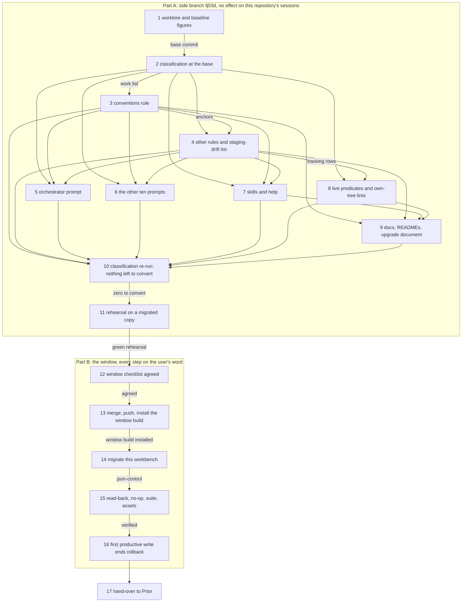

# Implementation Plan: FJ03d. Rules, prompts, live predicates and the complete consumer classification, switched with this workbench and its installed client in one window

**Date:** 2026-10-04
**Spec:** none as a requirements-designer spec. Prior's `concept/fusion-json-workbench-spec.md` at Prior `5609ff1` (main): §1, §3 (layout, tracking classes), §7 (the consumer table and its closing classification paragraph), §8.1 and §8.3 (preconditions, application, read-back), §9 (the FJ03d and FJ05 rows, the order paragraph, the mandatory checks). Prior's release boundary: `Prior: docs/design/fusion-fj04-correction-prior-response.md` `## Validation and release boundary` ("Plugin activation and use evidence belong to the remaining FJ03d/FJ05 release work").
**Cross-references:** 260928-1338-json-control-data-and-markdown-artefacts.md, 261001-1804_*_plan-fj04-the-migration-of-a-legacy-workbench-proven-on-copies.md (closed; its `## Where this work stops` carries this plan's preconditions), 260929-1810_*_plan-fj03a-the-record-client-the-format-gate-and-scope-and-order-on-json.md (`## The cut of FJ03`), 260930-1451_*_plan-fj03b-observers-checkers-citations-and-the-monitor-on-json.md, 260930-2305_*_plan-fj03c-the-write-client-setup-and-the-skills-on-json.md, 260929-1810_*_in-which-order-do-the-parts-of-fj03-and-fj04-land-while-fusions-own-workbench-is-still-in-the-v12-form.md, 260929-1810_*_does-the-2026-09-27-ruling-on-the-growth-bound-reach-the-hook-tests-and-shipped-text-fj03-changes.md, 261004-2212_*_how-does-fj03ds-rewrite-of-rules-and-prompts-meet-the-dispatch-path-bound-at-zero-head-room.md, 261004-2212_*_where-is-the-fj03d-windows-client-installed-from-which-ref-and-what-may-13-0-0-change-after-it.md, 261004-1721_*_how-is-a-later-partial-override-of-a-decision-recorded.md, 260927-2319_*_may-an-agent-originate-a-work-package-on-its-own-initiative.md, 261003-1004-fj04-step12-proof-on-copies-of-real-workbenches.md
**Planned against:** fusion `9c74070b`, `plugin.json` 13.0.0; bundle 689 747 bytes, `sha256:c76bbce9cc86634f5e9c227e8496511dc71eb845768704f43e68200ab841e52e` (qualified, Prior `d6abeb8`). `origin/main` (`48f0c9ff`, 12.2.3) is an ancestor of HEAD (`git merge-base --is-ancestor origin/main HEAD` exit 0). Installed client `~/.fusion` 12.2.1.
**Growth bound:** room measured at `9c74070b` as baseline sum plus head-room minus the surface's current size: `agents/` 4 226 bytes, `skills/` 3 370 bytes, hook tests 4 681 lines. The dispatch-path bound stands at 0 head-room with 620 to 1 189 bytes of margin per path (inference: summed by hand, the test's own report governs). Rule and prompt edits follow decision 261004-2212 (dispatch path), recommended option 1, cut-only; surface bounds follow the answered record 260929-1810 on the growth bound (replace first, raise the measured remainder, log it). No baseline moves.
**Confidentiality:** this plan touches fusion's own workbench only. No other project is copied, measured or named.
**Decidability:** Four questions. **(1) Is the consumer classification complete?** Decidable relative to a fixed pattern set: §7 names the patterns (the five control head fields, marker scans, marker renames, inline progress parsers), so one recorded search command at one commit enumerates every textual hit, and each hit gets exactly one of four disjoint classes (step 2). Not decidable by text search: a reader that builds a marker pattern at run time matches no pattern. The mechanism therefore adds a behavioural check: the rehearsal (step 11) runs every shipped helper, lint and skill block over a migrated copy of this workbench, where a surviving Markdown control reader shows up as a refusal, a wrong count or a red lint. **(2) Do rules, data and the installed client switch together?** Decidable by order: the side branch carries every text change, nothing of it reaches the work tree this repository's sessions read until the merge in step 13, and steps 13 to 15 run in one window with each step checking the previous one's result. Whether another checkout writes during the window is not decidable from inside this checkout (no lock spans checkouts, Prior §6). The mechanism is FJ04's: source hashes frozen in the migration plan detect a write during the run, and quiescence is a stated precondition the user confirms. A v12 client writing after activation is detected by nothing; the upgrade document states it as a limit (step 9). **(3) Do the text changes fit the bounds?** Decidable per commit by the bound tests. **(4) Which records are live after migration?** Decidable from each control file's `status` and the `terminal` sets of `codec/contract/transitions.json`, the table the kernel reads. No predicate reads a marker letter for live state after step 8.

## Directive

Complete FJ03 by its last part: the rule text, the agent prompts, the remaining skill text, the docs, the live-record predicates and the lints that read this repository's own workbench move from the Markdown control grammar to the JSON records and the `bin/fusion-write` operations. A repository-wide classification shows every hit of §7's patterns converted, legacy import or archive only, or another record type. All of it reaches this repository in one maintenance window together with the real migration of its workbench and an installed client built from the branch (Prior §9's FJ03d row; the order record 260929-1810, option 2). No codec byte moves.

**Why one plan for FJ03d and not one for FJ03d and FJ05 together.** They share the window's outcome but not its work. FJ03d is text and predicates proven on a rehearsal, then one window on this repository. FJ05 is the release act (`main`, tag, marketplace, the version surfaces) and evidence from a fresh install of the released tarball on a project other than this one. FJ05 cannot start before this window has activated a real workbench, because merging to `main` ships to every HTTPS install (`install.sh` defaults to `heads/main`). The one entanglement, the installed client in the window, is decision 261004-2212 (client), which this plan settles for FJ03d and hands to FJ05. `## Where this work stops` names which of FJ05's acceptance this plan claims.

## Current State

Verified at `9c74070b` unless marked otherwise.

- **What is already on JSON** (FJ03a to FJ03c, FJ04): scope, the two resolvers and order read `package.json` through the codec and refuse a legacy workbench by name (`bin/fusion-claimed-package`, `bin/fusion-paths`, `bin/fusion-work-order`). Staging drift classifies `workbench.json`, `.json-state/` and pairs (`JSON_LIVE_STATE`, `hooks/lib/staging-drift.ts`). The explicit checkers (`bin/fusion-citation-check`, `bin/fusion-citation-sweep`, `bin/fusion-plan-size`) read JSON through `hooks/lib/record-index.ts` and keep a legacy branch that prints `format=legacy`. `bin/fusion-write` performs every control change (its header lists the subcommands). The executable blocks of `/fusion:setup`, `/fusion:wp`, `/fusion:discuss`, `/fusion:check` and `/fusion:archive` are on JSON; `/fusion:migrate` drives the FJ04 migration. `plugin.json` reads 13.0.0 and the v12 window is closed (FJ04 step 10a).
- **What still states the Markdown grammar.** `grep -rEc` over the pattern `\*\*(Status|Claim|Mode|Depends-on|Active spec/plan):\*\*|_o_|_a_|_p_|_c_\b|_i_|_d_|\[IN PROGRESS\]|\[DONE\]`, tests and `dist/` excluded, counts: `agents/` 95 hits in 10 files (`orchestrator.md` 37, `policy-curator.md` 20, `state-auditor.md` 13), `rules/` 88 in 8 (`fusion-workbench-conventions.md` 59, `decision-record-examples.md` 17), `skills/` 26 in 7 (`archive` 14), `docs/` 50 in 7, `hooks/lib` 46 in 8, `bin/` 10 in 6, `codec/src` 4 in 3, the three READMEs 26. Hits are not defects (the legacy reader must read the grammar); step 2 classifies them.
- **The live predicates and own-tree lints** decide liveness by the marker letter: `isLiveRecord`, `OPEN_ISSUE_RE`, `LIVE_DECISION_RE`, `LIVE_PLAN_RE` in `hooks/lib/citation-corpus.ts`; `LIVE_MARKERS` in `hooks/lib/plan-size.ts`; the lints `workbench-citation-lint`, `plan-stopping-section-lint`, `reference-resolution-lint`, `fenced-code-exemption` and the own-tree case of `citation-sweep.test.ts` read this repository's legacy workbench directly (FJ03b plan, `## Current State`).
- **Four open issues name FJ03d as owner:** 260929-1810 (prompts disagree on who moves which marker, `_b_`), 260929-2025 (`task_start` row still names byte measurements), 260930-1219 (claim criterion and exit 3 causes in rule text), 260930-1640 (layout tree, tracking rule and ignore hints name no JSON surface; rows 4 and 5 are partly done in `skills/check/SKILL.md` lines 267 and 275).
- **Why the text cannot land on this branch before the window.** `bin/fusion-rules` prefers the work tree in this repository, so a rewritten rule file reaches every session here at its commit, while the workbench is legacy and the installed 12.2.1 helpers read Markdown. The own-tree lints switched to JSON predicates go red on the legacy workbench. Agent prompts and skill bodies come from the install, but the reference lint resolves their anchors into the rules, so prompts and rules move together.
- **The decisions this plan meets.** 260927-2319 (agents may originate packages) is answered and unrealised: `rules/fusion-workbench-conventions.md` `## Work packages` still says no agent originates one, while Prior §1.6 and `create --origin <package control path>` admit it. 261004-1721 (C9, partial override of a decision) is open; the rule rewrite of `### Decision files` is where its answer would land. Request 38 is ruled out of every qualified revision, so no takeover route exists.
- **Plan steps after import.** `hooks/lib/legacy-import.ts` `scanPlan` takes every numbered line under `## Implementation Steps` as a step, its number the anchor (decision 261001-1804 on step anchors). After this workbench migrates, this plan's steps are tracked through `bin/fusion-write transition --steps`, and no step can be added or renumbered (requests 18 to 22).

## Approach

**One side branch, one rehearsal, one window.** Every shipped-text and predicate change is written on a side branch `fj03d` in its own worktree outside this checkout, so nothing a session here reads changes before the window. The side branch is proven by a rehearsal: a fresh copy of this workbench, migrated inside the worktree by the branch's own `bin/fusion-migrate`, with the whole suite and the shipped helpers run over it. The window then does four things in order on the user's word: merge the side branch, install the window build into a separate home (decision 261004-2212, client, option 1), migrate this workbench through `/fusion:migrate`, and verify. The first productive JSON write comes last, because it ends the rollback that the migration otherwise keeps open.

The rule rewrite replaces procedures with operations. A rename becomes `transition`, an annotation line becomes a payload ref, a head field becomes a control field written by one named subcommand. The marker vocabularies stay described only as what the legacy reader and the archive read. That replacement is also where the dispatch-path bytes come from (decision 261004-2212, bound).

## Implementation Steps

### Part A: on the side branch, before the window

Rules for every step of Part A. Work happens in the worktree of step 1; no commit on `fj03d` touches `fusion-workbench/`, and no step writes a record into the worktree's copy of the workbench. Records (step notes, issues, analyses) go to this checkout's workbench as usual. Each step reports the dispatch-path figures from `rules-emission-golden.test.ts` and the surface figures from `surface-growth-bound.test.ts` in its note.

1. **The worktree and the baseline figures**
   - Executor: `code-implementer`
   - Files: none in the tree. A git worktree of the new branch `fj03d`, cut from `fj-json-workbench` HEAD, at a path outside this checkout that the orchestrator names in the dispatch (for example a sibling directory of the repository).
   - Changes: create branch and worktree; install the dev dependencies of `hooks/` and `codec/` in the worktree; run the hook and codec suites there on its tracked legacy workbench copy and record the result as the baseline; record the per-path dispatch figures and the three surface rooms.
   - Dependencies: none.
   - Acceptance: both suites at the worktree's base commit give the same result as in this checkout (the monitor's wildcard-bind loopback case is the one known red); the note states the base commit and every figure.
   - 2026-10-05. Worktree `/Users/kai/Projects/productive/F04-FUSION/fusion-fj03d`, branch `fj03d`, base `84047ad7`, no commit on it. `hooks/package-lock.json` (git-ignored) copied from this checkout before `npm ci`; `codec/` by `npm ci`. Codec 1 681 passed, 13 skipped, in both trees. Hooks 1 139 of 1 140 in the worktree, 1 140 of 1 140 here; the one red is the monitor wildcard-bind case, which also failed in this checkout when run alone. Dispatch-path room (bytes, baseline minus total, head-room 0): analyst 1 113, code-implementer 1 168, consultant 1 003, data-implementer 1 146, document-editor 999, implementation-planner 801, orchestrator 959, policy-curator 813, requirements-designer 620, reviewer 1 169, state-auditor 1 189. On every path the prompt is above its row and the rules and `CLAUDE.md` below. Surface rooms: `agents/` 4 226 B, `skills/` 3 370 B, hook tests 4 681 lines.

2. **The repository-wide classification at the base commit**
   - Executor: `analyst`
   - Files: one analysis report in `$OUT_ANALYSIS`.
   - Changes: run one recorded search command at the base commit over `agents/`, `skills/`, `rules/`, `docs/`, `templates/`, the three READMEs, `CLAUDE.md`, `install.sh`, `bin/`, `hooks/*.ts`, `hooks/lib/*.ts`, `hooks/lib/__tests__/`, `codec/src/` and `codec/README.md`. The pattern set is §7's: the five control head fields, marker scans (`_o_` and the other letters in globs and regexes), marker renames (`mv` of a marked name), inline progress parsers and progress marks. Each hit gets exactly one class: **converted** (already reads or writes JSON); **convert** (with the step of this plan that converts it); **legacy-only** (the legacy reader, the repair, archive read mode, the historical upgrade notes, `/fusion:migrate`); **other kind** (reviews, history, memos, analyses, the codec's own contract). The report also maps each of the four open FJ03d issues, row by row, to the step that carries it, and lists each consumer §7 names with the test that exercises its shipped block or helper (§7: "Tests müssen die tatsächlich ausgelieferten Skill-Blöcke/Helper prüfen").
   - Dependencies: 1.
   - Acceptance: every hit of the command's output appears in exactly one class; the command and the commit are in the report, so the count can be re-taken.
   - 2026-10-05, analysis `261005-0504-fj03d-step2-classification-at-the-base-commit.md` with its per-hit table. 723 hits in 96 files at `84047ad7`: converted 105, convert 366, legacy-only 119, other kind 133; convert per step 3: 62, 4: 27, 5: 38, 6: 52, 7: 33, 8: 116, 9: 35, none: 3. The command widens this step's pattern set (`_s_`, `_b_`, `_t_`, class forms, escaped and quoted head-field readers). **Amended 2026-10-05 from the report:** step 4 also converts `bin/fusion-rules:598`, `rules-emission-golden.test.ts:281`, `bin/fusion-checkout-name:244` and `rules/context-manifest.md:120-121`, and carries issue 260930-1640 row 5 (`.gitignore`) with a `git check-ignore` case on a scratch workbench; step 8's expected reds include the legacy-fixture cases of `citation-sweep.test.ts`, `fusion-citation-check.test.ts`, `plan-size.test.ts` and `declared-citation-paths.test.ts:79-82`. Open before step 7: whether `/fusion:wp`, `/fusion:discuss` and `/fusion:archive` refuse a legacy workbench like step 8's checkers (31 hits as convert) or keep their legacy halves (legacy-only). Open before step 10: whether the 90 grammar hits read as converted and the 15 homonyms as other kind, or take a fifth class.
   - **Ruled 2026-10-05 by the user, after discussion `261005-0856_*_fj03d-step10-class-reading-for-borderline-hits.md`: four classes stay, both readings confirmed, with these rules.** (a) Name grammar classes as **converted** because the line concerns the name or citation-token grammar only and decides no state, comments included; the reading does not rest on the Prior §7 duty, which reaches 66 of the 90 hits. (b) A line that describes the legacy grammar inside converted text classes as converted, basis `json`, as step 2 did. (c) The kept gate string `answered by **Mode:** autonomous` (Prior §7: "alte Gate-Strings erhalten") classes as **other kind** under a new basis label and is not carried over from its step-2 rows, which were convert. (d) **Other kind** also holds pattern matches where the control grammar is absent (homonyms, jargon examples, kept event-log strings); these are no record kind and are counted apart (step 10, step 17).

3. **The conventions rule on JSON control**
   - Executor: `code-implementer`
   - Files: `rules/fusion-workbench-conventions.md`.
   - Changes:
     - `## fusion-workbench Layout`: the tree names `workbench.json` (with its consumers: the codec, `/fusion:setup` through `initialize`, `hooks/lib/staging-drift.ts`), `.json-state/`, and the control file beside each narrative (`package.json`, `<stem>.record.json`, `<stem>[.<n>].evidence.json`); a pair is one artefact and travels in one commit (issue 260930-1640, row 1).
     - `### Contract` and `#### Exit codes`: the claim criterion is `status` and `claim.checkout_id` of the package's control file; row 3 cites the header of `bin/fusion-claimed-package` as the list of causes, `legacy` among them (issue 260930-1219, passage 1).
     - `## Work packages`: the head template becomes the narrative plus `package.json`; each control field is named with the one subcommand that writes it (`claim`, `release`, `transition`, `set-mode`, `set-dependencies`, `adopt-plan`); `**Domain:**`, `**Filed by:**` and `**Cross-references:**` prose is informational and the JSON governs (FJ04 hand-over, packages 46 c and 47); a takeover is stated as absent until a qualified revision provides one (request 38). Whether an agent may originate a package within the commissioned work follows the answer to `## Open Questions` item 1.
     - `## Filename Patterns`, both `## State Markers` sections, `## Marker globs`, `## Terminal states are history`: a new record has a marker-free name and is created by `create`; old names keep their markers, which encode no current state; the citation forms stay; the marker vocabularies are described as what the legacy reader maps and what `archive/` holds; terminality is the kernel's `terminal` set.
     - `## Inline State Tracking`: plan steps through `transition --steps`, criteria through `--criteria`, an issue's resolution through `--disposition`, a decision's answer, implementation, deferral and supersession through the payload refs; a step number is its anchor and is never renumbered (decision 261001-1804, step anchors). `### Decision files` carries the answer to decision 261004-1721 if the user has given one before this step is dispatched; otherwise the existing forms, translated.
     - `## Record filing` and `## Decision Record Template`: filename marker-free, the record created by `create` after its narrative is written.
   - Dependencies: 2.
   - Acceptance: `reference-resolution-lint`, `path-literal-lint`, `provenance-header-lint` and `rules-emission-golden` green in the worktree, every dispatch path at or under its baseline row (decision 261004-2212, bound; a shortfall stops the step and returns its figure); the other suites unchanged against step 1's baseline.
   - 2026-10-05, `fj03d` `7fe0a7fe`. All 62 convert hits rewritten; the step-2 search now finds 3 lines in the file, each legacy-only. Decision 260927-2319 realised (an agent may originate a package with `--origin`); C9 still open, so the decision lines keep their forms paired with operations. The rule shrank 169 bytes; room per path now 789 (requirements-designer) to 1 358. `reference-resolution-lint`'s path count re-approved 1 926 → 1 936 as its failure text asks (all ten new references in the rule file). Suites as step 1. Gap filed: issue 261005-0527 (a plan filed by `create` has no step anchors), for step 6.

4. **The other rule files and the staging-drift list**
   - Executor: `code-implementer`
   - Files: `rules/workbench-tracking.md`, `rules/agent-setup.md`, `rules/decision-record-examples.md`, `rules/orchestrator-rebalance.md`, every other rule file step 2 classes **convert**; `hooks/lib/staging-drift.ts`, `hooks/lib/__tests__/staging-drift.test.ts`, `hooks/dist/` as compiled.
   - Changes:
     - `workbench-tracking.md`: R3 names `workbench.json`, L names `.json-state/` and `.guard-state/record-change-pending.jsonl`; both halves of a pair travel in one commit (issue 260930-1640, row 2; FJ03c's note on the pending file).
     - `agent-setup.md` `## What fusion-paths emits`: exit 3 on a `legacy` or `unsupported` workbench means stop and tell the user to run `/fusion:migrate` (issue 260930-1219, passage 2).
     - `decision-record-examples.md`: the worked transitions as `bin/fusion-write transition` calls.
     - `orchestrator-rebalance.md`: the `_b_` marker and the history `**Status:**` write go (issue 260929-1810, items 2 and 5).
     - `JSON_LIVE_STATE` merges into `LIVE_STATE` and `LIVE_PREFIXES`; the test pins the merged lists to the tracking rule's text (issue 260930-1640, row 3).
   - Dependencies: 2, 3.
   - Acceptance: as step 3, plus `staging-drift.test.ts` and `committed-dist.test.ts` green.
   - 2026-10-05, `fj03d` `8a6100fc`. All 27 hits and the step-2 amendment's additions converted, none left. Each decision payload shape in `decision-record-examples.md` was run against the codec first. `--superseded-by` takes the two-id record reference, not a filename. `JSON_LIVE_STATE` is merged into the live lists. `.gitignore` ignores `fusion-workbench/.json-state/*`, with a `git check-ignore` case on a codec-written workbench. Room per path is now 957 bytes (policy-curator) to 1 852; hook tests 4 661 lines. `reference-resolution-lint` re-approved 1 936 → 1 941, all from this step's rule files. Hooks 1 140 of 1 141 (the known monitor case), codec as step 1, bundle unchanged.

5. **The orchestrator prompt**
   - Executor: `code-implementer`
   - Files: `agents/orchestrator.md`.
   - Changes: every **convert** hit of step 2 in the file. Claim, release, pause, done and dropped through `bin/fusion-write`; `**Mode:** autonomous` through `set-mode` with the user's provenance; adopting a spec or plan through `adopt-plan`; the closure step reads the plan from the package's `active_documents` with its role and narrative revision, not from `**Active spec/plan:**` (Prior §7, request 29); decision transitions through `transition` and the payload refs. Issue 260929-1810 items 1 and 2 (who moves which marker; `_b_`), issue 260929-2025 (the `task_start` row says what the hook writes), issue 260930-1640 row 7 (`## Staging check`: a codec-written control file is a `record` row to stage; `PAIR-SPLIT` means stage the other half in the same commit; the `in-flight` examples gain `workbench.json` and `.json-state/`; the routing line no longer sends a work package's `package.json` to an executor).
   - Dependencies: 2, 3, 4.
   - Acceptance: `grep -rn 'byte measurements' agents skills rules` names nothing; reference lint and the dispatch-path bound green, the orchestrator path at or under its row; `agents/` inside its room or the measured remainder logged per the growth record.
   - 2026-10-05, `fj03d` `0f57b119`. All 38 hits converted. The step-2 search leaves 5 lines: the kept event-log constants, the `**Mode:** apply` homonym and one historical anecdote. The setup claim walk is replaced by `bin/fusion-claimed-package`, which has its own test, and its executed copy in `archive-filter-key.test.ts` is removed. Two changes go beyond a translation:
     - `adopt-plan` binds at the user's approval, not when the planner returns, so a Modify round binds no discarded revision.
     - Bounded Closure is now `dropped` with outcome class `bounded`.
     The prompt is 2 965 B smaller. Orchestrator path room is 4 647 B, `agents/` room 7 191 B. `reference-resolution-lint` was re-approved at 1 951 paths and 347 anchors, all from this file. Suites as before.

6. **The other ten prompts**
   - Executor: `code-implementer`
   - Files: the **convert** hits of step 2 in `agents/state-auditor.md`, `agents/policy-curator.md`, `agents/analyst.md`, `agents/implementation-planner.md`, `agents/reviewer.md`, `agents/requirements-designer.md`, `agents/consultant.md`, `agents/code-implementer.md`, `agents/data-implementer.md`, `agents/document-editor.md`.
   - Changes: the state-auditor's transitions and reconcile through operations; the policy-curator's edges through `set-dependencies` and its active-document reads through `active_documents`; the analyst's decision filing (issue 260929-1810 item 3) and the consultant's scope (item 4); the planner's plan file marker-free and created by `create`, with numbered steps under `## Implementation Steps` as the anchors; the reviewer's evidence through `bin/fusion-write evidence`; the implementers' step progress through `transition --steps`. No prompt gains a tool restriction it did not have (Prior §7, the reviewer row).
   - Dependencies: 2, 3, 4.
   - Acceptance: as step 5, every path at or under its row.
   - 2026-10-05, `fj03d` `693a29bc`. All 52 hits converted, plus issue 260929-1810 items 3 and 4. The step-2 search leaves 7 lines, all other kind (report heads, the `**Mode:** survey|apply` homonym). **Departure from this step's text:** the implementers no longer move plan steps or issue states. They write `Resolved:` / `Implemented:` and the dispatcher transitions after reading `Verification:`, which is one party per 260929-1810 and agrees with step 5. Further changes beyond translation: the consultant writes no decision and loses `OUT_DECISION`; the reviewer records its verdict with `bin/fusion-write evidence`; the state-auditor calls `reconcile`; the analyst files a decision `open`. Room per path is now 777 B (reviewer) to 4 647 B; `agents/` room 5 999 B. `reference-resolution-lint` re-approved 1 963 / 356, per-file deltas shown. Suites as before. Two issues filed: 261005-0626 (README-agents names `decisions/` for the consultant, step 9), and 261005-0626 (no prompt sends `attach-evidence`, so a `succeeded` dependency edge is unreachable; no step owns it).

7. **Skills and help**
   - Executor: `code-implementer`
   - Files: the **convert** hits of step 2 in `skills/*/SKILL.md`, at least `skills/help/SKILL.md` (the monitor line; issue 260930-1640 row 6) and `skills/migrate/SKILL.md` `## Step 6` (stop on the sweep's exit 3 or 6 and name its stderr line; row 8).
   - Changes: as listed; `skills/help/SKILL.md` `### 4. Update` gains the 13.0.0 paragraph (what changes, that every agent halts on an unmigrated workbench until `/fusion:migrate` has run, the two-launcher period of decision 261004-2212, client), relabels and drops the oldest, as `README-agents.md` `## Releasing` asks. The version act stays FJ05's.
   - Dependencies: 2, 3, 4.
   - Acceptance: `skills/` inside 3 370 bytes of room or the measured remainder logged; the tests that run shipped skill blocks green.
   - **Ruled 2026-10-05 by the user ("1:1 2:1"):**
     - `/fusion:wp`, `/fusion:discuss` and `/fusion:archive` refuse a legacy workbench by name and point at `/fusion:migrate`, as step 8's checkers do. Their legacy halves go, and the 31 hits stay convert.
     - Issue 261005-0640 takes option 1: `bin/fusion-citation-sweep` admits `legacy` again as a rewriter only, printing no `bound=` lines. The checker and plan-size keep refusing, and `/fusion:migrate` Step 6 runs before Step 7 as now. This step carries that fix in `hooks/citation-sweep.ts` with its test case.
   - 2026-10-05, `fj03d` `5bffedff`.
     - All 33 hits are converted.
     - `/fusion:wp`, `/fusion:discuss` and `/fusion:archive` refuse `legacy` in `legacyLine`'s wording, and their legacy halves are gone. `/fusion:archive` selects through the codec's `list` and moves record units through `bin/fusion-archive`. Filter 3's wildcarded citation key is kept.
     - The sweep admits `legacy` as a rewriter only (`format=legacy`, no `bound=` line). The 261004-2059 case runs on both formats, and all six `circles/` citations are rewritten on legacy. Red against step 8's build, green now.
     - `/fusion:migrate` Step 6 stops on exit 3 or 6 and names the stderr line.
     - Help carries the 13.0.0 paragraph: `~/.fp`, `~/.fusion` untouched, and never `fusion --update` from the window launcher.
     - Both own-tree sweep reds of step 8 are cleared. Remaining reds are three workbench-citation-lint cases, the stopping-section lint and the monitor case.
     - `skills/` room went from 3 370 to 7 157 B. `reference-resolution-lint` was re-approved at 1 965 / 355. Codec is unchanged.
     - Gap filed: issue 261005-0741 (no test pins the three skills' legacy refusal).

8. **The live predicates and the own-tree lints on the record index**
   - Executor: `code-implementer`
   - Files: `hooks/lib/citation-corpus.ts`, `hooks/lib/plan-size.ts`, `hooks/citation-check.ts`, `hooks/citation-sweep.ts`, `hooks/plan-size.ts`, `bin/fusion-citation-check`, `bin/fusion-citation-sweep`, `bin/fusion-plan-size`, the four own-tree lints and the own-tree case of `citation-sweep.test.ts`, their tests, `hooks/dist/`.
   - Changes: liveness comes from `hooks/lib/record-index.ts` (control `status` against the `terminal` sets of `codec/contract/transitions.json`); `isLiveRecord`, the three regexes and `LIVE_MARKERS` are removed from the live path or kept only for `archive/` read mode. The `format=legacy` branch of each explicit checker becomes a refusal by name that points at `/fusion:migrate` (Prior §9's FJ03 row: old control parsers only in import and archive; this closes the N2 question of analysis 261003-1004 as the specification answers it). Retired tests are replaced first; a remaining hook-test growth is raised to the line and logged.
   - Dependencies: 2, 4.
   - Acceptance: in the worktree, on its tracked legacy workbench, the expected reds are exactly the own-tree lints and the own-tree sweep case, each failing on `legacy` by name; any other red stops the step. On a JSON fixture workbench every case of the changed files is green. Step 11 shows all of them green on a migrated copy.
   - 2026-10-05, `fj03d` `3a11d9ea`. All 116 hits converted. Liveness comes from the record index, `CONTAINER_ROOT_ALT` and the plan-size marker reader are gone, and the three checkers refuse `legacy` by name (`legacyLine` in `record-index.ts`). N2 is answered as Prior §9 does: no legacy read path. Hooks are 1 129 of 1 136; the reds are exactly the two own-tree sweep cases, three workbench-citation-lint cases, the stopping-section lint and the known monitor case, each failing on `legacy` by name. The step-2-amendment cases were moved onto JSON workbenches and are green. Hook tests shrank 138 lines. **Open:** the sweep's legacy refusal stops `/fusion:migrate` Step 6, which runs before Step 7 migrates (issue 261005-0640). It needs a ruling before step 7.

9. **Docs, READMEs, `CLAUDE.md`, `codec/README.md` and the upgrade document**
   - Executor: `code-implementer`
   - Files: `docs/upgrading-to-v13.md` (new), `docs/upgrading-to-v12.md` (one pointer), `docs/working-model.md`, `docs/fusion-intro.md`, `README.md`, `README-agents.md`, `README-hooks.md`, `CLAUDE.md`, `codec/README.md`.
   - Changes:
     - The upgrade document for the JSON contract: what becomes JSON and what stays Markdown; that every agent halts on an unmigrated workbench until `/fusion:migrate` has run, and what that run asks (one question on each measured copy, FJ04 step 12); the multi-checkout procedure of Prior §8.1 (quiesce, one checkout migrates, every other one inventories its untracked records, pulls and updates its client before its next write); Node `>=20.12.0`.
     - Its section of documented limits: a v12 client writing after activation is detected by nothing; no takeover of a stale claim (request 38); the codec's `narratives` findings are not read by a host reader (C26); `legacy-unknown` filers and git-derived attribution; renumbering a step breaks its binding; Prior's qualification is a release fact, not a runtime dependency.
     - `docs/` and the READMEs: the **convert** hits of step 2; the `README-hooks.md` rosters stay equal to the tree.
     - `CLAUDE.md`: net zero bytes or a cut (it is charged to all eleven paths).
     - `codec/README.md`: the sentence "`/fusion:setup` does not call it yet (FJ03d)" goes. No file under `codec/dist/` changes.
   - Dependencies: 3, 4, 7, 8.
   - Acceptance: `derivable-enumerations-lint`, the reference lint and the dispatch-path bound green; `shasum -a 256 codec/dist/fusion-record.js` prints `c76bbce9…`.
   - 2026-10-05, `fj03d` `9928dd38`. All 35 hits converted, plus stale sentences that no pattern hit: the role table matches steps 5 and 6, the consultant writes no `decisions/` (issue 261005-0626, README-agents), and the checker rows match step 8. `docs/upgrading-to-v13.md` is new and covers:
     - what becomes JSON;
     - what a legacy workbench meets;
     - the migration, with step 12's figures in aggregate only;
     - Prior §8.1's multi-checkout procedure;
     - the two installations (`~/.fp`, `~/.fusion` untouched, never `fusion --update` from the v13 launcher);
     - the documented limits, including the unreachable `succeeded` edge (issue 261005-0626).

     `CLAUDE.md` is 5 B smaller. Room per path runs from 782 B (reviewer) to 4 652 B. `reference-resolution-lint` was re-approved at 2 016 paths and 360 anchors, with per-file figures. The bundle is `c76bbce9…`, and the reds are as at step 7. Gap filed: issue 261005-0803 (two skill sentences contradict the new rules).
   - **Frozen 2026-10-05 08:1x at the user's request (restart).** `fj03d` is at `29dac3c5`, with a clean worktree. That commit is the fix for issues 261005-0741 (a test pins the legacy refusal of wp, discuss and archive) and 261005-0803 (two skill sentences). The implementer was stopped after committing and before its report, so the commit is **not yet verified**: its red/green evidence and suite run are missing. The bundle is still `c76bbce9…`. Both issues stay `_o_`. To resume:
     1. Verify `29dac3c5`: full hooks and codec suites, with reds only the four legacy own-tree cases plus the monitor case.
     2. Close the two issues.
     3. Get the user's answer on the step-10 class question (90 grammar hits as converted and 15 homonyms as other kind, or a fifth class).
     4. Run step 10, then step 11.

     **Resumed 2026-10-05.** Items 1 and 2 are done: `29dac3c5` verified in the worktree (codec 1 682 passed, 13 skipped; hooks 1 128 of 1 133, the reds being the three workbench-citation-lint cases, the stopping-section lint and the known monitor case; bundle `c76bbce9…`, worktree clean), and issues 261005-0741 and 261005-0803 are closed. Item 3 is ruled (see step 2's note); step 10 is dispatched.

     Also open: issue 261005-0626 (`attach-evidence`, no step owns it; documented as a limit in step 9), decision 261004-1721 (C9), and question 5 of `## Open Questions` (the two other checkouts, needed at step 12).

10. **The classification re-run: nothing left to convert**
    - Executor: `analyst`
    - Files: a second analysis report in `$OUT_ANALYSIS`.
    - Changes: re-run step 2's command at the side branch head and class every hit; explain each difference from step 2 by the step that made it.
    - Dependencies: 3, 4, 5, 6, 7, 8, 9.
    - Acceptance: no hit in class **convert**; every consumer §7 names has a test that runs its shipped block or helper, or the report names the gap as a finding for the orchestrator to file. **Added 2026-10-05 on the user's ruling under step 2:** the report carries the per-hit table with a Basis column and one count per basis beside the four class totals; it classes with the step-2 flowchart, the step-2 basis labels and rules (a) to (d), adds a basis label for any group those do not cover and states each new label's rule; it folds the result to Prior's three classes and states, apart from that fold, the count of every other-kind basis that is not a record kind, so that no such hit is reported as another record type.
    - 2026-10-05, analysis `261005-1016-fj03d-step10-classification-re-run-at-the-side-branch-head.md` with its per-hit table `261005-1016-fj03d-step10-classification-per-hit-table.md`, at `fj03d` `29dac3c5`. 433 hits in 75 files: converted 177 (`name-grammar` 140, `json` 37), **convert 0**, legacy-only 119, other kind 137 (`codec-contract` 93, `history` 18, `homonym` 9, `analysis-head` 7, `jargon-example` 6, `kept-gate-string` 4, the new label for `agents/orchestrator.md:372,438,568,601`). Steps 3 to 7 and 9 each removed their step-2 convert count; step 8 removed 76 and converted 40 in place. Fold to Prior's three: 177, 119, 118, with 19 hits without control grammar stated apart. **Correction to step 3's note:** the three lines left in `rules/fusion-workbench-conventions.md` are converted, basis `json`, under ruling (b), not legacy-only. Filed: issue 261005-1018 (six §7 consumers have no test running their shipped text) and decision 261005-1018 (which other-kind bases reach Prior as another record type; needed before step 17).

11. **The rehearsal on a migrated copy of this workbench**
    - Executor: `code-implementer`
    - Files: none committed. The worktree's `fusion-workbench/` is replaced by a fresh copy of this checkout's, migrated, measured, and restored to its tracked state afterwards.
    - Changes: take the tree hash of this checkout's `fusion-workbench/`; copy it into the worktree; run the worktree's `/fusion:migrate` blocks verbatim (the store rename finds nothing, the repair list, the run) with "migrate" as the one expected answer; then, all from the worktree: the full hook and codec suites; `bin/fusion-paths`, `bin/fusion-claimed-package`, `bin/fusion-work-order`, the three explicit checkers; `bin/fusion-record show` of this package (open) and of the FJ04 plan pair (terminal, bound by the package; **amended 2026-10-05 on the user's ruling, issue 261005-1042:** the terminal record read back is a terminal package's control file, since a terminal plan or spec that no converted record binds stays Markdown only); a second run that answers no-op; one headless `claude --plugin-dir <worktree> --agent fusion:analyst -p` from the worktree whose Setup resolves `OUT_PLAN` into this package's container and stops. Restore the worktree's workbench and re-take this checkout's tree hash.
    - Dependencies: 10.
    - Acceptance: both suites green with the own-tree lints reading the migrated copy; the read-back and the no-op as stated; the question count is one, or each further question is named in the note for the user before step 12; both tree hashes of this checkout's workbench equal; the side branch head at which it ran is in the note.
    - 2026-10-05, second run, at `fj03d` `cd1b5522` merged with `363d54d3` (merge `b48e4273`, in the scratch clone only). Hooks 1 134 of 1 135 on the migrated copy, the one red being the known monitor wildcard-bind case; the four own-tree cases and the basename-uniqueness case are green. Codec 1 682 passed, 13 skipped. Migration: one question, 149 records in 7 chunks, `result=json-control`, receipt verified, ten kinds of findings all reported and none blocking; second run no-op with the copy's hash unchanged. Checker `edited-violations=0`, `verdict=clean`, `conflict=409`, none naming an original. `bin/fusion-paths`, `bin/fusion-claimed-package`, `bin/fusion-work-order`, the sweep's dry run and `bin/fusion-plan-size` exit 0. Read-back: this package `claimed` with the FJ03d plan in `active_documents`; the FJ03d plan record `in_progress` with all 17 steps `open` (the `[DONE]` marks sit on bullets below the numbered lines, so step 16's `--steps` write is what records them); a terminal package (`260801-1244-curator`) `done`. The FJ04 plan still has no control record (`record-closure=0`; issue 261005-1042 on this plan's wording stays open). Headless analyst Setup resolved into this package's container. This checkout's workbench hashed equal before and after in both parts (3 170 files outside the append surfaces); the worktree is untouched; `~/.fusion-migrate` does not exist. Evidence in the session scratchpad under `fj03d-rehearsal-2/evidence/`, a temporary directory. Every `bin/fusion-migrate` call carried `--session` by hand, which the skill's blocks do not; in the window the backup goes to the skill's default location.
    - **After step 11, 2026-10-05: the review over `84047ad7..cd1b5522`** (`261005-1353-reviewer-fj03d-side-branch-range-before-the-window.md`) found nothing critical or high and filed nine issues. Its three medium findings are fixed on `fj03d`: `e29fb624` (`create` reads a new plan's steps itself and refuses a repeated number), `26f311c9` (the `--outcome`, `--source` and `--implementation-ref` values are spelled once) and `88170d7e` (the executor appends its note and the dispatcher sends every transition, a decision's `implemented` included, on the user's ruling; **this corrects step 6's note, which had the implementers leave decisions out**). Worktree at `88170d7e`: hooks 1 131 of 1 136 with the five known reds, codec unchanged, tightest dispatch path (reviewer) 516 B of room. Six low findings stay open (the 261005-1350 issues still open) and one follow-up is filed (issue 261005-1609). **The head to be merged is now past the head step 11 ran green on, so the rehearsal has to be repeated at the final head before step 13**, and the review's coverage ends at `cd1b5522`.
    - **The six low findings and the follow-up fixed 2026-10-05, `fj03d` `bc97f476`, `c3ccb43a`, `a759bb08`, `541893ed`, `eb5573fd`, `07985fdb`, `85ea803b`.** User rulings: an open discussion leaves the blocking citation lint (the reporter still reads it), and the reconciliation reports an implementation found on disk while the dispatcher sends `implemented`. Dispatcher's own choice, told to the user: the executor's `Implemented:` note carries no hash, the dispatcher supplies it through `--implementation-ref`. An unreadable control file now fails both blocking lints by name and is printed by the checker. Left on purpose: the heading `## On a JSON-controlled workbench` in two skills, which a codec test selects blocks by. Worktree at `85ea803b`: hooks 1 134 of 1 139 with the five known reds, no `codec/` change, tightest dispatch path (reviewer) 530 B of room. All nine review issues and issue 261005-1609 are closed. Not ruled: the state-auditor still closes issues, moves plans and steps and sends `superseded` on ground truth. The review's declared range ends at `cd1b5522`; the ten commits after it are covered by no review. The third rehearsal runs at `85ea803b`.
    - **Third run 2026-10-05, green at the head to be merged: `fj03d` `85ea803b` merged with `ef3a5ab8`** (merge `932daf88`, scratch clone only). Hooks 1 138 of 1 139 on the migrated copy, the one red the known monitor case; both blocking lints green, no control file unreadable. Codec 1 682 passed, 13 skipped, bundle `c76bbce9…`. Migration: one question, 147 records in 7 chunks, `result=json-control`, receipt verified, the same ten kinds of findings, none blocking; second run no-op on an unchanged tree. Checker: `conflict=409`, `unreadable=0`, `edited-violations=0`, `verdict=clean`, no original named. All helpers exit 0. Read-back: this package `claimed` with the FJ03d plan bound, the plan record `in_progress` with 17 steps `open`, the terminal package `260801-1244-curator` `done`. `create --kind plan` lands a two-step plan with two anchors and refuses a repeated number (exit 2, nothing sent). Headless analyst Setup read its rule files from the copy and resolved into this package's container. This checkout's workbench hashed equal before and after (3 181 files outside the append surfaces); the worktree is untouched. Evidence under `fj03d-rehearsal-3/evidence/` in the session scratchpad, a temporary directory. **The window precondition "step 11 ran green on the side branch head being merged" holds for `85ea803b` and for no later head.**
    - First run, kept for the record: dispatched to run in a full scratch copy of the `fj03d` worktree instead of the worktree itself, so no restore of a git tree is needed and the worktree stays byte-identical.
    - **Blocked 2026-10-05, first run, at `fj03d` `29dac3c5` merged with `12a3ebe8` in a standalone scratch clone.** Passed: the migration (one question, 147 records in 7 chunks, `result=json-control`, receipt verified, findings all reported and none blocking), the second run (no-op), codec 1 682 passed and 13 skipped, the stopping-section lint and nine of ten workbench-citation-lint cases, `bin/fusion-paths`, `bin/fusion-claimed-package`, `bin/fusion-work-order`, the sweep's dry run, `bin/fusion-plan-size`, `show` of this package, the headless analyst Setup, and both hashes of this checkout's workbench equal (3 165 files outside the two append surfaces). Failed: hooks 1 131 of 1 133, the unexpected red being the basename-uniqueness case with 123 collisions against the migration's kept originals, which also gives the citation checker `verdict=violations` (issue 261005-1042, decision 261005-1042 for the fix route); and the FJ04 plan has no control record to read back (issue 261005-1042, plan expectation). The migrate skill's blocks carry no way to point the backup away from `~/.fusion-migrate/`; the rehearsal passed `--session` by hand. Step 11 is repeated after the fix.
    - **Fix landed 2026-10-05, `fj03d` `0906bb36`** (user ruled option 1 of decision 261005-1042): the citation index and the workbench file walk skip `archive/migrations/<id>/originals/`, one predicate in `hooks/lib/citation-corpus.ts`, one sentence in the conventions rule. Worktree: hooks 1 130 of 1 135 (the four legacy own-tree cases and the monitor case), codec unchanged, bundle `c76bbce9…`. On a copy of the migrated rehearsal tree: 0 collisions, hooks 1 134 of 1 135. Rule set +285 B on every path, tightest path (reviewer) 497 B of room; hook tests +53 lines. Still open before the window: issue 261005-1107 (the checker prints `verdict=violations` on the migrated copy from 411 other conflicts; two README-hooks rows) and issue 261005-1042 (the terminal read-back names a record the importer does not write). Step 11 has to be repeated at `0906bb36`.
    - **Checker verdict traced and its edited rows repaired 2026-10-05, `fj03d` `cd1b5522`** (analysis `261005-1220-why-the-citation-checkers-verdict-changes-on-the-migrated-workbench.md`; user ruled: the rule stays, the rows are respelled, the rest is documented). The migration contributes nothing: since FJ03b step 3 the reporter counts an ambiguous token in an edited file as a `conflict` on a JSON-controlled workbench. Repaired: the elided citation in `hooks/review-coverage.ts` now names the 260810-0710 decision (settled by the sentence's first wording at `afd7c2ed` and the sibling header in `hooks/lib/review-coverage.ts`), and line 211 of the prior-nomenclature spec in this workbench names its seven records in words. `README-hooks.md` states the originals exclusion in both checker rows, and `docs/upgrading-to-v13.md` gains a limits entry on conflict rows. Worktree: hooks 1 130 of 1 135 as before, no `codec/` change. Issue 261005-1107 stays open until the repeated rehearsal shows the verdict. The second rehearsal runs at `cd1b5522`.

### Part B: the window (each step runs only on the user's word)

12. **The window checklist** (approval: the user agrees the window)
    - Executor: `analyst`
    - Files: none; the checklist goes into the step note.
    - Changes: read back every precondition clause of `## Where this work stops` that gates the window, each answered yes or no with its evidence: step 11 green at the side branch head to be merged; the review pass over the side branch range done and its findings fixed or ruled; no other fusion session writing in this repository; for each other registered checkout of this repository, whether it is quiescent and how it will reach the window build before its next write; the backup location outside the repository; Node version; decision 261004-2212 (client) answered.
    - Dependencies: 11.
    - Acceptance: every clause answered; the orchestrator puts the list to the user and records the answer.
    - 2026-10-06, the user agreed the window (see step 13's note). **Checklist taken 2026-10-06, read-only, at live `7369756c` and `fj03d` `85ea803b`** (the analyst's return; every item re-read by it, nothing written):
      - Step 11 green on the head being merged: **yes**. Third run, merge `932daf88` of `85ea803b` with `ef3a5ab8`; `hooks-test.log` 1 138 of 1 139 (monitor case only), `codec-test.log` 1 682 passed; `run.out` `result=json-control`, `run2.out` `result=no-op`. Live moved one commit past `ef3a5ab8` since, in workbench files only (`git diff --stat ef3a5ab8 HEAD -- . ':(exclude)fusion-workbench'` empty).
      - Review over the side branch range, findings fixed or ruled, coverage stated: **yes, with the gap stated**. Review `261005-1353-reviewer-fj03d-side-branch-range-before-the-window.md`, range `84047ad7..cd1b5522`; all nine `261005-1350_*` issues and `261005-1609_*` closed. `bin/fusion-review-coverage --since 84047ad7 --head 85ea803b`: `commits=21 reviews=1 uncovered=10`. Uncovered: `85ea803b`, `07985fdb`, `eb5573fd`, `541893ed`, `a759bb08`, `c3ccb43a`, `bc97f476`, `88170d7e`, `26f311c9`, `e29fb624`.
      - No other session writes; other checkouts quiescent and on the window build before their next write: **yes, by the user's word (2026-10-05, chat), nothing verifies it.** Registered: `114caf11` (teal-jetty, this one), `1d05b0e4` (russet-marsh, refreshed 260909), `5e8248d7` (west-harbor, refreshed 261002). User: the two others are not in use; no other session writes. The inventory-before-pull half applies the day either is started again, through the window launcher only.
      - Decision 261004-2212 (client) answered: **yes**, option 1, `FUSION_HOME=~/.fp`, a launcher directory of its own (unnamed in the record), `~/.fusion` never changed.
      - Backup outside the repository: **yes, by the user's word**: `/fusion:migrate`'s default `~/.fusion-migrate/`. The rehearsal passed `--session` by hand; the default location was not exercised.
      - Node `>=20.12.0`: **yes**, `v25.7.0`.
      - Bundle unchanged: **yes**, `c76bbce9…`; `git diff --stat 84047ad7 85ea803b -- codec/dist` empty, as for `codec/src` outside tests, `codec/contract`, `codec/package.json`. Under `codec/` only `README.md` (step 9) and `src/__tests__/install.test.ts` (the ninth case) moved.
      - `origin/main` (`48f0c9ff`) ancestor of HEAD: **yes**, exit 0.
      - No shipped-file commit on `fj-json-workbench` while `fj03d` was open: **yes**; merge-base `84047ad7`, no rebase needed.
      - **Step 13's proof that neither the window launcher nor `fusion --update` from it can write `~/.fusion`: no as stated, half proven.** `install.sh` (unchanged on `fj03d`) reads `FUSION_REF`, `FUSION_HOME`, `FUSION_BIN` (lines 36 to 39) and writes only under `$INSTALL_DIR`, `$LAUNCHER` and a `mktemp` dir; a launch writes nothing. But the launcher's `--update` branch (lines 110 to 114) fetches `main`'s installer and runs it with no variables, so it reinstalls `heads/main` into `~/.fusion` and overwrites `~/.local/bin/fusion`. Only prose forbids it (`skills/help/SKILL.md`, `docs/upgrading-to-v13.md` `## Documented limits`, the decision's answer). Put to the user with the window.
      - Other facts: installed `~/.fusion` is 12.2.1, the worktree 13.0.0; `~/.fp` does not exist; `install.sh` downloads from `github.com/tenzoki/fusion` at `$REF`, so the push (257 commits ahead) must land before the install and the installed tree is compared with the pushed merge; `install.sh` copies `bin/` into `$INSTALL_DIR/bin`, so the launcher directory is a sibling of `~/.fp`, not inside it. Install command, not run: `FUSION_REF=heads/fj-json-workbench FUSION_HOME="$HOME/.fp" FUSION_BIN="<launcher dir>" bash <live checkout>/install.sh`.
      - Limits: the 12.2.1 launcher at `~/.local/bin/fusion` stays and starts any project with `~/.fusion`; only the procedure keeps it off this repository after step 14, and a v12 client writing after activation is detected by nothing.

13. **Merge, push, install the window build** (approval: merge, push and install)
    - Executor: `code-implementer`
    - Files: the merge of `fj03d` into `fj-json-workbench`; no new edits.
    - Changes: merge (the orchestrator commits); push `fj-json-workbench`; install per decision 261004-2212 (client), recommended option 1: `FUSION_REF=heads/fj-json-workbench FUSION_HOME=<separate home> FUSION_BIN=<separate launcher directory>` with this repository's `install.sh`. Record the merged commit, the installed `plugin.json` version and the installed bundle's sha256.
    - Dependencies: 12.
    - Acceptance: the installed bundle is `c76bbce9…` and the installed tree equals the pushed commit's for every path the installer copies; at the merge commit the expected reds are exactly step 8's named own-tree cases, which step 15 clears, and any other red stops the window.
    - 2026-10-06, each act on the user's word. **Merge** `6f37d798` (parents `c67d1333`, `fj03d` `85ea803b`; 96 files, none under `fusion-workbench/`; `plugin.json` 13.0.0; bundle `c76bbce9…`). **Push**: `origin/fj-json-workbench` `8c64aa88` → `6f37d798`, 0 ahead and 0 behind afterwards; `origin/main` untouched. **Install**: `FUSION_REF=heads/fj-json-workbench FUSION_HOME=~/.fp FUSION_BIN=~/.fp-bin bash install.sh` from this checkout; `~/.fp/.claude-plugin/plugin.json` 13.0.0, `~/.fp/codec/dist/fusion-record.js` `c76bbce9cc86634f…`, launcher `~/.fp-bin/fusion` with `FUSION_DIR=/Users/kai/.fp`. Installed tree compared with `git archive 6f37d798` item by item (`.claude-plugin`, `agents`, `bin`, `codec`, `docs`, `hooks`, `rules`, `skills`, `stilwerk`, `templates`, three READMEs): 0 differences. `~/.fusion` stayed 12.2.1 and `~/.local/bin/fusion` kept its checksum (`8a63f46e…`) before and after; `~/.fusion-migrate` does not exist. No suite was run at the merge commit in this checkout: its tree outside the workbench equals the rehearsed merge's, and the reds it would show are the four own-tree cases step 14 clears. **Step 12 closed with this step**: the checklist stands in its note, the user agreed the window on 2026-10-06 with the prose ban on `fusion --update` from `~/.fp-bin/fusion` as the guard.

14. **Migrate this workbench** (approval: the real migration)
    - Executor: `code-implementer` (evidence and checks; the run itself is the user's `/fusion:migrate` in a fresh session started through the window launcher)
    - Files: this repository's `fusion-workbench/` as the migration writes it; the receipt under `archive/migrations/<id>/`; the external backup.
    - Changes: the user restarts on the window launcher and runs `/fusion:migrate`; afterwards collect the receipt, the backup path with its verified tree hash, `inspect` answering `json-control`, record and package counts, the findings and the number of questions asked.
    - Dependencies: 13.
    - Acceptance: `inspect` answers `json-control`; the receipt names inventory, mapping, source and target hashes, versions and checks (Prior §8.3.6); the question count matches step 11 or the difference is named.
    - 2026-10-06, the user ran `/fusion:migrate` in a fresh session on `~/.fp-bin/fusion` (13.0.0, bundle `c76bbce9…`); this note collects what was read back afterwards, nothing re-run.
      - **Receipt** `archive/migrations/migration-20261006-v12/receipt.json`: `source_layout` `fusion-v12`; `counts` `package_live` 2, `package_terminal` 41, `record_live` 104, `record_closure` 0, `plain_terminal` 1 182, `empty_container` 4; checks all `passed`: pairs 147, ids 147, graph 1, references 433, acceptance 2, closure 19, validate 147, reconcile 147; `after_inventory_sha256` `36934aca…`, `source_inventory_sha256` in `plan.json` `99638d05…`, `manifest_revision` `bd03306f…`; 7 chunks of 48/50/49/48/50/49/35 records.
      - **Backup** `~/.fusion-migrate/4215a9338a63/backup`, 3 188 files, tree hash recorded and recomputed both `sha256:e55d9fbc…` (the `treeHash` of the installed `legacy-repair.js`); `state.json` `done=true rolled_back=false`, `setup_before` 12.2.1.
      - **Inspect**: `list` answers `json-control`, 147 records (decision 76, issue 8, plan 19, package 43, discussion 1; packages done 36, dropped 5, paused 1, claimed 1).
      - **Findings**: 225, every one `reported`, 0 blocking, ten classes: `live-record-in-terminal-container` 49, `reference-not-a-citation` 45, `decision-line-disagrees-with-marker` 33, `answer-ref-self` 24, `mark-outside-numbered-step` 18, `filed-by-not-owed` 18, `circle-head-disagrees-with-marker` 15, `status-head-in-live-record` 14, `answered-without-answer-line` 5, `empty-container-tree` 4; 0 repairs, 0 repair answers.
      - **Question count**: recorded nowhere on disk (the skill body asks it in chat), so the clause is met by comparison instead: against step 11's third run, the same 147 records in the same 7 chunks, the same ten classes, no recorded difference.

15. **Read-back, no-op, suite and assets on the activated workbench**
    - Executor: `code-implementer`
    - Files: none changed in the tree.
    - Changes: in a fresh session on the window launcher, read one open record (this package) and one terminal record (**amended 2026-10-05 on the user's ruling, issue 261005-1042:** a terminal package's control file, `work-packages/260801-1244-curator/package.json` as in step 11's second run, not the FJ04 plan pair, for which the importer writes no control record) through `bin/fusion-record`, `bin/fusion-paths`, `bin/fusion-claimed-package` and `bin/fusion-work-order` (Prior §8.3.7); a second migration run answers no-op; the full hook and codec suites green in an isolated worktree of the merged commit with this workbench's migrated tree (Prior §9: the suite rewrites compiled hooks); `/fusion:check` asset and gitignore checks pass; `bin/fusion-staging-drift` classifies the migrated pairs with no `unclassified` row. No write to any control file.
    - Dependencies: 14.
    - Acceptance: every check passes, or the step stops and the user rules between `rollback` (still admitted, no later work exists) and a forward fix.
    - 2026-10-06, in a fresh session on `~/.fp-bin/fusion`, after step 14. Every check passed except the staging-drift one, which failed first and passed after a forward fix the user ruled; the order below is the order it happened in.
      - **Read-back** through the installed helpers: `bin/fusion-record show` on this package (`claimed`, `claim.checkout_id` `114caf11`, `active_documents` the FJ03d plan in role `plan` at revision `63fc4296…`) and on `work-packages/260801-1244-curator/package.json` (`done`, outcome class `legacy-completed`, provenance `legacy-terminal`); `fusion-paths orchestrator`, `fusion-claimed-package` (this container) and `fusion-work-order` (`items=2 edges=0 cycles=0 ready=1 verdict=acyclic`) each exit 0.
      - **Second run**: `result=no-op`, no question asked; `status` `chunks=7/7 verified=yes done=true rolled_back=false`; the workbench tree hash outside the append surfaces `04eb025a…` before and after, 3 485 files.
      - **Suites** in an isolated worktree of `01502aae` with the migrated tree copied in: hooks 1 139 of 1 139 (the monitor wildcard-bind case passed this time), codec 1 682 passed and 13 skipped; bundle `c76bbce9…`.
      - **`/fusion:check`**: all four stilwerk profiles `case1-equal`; the gitignore block printed nothing and `.gitignore` is unchanged (`8f4f5943…` before and after).
      - **Staging drift failed first.** `bin/fusion-staging-drift` from the work tree at `01502aae`: `rows=346`, record 286, in-flight 3, `unclassified` 57, every one under `archive/migrations/migration-20261006-v12/` (the plan, 7 chunks, 5 parts, the receipt, and 43 kept originals whose path carries no store segment). Cause: `classify()` had no rule for the subtree. The user ruled a forward fix over `rollback`.
      - **`99eef20d`** is that fix: a shipped-file commit inside the window, made on the user's ruling, against step 13's "no new edits" line. `MIGRATIONS_PREFIX` in `hooks/lib/staging-drift.ts` classes the subtree `record` as one rule; a paragraph in `rules/workbench-tracking.md`; one test in `staging-drift.test.ts`; the compiled `hooks/dist`; the reference-resolution pin and the surface golden by the measured remainder (hook-test surface 24 193 → 24 209 lines, no bound raised; dispatch paths unchanged). The first suite run on the fix went red on the reference pin alone (1 of 1 140), the second 1 140 of 1 140. Re-run from the work tree: `rows=346`, record 343, in-flight 3, `unclassified` 0.
      - **Push**: `origin/fj-json-workbench` `6f37d798` → `99eef20d`, 0 ahead and 0 behind afterwards; `origin/main` `48f0c9ff` untouched; no tag.
      - **Reinstall** with step 13's command from this checkout: `~/.fp` 13.0.0, bundle `c76bbce9…`, launcher `~/.fp-bin/fusion` with `FUSION_DIR=/Users/kai/.fp`; the installed tree against `git archive 99eef20d` for the thirteen copied paths (`.claude-plugin`, `agents`, `bin`, `codec`, `docs`, `hooks`, `rules`, `skills`, `stilwerk`, `templates`, three READMEs; `LICENSE` is not in the tree) 0 differences, 1 378 files each; `~/.fp/hooks/dist/lib/staging-drift.js` carries `MIGRATIONS_PREFIX`. `~/.fusion` 12.2.1 and `~/.local/bin/fusion` `8a63f46e…` unchanged; `~/.fusion-migrate/4215a9338a63` unchanged.
      - **Installed-helper re-run** `~/.fp/bin/fusion-staging-drift` at `99eef20d`: exit 0, `rows=346 unstaged=343 verdict=unstaged`; record 343, in-flight 3 (`.fusion-setup`, `orchestrator-events.jsonl`, `workbench.json`), `unclassified` 0; the 161 rows under the migration directory all `record`.
      - This note and step 14's were appended after the no-op run and after `99eef20d`. The migration's paths, 343 unstaged rows in that run (the 286 of the first run plus the 57 the fix now classes), are still uncommitted as this is written.

16. **The first productive write** (approval: it ends rollback)
    - Executor: `code-implementer`
    - Files: this plan's control file, through the codec.
    - Changes: `bin/fusion-write transition` records steps 1 to 15 of this plan as done (`--steps`), the first ordinary JSON write on this workbench; then the orchestrator transitions the four FJ03d issues with `--disposition` and the decisions this plan realised (260927-2319 if realised, 261004-2212 bound and client) through their refs. From here on no step of this plan is marked in its Markdown.
    - Dependencies: 15.
    - Acceptance: the write lands with `event=logged`; `bin/fusion-record show` returns the new revision; the staging check names the changed control files and nothing else.

17. **The hand-over to Prior**
    - Executor: `analyst` (drafts; the orchestrator appends and commits)
    - Files: `codec/fixtures/prior/REQUESTS.md`, a new section `## FJ03d (the hand-over)`.
    - Changes: what landed and at which commits; step 10's classification result, with its per-basis counts beside the class totals and the count of pattern matches without control grammar stated apart (added 2026-10-05 on the user's ruling under step 2); the activation evidence on fusion's own workbench (receipt, read-back, no-op, suite, the window build's commit and bundle digest); that no codec byte moved, so no re-qualification is asked; what remains for FJ05.
    - Dependencies: 16.
    - Acceptance: the section is an append; the digest it states equals `shasum -a 256 codec/dist/fusion-record.js`.
    - 2026-10-07, `e7695d9c`. The section `## FJ03d (the hand-over)` is appended to `REQUESTS.md` from the analyst's draft `261007-1105-fj03d-step17-hand-over-draft.md`, unedited. Its fold rests on the user's two rulings of 2026-10-07 on decision 261005-1018 (`codec/` read per line; the 16 `history` lines stated apart), argued in discussion `261007-0707-other-kind-hits-prior-record-type.md`. The fold is 233 / 155 / 7 with 38 stated apart over 433 at `29dac3c5`, and 241 / 155 / 7 / 38 over 441 at HEAD. The section asks request 61. The digest stated equals `shasum` (`c76bbce9…`). Codec 1 682 passed and 13 skipped, and the three Markdown lints are green.
    - **Prior answered request 61 on 2026-10-07 with yes**, at Prior `7da6690` (`Prior: docs/design/fusion-fj03d-prior-response.md`, read on disk): "The 38 separately stated and individually explained hits count as classified. Request 61 is closed." Prior re-took the fold at `29dac3c5`, `b65eb4b0` and `e7695d9c` and got the same figures. Spec §7's closing paragraph now admits "begründet separat ausgewiesene Treffer" with place and reason, and Prior names the disposition "no consumer of the old Fusion control grammar, with evidence". The classification no longer holds FJ03d up, and no repin is needed (requests 59 and 60 stay closed at `f9ecae78` / `c76bbce9…`).
    - Two corrections from Prior's response:
      - The section's last sentence says "FJ05 is planned against `b65eb4b0`". That is wrong: FJ05 is not planned. The pinned bytes of `REQUESTS.md` stay as they are, and Prior treats FJ05 as the next plan to write.
      - The 13 skipped codec checks are the optional Go-golden assertions in `prior-mapping.test.ts`, which are not passing tests. Release evidence runs with `CODEC_REQUIRE_GOLDENS=1`.
    - Prior's response names five things FJ05's acceptance still needs:
      - a review of `99eef20d`, `95720e4c`, `b65eb4b0` and `e7695d9c`;
      - the release artifact with fresh install, assets, a consuming-project smoke test, a repeated migration, and the launcher's update ref;
      - a disposition of the six consumer test gaps (issue 261005-1018);
      - a resolution or bounded scope for issue 261005-0626 (the `succeeded` edge);
      - the documented limits checked against the release.

## Where this work stops

- Step 2's and step 10's reports exist; step 10 classes no hit as **convert**.
- Each of issues 260929-1810, 260929-2025, 260930-1219 and 260930-1640 is closed with its own acceptance met, or a row is named as left and refiled.
- `codec/dist/fusion-record.js` is `sha256:c76bbce9…` at every commit of this plan, and `REQUESTS.md` asks Prior for no re-qualification.
- No baseline moved; `DISPATCH_HEAD_ROOM` is 0, or the user ruled option 2 of decision 261004-2212 (bound) on a measured shortfall; every surface raise is the measured remainder, logged in `README-hooks.md` `### Growth bounds on the shipped text`.
- Precondition for the window, met before step 13: step 11 ran green on the side branch head being merged.
- Precondition for the window, met before step 13: the orchestrator has dispatched a review over the side branch range, and its findings are fixed or ruled; `bin/fusion-review-coverage` over that range is stated in the step 12 note.
- Precondition for the window, met before step 13: no other fusion session writes to this workbench, and each other registered checkout of this repository is quiescent and reaches the window build before its next write, with its untracked records inventoried before its pull (Prior §8.1). This is the user's statement; nothing verifies it.
- Precondition for the window, met before step 13: decision 261004-2212 (client) is answered.
- This repository's workbench answers `json-control`, its receipt is complete, the read-back of one open and one terminal record passed, and a second run was a no-op.
- The full suites passed in an isolated worktree on the activated workbench, the own-tree lints included.
- The first productive write landed, and it was made only after step 15 passed.
- fusion stayed operable directly in Claude Code: every window step ran with no Prior installation, binary, service or variable.
- `REQUESTS.md` carries step 17's section.
- FJ04's open preconditions after this plan: FJ03d's window agreed (step 12, claimed); `origin/main`'s 12.x merged (met before this plan: `48f0c9ff` is an ancestor of `9c74070b`); the upgrade document (step 9, claimed as text); 13.0.0 shipped with the release surfaces of `README-agents.md` `## Releasing` (not claimed, FJ05); every writing installation of this workbench on the window build before activation (claimed, by the user's statement in step 12).
- FJ05's acceptance, clause by clause:
  - Fresh-installed client: not claimed. The window installs a branch build into a separate home; FJ05 installs the released tag fresh.
  - Complete assets: claimed for the window build only (`/fusion:check` in step 15); not for the release tarball.
  - Project smoke test: claimed for fusion's own project (steps 14 to 16); a consuming project is FJ05's.
  - Repeatable migration: claimed on this workbench (step 15's no-op) and on the rehearsal copy (step 11); FJ05 repeats it on the release.
  - Documented limitations: the text exists (step 9); checking it against the released behaviour is FJ05's.
  - The release act (merge to `main`, tag `v13.0.0`, marketplace, the four version surfaces, the description pair): not claimed.
- No workbench other than this repository's is migrated by this plan.

## Data Structures

None new. The control files, the receipt and the migration plan are FJ04's.

## API Changes

`bin/fusion-citation-check`, `bin/fusion-citation-sweep` and `bin/fusion-plan-size` refuse a legacy workbench by name and point at `/fusion:migrate`, where they printed `format=legacy` and read Markdown (exit codes stay those the FJ03b plan assigned to a refusal). No codec operation and no `bin/fusion-write` subcommand changes.

## Testing Strategy

Text steps are tested by the lints that already read the shipped surface. Predicates are tested on JSON fixtures (step 8), then on a migrated copy of this workbench (step 11), then on the real one (step 15). Tests run the shipped helpers and skill blocks, not a second implementation (Prior §7); step 10 names any consumer without such a test. The full suite runs in an isolated worktree, because it rewrites compiled hooks (Prior §9).

## Risks & Mitigations

| Risk | Mitigation |
|---|---|
| The rule or prompt rewrite does not fit the dispatch-path bound | Decision 261004-2212 (bound): cut-only, a shortfall stops the step and goes to the user with its figure |
| `fj-json-workbench` gains shipped-file commits while `fj03d` is open | Shipped files change only on `fj03d`; otherwise rebase and re-run step 11 |
| A session here reads the new rules before the workbench is migrated | The merge happens only inside the window (step 13), with writers quiescent; steps 13 to 15 run back to back |
| The window build halts the user's other projects | Separate install home (decision 261004-2212, client, option 1); `~/.fusion` stays 12.2.1 until FJ05 |
| `fusion --update` from the window launcher reinstalls `heads/main` into `~/.fusion` | Stated in step 13's note and the help paragraph; the window launcher is not updated, it is reinstalled with the same variables |
| **Limit, not mitigated:** this repository is started with the 12.2.1 launcher after activation and writes Markdown control | Nothing detects it. The upgrade document and the step 12 checklist state it; only the procedure prevents it |
| The real migration asks more than the rehearsal did | `/fusion:migrate` surveys and asks before any write; step 14 names the difference |
| A check fails after activation | Step 15 makes no write, so `rollback` is still admitted; step 16 is the point of no return and needs its own approval |
| The classification misses a reader that builds its pattern at run time | Step 11's behavioural run over a migrated copy; step 15 on the real one |

## Open Questions

- [ ] **Item 1. Does FJ03d realise decision 260927-2319 (agents may originate packages) in `## Work packages`?** The decision is answered (option 1) and unrealised; Prior §1.6 and `create --origin <package control path>` already admit it. We recommend realising it in step 3, since the section is rewritten there anyway and leaving the withdrawn bound in new text would restate it. Then the orchestrator moves the decision to `_i_` at step 16. The alternative is to carry the current bound forward and leave the decision `_a_`.
- [ ] **Decision 261004-1721 (C9, partial override).** Not a dependency: step 3 carries the existing forms if it is still open. Answering it before step 3 is dispatched costs nothing extra, because `### Decision files` is rewritten there.
- [ ] **Decision 261004-2212 (bound):** recommended option 1. Needed before step 3.
- [ ] **Decision 261004-2212 (client):** recommended option 1. Needed before step 12.
- [ ] **Which machines hold the two other registered checkouts of this repository (`1d05b0e4`, `5e8248d7`), and are either of them still in use?** Step 12 needs the answer for the quiescence clause.
- [ ] **N2 of analysis 261003-1004** (do read helpers keep a legacy path until migration): step 8 answers it as Prior §9's FJ03 row does (no; refusal by name, pointing at `/fusion:migrate`). The orchestrator records that answer, or the user rules otherwise before step 8.
