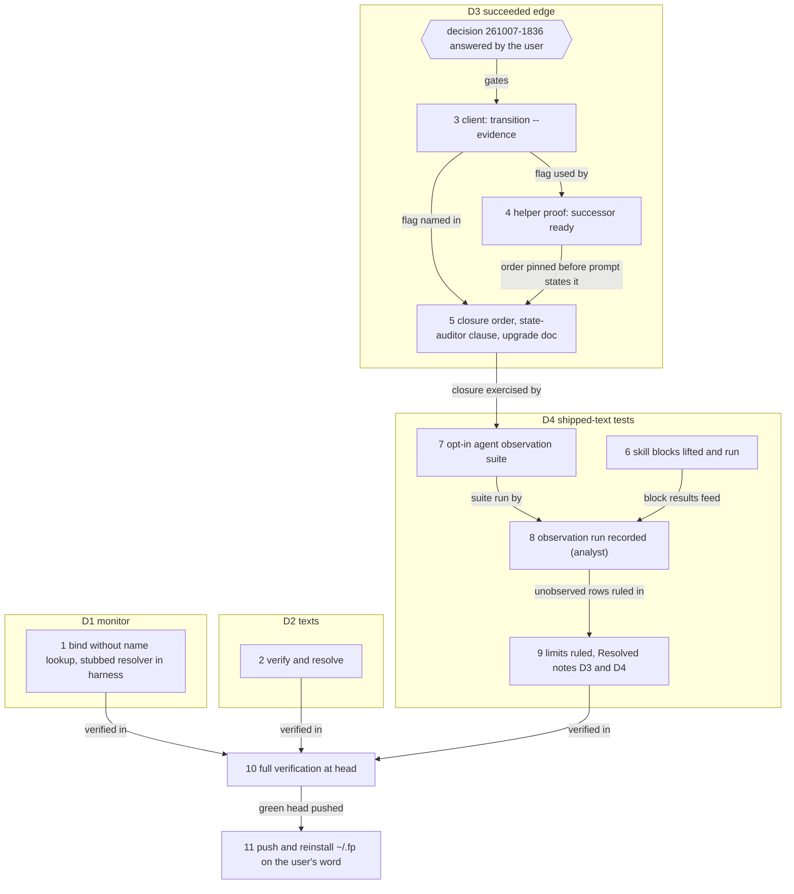

# Implementation Plan: the four open defects fixed before v13 is tested

**Date:** 2026-10-07
**Spec:** none — planned from the orchestrator's dispatch, which carries the user's words "v13 soll noch nicht auf main gemerged und als release freigegeben werden. ich will das erst testen mit claude und mit prior! defekte fixen"
**Decidability:** This plan rests on three questions. (1) Does the monitor's wildcard start-up depend on the host's name resolver? This is decidable: a stub that makes the lookup hang turns the case red before the fix and green after it, on any host. (2) Does a successor with a `succeeded` edge become ready once its predecessor is finished? This is decidable from the inputs `bin/fusion-work-order` reads, namely the codec's `reconcile` over live JSON, and step 4 asserts it through the shipped helpers. (3) Does a shipped *prompt* produce that behaviour? No test of the prompt's text can decide this, so the mechanism changes from reading the text to observing dispatch runs, judged by their effects on disk (steps 7 and 8). An observation of a non-deterministic agent proves one run and not every run. Behaviour that no headless run can reach (interactive approvals, the curator's apply mode) is put to the user as a limit, not approximated.

## Directive

Fix the four defects still open in this repository, and leave the branch in a state the user can test with Claude and with Prior. Steps 1 to 10 change and verify the tree. Step 11 pushes and reinstalls the window build `~/.fp`, on the user's word. No step merges to `main`, tags, changes `plugin.json`'s version, touches the marketplace or changes `install.sh`'s defaults, and no step touches `~/.fusion` or `~/.local/bin/fusion`.

The four, each by its storeless basename:

- D1 `260928-1520_*_the-monitor-wildcard-bind-case-times-out-on-a-host-its-own-probe-declares-usable.md`
- D2 `261001-0841_*_three-texts-in-the-range-state-what-the-code-or-test-no-longer-does.md`
- D3 `261005-0626_*_no-shipped-prompt-binds-a-reviewers-evidence-record-to-its-package-so-a-succeeded-edge-cannot-be-met.md`
- D4 `261005-1018_*_six-consumers-the-prior-spec-names-have-no-test-that-runs-their-shipped-text.md`

## Current State

Each figure below was measured at `fj-json-workbench` `04673bec` on 2026-10-07 unless the line says otherwise.

**D1. The cause is found, and it is a reverse name lookup inside the bind, not the Local Network permission.** The case "answers at `localhost` on both loopback families, with no MONITOR_BIND set" timed out 3 of 3 runs in the sandbox and 1 of 1 outside it. A monitor started by hand with `MONITOR_BIND` unset had written no URL file after 20 s. `lsof` showed its socket `TCP *:<port> (CLOSED)`, which means bound but not yet listening. `sample` showed the main thread inside `socket_gethostbyaddr`, called from the server's constructor. CPython's `http.server.HTTPServer.server_bind` calls `socket.getfqdn(host)`. On this host `getfqdn('::')` and `getfqdn('0.0.0.0')` each took 30.0 s, against 0.04 s for `getfqdn('127.0.0.1')`; the resolver is the LAN router `192.168.178.1`. The case's budget is 30 000 ms, so the server comes up just after the case gives up. Whether it passes therefore depends on the router's answer time. That explains the green runs in the FJ03d window (`95720e4c` reports hooks 1 139 of 1 139) beside the red ones on 2026-09-28 and through FJ03d steps 5 to 9. Inference: the 2026-08-06 observation that `bin/monitor`'s MONITOR_BIND note attributes to Local Network permission ("parked in CLOSED") matches this mechanism exactly. It is not re-measured here. The defect also reaches users: a monitor started without `MONITOR_BIND` on such a host serves nothing for about 30 s. A fix is owed, and the acceptance below measures the mechanism rather than the router.

**D2. Both remaining parts are already done, and nothing in the tree has to change.**
- The `ask`-level empty-stdout case was not removed by `b3909330`. It was folded into the case "is unanswered/unparseable for output that is not the one-line envelope, none at all included" (`hooks/lib/__tests__/record-client.test.ts`). That case's first stand-in writes `""` and exits 0. Run 2026-10-07: 1 passed.
- The fourth text has been restated. `codec/fixtures/prior/REQUESTS.md` `## The archive revision (the hand-over)` carries an appended paragraph stating "The policy is now two checks", the holder check and the written-claim check. The original sentence under `### Stated for objection: the Claude side binds a caller by its checkout identity alone` stands unedited, as append-only history requires.
- `grep -n square hooks/lib/record-client.ts` finds nothing.

**D3. The issue's own acceptance would not make the feature work.** `succeeded` reads `outcome.evidence` and nothing else. `attach-evidence` writes the package's top-level `evidence` on a live package. The finish runs `bindEvidence` over `outcome.evidence`, which refuses when the brief's bytes moved since the review. The closure note is appended to the brief before the finish (`agents/orchestrator.md` `## Closing a work package` step 4). The full chain, the options and the recommendation are in decision `261007-1836-which-party-binds-a-closing-reviews-evidence-into-the-finish-so-a-succeeded-edge-can-be-met.md`, filed with this plan and `open`. `docs/upgrading-to-v13.md` `## Documented limits` says a user can "bind the evidence yourself". That is wrong for the same reason: an `attach-evidence` binding never meets `succeeded`. Existing coverage: `codec/src/__tests__/transitions.test.ts` checks `dependencySatisfied` on synthetic targets, `fusion-work-order.test.ts` checks an unmet `succeeded` edge on a dropped target, and `record-write.test.ts` checks `evidence` and `attach-evidence`. No test drives a successor to `ready`.

**D4. Four of the six consumers are bash blocks that can be lifted by heading. The other two are prompts and help's one block.** `codec/src/__tests__/install.test.ts` already lifts `## `-headed bash blocks from the installed `skills/*/SKILL.md` and runs them verbatim on a JSON workbench (`shippedSection`). The blocks still untested are these:
- `skills/reconcile/SKILL.md`: five blocks under `## Step 1` to `## Step 4`.
- `skills/cadence/SKILL.md`: the blocks of `## Process`, the digest's `mkdir` block included.
- `skills/check/SKILL.md` `## gitignore`: one block.
- `skills/migrate/SKILL.md` `## Step 7`: the Node gate.
- `skills/help/SKILL.md`: the `FUSION_SRC` block.

The FJ03d rehearsal ran one headless `claude --plugin-dir <worktree> --agent fusion:analyst -p` Setup, and no test keeps that run.

**Room on the growth bounds, measured with the tests' own arithmetic:**

| Bound | Room |
|---|---|
| Dispatch path (head-room 0) | reviewer 530 · analyst 749 · implementation-planner 832 · requirements-designer 854 · document-editor 956 · data-implementer 1 054 · code-implementer 1 152 · state-auditor 1 158 · consultant 1 434 · policy-curator 1 646 · orchestrator 4 433 bytes |
| `agents` surface | 6 393 bytes |
| `skills` surface | 6 987 bytes |
| `hook-tests` surface | 4 663 lines |

Any edit to a rule file emitted to every agent is capped by reviewer's 530 bytes. This plan edits no rule file.

**Codec.** `codec/dist/fusion-record.js` is `sha256:c76bbce9cc86634f5e9c227e8496511dc71eb845768704f43e68200ab841e52e`. `CODEC_REQUIRE_GOLDENS=1 npx vitest run src/__tests__/prior-mapping.test.ts`: 104 passed, 0 skipped. The 13 goldens-required assertions pass at plan time.

**Installed client.** This session's `$FUSION_PLUGIN_ROOT` is `~/.fp`, installed from `99eef20d`. Until step 11 reinstalls it, the installed `bin/fusion-write` lacks step 3's flag. Steps 7 and 8 therefore run agents with `--plugin-dir` set to this work tree, never through the installed copy.

## Approach

We fix each defect where its cause sits, and nothing gets a test-side workaround.

- **D1** gets a code fix in `bin/monitor`: its server class records the bound host without a name lookup. The test harness makes the lookup hang for every monitor case through a `sitecustomize` stub. That removes the router from the result and turns a host-dependent flake into a deterministic regression test.
- **D2** gets a verification and a `Resolved:` note, with no code change.
- **D3** follows the recommended option 1 of decision 261007-1836. The client composes evidence bindings into the finish's outcome with the composition `attach-evidence` already uses. The orchestrator's closure sends the finish with the closing review's evidence before it writes the closure note. The state-auditor reads a done package's evidence rows as history. A test proves the successor becomes ready through `bin/fusion-write` and `bin/fusion-work-order`. **Steps 3 to 5 wait for the user's answer to that decision.** Any other answer re-plans those three steps.
- **D4** gets the four skill blocks and help's block lifted into the existing installed-tree test, plus an opt-in observation suite that dispatches the five agents headless against scratch JSON workbenches. Step 8 runs that suite once and records the result, which is the "concrete dispatch/use observation" Prior asks for. Whatever stays unobserved goes to the user as a limit (step 9).

Coherence check: the graph has 12 nodes and 12 edges, no cycles and no orphans. S10 has a fan-in of three plus transitive reach, as a verification gate should. Every edge matches a `Dependencies:` line below. S6 depends on nothing; its only edge feeds S8.

## Implementation Steps

1. **The monitor binds without a name lookup, and the harness proves it on any host**
   - Executor: code-implementer
   - Files: `hooks/lib/__tests__/monitor-warnings-panel.test.ts`, `bin/monitor`
   - Changes:
     - **Test first.** In `startMonitor`, add a `PYTHONPATH` entry naming a temporary directory that holds a `sitecustomize.py`. That file replaces `socket.getfqdn` and `socket.gethostbyaddr` with functions that sleep 60 s. Apply it to every case, since no monitor case has a reason to resolve a name. Run the wildcard case against the unfixed `bin/monitor`: it must time out. That red run shows the stub reaches the cause, so record it in the step note.
     - **Then the fix.** In `bin/monitor`'s embedded server, `ReuseServer.server_bind` calls `socketserver.TCPServer.server_bind(self)` instead of `HTTPServer.server_bind`, then sets `self.server_name` to the bound host string and `self.server_port` to the port, with no lookup. `DualStackServer` inherits it unchanged. Import `socketserver` if the script does not already.
     - Add one dated paragraph to the MONITOR_BIND note. It states the 2026-10-07 measurement (`getfqdn('::')` took 30.0 s on this host, and the socket showed `CLOSED` while bound and not yet listening). It labels as **inference** that the 2026-08-06 "CLOSED" observation was the same lookup. The existing paragraphs stay.
     - The probe `wildcardLoopbackUsable` stays as it is: it guards a different state, a host with no IPv6 loopback.
   - Dependencies: none
   - Acceptance:
     - On this host, in the same session, `python3 -c "import socket; socket.getfqdn('::')"` is timed and the figure written in the step note.
     - The wildcard case passes 3 consecutive runs with the stub in place.
     - `npx vitest run lib/__tests__/monitor-warnings-panel.test.ts` is green as a whole.
     - With `MONITOR_BIND` unset, a hand-started `bin/monitor test 0` writes its URL file in under 2 s.
     - `surface-growth-bound.test.ts` is green. The hook-test surface grows by at most 40 lines.
     - Any other red is a stop.

2. **D2 verified and resolved, no code change**
   - Executor: code-implementer
   - Files: the D2 issue narrative, `261001-0841_*_three-texts-in-the-range-state-what-the-code-or-test-no-longer-does.md` (narrative only)
   - Changes:
     - Re-run the three checks: `npx vitest run lib/__tests__/record-client.test.ts -t "none at all included"`; `grep -n square hooks/lib/record-client.ts`; and a read of `codec/fixtures/prior/REQUESTS.md` `## The archive revision (the hand-over)` for the "two checks" paragraph.
     - Append the `Resolved:` note. It cites `b3909330`, which folded the empty-stdout stand-in into the unparseable loop rather than removing it, the REQUESTS.md heading anchor, and the earlier fixes of points 2 and 3. It states that the issue's "removed" reading was inaccurate.
   - Dependencies: none
   - Acceptance: the case passes; the grep finds nothing; the paragraph exists; the note is appended. The orchestrator then sends `transition --to closed --disposition '{"kind":"fixed","reason_ref":null}'`.

3. **The client binds evidence into a finish's outcome** *(requires approval: decision 261007-1836 answered with option 1)*
   - Executor: code-implementer
   - Files: `hooks/lib/record-write.ts`, `hooks/lib/__tests__/record-write.test.ts`, `bin/fusion-write` (header), `hooks/dist/` (rebuilt)
   - Changes:
     - `transition` on a `package` record takes a repeatable `--evidence <evidence control path>`, only together with `--outcome`. Each path is `show`n as `attach-evidence`'s path already is, and composed into the same `{ref:{…, revision}, policy}` entry. Factor that composition into one function both subcommands call. The entries are appended to `payload.outcome.evidence`.
     - Usage errors (exit 2, nothing sent) cover three cases: `--evidence` without `--outcome`, on a non-package record, or naming a record that is not `evidence`.
     - The re-send line is unchanged, because the entries are recomposed from `show`.
     - Document the flag in the `bin/fusion-write` header's `transition` row, and rebuild `hooks/dist`.
   - Dependencies: none (the decision gate only)
   - Acceptance:
     - `record-write.test.ts` gains cases for the composed entry, which is equal to what `attach-evidence` sends for the same record, and for the three usage errors.
     - `committed-dist.test.ts` is green.
     - No file under `codec/` changes, and the bundle digest is unchanged.
     - Any other red is a stop.

4. **The shipped helpers make a `succeeded` successor ready** *(requires approval: as step 3)*
   - Executor: code-implementer
   - Files: `hooks/lib/__tests__/record-write.test.ts`
   - Changes: one case that runs the CLI throughout, on a fresh JSON project from `helpers/json-workbench.ts`:
     - Package A is claimed by this checkout. Package B carries `set-dependencies --on succeeded:<A>`. A review report goes into A's `reviews/`, and `evidence --verdict accept --actor reviewer` is sent.
     - `bin/fusion-work-order` reports B `blocked` with an `unmet` row.
     - `transition --to done --outcome '{"class":"completed","reason":"…","evidence":[]}' --evidence <A's evidence path>` lands.
     - `bin/fusion-work-order` then reports B `ready` and prints no `unmet` row.
     - Three controls, each in its own fresh project:
       - a finish without `--evidence` leaves B unmet, with a `missing-evidence` detail;
       - a `revise` verdict bound the same way leaves B unmet;
       - one line appended to A's narrative before the finish makes the finish refused, exit 6 with `brief-changed`, which pins the ordering step 5 writes into the prompt.
   - Dependencies: 3
   - Acceptance: the case and its three controls pass. The hook-test surface stays within its room. Any other red is a stop.

5. **The closure binds the review in the finish, before the note; the state-auditor reads it as history; the upgrade document says what works** *(requires approval: as step 3)*
   - Executor: code-implementer
   - Files: `agents/orchestrator.md`, `agents/state-auditor.md`, `docs/upgrading-to-v13.md`
   - Changes:
     - `agents/orchestrator.md` `## Work packages`, **Finish** row: name `--evidence` with the closing review's evidence record whenever one exists.
     - `## Closing a work package` step 4: send **Finish** first, with `--evidence <reviews store>/<review stem>.evidence.json` when step 2's review wrote one, whatever its verdict, and append the closure note after it. Give the reason in one clause: the evidence binds the brief's bytes. Say that a closure with no review, or with a verdict other than `accept`, leaves `succeeded` unmet. The **Drop** path is unchanged.
     - `agents/state-auditor.md` Setup's `reconcile` sentence: an `evidence` row of a `done` package is history, not a finding.
     - `docs/upgrading-to-v13.md` `## Documented limits`: replace the `succeeded` bullet with what holds now. A `succeeded` edge is met when the predecessor was finished through a closure whose review recorded `accept`. A binding made with `attach-evidence` alone never meets it. Imported `legacy-completed` packages never do. A hand-closed package needs `transition --to done … --evidence <path>`.
   - Dependencies: 3, 4
   - Acceptance:
     - `rules-emission-golden.test.ts` dispatch-path bound is green: orchestrator grows by at most 600 bytes of its 4 433, state-auditor by at most 150 of its 1 158, and no other path moves.
     - `surface-growth-bound.test.ts` is green.
     - `reference-resolution-lint.test.ts` is green.
     - `grep -n "bind the evidence yourself" docs/upgrading-to-v13.md` finds nothing.
     - Any other red is a stop.

6. **The untested skill blocks run verbatim on a JSON workbench**
   - Executor: code-implementer
   - Files: `codec/src/__tests__/install.test.ts`
   - Changes: a tenth case group, run against the installed tree as cases five to nine are, on a project from `project()`. Each block is lifted by heading through `shippedSection` and changes only as `fill()` fills its placeholders.
     - **`/fusion:reconcile`:** Step 1 changes into the root. Step 2's two blocks print `domain=` and the anchor read. After `set`, Step 3's `changed-since` names a `.record.json` changed by a `bin/fusion-write transition`. Step 4's `set` writes HEAD.
     - **`/fusion:cadence` `## Process`:** the `fusion-paths cadence` block, the identity block, the window block, and the scan block. The scan block must list the narratives and exclude `archive/`. The case asserts what it lists of a transition-only change: if it misses the control file, file the gap at `$OUT_ISSUE`, not in the test. Run the digest's `mkdir` block too. On a host whose `ls` rejects `-T`, the case fails naming the host, which is the block's own stated limit.
     - **`/fusion:check` `## gitignore`:** on a git project tracking its workbench with a `.gitignore` that excludes `fusion-workbench/workbench.json`, the block appends the negation and prints its line. An untracked, unignored `.json-state/` is reported as class L. A clean project prints nothing.
     - **`/fusion:migrate` `## Step 7` Node gate:** prints `NODE=` with the host's node. Prints the refusal line when a `node` stub on PATH fails the `-e` comparison. Prints the refusal line with no `node` on PATH.
     - **`/fusion:help`:** the `FUSION_SRC` block prints the install home with `FUSION_PLUGIN_ROOT` set, and `UNRESOLVED` without it.
   - Dependencies: none
   - Acceptance:
     - `cd codec && CODEC_REQUIRE_GOLDENS=1 npm test` is all passed with 0 skipped, and the step note states whether the 13 goldens-required assertions passed.
     - The bundle digest is unchanged.
     - Any red outside `install.test.ts` is a stop.

7. **An opt-in suite observes five agents dispatched headless** *(requires approval: as step 3, for the orchestrator case)*
   - Executor: code-implementer
   - Files: `hooks/lib/__tests__/agent-dispatch-observation.test.ts` (new)
   - Changes:
     - The suite runs only when `FUSION_AGENT_RUN=1` and `claude` is on PATH. The header says why it is opt-in: model cost and non-determinism. Each case builds a scratch git project with a JSON workbench, a `.fusion-setup` marker and a package claimed by the scratch checkout. It runs `claude --plugin-dir <this work tree> --agent fusion:<name> -p <instruction> --permission-mode bypassPermissions` with the scratch project as cwd.
     - Every case asserts on disk or on a fixed output line, never on prose:
       - (a) Setup for `orchestrator`, `reviewer`, `state-auditor`, `policy-curator` and `analyst`: the reply carries the `fusion-paths` lines with `OUT_*` inside the claimed container.
       - (b) `reviewer` on a one-file change: an `.evidence.json` stands beside its review in the container's `reviews/`.
       - (c) `state-auditor`: the reply carries `## Coherence` and an `**Audit result:**` line.
       - (d) `policy-curator` with `**Mode:** survey`: a run file stands in the container's `analyses/`.
       - (e) `orchestrator` on package A, which has `mode` `autonomous`, an adopted plan with every step `done` and one commit, and package B depending `succeeded` on it. The instruction is "close the claimed work package". Afterwards A is `done` with an `outcome.evidence` entry, and `bin/fusion-work-order` reports B `ready`.
     - Timeouts are per case and generous; the orchestrator case gets 30 min.
   - Dependencies: 5
   - Acceptance: without the variable the file collects and skips, and the default suite is unchanged. The hook-test surface stays within its room. The file runs once with the variable during step 8, not here.

8. **One observation run, recorded** *(analyst)*
   - Executor: analyst
   - Files: `$OUT_ANALYSIS/YYMMDD-HHMM-agent-dispatch-and-skill-block-observation-at-<head>.md` (new)
   - Changes:
     - At the head after steps 1 to 7 are committed, run `cd hooks && FUSION_AGENT_RUN=1 npx vitest run lib/__tests__/agent-dispatch-observation.test.ts` once. Record per case: the command, the model, the wall-clock, the exit, the asserted effect, pass or fail, and a transcript excerpt.
     - Give the `/fusion:reconcile`, `/fusion:cadence`, `/fusion:check` `## gitignore`, `/fusion:migrate` Step 7 and `/fusion:help` rows their step 6 test names and results.
     - End with D4's six rows: each one "test", "observation" or "unobserved", with what stays unobserved named. At least these stay unobserved: the orchestrator's interactive approval paths, which no `-p` run can answer; `policy-curator` apply mode, which is gated on the user's approval of a ledger; and `reviewer` in the ontology domain.
     - A failed case is a finding: file it at `$OUT_ISSUE` and do not retry it into a pass.
   - Dependencies: 6, 7
   - Acceptance: the report exists, every D4 row is classified, and every failure has an issue path.

9. **The user rules the remaining limits; D3 and D4 are resolved** *(requires approval: the user's ruling on each "unobserved" row of step 8)*
   - Executor: code-implementer
   - Files: `docs/upgrading-to-v13.md`, and the D3 and D4 issue narratives
   - Changes:
     - One `## Documented limits` bullet per row the user accepts as unobserved, citing step 8's report.
     - Append `Resolved:` notes. D3's note cites decision 261007-1836, steps 3 to 5 and the step 4 test, and says why no prompt sends `attach-evidence`. D4's note cites step 6's case group, step 8's report and the ruled limits.
     - A row the user does not accept stays open, and the D4 issue stays open naming it.
   - Dependencies: 8
   - Acceptance: every accepted row has a limits bullet; every rejected row is named on the open issue; the notes are appended. The orchestrator then sends the closing transitions and moves the decision to `implemented` with the step 5 commit.

10. **Full verification at the head**
    - Executor: code-implementer
    - Files: none changed
    - Changes:
      - `cd hooks && npm test` (the full suite) and `cd codec && CODEC_REQUIRE_GOLDENS=1 npm test`.
      - `shasum -a 256 codec/dist/fusion-record.js`.
      - The four room figures, re-measured as in `## Current State`.
      - `git diff --stat 04673bec..HEAD -- .claude-plugin/plugin.json install.sh`.
      - `git log origin/main -1` compared with its value at plan time.
    - Dependencies: 1, 2, 9
    - Acceptance:
      - Hooks are all green, with the monitor case among them.
      - Codec is all passed with 0 skipped, and the note says so for the 13 goldens-required assertions.
      - The digest is `c76bbce9…52e`.
      - The `plugin.json` and `install.sh` diff is empty.
      - `main` is unmoved.
      - Every room figure is at or above 0.

11. **Push, and reinstall the window build from the pushed head** *(requires approval: the user's word, for the push and for the install separately)*
    - Executor: code-implementer
    - Files: none in the repository; `~/.fp` and `~/.fp-bin` outside it
    - Changes:
      - Record the sha256 of `~/.local/bin/fusion` and the version in `~/.fusion/.claude-plugin/plugin.json`.
      - `git push origin fj-json-workbench`.
      - From this checkout: `FUSION_REF=heads/fj-json-workbench FUSION_HOME="$HOME/.fp" FUSION_BIN="$HOME/.fp-bin" bash install.sh`. Never `fusion --update`.
    - Dependencies: 10
    - Acceptance:
      - `origin/fj-json-workbench` equals HEAD.
      - The installed tree equals `git archive <pushed head>` for the thirteen paths step 15 of the FJ03d plan compared, with 0 differences.
      - `~/.fp/.claude-plugin/plugin.json` reads 13.0.0, and the installed bundle digest is `c76bbce9…52e`.
      - `~/.fp/bin/fusion-write`'s header names `transition`'s `--evidence`.
      - `~/.local/bin/fusion` and `~/.fusion` are unchanged against the recorded values.

## Where this work stops

- The monitor wildcard case passed three consecutive runs on this host with the resolver stub in place, and the unstubbed `getfqdn('::')` time measured in the same session is recorded in step 1's note.
- D1, D2 and D3 are closed with a `Resolved:` note each.
- D4 is closed, or stays open naming only the rows the user did not accept as limits.
- Decision 261007-1836 was answered by the user before step 3 ran, and is `implemented` after step 5's commit.
- At the pushed head the hook suite is green, the codec suite run with `CODEC_REQUIRE_GOLDENS=1` reports 0 skipped, and the bundle digest is `c76bbce9…52e`.
- No release act took place: `main`, the tags, `plugin.json`'s version and `install.sh`'s defaults are as they were at `04673bec`, and `~/.fusion` and `~/.local/bin/fusion` are byte-identical to their recorded values.
- `~/.fp` equals the pushed head for the thirteen compared paths.
- Before any release of v13, a review pass covers this plan's commit range. That pass belongs to FJ05's release acceptance, which Prior's response lists, and is not run here.

## Data Structures

None new. `outcome.evidence` entries are the codec's existing `evidence_ref` (`codec/schemas/common.schema.json`), composed by the client.

## API Changes

`bin/fusion-write transition --to <state> --outcome <json> [--evidence <evidence control path>]…` applies to package records. Each `--evidence` path is shown and composed into an `evidence_ref`, then appended to `outcome.evidence`. Using it without `--outcome`, on a non-package record, or with a path that does not name an evidence record is exit 2. No codec operation, schema or recorded exchange changes.

## Testing Strategy

- **Regression by mechanism, not by host.** Step 1's stub makes the lookup hang everywhere, so the case fails on any host if a name lookup returns to the bind.
- **Shipped helpers, end to end.** Step 4 drives `bin/fusion-write` and `bin/fusion-work-order` as a closure would, with three negative controls that pin the conditions the prompt states.
- **Shipped text, verbatim.** Step 6 lifts blocks from the *installed* tree by heading, as `install.test.ts` already does, so a test can never pass against text the user does not receive.
- **Prompts by observation.** Steps 7 and 8 assert effects on disk. The run is recorded, not repeated until it passes. What a headless run cannot reach goes to the user (step 9).
- Every codec run uses `CODEC_REQUIRE_GOLDENS=1`.

## Risks & Mitigations

| Risk | Mitigation |
|---|---|
| The `sitecustomize` stub does not load (a `-I` or `-S` interpreter, or an existing `sitecustomize` earlier on the path) and the regression case tests nothing | Step 1 requires the red run against the unfixed monitor before the fix; a stub that does not load cannot produce it |
| Something in `bin/monitor` reads `server_name` and expects a fully qualified name | `server_name` is read only by CGI handlers in the stdlib; the full monitor file runs in step 1's acceptance |
| The reordered closure leaves a stale `reconcile` row on every closed package | The state-auditor clause in step 5 reads it as history. Moving the note into `outcome.reason` instead is option 2 of the decision, to be raised separately if the clause proves noisy |
| The orchestrator observation in step 8 fails for a reason unrelated to D3 (an approval asked in `-p`, a reviewer verdict of `revise`) | Step 8 records it as a finding with an issue and does not retry. Step 4's helper test still proves the mechanism; step 9 puts the prompt row to the user |
| Step 6's cadence case reveals that the scan block does not see control-file changes on a JSON workbench | Filed as an issue, not patched in the test; it is outside this plan's four defects |
| Agents dispatched by this session run the installed `~/.fp` copy, which lacks step 3's flag until step 11 | Steps 7 and 8 use `--plugin-dir` set to the work tree. The orchestrator of this session does not use the new finish route before step 11 |
| The agent-surface or dispatch-path figures move between plan time and execution | Each step re-measures before editing; a red bound is met by a cut, never by a baseline edit |

## Open Questions

- [ ] Decision `261007-1836-which-party-binds-a-closing-reviews-evidence-into-the-finish-so-a-succeeded-edge-can-be-met.md`: options 1 to 4, recommended option 1. Steps 3 to 5 and case (e) of step 7 wait for the answer.
- [ ] Step 9: which of step 8's "unobserved" rows the user accepts as documented limits.
