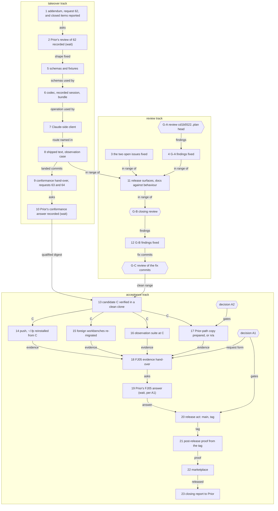

# Implementation Plan: FJ05, the release acceptance of fusion 13.0.0, with the claim takeover of request 38 closed first

**Date:** 2026-10-09
**Spec:** none — planned from the orchestrator's dispatch and the package narrative's notes of 2026-10-09 (Paused, Resumed). The acceptance is Prior's `concept/fusion-json-workbench-spec.md` section 9, FJ05 row and "Pflichtprüfungen", plus the five items of `Prior: docs/design/fusion-fj03d-prior-response.md` `## FJ03d completion and FJ05 scope`.
**Decidability:** The plan rests on four questions. (1) Does the takeover admit exactly the transfers Prior's ruling on 38 admits? This is decidable from the codec's inputs: the request, the stored record, its revision and whether the cited source resolves. Steps 5 and 6 test each of Prior's named cases. Whether the former checkout has actually stopped writing is **not** decidable from any input the codec or the Claude client has; Prior says so ("a resolvable user-word/record reference is evidence, not a credential"). The mechanism therefore does not approximate liveness: it asks the user, per package and per transfer, and records that word as provenance (step 8). (2) Is each FJ05 clause met? Each is a yes/no measurement against named evidence (steps 13 to 16, 21). (3) Do the prompts behave? No text test decides that, so the mechanism is observation of headless runs judged by their effects on disk (step 16). One run proves one run. (4) Who accepts FJ05, and whether Prior's path must be shown on a real migrated workbench, are not decidable from any input at all. They are rulings, filed as decisions 261009-1021-who-accepts-fj05-and-may-13-0-0-ship-on-fusions-evidence-alone.md and 261009-1021-must-fj05-show-priors-access-path-on-a-real-migrated-workbench.md, each placed before the steps it gates.

## Directive

FJ05 is the last of the six packages section 9 enumerates: "Frisch installierter Client, vollständige Assets, Projekt-Smoke-Test, wiederholbare Migration und dokumentierte Einschränkungen". The package narrative reaches its end when that evidence exists and "a fresh install of the resulting plugin migrates a copy of a real v12 workbench and reads one open and one terminal record back through the new paths".

The user ruled on 2026-10-09 that one gap closes inside FJ05, before the release: the administrative takeover of a claim held by a checkout that no longer exists (Prior request 38). Fusion writes the contract addendum, Prior reviews it, and fusion then implements the codec revision, the Claude-side client and the shipped text. A new pin and a conformance run follow. Prior's own host binding of the takeover is Prior's work, and step 9 names the hand-over point.

The package runs in `mode` `autonomous`. **Every step marked *(requires user approval)* stops the run**, and only such a step does. Each release act is marked, and so is every step that waits for Prior, needs input only the user has, or writes outside this repository.

## Current State

Measured at `fj-json-workbench` `e4755c58` on 2026-10-09 unless the line says otherwise.

**Refs and version.** `origin/main` is `48f0c9ff` (12.2.3), an ancestor of HEAD. `origin/fj-json-workbench` is `d398ced1`. `.claude-plugin/plugin.json` reads 13.0.0, and no `v13*` tag exists.

**Bundle.** `codec/dist/fusion-record.js` is `sha256:c76bbce9cc86634f5e9c227e8496511dc71eb845768704f43e68200ab841e52e`, both in the tree and in `~/.fp`. Prior qualified that digest at `d6abeb8` (requests 59 and 60). The takeover moves it.

**Installs.** `~/.fp` is 13.0.0, the window build. `~/.fusion` is 12.2.1 and `~/.local/bin/fusion` hashes `sha256:8a63f46e…3121`. Under decision `261004-2212_*_where-is-the-fj03d-windows-client-installed-from-which-ref-and-what-may-13-0-0-change-after-it.md` no step of this plan installs, updates or writes either of them, the user's words being "~/.fusion auf keinen Fall ändern".

**Review coverage.** The last review, `261005-1353-reviewer-fj03d-side-branch-range-before-the-window.md`, covers `84047ad7..cd1b5522`. `bin/fusion-review-coverage --since cd1b5522 --head HEAD` reports `commits=61 reviews=1 uncovered=61 verdict=uncovered`. Outside `fusion-workbench/` that range changes 55 files (+1 612 −313). It holds the FJ03d review fixes `e29fb624` to `85ea803b`, the FJ03d merge `6f37d798`, and the four commits Prior names (`99eef20d`, `95720e4c`, `b65eb4b0`, `e7695d9c`). It also holds the defect plan's commits `69ee56f8`, `f2e8ea4b`, `89471d97`, `495aca7d`, `308f7a66` and `ee3a3c19`, and the cadence fix `f37b6194`.

**Request 38.** Fusion asked it at `REQUESTS.md` `### 38. A takeover of a stale claim under response 22`. Prior accepted the direction at Prior `b912302` (`Prior: docs/design/fusion-fj03c-prior-response.md` `## 38 Explicit administrative takeover, separately qualified`), and fusion recorded that at `REQUESTS.md` `### Request 38 is not in this revision`. Prior's terms bind this plan:
- a dedicated takeover branch of `claim` that names the inspected previous checkout, the new claim, the exact inspected revision and a resolvable user provenance;
- the kernel checks holder, state, CAS and source, with no fallback to an ordinary claim;
- typed history at `provenance.claim_transfers`, appended atomically, never in `extensions` or `legacy_fields`;
- a `record_change` row with `op: claim` and `change: {from: "claimed", to: "claimed", previous_checkout_id, checkout_id}`;
- tests for denied authority, wrong holder, stale revision, missing source, replay, release after transfer, successive transfers and the general-transition bypass;
- "a contract delta before implementation, including how their references appear in reconcile and archive retention".

The live text says the opposite of a takeover in four places: `rules/fusion-workbench-conventions.md` `## Work packages` ("There is no takeover"), `agents/orchestrator.md` `## Work packages`, `docs/upgrading-to-v13.md` `## Documented limits`, and the header comment of `hooks/lib/record-write.ts`. Decision `260930-2305_*_how-is-a-claim-held-by-a-checkout-that-no-longer-exists-released-under-response-22.md` stands at `answered` (option 2).

**Where the takeover lands in code.** In the codec:
- `codec/src/cli/ops.ts`: `claimPlan` refuses `already-claimed`.
- `codec/schemas/protocol.schema.json`: the `claim` request.
- `codec/schemas/common.schema.json` `$defs/provenance`: `additionalProperties: false`, shared by records and packages.
- `codec/schemas/package.schema.json`.
- `codec/contract/transitions.json`: "a second claim on a claimed package is a conflict".
- `codec/src/references.ts`: the reconcile reference sites.

On the client side: `hooks/lib/record-write.ts` (`ownershipRefusal`, `claimWritten`, `fieldsOf`), `hooks/lib/record-change.ts` (the row), `hooks/lib/record-archive.ts` (the archive host's binding pass) and the `bin/fusion-write` header.

**Prior's FJ05 items, as analysis `261009-0650-prior-fusion-integration-status.md` measured them.**
- The review pass: not done.
- The release artefact: not done.
- The six shipped-consumer gaps and `261005-0626`: done on fusion's side, but not reported to Prior.
- The documentation checked against behaviour: not done.

`REQUESTS.md` `### Requests 59 to 61, as they stand` still reads 61 "asked", although Prior answered "Yes" at `7da6690`.

**Open follow-on issues from the analysis package.**
- `261009-0644-reviewer-said-to-answer-to-code-reviewer-and-data-reviewer-but-neither-identifier-resolves.md`
- `261009-0647-cleanup-splits-name-no-rule-that-keeps-a-record-pair-in-one-commit.md`

Both are `open`. Step 3 takes them in as release-blocking, and `## Approach` says why.

**The foreign workbenches.** Their locations are not in the workbench (analysis `261004-1516-fj04-step12-rerun-proof-on-fresh-copies.md` keeps them out). The second carries 182 `legacy-unknown` actors, and the third still has the v11 store names. Neither was migrated on the code after `0b1e1b58`: eight migration commits since then, `f9ecae78` among them.

**Release surfaces.** `README-agents.md` `## Releasing` names the marketplace working clone `/Users/k1/Projects/productive/claude-plugins`. That path does not exist on this machine, and `/Users/kai/Projects/productive/claude-plugins` does not either. The cache clone `~/.claude/plugins/marketplaces/tenzoki-plugins` exists at `2d93775` ("fusion v10.22.0"). `install.sh` and `README.md` still pin `tags/v12.2.3` in their examples.

**Observation suite.** `hooks/lib/__tests__/agent-dispatch-observation.test.ts` is opt-in (`FUSION_AGENT_RUN=1`). It runs `claude --plugin-dir <work tree>` and costs about 4.4 USD and 7.5 min per run (`261007-2348-agent-dispatch-and-skill-block-observation-at-495aca7d.md`). It keeps its transcripts under `$TMPDIR`. Case (e) has not run since `ee3a3c19`.

## Approach

We run three tracks that meet at one release candidate, called **C** below. Every acceptance run happens at C. The tag `v13.0.0` and `main` are then set to C itself, so the bytes proven are the bytes shipped. Record commits made after C (hand-overs, workbench) stay on `fj-json-workbench` and reach `main` with the next release.

- **The takeover track (steps 1, 2, 5 to 10).**
  - Step 1 appends the contract addendum to `REQUESTS.md` as request 62. The same section reports fusion's closed FJ05 items and restates request 61 as answered, which is item 6 of the dispatch.
  - Step 2 waits for Prior's review.
  - Steps 5 to 8 implement the reviewed shape. Schemas and fixtures come first, then the codec, the client and the shipped text, in that order.
  - Step 9 hands the new bundle to Prior for re-snapshot and re-qualification (requests 63 and 64), mirroring 59 and 60. It names Prior's host binding as Prior's work.
  - Step 10 waits for Prior's conformance answer.
- **The review track (gates G-A, G-B, G-C, steps 3, 4, 11, 12).** The orchestrator dispatches `fusion:reviewer`. The reviewer is not an executor of this plan, so its three passes stand in the graph as gates, not as numbered steps.
  - **G-A** reviews `cd1b5522..<head at plan approval>` and can run while step 2 waits. Step 4 fixes what G-A rates release-blocking.
  - **G-B** is the closing pass, from G-A's head to the head after step 11. It covers the takeover, step 3's fixes, step 4's fixes and the release surfaces. Step 12 fixes what it rates release-blocking.
  - **G-C** reviews step 12's fix commits alone. A release-blocking finding there stops the run for the user, as the FJ04 closing passes did.
- **The acceptance track (steps 13 to 23).**
  - Step 13 verifies C in an isolated clone and keeps the logs in the workbench.
  - Steps 14 to 17 are the evidence runs.
  - Step 18 is the FJ05 hand-over, and step 19 waits on Prior where decision A1 says so.
  - Step 20 is the release act, and step 21 the post-release proof from the tag.
  - Step 22 updates the marketplace, and step 23 sends the closing report to Prior.

**Why the two open issues block the release.** Both make a statement that 13.0.0 ships false, and each fix is one sentence.
- 261009-0647: `/fusion:cleanup` is the shipped commit path at the end of every session. On a JSON workbench it can split a pair that `rules/fusion-workbench-conventions.md` `## fusion-workbench Layout` requires in one commit, and only an after-the-fact `PAIR-SPLIT` row notices.
- 261009-0644: `README-agents.md` ships with 13.0.0 and says the reviewer answers to two identifiers that both resolvers refuse.

Prior's FJ05 item "release documentation checked against actual behaviour" covers the second directly. The smoke test of step 21 would run the first. Leaving them as follow-on would ship two known-false statements under a release whose acceptance clause is that the documentation matches behaviour.

**The takeover, as fusion proposes it in step 1.** Step 2 may correct any of it.
- `claim` gains an optional `takeover` member: `{previous_claim, source}`. `previous_claim` is the complete standing claim as `show` returned it. `source` is a `user-word` or a record reference, in the shape `set-mode` already requires for `autonomous`.
- `expected_revision` is required and is the inspected revision. The `claim` member names the new checkout.
- The kernel refuses in five cases, and none falls back to an ordinary claim:
  - a takeover on a package that is not `claimed`;
  - a `previous_claim` unequal to the stored one;
  - a stale revision;
  - a source that does not resolve or is absent;
  - a new claim naming the previous checkout.
- On success it replaces the claim. In the same write it appends one entry to `provenance.claim_transfers` (packages only): `{previous_claim, claim, inspected_revision, operation_id, actor, transferred_at, source}`. The array is absent on a package that has never been transferred.
- `reconcile` reports each entry's `source` as a reference site. The archive host's binding pass holds a record that a transfer source cites.
- No new `required_features` value is proposed, because no released client predates the field. Step 1 asks Prior to confirm that.
- On the Claude side: `bin/fusion-write claim --record 
 --take-over-from <checkout> --source <JSON>`, sent only on the user's explicit word for that package and that transfer. `mode` `autonomous` never answers it.

Coherence check. The graph has 28 nodes and 32 edges. It has no cycle and no orphan; G-A has no inbound edge because it starts at plan approval. S13 is the join of the review and takeover tracks, and S18 the join of the evidence runs, which is the shape a release candidate and its hand-over should have. Every edge matches a `Dependencies:` line below. The gates and decisions carry no number, because no step executor runs them.

## Implementation Steps

1. **The takeover addendum as request 62, with fusion's closed FJ05 items reported**
   - Executor: analyst (drafts; the orchestrator appends the draft unedited to `REQUESTS.md` and commits)
   - Files: `$OUT_ANALYSIS/YYMMDD-HHMM-fj05-takeover-addendum-and-status-draft.md` (new); `codec/fixtures/prior/REQUESTS.md`, a new section `## FJ05 (the takeover addendum, request 62, and the state of fusion's FJ05 items)`
   - Changes:
     - **The contract delta Prior's `## 38` asks for**, written against `e4755c58` and digest `c76bbce9…`:
       - the `claim` request's takeover branch, field by field, with every refusal class and reason;
       - the `provenance.claim_transfers` entry and where its schema rule sits, so that a record that is not a package refuses it;
       - the `record_change` row in Prior's shape;
       - the reconcile reference site and the archive host's retention rule for a cited source;
       - replay and journal behaviour (stable operation id, no automatic retry);
       - whether a `required_features` value is needed (fusion proposes none, and says why);
       - the test list, Prior's eight cases named one by one;
       - the recorded session to be added, the pinned paths expected to move and the bundle digest change;
       - the Claude route and its approval rule.
     - **Request 62:** "Does this shape meet `## 38`? Correct or refuse each part. Which revision carries it?"
     - **What fusion closed since `e7695d9c`.** D1 (`69ee56f8`), D3 (`89471d97`, decision `261007-1836-…` `implemented`, the successor test in `hooks/lib/__tests__/record-write.test.ts`) and D4 (`f2e8ea4b`, observation analysis `261007-2348-…`, the six bullets in `docs/upgrading-to-v13.md` `## Documented limits`), each as a disposition of Prior's FJ05 item. Also `ee3a3c19` and `f37b6194`.
     - **`### Requests 59 to 62, as they stand`:** 61 "answered Yes at Prior `7da6690`", 62 "asked".
     - Correct the hand-over's "FJ05 is planned against `b65eb4b0`" by naming this plan, without editing the old line.
   - Dependencies: none
   - Acceptance:
     - The section is an append: the earlier lines of `REQUESTS.md` hash equal to the HEAD blob's.
     - The digest it states equals `shasum -a 256 codec/dist/fusion-record.js`.
     - All eight of Prior's test cases are named.
     - `reference-resolution-lint.test.ts` and `workbench-citation-lint.test.ts` are green.
     - The approach paragraph's proposal is stated in full or replaced by a reason.

2. **Prior's review of request 62, recorded** *(requires user approval: the user relays Prior's answer)*
   - Executor: analyst (drafts; the orchestrator appends)
   - Files: `codec/fixtures/prior/REQUESTS.md`, a subsection `### Prior's answer to 62 at <Prior commit>` under step 1's section
   - Changes:
     - Read Prior's response document at the commit the user names, read-only.
     - Record per part of the delta: accepted, corrected (quoting the correction) or refused.
     - List each correction against the step among 5 to 8 that must carry it.
   - Dependencies: 1
   - Acceptance:
     - The subsection names Prior's commit and document, and every part of the delta has a verdict.
     - If Prior refuses the takeover, or reshapes it beyond the fields step 1 names, the run stops here. Steps 5 to 10 are then re-planned, and this plan is not edited.

3. **The two open analysis issues fixed**
   - Executor: code-implementer
   - Files: `skills/cleanup/SKILL.md`, `README-agents.md`, `docs/upgrading-to-v12.md`, the two issue narratives
   - Changes:
     - **261009-0647.** `## Step 2 — Commit in meaningful splits` gains one sentence: a narrative and its control file are staged in the same split. It cites `rules/fusion-workbench-conventions.md` `## fusion-workbench Layout` and does not restate it.
     - **261009-0644.** Both sentences say that `code-reviewer` and `data-reviewer` are Prior catalog names. They map to `reviewer` with a `**Review domain:**` line and are not dispatchable names on Claude.
     - Append a `Resolved:` note to each issue.
   - Dependencies: none
   - Acceptance:
     - `surface-growth-bound.test.ts` is green.
     - `reference-resolution-lint.test.ts` is green.
     - `grep -n "answers to the two profile identifiers\|serving both profile identifiers"` finds no sentence that reads as dispatchable.
     - Any other red is a stop.
     - The orchestrator then closes both issues with disposition `fixed`.

4. **G-A's release-blocking findings fixed**
   - Executor: code-implementer
   - Files: as G-A's issues name them
   - Changes:
     - Every finding G-A rates high or medium is fixed and gets its `Resolved:` note.
     - A finding rated low stays an open issue, and step 18 lists it.
     - A finding in structured data is not fixed here: it stops the run and is routed to `data-implementer` by the user.
   - Dependencies: G-A (the orchestrator dispatches `fusion:reviewer` over `cd1b5522..<head at plan approval>` once the plan is approved; the review file carries `**Reviewed-range:**`)
   - Acceptance:
     - Each high or medium finding's issue has a `Resolved:` note.
     - The test the issue names passes.
     - The hook and codec suites are green, codec run with `CODEC_REQUIRE_GOLDENS=1`.
     - Any red outside the fixed files is a stop.

5. **The takeover's schemas and fixtures**
   - Executor: data-implementer
   - Files: `codec/schemas/protocol.schema.json`, `codec/schemas/common.schema.json` and/or `codec/schemas/package.schema.json` (wherever step 2's answer puts the rule), `codec/fixtures/valid/`, `codec/fixtures/invalid/`, `codec/fixtures/manifest.json`
   - Changes: the shape step 2 accepted, with each correction it lists.
     - Valid fixtures:
       - a `claim` request with `takeover`;
       - a package with one transfer;
       - a package with two transfers;
       - a package with none, its `provenance` byte-equal to today's.
     - Invalid fixtures, each one change from a valid base:
       - `takeover` without `source`;
       - without `previous_claim`;
       - an empty `claim_transfers`;
       - `claim_transfers` on an issue record;
       - an unknown member in a transfer entry;
       - the reserved actor `legacy-unknown` in a transfer's `actor`.
     - No schema id is added unless step 2's answer requires one.
   - Dependencies: 2
   - Acceptance:
     - `fixtures.test.ts` is green, with the manifest count stated before and after.
     - Every recorded session's bytes are unchanged at this step.
     - The live workbench still validates: `validate` with this tree's codec, built in a scratch clone, answers `valid:true`.

6. **The takeover in the codec, its recorded session and the bundle**
   - Executor: code-implementer
   - Files: `codec/src/cli/ops.ts`, `codec/src/references.ts`, `codec/src/kernel.ts` (only if the journal needs it), `codec/contract/transitions.json` (the claim description), `codec/src/__tests__/` (`ops.test.ts`, `kernel.test.ts`, `transitions.test.ts`, `references.test.ts`, a new `round-trip-cli-takeover.test.ts`), `codec/fixtures/protocol-session-takeover/` (new), `codec/dist/fusion-record.js`, `codec/README.md` (the `claim` row)
   - Changes:
     - **Dispatch.** `claimPlan` branches on `takeover`. Without the member, behaviour is byte-identical to today, `already-claimed` included.
     - **Checks.** With the member, the kernel checks state `claimed`, `previous_claim` equal to the stored claim, the CAS on `expected_revision`, the source resolving, and a new checkout different from the previous one. Each failure is the refusal step 2 fixed, and none falls back to an ordinary claim.
     - **Write.** The claim replacement and the `claim_transfers` append land in one write, under the existing journal and stable operation id.
     - **Reconcile.** `reconcile` lists each transfer's `source` as a reference site.
     - **Tests: Prior's eight cases.**
       - "denied authority" is the codec's half: a source that does not resolve;
       - wrong holder;
       - stale revision;
       - missing source;
       - replay, identical and divergent;
       - release by the new holder after a transfer;
       - two successive transfers;
       - the general-transition bypass: `transition --to claimed` with a foreign claim, and `transition` carrying `claim`, both refused as today.
     - **Recorded session.** A session `protocol-session-takeover` is recorded under `UPDATE_PROTOCOL_SESSION_TAKEOVER=1`, with a gate test. Every older recorded response stays byte-identical, or gets a reviewed delta file listed in the step note.
   - Dependencies: 5
   - Acceptance:
     - `cd codec && CODEC_REQUIRE_GOLDENS=1 npm test` is all passed with 0 skipped.
     - `committed-bundle.test.ts` is green.
     - The new digest is written in the step note, beside the list of pinned paths whose blobs changed, as the two Prior pin files enumerate them (read-only).
     - Any recorded byte that moves without a delta file is a stop.

7. **The takeover in the Claude-side client**
   - Executor: code-implementer
   - Files: `hooks/lib/record-write.ts`, `hooks/lib/record-change.ts`, `hooks/lib/record-archive.ts`, `hooks/lib/__tests__/record-write.test.ts`, `hooks/lib/__tests__/record-archive.test.ts`, `hooks/lib/__tests__/monitor-warnings-panel.test.ts` (the `record_change` rows describe block), `codec/src/__tests__/install.test.ts`, `bin/fusion-write` (header), `hooks/dist/` (rebuilt)
   - Changes:
     - **The flags.** `claim` takes `--take-over-from <checkout_id>` and `--source <JSON>`, only together.
       - The client reads `show`. The standing holder must equal the flag; otherwise it refuses with exit 5, nothing sent.
       - `previous_claim` and `expected_revision` are composed from that `show`.
       - The new claim names this checkout, as `claimWritten` already requires.
       - Taking over from this checkout itself is a usage error.
     - **No other change of route.** `ownershipRefusal` for `release` and `transition` is unchanged, and no flag is added to either.
     - **The row.** The `record_change` row of a takeover carries Prior's `change` shape. The monitor test asserts that such a row renders.
     - **Archive.** The binding pass holds a record that a transfer's `source` cites.
     - **Header and dist.** The `bin/fusion-write` header documents the flags. The `record-write.ts` header line "A takeover waits for request 38" is replaced. `hooks/dist` is rebuilt.
     - **The installed-tree case in `install.test.ts`.** No Prior is present.
       - A package is claimed by an absent checkout `deadbeef` and taken over with a `user-word` source.
       - The new holder then releases it.
       - A second package goes through two successive takeovers.
       - `release` by a non-holder still exits 5.
   - Dependencies: 6
   - Acceptance:
     - `record-write.test.ts` gains cases for the composed request, the three usage errors and the two refusals.
     - `committed-dist.test.ts` is green.
     - The hooks suite is green. The hook-test surface stays within its room, measured before the edit.
     - The codec suite is green with goldens required.
     - The bundle digest equals step 6's.

8. **The takeover in the shipped text, and one observation case**
   - Executor: code-implementer
   - Files: `rules/fusion-workbench-conventions.md` (`## Work packages`, the "There is no takeover" paragraph), `agents/orchestrator.md` (`## Work packages`, a **Take over** row and the sentence after the table), `docs/upgrading-to-v13.md` (the stale-claim bullet), `README-hooks.md` (the `bin/fusion-write` row, if it lists subcommand flags), `hooks/lib/__tests__/agent-dispatch-observation.test.ts`, the narrative of decision `260930-2305_*`
   - Changes:
     - **The conventions paragraph** states the route, the user's word per package and per transfer, and the history field, in no more bytes than the dispatch-path room allows. A red bound is met by a cut, never by a baseline edit.
     - **The orchestrator row:** the user's explicit word names this package and its previous holder, and the user confirms that the former checkout is gone or stopped. Prior requires the former writer to be quiesced. The user's words go verbatim into the narrative, and `--source` cites them. The row is not one `mode` `autonomous` answers; it falls among "the row's other operations", which ask as written, and the row says so in one clause.
     - **The upgrade document** replaces the limit with the route.
     - **The observation case.** The opt-in suite gains one case. The orchestrator is told headless, in the user's words, to take over package A from checkout `deadbeef`, which is gone. Afterwards A is claimed by the scratch checkout, with one `claim_transfers` entry whose source resolves.
     - **The decision line.** Append `Implemented:` to decision `260930-2305_*`, citing the files and headings of steps 5 to 8.
   - Dependencies: 7
   - Acceptance:
     - `rules-emission-golden.test.ts` and `surface-growth-bound.test.ts` are green.
     - `reference-resolution-lint.test.ts` is green.
     - `grep -rn "There is no takeover" rules agents docs/upgrading-to-v13.md` finds nothing.
     - Without `FUSION_AGENT_RUN` the suite collects and skips the new case.
     - The orchestrator then moves the decision to `implemented` with this step's commit.

9. **The conformance hand-over, requests 63 and 64, and the hand-over point of Prior's host binding**
   - Executor: analyst (drafts; the orchestrator appends and commits)
   - Files: `codec/fixtures/prior/REQUESTS.md`, a new section `## FJ05 (the takeover revision, requests 63 and 64)`
   - Changes:
     - What landed, and at which commits (steps 5 to 8).
     - The bundle digest: old, new, byte size.
     - The pinned paths whose blobs moved, counted against both Prior pin files, and the delta files.
     - The new recorded session.
     - **Request 63:** re-snapshot the shared fixture set at <commit> and re-run the Go harness.
     - **Request 64:** re-pin the bundle, replay every recorded session through its deltas (the takeover session included), re-qualify the kernel, and run Prior's conformance suite.
     - **The hand-over point, stated as such.** Prior's host binding of the takeover is Prior's work and gates no fusion release, because the Claude route works with Claude Code alone. That binding covers its administrative authority, revocation and generation checks, the quiescing of a Prior worker, and exposing the branch through `prior fusion call`.
   - Dependencies: 8
   - Acceptance:
     - The section is an append.
     - The digest stated equals `shasum`.
     - The moved-path counts are derived from the pin files by a command the section quotes.

10. **Prior's conformance answer, recorded** *(requires user approval: the user relays Prior's answer)*
    - Executor: analyst (drafts; the orchestrator appends)
    - Files: `codec/fixtures/prior/REQUESTS.md`, `### Prior's answer to 63 and 64 at <Prior commit>`
    - Changes: the answer per request, with Prior's figures (manifest cases, exchanges, the qualified digest).
    - Dependencies: 9
    - Acceptance:
      - The qualified digest Prior names equals step 6's digest.
      - If Prior does not qualify it, or asks for codec bytes to change, the run stops here and steps 5 to 10 are re-planned.

11. **Release surfaces brought to 13.0.0, and the release documentation checked against behaviour**
    - Executor: code-implementer
    - Files: `install.sh` (the header's `FUSION_REF=tags/v<version>` example), `README.md` (the pin example), `skills/help/SKILL.md` `### 4. Update`, `docs/upgrading-to-v13.md`, `README-agents.md` `## Releasing` (the marketplace clone path)
    - Changes:
      - **Pin examples.** Both name `tags/v13.0.0`.
      - **The update topic.** It gains the 13.0.0 paragraph. The paragraphs below it are relabelled and the oldest is dropped, under its byte ceiling.
      - **The documented limits.** Every bullet of `## Documented limits` is checked against the head. Each bullet either cites the test or observation that shows it, or is corrected. Prior names three bullets in particular: old-client exclusion during migration, stale claims (now the takeover), and the other stated limits.
      - **The marketplace clone path** in `## Releasing` says that the location is machine-specific and asked of the user at release, in place of a fixed path that does not exist here.
      - `plugin.json`'s version stays 13.0.0, and its `description` is read for step 22.
    - Dependencies: 3, 4, 8
    - Acceptance:
      - `claude plugin validate .` reports passed.
      - `claude --plugin-dir . --agent fusion:orchestrator -p "reply SMOKE-OK"` replies `SMOKE-OK`.
      - `surface-growth-bound.test.ts` and the help topic's ceiling test are green.
      - Every limits bullet carries a citation or was corrected, and the step note lists which.
      - Any other red is a stop.

12. **G-B's release-blocking findings fixed**
    - Executor: code-implementer
    - Files: as G-B's issues name them
    - Changes: as step 4, for the closing pass G-B. The orchestrator dispatches `fusion:reviewer` over `<G-A's head>..<step 11's head>`.
    - Dependencies: G-B
    - Acceptance:
      - As step 4.
      - G-C, a review of this step's commits alone, then reports no high or medium finding. If it reports one, the run stops for the user, who rules whether it blocks the release.

13. **The release candidate C verified in an isolated clone**
    - Executor: analyst
    - Files: `$OUT_ANALYSIS/YYMMDD-HHMM-fj05-release-candidate-verification-at-<C>.md` (new), with its logs in `$OUT_ANALYSIS/YYMMDD-HHMM-fj05-release-candidate-verification-at-<C>-logs/`
    - Changes: C is the head after step 12 and G-C. The analyst works in a scratch clone of C, never in the live tree, because the suites rebuild compiled files there. It runs and keeps the full output of:
      - `cd hooks && npm install && npm test`;
      - `cd codec && CODEC_REQUIRE_GOLDENS=1 npm test`;
      - `shasum -a 256 codec/dist/fusion-record.js`;
      - `git status --porcelain` after both suites;
      - `bin/fusion-review-coverage --since cd1b5522 --head C`;
      - `git merge-base --is-ancestor origin/main C`;
      - the room figures of the four growth bounds.
      It also records the source and tool versions: node, npm, git, claude and macOS.
    - Dependencies: 10, 12, G-C clean
    - Acceptance:
      - The hooks suite is green.
      - The codec suite is all passed with 0 skipped, which states that the 13 goldens-required assertions passed.
      - The digest equals the one Prior qualified in step 10.
      - The clone is clean after the suites, so the committed bundle and `hooks/dist` are reproducible.
      - Coverage reads `verdict=covered`.
      - `origin/main` is an ancestor of C, and every room figure is at or above 0.
      - Any failure is a finding with an issue path. Nothing is retried into a pass.

14. **Push the branch and reinstall `~/.fp` from C** *(requires user approval: the push and the install, separately)*
    - Executor: code-implementer
    - Files: none in the repository; `~/.fp` and `~/.fp-bin` outside it
    - Changes:
      - Record the sha256 of `~/.local/bin/fusion` and the version in `~/.fusion/.claude-plugin/plugin.json`.
      - `git push origin fj-json-workbench`.
      - `FUSION_REF=heads/fj-json-workbench FUSION_HOME="$HOME/.fp" FUSION_BIN="$HOME/.fp-bin" bash install.sh`. Never `fusion --update`.
      - This gives the user's own test of "Claude and Prior" the candidate rather than the window build, and gives this session's later steps the takeover client.
    - Dependencies: 13
    - Acceptance:
      - `origin/fj-json-workbench` contains C.
      - `~/.fp` equals `git archive C` for every path of `install.sh`'s copy loop, with 0 differences.
      - The installed bundle digest equals step 6's.
      - `~/.local/bin/fusion` and `~/.fusion` are unchanged against the recorded values.

15. **The two foreign workbenches re-migrated on fresh copies with the C build** *(requires user approval: the user supplies both source locations, which no record may carry)*
    - Executor: analyst
    - Files: `$OUT_ANALYSIS/YYMMDD-HHMM-fj05-re-migration-of-two-real-workbenches-at-<C>.md` (new), with its logs beside it. Aggregate figures only; no path, name or record text of either project.
    - Changes:
      - **The harness.** Rebuild analysis 261004-1516's harness in the scratchpad: `build-install.sh`, `fm.sh`, `skillblk.sh` and the tree hash. Install from `git archive C` through `install.sh`, with stub `curl` and `claude`, under `env -i` with `PATH`, `HOME` and `FUSION_PLUGIN_ROOT` only. No Prior is present.
      - **The sources.** Hash each source workbench before the copy, after it and at the end.
      - **The v11 rename.** On the third copy, run `skills/migrate/SKILL.md` Steps 1, 2 and 4 verbatim from the installed file, then commit the rename.
      - **The migration.** On each copy:
        - survey, then the run;
        - `validate` answers all valid;
        - a second run answers `no-op`;
        - read back one open and one terminal record through `bin/fusion-record show`, `bin/fusion-paths` and `bin/fusion-work-order`;
        - kill once mid-apply, then resume;
        - roll back on a second fresh copy before any ordinary write, which must reach a byte-identical tree.
      - **The comparison.** Compare each figure with 261004-1516's: findings, questions, record counts and derived-value classes.
    - Dependencies: 13
    - Acceptance:
      - Both copies end valid, with a no-op second run, a resumed kill and a byte-identical rollback.
      - Each source's three hashes agree.
      - Every difference from 261004-1516 is explained or filed as an issue.
      - No record in the workbench names either location: a grep for both source paths over `fusion-workbench/` finds nothing.

16. **The observation suite at C, transcripts kept in the workbench**
    - Executor: analyst
    - Files: `$OUT_ANALYSIS/YYMMDD-HHMM-agent-dispatch-observation-at-<C>.md` (new), with its transcripts in `$OUT_ANALYSIS/YYMMDD-HHMM-agent-dispatch-observation-at-<C>-transcripts/`
    - Changes:
      - In the scratch clone of C, run `cd hooks && FUSION_AGENT_RUN=1 npx vitest run lib/__tests__/agent-dispatch-observation.test.ts` once, so `--plugin-dir` is C. Every case runs, step 8's takeover case among them, and the case count is stated from the file.
      - Record per case: the command, model, wall-clock, exit, cost, the asserted effect and pass or fail.
      - Copy every JSON transcript from `$TMPDIR/fusion-agent-run-*` into the transcripts directory.
      - State the run's total cost; about 4.4 USD is expected.
      - Restate the rows of `docs/upgrading-to-v13.md` that stay unobserved.
    - Dependencies: 13
    - Acceptance:
      - The report exists, every case is classified, the transcripts are in the workbench, and every failure has an issue path. Nothing is retried into a pass.
      - `workbench-citation-lint.test.ts` and staging drift accept the transcripts directory. If they do not, that is a finding with an issue, and the transcripts move to wherever the issue's ruling says.

17. **Prior's access path on a real migrated workbench, prepared or ruled not applicable**
    - Executor: analyst
    - Files: the step note; with option 2, a scratch copy outside the repository whose location and tree hash go into step 18's section
    - Changes: decision `261009-1021-must-fj05-show-priors-access-path-on-a-real-migrated-workbench.md` decides what this step does.
      - **Option 1:** the step is done as not applicable, citing the decision.
      - **Option 2:** `git archive C fusion-workbench` goes into a scratch directory. It is validated with C's codec (`validate` all valid, `reconcile` clean), and its location and tree hash are written down for Prior's read-only run in step 18.
      - **Option 3:** writes Prior's repository, which this package must not do. The run stops, and the step is re-planned with the user.
    - Dependencies: 13, decision A2 answered
    - Acceptance: the note names the option ruled. Under option 2, the copy validates and its hash is recorded.

18. **The FJ05 evidence hand-over** *(requires user approval: the user carries it to Prior)*
    - Executor: analyst (drafts; the orchestrator appends and commits on the branch)
    - Files: `codec/fixtures/prior/REQUESTS.md`, a new section `## FJ05 (the release evidence at <C>)`
    - Changes:
      - **Prior's five items, each with its evidence:**
        - the review passes G-A, G-B and G-C, and coverage `verdict=covered`;
        - the release candidate C (steps 13 and 14);
        - the shipped-consumer gaps (step 16);
        - `261005-0626` (D3, already reported in step 1);
        - the documentation check (step 11).
      - The goldens-required run.
      - The re-migration aggregates (step 15) and the observation results (step 16).
      - The open low-rated review issues.
      - Under decision A2 option 2, request 66: Prior's read-only `prior fusion` run on step 17's copy.
      - Request 65, in the form decision `261009-1021-who-accepts-fj05-and-may-13-0-0-ship-on-fusions-evidence-alone.md` rules:
        - option 1: informational only, no question;
        - option 2: "do you accept FJ05 at C?";
        - option 3: "does the shared-contract evidence meet section 9's mandatory checks?".
      - `### Requests 59 to 66, as they stand`.
      - What the release act will do, and that it tags C itself.
    - Dependencies: 14, 15, 16, 17, decision A1 answered
    - Acceptance:
      - The section is an append.
      - Every figure cites its step's report.
      - The request form matches the ruled option.

19. **Prior's FJ05 answer, recorded, where decision A1 requires one** *(requires user approval: the user relays Prior's answer)*
    - Executor: analyst (drafts; the orchestrator appends)
    - Files: `codec/fixtures/prior/REQUESTS.md`, `### Prior's answer to 65 (and 66) at <Prior commit>`
    - Changes:
      - **Option 1:** the step is done as not applicable, and nothing is waited for.
      - **Options 2 and 3:** record Prior's answer per request.
    - Dependencies: 18
    - Acceptance:
      - Under options 2 and 3 the answer is "yes", or the run stops here and the user rules.
      - Under option 2 of A2, request 66's result is recorded whatever A1 says.

20. **The release act: `main` and the tag set to C** *(requires user approval: the release)*
    - Executor: code-implementer
    - Files: none changed; refs only
    - Changes:
      - **Preconditions**, each asked in the one approval:
        - decision A1 is satisfied (step 19);
        - the user confirms that their own test with Claude and with Prior is done, which the 2026-10-09 pause note named;
        - step 13's coverage verdict;
        - `claude plugin validate .` still passes at C.
      - **The act:**
        - `git push origin <C>:main`, fast-forward only, refused otherwise;
        - `git tag -a v13.0.0 <C> -m "fusion v13.0.0"`, with the coverage result in the annotation;
        - `git push origin v13.0.0`.
      - No version bump commit is needed, because C already reads 13.0.0. No `fusion --update` runs, and nothing writes `~/.fusion`.
    - Dependencies: 19, decision A1 answered
    - Acceptance:
      - `git rev-parse origin/main` equals C, and `git rev-parse 'v13.0.0^{commit}'` equals C.
      - `git show C:.claude-plugin/plugin.json` reads 13.0.0.
      - `~/.fusion` and `~/.local/bin/fusion` are unchanged.

21. **The post-release proof from the tag**
    - Executor: analyst
    - Files: `$OUT_ANALYSIS/YYMMDD-HHMM-fj05-post-release-proof-from-the-v13-0-0-tag.md` (new), with its logs beside it
    - Changes:
      - **The fresh install.** Run `FUSION_REF=tags/v13.0.0 FUSION_HOME=<scratch home> FUSION_BIN=<scratch bin> bash install.sh` over HTTPS, with no Prior present.
        - The installed tree equals `git archive v13.0.0` for every path of the copy loop, with 0 differences.
        - Every asset is present, by `/fusion:check`'s asset block run verbatim from the installed file.
        - The bundle digest is the qualified one.
      - **The update path.** The scratch launcher's `--where`, then `--update`. Show which ref it fetches (`heads/main`, now C) and that it writes only its own home. `~/.fusion` and `~/.local/bin/fusion` hash as recorded before and after.
      - **Section 9's read-back.** Migrate a fresh copy of the smaller foreign workbench with this install, and read one open and one terminal record back through `bin/fusion-record show`. The user supplies the location again; it is not recorded.
      - **The smoke test in a second project.** Use a scratch git project that is not fusion:
        - `/fusion:setup`'s blocks run verbatim and create a JSON workbench;
        - `/fusion:wp` files a package and claims it;
        - `claude --plugin-dir <scratch home> --agent fusion:analyst -p` with Setup resolves `OUT_*` into the claimed container;
        - one `bin/fusion-write` takeover on a second package claimed by an absent checkout lands.
    - Dependencies: 20
    - Acceptance:
      - Every clause above holds, and none is retried into a pass.
      - A failure in installed bytes is a stop. Shipping 13.0.0 again with changed bytes is forbidden by section 8.1, so the user rules on 13.0.1.

22. **The marketplace entry** *(requires user approval: the push of the marketplace repository, and separately the pull of the local cache clone)*
    - Executor: code-implementer
    - Files: `<marketplace working clone>/.claude-plugin/marketplace.json`, at the location the user names; `~/.claude/plugins/marketplaces/tenzoki-plugins` (pull only)
    - Changes:
      - `git -C <clone> pull --rebase origin main`.
      - Set the fusion entry's `version` to 13.0.0.
      - Rewrite its `description` to agree with `plugin.json`'s, read side by side. Today's entry still says "15 … agents".
      - Commit and push.
      - Then `git -C ~/.claude/plugins/marketplaces/tenzoki-plugins pull origin main`.
      - No agent runs `/plugin install`.
    - Dependencies: 21
    - Acceptance:
      - The marketplace `origin/main` carries 13.0.0.
      - The two descriptions are quoted side by side in the step note and state the same product.
      - The cache clone's fusion entry reads 13.0.0.

23. **The closing report to Prior** *(requires user approval: the push)*
    - Executor: analyst (drafts; the orchestrator appends and commits on `fj-json-workbench`)
    - Files: `codec/fixtures/prior/REQUESTS.md`, a new section `## FJ05 (released as v13.0.0)`
    - Changes:
      - The tag, C, the digest, step 21's results and the marketplace state.
      - What stays open, each with its owner:
        - Prior's host binding of the takeover;
        - the module bundle package `261008-1215-fusion-as-an-external-prior-module-bundle.md`;
        - FH09;
        - the migration of Prior's own workbench;
        - the open low-rated review issues.
      - `### Requests 59 to 66, as they stand`.
      - `git push origin fj-json-workbench` on the user's word.
    - Dependencies: 22
    - Acceptance:
      - The section is an append.
      - `origin/fj-json-workbench` contains it.
      - `main` is still C.

## Where this work stops

- Prior answered request 62 with acceptance, or with corrections that steps 5 to 8 carried, and the answer is recorded in `REQUESTS.md`.
- The takeover is implemented in the codec, the client and the shipped text, and decision `260930-2305_*_how-is-a-claim-held-by-a-checkout-that-no-longer-exists-released-under-response-22.md` is `implemented` with step 8's commit.
- Prior qualified the bundle digest that C carries (requests 63 and 64), and the answer is recorded.
- Issues 261009-0647 and 261009-0644 are closed.
- Every high or medium finding of G-A and G-B is closed, and G-C reported none, or the user ruled on each one it reported.
- At C, in an isolated clone: the hooks suite is green, the codec suite with `CODEC_REQUIRE_GOLDENS=1` reports 0 skipped, the digest equals the qualified one, and `bin/fusion-review-coverage --since cd1b5522 --head C` reads `verdict=covered`.
- Both foreign copies were re-migrated at C: valid, no-op second run, resumed kill, byte-identical rollback, source hashes unchanged, and no record names their locations.
- The observation suite ran once at C, every case is recorded, its transcripts are in the workbench, and every failure has an issue.
- Decisions `261009-1021-who-accepts-fj05-and-may-13-0-0-ship-on-fusions-evidence-alone.md` and `261009-1021-must-fj05-show-priors-access-path-on-a-real-migrated-workbench.md` were answered by the user before steps 17 and 18 ran.
- Precondition of the release act: the user approved step 20 and confirmed their own test with Claude and with Prior, and Prior's answer was "yes" where decision A1 requires one.
- `origin/main` and `v13.0.0^{commit}` both equal C.
- A fresh install from the tag equals `git archive v13.0.0` on every installed path, read back one open and one terminal record from a freshly migrated real v12 copy, and passed the smoke test in a second project.
- The marketplace entry reads 13.0.0, with its description agreeing with `plugin.json`'s.
- `~/.fusion` and `~/.local/bin/fusion` are byte-identical to the values recorded at step 14, at every step after it.
- The closing report is appended to `REQUESTS.md` and pushed.

## Data Structures

- **`claim` request, takeover branch:** `takeover: {previous_claim: <claim>, source: <user-word | record reference>}`, beside the existing `claim`, `expected_revision` and `actor`.
- **`provenance.claim_transfers`** (packages only, absent when empty): an array of `{previous_claim, claim, inspected_revision, operation_id, actor, transferred_at, source}`, append-only.
- **`record_change` row of a takeover:** `op: "claim"`, `change: {from: "claimed", to: "claimed", previous_checkout_id, checkout_id}`.

Every name above is fusion's proposal until step 2 records Prior's answer.

## API Changes

- `bin/fusion-write claim --record <package control path> --take-over-from <checkout_id> --source <JSON>`. Both flags are required together. The standing holder must equal `--take-over-from`, and the new claim names this checkout.
- `release` and `transition` are unchanged and keep the foreign-owner refusal.
- Codec: `claim` with `takeover`, with the refusal classes step 2 fixes. `reconcile` gains a reference site per transfer source.

## Testing Strategy

- **Prior's eight takeover cases in the codec** (step 6), the client's composition and refusals (step 7), and one installed-tree case with no Prior present (step 7).
- **A recorded protocol session** for Prior's replay (step 6). Every older recording stays byte-identical or carries a reviewed delta.
- **One observation case for the prompt route** (step 8), run once at C (step 16).
- **Isolated-clone verification at C** with goldens required (step 13). The suites are never run in the live tree, because they rebuild compiled files there.
- **Real-workbench proofs at C** (step 15) and from the tag (step 21), with source hashes taken before and after.
- A failed run is a finding and is never retried into a pass.

## Risks & Mitigations

| Risk | Mitigation |
|---|---|
| Prior reshapes the takeover beyond step 1's fields, or refuses it | Step 2 stops the run, and steps 5 to 10 are re-planned. The user's ruling puts the takeover inside FJ05, so 13.0.0 waits rather than shipping without it |
| A record with `claim_transfers` written before `~/.fp` is reinstalled is refused by the window client's older codec | No takeover is written to this repository's live workbench by any step. Step 14 reinstalls `~/.fp` before the user tests |
| Prior's conformance run finds a codec defect after G-B has reviewed the code | Step 10 stops the run. The fix is re-planned and goes through its own review before C is fixed |
| The `claim_transfers` rule in the shared `$defs/provenance` leaks onto non-package records | Step 5's invalid fixture puts a transfer on an issue record and must be refused |
| The conventions paragraph grows past zero head-room on the dispatch path | Step 8 measures before editing, rewrites the paragraph in place and cuts. A baseline edit is excluded |
| Step 15 runs without the source locations, or a record leaks them | The step asks the user, and its acceptance greps the workbench for both paths |
| The observation suite fails for a reason unrelated to the release (model variance, an approval asked in `-p`) | Recorded as a finding with an issue, never retried. Step 18 reports it, and A1's acceptor rules |
| The tag is pushed and step 21 then finds an installed-byte defect | Every proof of steps 13 to 16 ran on C's bytes before the tag. A late defect is a 13.0.1, ruled by the user, never a re-tag |
| The marketplace working clone named in `## Releasing` does not exist on this machine | Step 11 corrects the text, and step 22 asks the user for the location |
| A `fusion --update` or an install reaches `~/.fusion`, where the user works productively | No step runs `--update` from `~/.local/bin/fusion`. Steps 14, 20 and 21 hash `~/.fusion` and its launcher before and after |
| Record commits after C (the hand-overs) are mistaken for release content | The tag and `main` are set to C itself. Those commits stay on `fj-json-workbench` and the closing report says so |

## Open Questions

- [ ] Who accepts FJ05: decision `261009-1021-who-accepts-fj05-and-may-13-0-0-ship-on-fusions-evidence-alone.md`. It gates step 18's request form, step 19 and step 20.
- [ ] Prior's path on a real migrated workbench: decision `261009-1021-must-fj05-show-priors-access-path-on-a-real-migrated-workbench.md`. It gates step 17 and request 66.
- [ ] Step 15 and step 21: the two foreign workbenches' source locations, asked of the user at the step and never recorded.
- [ ] Step 22: the marketplace working clone's location on this machine.

**Step note, steps 5 and 6 (2026-10-09):** schemas `common`, `protocol`, `record`, `campaign` carry the takeover (`$defs/claim`, `$defs/claim_transfer`, `provenance.claim_transfers`, refused on record and campaign); manifest 347 to 370 entries. The codec branches `claimPlan` to `takeoverPlan`; `referenceSites` lists each transfer source; `codec/contract/transitions.json` byte-unchanged; recorded session `codec/fixtures/protocol-session-takeover/` (37 exchanges); no older recorded byte moved. New bundle `sha256:fb1703619c94bd2ed6ef8b753e70dd38e36dcb26da0775fb4e19274ed11bb66f`, 699 011 bytes (was `c76bbce9…`). Pinned paths moved: `fusion-codec/UPSTREAM.json` 6 of 390 (`fixtures/manifest.json`, `fixtures/prior/REQUESTS.md`, `schemas/{campaign,common,protocol,record}.schema.json`); `fusion-fj01/UPSTREAM.json` 2 of 611 (`codec/dist/fusion-record.js`, `codec/fixtures/prior/REQUESTS.md`). **Measured against the addendum's part 7:** the old bundle refuses a transferred package on `validate`, `release`, `transition` and a takeover request, and moves no byte, but its `show` returns the package as stored, since `show` does not validate; steps 8 and 9 state it that way. `CODEC_REQUIRE_GOLDENS=1 npm test` 1809 passed, 0 skipped; hooks 1148 passed.

**Step note, step 7 (2026-10-09):** `bin/fusion-write claim --take-over-from <checkout> --source <JSON>` composes `previous_claim` and `expected_revision` from `show`; a re-send after an unknown outcome takes `--previous-claim <JSON>` and repeats the frozen request without `show` (for step 9's hand-over). The client checks `--source` only as a JSON object; the codec judges its shape. The monitor shows a takeover row as `claimed -> claimed`; the two checkout ids are in `change` and not rendered. Bundle digest unchanged `fb170361…`. Hook-test surface 24 687 to 24 778 lines of 28 872. hooks 1152 passed; codec `CODEC_REQUIRE_GOLDENS=1` 1810 passed, 0 skipped (scratch clone).

**Step note, step 11 (2026-10-09):** pin examples name `tags/v13.0.0`; the help topic and `docs/upgrading-to-v13.md` `## Two installations on one machine` describe the released form; the marketplace clone path is asked of the user at release; the two remaining "There is no takeover" sentences (`README-agents.md`, `docs/working-model.md`) give the route. Documented limits: 1 v12 writer undetected, kept (shown by absence); 2 `narratives` findings, cited `ops.test.ts`; 3 takeover on the user's word, cited `round-trip-cli-takeover.test.ts`, `record-write.test.ts`; 4 old client boundary, corrected to what was measured (validate, release, transition, takeover refused; `show` returns as stored; aggregate operations not measured); 5 `succeeded` edge, cited `transitions.test.ts`, `record-write.test.ts`; 6 unknown filers, cited `migrate.test.ts`, `migration.test.ts`; 7 step number as anchor, cited; 8 citation conflict vs lint, cited one side; 9 Prior qualification, corrected (bundle `fb170361…` awaits requests 63/64); 10 unobserved agent behaviours, six to seven, the seventh (takeover case i) to be replaced by step 16's result. Reference count re-approved 2045/370. `plugin.json` description names no JSON control, codec, migrate or takeover (for step 22). Smoke `SMOKE-OK`.

**Ruling 2026-10-09 (user):** "axibra: ich mache eine migration wenn wir hier technisch fertig sind, VOR dem richtigen v13 release. wenn die migration funktioniert hat, folgt ein release". The real migration of the axibra workbench is the user's act after the release candidate C exists and is installed (steps 13 and 14), and before the release act (step 20); a successful axibra migration is a precondition of step 20.
