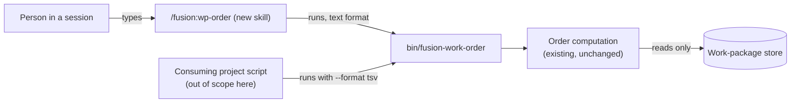

# Spec: a slash command that reports the computed work order, and a TSV output for `bin/fusion-work-order`

**Date:** 2026-10-01
**Status:** Complete. Final. All four user decisions were answered on 261001 and are folded in below.
**Source:** work package `261001-1930-work-order-slash-command-and-machine-readable-output.md`, its `## Directive` and the two consultant answers quoted under it, which the user pasted on 261001-1930 with the words "Mach daraus eine Paket, lass es spezifizieren und planen". Clarification answers relayed by the orchestrator on 261001 as "2 1 3 1".

## Directive

After this work, a person can type `/fusion:wp-order` and get the work order fusion computes over the work-package store, rendered in the chat language, with its caveat line repeated in its own sentence. The same helper also prints that order as a documented, versioned TSV stream. A consuming project can then read item, status, prerequisites, depth, blocking count, position and readiness from it, and stop parsing `**Status:**` and `**Depends-on:**` a second time. The command reads and reports. It never ranks, recommends or writes.

## Capabilities

### C1: The `/fusion:wp-order` slash command

> **Scope note, 12.2.0 on.** Four C1 criteria hold for the text format only. With `--format tsv|json|markdown` the command departs from them: (1) rendering in the project's chat language (the Description); (2) a `note=` line repeated as a separate sentence; (3) each cycle, unresolved-entry and unreadable-record row named to the person with its meaning; (4) exit 1 reported as a fusion defect, where with an argument it is now the person's argument. The source of the departure is `261002-0733_*_plan-work-order-markdown-and-json-formats.md`, whose Approach and Risks table argue each one. That plan's head names only D1 as superseded, and this note records the other four (issue `261002-0926_*_the-plan-names-only-d1-as-superseded-while-the-pass-through-formats-also-relax-four-c1-criteria-of-the-spec.md`).

**Description:** A person in a fusion session types `/fusion:wp-order`. The command checks that it sits inside a fusion workbench and that the installed fusion carries the helper. It then runs `bin/fusion-work-order` and renders what the helper printed, readably and in the project's chat language: the summary figures, the ordered item table, and any cycle, unresolved-entry and unreadable-record rows. Any `note=` line is repeated to the person in a sentence of its own. The command adds nothing the helper did not compute. The body follows the shape of the existing wrapper skills (`skills/news/SKILL.md`, `skills/wp/SKILL.md`): the mechanics stay documented in the helper's own header, and the body carries only the flow and the sentences the person reads. The command's name differs from the helper's, so the body says which helper it wraps.

**Acceptance criteria:**
- [x] The skill lives at `skills/wp-order/SKILL.md`, and the command is `/fusion:wp-order`.
- [x] The skill body names `bin/fusion-work-order` as the helper it wraps and points to that helper's header as the authoritative account of the mechanics.
- [x] Typing the command in a project that has a fusion workbench shows the summary figures (items, edges, unresolved entries, cycles, ready, roots, items with no prerequisite field, unreadable records, verdict) and one line per item in the helper's order. Each line shows position, depth, blocking count, readiness and item name.
- [x] Item order, readiness words and figures in the rendering match the helper's own output for the same store, item for item. The command never reorders, filters, groups by preference or omits an item.
- [ ] When the helper prints a `note=` line, the person sees its content as a separate sentence in the chat language, and it is never folded into a table or dropped.
- [ ] Every cycle, unresolved-entry and unreadable-record row the helper printed is named to the person, along with what each means.
- [x] `verdict=empty` is reported as a real answer ("no live work packages"), never as an error.
- [x] The command never says which item to take next, never adds a recommendation or a priority, and never calls the order binding. It reports the order as the helper's computation, which the user may override.
- [x] Outside a fusion workbench the command stops with the standard message to run `/fusion:setup` at the project root, and creates nothing.
- [x] When the installed fusion does not carry an executable `bin/fusion-work-order`, the command stops with a message naming `fusion --update` followed by a session restart.
- [ ] Each of the helper's non-zero exits is reported distinctly: no workbench (2), compiled hooks missing, so the install is broken and `fusion --update` is the remedy (3), and usage error (1), which is reported as a fusion defect and not as the person's fault.
- [x] The command writes no file, commits nothing, asks the person no question and dispatches no agent.
- [x] The helper is invoked through `$FUSION_PLUGIN_ROOT/bin/fusion-work-order` and never as a bare `bin/...` path, so it resolves in a consuming project (issue `260916-0755_*_the-work-order-helper-is-named-bare-in-shipped-text-so-a-consuming-project-reader-resolves-nothing.md`).
- [x] The new skill body is no larger than 6 000 bytes, and the skill-body growth bound stays green.

**Decisions made:**
- Name: `/fusion:wp-order`, directory `skills/wp-order/` (user, 261001, D3). It sits beside `/fusion:wp` and deliberately differs from the helper's name. `wp-order` collides with no agent name in `bin/fusion-paths`' flat namespace.
- Read and report only, never rank: fixed by the brief, and consistent with decision `260909-1808_*_may-a-helper-compute-an-order-over-work-items-after-the-portfolio-layer-goes.md` as the conventions state it (`rules/fusion-workbench-conventions.md`, the `**Depends-on:**` paragraph): the helper computes, no agent asserts a ranking, and the user overrides at will. A skill body is a user prompt, so running it is running the helper "by a person".
- The command takes no arguments (default: the brief asks for nothing more).
- Size ceiling of 6 000 bytes (default: `skills/wp/SKILL.md` is 4 994 bytes and `skills/news/SKILL.md` is 8 223. The command has fewer steps than either, and a ceiling keeps the head-room for later work).

### C2: A TSV output of the work order

**Description:** `bin/fusion-work-order --format tsv` prints the same computation as the default text format: the same figures, the same item order, the same cycles, unresolved entries and unreadable records. The output is a TSV stream: a block of `#` comment lines carrying the format version, the summary figures and the caveat, then one header line, then one row per live item. Each row carries the item's status and its prerequisite entries as written, so a consumer never opens a work-package record to learn them. The default text output stays byte-identical. The format is documented in the helper's own header, which stays the authoritative account, and its version marker lets a consumer depend on it.

**Acceptance criteria (the output contract):**

*Selection and exits*
- [x] Run with no option, the helper prints byte-for-byte what it prints today. `--format text` selects that same output explicitly.
- [ ] `--format tsv` selects the stream below. No other format name exists.
- [x] Exit codes are unchanged and mean the same in every format: `0` the computation ran, whatever the verdict (a cycle and `empty` are both exit 0); `1` usage error, including an unknown format name, a missing format value or any other argument; `2` no fusion workbench above the working directory; `3` the plugin's compiled hooks are missing. On every non-zero exit stdout is empty and the reason goes to stderr, so a consumer never parses a partial stream.

*Stream layout*
- [x] The stream is UTF-8 without a byte-order mark. Every line ends in a single LF, the last line included, and there are no blank lines.
- [x] The stream has three parts in this order: comment lines, exactly one header line, zero or more item rows. The header is printed even when there are no rows (`verdict=empty`).
- [x] A comment line is `#` immediately followed by `key=value`, with no space: a consumer strips the first character and splits at the first `=`. The comment lines appear in this fixed order:
  1. `#format=1`, always the first line of the stream.
  2. `#anchor=workbench-root`.
  3. `#items=`, `#edges=`, `#unresolved-edges=`, `#cycles=`, `#ready=`, `#roots=`, `#no-depends-on-field=`, `#unreadable-head=`, each carrying the same integer the text format prints under the same key.
  4. `#verdict=` with `acyclic`, `cyclic` or `empty`.
  5. `#note=` with the same caveat text the text format prints after `note=`, present exactly when the text format prints a `note=` line and absent otherwise.
  6. `#unreadable=<item>`, one line per item record whose head yields no readable status, in ascending name order. None when `unreadable-head` is 0.
- [x] The header line is these ten column names, tab-separated, in this order. The first five are the text format's five columns in its own order:

  `order	depth	blocks	readiness	item	status	field	depends-on	unresolved	cycle`

*Columns (one row per live item, in the computed order)*
- [x] `order`: integer, 1-based position in the computed order, consecutive and without gaps.
- [x] `depth`: integer, the longest prerequisite chain below the item; 0 where it has none.
- [x] `blocks`: integer, how many other live items wait on this one, transitively. This is the "blocked" figure the brief names.
- [x] `readiness`: `ready`, `blocked` or `paused`, with the meaning the helper header gives each. `paused` is the item's own status and overrides the two derived values, as in the text format.
- [x] `item`: the container directory name (`YYMMDD-HHMM-<slug>`).
- [x] `status`: the item's own `**Status:**`, one of `open`, `claimed`, `paused`.
- [x] `field`: `present` when the record carries a `**Depends-on:**` field and `absent` when it carries none. This column, and nothing in `depends-on`, distinguishes an absent field from an empty one, because an absent field asserts nothing (the ruling behind `note`) and no in-cell marker could be told apart from an entry spelled the same way.
- [x] `depends-on`: the field's entries exactly as written and in file order, unresolved entries included, joined with `,` and no space. Empty cell when `field` is `absent` and also when the field is present but empty. A comma inside an entry cannot occur, because the field's grammar splits on commas.
- [x] `unresolved`: the subset of this item's entries that resolved to no live item, joined with `,`, each once, in ascending order. Empty cell when there are none. An entry naming a terminal (`done`, `dropped`) or archived item appears here and stays in `depends-on`, as the text format reports it today.
- [x] `cycle`: `0` when the item is in no cycle; otherwise the 1-based number of its cycle, counted in the order the text format prints its `cycle=` rows. All members of one cycle carry the same number, and a cycle's members are the rows sharing it. A self-edge is a cycle of one.
- [x] Terminal and archived items never appear as rows.

*Escaping*
- [x] In every cell and in every comment value: a backslash is written `\\`, a tab `\t`, a carriage return `\r` and a line feed `\n`. Nothing else is escaped, and no quoting is used. Item names and the fixed vocabularies never need escaping. The rule exists so that an entry written by hand can never break a row.

*Stability and versioning*
- [x] Two runs over an unchanged store print identical bytes.
- [x] Every ordering is fixed and locale-independent: rows in the computed order, comment lines in the order above, `#unreadable=` lines and the `unresolved` cell ascending by code unit, `depends-on` in file order.
- [x] Compatibility rule, stated in the helper header: `#format=` is an integer, `1` for the format this spec defines. Appending a new column after the last one, or adding a new comment key after `#verdict=`/`#note=` and before the `#unreadable=` lines, leaves `format` unchanged, and a consumer addresses columns by header name and ignores columns and comment keys it does not know. Removing, renaming or reordering an existing column or comment key, changing a value's meaning, vocabulary or encoding, or changing the escaping rule raises `format` by one.
- [x] The helper header documents the TSV format completely enough that a consumer can be written from the header alone: the layout, every comment key, every column, its absent and empty renderings, the list encoding, the escaping, the orderings, the exit codes and the compatibility rule.
- [x] Running the helper in any format still writes nothing and leaves no cache, index or marker behind.

**Decisions made:**
- TSV only, no JSON (user, 261001, D1).
- The default text output stays byte-identical (user, 261001, D2).
- The TSV carries the same computation as the text format and computes nothing new (default: the brief says "no convention change, no ruling touched"). In particular the two optimism counts and the caveat travel with it, because the ruling that made the caveat mandatory (`260908-2018_*_does-the-record-template-mandate-the-prerequisite-field-or-merely-permit-it.md`, the `Answered:` line) binds what the helper prints, not one of its formats.
- Summary and caveat ride as `#key=value` comment lines before the header, under the text format's own key names (default: one vocabulary for one computation, and the comment block keeps the stream a single parseable file).
- Cycle membership is a per-row number and unresolved entries a per-row cell, so the TSV has one table and no second section (default: a consumer that reads rows gets everything item-shaped without parsing comments).
- No runtime dependency is added: plain `node`, no `node_modules` at runtime, as the hooks already run (`README-hooks.md` line 117).

### C3: The shipped text names the new caller and the new format

**Description:** The places that describe who runs the helper, which commands exist and what each bound has been granted name the new command, the new format and the raise. Every sentence touched is true of the tree afterwards.

**Acceptance criteria:**
- [x] The `order.ts` row in `README-hooks.md` (line 229 at `cfbc12dc`, verified) no longer says the helper is run "by a person and by nothing else" without naming `/fusion:wp-order`. It names the command as the route through which a person runs it, and it remains clear that no hook calls the helper and no pipeline step invokes it.
- [x] That same sentence's claim "no test checks it" is corrected or removed. It is already false at `cfbc12dc`: `hooks/lib/__tests__/fusion-work-order.test.ts` runs the helper. The same holds for the matching claims in the helper's own header ("no test, hook or pipeline step runs this program") and in `hooks/order.ts`'s header, since this work edits both headers anyway. A "no test gates on its verdict" wording would be true.
- [x] The `bin/fusion-work-order` row of the helper roster in `README-hooks.md` (line 336, verified) mentions the TSV format and the slash command that wraps the helper.
- [x] `README-agents.md`'s skill table carries exactly one row for `` `/fusion:wp-order` | `skills/wp-order/SKILL.md` ``, and the row says which helper the command wraps. This is enforced by `hooks/lib/__tests__/derivable-enumerations-lint.test.ts` ("README-agents' skill table has exactly one row per skill directory").
- [x] `README-agents.md`'s roster sentence (the bullet ending "…which is why every body under `skills/` is named here", line 265, verified) names `/fusion:wp-order` among the situational commands. This is also lint-enforced, by "the sentence claiming every skill body is named there does name every one". The consultant left open whether such a lint exists. It does, in both directions, and without these two edits `npm test` goes red.
- [x] The test head-room raise granted under `## Constraints` is applied to `TEST_LINE_HEAD_ROOM` in `hooks/lib/__tests__/surface-growth-bound.test.ts` and logged in `README-hooks.md` `### Growth bounds on the shipped text`, beside the earlier raises. The log entry says who granted it, when, for which test lines, and that the figure equals the lines added.
- [x] `.claude-plugin/plugin.json` `version` is bumped from `12.0.1` (default: a minor bump to `12.1.0`, since a command and an option are added and nothing is removed).
- [x] The growth-bound golden (`hooks/lib/__tests__/fixtures/surface-growth.golden`) is regenerated with its documented flag, because the skill surface gains a file and the hook-test surface changes.
- [x] `npm test` (run in `hooks/`) is green, including the committed-build check, which requires the compiled helper in `hooks/dist/` to match its source.
- [x] The work ships in a released fusion version according to `README-agents.md` `## Releasing`. That condition is the work package's own end state, not an extra.

## Stops when

- If the tests for C2 need more than 40 added lines on the hook-test surface, the work stops before the 41st line is spent, before any existing test is weakened and before any baseline is edited. The shortfall goes back to the user, because the grant reaches 40 lines and no further.
- If the new skill body cannot be written within the 6 000-byte ceiling without moving mechanics out of the helper header into the body, the work stops and reports the measured size instead of raising the ceiling on its own authority.
- If producing the TSV would require the order computation itself to change (a different node set, order, depth or readiness), the work stops: that is a convention change and outside this item.

## Constraints

- **Skill-body head-room, measured on 2026-10-01 at `cfbc12dc`:** total 203 078 bytes, floor 188 768 bytes, head-room 39 260 bytes, budget 228 028 bytes, so 24 950 bytes are left. This matches the consultant's figure. The constant is `SKILL_HEAD_ROOM` in `hooks/lib/__tests__/surface-growth-bound.test.ts` (line 246); `SKILL_BASELINE` is at lines 164 to 178. A new skill has no baseline entry, so its whole size counts as growth, which is what the bound intends. No skill head-room raise is granted.
- **Hook-test head-room, measured the same way: zero lines left** (22 258 lines against a budget of 22 258: floor 19 228 plus `TEST_LINE_HEAD_ROOM` 3 030).
- **Test head-room raise granted by the user, Kai Stalmann, on 261001 (D4):** one raise of `TEST_LINE_HEAD_ROOM`, by exactly the number of hook-test lines this work adds, at most 40, logged in `README-hooks.md` like the 2026-09-18 precedent. The grant covers this work's tests and nothing else. It moves no baseline and authorises no raise on any other surface.
- `CLAUDE.md` is charged to every dispatch path at zero head-room (`CLAUDE.md` `## Conventions`, *Growth bounds*). This work does not touch it.
- No agent prompt is touched, so the agent surface is unaffected.
- The way out of a red bound is a cut, never an edit to a baseline (`CLAUDE.md` `## Conventions`). The raise above is the user's act and is the only exception this work has.
- The order computation (`hooks/lib/work-graph.ts`), its node set, ordering, tie-break, depth, blocking count and readiness are unchanged. So are `**Depends-on:**`'s grammar and every ruling the helper header cites.
- fusion writes no spreadsheet and no file of any kind for a consumer. The consumer reads stdout.

## Out of Scope

- The consumer-side switch in axibra-5 (`pakete.py`, `reihenfolge.py`) and its time-box workbook. That is a separate item in that project. This spec only fixes the contract that item will read.
- A JSON format, and any column added to the default text output.
- Any effort, capacity, scenario or calendar figure. fusion has no field for them, and the cut of `260908-2018` excluded them.
- Filtering, sorting or slicing options on the helper (by status, by item, top-N). The helper takes no argument other than the format selector.
- Any recommendation, "next item" suggestion or ranking in either the command or the helper.
- Checking whether axibra-5's own depth and blocking computation agree with fusion's (the consultant's unmeasured inference). That is for the consumer-side item to measure.
- Mentioning the new command in `docs/working-model.md` or `skills/help/SKILL.md`. Both may name it later, but neither is required, and the help body costs skill head-room.

## Open for Planner

- How the skill gets its data: by reading the text format, or by calling `--format tsv` and rendering from it. Either satisfies C1, provided the rendering matches the helper's computation item for item.
- How the format option is parsed, and where the serialisation lives (`hooks/order.ts` or a sibling), within "no new runtime dependency".
- Where the TSV tests go and how they stay within the 40-line grant, for example by extending `hooks/lib/__tests__/fusion-work-order.test.ts`.
- Exact wording of the README rows, the raise log entry and the helper-header section, within C3.

## User Decisions Pending

None. D1 (TSV only), D2 (text output byte-identical), D3 (`/fusion:wp-order`) and D4 (a one-time test head-room raise of at most 40 lines) were answered by the user on 261001.

## Reconciliation Log

**261002-1155 (state-auditor, domain `code`, HEAD `23e97066`) — 44 criteria ticked, 4 left unticked, marker unchanged at `_o_`.** Verified by grep, by read-only runs of `bin/fusion-work-order` in all four formats over this workbench and three scratch stores, and by `cd hooks && npm test` (60 files, 1 012 tests, exit 0). The four unticked boxes are the ones 261002-0733_*_plan-work-order-markdown-and-json-formats.md changed on purpose: `### C2` "`--format tsv` only" (D1, which the plan names) and three `### C1` boxes the plan does not name, the `note=` sentence in the chat language, every cycle/unresolved/unreadable row named with its meaning, and exit 1 reported as a fusion defect. The fourth departure 261002-0926_*_the-plan-names-only-d1-as-superseded-while-the-pass-through-formats-also-relax-four-c1-criteria-of-the-spec.md lists, the chat language of the reply, sits in the `### C1` description rather than in a box. None of the 48 is false at HEAD for any other reason. The marker moves when that record's line naming the departures lands; the work package is already `done` (`3210689a`).

**261002-1427 (state-auditor, domain `code`, HEAD `a6c6d484`) — closed, marker `_o_` to `_c_`.** The condition the 261002-1155 entry set has landed: the scope note under `### C1` (`813f7d11`) names the four departures with 261002-0733_*_plan-work-order-markdown-and-json-formats.md as their source, so none of the four unticked boxes is unmet work. The three `### C1` boxes hold for the text format at HEAD: `skills/wp-order/SKILL.md` `## Step 3: render the text format` repeats a `note=` line in its own sentence and names every cycle, unresolved and unreadable row with its meaning, and `## Step 2: run it` reports exit 1 with no argument as a fusion defect. The `### C2` box "`--format tsv` ... No other format name exists" is D1, which that plan's head names as superseded by the user's request of 261002. The 44 ticked boxes are unchanged in substance since 261002-1155: the commits since touch only `hooks/lib/__tests__/fusion-work-order.test.ts` and `hooks/lib/__tests__/reference-resolution-lint.test.ts` (`dc1993b7`, `eb93e9ed`). `cd hooks && npm test`: 60 files, 1 013 tests, exit 0.
