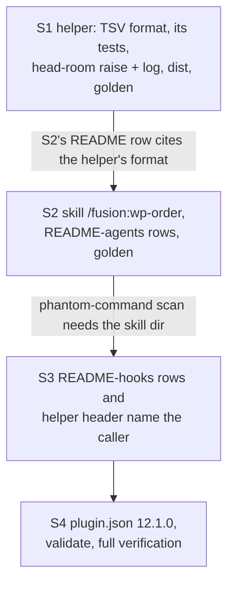

# Implementation Plan: `/fusion:wp-order` and a TSV format for `bin/fusion-work-order`

**Date:** 2026-10-01
**Status:** Ready for Review
**Spec:** `261001-1934_*_spec-work-order-slash-command-and-machine-readable-output.md` (final, user decisions D1 to D4 answered 261001)
**Decidability:** Can the TSV's ten columns be produced from what `computeWorkGraph()` already returns, without a second parse of any record? Nine of ten, yes. `field` (present or absent) is not: `WorkItemNode.dependsOn` is `[]` for an absent field and for an empty one alike, and only the aggregate `noDependsOnField` survives. The mechanism change is one additive boolean on `WorkItemNode`, set from the `raw === null` test the module already makes. Node set, order, depth, blocking count and readiness stay as they are, so the spec's third stop condition does not fire.

## Directive

Build what the spec defines: C1, a wrapper skill `/fusion:wp-order` over `bin/fusion-work-order`; C2, a `--format tsv` stream with `#format=1` and ten columns, with the default text output byte-identical and `--format text` as an explicit alias; C3, the shipped text naming the new caller, the new format and the test head-room raise, plus `plugin.json` 12.0.1 -> 12.1.0. JSON, xlsx and the axibra-5 consumer switch are out of scope.

## Current State

- `bin/fusion-work-order` is a bash wrapper. It exits 3 when `hooks/dist/order.js` is missing and otherwise runs `node` on it. `hooks/order.ts` rejects any argument (exit 1), finds the workbench (exit 2), calls `computeWorkGraph()` from `hooks/lib/work-graph.ts` and assembles everything into one `out[]` array that it writes once at the end. Because of that single write, stdout already stays empty on every non-zero exit.
- `WorkGraphReport` gives per row `dir, base, status, dependsOn, order, depth, blocks, readiness`. It also carries `cycles[]` (in printed order), `unresolvedEdges[]` (de-duplicated per `(from, entry)`, sorted by `from` then `entry`) and `unreadable[]` (sorted). So the per-row `cycle` number and `unresolved` cell can be derived in `order.ts`. `field` cannot (see Decidability).
- `hooks/lib/work-graph.ts` contains a non-text byte. Plain `grep` reports it as binary, so read it with `grep -a`.
- `hooks/lib/__tests__/fusion-work-order.test.ts` has 57 dense lines and is the only test that runs the helper.
- **Gates this work touches, measured at `cfbc12dc`:**
  - `surface-growth-bound.test.ts`: the skills surface has 24 950 bytes of head-room left. The hook-test surface has **0 lines** left (22 258 of 22 258). `matches the checked-in golden` compares per-file sizes, so any change on a bounded surface stays red until `fixtures/surface-growth.golden` is regenerated.
  - `derivable-enumerations-lint.test.ts`: the skill table in `README-agents.md` must have exactly one row per skill directory. The roster sentence (anchored on "asserts the match in the other direction too") must name every skill.
  - `reference-resolution-lint.test.ts`: `BASELINE = { paths, anchors, stampBare }` (line 488) pins how many references resolve across `skills/`, `README*.md`, `bin/` headers, `rules/`, `agents/`, `docs/` and `templates/`. A new backticked path or anchor moves it, and you re-approve it on that same line, with the attribution put in front of `Previous:`.
  - The phantom-command scan in the same file fails if a `/fusion:<name>` token appears before `skills/<name>/SKILL.md` exists.
  - `committed-dist.test.ts`: the committed `hooks/dist/` must be the compilation of the committed source.
  - `path-literal-lint.test.ts`: a skill body outside `EXEMPT_SKILLS` must not spell a store path literally.

## Approach

**One computation, two renderings.** The TSV serialiser lives in `hooks/order.ts` beside the text renderer and reads the same `report`. It computes nothing new. No new `hooks/lib/` module is added, because a new one would also owe a row in the `hooks/lib` table that `derivable-enumerations-lint` pins. The only change to the library is the boolean the Decidability line names.

**The skill renders the text format.** That format is what a person would read anyway, and it already carries the `cycle=`, `unresolved=` and `unreadable=` rows C1 has to name. Rendering from it keeps the skill independent of the TSV contract, so the two parts never depend on each other at runtime.

**Every step lands green, and the golden moves with the step that moves a surface.** The dispatch put the golden regeneration last. Under the golden test's per-file comparison, that order would leave steps 1 and 2 red, so it conflicts with "each step lands green and can be committed on its own". The green-per-commit requirement wins: steps 1 and 2 each regenerate the golden for their own surface change, and step 4 confirms that it is current. Decision `260815-2322_*_can-a-commit-stand-green-on-its-own-when-the-golden-is-a-per-file-inventory-of-a-multi-file-turn.md` named this conflict. Its answer (the Turn is the green unit) was retired along with the Turn, so nothing binding contradicts this ordering. The same reasoning puts the test head-room raise in step 1, where the lines are added, and the `README-agents.md` rows in step 2, where the skill directory appears.

## Implementation Steps

1. **The TSV format, its tests, the raise that pays for them** [DONE]
   - Executor: `code-implementer`
   - Files: `hooks/lib/work-graph.ts`, `hooks/order.ts`, `bin/fusion-work-order`, `hooks/dist/order.js`, `hooks/dist/order.d.ts`, `hooks/dist/lib/work-graph.js`, `hooks/dist/lib/work-graph.d.ts`, `hooks/lib/__tests__/fusion-work-order.test.ts`, `hooks/lib/__tests__/surface-growth-bound.test.ts` (the `TEST_LINE_HEAD_ROOM` constant and its doc comment only), `hooks/lib/__tests__/reference-resolution-lint.test.ts` (line 488, only if the pin moves), `hooks/lib/__tests__/fixtures/surface-growth.golden`, `README-hooks.md` (`### Growth bounds on the shipped text` only)
   - Changes:
     - **Before editing anything**, build a scratch workbench under the scratchpad. It holds one cycle, one absent field, one unresolved entry (one naming nothing, one naming a `done` item), one `paused` item and one item with an unreadable `**Status:**`. Save `bin/fusion-work-order` stdout from it to `before.txt`. This is the byte-identity reference.
     - `work-graph.ts`: add `dependsOnField: boolean` to `WorkItemNode` with a doc line, and set it to `raw !== null` where the node is pushed. Change nothing else.
     - `order.ts`: the argument grammar is none, or exactly the two tokens `--format text` or `--format tsv`. A missing value, an unknown name, `--format=tsv`, a repeated `--format` or any other token exits 1, prints usage on stderr and prints nothing on stdout. Leave the text path's code untouched. Add `renderTsv(report)`, following spec C2 clause by clause: the comment lines in the fixed order (`#format=1`, `#anchor=`, the eight counts, `#verdict=`, `#note=` exactly when the text path prints `note=`, with the same text taken from `caveat()` minus its `note=` prefix, then `#unreadable=` lines); the ten-column header, printed even with zero rows; one row per `report.rows` entry. `cycle` is the 1-based index into `report.cycles`. `unresolved` is that row's entries from `report.unresolvedEdges`, which are already ascending and de-duplicated. `depends-on` is `dependsOn.join(",")`. `field` is `present` or `absent`. One `esc()` applies to every cell and comment value: `\` first, then tab, CR, LF. Output is LF-terminated with no blank line. Extend the header with a `## The TSV format` section: layout, every key, every column with its absent and empty renderings, list encoding, escaping, orderings, exit codes and the compatibility rule. Make it complete enough that a consumer can be written from the header alone. Change "no hook runs it, no test gates on it, no pipeline step invokes it" so it is true of the tree: no hook or pipeline step runs it, and no test gates on its verdict.
     - `bin/fusion-work-order`: update the `Usage:` block and the output description to cover both formats, and point to `hooks/order.ts` `## The TSV format` for the contract instead of copying it (the header stays authoritative by naming its one source). Replace "no test, hook or pipeline step runs this program" with "no hook or pipeline step runs this program and no test gates on its verdict". Name no slash command yet, because the phantom-command scan would fail.
     - Tests in `fusion-work-order.test.ts`, written in the file's own dense style:
       - (a) `--format text` stdout equals the no-argument stdout.
       - (b) One fixture with a cycle, an absent field, an unresolved entry containing a backslash, and a `paused` record, written by an extra `writeFileSync` because `scratch()` writes only `open`. Assert its whole `--format tsv` stream as one literal.
       - (c) `--format`, `--format json` and `--format=tsv` each exit 1 with empty stdout.
       - (d) `verdict=empty` prints the comment block plus the header and no row.
     - Run `npm test`, which syncs `hooks/dist/`, and stage the four dist files.
     - **The raise.** Measure `R` = the line count of `hooks/lib/__tests__/**.ts` after the tests are final, minus 22 258. Edit the constant to `3_030 + R`. The doc-comment edit must be line-neutral: rewrap the existing comment so it ends "… and a tenth of +R on 2026-10-01, logged in `README-hooks.md`". If the pin moves, re-approve `reference-resolution-lint`'s line 488 on that same line. **If `R` would exceed 40, stop before writing the 41st line** (spec `## Stops when`, first clause).
     - `README-hooks.md`: in the surface table, change the hook-test head-room to the new figure. Update the line saying how many times the hook tests were raised (six; add 2026-10-01). Change "Nine raises" to "Ten raises" with the enumeration extended. In the reduction table, change `TEST_LINE_HEAD_ROOM` "Raise still standing" from +530 to +(530+R), keeping the restore target. Add the sixth raise to the paragraph that walks through the hook-test raises. Add a new entry headed `**The sixth TEST_LINE_HEAD_ROOM raise, 2026-10-01: 3 030 -> <new>, +R lines.**`, in the existing entries' shape: who granted it (Kai Stalmann, 261001, D4 of the spec), for which lines (the cases in `fusion-work-order.test.ts`, by count), that the figure equals the lines added, that no baseline and no other head-room moved, that no cut was searched for because the user named the raise as the remedy and capped it, and what is left (0 lines).
     - Regenerate the golden.
   - Dependencies: none
   - Acceptance:
     - `diff before.txt <(bin/fusion-work-order)` and the same diff with `--format text`, both run in the scratch workbench, are empty.
     - The TSV stream from the scratch workbench satisfies every C2 clause: checked with `cat -vet` for LF-only line ends and tabs, and `awk -F'\t' 'NR>1 && !/^#/ {print NF}'` prints 10 on every line.
     - `R ≤ 40`. The hook-test surface ends at exactly zero margin. `npm test` is green, with no `TEST_LINE_BASELINE`, `SKILL_BASELINE` or `AGENT_BASELINE` entry changed.
   - Verification: `cd /Users/k1/Projects/productive/fusion/hooks && UPDATE_SURFACE_GOLDEN=1 npx vitest run lib/__tests__/surface-growth-bound.test.ts; npm test`. The first command fails by design on its flag case. Then `git diff --stat -- hooks/lib/__tests__` shows only the four test files named above.

2. **The skill `/fusion:wp-order` and its two `README-agents.md` rows** [DONE]
   - Executor: `code-implementer`
   - Files: `skills/wp-order/SKILL.md` (new), `README-agents.md` (skill table and the roster bullet only), `hooks/lib/__tests__/fixtures/surface-growth.golden`, `hooks/lib/__tests__/reference-resolution-lint.test.ts` (line 488, if moved)
   - Changes:
     - Frontmatter: a `description` with no unquoted `: `, so `claude plugin validate` parses it, and `allowed-tools: [Bash]`.
     - The body follows `skills/news/SKILL.md`'s shape and states that the mechanism lives in `bin/fusion-work-order`'s header and `hooks/order.ts`.
     - Step 0: `"$FUSION_PLUGIN_ROOT/bin/fusion-workbench-root"`. On non-zero, use the standard halt that names `/fusion:setup`.
     - Step 1: the `[ -x "$FUSION_PLUGIN_ROOT/bin/fusion-work-order" ]` guard. On a miss, the message names `fusion --update` followed by a restart.
     - Step 2: run the helper with no argument and capture both stdout and the exit code. Report 1, 2 and 3 distinctly: 1 as a fusion defect, never as the person's fault; 2 as no workbench; 3 as a broken install with `fusion --update` as the remedy.
     - Step 3: render in the chat language. First the summary figures. Then one line per item in the helper's order, with position, depth, blocks, readiness and name. Then each `cycle=`, `unresolved=` and `unreadable=` row with what it means. Repeat any `note=` content as a sentence of its own. Report `verdict=empty` as "no live work packages".
     - Guardrails: never reorder, filter, group or omit; never recommend a next item or call the order binding; write nothing, commit nothing, ask nothing, dispatch nothing.
     - Name the store in words only (path-literal lint).
     - `README-agents.md`: add one table row `` `/fusion:wp-order` | `skills/wp-order/SKILL.md` | … `` saying it wraps `bin/fusion-work-order` and reports its order without ranking. Add `/fusion:wp-order` to the situational commands in the roster bullet.
     - Regenerate the golden.
   - Dependencies: step 1, an ordering dependency only: the commit series stays bisectable on one helper contract.
   - Acceptance:
     - `wc -c skills/wp-order/SKILL.md` ≤ 6 000. If the body cannot fit without moving mechanics in from the helper header, stop and report the size (spec `## Stops when`, second clause).
     - `grep -c 'FUSION_PLUGIN_ROOT/bin/fusion-work-order' skills/wp-order/SKILL.md` ≥ 1, with no bare `bin/fusion-work-order` invocation.
     - The skills surface stays inside 39 260 with `SKILL_HEAD_ROOM` unmoved, and `npm test` is green.
   - Verification: `cd /Users/k1/Projects/productive/fusion/hooks && UPDATE_SURFACE_GOLDEN=1 npx vitest run lib/__tests__/surface-growth-bound.test.ts; npm test`

3. **`README-hooks.md` and the helper header name the new caller and the format**
   - Executor: `code-implementer`
   - Files: `README-hooks.md` (the `order.ts` row and the `bin/fusion-work-order` roster row), `bin/fusion-work-order` (the "Why this exists" paragraph), `hooks/lib/__tests__/reference-resolution-lint.test.ts` (line 488, if moved)
   - Changes:
     - `order.ts` row: "Run through `bin/fusion-work-order`, by a person — directly or through `/fusion:wp-order` — and by nothing else: no hook calls it and no pipeline step invokes it, and no test gates on its verdict". Also name `--format tsv` and its home, `hooks/order.ts` `## The TSV format`.
     - Roster row: mention the TSV format and that `/fusion:wp-order` wraps the helper.
     - Helper header: one clause that `/fusion:wp-order` runs it for a person, keeping option 3 of `260909-1808_*_may-a-helper-compute-an-order-over-work-items-after-the-portfolio-layer-goes.md` intact.
     - No bounded surface changes, so the golden stays as it is.
   - Dependencies: step 2, because the phantom-command scan needs `skills/wp-order/SKILL.md`.
   - Acceptance:
     - `grep -n 'no test checks it' README-hooks.md` no longer matches the `order.ts` row (other rows are not this work's).
     - `grep -c 'wp-order' README-hooks.md` ≥ 2.
     - `npm test` is green.
   - Verification: `cd /Users/k1/Projects/productive/fusion/hooks && npm test`

4. **Version bump and whole-tree verification**
   - Executor: `code-implementer`
   - Files: `.claude-plugin/plugin.json`
   - Changes: change `version` from `12.0.1` to `12.1.0`. Nothing else.
   - Dependencies: step 3
   - Acceptance:
     - `claude plugin validate .` reports passed.
     - `npm test` is green.
     - A flagged regeneration of the golden produces no diff, so the golden is current: `git diff --exit-code -- hooks/lib/__tests__/fixtures/surface-growth.golden` exits 0 after the flagged run.
     - `git status` shows no unstaged change under `hooks/dist/`.
   - Verification: `cd /Users/k1/Projects/productive/fusion && claude plugin validate . && cd hooks && UPDATE_SURFACE_GOLDEN=1 npx vitest run lib/__tests__/surface-growth-bound.test.ts; git diff --exit-code -- lib/__tests__/fixtures/surface-growth.golden && npm test`

## Where this work stops

- Steps 1 to 4 are committed, each one green under `npm test` on its own.
- The hook-test raise `R` is at most 40, equals the lines added, and is logged in `README-hooks.md`. Otherwise the work stopped before the 41st line and the shortfall went to the user.
- `skills/wp-order/SKILL.md` is at most 6 000 bytes. Otherwise the work stopped and reported the measured size.
- `computeWorkGraph()`'s node set, order, depth, blocking count and readiness are unchanged. Otherwise the work stopped as a convention change.
- `/fusion:wp-order` has been run once on this repository and its rendering matches the helper's text output item for item. This run is the first to take place in a later session, after `fusion --update` and a restart, or through `claude --plugin-dir .`, because a skill added in a session is not in that session's roster.
- The work package's end state, a released fusion version, is reached only through `README-agents.md` `## Releasing` steps 2 to 6: marketplace bump, both repositories pushed, tag `v12.1.0`. That is the orchestrator's act at the user's word, and no executor step here performs it.

## Data Structures

- `WorkItemNode.dependsOnField: boolean`: true when the record head carries a `**Depends-on:**` line, even an empty one.
- The TSV stream: spec C2, verbatim. Header: `order	depth	blocks	readiness	item	status	field	depends-on	unresolved	cycle`.

## API Changes

- `bin/fusion-work-order [--format text|tsv]`. Exit codes are unchanged (0, 1, 2, 3).
- New slash command `/fusion:wp-order`, which takes no arguments.

## Testing Strategy

- **Byte identity of the text format:** the `before.txt` diff in step 1, which is a verification command, plus test (a) in the suite. The suite does not pin the full text literal, because that would cost lines the 40-line grant cannot spare and the existing cases already pin its key figures.
- **TSV contract:** one whole-stream literal over a fixture that exercises cycle numbering, the absent-field rendering, the unresolved cell, `paused` and escaping, plus the empty and usage-error cases.
- **Gates:** the growth golden, the enumeration lint, the reference pin and the committed-dist gate are each confirmed per step by `npm test`.

## Risks & Mitigations

| Risk | Mitigation |
|------|------------|
| The TSV tests need more than 40 lines | Dense style, one stream literal, packed fixture. Stop at the 41st line per the spec |
| A comment edit on the constant or the pin adds lines and silently eats into the grant | Both edits are line-neutral by instruction. `git diff --numstat` on those two files must show equal added and removed counts |
| The text path changes by accident while `order.ts` is refactored | The text renderer's code stays untouched. The `before.txt` diff runs on a frozen scratch store, not the live one |
| The skill body names `/fusion:wp-order` in a file the phantom scan reads before the skill exists | Step order: bin header and `README-hooks.md` name the command only in step 3 |
| The live installed copy lacks `--format` and the skill until `fusion --update` | Expected one-release-behind shape. The skill's `[ -x ]` guard covers the helper-missing case |

## Open Questions

- [ ] The dispatch put the golden regeneration in a final step. This plan folds it into steps 1 and 2 so that each commit stands green, which the same dispatch also required. If the user would rather have one golden diff to read at the end and accept red intermediate commits, steps 1 and 2 drop their regeneration and step 4 takes it.
- [ ] `--format=tsv` (the one-token form) is rejected as a usage error, following the spec's literal `--format tsv`. Accepting it as well is a one-line change if the consumer side wants it.
