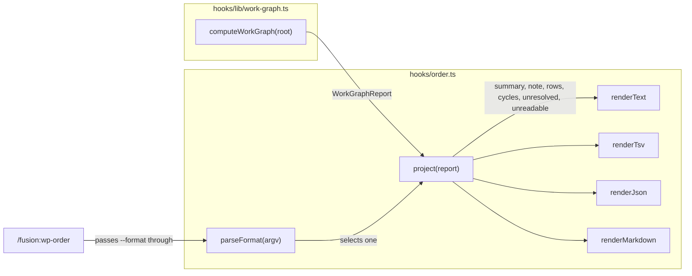
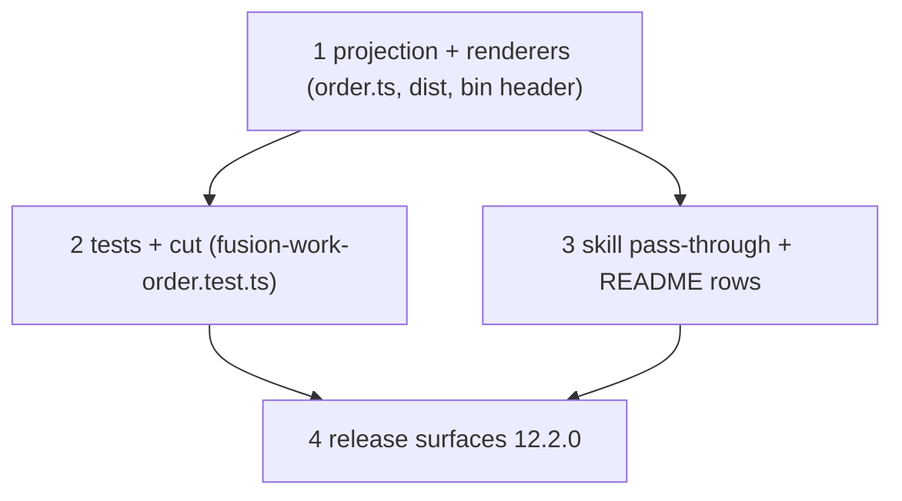

# Implementation Plan: `--format markdown` and `--format json` for `bin/fusion-work-order`

**Date:** 2026-10-02
**Status:** Ready for Review
**Spec:** none for this increment. Planned from the user's request of 2026-10-02 ("füge zwei weitere ausgabe-format formate zu wp-order hinzu: markdown und json"). That request supersedes D1 ("TSV only, no JSON") of `261001-1934_*_spec-work-order-slash-command-and-machine-readable-output.md`. Every other ruling of that spec still holds: D2 (text output byte-identical), the single format selector as the helper's only argument, and the order as a computation rather than a ranking (`260909-1808_*_may-a-helper-compute-an-order-over-work-items-after-the-portfolio-layer-goes.md`, option 3).
**Decidability:** Can both new formats be rendered from the `WorkGraphReport` that `computeWorkGraph()` already returns, with no second parse of any record and no new field? Yes. The TSV renderer already derives all ten columns from it (the `field` boolean was added for TSV in 12.1.0), along with the summary figures, the caveat, the per-row cycle number and the per-row unresolved list. JSON and Markdown need nothing TSV does not already read. The one question no test can decide, whether a renderer is faithful to the computation, is answered structurally: all four formats read one projection (Approach).

## Directive

`bin/fusion-work-order` gains `--format markdown` and `--format json`. Each renders the same computation the text and TSV formats render: the same node set, order, depth, blocks, readiness, status, field, depends-on, unresolved and cycle values, the same summary figures, and the `note=` caveat under the same condition. No new runtime dependency is added, since the hooks run under bare node and `JSON.stringify` is enough. `/fusion:wp-order` learns to take `--format <name>` and pass it through. The release surfaces follow, up to the version bump.

## Current State

- `hooks/order.ts` (343 lines) holds the header contract (`## The TSV format`, `## Exit codes …`), `renderItemRow` (text), `caveat()`, `esc()` (TSV escaping), `renderTsv()`, `parseFormat()` (accepts exactly `[]` or `["--format", "text"|"tsv"]`), and `main()`, which renders text inline. The summary figures are computed twice, once in `renderTsv` (`comments`) and once in `main` (`out`): `ready=` and `roots=` are each derived by the same filter in two places.
- `bin/fusion-work-order` is a bash wrapper. Its header carries the usage block, the text-format example and the exit codes, and exit 1 is spelled "any argument but `--format text` or `--format tsv`".
- `hooks/dist/order.js` and `order.d.ts` are committed, and `committed-dist.test.ts` holds them to the source.
- `hooks/lib/__tests__/fusion-work-order.test.ts` (80 lines) pins the rich TSV literal: two cycles (one a self-edge), an absent field, unresolved entries with `\` and a tab, a paused record and an unreadable record. Its usage-error case uses `["--format", "json"]` as the example of an unknown format, so **that case goes red the moment `json` is accepted**.
- `skills/wp-order/SKILL.md` (4 425 bytes) calls the helper with no argument. Its exit-1 branch treats a usage error as a fusion defect.
- Mentions of the formats: `README-hooks.md:229` (the `order.ts` row) and `:336` (the `bin/` roster row); `README-agents.md:260` (the skill row); `skills/help/SKILL.md` `### 4. Update` (the 12.1.0 paragraph).
- **Gates, measured at `f74ec59b` (verified with `npx vitest run lib/__tests__/surface-growth-bound.test.ts`, green, and the golden):**
  - Hook-test surface: **22 281 of 22 281 lines, zero margin** (floor 19 228 + `TEST_LINE_HEAD_ROOM` 3 053). The next added test line turns the suite red.
  - Skills surface: 207 313 bytes against a budget of 228 028 (floor 188 768 + 39 260), so 20 715 bytes left.
  - `reference-resolution-lint.test.ts` `BASELINE` moves whenever a scanned surface (`bin/` headers, READMEs, skills, `docs/`) gains or loses a backticked path or anchor. It is re-approved on its own line, with the attribution in front.
  - `surface-growth.golden` records per-file sizes. Any edit to a skill body or a test file needs it regenerated (`UPDATE_SURFACE_GOLDEN=1`).
  - The D4 raise of 2026-10-01 granted at most 40 lines "for this work's tests and nothing else", and 23 were used. Whether it reaches these tests is not settled (Open Questions).

## Approach

**One projection, four renderers.** A small pure function, `project(report)`, builds once what every format prints:

- `summary`: the ordered list of `[key, value]` pairs `anchor, items, edges, unresolved-edges, cycles, ready, roots, no-depends-on-field, unreadable-head, verdict`;
- `note`: the caveat text without its `note=` prefix, or `null`;
- `rows`: per item, the ten TSV fields as typed values;
- `cycles` (members per cycle, in printed order), `unresolved` (`{item, entry}` in printed order) and `unreadable` (names ascending).

The text, TSV, JSON and Markdown renderers each read that projection. This removes the existing double derivation of the summary, and it makes "the same computation" a property of the code rather than of four parallel sets of filters. The text renderer keeps its exact bytes: D2 is held by the existing `--format text`-equals-no-argument case, and by a before/after diff in Step 1.



**Format names, exactly:** `text`, `tsv`, `markdown`, `json`. There are no aliases (`md` and `--format=json` are usage errors), because an alias is a second spelling every consumer and test would have to know.

### The JSON format (contract to be written into `hooks/order.ts` `## The JSON format`)

One JSON object followed by one LF, serialized with `JSON.stringify(value, null, 2)`. It is UTF-8 with no BOM. Key order is fixed by construction, so two runs over an unchanged store print identical bytes.

```json
{
  "format": 1,
  "anchor": "workbench-root",
  "summary": {
    "items": 6, "edges": 4, "unresolved-edges": 2, "cycles": 2,
    "ready": 1, "roots": 5, "no-depends-on-field": 2, "unreadable-head": 1,
    "verdict": "cyclic"
  },
  "note": "2 items carry no `**Depends-on:**` field, … nothing here can tell by how much.",
  "items": [
    { "order": 1, "depth": 0, "blocks": 1, "readiness": "blocked",
      "item": "260101-0001-a", "status": "open", "field": "present",
      "depends-on": ["260101-0002-b.md"], "unresolved": [], "cycle": 1 }
  ],
  "cycles": [["260101-0001-a", "260101-0002-b"], ["260101-0006-f"]],
  "unresolved": [{ "item": "260101-0004-d", "entry": "w\tz.md" }],
  "unreadable": ["260101-0007-g"]
}
```

(The example is pretty-printed for reading here. The real output is `JSON.stringify` with indent 2, one key per line.)

- **Names and vocabularies are the TSV's.** Item keys are the ten TSV header names, `depends-on` included, and the summary keys are the TSV comment keys. `field` stays `"present"`/`"absent"`, `readiness` stays `ready|blocked|paused`, and `cycle` is `0` for none and otherwise the 1-based index into `cycles`. JSON changes only the **types**: integers are numbers, `depends-on` and `unresolved` are arrays of strings (file order and ascending respectively, as in TSV), and nothing is escaped beyond what JSON itself requires. A consumer switching from TSV to JSON therefore learns no new word.
- `note` is **always present**: a string when the text format prints `note=`, otherwise `null`. This differs from TSV's present-or-absent `#note=` line on purpose. A JSON consumer tests one key's value, not its existence.
- `cycles`, `unresolved` and `unreadable` are always present and may be `[]`. With `verdict: "empty"`, `items` is `[]` and every count is `0`.
- **Compatibility:** `format` is an integer, 1 for this definition, and it is versioned **independently** of TSV's `#format=`. Adding a key anywhere leaves it unchanged, and a consumer ignores keys it does not know. Removing or renaming a key, or changing a value's type, meaning or vocabulary, raises it by one.

### The Markdown format (contract to be written into `hooks/order.ts` `## The Markdown format`)

GitHub-flavoured Markdown for a person or a document, not for a parser. It is UTF-8, every line ends in one LF, and blocks are separated by exactly one blank line. The blocks come in this order:

1. `<!-- fusion-work-order markdown format=1 -->`: the version marker, invisible when rendered.
2. **The summary as a bullet list**, in the projection's order: `- anchor: workbench-root`, `- items: 6`, … `- verdict: cyclic`.
3. **The note as its own paragraph**, `**Note:** <caveat>`, present exactly when the text format prints `note=`. The caveat text is fusion's own and is already written as Markdown (its backticks are meant as code spans), so it is emitted unescaped.
4. **One pipe table**: a header with the ten TSV column names, a delimiter row that right-aligns the four integer columns (`---:` for order, depth, blocks, cycle), then one row per item in the computed order. `depends-on` and `unresolved` are joined with `, ` (comma, space). With `verdict=empty` the header and delimiter row are still printed with no body row, mirroring TSV.
5. Present only when non-empty, each as a bold label paragraph followed by a list:
   - `**Cycles**`, then `- 1: <member>, <member>`, numbered like the `cycle` column;
   - `**Unresolved**`, then `- <item> wants <entry>`;
   - `**Unreadable**`, then `- <item>`.

**Escaping, in every table cell and every list value** (the note excepted, per item 3):
- backslash-escape each of `\` `|` `` ` `` `*` `_` `~` `[` `]` `<` `>` `&`. CommonMark allows a backslash escape before any ASCII punctuation, so each renders as the literal character, and `\|` is the GFM-defined way to keep a pipe inside a cell;
- tab, CR and LF become the numeric character references `&#9;`, `&#13;` and `&#10;`, so no value can break a row or a list item. This is lossless in the source, and it is why `&` itself is escaped.

Item names and the fixed vocabularies never need either rule. The rule exists for hand-written `**Depends-on:**` entries, as TSV's does.

**Compatibility:** the marker's `format=` is raised on the same terms as JSON's. No consumer is expected to parse Markdown, and the marker says which shape a pasted copy came from.

### The skill: pass through, never re-render a machine format

`/fusion:wp-order [--format text|tsv|markdown|json]`. The body passes the user's arguments to the helper **unchanged**, with each word as its own argument. The helper stays the only validator of what an argument means, so the skill gets no second parser.

- No argument or `--format text`: Step 3 renders it as today.
- `tsv` or `json`: the helper's stdout goes back **verbatim** in a single fenced block (` ```tsv ` / ` ```json `), untranslated and unannotated. The bytes are the contract, so a summary in words would be a fifth format with no definition. One sentence before the block says what it is. A `note` inside it is not repeated: it is already in the stream, under the key the contract names.
- `markdown`: the helper's stdout is given verbatim as the reply. It already renders in chat and carries the note as its own paragraph.
- **Exit 1 when the user passed an argument** is the user's argument: quote the helper's stderr usage line and stop. Exit 1 with **no** argument stays a fusion defect, as now. Exits 2 and 3 are unchanged in every format.

This is the user's own invocation (`/fusion:wp-order --format tsv`) made true, and the guardrails (never reorder, rank or recommend; write no file) cover all four formats unchanged.

## Implementation Steps

1. **One projection and the two new renderers in `hooks/order.ts`** [DONE]
   - Executor: `code-implementer`
   - Files: `hooks/order.ts`, `hooks/dist/order.js`, `hooks/dist/order.d.ts` (rebuilt with `cd hooks && npm run build`), `bin/fusion-work-order` (header only).
   - Changes: add `project(report)`. Route the text and TSV renderers through it with no byte change. Add `renderJson` and `renderMarkdown` per the two contracts above. `parseFormat` accepts `text|tsv|markdown|json` with exactly the existing argument shape, and `USAGE` reads `usage: fusion-work-order [--format text|tsv|markdown|json]`. Write `## The JSON format` and `## The Markdown format` into the header after `## The TSV format`, and widen the Usage paragraph and the exit-1 line. In `bin/fusion-work-order` update the Usage block and the exit-1 sentence, and point at the two new header sections rather than restating them. Before editing, capture the text and TSV output over this repository's workbench and over a scratch copy of the test's rich fixture. After the build, both must diff empty.
   - Acceptance: both before/after diffs are empty. In `npm test` the **only expected red** is `fusion-work-order.test.ts`, case "exits 1 with empty stdout on --format alone, an unknown format, …", because its `["--format", "json"]` now exits 0. Step 2 replaces it. Any other red, `committed-dist.test.ts` included, is a stop. If the bin header edit moves `reference-resolution-lint.test.ts` `BASELINE`, re-approve it on that line in this step with its attribution.
   - Dependencies: none.
   - Done 2026-10-02: text and TSV captured before and after over this repository's workbench, the rich fixture (widened by `p|q\`r.md`) and an empty store; all six diffs empty. Only red after the build was the expected usage-error case. `reference-resolution-lint` `BASELINE` did not move.

2. **Pin both formats, paid for by a cut of at least the same number of lines** [DONE]
   - Executor: `code-implementer`
   - Files: `hooks/lib/__tests__/fusion-work-order.test.ts`, the file(s) the cut comes from, `hooks/lib/__tests__/fixtures/surface-growth.golden` (regenerated).
   - Changes: replace the unknown-format example `json` with `yaml`, and add `["--format", "md"]` and `["--format=json"]` to the same loop. Hoist the rich fixture and its TSV `rows` literal out of the TSV case so the new cases reuse them. Widen that one fixture so a single depends-on entry carries a `|` and a `` ` `` (rewrapping the TSV literal; TSV escapes neither). Then add:
     - **JSON:** over the rich fixture, map every `items[]` object back to a TSV row (arrays joined with `,`, numbers stringified, TSV-escaped) and assert equality with the hoisted rows. Assert `format`, `anchor`, the summary against `COUNTS`, `note` against the text format's `note=` value, `cycles` (two, the second a self-edge), `unresolved` and `unreadable` as literals.
     - **Markdown:** over the rich fixture, assert the marker line, that the note paragraph is present, the escaped table row of the `-d` item as one literal (pipe, backtick, backslash and tab escaped), the `**Cycles**` list numbered `1:`/`2:`, and the `**Unresolved**` and `**Unreadable**` lists.
     - **Empty:** extend the existing `verdict=empty` case so JSON deep-equals the empty object (`note: null`, every array `[]`) and Markdown is the marker, the summary list and a header-only table.
   - **Line budget:** at most **20 added lines**, and the hook-test surface must end at or below 22 281 lines. Find the cut first, in this file before any other: fold the `--wat` assertion into the usage loop, and condense the six-line header comment, which restates two rulings the helper header already cites. Anything beyond those comes from elsewhere in the suite, under the 2026-09 `fusion-paths.test.ts` precedent: a pin removed only when it is subsumed, proven by a mutation that still fails the suite with the pin gone. No baseline moves and no head-room constant changes, unless the user rules otherwise (Open Questions, first item).
   - Acceptance: `npm test` is fully green, `surface-growth-bound.test.ts` included, after regenerating the golden. Each of these mutations of `hooks/order.ts` turns `fusion-work-order.test.ts` red, applied one at a time: (a) JSON `cycle` numbered `1` for every cycle; (b) JSON `note` emitted as `""` instead of `null` on the empty store; (c) the Markdown `|` escape dropped; (d) the Markdown tab reference dropped; (e) the Markdown note paragraph dropped; (f) the `**Unreadable**` list dropped; (g) the Markdown header-only table omitted on `verdict=empty`. Record which mutations were run in the step's inline note.
   - Dependencies: 1.
   - Done 2026-10-02: the cut branch, no raise. `fusion-work-order.test.ts` stays at 80 lines (80 before, 80 after), no other file cut, no baseline or head-room constant moved, the golden unchanged. Paid for by the six-line header comment condensed to two, `--wat` folded into the usage loop with the exit-2 assertion, and the store-level cases merged where they already built the same fixture: cyclic exit 0, the `note=` count and roots/ready into one case over ACYCLIC and CYCLIC; empty-store exit 0 into the `verdict=empty` case; text-equals-no-argument onto the rich fixture. No assertion was dropped. Mutations run, each red on its own: (a) and (b) in the shared projection and again inside `renderJson` alone, (c) through (g) as listed.

3. **`/fusion:wp-order` takes `--format` and the READMEs name the two formats**
   - Executor: `code-implementer`
   - Files: `skills/wp-order/SKILL.md`, `README-hooks.md` (rows at 229 and 336), `README-agents.md` (row at 260), `hooks/lib/__tests__/fixtures/surface-growth.golden`, `hooks/lib/__tests__/reference-resolution-lint.test.ts` (the `BASELINE` line, if it moves).
   - Changes: in the skill, add `argument-hint: "[--format text|tsv|markdown|json]"` and change Step 2 to pass the user's arguments through. Apply the exit-1 split and the per-format rendering from Approach. Keep Step 3 for text alone. The mechanism stays in the helper header, and the body only names `hooks/order.ts` `## The JSON format` / `## The Markdown format` where it says the bytes are the contract. Growth target: under 1 500 bytes added to the skill. In the two `README-hooks.md` rows and the `README-agents.md` row, say `--format tsv`, `json` or `markdown` and point at the header sections. Leave the `README-hooks.md` raise log alone unless the user's answer to the first Open Question is a raise. In that case the log entry is written here, beside the 2026-10-01 entry, in that entry's form.
   - Acceptance: `npm test` green after golden regeneration and, if needed, pin re-approval. The skills surface stays inside its budget. `derivable-enumerations-lint.test.ts` and `path-literal-lint.test.ts` stay green.
   - Dependencies: 1. Step 2 is only needed for the full-green claim.

4. **Release surfaces for 12.2.0**
   - Executor: `code-implementer`
   - Files: `.claude-plugin/plugin.json` (`12.1.0` -> `12.2.0`, a minor bump: two options added, nothing removed), `skills/help/SKILL.md` `### 4. Update` (a "Coming from a 12.1.0 install" paragraph that relabels the ones below and drops the oldest, so it still carries three), the `FUSION_REF=tags/v12.2.0` examples in `install.sh` (header) and `README.md:26`, the golden, and the reference pin if it moves.
   - Changes: as listed. `docs/upgrading-to-v12.md` is unchanged, because this release renames nothing it describes. The `description` pair in `plugin.json` and `marketplace.json` is read side by side and left alone unless it names the formats. The marketplace edit itself is the release act (`## Where this work stops`).
   - Acceptance: `npm test` green and `claude plugin validate .` passes.
   - Dependencies: 1, 2, 3.



## Where this work stops

- `bin/fusion-work-order` accepts `--format text`, `tsv`, `markdown` and `json`, and rejects every other argument at exit 1 with empty stdout. Yes or no.
- The text and TSV outputs over this repository's workbench are byte-identical before Step 1 and after it. Yes or no.
- `npm test` is green at the head of Step 4, and the hook-test surface ends at or below 22 281 lines with no baseline moved and no head-room constant changed, unless the user ruled a raise in answer to the first Open Question. Yes or no.
- If Step 2 finds no sound cut equal to its added lines, the work stops at Step 2 and goes back to the user. It does not proceed to a raise. (Annotate inline if the condition did not arise.) Did not arise: a sound cut of equal size was found (Step 2 note).
- **Precondition of the tag, which is not this plan's act:** the `README-agents.md` `## Releasing` list is satisfied before `v12.2.0` is tagged. That means `claude plugin validate .` and the orchestrator smoke test, `bin/fusion-review-coverage --since v12.1.0` stated in the release commit, the marketplace `marketplace.json` bump, both repositories pushed, and the tag pushed. This plan ends at Step 4's commit.

## Data Structures

`project(report)` returns an internal type (not exported; `order.ts` is an entry point):

```ts
type OrderView = {
  summary: [string, number | string][];          // fixed key order, verdict last
  note: string | null;
  rows: { order: number; depth: number; blocks: number; readiness: string;
          item: string; status: string; field: "present" | "absent";
          "depends-on": string[]; unresolved: string[]; cycle: number }[];
  cycles: string[][];
  unresolved: { item: string; entry: string }[];
  unreadable: string[];
};
```

`WorkGraphReport` and `hooks/lib/work-graph.ts` are not touched.

## API Changes

- CLI: `fusion-work-order [--format text|tsv|markdown|json]`. The exit codes are unchanged and mean the same in every format, and stdout is empty on every non-zero exit.
- Skill: `/fusion:wp-order [--format text|tsv|markdown|json]`.

## Testing Strategy

Step 2 carries it all. JSON is pinned **against the TSV literal**, not beside it, so one rich fixture proves that the two machine formats are the same computation. Markdown is pinned on the edge cases its escaping exists for, plus the empty store. The mutation list in Step 2 is the acceptance, and it follows the lesson of the closed issue `261001-2157_*_the-tsv-tests-leave-cycle-numbering-unreadable-lines-and-tab-escaping-unpinned.md`: a fixture with one cycle, no unreadable record and no special character pins nothing about numbering, listing or escaping. Text-format identity rests on the existing case plus Step 1's recorded diff.

## Risks & Mitigations

| Risk | Mitigation |
|---|---|
| Routing text and TSV through `project()` changes a byte of either | Before/after diffs in Step 1. The existing TSV literal and the text-equals-no-argument case are both in the suite. |
| The hook-test surface has no margin and no sound cut is found | Step 2 stops and goes back to the user. The cut is proven by mutation, never assumed. |
| Markdown escaping is under- or over-done | Backslash escapes before ASCII punctuation are always literal in CommonMark, so over-escaping is safe. The pinned row exercises pipe, backtick, backslash and tab. |
| A JSON consumer reads `note`'s absence as "no caveat" | `note` is always present, `null` when there is none, and the empty-store case pins it. |
| The skill re-renders a machine format and drifts from the contract | The body hands tsv/json stdout back verbatim in a fenced block. Only text gets rendered. |
| `markdown` reply is in English in a `de` chat | Accepted. The format's bytes are fusion's contract output, like TSV's. The text path stays translated. |

## Open Questions

- [x] **Hook-test head-room.** The surface is at zero margin. D4 (2026-10-01) granted at most 40 lines "for this work's tests and nothing else", 23 were used, and these tests belong to the same work package but to a format the spec excluded. The plan's default is a cut (Step 2). The alternative is the user's act: extend D4 to these tests, within its remaining 17 lines, logged as an eleventh raise. This question binds only this plan, so it stays a bullet here rather than a decision record.
  Answered: try a sound cut of equal size first; only if none exists, extend D4 to these tests within its remaining 17 lines (this replaces the stop-at-Step-2 clause); ruled by user, Kai Stalmann <ks@qantr.com>
- [x] **Markdown version marker.** The plan includes `<!-- fusion-work-order markdown format=1 -->`. If the user wants Markdown free of any machine artefact, drop the marker. In that case the format carries no version, and its compatibility paragraph says so.
  Answered: keep the marker `<!-- fusion-work-order markdown format=1 -->`; ruled by user, Kai Stalmann <ks@qantr.com>
