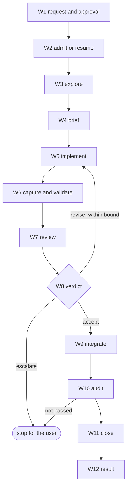

# Analysis: span map of three prompts, and the repair correspondence

**Date:** 2026-10-10 15:04
**Type:** Impact (span map) and Gap (repair correspondence)
**Status:** Complete
**Requested by:** orchestrator, step 1 of `261010-1235-plan-fusion-prior-module-bundle-explorer-then-four-role-repair.md`

## Question

Where can `agents/code-implementer.md`, `agents/reviewer.md` and `agents/state-auditor.md` be cut so that each `neutral` part holds no host token and the Claude render (neutral plus claude parts, in order) stays byte-equal to the committed prompt? And how does each step of Prior's embedded repair, and each orchestrator rule for implement, review and reconcile, land in one host-neutral repair workflow?

## Scope

- **fusion**: the three prompts and `agents/orchestrator.md`, all read with `git show 4eb4380a:agents/<id>.md`. Commit `4eb4380a8d2aa5c57c144cc833c30dc05b3ac159`, 2026-10-10 10:48:55 +0200. The working tree is at `main` `097de343` (2026-10-10 14:39 +0200), `## main...origin/main [voraus 2]`. `agents/` is unchanged between `4eb4380a` and HEAD; no claim below depends on the working tree.
- **Prior**: `internal/repair/` (`plan.go`, `run.go`, `roles.go`, `client.go`, `completed.go`, `status.go`), `modules/fusion/integration/` (`slice.go`, `completion.go`, `integration.go`, `closure.go`), plus `modules/fusion/workpackage/durable.go` (`runDurable`, which the repair calls for its four inner steps) and `modules/fusion/profiles.json`. Read with `git show 167c605:<path>`. Commit `167c6051a1a90ebe9520606413d3ab0a3ff1d127`, 2026-10-10 06:35:38 +0200, branch `main`, `## main...backup/main [voraus 1]`, working tree dirty and not read. Test files were listed, not used as step sources.
- **Token list**: decision `261010-1235-how-is-the-host-neutral-role-text-the-source-of-both-the-claude-agents-and-the-prior-profiles.md` `## Constraints`. The decision is answered (option 1).

## Findings

### 1. Tagging rule

A span is `claude` when it carries a host token, **or** when it states host mechanics: the agent-definition frontmatter, the Setup bootstrap, Claude tools (MCP, LSP, the Bash tool, `AskUserQuestion`), and every instruction about *how* records persist (store paths, helpers, transitions, one file per defect). A span is `neutral` when it states the role's task: its boundary, standards, verification norms, verdict vocabulary and report content.

The persistence clause goes beyond the token list on purpose. Prior's catalog gives `code-reviewer` and `state-auditor` `"writes_workbench": false` and `code-implementer` the same (`modules/fusion/profiles.json` at `167c605`). Plan step 16 puts Prior's persistence wording in Prior parts with the neutral parts unchanged. That works only if no neutral span tells the role to write a record. With this rule, it does not.

The token list, made concrete for the check:

| Decision wording | Regex used |
|---|---|
| `$FUSION_PLUGIN_ROOT` | `\$FUSION_PLUGIN_ROOT` |
| a `bin/` helper | `bin/fusion-[a-z-]+`, and every helper name under `bin/` at `4eb4380a` as a bare word (`\bfusion-(archive\|…\|write)\b`) |
| `$OUT_*`, `$SCAN_*` | `\$?(OUT\|SCAN)_[A-Z*]` (the bare `OUT_*`/`SCAN_*` form included) |
| `Agent(` | `Agent\(` |
| `AskUserQuestion` | `AskUserQuestion` |
| a slash command | `(^\|[[:space:]`(])/[a-z][a-z0-9-]*:[a-z]` |

### 2. Span map

Offsets are bytes into `git show 4eb4380a:agents/<id>.md`, half-open. Line ranges are 1-based. A cut inside a line is where a token sits inside a sentence; the Prior part supplies the replacement clause.

#### code-implementer (12228 bytes, 22 spans)

| # | Bytes [start, end) | Len | Lines | Tag | Reason |
|---|---|---|---|---|---|
| 1 | [0, 625) | 625 | 1-5 | claude | YAML frontmatter is the Claude Code agent-definition format; Prior reads catalog metadata |
| 2 | [625, 773) | 148 | 6-9 | neutral | role title and mission |
| 3 | [773, 1931) | 1158 | 10-15 | claude | Setup bootstraps through fusion helpers, the resolver and LSP |
| 4 | [1931, 3041) | 1110 | 16-24 | neutral | file-role ownership rule and the stop-on-coordinated-data-change rule |
| 5 | [3041, 3057) | 16 | 24-24 | claude | names the issue store by resolver key |
| 6 | [3057, 3131) | 74 | 24-24 | neutral | owner routing of the stop, and of an open question |
| 7 | [3131, 3148) | 17 | 24-24 | claude | names the decision store by resolver key |
| 8 | [3148, 3198) | 50 | 25-26 | neutral | never commit: true on both hosts |
| 9 | [3198, 3659) | 461 | 26-26 | claude | who commits, the orchestrator step citation and the commit-lock helper |
| 10 | [3659, 3828) | 169 | 27-33 | neutral | do not implement against a weak spec |
| 11 | [3828, 3849) | 21 | 33-33 | claude | plan store by resolver key |
| 12 | [3849, 4466) | 617 | 34-42 | neutral | the dispatch is the whole task; read source, implement |
| 13 | [4466, 4849) | 383 | 43-43 | claude | record notes and transitions: Claude-side workbench persistence; Prior's implementer writes no workbench |
| 14 | [4849, 8903) | 4054 | 44-85 | neutral | report to the dispatcher; the defect-diagnosis contract; coding rules; implementation process |
| 15 | [8903, 9295) | 392 | 85-85 | claude | provenance citing the Claude distribution's sibling prompt and hook lint |
| 16 | [9295, 10512) | 1217 | 86-99 | neutral | the three-field report and its done/blocked rule; resume procedure |
| 17 | [10512, 10532) | 20 | 99-99 | claude | plan store by resolver key |
| 18 | [10532, 11098) | 566 | 99-110 | neutral | resume procedure, codebase location |
| 19 | [11098, 11637) | 539 | 111-122 | claude | Claude Bash-tool CWD reset, context7 MCP tools and LSP |
| 20 | [11637, 11812) | 175 | 123-127 | neutral | run the project's tests; output-style lead-in |
| 21 | [11812, 11834) | 22 | 127-127 | claude | Claude Code question tool |
| 22 | [11834, 12228) | 394 | 127-136 | neutral | code style and housekeeping |

#### reviewer (13522 bytes, 18 spans)

| # | Bytes [start, end) | Len | Lines | Tag | Reason |
|---|---|---|---|---|---|
| 1 | [0, 366) | 366 | 1-5 | claude | YAML frontmatter is the Claude Code agent-definition format |
| 2 | [366, 2168) | 1802 | 6-20 | neutral | role mission, critical stance, the two review domains and the role-not-extension rule |
| 3 | [2168, 4420) | 2252 | 21-32 | claude | Setup bootstraps through fusion helpers and resolver keys; reads stores via bin/fusion-record |
| 4 | [4420, 4636) | 216 | 33-42 | neutral | read-only boundary |
| 5 | [4636, 5235) | 599 | 43-43 | claude | one file per defect in the issue store, the review/issue pair: Claude-side persistence |
| 6 | [5235, 7999) | 2764 | 44-69 | neutral | out-of-scope list; code review standards; normative-source rule |
| 7 | [7999, 8041) | 42 | 69-69 | claude | plan and decision stores by resolver key |
| 8 | [8041, 8062) | 21 | 69-69 | neutral | resolved issues may supersede |
| 9 | [8062, 8083) | 21 | 69-69 | claude | issue store by resolver key |
| 10 | [8083, 9420) | 1337 | 69-79 | neutral | originals vs decisions; ontology standards |
| 11 | [9420, 9541) | 121 | 79-79 | claude | rule discovery through bin/fusion-rules |
| 12 | [9541, 10163) | 622 | 79-86 | neutral | generic ontology minimum; process heading |
| 13 | [10163, 10876) | 713 | 87-89 | claude | review-file contract via rules emitted by bin/fusion-rules; evidence via bin/fusion-write |
| 14 | [10876, 11000) | 124 | 89-89 | neutral | the verdict vocabulary (accept, revise, escalate) and what each means |
| 15 | [11000, 11137) | 137 | 89-91 | claude | evidence record cardinality, helper exit codes, the review-contract lead-in |
| 16 | [11137, 12635) | 1498 | 92-105 | neutral | what analysing a topic means; what good feedback looks like |
| 17 | [12635, 13179) | 544 | 106-116 | claude | context7 MCP tools, LSP, the consent clause bound to Claude's permission system |
| 18 | [13179, 13522) | 343 | 117-123 | neutral | output style |

#### state-auditor (21781 bytes, 25 spans)

| # | Bytes [start, end) | Len | Lines | Tag | Reason |
|---|---|---|---|---|---|
| 1 | [0, 384) | 384 | 1-5 | claude | YAML frontmatter is the Claude Code agent-definition format |
| 2 | [384, 919) | 535 | 6-9 | neutral | role mission |
| 3 | [919, 2283) | 1364 | 10-16 | claude | Setup bootstraps through fusion helpers and resolver keys |
| 4 | [2283, 4751) | 2468 | 17-37 | neutral | session anchor (brief, since-commit), never invent a brief; the domain and coherence layering |
| 5 | [4751, 5186) | 435 | 38-41 | claude | parsing a control line off a Claude dispatch prompt; Prior passes structured input |
| 6 | [5186, 5685) | 499 | 42-49 | claude | writable tracking stores by resolver key |
| 7 | [5685, 6011) | 326 | 50-53 | neutral | may-not-edit boundary |
| 8 | [6011, 6530) | 519 | 54-57 | claude | no own log; file issues/decisions into stores by resolver key |
| 9 | [6530, 6580) | 50 | 58-61 | neutral | process headings |
| 10 | [6580, 7749) | 1169 | 62-62 | claude | inventory through bin/fusion-record list/reconcile and the cadence anchor |
| 11 | [7749, 9841) | 2092 | 63-90 | neutral | master list; code and data verification protocols; Step 2.5 intro |
| 12 | [9841, 10269) | 428 | 91-91 | claude | cadence bound to the Claude orchestrator's hand-run reconciliation |
| 13 | [10269, 10380) | 111 | 92-93 | neutral | the user is informed, not asked |
| 14 | [10380, 10713) | 333 | 93-93 | claude | the orchestrator's Rebalance approval and AskUserQuestion |
| 15 | [10713, 11679) | 966 | 94-99 | neutral | edge computation |
| 16 | [11679, 11772) | 93 | 99-99 | claude | decision store by resolver key and the record list helper |
| 17 | [11772, 12979) | 1207 | 99-111 | neutral | edge evaluation, not-evaluable rule, the four-value aggregate |
| 18 | [12979, 17076) | 4097 | 112-138 | claude | Step 3: every state change via bin/fusion-write and the Claude record lifecycle |
| 19 | [17076, 17563) | 487 | 139-140 | neutral | an answered-but-unbuilt issue is not closed |
| 20 | [17563, 17735) | 172 | 141-143 | claude | review annotation: Claude-side persistence |
| 21 | [17735, 18077) | 342 | 144-150 | neutral | report contents |
| 22 | [18077, 18094) | 17 | 150-150 | claude | issue store by resolver key |
| 23 | [18094, 21173) | 3079 | 151-187 | neutral | Coherence section format, recommendation mapping, rationale, rules 1-6 |
| 24 | [21173, 21252) | 79 | 187-187 | claude | issue store by resolver key and the record-filing citation |
| 25 | [21252, 21781) | 529 | 187-196 | neutral | unfiled-defect rule; output style |

**Totals.** Neutral bytes are 8574 of 12228 (70 %) for code-implementer, 8727 of 13522 (65 %) for reviewer and 12192 of 21781 (56 %) for state-auditor. The state-auditor's lower share comes from its Step 3 (span 18, 4097 bytes), which is wholly persistence mechanics.

### 3. What the neutral spans still carry

No neutral span holds a token from the list. Four classes of residue remain. They are outside the list and they matter to the Prior render.

| Residue in neutral spans | Count | Where | Consequence for the Prior render |
|---|---|---|---|
| `CLAUDE.md` as the source of project facts | 15 | code-implementer 14, 18, 20; reviewer 6 (3), 10 (3), 16; state-auditor 11 (5) | Prior has no `CLAUDE.md` at `167c605` (`git cat-file -e 167c605:CLAUDE.md` fails). The role is told to read a file the host may not supply. |
| `rules/user-facing-output.md` | 3 | last span of each prompt | The bundle has no rules corpus unless request 67 adds one. |
| `agents/orchestrator.md` section citations | 2 | code-implementer 4, 16 | Citations into the Claude distribution, unresolvable on Prior. |
| Cross-references into claude spans | 4 | code-implementer 14 ("Setup step 2"); reviewer 2 ("The Setup"); state-auditor 4 (item "6." of a list whose items 1-5 are claude span 3), state-auditor 17 ("`## Setup` forbids") | Each Prior part that replaces a Setup span must keep a `## Setup` heading and number its items so that item 6 follows. |

A literal `bin/` probe finds one hit in a neutral span: state-auditor span 11, line 74, "common locations: `scripts/`, `tools/`, `bin/`". That names a consuming project's scripts directory, not a fusion helper. The helper-form regex above does not match it, which is the reading the decision's wording ("no `bin/` helper") supports. The literal form would be a false positive in plan step 5's lint.

### 4. The embedded repair, step by step

Prior's pilot runs one bounded repair: Prepare (no model), then `Run`, which drives `SliceDriver.Run`, which calls `Orchestrator.runDurable` and then `Coordinator.CompleteReviewed`. Each role call goes through `runner.ask`, which reads the durable operation `repair-role:<role>` before acting. The steps, in order, with their sources at `167c605`:

| Id | Step | Source |
|---|---|---|
| E1 | Prepare: validate a bounded task (at most 8 criteria, 8 context files, 4 write files, 4 mandatory checks), pin the base commit, refuse symlinks and submodules, snapshot at most 18 000 context bytes, clone in isolation, write `plan.json`; no model | `internal/repair/plan.go` `Prepare` |
| E2 | Approval binding: plan hash equals the operator-approved hash, bound executables unchanged, deadline set | `plan.go` `Load`; `run.go` `Run` |
| E3 | Authority and lease: `repair-plan` operation accepted and completed, `workflow:repair` accepted, module lease for generation `epoch` | `run.go` `Run` |
| E4 | Admit or resume: create and admit the run; on `recovery-required`, inspect, require all four role operations settled, record recovery, re-admit | `run.go` `Run` |
| E5 | Slice bind: dependencies complete, author ≠ auditor, one mandatory check at least; `slice/<id>` bound to the request hash; orphan records refuse | `modules/fusion/integration/slice.go` `SliceDriver.Run` |
| E6 | Exploration: step `slice-exploration`, role `explorer`, at most 4 findings, validated | `slice.go`; `roles.go` `Explore` |
| E7 | Brief composition: the exploration merged into the brief's context | `slice.go` `SliceDriver.Run` |
| E8 | Workspace: step `workspace`, detached worktree at base; reopen only observes | `workpackage/durable.go` `runDurable` |
| E9 | Implementation: step `implementation`, role `code-implementer`, 1 to 8 exact replacements, at most 12 000 bytes, granted paths only, originals hash-checked | `durable.go`; `roles.go` `Implement`, `validateEdits` |
| E10 | Capture: step `capture`, diff and tree | `durable.go` |
| E11 | Validation: step `validation`, checks in a container, `ValidateEvidence` | `durable.go` |
| E12 | Review: step `review`, role `code-reviewer`, binding hashes echoed; `validateReview` requires an independent, accepted, current review. A rejection ends the run (`ErrNotAcceptable`); there is no loop | `durable.go`; `roles.go` `Review` |
| E13 | Tree re-verification after review | `durable.go` `VerifyChange` |
| E14 | Hand-over: work-package record seeded `reviewed`, `slice-handoff/<id>` saved | `slice.go` |
| E15 | Operator pause at `slice-reviewed` (`ErrPaused`) | `run.go` `PauseAfterReview` |
| E16 | Completion bind: `completion/<id>` bound to the request hash; orphans refuse | `integration/completion.go` `CompleteReviewed` |
| E17 | Integrate: staging worktree, apply, re-capture, re-validate, re-check review and record revision, commit, open the advance intent, advance `refs/prior/accepted/repair`, reconcile; `correction-required` on failure | `integration/integration.go` `Integrate` |
| E18 | Integration recovery: observe only, never repeat a ref update, quarantine staging | `integration.go` `Recover` |
| E19 | Runtime snapshot: host Git and filesystem observations, write-path allowlist, work roles settled | `roles.go` `Snapshot` |
| E20 | Audit: independent `state-auditor` over compacted input; Agreements, Discrepancies, Unknowns, Limitations; evidence rechecked after the answer; passes only with agreements and no discrepancy or unknown | `integration/closure.go` `Audit`; `roles.go` `Audit` |
| E21 | Close: closure intent, work-package record set `completed` with audit and integration ids | `closure.go` `Close` |
| E22 | Reconcile closure: post-image, journal and commit must agree before `reconciled` | `closure.go` `ReconcileClosure` |
| E23 | Publish: `result.patch` and `result.json` saved or compared, workflow operation and run completed | `run.go` `Run` |
| E24 | Read a predecessor: read-only proof of a finished run; its commit is a successor's base | `internal/repair/completed.go` `Completed` |
| E25 | Status: read-only state of a prepared or running repair | `internal/repair/status.go` `Status` |
| E26 | Durable role call: read `repair-role:<role>`; completed reuses after an input-hash recheck, unsettled is `recovery-required`, absent accepts, calls, bounds (input 28 000, answer 16 384 bytes), decodes strictly, completes | `roles.go` `ask` |
| E27 | Managed client transport: instruction from `profiles.json`, task file, harness in a container, seven boundary checks, no retry | `client.go` `Call` |
| E28 | Step authorization: six step names allowed, deadline, module ownership | `run.go` `Run` (`Authorize`) |

### 5. The proposed host-neutral repair workflow

Thirteen steps. W0 is the step executor of plan step 7, which every other step runs on. The revise loop W8 → W5 is the one intentional cycle, bounded by `revise_bound`.

| Id | Step | Kind |
|---|---|---|
| W0 | Step executor: on every invocation and re-invocation, read the durable operation and act only on `absent`; unsettled is `recovery-required` | executor |
| W1 | Request and approval: a bounded request, validated; its exact identity approved | input gate |
| W2 | Admit or resume: required host capabilities offered; durable run admitted, or resumed after recovery inspection; request identity bound | host |
| W3 | Explore | role `explorer` |
| W4 | Brief: implementer input from request and exploration | module |
| W5 | Implement in a host workspace, within a bound write scope | role `code-implementer` |
| W6 | Capture and validate | host service |
| W7 | Review: independent principal, domain `code`, bound to tree, criteria and input hashes; verdict accept, revise or escalate | role `reviewer` |
| W8 | Revise or escalate: `revise` returns to W5 within the bound; `escalate` or an exhausted bound stops for the user | module |
| W9 | Integrate: stage, re-validate, commit, advance; correction on failure; recovery observes | host service |
| W10 | Audit over a host snapshot | role `state-auditor` |
| W11 | Close: record closure through the codec, gated on a passed audit; reconciled | host service |
| W12 | Result: publish; read-only status; successor read | module and host |



W0 is not drawn: it wraps every node, and drawing it would add an edge to each one. The self-check holds. The graph has 14 nodes and 15 edges, it flows top-down, and it has no orphan. The one cycle is the bounded revise loop the prose names.

### 6. Correspondence

Every embedded step (E1 to E28) appears once. Orchestrator rules are numbered O1 to O31 from `agents/orchestrator.md` at `4eb4380a`. "Conflict" marks a rule whose semantics differ between the two sources and which the workflow has to settle.

| Source | Rule or step | Maps to | Note |
|---|---|---|---|
| E1 | Prepare | W1 | the request's bounds become the request schema |
| E2 | Approval binding | W1 | approval binds the exact request identity |
| E3 | Authority and lease | W2 | host-held; the module asks, it does not hold leases |
| E4 | Admit or resume | W2 | |
| E5 | Slice bind | W2 | request-hash binding, orphan refusal |
| E6 | Exploration | W3 | |
| E7 | Brief composition | W4 | |
| E8 | Workspace | W5 | host-provided workspace (G8) |
| E9 | Implementation | W5 | Conflict: the embedded prompt says "You cannot execute commands"; fusion's neutral span 14 tells the implementer to run the build to completion |
| E10 | Capture | W6 | |
| E11 | Validation | W6 | |
| E12 | Review | W7 | Conflict: rejection ends the run; the workflow adds W8 |
| E13 | Tree re-verification | W7 | a review is valid only for the tree it saw |
| E14 | Hand-over record | W7 | the review's persisted outcome, input to W9 |
| E15 | Operator pause | W0 | a pause is a restart boundary of the executor |
| E16 | Completion bind | W9 | |
| E17 | Integrate | W9 | |
| E18 | Integration recovery | W9 | |
| E19 | Runtime snapshot | W10 | host observations as auditor input |
| E20 | Audit | W10 | |
| E21 | Close | W11 | |
| E22 | Reconcile closure | W11 | |
| E23 | Publish | W12 | |
| E24 | Read a predecessor | W12 | old-run readability (G10) |
| E25 | Status | W12 | |
| E26 | Durable role call | W0 | the observe-then-act pattern itself |
| E27 | Managed client transport | unmapped | host-internal: an external module reaches roles only through `host.role.*`, never a model client |
| E28 | Step authorization | W2 | becomes the workflow's `requires` list, checked at admission |
| O1 | Routing by file role; code-plus-data tasks split (`## Agent Routing Table`) | W5 | repair.v1 fixes the implementer to `code-implementer`; a data change is outside this slice |
| O2 | Approval check against `## Human approval rules`, incl. the `autonomous` sorting (`### Step 1`, item 3) | W1 | |
| O3 | Mark the source `in_progress` (`### Step 1`, item 4) | W2 | |
| O4 | Dispatch carries work item, task, files to touch and not, acceptance criteria, source (`### Step 2`) | W4 | |
| O5 | No whole-tree git command; scratch repository entered by absolute `cd` (`### Step 2`) | W5 | host-enforced on Prior; Claude wording stays in claude spans |
| O6 | A dispatch that commits stages the event log (`### Step 2`) | unmapped | Claude event log and commit lock; no host counterpart |
| O7 | One line on a backgrounded dispatch (`### Step 2`) | unmapped | Claude session UI |
| O8 | Read the `Verification:` line; four cases (`### Step 3`) | W6 | the workflow does not trust the implementer's claim; the host runs the checks |
| O9 | Out-of-scope files reverted, issue filed (`### Step 3`; `## Error Handling`) | W5 | Prior refuses out-of-scope edits up front (`validateEdits`) |
| O10 | Mark the source complete only on a passing verification (`### Step 3`) | W11 | |
| O11 | Run validation (`### Step 4`, item 1) | W6 | |
| O12 | One self-healing attempt by the same executor (`### Step 4`, item 2; `## Error Handling`) | W8 | Conflict: fusion heals on a failed validation; Prior has no loop at all |
| O13 | Revert specific files when healing fails (`### Step 4`, 2d; revert strategy) | W8 | Prior quarantines staging and never deletes |
| O14 | Commit message file, explicit staging list, commit under the lock (`### Step 4`, items 3-6) | W9 | |
| O15 | Staging check (`### Step 4`, item 7) | unmapped | checks Claude-session record files in a working tree; W9 commits a captured tree |
| O16 | Report, then ask what is next; never decide the work is finished (`### Step 5`) | W12 | the "what next" question sits between workflow runs |
| O17 | No task queue held or persisted (`## The dispatch loop`) | unmapped | session-level rule; one workflow run is one bounded task |
| O18 | Agent produces no changes → blocked (`## Error Handling`) | W8 | escalate |
| O19 | Git conflict during commit → errored (`## Error Handling`) | W9 | `correction-required` |
| O20 | One review per work package, at closure (`## Review coverage`; `## Closing a work package`, step 2) | W7 | Conflict: Prior reviews every repair before integration |
| O21 | Coverage read, carried `**Not-opened:**`, uncovered commits named one by one (`## Review coverage`) | unmapped | multi-commit package scope; a repair's review scope is its own diff |
| O22 | Review domain code, ontology or both (`## Closing a work package`, step 2) | W7 | |
| O23 | Findings land as issues; coverage never blocks closure (`## Closing a work package`, step 2) | W8 | Conflict: an embedded rejection blocks integration |
| O24 | Finish carries the review evidence; a non-`accept` verdict leaves `succeeded` unmet (`## Closing a work package`, step 4) | W11 | |
| O25 | Reconciliation runs by hand, on the user's word only (`## Reconciliation, and the one approval it opens`) | W10 | Conflict: the embedded audit runs on every repair; the user-run reconcile stays a Claude rule beside it |
| O26 | Dispatch `state-auditor` once with a domain (same section) | W10 | |
| O27 | Parse `## Coherence`; malformed reads as `review-needed` (same section) | W10 | becomes the audit-result schema |
| O28 | Any non-coherent result opens the Rebalance approval (same section; `### Rebalance approval`) | W11 | closure gated; failure stops for the user |
| O29 | "Implemented on disk" decisions transitioned by the orchestrator (same section) | unmapped | the repair touches no decision record |
| O30 | `coherence_review` and `reconciliation` events (same section) | unmapped | Claude event log; Prior keeps its own journal |
| O31 | Stop conditions read to the user before closure (`## Closing a work package`, step 3) | unmapped | package-level, after the last repair; request 69 may place it |

## Implications

The span map is ready for step 6. Each cut is a byte offset, so the parts can be written by copying ranges, and the Claude render equals the committed file by construction. Every persistence instruction sits in a claude span, which leaves step 16 room to state Prior's read-only, host-persisted behaviour without editing a neutral part.

The neutral parts are host-token free but not yet host-meaningful on Prior. The 15 `CLAUDE.md` mentions and the 3 rules citations point at files Prior does not ship. Fixing that in the neutral text would change the Claude bytes, which the decision forbids. The fix has to come from the Prior side: the bundle or the role input must supply the project facts and the cited rule.

The two sources disagree on five points (E9, E12/O20, O12, O23, O25). Two of them shape the workflow. Prior reviews every repair and blocks on rejection, while fusion's orchestrator reviews once per package and never blocks. Prior has no revise loop, while fusion gives one healing attempt. Plan step 12 already chose a per-repair review with a bounded revise loop, which is Prior's review placement plus fusion's retry. That choice needs Prior's agreement because a loop breaks Prior's one-operation-per-role identity (`repair-role:<role>`, one per run).

## Recommendations

1. **Step 6 (code-implementer)** splits the prompts at the offsets above and adds no other cut. The cross-reference row in Finding 3 is a constraint on the Prior parts of steps 6 and 16, not a reason to re-cut.
2. **Step 5 (code-implementer)** writes the host-token lint with the regexes of Finding 1, the helper-form `bin/` included. A literal `bin/` match fails state-auditor span 11 on a false positive.
3. **Step 2 (request 67)** carries the items under "What step 2 must carry" below.
4. **Step 12 (data-implementer)** builds `repair.v1.json` from Finding 5 and cites this report's `## Findings` `### 6. Correspondence` for each step's origin.

### What step 2 must carry

- **G5, run ids per role.** Embedded role operations are keyed `repair-role:<role>`, one per run (`roles.go` `ask`). A revise loop needs one durable identity per attempt. Ask whether `host.role.*` operation ids may carry an attempt index, and who mints it.
- **G2 and G7, profile shape and output contract.** The embedded prompts in `roles.go` carry the output contract and token targets inline (explorer 500, reviewer 600, auditor 800 output tokens, implementer "under 1000 tokens"). Today's instructions are one line each (`profiles.json`). A rendered Prior profile is 8.5 to 12.2 KB of neutral text plus a Prior part. Ask whether profile text counts against the embedded 28 000-byte role-input budget or travels apart from it, as `client.go` does with `instruction`.
- **G2, unresolvable references.** Neutral text cites `CLAUDE.md` 15 times and `rules/user-facing-output.md` 3 times. Ask whether the host supplies project instructions to a role, and whether the bundle may ship the cited rule files as payload.
- **G3, role ids and old runs.** Old runs are keyed `repair-role:code-reviewer` with principals `explorer`, `implementer`, `reviewer`, `auditor` (`roles.go` `Snapshot`). The catalog's alias `code-reviewer` → `reviewer` must not re-key them. Request 67 should say so, and request 69 should test it under G10.
- **Context only, for 69.** The E9 conflict (implementer may not execute commands, yet fusion's neutral text tells it to run the build) is a G8 question. Request 67 should name it so Prior does not answer G2 in a way that forecloses it.

## Filed Issues

None. The five conflicts are questions for Prior's answers to 67 and 69, which the plan already schedules. They are not fusion defects.

## Sources

- `git show 4eb4380a:agents/code-implementer.md`, `…/reviewer.md`, `…/state-auditor.md`, `…/orchestrator.md` (`## Scope` to `## Error Handling`)
- `git ls-tree --name-only 4eb4380a bin/` (helper names for the token regex)
- Decision `261010-1235-how-is-the-host-neutral-role-text-the-source-of-both-the-claude-agents-and-the-prior-profiles.md` `## Constraints`
- Plan `261010-1235-plan-fusion-prior-module-bundle-explorer-then-four-role-repair.md` `## Approach`, `## Data Structures`, steps 1, 5, 6, 12, 16
- Prior at `167c605`: `internal/repair/{plan,run,roles,client,completed,status}.go`; `modules/fusion/integration/{slice,completion,integration,closure}.go`; `modules/fusion/workpackage/durable.go`; `modules/fusion/profiles.json`; `git ls-tree -r --long 167c605 internal/repair/ modules/fusion/integration/`
- Prior analysis `260927-2304-fusion-dual-host-design-review.md` (checked for overlap; it does not map spans or repair steps)

### Acceptance, as run

The span offsets were produced by a scratch script and checked by the independent shell pass below, which slices each neutral span out of the `git show` output by offset.

```
for p in code-implementer reviewer state-auditor; do git show 4eb4380a:agents/$p.md | wc -c; done
```
→ `12228`, `13522`, `21781`. Span-length sums from the tables: `12228`, `13522`, `21781`. Equal.

```
jq "[.\"$p\".spans as \$s | range(1; \$s|length) | select(\$s[.-1].end > \$s[.].start)] | length" spans.json   # and the same with != for gaps
```
→ overlaps `0`, gaps `0` for all three; the first span starts at 0 and the last ends at the file size.

```
tail -c +$((start+1)) <id>.at.md | head -c $len > span.txt; grep -E -n -o "$TOK" span.txt
```
over every neutral span, `$TOK` the regex of Finding 1 → `0` matches for code-implementer, `0` for reviewer, `0` for state-auditor. Positive control, the same regex over the whole files: `21`, `28` and `45` matches.

```
grep -c -E '^\| E[0-9]+ \|' <this file, section 6>; for i in $(seq 1 28); do grep -c -E "^\| E$i \|" <section 6>; done
```
→ 28 E rows, each of E1 to E28 counted exactly once; 31 O rows; 9 rows unmapped (E27, O6, O7, O15, O17, O21, O29, O30, O31). The Len columns of the three tables in this file sum to `12228`, `13522` and `21781`.

## Open Questions

- [ ] Should `CLAUDE.md`, `rules/*.md` and `agents/*.md` citations join the decision's token list? Adding them would turn the 15 + 3 + 2 residues into lint failures that only a Claude-byte change can fix, which the decision forbids. Our reading is that they stay neutral and Prior supplies the referents (request 67, G2).
- [ ] The review placement and the revise loop (O20, O23, O12 against E12) are settled in plan step 12's draft. They stand only if Prior's answer to 69 accepts per-attempt role identities.
