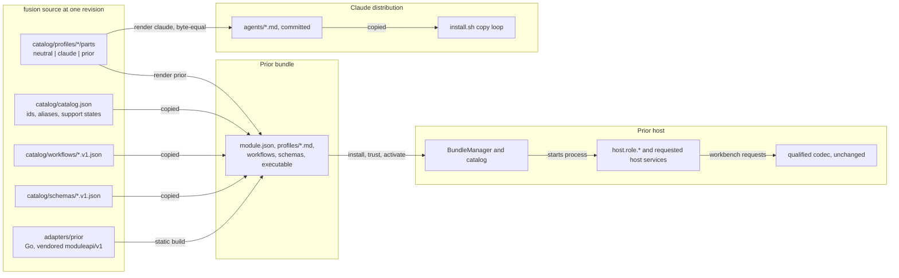
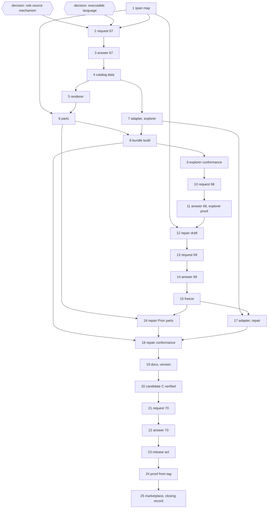

# Implementation Plan: fusion as an external Prior module bundle, the explorer first, then the four-role repair

**Date:** 2026-10-10
**Spec:** none: planned from the package narrative `261008-1215-fusion-as-an-external-prior-module-bundle.md` and the binding ruling `261009-1024-fusion-is-the-one-source-of-role-texts-and-workflow-rules-for-both-hosts.md`. Prior's brief is `Prior: docs/design/fusion-prior-workflow-delivery-request.md` at Prior `167c605`.
**Decidability:** The plan rests on four questions. (1) Do both hosts run role text from one fusion source? Decidable from fusion's own inputs: the Claude render of a converted role is compared byte for byte with the committed `agents/<id>.md`, and the Prior render's neutral parts are the same bytes (steps 5, 6, 16). (2) Is the Claude distribution unchanged? Decidable: an installed-tree diff between the `v13.0.0` install and the candidate's, the dispatch-path golden and baselines, and `git diff` over `codec/` (step 20). (3) Did Prior run the real external module, not an embedded fallback? **Not decidable from any input fusion has**: only Prior's host observes which process ran. The mechanism therefore does not approximate it with a fusion-side simulation. Fusion's fake-host tests prove protocol conformance and are labelled as such (steps 9, 18). The acceptance is Prior's written answer, whose stated bundle digest must equal the digest fusion's reproducible build records (steps 11, 22). (4) Do the roles behave "the same way" on both hosts? Model behaviour is not decidable from text. The ruling defines "the same way" as the same tasks, hand-overs and quality requirements, which this plan reduces to identical neutral role bytes, one workflow definition and one set of frozen result schemas. All three are decidable comparisons.

## Directive

The narrative's brief, not restated: deliver from one pinned fusion revision (1) an extracted, independently runnable Prior module bundle, (2) the authored role catalog with rendered Prior role assets and explicit support states, (3) the bounded explorer workflow and the four-role repair contract, and (4) the unchanged standalone Claude Code distribution. The work is reached when Prior runs a real external explorer, then a complete reviewed repair with a restart and with old runs still readable, from the delivered bundle. The codec contract of requests 59 and 60 stays closed.

The ruling binds the shape. Fusion authors the host-neutral part of each role and workflow, extracted from today's `agents/*.md`, and generates both host outputs from it. Prior keeps a technical catalog only, and the proof order is the explorer first, then implementer, reviewer and state-auditor.

## Current State

**Fusion**, measured at `main` `4eb4380a`. The tree outside `fusion-workbench/` differs from `v13.0.0` (`468d8e87`) in `codec/fixtures/prior/REQUESTS.md` alone (`git diff --stat v13.0.0 HEAD -- agents skills rules hooks bin codec templates stilwerk docs .claude-plugin install.sh`). Fusion has no Go code, no catalog and no module manifest. `agents/*.md` holds 323 031 bytes (`wc -c agents/*.md`). The reviewer's Prior names are already mapped in shipped text: `code-reviewer` and `data-reviewer` resolve to `reviewer` with `**Review domain:**` (`README-agents.md` `## The agents`). Fusion has no `explorer` agent. `install.sh` copies a fixed list of entries (`.claude-plugin agents skills rules hooks codec bin stilwerk templates docs` and the READMEs and licence), so a new top-level directory never reaches a Claude install.

**Prior, pinned at `167c605`** ("accept FJ05 shared release evidence and close request 65"). `git log --all` shows no later commit, so no newer committed handoff exists. Its working tree is dirty and this plan uses none of it. The committed contract as built:

- `moduleapi/v1`: framing (4-byte length, 1 MiB body), HMAC handshake, `Server.Workflows` with a scoped `HostCaller`, and the three durable role services `host.role.run.v1`, `host.role.read.v1`, `host.role.complete.v1` with operation id `capability:run_id`. Standard library imports only. The Go module path `github.com/kai/prior` is not fetchable; Prior's one remote is a file URL.
- `internal/module.BundleManager`: inspect, install (explicit trust), activate, bind, start. The module receives `PRIOR_MODULE_IDENTITY` and `PRIOR_MODULE_CONNECTION_SECRET` and nothing else. The bundle digest is the sha256 of a documented compact file index (`Prior: docs/design/prior-installed-module-bundles.md` `## Inventory and persistence`).
- **No CLI uses `BundleManager`** (grep over `cmd/` at `167c605`): installation and dispatch of an external module are library-only. Role instructions are resolved host-side; the embedded path reads `modules/fusion/profiles.json` (17 one-line instructions) in `internal/fusionhost/roles.go`. Prior states it invented "no provisional profile schema" for external bundles.
- The embedded module `fusion` 1.8.0, with `explorer-result.json` and `review-response.json` schemas and nine Go workflows, still serves Prior's own repair pilot.
- **`docs/design/fusion-dual-host-implementation-plan.md` and `fusion-dual-host-boundary.md` are untracked at `167c605`** (`git cat-file -e 167c605:docs/design/<file>` fails). The narrative cites FH03, FH04, FH05 and FH08 from the first. This plan reads them as context, not as contract, and request 67 asks Prior which committed text governs.

## Approach

**One source, two renders, one adapter.** A new Node package `catalog/` holds the role catalog, the role parts, the workflow definitions and the result schemas, and renders two targets. The Claude render reproduces `agents/<id>.md` byte for byte for the converted roles. The Prior render becomes the bundle's profile assets. A new Go module `adapters/prior/` holds the module executable and the bundle build. Its workflows are interpreters of fusion's workflow definitions over one observe-then-act step executor: on every invocation, and on every re-invocation after a restart, each step first reads its durable role operation and acts only on `absent`. Prior keeps execution, authority, accounting and recovery; fusion's module decides domain sequence, hand-overs and completion. Decision `261010-1235-how-is-the-host-neutral-role-text-the-source-of-both-the-claude-agents-and-the-prior-profiles.md` governs the catalog mechanism, and `261010-1235-in-which-language-is-the-prior-module-executable-built-and-how-does-it-consume-priors-module-api.md` governs the executable. Both are open and gate the steps that cite them.

The graph has no cycle and no edge between the Claude distribution and the Prior host, which is the property item 4 of the brief requires.

**Contract dependency and open questions, per slice.**

| Slice | Depends on | Left open by Prior's contract at `167c605` | Asked in |
|---|---|---|---|
| A, contract | Prior's committed docs and code | G1: which committed text governs FH03/04/05/08 | 67 |
| B, explorer | `moduleapi/v1` handshake and `host.role.*` (built); bundle install (library, built) | G2: the profile catalog file shape, and host resolution of role instructions from the installed payload. G3: module id and version beside embedded `fusion` 1.8.0. G4: a vendored `moduleapi/v1` copy as the consumption route. G5: how the module learns its run ids per role, and who supplies `audit_ref` for completion after a restart. G6: CLI or catalog routing that dispatches an installed external workflow (Prior's, not built). G7: which side appends the output-contract instruction. G11: delivery channel and development trust for an unsigned bundle | 67, 68 |
| C, repair | slice B accepted; Prior's answer to 69 | G8: host services for workspace, checks, integration and bounded workbench access under the 1 MiB frame, none offered over the module API today. G9: independent principals and enforced read-only tools for reviewer and auditor. G10: the acceptance fixture, the restart point, and what "old runs readable" covers | 69, 70 |
| D, release | slices B and C accepted | none new | 70 |

Where Prior refuses or defers one of these, the slice that needs it stops (`## Where this work stops`). No step assumes an answer.

**The Claude distribution stays unchanged by construction, and step 20 verifies it.** No step edits `agents/`, `skills/`, `rules/`, `hooks/`, `bin/`, `templates/`, `stilwerk/` or `CLAUDE.md`. Step 19 is the exception: it changes `.claude-plugin/plugin.json` (the version) and `README-agents.md`. Converted agents are regenerated byte-equal. **Growth bounds:** no bounded surface grows, no head-room is raised and no baseline moves. The new packages `catalog/` and `adapters/prior/` keep their tests in their own trees, like `codec/`, so they sit outside every bound; the Open Questions put that to the user.

## Implementation Steps

1. **Span map of three prompts, and the repair correspondence**
   - Executor: analyst
   - Files: `$OUT_ANALYSIS/<stamp>-span-map-and-repair-correspondence.md`
   - Changes: For `agents/code-implementer.md`, `agents/reviewer.md` and `agents/state-auditor.md` at `4eb4380a`, a table of contiguous byte spans, each tagged `neutral` or `claude` with a one-clause reason, cut so that no `neutral` span holds a host token (the token list of decision `261010-1235-how-is-the-host-neutral-role-text-the-source-of-both-the-claude-agents-and-the-prior-profiles.md` `## Constraints`). Then a correspondence table: each step of Prior's embedded repair (`Prior: internal/repair/`, `modules/fusion/integration/` at `167c605`) and each orchestrator rule for implement, review and reconcile (`agents/orchestrator.md`) mapped to one step of a proposed host-neutral repair workflow, or marked unmapped with the reason.
   - Dependencies: none
   - Acceptance: per prompt, the spans' lengths sum to `wc -c` of the file and no two spans overlap; `grep` of each `neutral` span's text for the token list finds nothing; every embedded repair step appears in the correspondence table once.

2. **Request 67: the bundle and explorer contract proposal**
   - Executor: code-implementer
   - Files: `codec/fixtures/prior/REQUESTS.md` (a new section `## Module bundle (request 67, the contract proposal)` appended; no line above edited)
   - Changes: Written against fusion HEAD and Prior `167c605`. Questions 67.1 to 67.8 for G1 to G7 and G11, each with fusion's proposal and the preferred answer form. The proposals: the catalog and profile file shapes of `## Data Structures`; Prior resolves a role's instructions from `profiles/<id>.md` in the installed payload; module id `fusion` with the fusion release version, embedded 1.8.0 runs kept under their own pin; a vendored copy per decision `261010-1235-in-which-language-is-the-prior-module-executable-built-and-how-does-it-consume-priors-module-api.md`; run ids and `audit_ref` passed in the workflow invocation's input, never minted by the module; the output-contract paragraph authored in the Prior profile part and the schema carried in the role input; delivery as a tarball and digest under Prior's existing explicit-trust install. Also the explorer workflow as capability `fusion.explorer.v1`, with input and result schemas adopted from Prior's `explorer-result.json` shape. It asks nothing about the codec.
   - Dependencies: step 1; decisions `261010-1235-how-is-the-host-neutral-role-text-the-source-of-both-the-claude-agents-and-the-prior-profiles.md` and `261010-1235-in-which-language-is-the-prior-module-executable-built-and-how-does-it-consume-priors-module-api.md` answered by the user
   - Acceptance: `git diff --stat HEAD -- codec` lists `codec/fixtures/prior/REQUESTS.md` alone; `cd codec && npm test` green; the section names each of G1 to G7 and G11 once.

3. **Prior's answer to 67, recorded** *(requires user approval: the user relays Prior's answer)*
   - Executor: code-implementer
   - Files: `codec/fixtures/prior/REQUESTS.md` (`### Prior's answer to 67 at <Prior commit>`)
   - Changes: Records each answer by question number and the Prior commit that holds it. Where an answer changes a proposal, the section says which later step it changes.
   - Dependencies: step 2
   - Acceptance: every question 67.x has an answer row with a Prior commit; `git diff --stat` touches that file alone.

4. **Catalog data: ids, support states, explorer workflow and schemas**
   - Executor: data-implementer
   - Files: `catalog/catalog.json`; `catalog/profiles/{explorer,code-implementer,reviewer,state-auditor}/profile.json`; `catalog/workflows/explorer.v1.json`; `catalog/schemas/{catalog,profile,workflow}.schema.json`; `catalog/schemas/{explorer-request,explorer-result}.v1.json`
   - Changes: Every Prior id at `167c605` and every Claude agent name appears once, with a support state per host (`## Data Structures`). Explorer: `prior` `supported`, `claude-code` `unsupported` (item 4 of the brief keeps the Claude roster unchanged). `code-reviewer` and `data-reviewer` are aliases of `reviewer` with domain `code` or `ontology`, as `README-agents.md` already states. Roles outside this package's slice carry `unsupported` for `prior`. The explorer workflow definition states its steps, its one hand-over and its completion condition as answer 67 rules.
   - Dependencies: step 3
   - Acceptance: `node -e` validation of each JSON file against its schema exits 0 (the command written into the step's report); `jq -r '.roles[].id' catalog/catalog.json | sort | uniq -d` prints nothing.

5. **The catalog renderer and its tests**
   - Executor: code-implementer
   - Files: `catalog/package.json`, `catalog/package-lock.json`, `catalog/tsconfig.json`, `catalog/vitest.config.mjs`, `catalog/src/render.ts`, `catalog/src/__tests__/render.test.ts`, `catalog/README.md`
   - Changes: `render claude` writes the Claude output of each role that has parts to `agents/<id>.md`. `render prior <dir>` writes `profiles/<id>.md` for every role whose `prior` state is not `unsupported`. Tests: byte equality of the Claude render with the committed file; no host token in a `neutral` part and no Claude token in a Prior render; schema validation of the catalog data; every catalog id resolves, aliases included. Dependency versions follow `hooks/package.json`'s pins.
   - Dependencies: step 4
   - Acceptance: `cd catalog && npm ci && npm test`. Expected red: the byte-equality cases in `catalog/src/__tests__/render.test.ts` for the three prompts, whose parts step 6 writes. Any other red is a stop.

6. **The three prompts as parts, and the explorer's role text**
   - Executor: code-implementer
   - Files: `catalog/profiles/{code-implementer,reviewer,state-auditor}/parts/*.md`; `catalog/profiles/explorer/parts/*.md`
   - Changes: Splits the three prompts along step 1's span map. Authors the explorer's `neutral` and `prior` parts, drawn from Prior's explorer semantics (one bounded repository question, read-only tools, bounded findings, named uncertainties) and fusion's `rules/critical-stance.md` norms. It has no `claude` part. `agents/` is regenerated and must not change.
   - Dependencies: steps 1, 5
   - Acceptance: `cd catalog && npm test` green; `git diff --quiet 4eb4380a -- agents` exits 0; `cd hooks && npm test` green with no `UPDATE_*` variable set.

7. **The adapter and the explorer workflow**
   - Executor: code-implementer
   - Files: `adapters/prior/go.mod`; `adapters/prior/internal/moduleapi/*.go` and `PROVENANCE`; `adapters/prior/scripts/check-vendored.sh`; `adapters/prior/cmd/fusion-module/main.go`; `adapters/prior/internal/steps/`; `adapters/prior/internal/explorer/`, with unit tests
   - Changes: Vendors `moduleapi/v1` per decision `261010-1235-in-which-language-is-the-prior-module-executable-built-and-how-does-it-consume-priors-module-api.md`. The executable decodes its identity, serves `fusion.explorer.v1` and validates input against the explorer request schema. It composes the role input (question, bounds, the result schema), then reads, runs if `absent`, validates, and completes. `accepted` returns `recovery-required` and never re-runs. The result separates fusion's domain verdict from host evidence (run id, principal, observation time) copied from the host's answer. Every frame is checked against a bound below 1 MiB before it is sent. The module loads its workflow and schemas from the bundle's data files, not from embedded copies.
   - Dependencies: step 4
   - Acceptance: `cd adapters/prior && go vet ./... && go test ./...` green; `grep -c '^replace' go.mod` prints 0; `PRIOR_CHECKOUT=/Users/kai/Projects/productive/F09-Prior scripts/check-vendored.sh 167c605` reports every file equal.

8. **The reproducible bundle build and its identity**
   - Executor: code-implementer
   - Files: `adapters/prior/cmd/fusion-bundle/main.go`; `adapters/prior/build.sh`
   - Changes: Refuses a dirty tree. Runs `catalog` `render prior`, builds the executable static (`CGO_ENABLED=0 -trimpath -buildvcs=false`), and assembles `module.json` (module API v1 manifest), `bin/fusion-module`, `profiles/`, `catalog.json`, `workflows/`, `schemas/` and `build-identity.json` (source commit, Go and Node versions, platform, vendored revision, per-file sha256) into an empty directory outside the repository. Computes the bundle digest by Prior's documented index algorithm and writes a deterministic tarball.
   - Dependencies: steps 6, 7
   - Acceptance: two builds into two fresh directories print the same digest; `find <dir> -type l` prints nothing; the vendored `DecodeManifest` accepts `module.json`.

9. **Explorer conformance against a fake host, from the extracted bundle**
   - Executor: code-implementer
   - Files: `adapters/prior/conformance/host_test.go`, `adapters/prior/conformance/explorer_test.go`
   - Changes: Copies the built bundle into a temp directory and starts it there with only the two Prior variables, through the vendored client with fake `host.role.*` handlers backed by a durable in-test map. Cases: handshake and advertised capability; a valid answer completed; a schema-invalid answer refused and not completed; a kill after the host persisted the answer, then a fresh process re-invoked with the same operation id, with zero further fake model calls; `accepted` yields `recovery-required`; an oversize input refused; an unknown capability refused. The file header says this is conformance, not Prior acceptance.
   - Dependencies: step 8
   - Acceptance: `cd adapters/prior && go test ./conformance/...` green.

10. **Request 68: the explorer hand-over**
    - Executor: code-implementer
    - Files: `codec/fixtures/prior/REQUESTS.md` (`## Module bundle (request 68, the explorer)`)
    - Changes: The bundle digest, `build-identity.json`, the build command, the tarball's location, and step 9's result. It asks Prior to install, trust, activate and bind the bundle, resolve the explorer's instructions from its payload, run one real explorer through the installed process with a real model, restart and re-read it, and answer with the digest it ran.
    - Dependencies: step 9
    - Acceptance: the digest written equals a fresh step-8 build's; `git diff --stat HEAD -- codec` lists `REQUESTS.md` alone.

11. **Prior's answer to 68, recorded: the explorer proof** *(requires user approval: the user relays Prior's answer)*
    - Executor: code-implementer
    - Files: `codec/fixtures/prior/REQUESTS.md`
    - Changes: Records the answer, the Prior commit, the digest Prior ran and any defect Prior names.
    - Dependencies: step 10
    - Acceptance: the recorded digest equals step 10's; a defect Prior names is filed as an issue in this container before the step closes.

12. **The repair workflow definition and its schemas, drafted**
    - Executor: data-implementer
    - Files: `catalog/workflows/repair.v1.json`; `catalog/schemas/{repair-request,repair-result,implementer-result,review-response,audit-result}.v1.json`; the three repair roles' `profile.json` (`prior` state `planned`)
    - Changes: From step 1's correspondence: explorer, implementer, reviewer (domain `code`, independent principal), a bounded revise loop, host integration, state-auditor, close. Each step names its hand-over input, its completion condition and the host services it requires. `review-response` adopts Prior's embedded shape unless step 1 names a reason not to.
    - Dependencies: steps 1, 11
    - Acceptance: schema validation as in step 4; each workflow step names a role or a host service that the catalog or the definition's `requires` list resolves.

13. **Request 69: the repair contract**
    - Executor: code-implementer
    - Files: `codec/fixtures/prior/REQUESTS.md` (`## Module bundle (request 69, the four-role repair)`)
    - Changes: Proposes the host capabilities for G8 to G10 with their bounds. Workbench reads come as pages of at most a stated size with a continuation handle; workbench writes are codec requests the host executes under its authority, each answered within the frame or by a handle. It also covers durable identities per step, restart semantics, and old-run readability: embedded pilot runs, the step-11 run, and frozen `.v1` schemas. Cites step 12's files.
    - Dependencies: step 12
    - Acceptance: as step 2, naming each of G8 to G10 once.

14. **Prior's answer to 69, recorded** *(requires user approval: the user relays Prior's answer)*
    - Executor: code-implementer
    - Files: `codec/fixtures/prior/REQUESTS.md`
    - Changes: As step 3.
    - Dependencies: step 13
    - Acceptance: every 69.x answered with a Prior commit.

15. **The repair contract frozen**
    - Executor: data-implementer
    - Files: step 12's files; `catalog/schemas/FROZEN` (one line per published schema: id and sha256)
    - Changes: Applies answer 69. Freezes every `.v1` schema and workflow definition published so far, the explorer's included.
    - Dependencies: step 14
    - Acceptance: `cd catalog && npm test` green, including a case that fails when a file named in `FROZEN` changes.

16. **Prior parts for implementer, reviewer and state-auditor**
    - Executor: code-implementer
    - Files: `catalog/profiles/{code-implementer,reviewer,state-auditor}/parts/*prior*.md`; their `profile.json` `prior` state `supported`
    - Changes: Prior's tool and persistence wording per answer 69: implementer confined to its workspace, reviewer and auditor read-only with host persistence. Neutral parts unchanged.
    - Dependencies: steps 6, 15
    - Acceptance: `cd catalog && npm test` green; `git diff --quiet 4eb4380a -- agents` exits 0.

17. **The adapter's repair workflow**
    - Executor: code-implementer
    - Files: `adapters/prior/internal/repair/`, `adapters/prior/internal/hostsvc/`, unit tests; `cmd/fusion-module/main.go` registers `fusion.repair.v1`
    - Changes: Interprets `repair.v1.json` on the step executor of step 7. Admits a run only when every required host capability was offered in the handshake and refuses before any dispatch otherwise. Bounds the revise loop as the definition states. Workbench access goes through the answered paging and handle form only.
    - Dependencies: steps 7, 15
    - Acceptance: `go vet ./... && go test ./...` green in `adapters/prior`.

18. **Repair conformance against a fake host**
    - Executor: code-implementer
    - Files: `adapters/prior/conformance/repair_test.go`; `adapters/prior/testdata/repair-fixture/`
    - Changes: A toy repository with one failing test, one package and one plan, served by fake host services. Cases: a reviewed repair to audited close; a `revise` verdict looped within its bound, then `escalate`; a kill at each persisted step boundary, then resume, with zero repeated fake model calls; a corrupted review binding refused; a missing capability refused before dispatch; step 9's explorer results still decoded by the frozen schemas.
    - Dependencies: steps 8, 16, 17
    - Acceptance: `go test ./conformance/...` green.

19. **Documentation and the version of the candidate**
    - Executor: code-implementer
    - Files: `README-agents.md` (`## Plugin structure`: the catalog, the generated prompts and their editing route; `## Releasing`: the bundle build); `.claude-plugin/plugin.json` (version, proposed 13.1.0)
    - Changes: Names the three generated prompts and the command that regenerates them. `CLAUDE.md` is not edited: it is charged to every dispatch path at zero head-room.
    - Dependencies: step 18
    - Acceptance: `cd hooks && npm test` green with no `UPDATE_*` variable set; `git diff --quiet HEAD -- CLAUDE.md agents skills rules`.

20. **The candidate C verified, the Claude distribution proven unchanged**
    - Executor: analyst
    - Files: `$OUT_ANALYSIS/<stamp>-candidate-c-verification.md`, logs beside it
    - Changes: In an isolated clone at C, runs all three suites (`hooks`, `codec`, `catalog`) and `go test ./...`, and builds the bundle twice. Installs `v13.0.0` and C with `install.sh` under `env -i` into scratch homes with nothing Prior on `PATH`, then diffs the two installed trees.
    - Dependencies: step 19
    - Acceptance: the report records each of: the installed-tree diff lists `.claude-plugin/plugin.json` and `README-agents.md` only; neither tree holds `catalog/` or `adapters/`; `git diff --quiet v13.0.0 C -- agents skills rules hooks bin templates stilwerk`; `git diff --stat v13.0.0 C -- codec` lists `codec/fixtures/prior/REQUESTS.md` alone; both bundle builds print one digest; every suite is green.

21. **Request 70: the hand-over of the bundle built at C**
    - Executor: code-implementer
    - Files: `codec/fixtures/prior/REQUESTS.md` (`## Module bundle (request 70, the reviewed repair at C)`)
    - Changes: C, the digest, step 20's report, steps 9 and 18's results. It asks Prior to run, from that bundle, a real explorer and then a complete reviewed repair with a restart. It also asks Prior to show that the embedded pilot runs and the step-11 run stay readable, and to answer with the digest it ran. It records the ruling's consequence for Prior: the embedded fusion definitions are replaced for new work, on Prior's schedule.
    - Dependencies: step 20
    - Acceptance: as step 10.

22. **Prior's answer to 70, recorded** *(requires user approval: the user relays Prior's answer)*
    - Executor: code-implementer
    - Files: `codec/fixtures/prior/REQUESTS.md`
    - Changes: As step 11.
    - Dependencies: step 21
    - Acceptance: as step 11.

23. **The release act: `main` and the tag at C** *(requires user approval: the release)*
    - Executor: code-implementer
    - Files: none in the tree; refs `main` and `v13.1.0` (or the version the user names)
    - Changes: Only on a "Yes" in step 22's record. Fast-forwards `main` to C and tags it. Nothing is rebuilt.
    - Dependencies: step 22
    - Acceptance: `git rev-parse 'v13.1.0^{commit}'` equals C; `git ls-remote origin` shows both refs at C.

24. **The proof from the tag**
    - Executor: analyst
    - Files: `$OUT_ANALYSIS/<stamp>-post-release-proof.md`
    - Changes: Rebuilds the bundle from the tag's archive and installs the Claude distribution from the tag under `env -i`.
    - Dependencies: step 23
    - Acceptance: the rebuilt digest equals step 22's; the installed tree equals step 20's C install (`diff -r` prints nothing).

25. **The marketplace entry and the closing record** *(requires user approval: the marketplace push, and the push of this record)*
    - Executor: code-implementer
    - Files: the marketplace clone's fusion entry; `codec/fixtures/prior/REQUESTS.md` (`## Module bundle (released as v13.1.0)`)
    - Changes: Version in the marketplace entry. In REQUESTS.md: the released identity, the bundle digest, step 24's result, and requests 67 to 70 as they stand.
    - Dependencies: step 24
    - Acceptance: the entry's `version` equals `plugin.json` at the tag; the section's table lists 67 to 70 each with a Prior commit.

Every edge is a dependency the steps declare, and every declared dependency is an edge. The four Prior answers (3, 11, 14, 22) are the only joins between the two repositories.

## Where this work stops

- The work is finished when step 22 records Prior's "Yes": a real external explorer, then a complete reviewed repair with a restart, both run from the bundle built at C, with the embedded pilot runs and the step-11 run still readable. The digest Prior names must equal the one step 20 recorded.
- It is also finished only if step 20's report shows the Claude install from C differing from the `v13.0.0` install in `.claude-plugin/plugin.json` and `README-agents.md` alone, with neither tree holding `catalog/` or `adapters/`.
- It is also finished only if `git diff --stat v13.0.0 C -- codec` lists `codec/fixtures/prior/REQUESTS.md` alone, so requests 59 and 60 stay closed.
- It is also finished only if no growth-bound baseline or head-room constant changed between `v13.0.0` and C (`git diff v13.0.0 C -- hooks/lib/__tests__` prints nothing).
- Decisions `261010-1235-how-is-the-host-neutral-role-text-the-source-of-both-the-claude-agents-and-the-prior-profiles.md` and `261010-1235-in-which-language-is-the-prior-module-executable-built-and-how-does-it-consume-priors-module-api.md` stand `answered` before step 2 runs.
- If Prior refuses or defers any of G2, G5, G6 (answer 67) or G8 (answer 69), the work stops at that answer. The package is paused, and its narrative names the Prior item it waits for. No embedded or synthetic substitute is built.
- The release act (step 23) requires step 22's "Yes" and the user's approval of the release, in that order. A Prior answer that names any defect is not a "Yes".

## Data Structures

`catalog/catalog.json`: `{"schema": "fusion.catalog/v1", "roles": [{"id", "claude_name" | null, "prior_ids": [..], "aliases": [{"id", "domain"}], "support": {"claude-code": S, "prior": S}}]}`, where `S` is `supported`, `planned` or `unsupported`, and `unsupported` is a state, never an absent key.

`catalog/profiles/<id>/profile.json`: `{"id", "parts": [{"file", "tag": "neutral" | "claude" | "prior"}], "input_schema", "result_schema", "tools_ceiling": [..], "may_delegate", "writes_workbench": {"claude-code": bool, "prior": bool}, "execution_policy": {"claude-code": "claude-guided", "prior": "prior-enforced"}}`. The tool ceiling names Prior's tool classes; Claude tool inheritance is untouched.

`catalog/workflows/<id>.v1.json`: `{"id", "capability", "steps": [{"id", "role" | "host_service", "input_from", "completion"}], "revise_bound", "requires": [host capability names]}`.

Explorer result envelope: `{"domain": {"status": "completed" | "refused" | "recovery-required", "result": <explorer-result.v1> | null, "violations": [..]}, "host_evidence": {"run_id", "principal_id", "observed_at", "role_state"}}`.

## API Changes

New module capabilities `fusion.explorer.v1` and `fusion.repair.v1` (module API v1 `module.invoke`). Host capabilities beyond `host.role.*` are named by Prior's answer to 69. No change to `bin/`, the hooks, the codec CLI or any Claude entry point.

## Testing Strategy

Three layers, each run by its own suite. `catalog/`: byte equality, host-token lint, schema validation, the frozen-schema guard. `adapters/prior/`: unit tests, then conformance against a fake host from the extracted bundle; labelled conformance, never acceptance. Prior: the real runs of requests 68 and 70, which only Prior can perform. The Claude side is held unchanged by `cd hooks && npm test` with no golden regenerated, in steps 6, 16 and 19, and proven by step 20's install diff.

## Risks & Mitigations

| Risk | Mitigation |
|---|---|
| A hand edit to a generated prompt bypasses the catalog | The byte-equality test fails; `README-agents.md` names the route (step 19) |
| Line-ending or encoding drift breaks byte equality on another machine | Parts are read and written as raw bytes; the test compares buffers, not strings |
| The vendored `moduleapi/v1` drifts from its pin | `check-vendored.sh` against the pinned revision; the copy accepts no independent fixes |
| Prior builds catalog routing differently from proposal 67 | Steps 4 onward follow answer 67, not the proposal; the request asks before anything is built |
| A frame above 1 MiB from a large role input | The step executor checks every frame against a bound below 1 MiB and refuses before sending |
| The conformance suite is mistaken for acceptance | File headers and the hand-over sections say which is which; the stop conditions name Prior's answer |
| Explorer or Prior-overlay text carries a stale citation nobody lints | `reference-resolution-lint` does not scan `catalog/`; the catalog test runs the host-token lint, and the citation gap is stated in `catalog/README.md` |

## Open Questions

- [ ] Decision `261010-1235-how-is-the-host-neutral-role-text-the-source-of-both-the-claude-agents-and-the-prior-profiles.md`: the catalog mechanism (recommended: span parts, Claude output generated byte-equal, three prompts converted).
- [ ] Decision `261010-1235-in-which-language-is-the-prior-module-executable-built-and-how-does-it-consume-priors-module-api.md`: Go with a vendored `moduleapi/v1` copy (recommended), contingent on Prior's answer 67.4.
- [ ] Should the new surfaces `catalog/` and `adapters/prior/` get a growth bound? Recommended: not in this package. The instrument forbids arming a bound on a corpus nobody has measured, and `codec/` has none either.
- [ ] Release number for C: 13.1.0 is proposed; the user names it at step 23.
- [ ] Where the tarball is delivered (a local path outside both repositories, or a release asset): proposed in 67.8, ruled by Prior's answer and the user.
