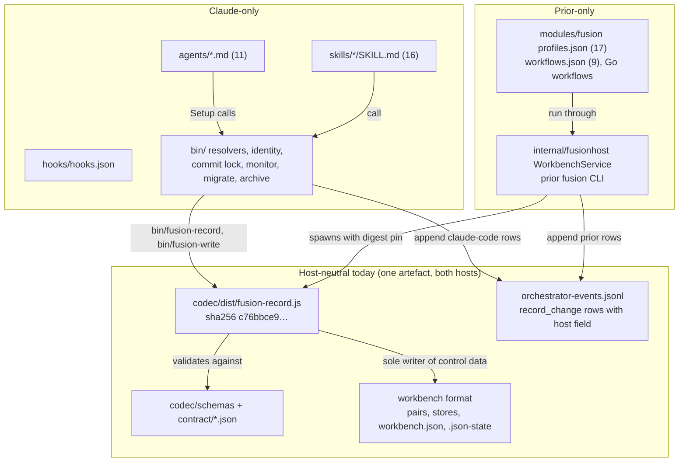

# Analysis: can fusion run the same way on Claude Code and on Prior

**Date:** 2026-10-09 06:44
**Type:** Gap (with a capability matrix and a feasibility section)
**Status:** Complete
**Requested by:** orchestrator, for work package `261009-0641-analysis-v13-completeness-prior-integration-host-parity.md`, question 3 of 3

## Answer

No. Today only the data layer runs the same way on both hosts: the codec bundle, its schemas and the JSON-controlled workbench format. The work method itself (the eleven agent prompts, the sixteen skills, the hooks, the commit lock, path resolution, identity) runs only on Claude Code. On Prior, "fusion" is still a Prior-authored embedded module: 17 one-line profile instructions and nine Go workflows. That module calls the shared codec through Prior's own workbench service and uses none of fusion's prompts, rules or helpers.

The open package `261008-1215-fusion-as-an-external-prior-module-bundle.md` is meant to close the role and workflow half of that gap. Even once it lands, full parity is not a goal either side has set. The spec and the review resolution both keep the execution policies separate on purpose: guided prose on Claude, enforced tool grants on Prior. The sensible target is parity of record meaning and workbench format, plus one authored source for role behaviour, not identical runtime mechanics.

## Question

Can fusion be run on Claude Code (a plugin in its host) in the same way as on Prior (fusion as a Prior module)? What is host-neutral and what is Claude-only? What would a Prior host still lack? What is the smallest path to parity, and where is parity not a sensible goal?

## Scope

Fusion repository, read at HEAD `0ffee3c44ecda884dbe3caf5d9e4fdf5d227b455` (2026-10-09 06:42 +0200), branch `fj-json-workbench`, `git status -sb`: `## fj-json-workbench...origin/fj-json-workbench [ahead 3]`. The working tree shows a modified `orchestrator-events.jsonl`, the modified pair of `260928-1338-json-control-data-and-markdown-artefacts`, and this untracked package. Every present-tense claim about fusion refers to that commit plus those uncommitted files, none of which touch shipped code.

Prior repository, read only, at HEAD `7da669020945f2b095abc7b4135959c383abc209` (2026-10-07 14:53 +0200), branch `main`, `git status -sb`: `## main...backup/main [ahead 27]`, working tree `M .gitattributes`, `M .gitignore`. Claims about Prior refer to that commit.

The installed window client was also read: `~/.fp` at plugin version 13.0.0, `$FUSION_PLUGIN_ROOT` for this session.

Read: the codec (`codec/README.md`, `codec/package.json`, `codec/dist/fusion-record.js` digest, `codec/schemas/package.schema.json`), `hooks/hooks.json`, `bin/*` headers and their coupling counts, `agents/*.md` coupling counts, `skills/` listing, `README-hooks.md` (codec declaration, `bin/fusion-record`, `bin/fusion-write`, `bin/monitor`, `lib/record-change.ts` rows), `README-agents.md` `## The agents`, `rules/fusion-workbench-conventions.md` (layout, `## Work packages`, filing), the dual-host review `260927-2304-fusion-dual-host-design-review.md`, the decisions on the codec's process boundary, Claude-side consumers, monitor events, archive host and maintenance fence (container `260928-1338-json-control-data-and-markdown-artefacts`), the install-home decision `261004-2212_*_where-is-the-fj03d-windows-client-installed-from-which-ref-and-what-may-13-0-0-change-after-it.md`, and the open bundle package. In Prior: `concept/fusion-json-workbench-spec.md` sections 1, 2, 7 and 10; `docs/design/fusion-prior-workflow-delivery-request.md`; `prior-fusion-workbench-service.md`; `prior-fj01-codec-integration.md`; `prior-installed-module-bundles.md`; `fusion-fj03d-prior-response.md`; `fusion-dual-host-review-resolution.md` (gap dispositions); `modules/fusion/{manifest.json,fusion.go,profiles.json,workflows.json,cmd/fusion/main.go}`; `internal/fusionhost/{roles.go,managed.go,record_events.go}`; `internal/repair/{roles.go,client.go}`; `internal/backend/claudecode/{profile.go,command.go}`; `cmd/prior/fusion.go`; Prior's own `fusion-workbench/` root.

Labels used throughout: **V** verified (file read, command run, output seen), **I** inference, **S** speculation.

## Findings

### 1. Capability matrix

Legend: **A** available, **D** available with differences, **M** missing.

| # | Capability | Claude Code | Prior | Evidence |
|---|---|---|---|---|
| 1 | Record read/write through the codec | **A**: `bin/fusion-record` (any operation), `bin/fusion-write` (mutations, ownership check, `record_change` rows with `host: "claude-code"`) | **D**: `prior fusion prepare/call/resume/status/events` spawns the same bundle. It exposes every operation except `migration` and `maintenance`, keeps its own receipts in SQLite and writes `record_change` rows with `host: prior` | V: fusion bundle sha256 `c76bbce9…e52e` at HEAD equals Prior's qualified pin (`prior-fusion-workbench-service.md`, top). `git log f9ecae78..HEAD -- codec/{dist,src,schemas,contract}` shows only `install.test.ts` changes. `hooks/lib/record-write.ts:539` `host: "claude-code"`; Prior `internal/fusionhost/record_events.go:125` `"prior"` |
| 2 | Workbench layout (stores, pairs, root-anchored files) | **A**, defined in `rules/fusion-workbench-conventions.md` `## fusion-workbench Layout` | **D**: the format is the same, and the codec writes it. Prior knows the layout as a legacy inventory (`modules/fusion/legacy/inventory.go:157-161`), not as a rule | V |
| 3 | Path resolution (`bin/fusion-paths`, `bin/fusion-claimed-package`, `bin/fusion-workbench-root`) | **A**: one key set per agent, derived from agent prompts | **M**: Prior addresses records by workbench-relative path in codec requests. Nothing in Prior calls the resolvers (grep over `internal cmd modules moduleapi` for `fusion-paths`, `fusion-rules`, `FUSION_PLUGIN_ROOT`: no hit) | V |
| 4 | Agents / roles | **A**: 11 prompts, 12–96 kB each; Setup runs `fusion-workbench-root`, `fusion-rules` and `fusion-paths` | **D**: 17 Prior profiles with 38–69-character instructions plus Go-coded prompts (e.g. the explorer prompt in `internal/repair/roles.go:80`). Ten names match fusion's; `explorer`, `code-reviewer`, `data-reviewer`, `defect-fixer`, `plan-reviewer`, `work-planner` and `work-package-manager` have no Claude counterpart. Semantics diverge: consultant `user_invoked_only` is enforced in `fusion.go` | V: `wc -c agents/*.md`; `profiles.json` instruction lengths; `bin/fusion-paths code-reviewer` exit 2, `bin/fusion-rules explorer` exit 2 |
| 5 | Skills / workflows | **A**: 16 slash-command skills, all of them calling `$FUSION_PLUGIN_ROOT` helpers | **D**: 9 Prior workflows (`explorer`, `implement-review`, `integrate-audit-close`, `discuss`, `parallel-collaboration`, `candidate-register`, `campaign`, `adaptive-packages`, `autonomous-defect`). Only `discuss` shares a name. `prior repair` runs an embedded four-role pilot | V: `ls skills`; `workflows.json`; `prior-fusion-workbench-service.md` `## What remains for normal repair dispatch` |
| 6 | Hooks and observation | **A**: SessionStart, PreToolUse, PostToolUse and SubagentStop write the trace, dispatch and commit rows (`hooks/hooks.json`) | **D**: no fusion hooks. Prior keeps its own runtime receipts and events in its SQLite store, and appends only `record_change` rows to `orchestrator-events.jsonl` | V |
| 7 | Monitor | **A**: `bin/monitor`, served from the workbench | **D**: Prior ships no fusion monitor. `bin/monitor` already shows `host: "prior"` `record_change` rows outside its checkout filter, but only when a Claude-side install serves it | V: `README-hooks.md` `bin/monitor` row and the 70-line test note |
| 8 | Commit lock | **A**: `bin/fusion-commit-lock with`, `.commit-lock/` | **M**: nothing in Prior's Go code references the fusion lock. The nomenclature table assigns its function to Prior source-control locking "after verifying the old owner", which is not built | V (grep, `concept/nomenclature.md:154`); I that a concurrent Prior commit would ignore `.commit-lock/` |
| 9 | Identity / checkout registry | **A**: `bin/fusion-identity` (`.checkout-id`, git person), `shared/checkouts/` | **D**: Prior owns project and checkout identity (Prior decision 0025). Claims are domain data, and `checkout_id` comes from the caller's request. The schema says it is "a domain assignment, never a host lease" | V: `package.schema.json:5`; I: no Prior code mints a fusion `.checkout-id` (grep `checkout_id` in `fusionhost`/`cmd/prior`: no hit) |
| 10 | Migration (v12 Markdown → JSON) | **A**: `/fusion:migrate`, `bin/fusion-migrate` (bash + `hooks/dist/migrate.js`, "Plugin and Node only") | **D**: the codec's `migration` operation is qualified by Prior, but Prior's service does not expose it ("their host orchestration remains Fusion's explicit migration/archive path"). A Prior operator would run fusion's helper | V; I that `bin/fusion-migrate` runs outside a Claude session (its header names no Claude dependency) |
| 11 | Archive | **A**: `/fusion:archive`, `bin/fusion-archive` with the `maintenance` fence | **M**: "Prior's production archive-host integration remains separate work" (`prior-fj01-codec-integration.md`) | V |
| 12 | Install / update | **A**: `install.sh`, the `fusion` launcher, `fusion --update`; window client at `~/.fp` | **D**: `prior fusion prepare` copies only the qualified bundle and pins the Node and bundle digests. The generic bundle installer exists (`BundleManager`), but no fusion module bundle to install | V |
| 13 | Setup / initialize | **A**: `/fusion:setup` → `bin/fusion-write initialize` | **D**: `initialize` through `prior fusion call`. No equivalent seeds `stilwerk/`, the monitor, `.fusion-setup` or `.asset-provenance` | V for the operation; I for the absence of seeding (not found in `cmd/prior/fusion.go`) |
| 14 | Human approval and `mode` | **A**: `mode autonomous` is the user's standing answer to named approvals (conventions `## Work packages`) | **D**: by design, "fachlicher Zustand ist keine Laufzeitberechtigung" (spec §1.7). Prior grants and approvals are host state | V |

### 2. Host-neutral versus Claude-only

The graph passes the coherence check. It has no cycle, and each host subgraph reaches the shared layer through exactly one client. No edge runs between `claude` and `prior`, and that missing edge is the finding: the two hosts share data but not method.

Host-neutral, verified:

- **The codec bundle.** It is one committed Node file, and both hosts run it with plain `node` (decision `260928-1550_*_which-process-boundary-and-shipped-form-does-the-codec-take.md`, option 1). Prior pins it by digest and requalifies it on every change. The digests match today (V).
- **Schemas, contract tables and fixtures.** These live in `codec/` and both hosts validate against them. Prior's conformance runs replay the recorded protocol sessions (237 manifest cases, 118 exchanges at the archive pin, per `prior-fj01-codec-integration.md`).
- **The workbench format.** This covers pairs, stores, the manifest, the journal and the lock. The codec's one workbench-wide lock serialises writers from both hosts. A cross-host write therefore cannot interleave at record level (V, from decision `261001-1030_*_how-does-the-host-hold-maintenance-exclusivity-over-codec-writers-while-it-moves-pairs.md`, which states Claude sessions, other checkouts and Prior's host all write through the same bundle).
- **The `record_change` event row.** Its shape is agreed for both hosts (request 32), and each host writes it with its own `host` value.

Claude-only, verified:

- **Agent prompts.** All eleven Setups call `$FUSION_PLUGIN_ROOT/bin/*`. Dispatch is `Agent(fusion:<name>)`, and the prompts assume Claude tools (`AskUserQuestion` appears in nine of them, Bash for every helper).
- **Skills.** All sixteen are Claude slash commands, and all sixteen bodies call plugin helpers.
- **Hooks.** These are Claude Code lifecycle events, and Prior has no equivalent attachment point for them.
- **The `bin/` helpers.** They are not Claude-bound by code: of 30 helpers, only `bin/fusion-rules` names a `CLAUDE_`-prefixed item (`.claude/rules`). In practice they belong to the Claude distribution because they key on agent names and `$FUSION_PLUGIN_ROOT`. I: a Prior operator could run `bin/fusion-migrate`, `bin/fusion-archive` and `bin/monitor` from a fusion install on the same machine, since their headers name only bash and Node. Nobody has exercised that path.

### 3. What a Prior host still lacks for "the same way"

| Gap | Severity | Effort | Supplied by the bundle package? |
|---|---|---|---|
| P1. No externally delivered fusion module. Prior's `modules/fusion` is embedded Go importing Prior `internal/` packages, and its module executable answers only the handshake and `explorer.validate` (`cmd/fusion/main.go`) | breaking for parity | large | Yes, item 1 (bundle, manifest, identity, no `replace`) |
| P2. Role behaviour authored twice: fusion prompts (kilobytes of method) against Prior one-liners plus Go-coded prompts | breaking for parity | large | Partly, item 2 (authored catalog, rendered Prior role assets). It does not say whether rendered assets derive from `agents/*.md` or replace them |
| P3. Workflow surface mostly disjoint: 16 skills against 9 workflows, with `discuss` the only shared name | modification | large | Partly, item 3 (explorer and four-role repair only) |
| P4. Codec access from a module: 16 MiB codec responses against the module API's 1 MiB frame | breaking for a module workflow | medium | Yes, item 3 ("bounded requests or a specified handle") |
| P5. No commit-lock interoperation | modification; I: a risk only when a Claude session and a Prior run commit in one checkout | small to medium | No. Nomenclature treatment pending |
| P6. No archive host on Prior; migration only through fusion's helper | modification | medium | No |
| P7. Prior's own workbench is not JSON-controlled: `.fusion-setup` `plugin_version` `12.0.0`, no `workbench.json` | modification; Prior has never run fusion on its own tree | trivial (run `/fusion:migrate` there) | No |
| P8. Approval semantics differ (`mode autonomous` on Claude, grants on Prior) | not a gap; by design | — | Spec §1.7, §10 |
| P9. Read-only enforcement differs (prose on Claude, tool grants on Prior) | not a gap; by design | — | Review resolution, G12 row |
| P10. Role-name mismatch: Prior identifiers `code-reviewer`, `data-reviewer` and `explorer` do not resolve on Claude, while the docs say the reviewer "answers to" the first two | cosmetic to modification | trivial | No. Filed as an issue below |

What the bundle package (`261008-1215-fusion-as-an-external-prior-module-bundle.md`) is meant to supply, read from its directive: P1, P4, a first slice of P2 and P3 (explorer, then implementer, reviewer and state-auditor for repair), and the unchanged Claude distribution from the same revision (item 4). Its acceptance bar is real: a real external explorer, then a reviewed repair with a restart and old runs still readable. "An embedded fallback or a synthetic module labelled as Fusion does not count." Its status is `open`, unclaimed, and it is planned only after the user has tested 13.0.0 on both hosts (V, `package.json` and directive). Nothing of it exists in fusion's tree: `git ls-files` shows no module manifest, no Go file, no profile or workflow catalog (V).

Prior's side of the same delivery is already built: the bundle installer, pinned role services and the workbench service (V, `prior-installed-module-bundles.md`, `prior-fusion-workbench-service.md`). The missing half is fusion's.

### 4. Smallest path to parity, and where parity is not the goal

The smallest path that is still one integral design (`rules/critical-stance.md` §2) has three steps:

1. **One authored source for role behaviour.** We recommend that the Prior role assets the bundle package delivers be rendered from the same authored text as `agents/*.md`. A second hand-maintained catalog in fusion's repository would not meet that bar. Without this step, P2 moves the duplication from Prior into fusion and leaves it in place. Two constraints bound it. The dispatch-path growth bound sits at zero head-room (`CLAUDE.md` `## Conventions`), and decision `260927-2319_*_does-the-growth-bound-on-shipped-text-yield-to-the-dual-host-prompt-set.md` rules on it; we did not re-read that decision for this question. I: the rendering has to strip the Claude-specific Setup block (helper calls, `$FUSION_PLUGIN_ROOT`) and replace it with Prior's context composition, so the prompts need a host-neutral body and a host-specific Setup section.
2. **The bundle package's explorer and four-role repair**, delivered as the directive states. This proves that the shared contract carries a real workflow and is the first point where "the same way" can be measured on a task rather than on records.
3. **Two small hand-overs outside the package:** run `/fusion:migrate` on Prior's own workbench (P7), and record which party holds the git lock when both hosts touch one checkout (P5). The first is trivial. The second is a decision, not code, until a concurrent case is actually wanted.

Parity is not a sensible goal for:

- **Hooks and slash commands.** These are Claude Code's extension points. Prior's equivalent is its supervisor, receipts and approval flow. Porting hooks would duplicate observation that Prior already records more strictly.
- **Execution authority.** `mode autonomous` answering approvals on Claude, against Prior grants, is a deliberate split (spec §1.7, §10: "Getrennte Ausführungspolitiken bleiben sichtbar").
- **Read-only enforcement.** The review resolution's G12 row says "Shared findings schemas do not imply identical tool guarantees".
- **The Claude-side install and launcher.** Prior installs pinned bundles. Matching `install.sh` would add a second installer with no user.
- **The 17-against-11 role catalog as such.** Prior's extra roles (`work-package-manager`, `defect-fixer`, campaign workflows) are Prior-side orchestration. Fusion now admits agent-originated packages within commissioned scope (conventions `## Work packages`, decision `260927-2319_*_may-an-agent-originate-a-work-package-on-its-own-initiative.md`), so the earlier origin-bound conflict (G1 in the dual-host review) no longer blocks them. Whether fusion should author them is a scope decision, not a parity defect.

The arrangement where Prior runs Claude Code as a managed backend does not load fusion. V: Prior launches the client with `--setting-sources ""`, `--disable-slash-commands`, a fixed `--settings` file and a tool allowlist (`internal/backend/claudecode/command.go:21`). I: an empty setting-sources list keeps a user-level fusion plugin, and with it fusion's hooks, out of that client. That closes the dual-host review's A4/G7 question in practice. It is proven by Prior's FH08 tests only if those tests assert it, and we did not read them.

## Implications

"Run fusion the same way on both hosts" splits into two questions with different answers. **Same data:** yes, today, verified to the byte, so a workbench written by one host is read correctly by the other. **Same method:** no. The method lives only in the Claude distribution, and Prior runs its own reduced restatement of it. The user's planned test of 13.0.0 on Prior will exercise the shared data layer through `prior fusion call`, not fusion's roles. The result should be read that way.

## Recommendations

1. **User, when the bundle package is planned:** rule on whether Prior role assets are rendered from `agents/*.md` (one source) or authored separately. That ruling decides whether parity of method is reachable at all. Route: `implementation-planner` with a decision record.
2. **implementation-planner, bundle package:** treat P4 (frame bound) and P1 (no `internal/` imports) as the first two steps, since every workflow depends on them. Keep item 4 (unchanged Claude distribution) as a release check on the same revision.
3. **Either side, now:** run `/fusion:migrate` on Prior's own workbench (P7), so the host that hosts fusion also uses JSON control for its own work.
4. **User:** decide whether concurrent Claude and Prior commits in one checkout are a supported case. If yes, file the commit-lock hand-over (P5) as its own package. If no, state that in the boundary.
5. **code-implementer or document-editor:** fix the role-alias sentences (issue below).

## Filed Issues

- `261009-0644-reviewer-said-to-answer-to-code-reviewer-and-data-reviewer-but-neither-identifier-resolves.md`: the docs say the reviewer answers to two Prior identifiers that neither resolver accepts.

## Sources

Fusion at `0ffee3c4`: `codec/README.md` (`## What this package is, and is not`, `## What ships`, `## The CLI`); `codec/package.json`; `codec/schemas/package.schema.json:5,30`; `codec/dist/fusion-record.js` (sha256); `hooks/hooks.json`; `hooks/lib/record-write.ts:539`; `bin/*` headers (coupling counts by grep); `bin/fusion-migrate:1-40,113-150`; `bin/fusion-archive:11,115-133`; `agents/*.md` (byte and token counts); `skills/` listing; `README-hooks.md` (codec declaration, the `bin/fusion-record`, `bin/fusion-write`, `bin/monitor`, `lib/record-change.ts` rows); `README-agents.md` `## The agents`; `docs/upgrading-to-v12.md` `### Agents`; `rules/fusion-workbench-conventions.md` `## fusion-workbench Layout`, `## Work packages`, `## Record filing`. Workbench: `260927-2304-fusion-dual-host-design-review.md`; `261008-1215-fusion-as-an-external-prior-module-bundle.md` and its `package.json`; decisions `260928-1550_*`, `260929-1810_*_where-do-the-claude-side-consumers-of-the-codec-live-and-how-do-they-reach-it.md`, `260930-1451_*`, `261001-1030_*` (both), `261004-2212_*_where-is-the-fj03d-windows-client-installed-from-which-ref-and-what-may-13-0-0-change-after-it.md`. Commands: `git log f9ecae78..HEAD -- codec/...`, `shasum -a 256`, `bin/fusion-paths code-reviewer` (exit 2), `bin/fusion-rules explorer` (exit 2), `bin/fusion-record` `inspect` (`json-control`), `git ls-files` for module artefacts (none).

Prior at `7da66902`: `concept/fusion-json-workbench-spec.md` §1, §2, §7, §10; `concept/nomenclature.md:154`; `docs/design/fusion-prior-workflow-delivery-request.md`; `prior-fusion-workbench-service.md`; `prior-fj01-codec-integration.md`; `prior-installed-module-bundles.md` `## Host integration`; `fusion-fj03d-prior-response.md`; `fusion-dual-host-review-resolution.md` `## Disposition of review gaps`; `modules/fusion/manifest.json`, `fusion.go:1-80`, `profiles.json`, `workflows.json`, `cmd/fusion/main.go`, `legacy/inventory.go:157-161`; `internal/fusionhost/roles.go:1-60`, `managed.go:1-50`, `record_events.go:125-157`; `internal/repair/roles.go:1-80`, `client.go:45`; `internal/backend/claudecode/profile.go`, `command.go:18-21`; `cmd/prior/fusion.go:1-60`; `fusion-workbench/.fusion-setup`; `ls fusion-workbench`.

## Open Questions

- [ ] Are Prior role assets rendered from fusion's agent prompts, or authored as a second catalog? (Recommendation 1.)
- [ ] Is a Claude session and a Prior run committing in the same checkout a supported case? (P5.)
- [ ] Does Prior's FH08 evidence assert that a managed Claude client loads no user-level fusion plugin? Not checked here.
- [ ] Not checked: whether `bin/fusion-migrate`, `bin/fusion-archive` and `bin/monitor` actually run outside a Claude session on a Prior-only machine (inferred from their headers, not executed).
