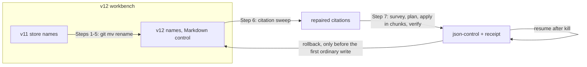

# Analysis: is fusion 13.0.0 functionally complete against v12.2.3

**Date:** 2026-10-09 06:47
**Type:** Gap (with the evidence grading of a feasibility check)
**Status:** Complete
**Requested by:** orchestrator, work package 261009-0641-analysis-v13-completeness-prior-integration-host-parity, question 1
**Cross-references:** 260928-1338-json-control-data-and-markdown-artefacts.md; 261004-1516-fj04-step12-rerun-proof-on-fresh-copies.md; 261007-2348-agent-dispatch-and-skill-block-observation-at-495aca7d.md; 261004-2212_*_plan-fj03d-rules-prompts-and-live-predicates-switched-with-this-workbench-in-one-window.md; 261007-1836-plan-the-four-open-defects-fixed-before-v13-is-tested.md; 260930-2305_*_how-is-a-claim-held-by-a-checkout-that-no-longer-exists-released-under-response-22.md; 260929-1919_*_the-dispatch-hook-reaches-the-claimed-package-helper-through-fusion-rules-so-how-does-it-stay-off-the-codec.md

## Question

How certain can we be that fusion 13.0.0 on `fj-json-workbench` loses nothing against the last v12 release, v12.2.3? The answer needs a surface diff, an evidence grade per surface, the state of the legacy migration path, and a ranked list of what remains unverified.

## Scope

- **Tree read:** `/Users/kai/Projects/productive/F04-FUSION/fusion`, branch `fj-json-workbench`, HEAD `0ffee3c4` (2026-10-09 06:42 +0200), `git status -sb`: ahead of `origin/fj-json-workbench` by 3, `fusion-workbench/orchestrator-events.jsonl` modified. HEAD moved from `147612bd` during this run; `git log 147612bd..0ffee3c4` touches only workbench records.
- **Baseline:** tag `v12.2.3` = `48f0c9ff` (2026-10-02 21:16 +0200). It is an ancestor of HEAD (`git merge-base` = `48f0c9ff`); 270 commits lie between them.
- **Suites:** run in a scratch clone of `0ffee3c4` (`…/scratchpad/q1/v13`), never in the live tree. Hooks needed `npm install`, because `hooks/package-lock.json` is untracked.
- **Not in scope:** Prior integration (question 2), host parity (question 3). Prior is named here only where a v12 function now waits on it.

## Findings

### 1. Surface inventory, v12.2.3 against HEAD

Commands: `git ls-tree --name-only v12.2.3 <dir>` against `ls <dir>`, and `git diff v12.2.3..HEAD --name-status|--stat`.

| Surface | v12.2.3 | HEAD | Removed | Added | Changed | Unchanged |
|---|---|---|---|---|---|---|
| `agents/*.md` | 11 | 11 | none | none | all but `document-editor` | `document-editor` |
| `skills/*/SKILL.md` | 16 | 16 | none | none | archive, cadence, check, discuss, help, migrate, reconcile, setup, wp, wp-order | cleanup, commit, curate, memo, news, post |
| `bin/` | 26 | 30 | none | `fusion-archive`, `fusion-migrate`, `fusion-record`, `fusion-write` | checkout-name, citation-check, citation-sweep, claimed-package, count-sources, paths, plan-size, rules, staging-drift, stores, work-order, monitor | cadence-anchor, claude-md-weight, commit-lock, edge-answers, events, forum, identity, plugin-cwd, prose-metric, review-coverage, session-domain, session-mark, source-root, workbench-root |
| `hooks/*.ts` (entry points) | 13 | 17 | none | `archive.ts`, `migrate.ts`, `scope.ts`, `write.ts` | citation-check, citation-sweep, guard, order, plan-size, review-coverage, staging-drift | edge-answers, events-query, identity-notice, session-id, session-start, subagent-stop, tracker |
| `hooks/lib/*.ts` | | | `dispatch-bytes.ts` | codec-read, legacy-import, legacy-repair, record-archive, record-change, record-client, record-index, record-write, scope | 11 files | the rest |
| `hooks/hooks.json` | | | | | | unchanged: the same four events, same commands |
| `rules/*.md` | | | the subsection `### Transition window (v12.0.0 to v13.0.0)` | | 8 files | the rest |
| `codec/` | absent | new package | | schemas, contract, bundle, 21 test files | | |

No agent, skill, `bin/` helper, hook entry point or `hooks.json` event was removed. Two pieces of shipped content were removed, plus one behaviour that v12 had and v13 refuses.

### 2. Removals and behaviour changes, each traced

| # | What | v12 | v13 | Deliberate? Record |
|---|---|---|---|---|
| R1 | Five `bytes_*` fields on `task_start` rows (`hooks/lib/dispatch-bytes.ts`) | measured per dispatch | not written; old rows kept | Yes. Decision 260929-1919_*_the-dispatch-hook-reaches-the-claimed-package-helper-through-fusion-rules-so-how-does-it-stay-off-the-codec.md; commit `16a6387e`; prompt row corrected under issue 260929-2025_*_the-orchestrator-prompt-still-says-a-task-start-row-carries-the-byte-measurements.md (closed). No shipped reader of `bytes_*` remains (`grep -rn bytes_` over agents, skills, rules, bin, hooks finds only the explanatory comment in `hooks/lib/orchestrator-events.ts`). |
| R2 | Reading v11 store names (`circles/`, `planning/`, `consult/`) beside the v12 names | transition window | refused; `/fusion:migrate` renames | Yes. v12.2.3's own `### Transition window` text: "v13.0.0 deletes this subsection and the legacy entries of both copies". |
| R3 | **Claim takeover** | "A takeover overwrites the field" (v12 conventions `## Work packages`) | no takeover; a non-holder's `release` or `transition` out of `claimed` is refused (exit 5) | Yes, but **a real loss without workaround**. Decision 260930-2305_*_how-is-a-claim-held-by-a-checkout-that-no-longer-exists-released-under-response-22.md (answered, option 2: a codec takeover) waits on Prior request 38 (`codec/fixtures/prior/REQUESTS.md` `### 38.`). Until then, a package claimed by a deleted checkout or a lost machine stays `claimed` for good. Stated in `docs/upgrading-to-v13.md` `## Documented limits`. |
| C1 | Markdown control (markers, head lines) | read and written by every consumer | refused by name until migrated; every agent halts at Setup (exit 3) | Yes. FJ03d plan, `## API Changes` and step 8; `docs/upgrading-to-v13.md` `## What a legacy workbench meets`. |
| C2 | Who moves a state after an executor resolves something | code-/data-implementer renamed `_o_`→`_c_`, `_a_`→`_i_` | the executor appends `Resolved:`/`Implemented:`; the dispatcher transitions after reading `Verification:` | Yes. Issues 260929-1810_*_the-shipped-prompts-disagree-on-who-moves-which-marker-and-one-names-a-marker-no-vocabulary-has.md and 261005-1609_*_three-statements-about-the-implemented-transition-still-disagree-after-the-dispatcher-ruling.md (both closed). Consequence: a user who dispatches an implementer directly leaves the issue `open` with a `Resolved:` line; `agents/state-auditor.md` (the "If resolved" branch) closes it at the next `/fusion:reconcile`. |
| C3 | Step progress | `[IN PROGRESS]`/`[DONE]` inline, steps renumberable | `steps` in the control file, anchored by step number; no renumbering, no added step | Yes. Decision 261001-1804_*_what-stable-step-anchor-does-an-imported-plan-carry-and-which-criteria.md. A narrower authoring freedom than v12. |
| C4 | Migration rollback after the first ordinary write | n/a | refused | Yes, by design; `docs/upgrading-to-v13.md` `Undo.` |

Every removal and behaviour change is backed by a record. R3 is the one where v12 users lose an operation they could perform and v13 offers no route at all.

### 3. Evidence of function, per surface

Grades: **verified** = a test or proof run exercises it on a JSON workbench (cited); **live** = it ran on this repository's own migrated workbench, recorded in `orchestrator-events.jsonl` since the migration on 2026-10-06 (51 `record_change` rows to 2026-10-09 04:44); **inferred** = code and text read, not exercised; **unverified** = nothing exercises it.

**Suites at HEAD, this run (scratch clone of `0ffee3c4`):**
- `cd hooks && npm test`: 67 files passed, 1 skipped; 1 146 tests passed, 12 skipped. The 12 skipped are the opt-in `agent-dispatch-observation.test.ts`.
- `cd codec && npm test`: 21 files passed; 1 687 tests passed, 13 skipped. `git status --porcelain` in the clone was empty afterwards, so the rebuilt bundle equals the committed `codec/dist/fusion-record.js` (`sha256:c76bbce9…`).
- Live workbench, read-only codec calls: `validate` 156 checked, `valid:true`, 0 findings; `reconcile` 0 intents, 0 record findings, 442 references, 0 narratives.

**Workbench operations**

| Operation | Grade | Evidence |
|---|---|---|
| `create` (package, issue, plan, discussion, decision) | verified + live | `hooks/lib/__tests__/record-write.test.ts`; `codec/src/__tests__/install.test.ts` "the shipped Setup, wp and discuss blocks run verbatim…"; live: 4 issues, 2 packages, 1 discussion, 1 decision, 1 plan |
| `transition` (all kinds, step and criterion payloads, outcome, disposition) | verified + live | `codec/src/__tests__/transitions.test.ts`, `ops.test.ts`, `round-trip-cli-fj02*.test.ts`; live: 18 plan, 12 issue, 6 decision, 1 package, 1 discussion |
| `claim` | verified + live | `round-trip-cli-fj02.test.ts` "02 to 04"; `fusion-claimed-package.test.ts`; live: 1 |
| `release` | verified | `round-trip-cli-fj02.test.ts`, `record-write.test.ts`; not live |
| `set-mode` | verified + live | `ops.test.ts`, `record-write.test.ts`; live: 1 |
| `set-dependencies`, work order, `succeeded` edges | verified | `fusion-work-order.test.ts`, `work-graph.test.ts`; observation case (e), and (f) re-run on 2026-10-08; not live (the live graph holds 1 edge) |
| `adopt-plan` | verified + live | `ops.test.ts`; live: 1 package, 1 plan |
| `attach-evidence`, reviewer evidence | verified | observation cases (b), (e); `record-write.test.ts` |
| Takeover of a stale claim | **absent** | R3 |
| Archive of JSON pairs (`/fusion:archive`, `bin/fusion-archive`) | verified | `install.test.ts` "the installed bin/fusion-archive holds a referenced issue and archives a terminal package…"; `record-archive.test.ts`; `round-trip-cli-archive.test.ts` (51 exchanges). Never run on the live workbench. |
| Migration (`/fusion:migrate`, `bin/fusion-migrate`) | verified + live | §4 below |
| Reconcile (`/fusion:reconcile`, state-auditor) | verified | `install.test.ts` tenth group, reconcile case; observation case (c), with empty stores only |
| Cadence | verified | `install.test.ts` cadence case; transition-only gap fixed at `f37b6194` |
| News, post, forum, memo | inferred, not affected | Markdown with no control data; `skills/{news,post,memo}` and `bin/fusion-forum` unchanged; `fusion-forum.test.ts` green |
| Discuss | verified + live | `install.test.ts` Setup/wp/discuss case; live discussion `261007-0707-other-kind-hits-prior-record-type.md` created and closed |
| Check | verified in part | `install.test.ts` `## gitignore` case; the full `/fusion:check` ran once on the window build (FJ03d step 15, per the plan's `## Where this work stops`). The other blocks are inferred. |
| Setup (new JSON workbench via `initialize`) | verified | `install.test.ts` "initialises an empty workbench…" and the Setup block case; `round-trip-cli-initialize.test.ts` |
| Cleanup, commit | inferred | Unchanged since v12. Commit stages pairs as the orchestrator text says; cleanup's split rule does not mention pairs (issue filed below). |
| Curate (policy-curator) | survey verified, apply unverified | observation case (d); apply mode is a documented limit |
| Help | verified | `install.test.ts` help case |
| wp-order | verified | `fusion-work-order.test.ts`; installed-copy case in `install.test.ts` |
| Monitor | verified | `monitor-warnings-panel.test.ts` `describe("bin/monitor — record_change rows")` |
| Citation check and sweep, staging drift, plan size | verified | each one's test file plus `install.test.ts` "the installed citation check, plan-size check, sweep and staging drift answer from JSON…" |
| Automatic hooks (SessionStart, Pre/PostToolUse, SubagentStop) | verified | `hook-route-exclusion.test.ts`, `hooks-wiring.test.ts`, `session-start-*.test.ts`; `hooks.json` unchanged |

**Agents on a JSON workbench**

| Agent | Grade | Evidence and gap |
|---|---|---|
| orchestrator | verified once, live | Cases (a), (e) at `495aca7d`, (f)/(g)/(h) on 2026-10-08 against the uncommitted fix that `ee3a3c19` then committed. Case (e) has **not** been re-run since `ee3a3c19` changed closing step 2's coverage read. Interactive approvals, a `revise` closure: documented limits. Live: 7 sessions since the migration. |
| reviewer | verified once | Case (b), code domain only; ontology domain is a documented limit |
| state-auditor | verified once | Case (c) with empty stores; live records and a `**Directive:**` are a documented limit |
| policy-curator | survey verified once | Case (d); apply mode is a documented limit |
| analyst | verified once, live | Case (a); 6 live dispatches, this run included |
| code-implementer | live, inferred | 12 live dispatches since the migration; no suite case |
| implementation-planner | live, inferred | 1 live dispatch, 1 plan `create`; no suite case |
| consultant | live, inferred | 4 live dispatches |
| requirements-designer, data-implementer | inferred | Their only workbench writes are `create --kind plan` and `Resolved:`/`Implemented:` lines, both exercised by other routes |
| document-editor | not affected | Prompt unchanged; writes no record |

### 4. The legacy path

| Proof | Build | What it showed |
|---|---|---|
| Three real copies (fusion, second ~744 records, third ~175 records with v11 names) | `0b1e1b58`, bundle `sha256:575aec47…`, 2026-10-04 | Analysis 261004-1516-fj04-step12-rerun-proof-on-fresh-copies.md: 0 blocking findings, one question per copy, `validate` all valid, no-op second run, kill-and-resume, full rollback to byte-identical trees, read-back through each reader, a no-`.git` copy. Its one defect (F1, the standing fence) was fixed at `7713c679` and `4b24d595`. |
| fusion's own workbench, for real | at or before `95720e4c`, 2026-10-06 | Receipt `archive/migrations/migration-20261006-v12/receipt.json`: 8 checks passed (pairs 147, references 433, validate 147, reconcile 147, …). Valid and clean at HEAD (§3). |
| Synthetic, at HEAD | `0ffee3c4` | `install.test.ts` "the installed copy renames a v11-named workbench … migrates it … resumes a kill … rolls back …, with no Prior present" and the Node-absent refusal; `migrate.test.ts`, `legacy-import.test.ts`, `legacy-repair.test.ts`. All green in this run. |

**The gap in this table:** after `0b1e1b58` the migration path changed in eight commits: `8e4ef9a0`, `7713c679`, `4b24d595`, `e437d6a8`, `833575f8`, `788f4acf`, `f9ecae78` and `e0db2545`. `f9ecae78` rebuilt the bundle so that the codec now refuses `legacy-unknown` in every nested actor position. Fusion's own live migration ran on the changed code; the second and third workbenches did not. The second one carries most of the derived-value classes (182 `legacy-unknown` actors, 19 answer-ref-self, 65 unanchored marks). So the change most likely to turn a former pass into a refused chunk has not met the largest real input. inference: the importer change `e437d6a8` was written for exactly this refusal, so a pass is likely; it is not shown.

### 5. Confidence per area

| Area | Confidence | Basis |
|---|---|---|
| No surface lost | High | Enumerated diff, §1; every removal traced, §2 |
| Codec and write operations | High | ~1 700 codec tests green at HEAD, the committed bundle reproducible, live use since 2026-10-06 with a clean `validate`/`reconcile` |
| Read-side helpers, hooks, monitor | High | Test per helper, installed-copy cases, hooks suite green |
| Skills | Medium-high | Shipped blocks of setup, wp, discuss, archive, reconcile, cadence, check (gitignore), migrate, help run verbatim in tests; cleanup and curate apply are inferred |
| Agent prompts | Medium | One headless run per case, the most recent orchestrator change not re-run, six behaviours documented as never observed, four agents only live or inferred |
| Legacy migration | Medium-high | Current code proven synthetically and on one real workbench; the two other real workbenches only on a build eight migration commits older |
| Claim takeover parity | None | R3: v12 had it, v13 has no route |

**Overall: medium-high.** Nothing was dropped silently, and the mechanism is well tested. What is missing is observation at the release build, not mechanism.

### 6. Gaps ranked by risk, each with the check that closes it

| Rank | Gap | Risk | Closing check |
|---|---|---|---|
| 1 | R3, no takeover of a stale claim | A lost machine leaves a package `claimed` for good: a live node blocking dependents, with no shipped way out. v12 could do this. | Prior's answer to request 38 and a codec revision. Failing that, a user ruling that 13.0.0 ships with the limit, plus one documented manual recovery (for example, which file a user may restore on the holder's machine) so the state is not terminal in practice. |
| 2 | The second and third real workbenches were not re-migrated on the current migration code and bundle | A refused chunk at a consuming project's first `/fusion:migrate` | Re-run 261004-1516's harness on fresh copies of both, from an install of the release candidate: survey, run, no-op, read-back, one kill and resume. This is FJ05's "repeatable migration" clause. |
| 3 | The observation suite was not re-run at HEAD (case (e) predates `ee3a3c19`; no case for requirements-designer, code-implementer or implementation-planner) | A prompt-level regression in the orchestrator closure, which is the path that writes `done` and evidence | `cd hooks && FUSION_AGENT_RUN=1 npx vitest run lib/__tests__/agent-dispatch-observation.test.ts` at the release commit, all 12 cases, transcripts copied into the workbench. About 4.4 USD per analysis 261007-2348. |
| 4 | Six documented never-observed agent behaviours (interactive approvals, `revise` closure, curator apply, reviewer ontology, auditor with live records, repetition) | Low-frequency paths fail on first real use | One interactive session per path on a scratch JSON project, recorded as an analysis; or the user accepts them as limits at FJ05 (already in `docs/upgrading-to-v13.md`). |
| 5 | A v12 installation writing after the migration is detected by nothing | Split-brain control data in multi-checkout projects | Documented limit. A future `/fusion:check` could read `reconcile`'s `narratives` section, which nothing reads today. |
| 6 | `/fusion:cleanup` names no pair rule (issue below) | A pair split across commits; reported after the fact only | The issue's acceptance |
| 7 | Release surfaces (fresh install from the tag, release tarball assets) | Packaging miss | FJ05's "fresh-installed client" and "complete assets" clauses, not claimed by FJ03d |

## Implications

The release question is now about acceptance runs rather than missing code. Gaps 2, 3 and 7 are FJ05 work already named in the package's directive, and each is one run. Gap 1 is the only one that needs a decision before release. It is a loss of a v12 operation, recorded and deliberate, but with no fallback at all. Whether 13.0.0 may ship with it is the user's call.

## Recommendations

1. **User, through the orchestrator:** rule on R3 before release, either waiting for request 38 or shipping with the limit plus a named manual recovery. If the ruling asks for one, a decision record is owed. This analysis files none, because decision 260930-2305 already holds the question.
2. **Orchestrator, at FJ05:** re-run the real-copy migration proof on the release build (gap 2) and the full observation suite at the release commit (gap 3) before tagging. Keep the transcripts in the workbench.
3. **code-implementer:** the cleanup pair rule (issue below), a one-sentence text change under the growth bound.

## Filed Issues

- `261009-0647-cleanup-splits-name-no-rule-that-keeps-a-record-pair-in-one-commit.md`: `/fusion:cleanup`'s split rule does not keep a narrative and its control file in one commit.

## Sources

- `git diff v12.2.3..HEAD --name-status|--stat` over `agents skills bin hooks rules codec install.sh`; `git ls-tree v12.2.3`; `git show v12.2.3:rules/fusion-workbench-conventions.md` (`### Transition window`, `## Work packages`).
- `git show 16a6387e` (R1); `git log 0b1e1b58..HEAD -- codec/src codec/dist hooks/migrate.ts hooks/lib/legacy-import.ts bin/fusion-migrate skills/migrate/SKILL.md`; `git log 495aca7d..HEAD -- agents skills rules`.
- `docs/upgrading-to-v13.md` (all sections); `rules/fusion-workbench-conventions.md` `## Work packages`, `## fusion-workbench Layout`; `agents/orchestrator.md` `## Work packages` (Drop row), `## Closing a work package`; `agents/code-implementer.md` step 3; `agents/state-auditor.md`; `agents/policy-curator.md`; `skills/cleanup/SKILL.md`; `hooks/hooks.json`; `bin/fusion-cadence-anchor` header; `bin/fusion-write` header; `bin/fusion-record` header.
- Records: 261004-1516-fj04-step12-rerun-proof-on-fresh-copies.md; 261007-2348-agent-dispatch-and-skill-block-observation-at-495aca7d.md; the FJ03d plan's `## Where this work stops` and its control file (17/17 steps done, closed); issues 261008-0044-dropping-a-package-leaves-its-adopted-plan-in-progress.md, 261008-0044-under-autonomous-mode-the-orchestrator-stops-before-the-closing-review-and-never-dispatches-the-reviewer.md, 261005-1018_*_six-consumers-the-prior-spec-names-have-no-test-that-runs-their-shipped-text.md, 260929-2025_*_the-orchestrator-prompt-still-says-a-task-start-row-carries-the-byte-measurements.md; decision 260930-2305_*_how-is-a-claim-held-by-a-checkout-that-no-longer-exists-released-under-response-22.md; `codec/fixtures/prior/REQUESTS.md` `### 38.`
- `archive/migrations/migration-20261006-v12/receipt.json`; live `bin/fusion-record` `inspect`, `list`, `validate`, `reconcile`; `fusion-workbench/orchestrator-events.jsonl` rows from 2026-10-06 on.
- Observation transcripts under `/private/var/folders/6v/…/T/fusion-agent-run-{V3e2gl,ktKtze}/` (mtimes only).
- Suite logs in this session's scratchpad (`q1/hooks-test.log`, `q1/codec-test.log`), not kept in the workbench.

## Open Questions

- [ ] R3: does 13.0.0 ship without a takeover, and if so, with which manual recovery?
- [ ] Gap 2: the source paths of the second and third workbenches are not recorded in the workbench (the 10-04 report keeps them out of circulation). Whoever runs FJ05 needs them from the user.
