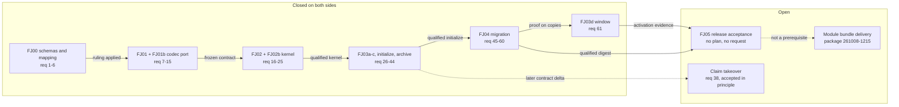

# Analysis: how far the integration between Prior and fusion has come

**Date:** 2026-10-09 06:50
**Type:** Gap
**Status:** Complete
**Requested by:** orchestrator, for work package `261009-0641-analysis-v13-completeness-prior-integration-host-parity` (question 2 of 3)

## Question

How much of the JSON-workbench specification (`Prior: concept/fusion-json-workbench-spec.md`, packages FJ00 to FJ05) and of the requests exchanged between the two repositories is implemented, proven, handed over, answered or still open, on each side? What blocks the 13.0.0 release, and what is follow-on work?

## Scope

Read: the specification (sections 1, 2, 7 to 10), fusion's request ledger `codec/fixtures/prior/REQUESTS.md` (2 756 lines, requests 1 to 61), every Prior response under `Prior: docs/design/fusion-*-prior-response.md`, `Prior: docs/design/fusion-prior-workflow-delivery-request.md`, `Prior: docs/design/prior-fusion-workbench-service.md`, the header of `Prior: docs/design/fusion-dual-host-implementation-plan.md`, Prior's pins (`tests/testdata/fusion-fj01/UPSTREAM.json`, `tests/testdata/fusion-codec/UPSTREAM.json`, `internal/fusionhost/codec_process_test.go`), and on the fusion side the work packages `260928-1338-json-control-data-and-markdown-artefacts` and `261008-1215-fusion-as-an-external-prior-module-bundle`, with their control records read through `bin/fusion-record`.

Not run: Prior's Go suite, fusion's hooks and codec suites, any installer. Every test figure below is quoted from a record and cited as such.

| Tree | HEAD | Commit date | Branch | Tracking |
|---|---|---|---|---|
| fusion | `0ffee3c4` | 2026-10-09 06:42 | `fj-json-workbench` | 3 ahead of `origin/fj-json-workbench` (`d398ced1`); `origin/main` at `48f0c9ff` (12.2.3) |
| Prior | `7da6690` | 2026-10-07 14:53 | `main` | 27 ahead of `backup/main` (`12d8424`), the only remote; uncommitted edits in `concept/implementation-plan.md`, `.gitignore`, `.gitattributes` and its own `fusion-workbench/` |

## Findings

### The shape of the exchange

The two repositories exchange work through one ledger. Fusion appends a hand-over section to `codec/fixtures/prior/REQUESTS.md` with numbered requests. Prior answers each batch in a response document under `docs/design/` and edits its specification. Requests 1 to 61 have been sent; 53 was reserved and never sent (`REQUESTS.md` `### Requests 45 to 60, as they stand`).

The dashed edges are not dependencies. Prior states that the module bundle is "not a runtime dependency or an additional prerequisite for Fusion's standalone Claude Code release" (`Prior: docs/design/fusion-fj03d-prior-response.md` lines 96-100). The takeover edge marks where request 38 would land as a codec revision of its own.

### Per FJ package

| Package | Fusion side | Prior side | Status |
|---|---|---|---|
| FJ00 | Plan `260928-1341_*_plan-fj00-…` closed 2026-09-28. `codec/contract/prior-mapping.json` equals `Prior: docs/design/fusion-fj00-prior-mapping-ruling.json` on `rows` (163), `state_mapping.rows` (7) and `conventions` (5), every row `confirmed: true`. Only `description` differs. Verified by a JSON comparison for this report. | Requests 1-6 answered at `478ce21` (`fusion-fj00-prior-response.md`); the applied ruling accepted at `f18481c`. | implemented, proven, answered |
| FJ01 / FJ01b | Plans closed 2026-09-28; bundle and `bin/fusion-record` shipped. | Requests 7-10 answered at `c512c4c`; 11-15 accepted at `f18481c` (`fusion-fj01b-prior-response.md`). | implemented, proven, answered |
| FJ02 / FJ02b | Plans closed 2026-09-29; `codec/src/kernel.ts` is the one writer. | Requests 16-22 ruled at `38acd95`; 23-25 accepted at `e3bc25b` ("Requests 23 and 24 are satisfied"). | implemented, proven, answered |
| FJ03a | Plan closed 2026-09-30. | 26, 27 ruled at `ddd4973`; 28-30 answered at `ad21e58`. | implemented, answered |
| FJ03b + initialize | Plans closed 2026-09-30. | 31-33 answered at `ae1ad78` (`fusion-qualified-revision-contract-response.md`); 34, 35 qualified at `930eb26`. | implemented, proven, answered |
| FJ03c + archive revision | Plans closed 2026-10-01. Request 40's intentional citation break withdrawn; `bin/fusion-archive` holds full-path citation targets (`REQUESTS.md` `### Prior's rulings and how the host meets them`). | 36-38 ruled at `b912302`; 42 done and 43 blocked on a fail-open fence at `39f6fb8`; 44 qualified at `590465d` ("The codec gate for Fusion's archive activation step is green"). | implemented, proven, answered; 38 deferred (below) |
| FJ04 | Plan `261001-1804_*_plan-fj04-…` closed 2026-10-04. Migration of fusion's own workbench at `95720e4c` (receipt `migration-20261006-v12`: 147 control files, every check `passed`, second run `no-op`, per `REQUESTS.md` `### The activation on fusion's own workbench`). | 45-49 answered at `ab9cb59`, 50-52 at `a1fb17a`/`d0fce6c`, 54-58 accepted at `7758bfa`; 60 rejected once, then 59 and 60 complete at `d6abeb8` ("The corrected FJ04 bundle is qualified by Prior"). | implemented, proven, answered |
| FJ03d | Plan `261004-2212_*_plan-fj03d-…` closed, 17 of 17 steps done (`1b1008fe`). Hand-over at `e7695d9c`. | Request 61 answered "Yes" at `7da6690`; spec section 7 reworded to admit separately justified hits (spec lines 650-658). Prior accepts the window "as the reported FJ03d activation evidence" and says it did not execute it. | implemented, handed over, answered; Prior's acceptance rests on fusion's report |
| FJ05 | No plan exists in any store. The package `260928-1338` is `paused`, its narrative naming FJ05 as what it waits for. The four-defect plan `261007-1836-plan-the-four-open-defects-fixed-before-v13-is-tested.md` (closed, 11 of 11 steps) addressed two of Prior's FJ05 items, below. | Prior lists five acceptance items (`fusion-fj03d-prior-response.md` `## FJ03d completion and FJ05 scope`). No request has been sent. | open on both sides |

The bundle is unmoved. `codec/dist/fusion-record.js` hashes to `sha256:c76bbce9…` in the work tree and in the window install `~/.fp`, its last commit is `f9ecae78`, and both Prior pins plus `codecBundleDigest` name that commit and digest. Since `f9ecae78` only `codec/src/__tests__/install.test.ts` changed under the pinned codec paths (`git diff --stat f9ecae78 HEAD`). No re-qualification by Prior is owed as long as this holds.

### Prior's five FJ05 items, measured at fusion `0ffee3c4`

| Prior's FJ05 item | Where it stands | Owner |
|---|---|---|
| Review of `99eef20d`, `95720e4c`, `b65eb4b0`, `e7695d9c` and the earlier review-fix coverage | Not done. `bin/fusion-review-coverage --since 85ea803b --head HEAD`: `commits=49 reviews=0 uncovered=49`. The ones that are neither `docs(workbench)` nor `chore(` commits: `6f37d798` (the FJ03d merge), `99eef20d`, `e7695d9c`, `69ee56f8`, `f2e8ea4b`, `89471d97`, `495aca7d`, `308f7a66`, `ee3a3c19`, `f37b6194`. The ten review-fix commits of FJ03d (`e29fb624` to `85ea803b`) are uncovered too. | fusion |
| Release artefact, coherent main/tag/version/marketplace, fresh install, asset checks, consuming-project smoke test, repeat migration on the artefact, launcher update path | Not done. `origin/main` is `48f0c9ff` (12.2.3); no `v13.0.0` tag. The window build at `~/.fp` is a branch build by decision `261004-2212_*_where-is-the-fj03d-windows-client-installed-from-which-ref-and-what-may-13-0-0-change-after-it.md`. | fusion |
| Disposition of the six shipped-consumer test gaps | Done on the fusion side. Issue `261005-1018_*_six-consumers-…` is `closed`: rows 2-6 by the installed-tree test at `f2e8ea4b`, row 1 by headless observation (`261007-2348-agent-dispatch-and-skill-block-observation-at-495aca7d.md`), the residue written as six bullets in `docs/upgrading-to-v13.md` `## Documented limits`. Not yet reported to Prior. | fusion (hand-over) |
| Resolution or bounded scope for `261005-0626` (reviewer evidence, `succeeded` edges) | Done on the fusion side at `89471d97`: the finish binds the closing review's evidence; `hooks/lib/__tests__/record-write.test.ts` drives a successor to `ready`. Decision `261007-1836-which-party-binds-…` is `implemented`. Not yet reported to Prior. | fusion (hand-over) |
| Release documentation checked against actual behaviour | Not done. `docs/upgrading-to-v13.md` carries the limits; checking them against a released artefact needs the artefact. | fusion |

Prior's response also asks that release evidence run the codec suite with `CODEC_REQUIRE_GOLDENS=1`, so the 13 Go-golden assertions are required rather than skipped (lines 89-94). The defect plan recorded `104 passed, 0 skipped` for `prior-mapping.test.ts` at plan time (its `## Current State`, **Codec.**). That is a plan-time figure, not release evidence.

### Prior-side status beyond the codec

| Item | State | Evidence |
|---|---|---|
| Codec qualification (shared manifest, recorded sessions, adapter) | complete at `d6abeb8`: 347 manifest cases, 188 exchanges | `fusion-fj04-correction-prior-response.md` |
| Operational workbench service and `prior fusion` CLI | implemented at `5609ff1`, tested on scratch installations | `prior-fusion-workbench-service.md` `## Verification` ("not a live model repair or a release/platform qualification") |
| `record_change` rows written with `host: prior` (request 32) | implemented in the service | same document, `## Record-change projection` |
| External module/role dispatch (FH03-FH05, FH08) | open; waits for the fusion delivery | `fusion-prior-workflow-delivery-request.md`; dual-host plan header "FH02 as a whole and FH05 are not complete" |
| Productive importer of Prior JSON artefacts (FH09) | open | spec section 2.1 ("Der produktive Prior-Importer folgt in FH09"), section 10 |
| Prior's own fusion workbench | still v12: `fusion-workbench/.fusion-setup` reads `plugin_version` 12.0.0, no `workbench.json` | read for this report |
| Prior run against fusion's real migrated workbench | no record found. The service tests and the conformance runs use scratch copies and recordings. | inference from the two documents above |

### Open items, owner, and release relevance

| Item | Owner | 13.0.0 |
|---|---|---|
| FJ05 plan and its evidence (the five items above, plus the goldens-required run) | fusion | **blocks** |
| A hand-over section for FJ05 in `REQUESTS.md`: the D1/D3/D4 results, the post-`e7695d9c` commits, the release artefact; request 61's table there still reads "asked" | fusion | **blocks**, as inference: Prior frames these as "its release acceptance still needs", so Prior has to see them |
| Prior's reading of the FJ05 evidence | Prior | **blocks**, if FJ05 acceptance is joint (ambiguity A1 below) |
| User's own test of the window build "with Claude and with Prior" (the user's words in the defect plan's head) | user | **blocks** by the user's ruling; recorded nowhere yet |
| Module bundle, role catalog, explorer and repair workflows | fusion delivers, Prior runs and accepts | follow-on; package `261008-1215` is `open`, unplanned, unclaimed |
| Claim takeover (request 38): `provenance.claim_transfers`, a dedicated `claim` branch | contract delta from fusion, qualification by Prior | follow-on; stated as a documented limit |
| Cross-checkout fence (39 b) | none: accepted as checkout-local | follow-on only if multi-checkout archival needs it |
| FH09 importer; migrating Prior's own workbench | Prior | follow-on; Prior's workbench is a natural candidate for FJ05's "consuming project" smoke test (inference) |
| Decision `261004-1721_*_how-is-a-later-partial-override-of-a-decision-recorded.md`, `open`, no recommendation | user | follow-on; fusion-internal, asks Prior nothing (`REQUESTS.md` `### What remains for FJ05`, last paragraph) |
| Decision `261005-1018_*_which-other-kind-hits-reach-prior-…` at `answered` though realised and accepted | orchestrator | tracking only; filed as an issue |

### Where the two sides disagree or the contract is ambiguous

**A1. Who accepts FJ05.** Section 9 names FJ05's verifiable result but no accepting party. Section 1.9 says "Abnahme verlangt Nachweise für beide Zugangswege". Prior's response speaks of what "its release acceptance still needs" and treats FJ05 as "the next plan to write". The fusion package's narrative defines its own end as FJ05's evidence existing. Nothing states whether 13.0.0 may ship on fusion's evidence alone or needs a Prior reply. This should be settled before the FJ05 plan is written.

**A2. "Both access paths" for FJ05.** Section 1.9's acceptance clause asks for evidence on both paths. The Prior path is proven against recordings and scratch workbenches, not against a real migrated workbench. Whether FJ05 must show Prior's adapter or `prior fusion` reading fusion's migrated workbench is not stated (inference: section 8.2 assigns the migration proof to the Claude helper path and Prior's part to conformance, which suggests not).

**A3. Decision 261005-1018, settled.** The disagreement over how 38 hits without control grammar are reported is closed. Fusion's decision ruled "stated apart, never as another record type"; Prior agreed and named the class "no consumer of the old Fusion control grammar, with evidence" (`fusion-fj03d-prior-response.md` lines 20-25). The two names differ; the counts and rows agree. New hits must be classified on the same basis, so a later shipped-text change reopens the classification duty.

**A4. Decision 261004-1721, no contract stake.** It concerns fusion's annotation vocabulary for a partially overridden decision. It touches no codec field, schema or request, so it is no disagreement with Prior.

**A5. FJ05 "planned".** The hand-over's last sentence says "FJ05 is planned"; Prior flagged the contradiction (`fusion-fj03d-prior-response.md` lines 102-104), and `1b1008fe` acknowledges that it is not. The ledger itself keeps the sentence unchanged as history. Settled in fact, still misleading in the text.

**A6. Prior's own texts lag.** The specification's header (lines 3-5) still says "Produktionsanbindung und reale Migration bleiben eigene Schritte", while its section 9 (lines 844-849) records fusion's real migration. Prior's uncommitted `concept/implementation-plan.md` adds lines dated 28 September saying implementation and migration "have not started". Both are Prior's to correct; neither changes a contract.

## Implications

The codec contract is finished and frozen on both sides. Every request that defines data, operations, recovery, archive or migration is answered, and the bundle the window runs is the bundle Prior qualified. What remains for 13.0.0 is release work that fusion owns: a review over 49 uncovered commits, a release artefact, a fresh install, a smoke test in a second project, and a hand-over that lets Prior see the defect-plan results. None of this needs a codec change, so none should need a Prior re-qualification.

The integration in the sense of Fusion running *inside* Prior has not started on the fusion side. Prior has a workbench service and asks for a module bundle; fusion has filed the package and planned nothing. That work is outside the 13.0.0 scope by both parties' statements.

## Recommendations

- We recommend that the orchestrator settle A1 with the user before the FJ05 plan is written, contingent on whether the user wants a Prior reply as a release gate. Route: orchestrator, then implementation-planner for FJ05.
- The FJ05 plan should carry the five Prior items as acceptance criteria, add the `CODEC_REQUIRE_GOLDENS=1` run on the artefact, and end with a `REQUESTS.md` hand-over section that restates requests 59 to 61 as they stand. Route: implementation-planner.
- Run the review pass over `85ea803b..HEAD` and the FJ03d review-fix commits before the release act. Route: reviewer.
- Consider Prior's own v12 workbench as FJ05's consuming-project smoke test. It would also give A2 its evidence on the Prior side. Route: user decision.
- Move decision 261005-1018 to `implemented`. Route: orchestrator, per the filed issue.
- Plan package `261008-1215` after 13.0.0 ships, as its directive already says.

## Filed Issues

- `261009-0650-decision-261005-1018-stays-answered-although-the-fj03d-hand-over-realised-it-and-prior-accepted-it.md`: a realised and accepted decision still sits in the current evidence base.

## Sources

- `Prior: concept/fusion-json-workbench-spec.md` lines 1-60, 605-660, 820-933
- `Prior: docs/design/fusion-fj03d-prior-response.md` (whole), `fusion-prior-workflow-delivery-request.md` (whole), `prior-fusion-workbench-service.md` lines 1-30, 100-169
- `Prior: docs/design/fusion-fj00-…`, `fj01-…`, `fj01b-…`, `fj02-…`, `fj02b-…`, `fj03a-followup-decisions.md`, `fj03a-prior-response.md`, `qualified-revision-contract-response.md`, `initialize-prior-response.md`, `fj03c-prior-response.md`, `archive-prior-response.md`, `archive-correction-prior-response.md`, `fj04-contract-…`, `fj04-amended-contract-…`, `fj04-noop-rollback-…`, `fj04-prior-response.md`, `fj04-correction-prior-response.md`: heads and section lists; rulings on 38 to 41 read in full
- `Prior: docs/design/fusion-dual-host-implementation-plan.md` lines 1-29, 286-340; `Prior: tests/testdata/fusion-fj01/UPSTREAM.json`, `tests/testdata/fusion-codec/UPSTREAM.json`, `internal/fusionhost/codec_process_test.go` line 22; `Prior: git log` (fusion-related commits `32e852c` to `7da6690`)
- `codec/fixtures/prior/REQUESTS.md` section heads, the "as they stand" tables, `## FJ03d (the hand-over)` in full
- `codec/contract/prior-mapping.json` compared with `Prior: docs/design/fusion-fj00-prior-mapping-ruling.json`
- `docs/upgrading-to-v13.md` `## Documented limits`
- Work package `260928-1338-json-control-data-and-markdown-artefacts`: narrative, `package.json`, decisions `261005-1018` and `261004-1721`, issues `261005-0626` and `261005-1018` (Resolved notes), plan `261007-1836-plan-the-four-open-defects-fixed-before-v13-is-tested.md` and its control record, analysis `261007-2348-…`
- Work package `261008-1215-fusion-as-an-external-prior-module-bundle`: narrative and `package.json`
- Commands: `bin/fusion-record` `list`; `bin/fusion-review-coverage --since 84047ad7|85ea803b --head HEAD`; `shasum -a 256` on both bundle copies; `git diff --stat f9ecae78 HEAD -- codec/…`

## Open Questions

- [ ] A1: does 13.0.0 ship on fusion's FJ05 evidence alone, or after a Prior reply to it?
- [ ] A2: must FJ05 show Prior's path against a real migrated workbench?
- [ ] Has the user's own test with Prior begun? Nothing in either repository records it.
